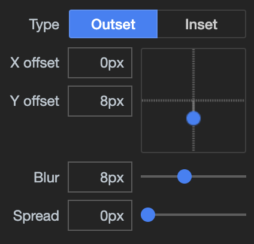
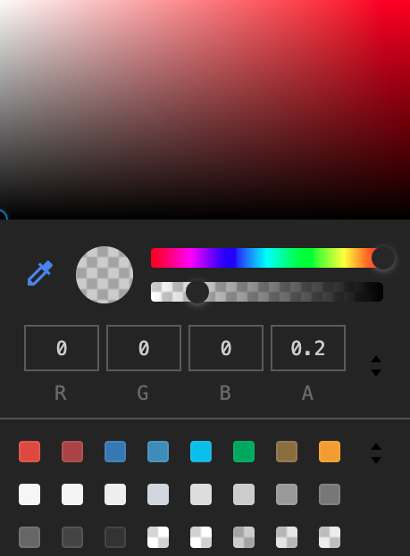

# CSS for Shiny {#beautify-css}
In the previous part, we saw how to create and manipulate HTML tags
with `{shiny}` and `{htmltools}`, as well as importing external web dependencies, especially CSS files. This is, however, far from being enough to develop apps that stand out from the pack. As introduced in \@ref(html-and-css), __CSS__ is a web language allowing a deep customization of the appearance. This part aims at providing an acceptable overview of CSS capabilities in the Shiny context, so that you may start to seamlessly and quickly __customize__ your apps.

## How to include CSS?

There are three ways to include CSS in a web page:

  - Point to an external file `<link rel="stylesheet" href="style.css"/>`.
  - Insert the style in the `head`. Not recommended for complex projects since this is hard to maintain.
  - Insert the style at the tag level, through the `style` attribute, also known as __inline__ CSS,
  and this is not recommended since it is hard to maintain. 
  
```{r, echo=FALSE, results='asis'}
html_code <- '<!DOCTYPE html>
<html lang="en">
  <head>
    <meta charset="utf-8" />
    <link rel="stylesheet" href="style.css" />
    <title>CSS</title>
    <style type="text/css">
      p {
        color: red;  
      }
    </style>
  </head>

  <body>
    <p style="color: red">Hello World</p>
    <p>Some text</p>
    <div>Plop</div>
  </body>
</html>'
code_chunk_custom(html_code, "html")
```

We advise you to follow the first method as much as you can so that you modify the CSS in only one place!
At the end of the day, your CSS script will look like the following example:

```{r, echo=FALSE, results='asis'}
css_code <- "tag1 {
  property1: value1;
  property2: value2;
}

tag2 {
  property1: value1;
}"
code_chunk_custom(css_code, "css")
```

All of the above methods apply to Shiny:

  - __External__ CSS file `tags$link(rel = "stylesheet", type="text/css", href="www/style.css")`.
  - __Internal__ CSS `tags$head(tags$style("p {color: red;}"))`.
  - __Inline__ CSS `p(style = "color:red;", "Red text")`.

However, if you correctly followed the previous part about HTML dependencies (see Chapter \@ref(htmltools-dependencies)), the best way in Shiny to create a dependency and attach it to a tag is:

```{r, eval=FALSE}
css_dep <- function() {
  htmlDependency(
    name = "css dep",
    version = "1.0",
    src = path_to_css,
    stylesheet = filename
  )
}

tagList(tag, css_dep)
```

Following this method, you make the file accessible on the server, thereby easing the debugging process. When should we apply the above method? Well, it does not make a lot of sense for tiny CSS modifications, where you could use one of the three other methods listed previously. Moreover, it is also fine for an external dependency for which you don't need
to debug or modify the code. 

## CSS selectors {#css-selectors}
CSS __selectors__ define on which elements to apply CSS rules. Below, we review the most common patterns.

### Basics
To apply CSS, we select a tag, choose the property we want to change and give it a value:

```{r, echo=FALSE, results='asis'}
css_code <- "selector {
  property: value;
}"
code_chunk_custom(css_code, "css")
```

For instance, to set the color blue to the `p` tag, we would do:

```{r, echo=FALSE, results='asis'}
css_code <- "p {
  color: red;  
}"
code_chunk_custom(css_code, "css")
```

Now, how would we apply the same property to multiple tags? We separate tags by a comma, also called a __grouping__ selector:

```{r, echo=FALSE, results='asis'}
css_code <- "p, div {
  color: red;  
}"
code_chunk_custom(css_code, "css")
```

See below an example with a Shiny app:

```{r, echo=FALSE, results='asis'}
code_chunk(OSUICode::get_example("css/selector-basics"), "r")
```

### Select by class, id
The method shown above applies to all selected tags. This is not necessarily what we want as we probably would like to filter. We first add a `class` to the first `p` tag. Best practice is to give it a meaningful name: 

```{r, echo=FALSE, results='asis'}
html_code <- '<p class="first-p"></p>'
code_chunk_custom(html_code, "html")
```

On the CSS side, we prefix the class by a `.`:

```{r, echo=FALSE, results='asis'}
css_code <- ".first-p {
  color: red;  
}"
code_chunk_custom(css_code, "css")
```

To style unique elements, we may use `id`:

```{r, echo=FALSE, results='asis'}
css_code <- "#element {
  color: red;
}"
code_chunk_custom(css_code, "css")
```

As another example, the result is shown in Figure \@ref(fig:css-simple-select):

```{r, echo=FALSE, results='asis'}
code_chunk(OSUICode::get_example("css/selector-class-id"), "r")
```

The second `p` tag is not selected. 

```{r css-simple-select, echo=FALSE, fig.cap='Select by class and id.', out.width='75%', fig.align='center'}
knitr::include_graphics("images/beautify/css-simple-select.png")
```

### Apply CSS to single elements
Let's consider the following example:

```{r, echo=FALSE, results='asis'}
html_code <- '<p>Hello World! What\'s up?</p>'
code_chunk_custom(html_code, "html")
```

How would you change the color of the `World` word? We could not select the whole `p` element, as it would apply to the
whole tag. There exists specific tags like `div` and `span` that you can apply. As stated in Chapter \@ref(web-intro-html), `span` may be used inside containers to surround words:

```{r, echo=FALSE, results='asis'}
html_code <- '<p>Hello <span class="custom">World</span>! What\'s up?</p>'
code_chunk_custom(html_code, "html")
```

```{r, echo=FALSE, results='asis'}
css_code <- ".custom {
  color: red;
}"
code_chunk_custom(css_code, "css")
```

### Advanced selectors
Until now, we've seen how to select an element by the tag name, a class and an id. Yet, this is not enough. How would you select the below tag?

```{r, echo=FALSE, results='asis'}
html_code <- '<a data-toggle="dropdown">Tag</a>'
code_chunk_custom(html_code, "html")
```

#### Select nested tags
We consider two HTML tags. We only want the first `a` element to have red text. 
We can't select by class `.nav-link` as it would also style the second element!

```{r, echo=FALSE, results='asis'}
html_code <- '<li class="nav-item">
  <a class="nav-link" href="#">Link</a>
</li>

<a class="nav-link" href="#">Link</a>'
code_chunk_custom(html_code, "html")
```

The idea is to select the first tag, that is `li`, then select its child `a`:

```{r, echo=FALSE, results='asis'}
css_code <- "li a {
  color: red;
}"
code_chunk_custom(css_code, "css")
```

The Shiny `navbarPage` template is composed of navigation items `li` and `a`, which we may easily modify:

```{r, echo=FALSE, results='asis'}
code_chunk(OSUICode::get_example("css/selector-nested/ex1"), "r")
```

```{r css-combined-selectors-1, echo=FALSE, fig.cap='Style all nav link elements.', out.width='50%', fig.align='center'}
knitr::include_graphics("images/beautify/css-combined-selectors-1.png")
```

You'll notice that `tabsetPanel()` tabs are also modified, which is not exactly what we wanted, as shown in Figure \@ref(fig:css-combined-selectors-1). The main difference between `navbarPage()` and `tabsetPanel()` is the class held by the the menu wrapper `ul`:

```{r, eval=FALSE}
navbarPage(tabPanel("test"))
```

```{r, echo=FALSE}
if (knitr::is_html_output()) {
  navbarPage(tabPanel("test"))
}
```

```{r, echo=FALSE, results='asis'}
code <- '<nav class="navbar navbar-default navbar-static-top" 
  role="navigation">
  <div class="container-fluid">
    <div class="navbar-header">
      <span class="navbar-brand">
        <div class="tab-pane" title="test" 
        data-value="test"></div>
      </span>
    </div>
    <ul class="nav navbar-nav" data-tabsetid="2341"></ul>
  </div>
</nav>
<div class="container-fluid">
  <div class="tab-content" data-tabsetid="2341"></div>
</div>'
exclude_from_html(code)
```

```{r, eval=FALSE}
tabsetPanel(tabPanel("test"))
```

```{r, echo=FALSE}
if (knitr::is_html_output()) {
  tabsetPanel(tabPanel("test"))
}
```

```{r, echo=FALSE, results='asis'}
code <- '<div class="tabbable">
  <ul class="nav nav-tabs" data-tabsetid="6625">
    <li class="active">
      <a href="#tab-6625-1" data-toggle="tab" 
        data-value="test">test
      </a>
    </li>
  </ul>
  <div class="tab-content" data-tabsetid="6625">
    <div class="tab-pane active" data-value="test" 
      id="tab-6625-1">
    </div>
  </div>
</div>'
exclude_from_html(code)
```

which is `nav navbar-nav` for `navbarPage()` and `nav nav-tabs` for `tabsetPanel()`.
To isolate `navbarPage()` tabs, we have to improve our previous selector:

```{r, echo=FALSE, results='asis'}
css_code <- ".navbar-nav li a {
  font-size: 20px;
  font-weight: bold;
}"
code_chunk_custom(css_code, "css")
```

Doing so, we'll only look at the link elements inside the container having the `navbar-nav` class. 

```{r, echo=FALSE, results='asis'}
code_chunk(OSUICode::get_example("css/selector-nested/ex2"), "r")
```

The final result is depicted in Figure \@ref(fig:css-combined-selectors-2). 

```{r css-combined-selectors-2, echo=FALSE, fig.cap='Style specific navbar nav link elements.', out.width='50%', fig.align='center'}

```

#### Select by attributes
To select by attribute, we use `tag[attribute]`:

```{r, echo=FALSE, results='asis'}
html_code <- '<a data-toggle="dropdown">Tag</a>
<a data-toggle="my dropdown">Tag</a>
<a data-toggle="whatever">Tag</a>'
code_chunk_custom(html_code, "html")
```

The below CSS code selects all `a` tags having a `data-toggle` attribute:

```{r, echo=FALSE, results='asis'}
css_code <- "a[data-toggle] {
  color: red;
}"
code_chunk_custom(css_code, "css")
```

while the following code, will only select the first `a` tag:

```{r, echo=FALSE, results='asis'}
css_code <- "a[data-toggle=\"dropdown\"] {
  color: red;
}"
code_chunk_custom(css_code, "css")
```

The reason is that we exactly match the `dropdown` value!

We could be less specific: 

```{r, echo=FALSE, results='asis'}
css_code <- "a[data-toggle*=\"dropdown\"] {
  color: red;
}"
code_chunk_custom(css_code, "css")
```

`*` checks whether the word `dropdown` is there but not the position. You may use `^` and `$` like you do with regular expressions to check if the value starts or ends by the specified word, respectively.


#### Other selectors

##### Direct descendants
Let's consider a `navbarPage()` with nested navigation. This is accomplished with the `navbarMenu()` function:

```{r, eval=FALSE}
navbarPage(
  "App Title",
  tabPanel("Plot"),
  navbarMenu(
    "More",
    tabPanel("Summary"),
    "----",
    "Section header",
    tabPanel("Table")
  )
)
```

The resulting HTML code is as follow:

<!-- I copied an paste just for a formatting reasons
to avoid code from going outside margins in the pdf output -->

```{r, echo=FALSE}
if (knitr::is_html_output()) {
  navbarPage(
    "App Title",
    tabPanel("Plot"),
    navbarMenu(
      "More",
      tabPanel("Summary"),
      "----",
      "Section header",
      tabPanel("Table")
    )
  )
}
```

```{r, echo=FALSE, results='asis'}
code <- '<ul class="nav navbar-nav" data-tabsetid="5879">
  <li class="active">
    <a href="#tab-5879-1" data-toggle="tab" data-value="Plot">
      Plot
    </a>
  </li>
  <li class="dropdown">
    <a href="#" class="dropdown-toggle" data-toggle="dropdown" 
    data-value="More">
      More
      <b class="caret"></b>
    </a>
    <ul class="dropdown-menu" data-tabsetid="7141">
      <li>
        <a href="#tab-7141-1" data-toggle="tab" 
        data-value="Summary">Summary</a>
      </li>
      <li class="divider"></li>
      <li class="dropdown-header">Section header</li>
      <li>
        <a href="#tab-7141-4" data-toggle="tab" 
        data-value="Table">Table</a>
      </li>
    </ul>
  </li>
</ul>'
exclude_from_html(code)
```

There are two `ul` menus with multiple `li` and `a` inside. Applying our previous CSS selector as depicted in Figure \@ref(fig:css-direct-child-1) selects all links. 

```{r, echo=FALSE, results='asis'}
code_chunk(OSUICode::get_example("css/selector-descendant"), "r")
```

```{r css-direct-child-1, echo=FALSE, fig.cap='Style all navbar nav link elements.', out.width='50%', fig.align='center'}
knitr::include_graphics("images/beautify/css-direct-child-1.png")
```

What if we only want to select the direct `a` children of the outer menu, meaning we exclude the inner menu links? Using the __child combinator__ `>`, we can select direct children and not all descendants that could contain grand children.

```{r, echo=FALSE, results='asis'}
css_code <- ".navbar-nav > li > a {
  font-size: 20px;
  font-weight: bold;
}"
code_chunk_custom(css_code, "css")
```

Result is displayed in Figure \@ref(fig:css-direct-child-2):

```{r, echo=FALSE, results='asis'}
code_chunk(OSUICode::get_example("css/selector-direct-descendant"), "r")
```

```{r css-direct-child-2, echo=FALSE, fig.cap='Style only direct children navbar nav link elements.', out.width='50%', fig.align='center'}
knitr::include_graphics("images/beautify/css-direct-child-2.png")
```

Well, what if we want to be even more specific and get only the very first nav link element? 
We have to introduce pseudo-classes.

##### Pseudo-classes {#css-pseudo-classes}
A __pseudo-class__ starts with the `:` symbol. For instance, `a:active` styles active links and `button:disabled` applies for disabled buttons.

```{r, echo=FALSE, results='asis'}
css_code <- "a:active {

}

button:disabled {

}

checkbox:checked {

}"
code_chunk_custom(css_code, "css")
```

There exists many pseudo-classes types, particularly the structural ones. Those are useful to select specific children like `element:first-child`. Going back to the `navbarPage()` example, we could refine our CSS selector adding `:first-child` to the `li` element as we want to only select the first item:

```{r, echo=FALSE, results='asis'}
css_code <- ".navbar-nav > li:first-child > a {
  font-size: 20px;
  font-weight: bold;
}"
code_chunk_custom(css_code, "css")
```

As expected, only the first link is styled, as demonstrated in Figure \@ref(fig:css-direct-child-3).

```{r, echo=FALSE, results='asis'}
code_chunk(OSUICode::get_example("css/selector-pseudoclass"), "r")
```

```{r css-direct-child-3, echo=FALSE, fig.cap='Style only the first navbar nav link element.', out.width='50%', fig.align='center'}
knitr::include_graphics("images/beautify/css-direct-child-3.png")
```

##### Pseudo-elements {#css-pseudoelements}

__Pseudo-elements__ are preceded by `::`. The most famous ones are `::before` and `::after`, that respectively apply before and after the selected element.

```{r, echo=FALSE, results='asis'}
css_code <- "a::before {

}

a::after {

}"
code_chunk_custom(css_code, "css")
```

For instance `.navbar-nav > li:first-child > a::before` will insert an element before the very first navbar link.

```{r css-pseudoelements-code, echo=FALSE, results='asis'}
code_chunk(OSUICode::get_example("css/selector-pseudoelement"), "r")
```

As an exercise, you may change `a::before` to `a::after` and notice how the emoji behaves in the above example.

```{r css-pseudoelements-before, echo=FALSE, fig.cap='Add before pseudo-element.', out.width='50%', fig.align='center'}
knitr::include_graphics("images/beautify/css-pseudoelements-before.png")
```

## Best practices

### DRY principle
__DRY__ stands for "Don't repeat yourself". This methodology not only applies to structural languages like R and JavaScript but also to declarative languages like CSS. Below is an example of badly managed CSS code. Both `.class-1` and `.class-2` have the same color and border radius. Only the padding and font size change. This type of code does not follow the DRY rule and increases the risk of having contradictory CSS properties.

```{r, echo=FALSE, results='asis'}
css_code <- ".class-1{
  color: #33BEFF;
  padding: 10px 16px;
  font-size: 12px;
  border-radius: 3px;
}

.class-2{
  color: #33BEFF;
  padding: 5px 10px;
  font-size: 12px;
  border-radius: 3px;
}"
code_chunk_custom(css_code, "css")
```

We could gather all common properties in one __generic class__:

```{r, echo=FALSE, results='asis'}
css_code <- ".generic {
  color: #33BEFF;
  border-radius: 3px;
}

.specific-1 {
  padding: 10px 16px;
  font-size: 18px;
}

.specific2 {
  padding: 5px 10px;
  font-size: 12px;
}"
code_chunk_custom(css_code, "css")
```

On the HTML side, we add classes from the most generic to the most __specific__ like:

```{r, echo=FALSE, results='asis'}
html_code <- '<div class="generic specific-1">My element</div>
<div class="generic specific-2">My element</div>'
code_chunk_custom(html_code, "html")
```

As an even more concrete example, take a look at the [bulma](https://bulma.io/documentation/elements/button/) button:

```{r, echo=FALSE, results='asis'}
html_code <- '<button class="button is-large is-fullwidth">Large</button>'
code_chunk_custom(html_code, "html")
```

Notice how easy it is to predict the style of the button. It will be large and take the maximum width. It is for sure more meaningful than seeing a `.class1`!

### Selector specificity
What happens in case multiple different selectors target the same element? Which style is really applied? Consider the following example:

```{r, echo=FALSE, results='asis'}
html_code <- '<div id="element" class="myclass">Some text</div>'
code_chunk_custom(html_code, "html")
```

with the following CSS rules:

```{r, echo=FALSE, results='asis'}
css_code <- "#element {
  color: red;
}

.myclass {
  color: blue;
}

div {
  color: green;
}"
code_chunk_custom(css_code, "css")
```

Can you guess what would be the element text color? Well, this is not obvious. You must understand that web browsers apply rules to select the more specific rules:

  - Inline style is the most specific. This is style directly attached to the HTML tag.
  - `id` applies to unique objects.
  - `class`, `pseudoclasses`, attributes.
  - elements and pseudo-elements.

Going back to our previous example, the most specific selector is `#element`, therefore the text color will be red. What happens in case of equality? The last written selector is applied:

```{r, echo=FALSE, results='asis'}
html_code <- '<div class="class1 class2">Some text</div>'
code_chunk_custom(html_code, "html")
```

```{r, echo=FALSE, results='asis'}
css_code <- ".class1 {
  color: blue;
}

.class2 {
  color: red;
}"
code_chunk_custom(css_code, "css")
```

Only the second selector is applied to the tag. To apply `class1`, you must move it after the `class2` style definition. 

Best practice is to keep the lowest specificity as possible, thereby making `.class` the first choice. 

### Block element modified (BEM)
The BEM [methodology](http://getbem.com/introduction/) will help you to write meaningful CSS, easier to manage. 
A block is a standalone entity having a self-explanatory name like `header`, `checkbox`. An elements is part of the block but not standalone like menu items. 
A modifier indicates a specific state of an element, for instance if a button is disabled, active, ... The general scheme is defined below:

```{r, echo=FALSE, results='asis'}
css_code <- ".block__element--modifier {
/* rules */
}"
code_chunk_custom(css_code, "css")
```

Following this methodology guaranties you have documented and meaningful classes.

## Modify CSS with the HTML inspector

### Add inline properties
1. Run the following app:

<!-- We will not deploy this app. This is not informative -->

```{r, eval=FALSE}
ui <- fluidPage(
  tags$style("p { color: red;}"),
  p("Hello World")
)

server <- function(input, output, session) {}

shinyApp(ui, server)
```

2. Right-click the `p` element and open the inspector. In the `Styles` tab, notice the `element.style` section. This is to define inline new CSS rules for the selected item. 

3. Let's add two rules by clicking inside the `element.style` container:

  - `border-style: dashed`. Indicates we want a box with dashed border
  - `border-color: ...`. To set a border color

After typing enter, the inline CSS is automatically added in the tag element.

You probably noticed the auto-suggestion feature while typing a property, as shown in Figure \@ref(fig:html-dom-css), being particularly handy when learning CSS.

```{r html-dom-css, echo=FALSE, fig.cap='Edit CSS with Chrome DevTools.', out.width='100%'}
knitr::include_graphics("images/survival-kit/dom-css.png")
```

### View local changes
Whenever playing around with a web page style or a shiny app, it may be good to have an overview of all changes when you are satisfied about the new design. 

1. Run the previous shiny app example and open the inspector.
2. In the Styles tab, add some new CSS properties to the first p element set of rules.
3. Once done press enter and click on the file name located at the top-right corner of the property box.
4. This opens the Sources tab. In the left sidebar, right click on the file name (index) and select `Local Modifications`.
5. This opens a `Git` like diff panel called `Changes` where you can review any change and see the previous values. If you refresh the page, you will lose every local change, unless the persistent authoring feature is active.

```{r html-dom-css-changes, echo=FALSE, fig.cap='Review all CSS changes.', out.width='100%'}
knitr::include_graphics("images/survival-kit/dom-css-changes.png")
```  

To get a deeper understanding of the different CSS options please refer to the Google [documentation](https://developers.google.com/web/tools/chrome-devtools/css).

## CSS in action

We review the most commonly used CSS properties such as text styling, shadows, color and background color, ...

### Text Styling

#### Fonts
__Fonts__ control the text appearance and may be changed as below:

```{r, echo=FALSE, results='asis'}
css_code <- "tag {
  font-family: mypolice1, mypolice2, ..., serif;
}"
code_chunk_custom(css_code, "css")
```

In practice, we enter multiple font values, in case the end user does not have the same
font. The last values are composed of generic polices like `serif` and `monospace`. 
For instance, Bootstrap 3 utilizes the default `sans-serif` police. A neat tool to inspect the current text fonts is the HTML inspector CSS Overview tab, as shown Figure \@ref(fig:css-overview-font-family). 

```{r css-overview-font-family, echo=FALSE, fig.cap='Overview of the font properties.', out.width='100%'}
knitr::include_graphics("images/beautify/css-overview-font-family.png")
``` 

Custom fonts may be downloaded with `@font-face`, but there are few prerequisites to make them render properly:

  - The file format must be correctly handled by the end-user web browsers. There are currently `.ttf` (works on almost all web browsers), `.woff` (works on almost all web browsers), `.svg` (iPhone and iPad), `.eot` (IE only) and `.otf` (doesn't work on IE).
  - Those files have to be downloaded, which may take time.
  - Most fonts are not open source.
  
```{r, echo=FALSE, results='asis'}
css_code <- "@font-face {
  font-family: 'customPolice';
  src: url('customPolice.ttf'),
       url('customPolice.woff');
}"
code_chunk_custom(css_code, "css")
```

Importantly, the font files must be accessible to the CSS file where they are called from. As another example, the below code means that the `fonts` folder is located one level above the CSS file:

```{r, echo=FALSE, results='asis'}
css_code <- "@font-face {
  font-family: 'Framework7 Icons';
  font-style: normal;
  font-weight: 400;
  src: url(\"../fonts/Framework7Icons-Regular.eot\");
  src: url(\"../fonts/Framework7Icons-Regular.woff2\"),
       url(\"../fonts/Framework7Icons-Regular.woff\"),
       url(\"../fonts/Framework7Icons-Regular.ttf\");
}"
code_chunk_custom(css_code, "css")
```

Chapters \@ref(beautify-with-bootstraplib) and \@ref(beautify-with-fresh) expose convenient methods to seamlessly handle Shiny app's font. 

#### Size
To change the text size, we use the `font-size` property. From there, you have two choices:

  - __Relative__ size (first choice) like `small`, `medium`, ...
You may also find notations like `1em` (default size), `1.8em` being bigger and `0.5em` being smaller; as well as percentages.
  - __Absolute__ size: 16px, 20px, ...

In the following example, the second `h1` tag is smaller than the default one, so is `p`:

```{r, echo=FALSE, results='asis'}
code_chunk(OSUICode::get_example("css/font-size"), "r")
```

#### Alignment
This is a job for `text-align` which accepts four values (left, center, right and justify). Importantly, this does not work for inline tags like `span`!

#### Other styling properties
You can also put any text in bold, italic using `font-style: italic` and `font-weight: bold`, respectively.

### Colors
We have already mentioned this property before in the previous examples. In CSS, there are four ways to apply colors to a text or to the background:

  - Using the __hexadecimal__ notation (HEX). For instance `#FFFFFF` corresponds to the white color. Given a color code, unless you already know it, the result is quite hard to predict. Could you guess what is the result of `#4b0082`? 
  - Using the __rgb__ code. If you ever followed art courses, this is the classic system used in painting, by mixing colors. `rgb` stands for red, green and blue. Each scale goes from 0 to 255 (256 choices), which gives a weight to each color! Why 255? Because `256*256*256` gives about 16 millions colors, the maximum number of colors that the actual screen can display.
  - Using the __hsl__ convention. `hsl` stands for hue, saturation and lightness. Saturation and lightness are expressed in percentage from 0 to 100. The hue goes from red (0) to 360 (a sort of red) each time incrementing by 15. The yellow color is 60.
  - Using the __color name__ like `ghostwhite`, `maroon`, `red`...

While `rgb` and `hsl` give an unlimited number of possibilities, HTML color names are not infinite.
There are many tools allowing you to get each of those codes, for example, color pickers:

  - https://html-color.codes/
  - https://www.w3schools.com/colors/colors_picker.asp

#### Text color
Given the methods listed above, we use the `color` property to change any text color. For obvious colors like `red`, this is not necessary to use the `rgb` convention.

```{r, echo=FALSE, results='asis'}
css_code <- "p {
  color: red;
}"
code_chunk_custom(css_code, "css")
```

#### Background color
__backgound-color__ is the property necessary to apply a given color to the __background__. To change to page background color, we target the `body` tag, but you could also target any tag like `p`.

Colors may be seamlessly tweaked with the developer tools as shown later in Figure \@ref(fig:box-shadow-tool-2).

### Borders and shadows
These effects may be applied to text and block elements. The easiest way to set up a __border__ is to leverage the `border` property, which accepts three parameters:

  - The border __width__ in px.
  - The border __color__ with any valid CSS color like `rgb()`, `red`, ...
  - The border __type__, which corresponds to the border style (`none`, `solid`, 
  `dotted`, `dashed`, `double`, `groove`, `ridge`, `inset` and `outset`). In practice, we mostly use `solid`.
  
There exists other properties such as __border-radius__, which controls the shape of the corners from top left to bottom left. The higher the value the more rounded is the corner.

If for any reason, you want to fine-tune the border position, there are four properties: __border-top__, __border-bottom__, __border-left__ and __border-right__. 

Finally, __shadows__ are controlled by two properties:

  - __text-shadow__, which applies a shadow to a text element (rarely used).
  - __box-shadow__ for styling blocks. 
  
For instance:

```{r, echo=FALSE, results='asis'}
css_code <- "block {
  box-shadow: 2px 2px 0px black;
}"
code_chunk_custom(css_code, "css")
```
  
The `box-shadow` [property](https://www.w3schools.com/cssref/css3_pr_box-shadow.asp) takes four main parameters:

  - The __horizontal offset__ in px.
  - The __vertical offset__ in px.
  - The __blur radius__ value in px. The higher the more blurred. 
  - The shadow color. 
  
Do you remember the `{shinydashboard}` box that we imported inside a simple Shiny app in Chapter \@ref(htmldeps-import)? This box has been included in the `{OSUICode}` side package. Let's add some border and shadows:

```{r, echo=FALSE, results='asis'}
code_chunk(OSUICode::get_example("css/custom-box/start"), "r")
```


The `box` class is styled as follows and shown Figure \@ref(fig:box-shadow-1):

```{r, echo=FALSE, results='asis'}
css_code <- ".box {
  border-radius: 3px;
  border-top: 3px solid #d2d6de;
  box-shadow: 0 1px 1px rgb(0 0 0 / 10%);
}"
code_chunk_custom(css_code, "css")
```

```{r box-shadow-1, echo=FALSE, fig.cap='{shinydashboard} box style.', out.width='100%'}
knitr::include_graphics("images/beautify/box-shadow-1.png")
``` 

The `border-radius` of 3px indicates that the box is slightly rounded on all corners.
There is a top solid border whose color is gray as well as a tiny shadow. 
Let's increase the `border-radius` to 10px, change the top border to `border-left` with an orange color and slightly increased thickness:

```{r, echo=FALSE, results='asis'}
css_code <- ".box {
  border-radius: 10px;
  border-left: 6px solid #e28810;
  box-shadow: 0 1px 1px rgb(0 0 0 / 10%);
}"
code_chunk_custom(css_code, "css")
```

We would like to increase the shadow effect only on mouse hover, with reasonable values. To proceed we leverage the pseudo format elements like `:hover`:

```{r, echo=FALSE, results='asis'}
css_code <- ".box:hover {
  box-shadow: 0px 8px 8px 0px rgb(0, 0, 0, 0.2);
}"
code_chunk_custom(css_code, "css")
```

The easiest way to modify the shadow style is directly inside the HTML inspector, as demonstrated in Figure \@ref(fig:box-shadow-tool-1). Next to the property text, there is a button to open the shadow editor. We click on it, which opens a box with input to control the shadow offset, the blur and the spread parameter. We leave the effect outside the box, that is, `outset` is unchanged. To change the color, we click on the color widget next to the rgb value, which opens Figure \@ref(fig:box-shadow-tool-2). 


```{r box-shadow-tool-1, echo=FALSE, fig.cap='Box shadow shape tools.', out.width='30%', fig.align='center'}

``` 

```{r box-shadow-tool-2, echo=FALSE, fig.cap='Box shadow color tools.', out.width='30%', fig.align='center'}

``` 

We finally include this new CSS rule inside the previous app. Optionally, we may change
the color of the text header to be white, to improve the contrast with the box background. (See Figure \@ref(fig:box-shadow-result)):

```{r, echo=FALSE, results='asis'}
code_chunk(OSUICode::get_example("css/custom-box/end"), "r")
```

```{r box-shadow-result, echo=FALSE, fig.cap='Improved box shadow on hover.', out.width='50%', fig.align='center'}
knitr::include_graphics("images/beautify/box-shadow-result.png")
``` 

### Animations {#css-animations}

Properly utilized, CSS __animations__ are a powerful way to highlight a specific part of your app, without any line of JavaScript code. For instance, assume you have an application that requires users to click on a run button after filling some parameters. You may want to indicate to the user that they can click on it. However, I would recommend playing the animation __once__ or adding a disable option, as it might cause more __frustration__ if people visit your app quite frequently.  

To create an animation, you have to leverage the `@keyframes` [rule](https://www.w3schools.com/css/css3_animations.asp). This basically describes what happens and when during the animation. For instance:

```{r, echo=FALSE, results='asis'}
css_code <- "@keyframes animation {
  from {property: value;}
  to {property: new_value;}
}"
code_chunk_custom(css_code, "css")
```

Alternatively, you may also use __percentages__, which is more flexible as you may introduce multiple
changes. The percentage is calculated based on the overall animation duration, that is, if the animation lasts 4 seconds, 50% corresponds to 2s:

```{r, echo=FALSE, results='asis'}
css_code <- "@keyframes my-animation {
  0%   {property: value1;}
  25%  {property: value2;}
  50%  {property: value3;}
  /* ... */
  100% {property: value4;}
}"
code_chunk_custom(css_code, "css")
```

We try below in a simple Shiny app, where we simply change the text color from black to red:

```{r, echo=FALSE, results='asis'}
code_chunk(OSUICode::get_example("css/animations/basic-broken"), "r")
```

Nothing happens. Could you spot why?
We forgot to attach the animation to the element. You may use the `animation` super property or multiple properties as shown below:

```{r, echo=FALSE, results='asis'}
css_code <- "element {
  animation: name, duration, delay, count, ...;
  /* OR */
  animation-name: ...,
  animation-duration: ...,
  /* ... */
}"
code_chunk_custom(css_code, "css")
```

If you want to keep the last state of the animation active, use `animation-fill-mode: forwards;`. 
You also may want to give time to the user to open the page before playing the animation, especially if the latter has a short duration. Therefore, it is often advised to specify a __delay__ with `animation-delay`. 

Let's try again below.

```{r, echo=FALSE, results='asis'}
code_chunk(OSUICode::get_example("css/animations/basic"), "r")
```

To close this section, I propose creating a very simple Shiny app that calculates the sum of two numbers. It relies on a run button to update the result. The goal is to make it blinking one second after the app starts, for 3 seconds. We first design the animation, calling it `blink`. We decide to utilize the `background-color` property, which fills the button with green. To add more effect to the button border, we also leverage `box-shadow`. Finally, we change the button text color to white, to improve the color contrast. The animation consists of one step, that is, at 50% of the animation, we apply a green background and add box shadow to the element. As an exercise, you may add more steps with extra colors for a smoother transition. The code is found below.

```{r, echo=FALSE, results='asis'}
css_code <- "@keyframes blink {
  50% {
    background-color: #16a520;
    box-shadow: 0 0 10px 2px #16a520;
    color: white;
  }
}"
code_chunk_custom(css_code, "css")
```

We apply the animation with a delay of 1 second, each cycle lasts 1 second, repeated three times:

```{r, echo=FALSE, results='asis'}
css_code <- ".blink-green {
  animation: blink 1s 1s 3 linear;
}"
code_chunk_custom(css_code, "css")
```

Notice the fourth parameter, which corresponds to the `animation-timing-function` [property](https://developer.mozilla.org/en-US/docs/Web/CSS/animation-timing-function). It controls the animation speed curve. Passing it the `linear` value ensures a smoother transition than using the default `ease`. The whole code is shown below. 

```{r, echo=FALSE, results='asis'}
code_chunk(OSUICode::get_example("css/animations/blink"), "r")
```

### Layout
As mentioned in section \@ref(web-intro-html), there exists `block` and `inline` tags. While block elements are displayed under each other, inline elements are added next to each other, as shown in Figure \@ref(fig:css-layout-intro).

```{r css-layout-intro, echo=FALSE, fig.cap='Inline and block elements.', out.width='25%', fig.align="center"}
knitr::include_graphics("images/beautify/css-layout-intro.png")
```

CSS allows deep customization of block elements like setting up the width, height and margin. Let's review them below.

#### Style blocks

As shown in Figure \@ref(fig:css-block-box), a block tag may be seen as a box. CSS allows you to set internal and external __margins__. Internal margins, also called __padding__, is the space between the block border and the content, in all directions. External margins also known as __margin__ are all spaces between blocks in all directions. A block is also defined by a __width__ and __height__, as well as optional minimal width and height. Width and height may be set either using absolute unites (px) or relative unites (%), but minimal values are always absolute. Minimal values are useful in case the end user resizes the windows.

The corresponding CSS properties are found below:

```{r, echo=FALSE, results='asis'}
css_code <- ".block {
  width: 50%; /* % also work and will be relative size*/
  height: 200px;
  min-width: 200px;
}"
code_chunk_custom(css_code, "css")
```

Padding and margins are called CSS __super properties__. Indeed, setting `padding: 10px` guarantees having 10px in all directions. If you need custom values, you will have to specify the directions:

```{r, echo=FALSE, results='asis'}
css_code <- ".block {
  padding: 10px;
  margin-top: 10px;
  margin-left: 5px;
}"
code_chunk_custom(css_code, "css")
```

There exists a shortcut `margin: 5px 0 5px 2`, which means 5px on the top, 0px on the right, 5px on the bottom and 2px on the left. To remember the good order, it is __clockwise__ (top, right, bottom, left). Specifying only 2 values `margin: 5px 2.5px` means 5px top and bottom, 2.5px left and right. All of the above obviously applies to padding!

```{r css-block-box, echo=FALSE, fig.cap='Blocks layout.', out.width='100%'}

```

Using margin allows you to center a block when `margin: auto` is applied in combination with a given width.

What happens when the content inside a block is bigger than the block itself?
We apply the __overflow__ super property that acts either horizontally or vertically. To have only vertical overflow, choose `overflow-y`. The overflow property has four possible values:

- __visible__ shows the content.
- __hidden__ hides the content that goes outside the block.
- __scroll__ shows scrolling bars in all directions to see the hidden content.
- __auto__ lets the web browser decide.

Let's apply our newly acquired knowledge to a simple Shiny app.

```{r, echo=FALSE, results='asis'}
code_chunk(OSUICode::get_example("css/layout/blocks"), "r")
```

Well, is that all? I could do better by combining `fluidRow` and `column`! Indeed, those two functions are part of the grid system built on top of __flexbox__. Let's talk about this in the next section.

#### Flexbox {#beautify-css-flexbox}
The [flexbox](https://css-tricks.com/snippets/css/a-guide-to-flexbox/) ("flexible boxes") model is a game changer in layout development as it allows you to seamlessly:

  - Align items in a container.
  - Ensure those items fill the same space.

The first step is to define the main container and give the flex value to the display property:

```{r, echo=FALSE, results='asis'}
css_code <- ".container {
  display: flex;
}"
code_chunk_custom(css_code, "css")
```

Once done, we have to define the direction, that is __flex-direction__ with four choices, as shown Figure \@ref(fig:css-flexbox-direction):

  - row
  - row-reverse
  - column
  - column-reverse

```{r css-flexbox-direction, echo=FALSE, fig.cap='Flexbox directions.', out.width='100%'}
knitr::include_graphics("images/beautify/css-flexbox-direction.png")
```

Below is an example involving Shiny. We first define the container CSS, where `display: flex` and `flex-direction: row` set the flexbox display. We also add a border to better see the container limits:

```{r, echo=FALSE, results='asis'}
css_code <- ".container {
  display: flex;
  flex-direction: row;
  border: red dashed 2px;
}"
code_chunk_custom(css_code, "css")
```

Then, we define the style for container elements, that are `p` tags. We give them a width and height to better see the blocks. Each child has a given background color with the `:nth-child(n)` pseudo-class. As an exercise, you may try to replace the `flex-direction` by any of the four values and see how blocks move in the main container:

```{r, echo=FALSE, results='asis'}
code_chunk(OSUICode::get_example("css/layout/flexbox"), "r")
```

The __flex-wrap__ property may be useful to control how blocks are arranged:

  - __nowrap__ (default) puts all items on the same row.
  - __wrap__ puts items on multiple lines from top to bottom.
  - __wrap-reverse__ puts items on multiple lines from bottom to top.

Interestingly, both `flex-wrap` and `flex-direction` may be merged with `flex-flow: direction wrap mode`.

Items may be aligned either on the principal axis defined in the container CSS or on the secondary axis, called cross-axis:

  - __justify-content__ may take the following values: `flex-start` (default), `flex-end`, `center`, `space-between`, `space-around` and `space-evenly`.
  - __align-items__ whose values can be `stretch` (default), `flex-start`, `flex-end`, `center` and `baseline`.

`justify-content` and `align-items` are applied at the container level and not on individual items! Whenever the container has multiple lines, as a result of a `flex-wrap: wrap` or `flex-flow: ... wrap`, we use `align-content` to align on the cross-axis (flex-start, flex-end, center, stretch by default, space-between, space-around).

__flexbox__ is a mono-dimensional system.

#### Grid model
As mentioned above, `fluidRow` and `column` leverage the Bootstrap [grid](https://getbootstrap.com/docs/4.3/layout/grid/) system, which uses Flexbox. This is unfortunately rather complex and out of the scope of this book. 


### Responsive design: media queries {#beautify-css-responsive}
At the very beginning of the web, there were no smart phones or tablets. All websites
were mostly designed to be displayed on fixed computer screens. Everything has changed now, which leads to several problems for non-responsive sites. 

__Media queries__ are convenient to solve this issue. They allow you to set up rules depending
on various conditions. The structure is defined as follows:

```{r, echo=FALSE, results='asis'}
css_code <- "@media rule1 {
  /* CSS */
}

/* We may combine rules */

@media rule1 and rule 2 and ... {
  /* CSS */
}"
code_chunk_custom(css_code, "css")
```

For instance, assuming you want to increase the text size, only for mobile devices:

```{r, echo=FALSE, results='asis'}
css_code <- "@media all and (max-device-width: 480px) {
  p {
    font-size: 1.5em;
  }
}"
code_chunk_custom(css_code, "css")
```

`all` stands for all screen sizes, and the second request target devices having a width
of 480px, at most. 

In a Shiny app, this would give:

```{r, echo=FALSE, results='asis'}
code_chunk(OSUICode::get_example("css/media-queries/basic"), "r")
```

As shown in Figure \@ref(fig:media-queries), the developer tools have a responsive mode,
which you can enable by clicking on the blue button next to the `Elements` tabs. 
The responsive mode lets you define the __viewport__ dimensions, that is the height and width of the web browser page, so as to test the media queries. We set the width to 480px so that the text size appears increased. You may try with 481px and see that this text becomes smaller. Be careful, the responsive mode tool does not display the web browser navigation bars, nor the status bar (the bar containing the battery icon and various indicators). Be sure to select the `...` icon to enable the `show media queries` and `show rulers` options. The media query option provides a better visualization of the media query range versus the current screen width, while the ruler helps to fine-tune the design. 

```{r media-queries, echo=FALSE, fig.cap='HTML inspector in responsive mode.', out.width='100%'}
knitr::include_graphics("images/beautify/media-queries.png")
```

Let's consider another example, involving `shiny::modalDialog`. This function displays
a Bootstrap 3 modal, whose design is partly controlled by media queries. We run the app below and open the developer tools:

```{r, echo=FALSE, results='asis'}
code_chunk(OSUICode::get_example("css/media-queries/modal"), "r")
```

The corresponding CSS rules are located in the Bootstrap (3) CSS file:

```{r, echo=FALSE, results='asis'}
css_code <- "@media (min-width: 768px) {
  .modal-dialog {
    width: 600px;
    margin: 30px auto;
  }
  .modal-content {
    -webkit-box-shadow: 0 5px 15px rgba(0, 0, 0, 0.5);
    box-shadow: 0 5px 15px rgba(0, 0, 0, 0.5);
  }
  .modal-sm {
    width: 300px;
  }
}
@media (min-width: 992px) {
  .modal-lg {
    width: 900px;
  }
}"
code_chunk_custom(css_code, "css")
```

The first query fixes a width of 600px for all modals having the `.modal-dialog` class (default), as long as the screen size is at least 768px. Moreover, if the modal has the `modal-sm` class, its width is set to 300px. Finally, as soon as the screen width is higher or equal to 992px, all modals having the `.modal-lg` class have a width set to 900px. 

Figure \@ref(fig:responsive-modal) illustrates the modal responsiveness.

```{r responsive-modal, echo=FALSE, fig.cap='Responsive modal. Top: first media query is fullfilled, width is 600px. Bottom: First media query not met, width is set to auto.', fig.show="hold", fig.align="center", out.width='100%'}
knitr::include_graphics("images/beautify/modal-768.png")
knitr::include_graphics("images/beautify/modal-600.png")
```

In Figure \@ref(fig:modal-size), we changed the modal size from `s` to `l` (top and bottom, respectively). 

```{r modal-size, echo=FALSE, fig.cap='Changed modal size. Top: small modal when screensize is at least 768px. Bottom: large modal when screen size is at least 992px.', fig.show="hold", fig.align="center", out.width='100%'}
knitr::include_graphics("images/beautify/modal-s-768.png")
knitr::include_graphics("images/beautify/modal-l-992.png")
```

This has strong implications for the modal size on mobiles. As long as the screen size is
lower than 768px, the size parameter is ignored!
