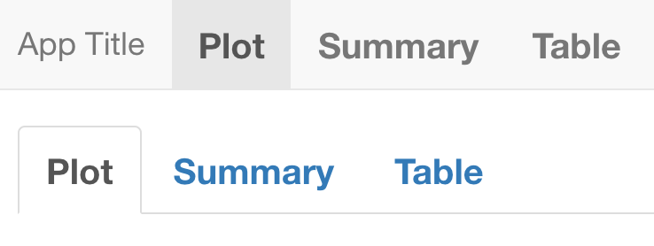

# CSS for Shiny {#beautify-css}
The first CSS version was released in 1996, that is 5 years later than HTML. Before CSS appeared, developers styled their pages with specific tags like `font`, which eventually made the HTML code hard to maintain. The current version of CSS is 3. While nowadays all web browsers support CSS, this was not the case at the very beginning! 

## How to include CSS?

There are 3 ways to include CSS in a web page:

  - Point to an external file `<link rel="stylesheet" href="style.css"/>`
  - Insert the style in the `head`
  - Insert the style at the tag level, through the `style` attribute

```html
<!DOCTYPE html>
<html lang="en">
    <head>
        <meta charset="utf-8" />
        <link rel="stylesheet" href="style.css" />
        <title>CSS</title>
        <style type="text/css">
          p {
            color: red;  
          }
        </style>
    </head>

    <body>
        <p style="color: red">Hello World</p>
        <p>Some text</p>
        <div>Plop</div>
    </body>
</html>
```

I recommend to follow the first method as much as you can so that you modify the CSS in only one place!

At the end of the day, your CSS script will look like the below example:

```css
tag1 {
  property1: value1;
  property2: value2;
}

tag2 {
  property1: value1;
}
```

All of the above methods apply to shiny:

  - External CSS file `tags$link(rel = "stylesheet", type="text/css", href="www/style.css")`.
  - Internal CSS `tags$head(tags$style("p {color: red;}"))`.
  - Inline CSS `p(style = "color:red;", "Red text")`.

## CSS selectors

### Basics
To apply CSS, we select a the tag , choose the property we want to change and give it a value:

```css
tag {
  property: value;
}
```

For instance, to set the color blue to the `p` tag, we would do:

```css
p {
  color: red;  
}
```

Now, how would we apply the same property to multiple tags? We separate tags by a comma:

```css
p, div {
  color: red;  
}
```

See below an example with a Shiny app:

```{r, eval=FALSE}
ui <- fluidPage(
  tags$style(
    "p, div { 
      color: red;
    }"
  ),
  p("Hello World"),
  div("A block")
)

server <- function(input, output, session) {}

shinyApp(ui, server)
```

### Select by class, id
The method shown above applies to all selected tags. This is not necessarily what we want as we probably would like to filter. We first add a `class` to the first `p` tag. Best practice is to give it a meaningful name. 

```html
<p class="first-p"></p>
```

On the CSS side, we prefix the class by a `.`, as shown below:

```css
.first-p {
  color: red;  
}
```

To style unique elements, we may use `id`:

```css
#element {
  color: red;
}
```

As another example, the result is shown in Figure \@ref(fig:css-simple-select):

```{r, eval=FALSE}
ui <- fluidPage(
  tags$style(
    ".first-p { 
      color: red;
    }
    #element {
      color: red;
    }
    "
  ),
  p(class = "first-p", "Hello World"),
  p("Another text"),
  div(id = "element", "A block")
)

server <- function(input, output, session) {}

shinyApp(ui, server)
```

```{r css-simple-select, echo=FALSE, fig.cap='Select by class and id', out.width='100%'}
knitr::include_graphics("images/beautify/css-simple-select.png")
```

### Apply CSS to single elements
Let's consider the following example:

```html
<p>Hello World! What's up?</p>
```

How would you change the color of the `World` word? We could not select the whole `p` element.
There exist specific tags like `div` and `span` which you can apply. As stated in \@chapter(web-intro-html), `span` may be used inside containers to surround words:

```
<p>Hello <span class="custom">World</span>! What's up?</p>
```

```css
.custom {
  color: red;
}
```

### Advanced selectors
Until now, we' seen how to select an element by the tag name, a class and an id. Yet, this is not enough. How would you select the below tag?

```html
<a data-toggle="dropdown">Tag</a>
```

#### Select nested tags
We consider 2 HTML tags. We only want the first `a` element to have a red text. 
We can't select by class `.nav-link` as it would also style the second element!
```html
<li class="nav-item">
  <a class="nav-link" href="#">Link</a>
</li>

<a class="nav-link" href="#">Link</a>
```

The idea is to select the first tag, that is `li`, then select it's child `a`:

```css
li a {
  color: red;
}
```

The Shiny `navbarPage` template is composed of navigation items `li` and `a`, which we may easily modify:

```{r, eval=FALSE}
ui <- navbarPage(
  "App Title",
  tabPanel(
    "Plot",
    tags$style(
      "li a {
        font-size: 20px;
        font-weight: bold;
      }
    "
    ),
    tabsetPanel(
      tabPanel("Plot"),
      tabPanel("Summary"),
      tabPanel("Table")
    )
  ),
  tabPanel("Summary"),
  tabPanel("Table")
)

server <- function(input, output) {}

shinyApp(ui, server)
```

```{r css-combined-selectors-1, echo=FALSE, fig.cap='Style all nav link elements', out.width='100%'}

```

You'll notice that `tabsetPanel` tabs are also modified, which is not exactly what we wanted, as shown in Figure \@ref(fig:css-combined-selectors-1). The main difference between `navbarPage` and `tabsetPanel` is the class held by the the menu wrapper `ul`:

```{r}
as.character(navbarPage(tabPanel("test")))
as.character(tabsetPanel(tabPanel("test")))
```

which is `nav navbar-nav` for `navbarPage` and `nav nav-tabs` for `tabsetPanel`.
To isolate `navbarPage` tabs, we have to improve our previous selector:

```css
.navbar-nav li a {
  font-size: 20px;
  font-weight: bold;
}
```

Doing so, we'll only look at the link elements inside the container having the `navbar-nav` class. 

```{r, eval=FALSE}
ui <- navbarPage(
  "App Title",
  tabPanel(
    "Plot",
    tags$style(
      ".navbar-nav li a {
        font-size: 20px;
        font-weight: bold;
      }
    "
    ),
    tabsetPanel(
      tabPanel("Plot"),
      tabPanel("Summary"),
      tabPanel("Table")
    )
  ),
  tabPanel("Summary"),
  tabPanel("Table")
)

server <- function(input, output) {}

shinyApp(ui, server)
```

The final result is depicted in Figure \@ref(fig:css-combined-selectors-2). 

```{r css-combined-selectors-2, echo=FALSE, fig.cap='Style specific navbar nav link elements', out.width='100%'}
knitr::include_graphics("images/beautify/css-combined-selectors-2.png")
```

#### Select by attributes
To select by attribute, we use `tag[attribute]`
```html
<a data-toggle="dropdown">Tag</a>
<a data-toggle="my dropdown">Tag</a>
<a data-toggle="whatever">Tag</a>
```

The below CSS code, will select all `a` tags:

```css
a[data-toggle] {
  color: red;
}
```

while the following code, will only select the first `a` tag:


```css
a[data-toggle="dropdown"] {
  color: red;
}
```

The reason is that we exactly match the `dropdown` value!

We could be less specific: 

```css
a[data-toggle*="dropdown"] {
  color: red;
}
```

`*` checks whether the word `dropdown` is there but not the position. You may use `^` and `$` like you do with regular expressions to check if the value starts or ends by the specified word, respectively.


#### Other selectors

#### Direct descendants
Let's consider a `navbarPage` with nested navigation. This is accomplished with the `navbarMenu` function:

```{r, eval=FALSE}
navbarPage("App Title",
  tabPanel("Plot"),
  navbarMenu("More",
    tabPanel("Summary"),
    "----",
    "Section header",
    tabPanel("Table")
  )
)
```

The resulting HTML code is as follow:

```html
<ul class="nav navbar-nav" data-tabsetid="5879">
  <li class="active">
    <a href="#tab-5879-1" data-toggle="tab" data-value="Plot">Plot</a>
  </li>
  <li class="dropdown">
    <a href="#" class="dropdown-toggle" data-toggle="dropdown" data-value="More">
      More
      <b class="caret"></b>
    </a>
    <ul class="dropdown-menu" data-tabsetid="7141">
      <li>
        <a href="#tab-7141-1" data-toggle="tab" data-value="Summary">Summary</a>
      </li>
      <li class="divider"></li>
      <li class="dropdown-header">Section header</li>
      <li>
        <a href="#tab-7141-4" data-toggle="tab" data-value="Table">Table</a>
      </li>
    </ul>
  </li>
</ul>
```

We see that there are two `ul` menus with multiple `li` and `a` inside. Applying our previous CSS selector as depicted in Figure \@ref(fig:css-direct-child-1) selects all links. 

```{r css-direct-child-1, echo=FALSE, fig.cap='Style all navbar nav link elements', out.width='100%'}
knitr::include_graphics("images/beautify/css-direct-child-1.png")
```

What if we only want to select the direct `a` children of the outer menu (meaning we exclude the inner menu links)? Using the `>` we can select direct children and not all descendant that could contain grand-children.

```css
.navbar-nav > li > a {
  font-size: 20px;
  font-weight: bold;
}
```

Result is displayed in Figure \@ref(fig:css-direct-child-2):

```{r, eval=FALSE}
ui <- navbarPage(
  "App Title",
  tabPanel(
    "Plot",
    tags$style(
      HTML(
        ".navbar-nav > li > a {
          font-size: 20px;
          font-weight: bold;
        }
        "
      )
    )
  ),
  navbarMenu("More",
    tabPanel("Summary"),
    "----",
    "Section header",
    tabPanel("Table")
  )
)

server <- function(input, output) {}

shinyApp(ui, server)
```

```{r css-direct-child-2, echo=FALSE, fig.cap='Style only direct children navbar nav link elements', out.width='100%'}
knitr::include_graphics("images/beautify/css-direct-child-2.png")
```

Well, what if we want to be even more specific and get only the very first nav link element? We'll have to introduce pseudo classes.

##### Pseudo-classes

A pseudo class starts with the `:` symbol. For instance, `a:active` styles active links, `button:disabled` applies for disabled buttons, ...

```css
a:active {
  
}

button:disabled {

}

checkbox:checked {

}
```

There exists many pseudo class types, particularly the structural ones. Those are useful to select specific children like `element:first-child`. Going back to the `navbarPage` example, we could refine our CSS selector adding `:first-child` to the `li` element as we want to only select the first item:

```css
.navbar-nav > li:first-child > a {
  font-size: 20px;
  font-weight: bold;
}
```

As expected, only the first link is styled, as demonstrated in Figure \@ref(fig:css-direct-child-3)!

```{r, eval=FALSE}
ui <- navbarPage(
  "App Title",
  tabPanel(
    "Plot",
    tags$style(
      HTML(
        ".navbar-nav > li:first-child > a {
          font-size: 20px;
          font-weight: bold;
        }
        "
      )
    )
  ),
  navbarMenu("More",
    tabPanel("Summary"),
    "----",
    "Section header",
    tabPanel("Table")
  )
)

server <- function(input, output) {}

shinyApp(ui, server)
```

```{r css-direct-child-3, echo=FALSE, fig.cap='Style only the first navbar nav link element', out.width='100%'}
knitr::include_graphics("images/beautify/css-direct-child-3.png")
```

##### Pseudo-elements

Pseudo elements are preceded by `::`. One of the most famous ones are `::before` and `::after` that respectively apply before and after the selected element.

```css
a::before {

}

a::after {

}
```

For instance `.navbar-nav > li:first-child > a::before` will insert an element before the very first navbar link.

```{r, eval=FALSE}
ui <- navbarPage(
    "App Title",
    tabPanel(
        "Plot",
        tags$style(
            HTML(
                ".navbar-nav > li:first-child > a {
                  font-size: 20px;
                  font-weight: bold;
                } 
                .navbar-nav > li:first-child > a::before {
                  content: '✌️'
                }
                "
            )
        )
    ),
    navbarMenu(
      "More",
      tabPanel("Summary"),
      "----",
      "Section header",
      tabPanel("Table")
    )
)

server <- function(input, output) {}

shinyApp(ui, server)
```

```{r css-pseudoelements-before, echo=FALSE, fig.cap='Add before pseudo-element', out.width='100%'}
knitr::include_graphics("images/beautify/css-pseudoelements-before.png")
```

## CSS in action

Below we review the most commonly used CSS properties such as text styling, shadows, color and background color, ...

### Text Styling

#### Polices
TO DO 

#### Size
To change the text size, we use the `font-size` property. From there, you have 2 choices:

  - relative size (first choice) like `small`, `medium`, ...
  You may also find notations like `1em` (default size), `1.8em` being bigger and `0.5em` being smaller; as well as percentages.
  - absolute size: 16px, 20px, ...
  
In the following example, the second `h1` tag is smaller than the default one, so is `p`:
  
```{r, eval=FALSE}
ui <- fluidPage(
  tags$style(
    ".smaller--h1 {
      font-size: 0.75em;
    }
    .smaller--p {
      font-size: 80%;
    }
    "
  ),
  h1("Default <h1>"),
  h1(class = "smaller--h1", "Smaller <h1>"),
  p("Normal <p>"),
  p(class = "smaller--p", "Smaller <p>")
)

server <- function(input, output) {}

shinyApp(ui, server)
```

#### Alignement
This is a job for `text-align` which accepts 4 values (left, center, right and justify). Importantly, this does not work for inline tags like `span`!

#### Other styling properties
You can also put any text in bold, italic using `font-style: italic` and `font-weight: bold`, respectively.


### Colors
We have already mentioned this property before in the previous examples. In CSS, there are 4 ways to apply colors to a text or to the background:

  - Using the hexadecimal notation (HEX). For instance `#FFFFFF` corresponds to the white color. Given a color code, unless you already know it, the result is quite hard to predict. Could you guess what is the result of `#4b0082`? 
  - Using the `rgb` code. If you ever followed art courses, this is the classic system uses in painting, by mixing colors. `rgb` stands for red, green and blue. Each scale goes from 0 to 255 (256 choices), which gives a weight to each color! Why 255? Since 256*256*256 gives about 16 millions color, the maximum number of colors that actual screen can display.
  - Using the `hsl` convention. `hsl` stands for hue, saturation and lightness. Saturation and lightness are expressed in percentage from 0 to 100. The hue goes from red (0) to 360 (a sort of red) each time incrementing by 15. The yellow color is 60.
  - Using the color name like `ghostwhite`, `maroon`, `red`...
  
While `rgb` and `hsl` give an unlimited number of possibilities, HTML color names are not infinite.
  
There are many tools allowing to get each of those codes like, notably color pickers:

  - https://html-color.codes/
  - https://www.w3schools.com/colors/colors_picker.asp

#### Text color
Given the methods listed above, we use the `color` property to change any text color. For obvious colors like `red`, this is not necessary to use the `rgb` convention.

```css
p {
  color: red;
}
```

#### Background color
`backgound-color` is the property necessary to apply a given color to the background. To change to page background color, we target the `body` tag, but you could also target any tag like `p`.


### Layout
As mentioned in section \@ref(web-intro-html), there exist `block` and `inline` tags. While block elements are displayed under each other, inline elements are added next to each others, as shown in Figure \@ref(fig:css-layout-intro).

```{r css-layout-intro, echo=FALSE, fig.cap='Inline and block elements', out.width='25%', fig.align="center"}
knitr::include_graphics("images/beautify/css-layout-intro.png")
```

CSS allows deep customization of block elements like setting up the width, height and margin. Let's review them below.

#### Style blocks

As shown Figure \@ref(fig:css-block-box), a block tag may be seen as a box. CSS allows to set internal and external margins. Internal margins, also called __padding__, is the space between the block border and the content, in all directions. External margins also known as __margin__ are all spaces between blocks in all directions. A block is also defined by a __width__ and __height__ as well as optional minimal width and height. Width and height may be set either using absolute unites (px) or relative unites(%) but minimal values are always absolute. Minimal values are useful in case the end user resizes the windows.

The corresponding CSS properties are found below:

```css
.block {
  width: 50%; /* % also work and will be relative size*/
  height: 200px;
  min-width: 200px;
}
```

Padding and margins are called CSS super properties. Indeed, setting `padding: 10px` guarantees to have 10px in all directions. If you need custom values, you will have to specify the directions as follows:

```css
.block {
  padding: 10px;
  margin-top: 10px;
  margin-left: 5px;
}
```

There exists a shortcut `margin: 5px 0 5px 2` that means 5px on the top, 0 px on the right, 5 px on the bottom and 2px on the left. To remember about the good order, it is clockwise (top, right, bottom, left). Specifying only 2 values `margin: 5px 2.5px` means 5px top and bottom, 2.5px left and right. All of the above obviously applies to padding!

```{r css-block-box, echo=FALSE, fig.cap='Blocks layout', out.width='100%'}
knitr::include_graphics("images/beautify/css-block-box.png")
```

Using margin allows to center a block when `margin: auto` is applied in combination with a given width.

What happens when the content inside the block is bigger than the block itself?
We apply the __overflow__ super property that acts either horizontally or vertically. To have only vertical overflow, choose `overflow-y`. The overflow property has 4 possible values:

  - visible shows the content.
  - hidden hides the content that goes outside the block.
  - scroll shows scrolling bars in all directions to see the hidden content.
  - auto let the web browser decide.
  
Let's apply our newly acquired knowledge to a simple shiny app.

```{r, eval=FALSE}
ui <- fluidPage(
  tags$style(
    ".block {
      border-color: #00000;
      border-style: solid;
      background-color: lightblue;
      text-align: center;
      margin: 10px;
      min-height: 200px;
      width: 200px;
    }
    
    span, a {
      background-color: orange;
    }
    "
  ),
  div(
    class = "block",
    "Block 1",
    br(),
    span("Inline text 1"), span("Inline text 2")
  ),
  div(
    class = "block",
    "Block 2",
    br(),
    lapply(1:2, a, href = "https://www.google.com/", "Link")
  ),
  div(
    class = "block",
    "Block 3",
    lapply(1:5, span, "Inline text")
  )
)

server <- function(input, output) {}

shinyApp(ui, server)
```

Well, is that all? I could to better by combining `fluidRow` and `column`! Indeed, those 2 functions are part of the grid system built on top of __flexbox__. Let's talk about this in the next section.

#### Flexbox
The [flexbox](https://css-tricks.com/snippets/css/a-guide-to-flexbox/) ("flexible boxes") model is a game changer in layout development as it allows to seamlessly:

  - align items in a container.
  - ensure those items fill the same space.
  - ...
  
The first step is to define the main container and give the flex value to the display property:

```css
.container {
  display: flex;
}
```

Once done, we have to define the direction and have 4 choices, as shown Figure \@ref(fig:css-flexbox-direction):

  - row
  - row-reverse
  - column
  - column-reverse
  
```{r css-flexbox-direction, echo=FALSE, fig.cap='Flexbox directions', out.width='100%'}
knitr::include_graphics("images/beautify/css-flexbox-direction.png")
```
  

Below is an example involving shiny. We first define the container CSS where `display: flex` and `flex-direction: row` set the flexbox display. We also add a border to better see the container limits:

```css
.container {
  display: flex;
  flex-direction: row;
  border: red dashed 2px;
}
```

Then, we define the style for container elements, that are `p` tags. We give them a width and height to better see the blocks. Each child has a given background color with the `:nth-child(n)` pseudo class. As an exercise, you may try to replace the `flex-direction` by any of the 4 values and see how blocks move in the main container.

```{r, eval=FALSE}
ui <- fluidPage(
  tags$style(
    ".container {
      display: flex;
      flex-direction: row-reverse;
      border: red dashed 2px;
    }
    
    p {
      width: 200px;
      height: 200px;
      text-align: center;
      color: white;
      font-size: 50px;
    }
    
    .container  :nth-child(1) {
      background-color: green;
    }
    .container  :nth-child(2) {
      background-color: orange;
    }
    .container  :nth-child(3) {
      background-color: purple;
    }
    "
  ),
  div(
    class = "container",
    p("A"),
    p("B"),
    p("C")
  )
)

server <- function(input, output) {}

shinyApp(ui, server)
```

The __flex-wrap__ property may be useful to control how blocks are arranged:

  - nowrap (default) put all items on the same row.
  - wrap put items on multiple lines from top to bottom.
  - wrap-reverse put items on multiple lines from bottom to top.
  
Interestingly, both `flex-wrap` and `flex-direction` may be merged with `flex-flow: direction wrap mode`.
  
Items may be aligned either on the principal axis defined in the container CSS or on the secondary axis, called cross-axis:

  - `justify-content` that may take the following values flex-start (default), flex-end, center, space-between, space-around and space-evenly
  - `align-items` whose values can be stretch (default), flex-start, flex-end, center and  baseline
  
`justify-content` and `align-items` are applied at the container level and not on individual items! Whenever the container has multiple line, as a result of a `flex-wrap: wrap` or `flex-flow: ... wrap`, we use `align-content` to align on the cross-axis (flex-start, flex-end, center, stretch by default, space-between, space-around).

flexbox is a mono dimensional system. In the following, we review the CSS grid system...
  
#### Grid model
As mentioned above, `fluidRow` and `column` leverage the Bootstrap [grid](https://getbootstrap.com/docs/4.3/layout/grid/) system, that uses flexbox. This is unfortunately rather complex and out of the scope of this book. 


## Best practice

### DRY principles
DRY stands for "Don't repeat yourself". This methodology not only applies to structural languages like R and JavaScript but also to declarative languages like CSS.
Below is an example of badly managed CSS code. Both `.class-1` and `.class-2` have the same color and border radius. Only the padding and font size change. This type of code does not follow the DRY rule and increases the risk of having contradictory CSS properties.

```css
.class-1{
  color: #33BEFF;
  padding: 10px 16px;
  font-size: 12px;
  border-radius: 3px;
}

.class-2{
  color: #33BEFF;
  padding: 5px 10px;
  font-size: 12px;
  border-radius: 3px;
}
```

We could gather all common properties in one generic class:

```css
.generic {
  color: #33BEFF;
  border-radius: 3px;
}

.specific-1 {
  padding: 10px 16px;
  font-size: 18px;
}

.specific2 {
  padding: 5px 10px;
  font-size: 12px;
}
```

On the HTML side, we add classes from the most generic to the most specific like:

```html
<div class="generic specific-1">My element</div>
<div class="generic specific-2">My element</div>
```

As an even more concrete example, take a look at the [bulma](https://bulma.io/documentation/elements/button/) button:

```html
<button class="button is-large is-fullwidth">Large</button>
```

Notice how easy it is to predict the style of the button. It will be large and take the maximum width. It is for sure more meaningful than `.class1`!

### Selector specificity
What happens in case multiple different selectors target the same element? Which style is really applied? Consider the following example:

```html
<div id="element" class="myclass">Some text</div>
```

with the following CSS rules:

```css
#element {
  color: red;
}

.myclass {
  color: blue;
}

div {
  color: green;
}
```

Can you guess what would be the element text color? Well, this is not obvious. You must understand that web browsers apply rules to select the more specific rules:

  - Inline style is the most specific. This is style directly attached to the HTML tag.
  - `id` apply to unique objects.
  - `class`, `pseudoclasses`, attributes.
  - elements and pseudo-elements.
  
Going back to our previous example, the most specific selector is `#element`, therefore the text color will be red. What happens in case of equality? The last written selector is applied:

```html
<div class="class1 class2">Some text</div>
```

```css
.class1 {
  color: blue;
}

.class2 {
  color: red;
}
```

Only the second selector is applied to the tag. To apply `class1`, you must move it after the `class2` style definition. 

Best practice is to keep the lowest specificity as possible, thereby making `.class` the first choice. 

### Block element modified (BEM)
The BEM [methodology](http://getbem.com/introduction/) will help you to write meaningful CSS, easier to manage. 
A block is a standalone entity having a self explanatory name like `header`, `checkbox`. An elements is part of the block but not standalone like menu items. 
A modifier indicates a specific state of an element, for instance if a button is disabled, active, ... The general scheme is defined below:

```css
.block__element--modifier {
  /* rules */
}
```

Following this methodology guaranties to have documented and meaningful classes.

## Exercises
TO DO