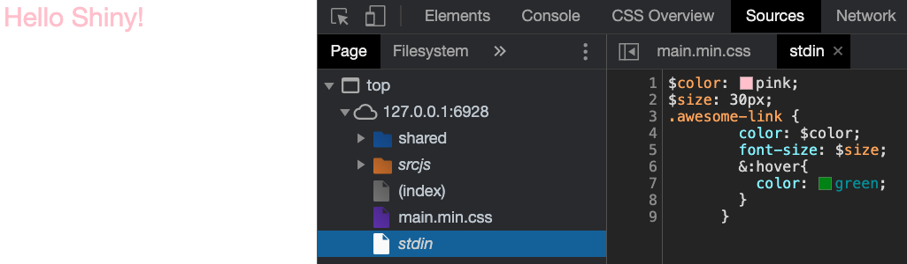
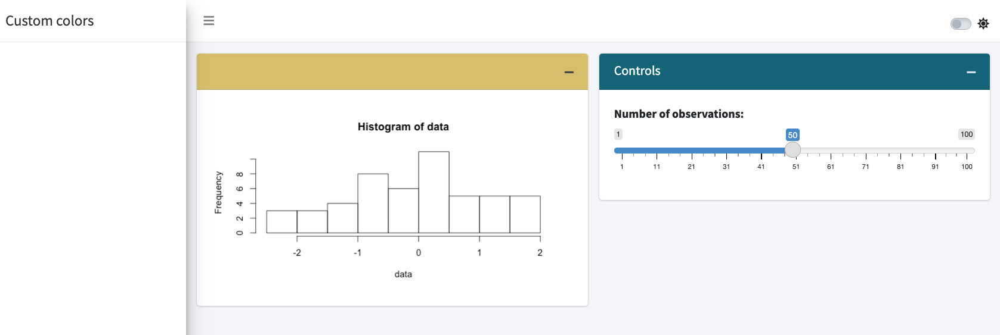

# Introduction to Sass {#beautify-sass}
One of the main problem with __CSS__ is to handle the growing number of files and the __code repetition__. Nowadays, web developers mainly use __CSS pre processors__ like [Sass](https://sass-lang.com/guide), that stands for "Syntactically Awesome Style Sheets ", providing access to variables, mathematical operators, functions and loops, thereby reducing the code complexity and extending the possibilities. [RStudio](https://rstudio.com) developed the [{sass}](https://rstudio.github.io/sass/articles/sass.html) package [@R-sass], which makes it possible to use __Sass__ in Shiny apps or Rmarkdown documents.

```{r, echo=FALSE}
# disable devmode.
# For some reason it may turn on without notice.
shiny::devmode(FALSE)
```

## Getting started with Sass
While we could use Sass from the terminal, we leverage the `{sass}` package features to work from R.
To install `{sass}`, we run:

```{r, eval=FALSE}
install.packages("sass")
# OR
remotes::install_github("rstudio/sass")
```

The main function is `sass()`, whose __input__ parameter accepts:

  - A R string like `a { color: pink}`.
  - A named `list()`.
  - A file passed with `sass_file()`, imports with `sass_import()`.
  - More complex structures.

```{r, eval=FALSE}
library(sass)
# with a string
sass(input = ".element-class { color: pink;}")
# with named list
sass(list(color = "pink", ".element-class { color: $color;}"))
```

```{r, echo=FALSE}
library(sass)
print(sass(list(color = "pink", ".element-class { color: $color;}")))
```


Note how the R code objects are seamlessly converted to Sass variable. For convenience, we will be using named lists in the remaining of the book.

### Variables
Let us consider the following example, where two different classes have the same color:

```css
.class-1{
  color: #33BEFF;
}

.class-2{
  background-color: #33BEFF;
}
```

Shouldn't this be easier? Imagine if we had hundreds of elements with the same color.
What happens in case the color changes? Do we have to update all properties by hand?

If we let the Sass variable `$color`:

```css
$color: purple;
.class-1{
  color: $color;
}
.class-2{
  background-color: $color;
}
```

we can quickly solve that problem. With `{sass}`, we define one variable holding the color as well as
our two rules, so that we obtain:

```{r, eval=FALSE}
rule1 <- ".class-1{ color: $color; }"
rule2 <- ".class-2{ background-color: $color; }"
sass(input = list(color = "purple", rule1, rule2))
```

```{r, echo=FALSE}
rule1 <- ".class-1{ color: $color; }"
rule2 <- ".class-2{ background-color: $color; }"
print(sass(input = list(color = "purple", rule1, rule2)))
```

::: {.noteblock data-latex=""}
Add the __default!__ tag after the variable definition, if you want
to let others modify it, that is `"$color: purple !default;"`.
:::

### Partials and Modules
It is best practice to save useful code snippets in one place, and reuse them
at anytime and anywhere. Sass allows to define __partials__, like `_partial.css`, with the leading
underscore, which avoids it to be converted into CSS. Partials are subsequently called
with `@import <PARTIAL_NAME>` (you may also find `@use`, the latter not being handled
by `LibSass`, which fuels`{sass}`), thereby significantly reducing code duplication.

Modules are pieces of Sass files that are later converted into CSS, reducing file size to a minimum.
Below is an example of the `bootstrap.scss` [file](https://github.com/twbs/bootstrap/blob/main/scss/bootstrap.scss):

```css
/*!
 * Bootstrap v5.0.0-beta1 (https://getbootstrap.com/)
 ...
*/

// scss-docs-start import-stack
// Configuration
@import "functions";
@import "variables";
@import "mixins";
@import "utilities";

// Layout & components
@import "root";
@import "reboot";
...

// Helpers
@import "helpers";

// Utilities
@import "utilities/api";
// scss-docs-end import-stack
```

which is easier to read and maintain than the original `bootstrap.css` with 10717 lines of code!
In practice, we often end up with a main Sass file and compile it as follows:

```{r, eval=FALSE}
sass(sass_file("main.scss"))
```


### Mixins and Functions
Another great advantage of Sass is the ability to generate reusable units of code, also known
as __mixins__ or __functions__.

#### Mixins
To make a 90 degrees rotation in CSS, we have to write:

```css
.element {
  -webkit-transform: rotate(90deg);
  -ms-transform: rotate(90deg);
  transform: rotate(90deg);
}
```

which is already tedious. Mixins allow to encapsulate the logic into a __reusable__ unit:

```css
@mixin transform($property, ...) {
  -webkit-transform: $property;
  -ms-transform: $property;
  transform: $property;
}

.element1 {
  @include transform(rotate(90deg));
}
```

The mixin starts with a `@mixin` keyword followed by its name and parameters.
It is called with `@include <MIXIN_NAME(PARMS)>`, very similar to a function declaration, excepts that
it must return a CSS rule.


```{r, eval=FALSE}
mixin <- "@mixin transform($property) {
  -webkit-transform: $property;
  -ms-transform: $property;
  transform: $property;
}"
rule <- ".element1 { @include transform($prop); }"
sass(input = list(prop = "rotate(90deg)", mixin, rule))
```

```{r, echo=FALSE}
mixin <- "@mixin transform($property) {
  -webkit-transform: $property;
  -ms-transform: $property;
  transform: $property;
}"
rule <- ".element1 { @include transform($prop); }"
print(sass(input = list(prop = "rotate(90deg)", mixin, rule)))
```

#### Functions
Sass offers many built-In [modules](https://sass-lang.com/documentation/modules) containing
ready to use functions for colors, numbers, strings, lists, maps, ... Some functions like
`rgb` are global, so that we don't have to import the corresponding module.

```{r, eval=FALSE}
sass(".pouet { color: rgb(0, 255, 0); }")
```

```{r, echo=FALSE}
print(sass(".pouet { color: rgb(0, 255, 0); }"))
```

It is definitely possible to design custom functions with `@function`,
whose syntax is very close the mixins:


```css
@function name($parm1, $parm2) {
  /* logic */
  @return value;
}
```

While debugging functions, it might be useful to capture intermediate elements.
`@debug` allows this:

```css
$test: 1;
@debug test;
```

```{r, eval=FALSE}
sass(
  list(
    a = 2,
    b = 4,
    "@function multiply($parm1, $parm2) {
      @debug 'parm1 is #{$parm1}';
      @debug 'parm2 is #{$parm2}';

      @return $parm1 * $parm2;
    }",
    ".my-class {
      width: multiply($a, $b) * 1px;
    }"
  )
)
```

```{r, echo=FALSE, warning=TRUE, message=TRUE}
print(
  sass(
    list(
      a = 2,
      b = 4,
      "@function multiply($parm1, $parm2) {
        @debug 'parm1 is #{$parm1}';
        @debug 'parm2 is #{$parm2}';

        @return $parm1 * $parm2;
      }",
      ".my-class {
        width: multiply($a, $b) * 1px;
      }"
    )
  )
)
```

### Extend/Inheritance
We consider two alerts with the color as only difference. As we can't capture multiple properties
inside one single Sass variable, we introduce the __extend__ concept, which permits to import
CSS properties inside multiple rules. We first define a generic `alerts-common` rule,
prefixed by the `%` symbol. It contains several rules and variables:

```css
%alerts-common {
  position: relative;
  padding: $alert-padding-y $alert-padding-x;
  margin-bottom: $alert-margin-bottom;
}


.alert-red {
  @extend %alerts-common;
  color: red;
}

.alert-green {
  @extend %alerts-common;
  color: green;
}

```

Let's translate this into R:

```{r, eval=FALSE}
common <- "%alerts-common {
  position: relative;
  padding: $alert-padding-y $alert-padding-x;
  margin-bottom: $alert-margin-bottom;
}"
alert_red <- ".alert-red {
  @extend %alerts-common;
  color: red;
}
"
alert_green <- ".alert-green {
  @extend %alerts-common;
  color: green;
}
"
sass(input = list(
  "alert-padding-y" = "5px",
  "alert-padding-x" = "10px",
  "alert-margin-bottom" = "2px",
  common,
  alert_red,
  alert_green
))
```

```{r, echo=FALSE}
common <- "%alerts-common {
  position: relative;
  padding: $alert-padding-y $alert-padding-x;
  margin-bottom: $alert-margin-bottom;
}"
alert_red <- ".alert-red {
  @extend %alerts-common;
  color: red;
}
"
alert_green <- ".alert-green {
  @extend %alerts-common;
  color: green;
}
"
print(sass(input = list(
  "alert-padding-y" = "5px",
  "alert-padding-x" = "10px",
  "alert-margin-bottom" = "2px",
  common,
  alert_red,
  alert_green
)))
```

This method avoids to multiply classes on elements such as `.alert-common .alert-red ...`.
Yet, we could have programmatically generated the two alert
classes with a loop, to avoid duplication.

### Flow Controls
These are elements aiming at fine tuning mixins and functions behavior.

#### if and else
Like in every programming language `if` and `else` control the execution of a code block, depending
on some conditions.
Below, we only want to conditionally control a shadow property, depending on the alert color:

```css
@mixin add-shadow($color) {
  @if $color == red {
    box-shadow:
      0 4px 10px 0 rgb(255, 0, 0),
      0 4px 20px 0 rgb(255, 0, 0);
  } @else if $color == green {
    box-shadow:
      0 4px 10px 0 rgb(0, 255, 0),
      0 4px 20px 0 rgb(0, 255, 0);
  }
}

.alert-red {
  @extend %alerts-common;
  color: red;
  @include add-shadow($color: red);
}

.alert-green {
  @extend %alerts-common;
  color: green;
  @include add-shadow($color: green);
}
```


```{r, eval=FALSE}
add_shadow <- "@mixin add-shadow($color) {
  @if $color == red {
    box-shadow:
      0 4px 10px 0 rgb(255, 0, 0),
      0 4px 20px 0 rgb(255, 0, 0);
  } @else if $color == green {
    box-shadow:
      0 4px 10px 0 rgb(0, 255, 0),
      0 4px 20px 0 rgb(0, 255, 0);
  }
}
"

common <- "%alerts-common {
  position: relative;
  padding: $alert-padding-y $alert-padding-x;
  margin-bottom: $alert-margin-bottom;
}"

alert_red <- ".alert-red {
  @extend %alerts-common;
  color: red;
  @include add-shadow($color: red);
}
"

alert_green <- ".alert-green {
  @extend %alerts-common;
  color: green;
  @include add-shadow($color: green);
}
"
sass(input = list(
  "alert-padding-y" = "5px",
  "alert-padding-x" = "10px",
  "alert-margin-bottom" = "2px",
  common,
  add_shadow,
  alert_red,
  alert_green
))
```

```{r, echo=FALSE}
add_shadow <- "@mixin add-shadow($color) {
  @if $color == red {
    box-shadow:
      0 4px 10px 0 rgb(255, 0, 0),
      0 4px 20px 0 rgb(255, 0, 0);
  } @else if $color == green {
    box-shadow:
      0 4px 10px 0 rgb(0, 255, 0),
      0 4px 20px 0 rgb(0, 255, 0);
  }
}
"

common <- "%alerts-common {
  position: relative;
  padding: $alert-padding-y $alert-padding-x;
  margin-bottom: $alert-margin-bottom;
}"

alert_red <- ".alert-red {
  @extend %alerts-common;
  color: red;
  @include add-shadow($color: red);
}
"

alert_green <- ".alert-green {
  @extend %alerts-common;
  color: green;
  @include add-shadow($color: green);
}
"
print(sass(input = list(
  "alert-padding-y" = "5px",
  "alert-padding-x" = "10px",
  "alert-margin-bottom" = "2px",  
  common, 
  add_shadow, 
  alert_red, 
  alert_green
)))
```

#### Loops
##### Each
We would like to create the alert class with only one rule. We first define a list of colors in Sass and
call the `@each`:

```css
$colors: red, green;

@each $color in $colors {
  .alert-#{$color} {
    color: green;
    @include add-shadow($box-color: $color);
  }
}
```

The structure is the same as the JavaScript loop. You'll also notice the `#{...}` which
is called [interpolation](https://sass-lang.com/documentation/interpolation) and allows to
insert any Sass expression in a string. As another example, if we want to create a `background-image` property
within a mixin, we could do `background-image: url("/some_path/#{$name}.svg")`, where `#{$name}` holds the file name.

```{r, eval=FALSE}
add_shadow <- "@mixin add-shadow($color) {
  @if $color == red {
    box-shadow:
      0 4px 10px 0 rgb(255, 0, 0),
      0 4px 20px 0 rgb(255, 0, 0);
  } @else if $color == green {
    box-shadow:
      0 4px 10px 0 rgb(0, 255, 0),
      0 4px 20px 0 rgb(0, 255, 0);
  }
}
"

common <- "%alerts-common {
  position: relative;
  padding: $alert-padding-y $alert-padding-x;
  margin-bottom: $alert-margin-bottom;
}"

alerts_rule <- "@each $color in $colors {
  .alert-#{$color} {
    @extend %alerts-common;
    color: green;
    @include add-shadow($color: $color);
  }
}
"
sass(input = list(
  colors = c("green", "red"),
  "alert-padding-y" = "5px",
  "alert-padding-x" = "10px",
  "alert-margin-bottom" = "2px", 
  common,
  add_shadow,
  alerts_rule
))
```

```{r, echo=FALSE}
add_shadow <- "@mixin add-shadow($color) {
  @if $color == red {
    box-shadow:
      0 4px 10px 0 rgb(255, 0, 0),
      0 4px 20px 0 rgb(255, 0, 0);
  } @else if $color == green {
    box-shadow:
      0 4px 10px 0 rgb(0, 255, 0),
      0 4px 20px 0 rgb(0, 255, 0);
  }
}
"

common <- "%alerts-common {
  position: relative;
  padding: $alert-padding-y $alert-padding-x;
  margin-bottom: $alert-margin-bottom;
}"

alerts_rule <- "@each $color in $colors {
  .alert-#{$color} {
    @extend %alerts-common;
    color: green;
    @include add-shadow($color: $color);
  }
}
"
print(sass(input = list(
  colors = c("green", "red"),
  "alert-padding-y" = "5px",
  "alert-padding-x" = "10px",
  "alert-margin-bottom" = "2px",  
  common, 
  add_shadow, 
  alerts_rule
)))
```

It becomes even more powerful while working with __maps__ like `$font-weights: ("regular": 400, "medium": 500, "bold": 700);`, i.e by key/value [pairs](https://sass-lang.com/documentation/at-rules/control/each#with-maps).
`@each` is as convenient as `lapply` or `map` functions to chain repetitive rules creation.

##### For
However, it is not straightforward to count up or down with `@each`. This is precisely where
`@for` fills the gap. The generic scheme is:

```css
@for <variable> from <expression> to <expression> { ... }
@for <variable> from <expression> through <expression> { ... }
```

__to__ excludes the last number while __through__ includes it.


## `{sass}` best practices
As it's best practice, especially for debugging purposes, to include assets as HTML
dependencies, it is a good idea to organize the Sass variable definition, function/mixins in __layers__, leveraging the `sass_layer()` function:

```{r, warning=FALSE}
rule1 <- ".class-1{ color: $color; }"
rule2 <- ".class-2{ background-color: $color; }"
layer1 <- sass_layer(
  defaults = list(color = "purple"),
  rules = list(rule1, rule2)
)
```

```{r, echo=FALSE}
print(layer1)
```


Besides, `sass_layer()` provide options like:

  - __declarations__ containing any function, mixin elements, in a `sass_file` for instance.
  - __html_deps__ that attaches a single or a list of HTML dependencies to the provided Sass code, as shown below.

```{r, eval = FALSE}
sass_layer(
  html_deps = htmltools::htmlDependency(
    name = "my-dep",
    version = "1.0.0",
    package = "mypkg",
    src = "path",
    ...
  )
)
```

Ultimately, multiple layers may be bundled with `sass_bundle()`:

```{r, warning=FALSE}
layer2 <- sass_layer(
  defaults = list(color = "blue"),
  rules = list(rule1, rule2)
)


my_bundle <- sass_bundle(layer1 = layer1, layer2 = layer2)
my_bundle
```

```{r, echo=FALSE}
print(sass(my_bundle))
```

`sass_bundle_remove()` removes a given layer from the bundle, provided that you passed a named list to `sass_bundle()`.
This allows other developers to reuse and modify predefined layers:


```{r}
my_bundle <- sass_bundle_remove(my_bundle, "layer2")
my_bundle
sass(my_bundle)
```

```{r, echo=FALSE}
print(sass(my_bundle))
```

## From Sass to CSS
`sass()` can generate CSS from Sass by passing an __output__ parameter pointing to the path where
to generate the CSS file. Best practice consists in enabling __compression__ and __source maps__. We discuss
this later in the book in Chapter \@ref(workflow-charpente). Overall those steps makes the code faster to load and easier to debug:

```{r, eval=FALSE}
sass(
  list(
   color = "pink",
   ".a { color: $color; }"
  ),
  options = sass_options(
    output_style = "compressed",
    source_map_embed = TRUE
  )
)
```

<!-- manual copy paste for pdf output formating -->

```
/* CSS */
.a{color:pink}

/*# sourceMappingURL=data:application/json;base64,ewoJInZlcn
Npb24iOiAzLAoJImZpbGUiOiAic3RkaW4uY3NzIiwKCSJzb3VyY2VzIjogWwo
JCSJzdGRpbiIKCV0sCgkibmFtZXMiOiBbXSwKCSJtYXBwaW5ncyI6ICJBQUNB
LEFBQUEsRUFBRSxBQUFDLENBQUUsS0FBSyxDQURGLElBQUksQ0FDVSIK
fQ== */
```


```{r, eval=FALSE}
sass(
  sass_file("main.scss"),
  "<OUTPUT PATH>",
  options = sass_options(
    output_style = "compressed",
    source_map_embed = TRUE
  )
)
```


## Sass and Shiny
Now let's go back to Shiny! How do we include Sass code in a Shiny app? There are multiple situations:

  1. You simply want to style a shiny app.
  2. You developed a template with custom JS and Sass/CSS to be reused by other developers.

The first option is rather simple since the Sass code is compiled with `sass()` before the shiny apps is launched. The resulting code may be either a string or a CSS file (within the `www` folder), to be included in the `head`. We assume to be located at the app folder level:

```{r, eval=FALSE}
sass(
  list(
    color = "pink",
    size = "30px",
    ".awesome-link {
      color: $color;
      font-size: $size;
      &:hover{
        color: green;
      }
    }"
  ),
  output = sprintf("www/main.min.css"),
  options = sass_options(
    output_style = "compressed",
    source_map_embed = TRUE
  )
)
```

Source maps allow us to see the original Sass code, as shown Figure \@ref(fig:sass-inspect).
`sass_options()` gives the flexibility to fine tune the CSS output and source map configuration.

::: {.importantblock data-latex=""}
For complex projects where the CSS compilation may take time, we strongly advise to process the CSS independently from
the app startup.
:::

```{r sass-inspect, echo=FALSE, fig.cap='Inspect Sass code in the web browser', out.width='100%'}

```

The second option requires to run `sass()` passing an __output__ file within the package. Then, the generated CSS
is included in an HTML dependency, ready to be shipped with the template:

```{r, eval=FALSE}
sass(
  sass_file("main.scss"),
  "<OUTPUT PATH>/main.css",
  options = sass_options(
    output_style = "compressed",
    source_map_embed = TRUE
  )
)

my_css_deps <- htmltools::htmlDependency(
  name = "my-style",
  version = "1.0.0",
  package = "mypkg",
  src = "<OUTPUT PATH>",
  stylesheet = "main.css"
)
```


## Examples

### Customize `{bs4Dash}` colors {#sass-customize-bs4Dash}
`{bs4Dash}` is a Bootstrap 4 dashboard template built on top of the [AdminLTE3](https://adminlte.io/themes/v3/) HTML template. `{shinydashboard}` is powered by the previous version, that is [AdminLTE2](https://adminlte.io/themes/AdminLTE/index2.html), which make it somehow `{bs4Dash}`'s big brother!
AdminLTE3 relies on Sass and all files are stored [here](https://github.com/ColorlibHQ/AdminLTE/tree/master/build/scss). Particularly, all variables are located in the `_variables.scss` partial. Since we can decompose our
Sass code in multiple layers, we seamlessly customize the theme color
variables listed below:

```css
$blue: #0073b7 !default;
$lightblue: #3c8dbc !default;
$navy: #001f3f !default;
$teal: #39cccc !default;
$olive: #3d9970 !default;
$lime: #01ff70 !default;
$orange: #ff851b !default;
$fuchsia: #f012be !default;
$purple: #605ca8 !default;
$maroon: #d81b60 !default;
$black: #111 !default;
$gray-x-light: #d2d6de !default;
```

Let's provide our own defaults with some custom [colors](https://colorswall.com/palette/66354/):

```css
$blue: #136377 !default;
$olive: #d8bc66 !default;
$lime: #fcec0c !default;
$orange: #978d01 !default;
$maroon: #58482c !default;
$gray-x-light: #d1c5c0 !default;
```

Now we would have to recompile the whole AdminLTE3 Sass code to account for these changes.
It means, all scss assets must be accessible somewhere: this is what the `{fresh}` package is doing under the [hoods](https://github.com/dreamRs/fresh/blob/master/R/create_theme.R).
No worries, we'll come back on `{fresh}` in the next Chapter. For now, we rely on the `{OSUICode}` Sass code stored at
`system.file("sass/adminlte/adminlte.scss", package = "OSUICode")` (since `{fresh}` may change in the future, `{OSUICode}` will be frozen to make sure the code always work):

```{r, eval=FALSE}
css <- sass(
  sass_layer(
    defaults = list(
      lightblue = "#136377",
      olive = "#d8bc66",
      lime = "#fcec0c",
      orange = "#978d01",
      maroon = "#58482c",
      "gray-x-light" = "#d1c5c0"
    ),
    rules = sass_file(
      input = system.file(
        "sass/adminlte/adminlte.scss",
        package = "OSUICode"
      )
    )
  )
)
# This CSS is injected inside the app head (see example)
```

The corresponding app may be tested below. If you want to see the whole code, run `OSUICode::get_example("sass/examples/bs4Dash-custom")`. 

```{r, echo=FALSE, results='asis'}
code_chunk(OSUICode::get_example("sass/examples/bs4Dash-custom", view_code = FALSE), "r")
```

Output is shown on Figure \@ref(fig:sass-adminlte-colors).

```{r sass-adminlte-colors, echo=FALSE, fig.cap='Custom AdminLTE colors', out.width='100%'}

```

You probably noticed a potential issue. We indeed have to rely on a specific AdminLTE version,
namely `3.1.0`, that is not necessarily the one we want. Therefore, an alternative would
be to download the Sass files from AdminLTE3, store them in a package, ideally the `/inst` folder, and recompile the code from that folder with new variables. As AdminLTE3 depends on Bootstrap 4, we would have to recover those dependencies in a separate folder, making sure it is accessible to the AdminLTE Sass code.

### Customize `{shinybulma}`
For convenience, the Sass code is already included in the book side [package](https://github.com/DivadNojnarg/outstanding-shiny-ui-code/tree/master/inst/sass/bulma).
The goal is to change the main color palette that comprises:

  - primary
  - info
  - success
  - warning
  - danger

In total, bulma exposes 419 Sass [variables](https://bulma.io/documentation/customize/concepts/)!

Among all files, we locate the main variables file and select the relevant variables we want to modify.
Notice we can retrieve all those information: [initial variables](https://bulma.io/documentation/customize/variables/#initial-variables) and [derived variables](https://bulma.io/documentation/customize/variables/#variables).

We assign them new [values](https://blog.depositphotos.com/neon-color-palettes.html):

```css
$turquoise: #03a4ff;
$cyan: #e705be;
$green: #f3d6e9;
$yellow: #fdaf2c;
$red: #ff483e;
$scheme-main: hsl(0, 0%, 4%);
```

Particularly, we target the main body color stored in `$scheme-main`. Instead of pointing
to `$white`, we change its value to the default `$black`. We then Compile the new CSS with `sass()`:

```{r, warning=FALSE}
css <- sass(
  sass_layer(
    defaults = list(
      turquoise = "#03a4ff",
			cyan = "#e705be",
			green = "#f3d6e9",
			yellow = "#fdaf2c",
			red = "#ff483e",
      "scheme-main" = "hsl(0, 0%, 10%)"
    ),
    rules = sass_file(input = system.file(
      "sass/bulma/bulma.sass",
      package = "OSUICode"
    ))
  )
)
```

Finally, we try the new theme in the following app, shown on Figure \@ref(fig:sass-bulma-tiles). 
If you want to see the whole code, run `OSUICode::get_example("sass/examples/shinybulma-custom")`. 

```{r, echo=FALSE, results='asis'}
code_chunk(OSUICode::get_example("sass/examples/shinybulma-custom", view_code = FALSE), "r")
```

```{r sass-bulma-tiles, echo=FALSE, fig.cap='Custom bulma theme', out.width='100%'}
knitr::include_graphics("images/beautify/sass-bulma-tiles.png")
```
