# Beautify with `{bslib}` {#beautify-with-bootstraplib}
`{bslib}` [@R-bslib] is a package developed by RStudio, built on top `{sass}`.
At the time of writing, `{bslib}` does not support `{shinydashboard}` and `{bs4Dash}`.
Again, you'll see that in few lines of code, you may provide impressive
design modifications to your apps, in a ridiculously short amount of time.

::: {.importantblock data-latex=""}
`{bslib}` requires [`{shiny} >= 1.6.0`](https://blog.rstudio.com/2021/02/01/shiny-1-6-0/). Bootstrap 5 support requires `{shiny} >= 1.6.0.9001`.
:::

## High level customization
Like `{fresh}`, `{bslib}` offers a __high level__ set of functions allowing to quickly customize shiny apps. For many users, this step will be enough. 


### Create a theme {#bslib-high-level}

`bs_theme()` seamlessly modifies the main CSS properties like:

  - The __background__ color, namely `bg`.
  - The __foreground__ color, namely `fg`.
  - Change default __theme__ colors, also called [accents](https://getbootstrap.com/docs/4.1/utilities/colors/).
  - Modify the [font](https://rstudio.github.io/bslib/articles/theming.html#main-colors-fonts). This leverages the `font_google()`, `font_face()` and `font_link()` functions. In practice, `font_google()` caches the font resources so that they are always available to the user.

Additionally, it gives the flexibility to choose __Bootstrap version__, falling back to `version_default()` if not specified. Currently, version is `4` but will change in the future, that is why it is advised to specify a value to avoid any unexpected breaking change. This function has three flavors:

  - __Bootstrap 3__, with `"3"` (see Chapter \@ref(web-dependencies), Shiny primarily relies on Bootstrap 3).
  - __Bootstrap 4__ + compatibility with Bootstrap 3, with `"4"`.
  - __Bootstrap 5__ with `"5"`.
  - More __Bootstrap__ versions 

Advanced users appreciate a `...` slot to add extra variables through `bs_add_variables()`, with literally hundreds of choices. We give more details in the \@ref(bslib-low-level) section. In the following, we decide to default to Bootstrap 4.

```{r, eval=FALSE}
library(bslib)

bs_theme(
  version = version_default(),
  bootswatch = NULL,
  ...,
  bg = NULL,
  fg = NULL,
  primary = NULL,
  secondary = NULL,
  success = NULL,
  info = NULL,
  warning = NULL,
  danger = NULL,
  base_font = NULL,
  code_font = NULL,
  heading_font = NULL
)
```

Let's create a very simple theme:

```{r}
simple_bs4_theme <- bs_theme(version = 4)
```

We deliberately trimmed the corresponding output to get a better rendering in the book. 

```
/* Sass Bundle: _root, _reboot, ..., _toasts, _modal, ... */

/* MORE Sass imports ... */
@import "../scss/_toasts.scss";
@import "../scss/_modal.scss";

/* MORE Sass imports ... */

/* *** */
Other Sass Bundle information:
List of 2
 $ html_deps       :List of 1
  ..$ :List of 10
  .. ..$ name      : chr "bs3compat"
  .. ..$ version   : chr "0.2.5.9002"
  .. ..$ src       :List of 1
  .. .. ..$ file: chr "bs3compat/js"
  .. ..$ meta      : NULL
  .. ..$ script    : chr [1:3] "transition.js" "tabs.js" 
  "bs3compat.js"
  .. ..$ stylesheet: NULL
  .. ..$ head      : NULL
  .. ..$ attachment: NULL
  .. ..$ package   : chr "bslib"
  .. ..$ all_files : logi TRUE
  .. ..- attr(*, "class")= chr "html_dependency"
 $ file_attachments: Named chr "..."
  ..- attr(*, "names")= chr "fonts"
```

At a glance, the output contains a bundle with Sass code for all Bootstrap 4 components (toasts, modals, ...). Then, each of those modules are imported with the `@import` statement. The remaining consists in an HTML dependency providing compatibility with Bootstrap 3 and fonts assets. 

### Update a theme
`{bslib}` exposes handy functions to alter the theme Sass code, that is remove (`bs_remove()`) or add (`bs_theme_update()`) rules to/from a preexisting theme. This may be useful to reduce the code size or add missing rules on the fly. For instance, if we don't need to alter the toast component, there is no need to include its Sass code in the theme. We therefore do:

```{r}
simple_bs4_theme <- bs_remove(simple_bs4_theme, "_toasts")
```

Inversely, if we missed a CSS rule, we may leverage `bs_theme_update()`, which is able to update a given theme object, generated with `bs_theme()`. Below, we change the default primary color (<span style="width:12px;height:12px;background:#007bff;border-radius:2px;display:inline-block;margin-right:5px;"></span>) to a lighter blue: 

```{r}
simple_bs4_theme <- bs_theme_update(
  simple_bs4_theme, 
  primary = htmltools::parseCssColors("lightblue")
)
```

Note the use of `htmltools::parseCssColors()` which converts a color name to the corresponding HEX code:

```{r}
htmltools::parseCssColors("blue")
htmltools::parseCssColors("gainsboro")
```

### Preview a theme
We first create a custom neon theme:

```{r, eval=FALSE}
bslib_neon_theme <- bs_theme(
  version = 4, 
  bg = "#000000",
  fg = "#FFFFFF",
  primary = "#9600FF",
  secondary = "#1900A0",
  success = "#38FF12",
  info = "#00F5FB",
  warning = "#FFF100",
  danger = "#FF00E3",
  base_font = "Marker Felt",
  heading_font = "Marker Felt",
  code_font = "Chalkduster"
)
```

At any time, developers may preview the resulting theme with `bs_theme_preview()`, for instance:

```{r, echo=FALSE, results='asis'}
code_chunk(OSUICode::get_example("bslib/theme-preview"), "r")
```

Interestingly, `bs_theme_preview()` is no more than `shiny::runApp()` when the `with_themer` is `FALSE`.
This gives the result shown on Figure \@ref(fig:bootstraplib-theme-preview).

```{r bootstraplib-theme-preview, echo=FALSE, fig.cap='Theme preview in action', out.width='100%'}
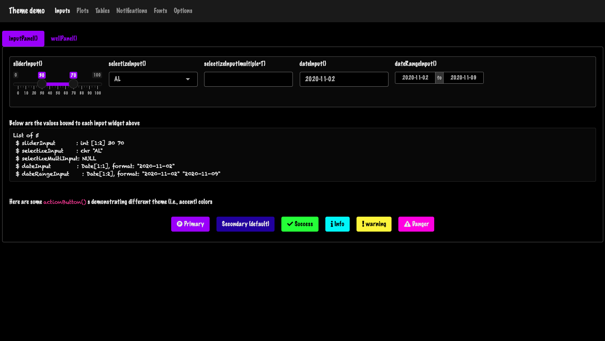
```

### Live theming
Let's go even further! Wouldn't be that cool to be able to modify the app at __runtime__ with a plug and play widget? This is possible with `{bslib}`, owing to the `run_with_themer()` wrapper. 
It takes a Shiny App object as input (ie defined with `shiny::shinyApp()`):

```{r, echo=FALSE, results='asis'}
code_chunk(OSUICode::get_example("bslib/run-with-themer"), "r")
```

As depicted by Figure \@ref(fig:bslib-bs-themer), the __themer__ not only shows a live
theming widget. It also shows the corresponding code output step by step, so as to
update the original theme. Under the hood, it leverages the `bs_theme_update()` function, described above.  

```{r bslib-bs-themer, echo=FALSE, fig.show = "hold", out.width = "50%", fig.align = "default", fig.cap="Live theming with bslib. Left: themer widget. Right: code output."}
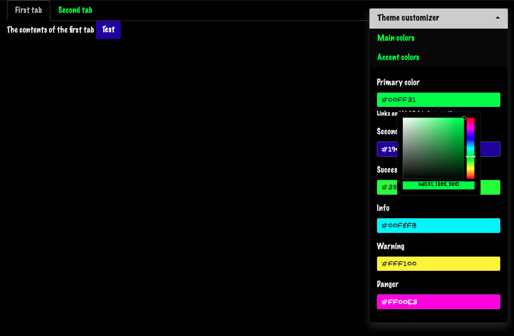
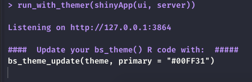
```

Alternatively, passing `with_themer = TRUE` inside `bs_theme_preview` does also the same thing.
For further details, we refer the reader to the official [documentation](https://rstudio.github.io/bslib/reference/run_with_themer.html#limitations). 
Even though there exists a third function, namely `bs_themer`, I don't encourage using it, as it has to be inserted in the server function, which can be easily forgotten by mistake. 

## Low level customization {#bslib-low-level}

### Add new variables
`bs_add_variables()` adds new variables at a specific position within a theme. By default, they are inserted before other Sass __defaults__. It is a __lower level__ function since you have to
know the corresponding Bootstrap variable(s). Let's consider the example of a Bootstrap 4 badge where we aim at changing the font size, font weight and padding. The corresponding Sass code may be found [here](https://github.com/twbs/bootstrap/blob/5d24fef741944c168ad0ca9cabd1509d5803e441/scss/_badge.scss), and we identify few variables, whose default values are shown in the Bootstrap 4 variables code [here](https://github.com/twbs/bootstrap/blob/v4-dev/scss/_variables.scss):

```css
// Typography
//
// Font, line-height, and color for body text, headings, and more.
$font-weight-bold:        700 !default;

// Define common padding and border radius sizes and more.
$border-radius:           .25rem !default;

// Badges

$badge-font-size:         75% !default;
$badge-font-weight:       $font-weight-bold !default;
$badge-padding-y:         .25em !default;
$badge-padding-x:         .4em !default;
$badge-border-radius:     $border-radius !default;
```

Now we create our custom theme, increasing the font weight, size and changing the border radius to obtain more rounder [corners](https://shoelace.style/tokens/border-radius):

```{r}
library(magrittr)

custom_badge_theme <- bs_theme(
  version = 4,
  # high level theming  
  success = htmltools::parseCssColors("lightgreen")
) %>% 
  bs_add_variables(
    # low level theming
    "badge-font-weight" = 900,
    "badge-font-size" = "100%",
    "badge-padding-y" = "0.5em",
    "badge-padding-x" = "0.8em",
    "badge-border-radius" = "1rem"
  )
```

::: {.noteblock data-latex=""}
It would be tempting to change the global `$font-weight-bold` but it might affect
other elements. Let's just overwrite the `badge-font-weight`. 
:::

The badge code is given by the following HTML:

```html
<span class="badge badge-success">Success</span>
```

We leverage our previous knowledge to convert it to R and make it browsable with `{htmltools}`:

```{r}
library(htmltools)

my_badge <- a(class = "badge badge-success", "1")
preview_badge <- function(theme = NULL) {
  if (interactive()) {
    tag <- if (is.null(theme)) {
      # default bs4 theme
      bs_theme(version = 4)
    } else {
      # altered badge
      theme
    }
    browsable(
      tags$body(
        br(), 
        bs_theme_dependencies(theme), 
        my_badge
      )
    )
  }
}

# preview_badge(custom_badge_theme)
# preview_badge() # default badge
```

```{r bslib-custom-badge, echo=FALSE, fig.cap='Custom Bootstrap 4 badge with bslib. Left: custom badge, right: default badge.', out.width='25%', fig.align='center'}
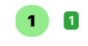
```

`bs_theme_dependencies()` is used outside of a Shiny context to include the theme Sass code as a dependency. 

### Import external rules
Let's try with another example. We would like to bring a refreshment to the Bootstrap UI elements with one of the most modern UI kit to date, namely [98.css](https://jdan.github.io/98.css/), a Windows 98 CSS kit. The CSS assets may be accessed from [jsdelivr](https://cdn.jsdelivr.net/npm/98.css@0.1.16/dist/98.min.css), as shown below:

```{r}
win98_cdn <- "https://cdn.jsdelivr.net/npm/98.css@0.1.16/"
win98_css <- paste0(win98_cdn, "dist/98.min.css")
```

`{bslib}` exposes neat tools to import extra CSS in the current theme, such as `bs_add_rules()`, which calls `sass::sass_file()` under the hood:

```{r, eval=FALSE}
theme %>%
  bs_add_rules(
    sprintf('@import "%s"', win98_css)
  )
```

The three theme colors are `#c0c0c0` for the background and all colors (except primary), `#03158b` for primary and `#222222` for the text. We also disable the rounded option so that button borders stay squared.

```{r, eval=FALSE}
windows_grey <- "#c0c0c0"
windows98_theme <- bs_theme(
  version = 4, 
  bg = windows_grey,
  fg = "#222222",
  primary = "#03158b",
  base_font = c("Times", "Arial"),
  secondary = windows_grey,
  success = windows_grey,
  danger = windows_grey,
  info = windows_grey,
  light = windows_grey,
  dark = windows_grey,
  warning = windows_grey,
  "font-size-base" = "0.75rem",
  "enable-rounded" = FALSE
) %>%
  bs_add_rules(
    sprintf('@import "%s"', win98_css)
  )
```

To run the corresponding app you may call `windows98_theme %>% bs_theme_preview()` or copy and paste the 
below code in your R console.

```{r, echo=FALSE, results='asis'}
code_chunk(OSUICode::get_example("bslib/windows-98", view_code = FALSE), "r")
```

When you run the above demonstration, you'll notice that the slider input is not properly
styled. It's not surprising knowing that the slider is not shaped by Bootstrap but [Ion.RangeSlider](http://ionden.com/a/plugins/ion.rangeSlider/). Therefore, if you want a better appearance, like in [98.css](https://jdan.github.io/98.css/#slider), we would need extra work. The output is shown Figure \@ref(fig:bslib-windows-98).

```{r bslib-windows-98, echo=FALSE, fig.cap='Modern Windows 98 theme for Shiny', out.width='100%'}
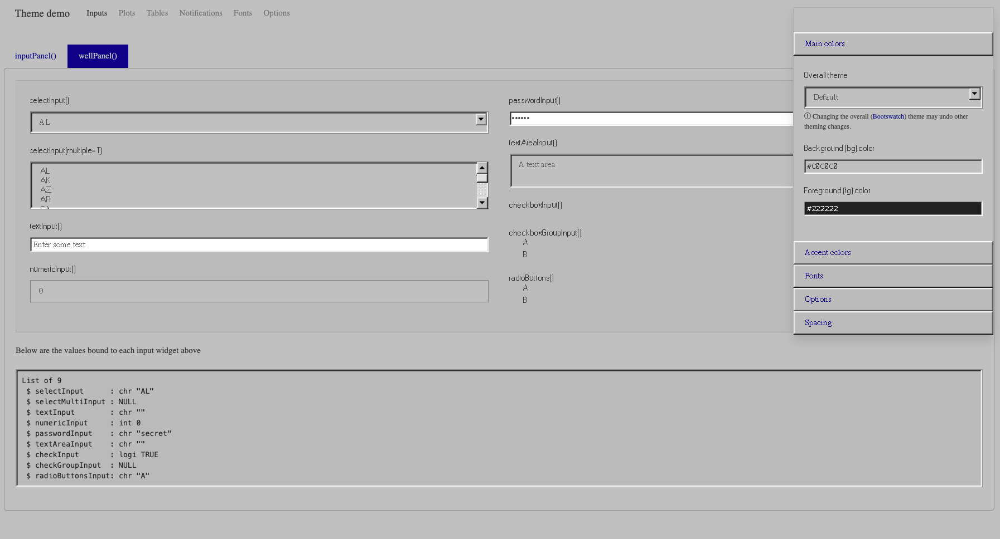
```

## Dynamic theming

### Basics 
Now, let's say you design an app and want to give the choice between the vanilla shiny design and your new cyberpunk theme, created in the previous section. We leverage the new `session$setCurrentTheme` feature that allows to pass `{bslib}` generated themes to JavaScript through the __session__ object. Our Shiny app contains a Bootstrap 4 toggle defined by the `theme_toggle()` function, which value is either `TRUE` or `FALSE`. On the JavaScript side, we first create a custom shiny input with `Shiny.setInputValue` that gets the current mode value from the toggle. If `TRUE`, then the custom theme is applied by `session$setCurrentTheme` in an `observeEvent()`.

```{r, eval=FALSE}
theme_toggle <- function() {
  div(
    class = "custom-control custom-switch",
    tags$input(
      id = "custom_mode",
      type = "checkbox",
      class = "custom-control-input",
      onclick = HTML(
        "Shiny.setInputValue(
          'dark_mode',
          document.getElementById('custom_mode').value
        );"
      )
    ),
    tags$label(
      "Custom mode?",
      `for` = "custom_mode",
      class = "custom-control-label"
    )
  )
}
```

If `FALSE`, we fall back to a default Bootstrap 4 theme provided by `bs_theme(version = 4)`.

Like for `{fresh}`, the `{bslib}` theme does not apply to static plots, as they are not HTML elements. Therefore we load `{thematic}`.

```{r, echo=FALSE, results='asis'}
code_chunk(OSUICode::get_example("bslib/dynamic-theming"), "r")
```

::: {.warningblock data-latex=""}
At the time of writing, an issue with `bindCache()` not aware of `session$setCurrentTheme()` is described [here](https://github.com/rstudio/shiny/issues/3208), with `{shiny}` 1.6. Moreover, `session$setCurrentTheme()` is not able to handle dynamic change of Bootstrap version. 
:::

A common mistake would be to forget to specify the `session` object in the server function, which would cause `session$setCurrentTheme()` to fail. Be careful!

### Custom elements
For other elements than core shiny components like `numericInput()` or `{thematic}` compatible elements such as `plotOutput()`, `{bslib}` provides tools to design dynamically themeable custom components.

Let's take the example of a simple card where the Sass code is defined below:

  - `.supercard` has a shadow, takes half of the page width and has a fixed height.
  Notice the `background-color` that takes the value of the `$primary` Sass variable,
  inherited from Bootstrap 4.
  - `.supercard_body` adds padding to the card body content.

```css
.supercard {
  box-shadow: 0 4px 10px 0 rgb(0, 0, 0), 0 4px 20px 0
  rgb(0, 0, 0);
  width: 50%;
  height: 200px;
  background-color: $primary;

  .supercard_body {
    padding: 0.01em 16px;
  }
}
```

Below, for convenience, we put that Sass code inside a R string, even though best practice would
be to save it in a file and compile it with `sass_file()`.

```{r}
sass_str <- "
  .supercard {
    box-shadow: 0 4px 10px 0 rgb(0, 0, 0), 0 4px 20px 0
    rgb(0, 0, 0);
    width: 50%;
    height: 200px;

    background-color: $primary;
    .supercard_body {
      padding: 0.01em 16px;
    }
}"
```


If you try to run `sass(input = sass_str)`,
it will fail, as `$primary` is not defined. Now, the goal is to link this custom Sass code
to the main app theme, created with `bs_theme()`. We invoke the `bs_dependency()` function where:

  - __input__ refers to a list of Sass rules, that is `sass_str` in our example.
  - __theme__ is a theme generated with `bs_theme()`.
  - __name__ and `version` are metadata.

In case we are not in a `{bslib}` context, ie the app does not pass a `bs_theme()` element,
we create a fallback containing the card CSS code:

```{r}
super_card_dependency <- function(theme) {

  dep_name <- "supercard"
  dep_version <- "1.0.0"

  if (is_bs_theme(theme)) {
    bs_dependency(
      input = sass_str,
      theme = theme,
      name = dep_name,
      version = dep_version
    )
  } else {
    htmlDependency(
      name = dep_name,
      version = dep_version,
      src = "supercard-1.0.0/css",
      stylesheet = "super-card.css",
      package = "OSUICode"
    )
  }
}
```

As shown, in Chapter \@ref(htmltools-dependencies), we have to add this dependency to the card
tag. Importantly, we wrap it inside `bs_dependency_defer()` that enables us to dynamically update the theme on the server
side, each time `session$setCurrentTheme` is called:

```{r}
super_card <- function(...) {
  div(
    class = "supercard",
    div(class = "supercard_body", ...),
    bs_dependency_defer(super_card_dependency)
  )
}
```

We then create a simple dark theme that will be utilized by `session$setCurrentTheme` and run the app:

```{r, eval=FALSE}
dark_theme <- bs_theme(version = 4) %>%
  bs_theme_update(
    bg = "black",
    fg = "white",
    primary = "orange"
  )
```

```{r, echo=FALSE, results='asis'}
code_chunk(OSUICode::get_example("bslib/custom-components"), "r")
```

::: {.importantblock data-latex=""}
Live theming requires to pass the __session__ parameter to the server function. Don't forget it!
:::

The reader is invited to exploit the `run_with_themer()` capabilities, that allows
to dynamically modify the current theme, as shown Figure \@ref(fig:bslib-custom-component).

```{r bslib-custom-component, echo=FALSE, fig.cap='Theme preview with custom component', out.width='100%'}
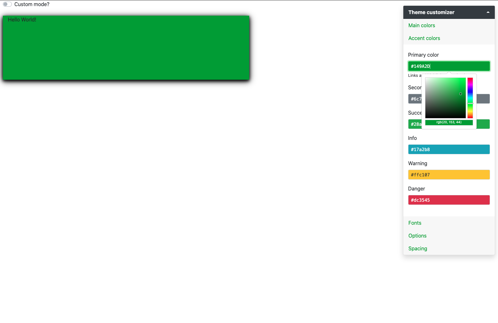
```

Below, we try without passing any theme to `fluidPage()`, to test our CSS fall back strategy:

<!-- Don't deploy not very informative ... -->

```{r, eval=FALSE}
ui <- fluidPage(super_card("Hello World!"))
server <- function(input, output) {}
shinyApp(ui, server)
```


### Conditional rendering {#bslib-renderHook}

#### Bootstrap badges
In this section, we see how to create components whose rendering may adapt depending on the
currently active theme properties, like the version. Bootstrap badges have slightly different structures between Bootstrap 3 and Bootstrap 4/5:

```html
<!-- BS3 -->
<span class="badge">42</span>

<!-- BS4 -->
<span class="badge badge-secondary">New</span>

<!-- BS5 -->
<span class="badge bg-secondary">New</span>
```

Bootstrap 3 badges don't have any color class contrary to Bootstrap 4 or 5. Bootstrap 4 and 5 badges color classes slightly differ: `badge-<COLOR>` (BS4) vs `bg-<COLOR>` (BS5). Below, lets' write a common wrapper to create a `bs_badge()` function for Shiny that works for all Bootstrap versions. No question to create three different functions!
The common skeleton tag is a simple `span` element with the `badge` class. Depending on the version, we
create a render hook with `htmltools::tagAddRenderHook()` that is able to adequately alter the tag structure. We first get the currently active theme with `shiny::getCurrentTheme()` or `bslib::bs_current_theme()`. We check if it is a `{bslib}` theme and if yes, we recover its version with `bslib::theme_version()`. Note the importance of timing. Calling `shiny::getCurrentTheme()` outside the render hook would give `NULL`, thereby preventing the code to work. We raise an error if color is used whenever the Bootstrap version is lower than 4. In case of Bootstrap 4 or 5, we utilize `htmltools::tagQuery()` to efficiently modify the tag structure in one single flow of instructions, as shown in section \@ref(htmltools-modern). Result is shown below:

```{r}
bs_badge <- function(text, color = NULL) {
  # Create common badge skeleton for BS3/4/5
  badge_skeleton <- tags$span(class = "badge", text)
  
  # Handle BS4 and BS5 extra class
  if (!is.null(color)) {
    badge_skeleton <- tagAddRenderHook(
      badge_skeleton, function(x) {
      # get theme and version
      theme <- getCurrentTheme()
      version <- if (bslib::is_bs_theme(theme)) {
        bslib::theme_version(theme)
      }
      
      switch(
        version,
        # stop if color is used with BS3
        "3" = stop(
          sprintf(
            "color is not available for Bootstrap %s", 
            version
          )
        ),
        "4" =  tagQuery(x)$
          addClass(sprintf("badge-%s", color))$
          allTags(),
        "5" = tagQuery(x)$
          addClass(sprintf("rounded-pill bg-%s", color))$
          allTags()
      )
    })
  }
  
  badge_skeleton
  
}
```

Let's test it below, result illustrated Figure \@ref(fig:bslib-dynamic-badges).

<!-- Not deployed because not very informative. Just a checkup -->

```{r, eval=FALSE}
# BS3
ui <- fluidPage(
  theme = bs_theme(version = 3),
  bs_badge(42)
)
server <- function(input, output, session) {}

shinyApp(ui, server)

# BS4
ui <- fluidPage(
  theme = bs_theme(version = 4),
  bs_badge(42, "primary")
)
shinyApp(ui, server)

# BS5
ui <- fluidPage(
  theme = bs_theme(version = 5),
  bs_badge(42, "primary")
)
shinyApp(ui, server)
```

```{r bslib-dynamic-badges, echo=FALSE, fig.show = "hold", out.width = "33%", fig.align = "default", fig.cap="Conditional rendering of a Bootstrap component. Left: BS3 badge; center: BS4 badge; right: BS5 badge."}
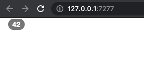
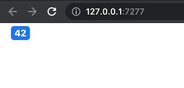
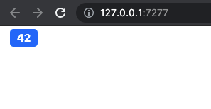
```

#### Bootstrap navs

Another great real life example if documented [here](https://github.com/rstudio/shiny/pull/3372/files#diff-befe9146792f0d65aeeaf781e8ba00a1a3638ac2be162b61b6c8958440860b56), which briefly consists in handling [nav](https://getbootstrap.com/docs/5.0/components/navs-tabs/) element differences
between Bootstrap 3 and Bootstrap 4/5. 

#### Guided exercise: Bootstrap accordions {#bslib-bootstrap-accordion}
We conclude this part by a guided exercise. Similarly as badges, Bootstrap __accordions__ differ
between the three last major version. First, they don't natively exist in Bootstrap 3, and the tag structure is different between Bootstrap 4 and 5. The purpose of this activity is to provide a generalized wrapper that would support all versions.

Figure \@ref(fig:bslib-accordion-intro) illustrates the Bootstrap 5 accordion. It is 
composed of items that can collapse if one clicks on their title. Overall, they are convenient to
save space in any user interface, when the amount of text would be to much to be printed at once. 

```{r bslib-accordion-intro, echo=FALSE, fig.cap='A Bootstrap 5 accordion.', out.width='100%'}
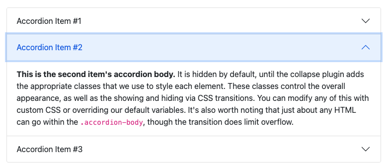
```

From HTML point of view, the accordion has a main `div` wrapper with the `accordion` class, inside of which are found the accordion items. Whereas in Bootstrap 5, these elements are `div` with the `accordion-item` class, Bootstrap 4 considers `div` with `card` class. An accordion item is composed of a title with a button which is able to control the collapsed state of the linked body part, the latter being a simple `div`. The link is made with the `data-bs-target` attribute on the title that must match the `id` attribute of the body part. The `data-bs-toggle` activates the JS, which makes the whole component collapse. Each body element refers to the parent accordion with `data-bs-parent` that must match the parent `id`, thereby guarantying no unwanted interaction between multiple accordions. Below is the HTML structure of the BS5 accordion: 

```html
<!-- BS5 -->
<div class="accordion" id="accordionExample">
  <div class="accordion-item">
    <h2 class="accordion-header" id="headingOne">
      <button 
      class="accordion-button" 
      type="button" 
      data-bs-toggle="collapse" 
      data-bs-target="#collapseOne" 
      aria-expanded="true" 
      aria-controls="collapseOne">
        Accordion Item #1
      </button>
    </h2>
    <div 
    id="collapseOne" 
    class="accordion-collapse collapse show" 
    aria-labelledby="headingOne" 
    data-bs-parent="#accordionExample">
      <div class="accordion-body">
        Blablabla
      </div>
    </div>
  </div>
  <!-- Other items ... -->
</div>
```

and the BS4 accordion:

```html
<div class="accordion" id="accordionExample">
  <div class="card">
    <div class="card-header" id="headingOne">
      <h2 class="mb-0">
        <button 
        class="btn btn-link btn-block text-left" 
        type="button" 
        data-toggle="collapse" 
        data-target="#collapseOne" 
        aria-expanded="true" 
        aria-controls="collapseOne">
          Accordion Item #1
        </button>
      </h2>
    </div>

    <div 
    id="collapseOne" 
    class="collapse show" 
    aria-labelledby="headingOne" 
    data-parent="#accordionExample">
      <div class="card-body">
        Blablabla
      </div>
    </div>
  </div>
```

1. Compare the Bootstrap 4 and 5 HTML code. What are the differences?
Is the tag structure the same? Are there differences for tag attributes?
2. Based on the previous question, create the `bs_accordion()` function. This
function starts by defining a tag structure common to BS4 and BS5.

```{r, eval=FALSE}
bs_accordion <- function(id, items) {
  # main wrapper
  accordion_tag <- tags$div(
    class = "accordion",
    id = ...,
    items
  )
  
  accordion_tag
}
```

3. Let's handle the Bootstrap differences for `bs_accordion()`. As shown above, leverage `tagAddRenderHook()`. First, create the `get_theme_version()` function to detect the currently 
used theme version. Then call this function inside the `tagAddRenderHook()` and store it in the 
`version` variable.

```{r, eval=FALSE}
# Function to get the current them version
get_theme_version <- function() {
  theme <- bslib::...
  if (bslib::...(theme)) bslib::...(theme)
}

bs_accordion <- function(id, items) {
  
  # Accordion wrapper (see 2 above)
  
  tagAddRenderHook(accordion_tag, function(x) {
    # get theme version
    version <- ...
  })
}
```

4. Now, we'll edit `tagAddRenderHook()` so that we raise an error if the Bootstrap version is `3`. Edit the `bs_accordion()` to incorporate the below code.

```{r, eval=FALSE}
if (version == ...) {
  stop(
    sprintf(
      "accordion is not available for Bootstrap %s", 
      version
    )
  )
}
```

5. We are good with the main wrapper. Let's create the `bs_accordion_item()` function, which will have to be nested inside the `bs_accordion()`. We assume it has two main parameters, title and content. To get a better code, we'll design intermediate components for the header and the body. In this step, we only create the body element since the header is slightly more complex to handle. If you have had a look to the HTML structure, you will notice below that `id`, `aria-labelledby` and `data-(bs)-parent` will be handled later from the `bs_accordion()`. These parameters require to know the `bs_accordion()` `id`, which is impossible to get within a child element. We also added
an `active` parameter to control the start state. Fill in the `...` element below.

```{r, eval=FALSE}
bs_accordion_item <- function(title, content) {
  
  item_body <- tags$...(
    # id will be added from bs_accordion
    # aria-labelledby also added from bs_accordion
    # data parent differs between BS4 and BS5
    class = paste("collapse", if (active) ...),
    tags$div(
      # class differs between BS4 and BS5
      ...
    )
  )
  
  # accordion item wrapper 
  tags$div(
    # class differs between BS4 and BS5
    ...
  )
}
```

6. Utilize `tagAddRenderHook()` to handle BS4 and BS5 differences in `bs_accordion_item()`.
As in `bs_accordion()`, recover the version with `get_theme_version()`. 
Then, create the Bootstrap 4 item header based on its HTML structure shown above. 


```{r, eval=FALSE}
bs_accordion_item <- function(title, content, active = FALSE) {
  
  # item body code 5 (see above)
  # item wrapper 5 (see above)
  
  tagAddRenderHook(..., function(x) {
    # get theme and version
    version <- ...
    
    # create accordion item header 
    ... <- if (version == "4") {
      tags$div(
        class = ...,
        # id will be added from bs_accordion
        tags$h2(
          class = "mb-0",
          tags$button(
            class = ...,
            type = "button",
            `data-toggle` = "collapse",
            # data-target will be added from bs_accordion 
            `aria-expanded` = tolower(...),
            # aria-controls will be added from bs_accordion
            title
          )
        )
      )
    }
  }
}
```

7. Add an `else if` statement to handle Bootstrap 5, based on its HTML structure, provided above.  

```{r, eval=FALSE}
else if (version == "5") {
  tags$h2(
    class = ...,
    tags$button(
      class = ...,
      type = "button",
      `data-bs-toggle` = "collapse",
      `aria-expanded` = tolower(...),
      title
    )
  )
}
```

8. We now have to handle missing classes and add the new elements. We created a switch to start to handle Bootstrap 4 and Bootstrap 5 differences. Based on the accordion item HTML structure, fill in the missing `tagQuery()` steps for Bootstrap 4.

```{r, eval=FALSE}
bs_accordion_item <- function(title, content, active = FALSE) {
  
  # item body code (see 5 above)
  # item wrapper (see above)
  
  tagAddRenderHook(..., function(x) {
    # get theme and version (see 6 above)
    # create accordion item header (see 6-7 above)
    
    # alter tag structure
    switch(
      version,
      # don't need to handle BS3
      "4" =  tagQuery(x)$
        addClass(...)$
        # prepend header tag
        prepend(...)$
        find(".collapse")$
        children()$
        # add class to item body
        addClass(...)$
        allTags()
    )
  })
}
```

9. Do the same for Bootstrap 5. 

```{r, eval=FALSE}
bs_accordion_item <- function(title, content, active = FALSE) {
  # item body code (see 5 above)
  # item wrapper (see 5 above)
  
  tagAddRenderHook(..., function(x) {
    # get theme and version (see 6 above)
    # create accordion item header (see 6-7 above)
    
    # alter tag structure
    switch(
      version,
      # don't need to handle BS3
      "4" =  # see 8 above,
      "5" = tagQuery(x)$
        addClass(...)$
        prepend(...)$
        find(".collapse")$
        addClass("accordion-collapse")$
        children()$
        addClass(...)$
        allTags()
    )
  })
}
```

10. We come back to `bs_accordion()` in order to create the correct
`bs_accordion_item()` children ids (mentioned in 5) and treat missing attributes. We have to process all items and use `lapply()` since it works well with shiny tags. We first prefix all ids by the parent accordion one to avoid uniqueness issue in case of multiple accordions (There exist much better methods but this is not the purpose of the example). Then, items are resolved with `htmltools::as.tags()`, as explained in section \@ref(htmltools-nested-renderhooks). Fill in the blanks `...`.

```{r, eval=FALSE}
bs_accordion <- function(id, items) {
  
  # Accordion wrapper (see 2 above)
  
  tagAddRenderHook(accordion_tag, function(x) {
    # get theme and version (see 3 above)
    # Check version (see 3 above)
    
    # process accordion items to add missing attributes
    new_items <- lapply(seq_along(...), function(i) {
      
      # temp ids based on the parent id
      heading_id <- paste(..., "heading", i, sep = "_")
      controls_id <- paste0(..., "_collapse_", i)
      target_id <- paste0("#", controls_id)
      
      # resolve bs_accordion_item
      items[[i]] <- as.tags(...)
      
      # see 11
    })
    # see 13
  })
}
```

11. Right after the `as.tags()` function, add a switch to handle the Bootstrap 4 version. Fill in the blanks `...`.
Overall this codes add missing attributes so that the accordion works properly.

```{r, eval=FALSE}
# handle BS4 
switch(
  version,
  "4" = tagQuery(...[[i]])$
    find(".card-header")$
    addAttrs("id" = ...)$
    find(".btn")$
    addAttrs(
      "data-target" = ...,
      "aria-controls" = ...
    )$
    resetSelected()$
    find(".collapse")$
    addAttrs(
      "id" = ...,
      "aria-labelledby" = ...,
      "data-parent" = paste0("#", ...)
    )$
    allTags(),
  "5" = # see 12
)
```

12. Add a Bootstrap 5 case to the switch filling the following code.

```{r, eval=FALSE}
tagQuery(...[[i]])$
  find(".accordion-header")$
  addAttrs("id" = ...)$
  children()$
  addAttrs(
    "data-bs-target" = ...,
    "aria-controls" = ...
  )$
  resetSelected()$
  find(".accordion-collapse")$
  addAttrs(
    "id" = ...elt(),
    "aria-labelledby" = ...,
    "data-bs-parent" = paste0("#", id)
  )$
  allTags()
```

13. Add the newly processed accordion items at the end of the `bs_accordion()` render hook, paying attention to fill the blank. 

```{r, eval=FALSE}
# alter main tag structure
tagQuery(x)$
  # replace accordion items processed above
  empty()$
  append(...)$
  allTags()
```

14. We create a Shiny app to test the newly designed components with Bootstrap 4. You may use `bs_theme(version = 5)` to handle Bootstrap 5.

```{r, echo=FALSE, results='asis'}
code_chunk(OSUICode::get_example("bslib/conditional-rendering/bs4-accordions"), "r")
```

Figure \@ref(fig:bslib-bootstrap-accordions) shows the expected output for Bootstrap 4 and 5. Solutions may be found [here](https://github.com/DivadNojnarg/outstanding-shiny-ui-code/blob/b95f656bce9de7600c05b5045a4e005f70c4f83d/R/bslib-utils.R#L166). 

```{r bslib-bootstrap-accordions, echo=FALSE, fig.show = "hold", out.width = "50%", fig.align = "default", fig.cap="Bootstrap accordions for Shiny. Left: BS4 accordion; right: BS5 accordion."}
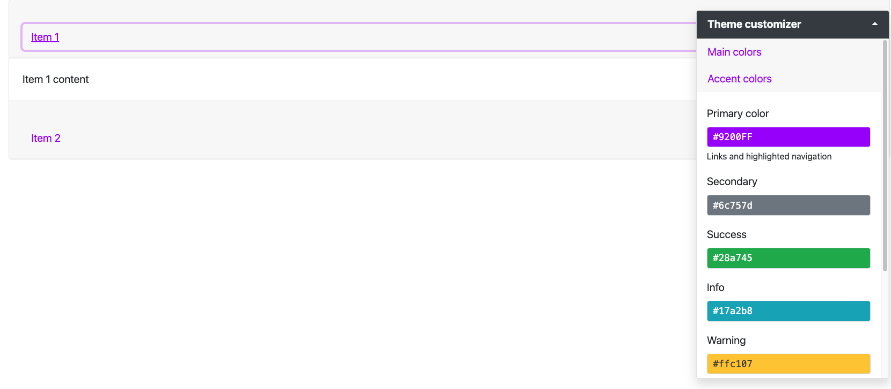
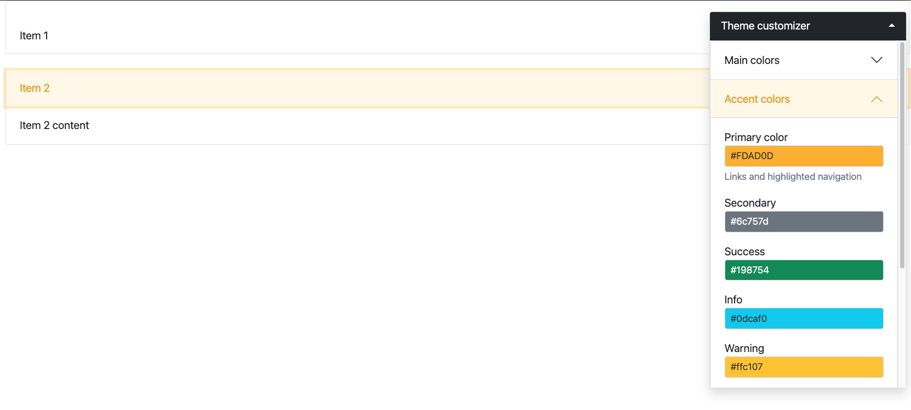
```

## Further resources
The reader will refer to the `{bslib}` various [vignettes](https://rstudio.github.io/bslib/articles/theming.html).
