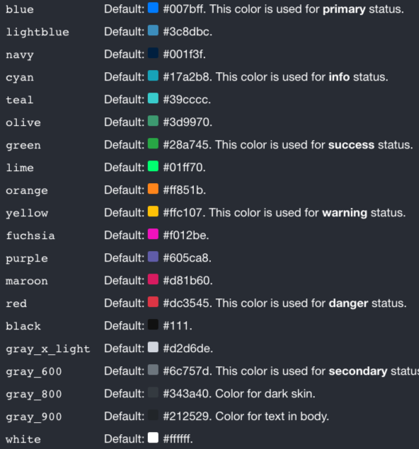
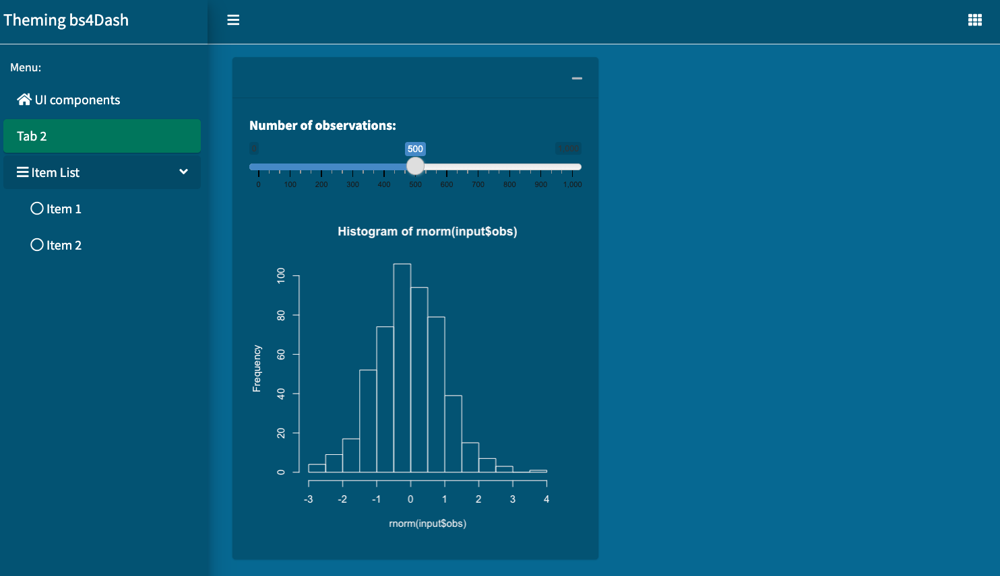
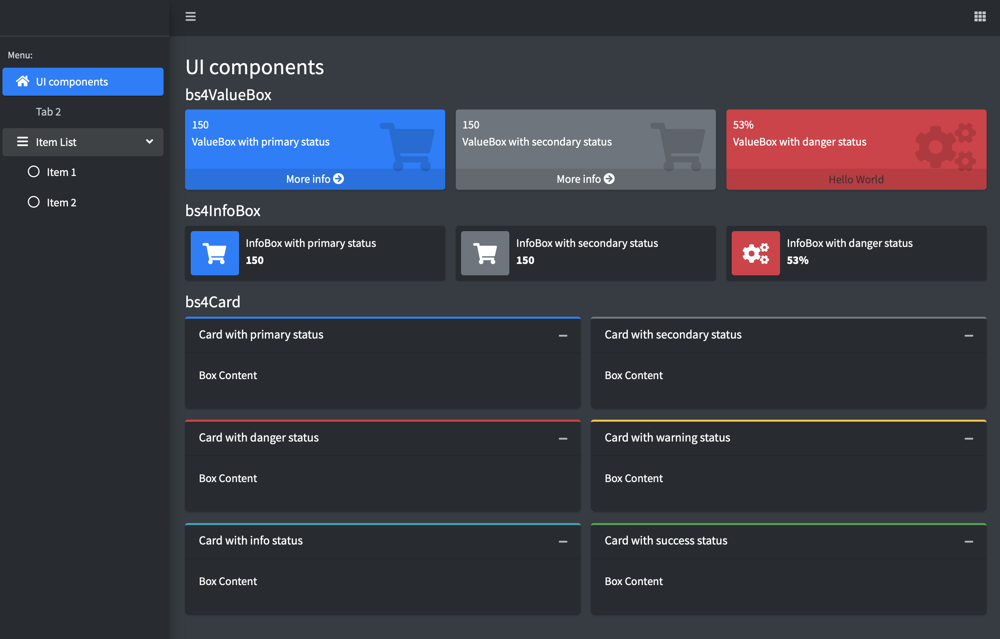
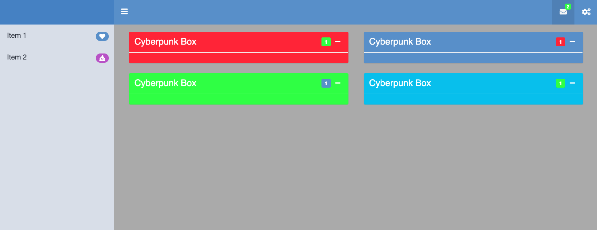

# Beautify with `{fresh}` {#beautify-with-fresh}
As shown in the previous chapter, __Sass__ is a powerful tool to customize apps in minutes, in addition to drastically improve __code quality__, thereby empowering long term maintenance. Some CSS knowledge are required and it may not be that easy to find the corresponding variables to a specific purpose. For instance, would you be able to guess what Bootstrap 4 variables are required to customize the `{bs4Dash}` template? 

In this chapter, as well as in chapter \@ref(beautify-with-bootstraplib), we show higher level tools to 
customize Bootstrap (3 or 4 and more) based templates. Let's start with the first one: `{fresh}`. 

[{fresh}](https://github.com/dreamRs/fresh) is an R package developed by the [dreamRs](https://www.dreamrs.fr/) team, also authors of [shinyWidget](https://github.com/dreamRs/shinyWidgets) and [esquisse](https://github.com/dreamRs/esquisse). All dreamRs projects are clearly a great source of inspiration to design outstanding Shiny apps, to such an extent that we highly recommend the reader to explore more about their work!

## `{fresh}`, the big picture
`{fresh}` is built on top of `{sass}` and what you see in Figures \@ref(fig:bs4Dash-fresh) and  \@ref(fig:shinydashboardPlus-fresh) may be done in few minutes! To design a new theme, the main function is `create_theme()`:

```{r, eval=FALSE}
create_theme(
  ...,
  theme = c("default", "cerulean", ...),
  output_file = NULL,
  include_assets = FALSE
)
```

__theme__ allows to import a [Bootswatch](https://bootswatch.com/) CSS theme, you may already know if you ever used `{shinythemes}`. __output_file__ controls the output. If provided, `create_theme()` creates a CSS file at the specified location. Otherwise, it returns a string value containing the compiles CSS. It is useful in a package context where you don't necessarily want to generate a new theme each time. __...__ is where we pass a list of CSS variables, through `bs4Dash_*` (specific to `{bs4Dash}`), `adminlte_*` (for `{shinydashboard}`) or `bs_vars_*` (for classic `{shiny}` apps) functions, which we describe below. 

In general, you'll have to call `use_theme()` inside the app UI to load the newly generated theme. 

::: {.noteblock data-latex=""}
Note that `{bs4Dash}` and `{shinydashboardPlus}` expose a __freshTheme__ parameter, which handles the provided theme on the fly.
:::

### Customize `{bs4Dash}` 

In what follows, we explain how to set a blue ocean theme in only few minutes. 

#### Statuses and colors
In chapter \@ref(sass-customize-bs4Dash), we showed how to change `{bs4Dash}` colors, with few lines of Sass code. Guess what: `{fresh}` makes it even easier! The `bs4dash_status()` and `bs4Dash_color()` functions allows to overwrite all the default statuses and colors:

```{r, eval=FALSE}
bs4dash_status(
  primary = NULL,
  secondary = NULL,
  success = NULL,
  info = NULL,
  warning = NULL,
  danger = NULL,
  light = NULL,
  dark = NULL
)

bs4dash_color(
  blue = NULL,
  lightblue = NULL,
  navy = NULL,
  cyan = NULL,
  teal = NULL,
  olive = NULL,
  green = NULL,
  # ...
)
```

By default, `primary` is blue but could become green with just one line of code. Do you recall about section \@ref(sass-customize-bs4Dash), where we customized `{bs4Dash}` colors with Sass? Let's try again with `{fresh}`. We first create the new theme, passing it the new colors and inject it inside the previously mentioned __freshTheme__ parameter:

```{r}
library(fresh)
custom_colors_theme <- create_theme(
  bs4dash_color(
    lightblue = "#136377",
    olive = "#d8bc66",
    lime = "#fcec0c",
    orange = "#978d01",
    maroon = "#58482c",
    gray_x_light = "#d1c5c0"
  )
)
```

The corresponding example may be run with:

```{r, echo=FALSE, results='asis'}
code_chunk(OSUICode::get_example("fresh/bs4Dash-custom", view_code = FALSE), "r")
```

To preview the code, use `OSUICode::get_example("fresh/bs4Dash-custom")`.

::: {.warningblock data-latex=""}
Note that complex variable names like `gray-x-light` become `gray_x_light`!
:::

Compared to the approach described in \@ref(sass-customize-bs4Dash), there a few advantages:

  - We don't have to specify the `AdminLTE.scss` location, as `{fresh}` hosts it [here](https://github.com/dreamRs/fresh/tree/master/inst/assets/AdminLTE-3.1.0).
  - We don't have to look for all colors names as they are described along the `bs4dash_color` function definition. We even have a description of the default values (as well as statuses in bold), depicted on Figure \@ref(fig:fresh-colors-defaults) below.
  
```{r fresh-colors-defaults, echo=FALSE, fig.cap='Default colors provided by {bs4Dash}', out.width='50%', fig.align='center'}

```

Corporate users will appreciate being able to set up a custom internal theme in minutes.

#### General Layout 
`bs4Dash_layout` exposes variables to control the sidebar width when expanded or collapsed, the sidebar padding, the controlbar width, the main background color and the main content padding. For the blue ocean theme, we change the body background color passing a new value to the `main_bg` variable, as below (Figure \@ref(fig:fresh-bs4Dash-bodybg)):

```{r}
layout_vars <- bs4dash_layout(main_bg = "#006994")
ocean_theme <- create_theme(layout_vars)
```

```{r fresh-bs4Dash-bodybg, echo=FALSE, fig.cap='Customized body background color', out.width='100%'}
knitr::include_graphics("images/beautify/fresh-bs4Dash-bodybg.png")
```

We acknowledge the result is not yet consistent but it gives a small glimpse about the package capabilities. 

#### Navbar
As illustrated in the `{bs4Dash}` documentation, the `dashboardHeader()` has two color flavors, that is `light` and `dark`. It defaults to `light`, meaning that icons and text will be displayed with a darker color, for contrast reasons, and inversely. The `{bs4Dash}` [gallery](https://dgranjon.shinyapps.io/bs4DashDemo/) quite well illustrates this property. 

Navbar variables may be found with `search_vars_bs4dash("navbar")`, for example:

```{r, warning=FALSE}
library(tibble)
head(
  as_tibble(
    search_vars_bs4dash("navbar")
  )[, c("variable", "value")]
)
```

We'll be using the `navbar_light_*` variables as follows:

  - The navbar color is determined by the `navbar-light` class. We change the global `light` status value to the brand new ocean blue with `bs4dash_status()`.
  - `navbar_light_color` set the navbar text and icon elements to white (`#fff`). It is the best choice given the background color we want to apply.

We also modified the `primary` status to be a shade of green:

```{r, warning=FALSE}
navbar_vars <- list(
  # navbar background
  bs4dash_status(light = "#005475", primary = "#00755c"), 
  # put toggler in white
  bs4dash_vars(navbar_light_color = "#fff") 
)
ocean_theme <- create_theme(layout_vars, navbar_vars)
```

#### Text color
The card text element would not properly be styled without setting the `white` color to 
the global ocean blue theme color, as they would render dark, which is a bad contrast option. Hence, we change the `white` and `gray_900` colors with `bs4dash_color()`. 

```{r, warning=FALSE}
inverted_colors <- bs4dash_color(
  gray_900 = "#fff", 
  white = "#005475"
)
ocean_theme <- create_theme(
  layout_vars, 
  navbar_vars, 
  inverted_colors
)
```

#### Color contrast
`bs4dash_yiq()` fine tunes the [contrast](https://getbootstrap.com/docs/4.0/getting-started/theming/#color-contrast) between a given color and its background. It relies on the Bootstrap 4 `color-yiq` function, whose code may be found [below](https://github.com/dreamRs/fresh/blob/master/inst/assets/bootstrap-4.5.2/_functions.scss#L70). Interested readers will have a look at the following [article](https://en.wikipedia.org/wiki/Luma_(video)), that explain better where this calculation is derived from.

```css
@function color-yiq($color, $dark: $yiq-text-dark, 
                    $light: $yiq-text-light) {
  $r: red($color);
  $g: green($color);
  $b: blue($color);

  $yiq: (($r * 299) + ($g * 587) + ($b * 114)) / 1000;

  @if ($yiq >= $yiq-contrasted-threshold) {
    @return $dark;
  } @else {
    @return $light;
  }
}
```

The function has three major steps:

  - Given a color, we extract its three components in the rgb space.
  - The `yiq` value is computed from these contributions, according to the above formula.
  - The threshold determines the final color value. If `yiq` is higher than the threshold, the color is black, and white otherwise. 
  
As an example, let's apply this to the default AdminLTE3 primary color `#0073b7`, with a threshold value of 150. We included an extra parameters to the `color-yiq` function, that represents the threshold value (defaulting to 150).

We utilize knowledge from Chapter \@ref(beautify-sass), particularly, the `sass_layer()` function to separate functions/mixins from rules and defaults:

```{r}
color_yiq <- "
  @function color-yiq($color, $threshold: 150, 
  $dark: $yiq-text-dark, $light: $yiq-text-light) {
    $r: red($color);
    $g: green($color);
    $b: blue($color);

    $yiq: (($r * 299) + ($g * 587) + ($b * 114)) / 1000;

    @if ($yiq >= $threshold) {
      @return $dark;
    } @else {
      @return $light;
    }
  }
"

background <- "
  $bg: #0073b7 !default;
  $yiq-text-dark: #111 !default;
  $yiq-text-light: #fff !default;
"
test_contrast <- ".test { background: color-yiq($bg); }"
sass(
  sass_layer(
    defaults = background,
    declarations = color_yiq,
    rules = test_contrast
  )
)
```

Wait a moment: `bs4dash_yiq()` does not expose any `color` parameter! Indeed, the color is already implicitly applied by the AdminLTE Sass code. 

As a last example, we design an app with a slider input controlling the contrast threshold and a radio input color picker to set the `box` current status color. We dynamically call `bs4dash_yiq()` and `create_theme`, with an initial threshold of 150 (Bootstrap default) and a dark and light values set to primary and white, respectively. The initial status is primary (blue), and as shown above, we expect the `yiq` value to be lower than the threshold since the blue color has a relatively light weight for the calculation, thereby fixing the background text color to white. As an exercise, you may try to reduce the threshold until the text becomes black. What is the threshold value. Then, replace the card status from `primary` to `warning`. What happens? Why? As yellow is made of green and red, which have the highest contributions in the `yiq` calculation, this result is not surprising!

```{r, echo=FALSE, results='asis'}
code_chunk(OSUICode::get_example("fresh/color-contrast", view_code = FALSE), "r")
```

The output is shown Figure \@ref(fig:color-contrast-yiq).

```{r color-contrast-yiq, echo=FALSE, fig.cap='Color contrast function in action', out.width='100%'}
knitr::include_graphics("images/beautify/color-contrast-yiq.png")
```

#### Sidebar 
Like `dashboardHeader()`, `dashboardSidebar()` exposes two flavors, namely `light` and `dark`. Since we set the sidebar to be `light`, we leverage the `bs4Dash_sidebar_light()` helper. We set the main background (`bg` variable) to ocean blue and set the menu color (`color` variable) to white, so as to have a better contrast. Additionally, we invert the `text_dark` and `text_light` colors for an even better contrast with `bs4dash_yiq()`. In short, the higher the `contrasted_threshold` parameter the less sensitive is the change. 

```{r, eval=FALSE}
sidebar_vars <- list(
  bs4dash_yiq(
    contrasted_threshold = 10, 
    text_dark = "#FFF", 
    text_light = "#272c30"
  ),
  bs4dash_sidebar_light(
    bg = "#005475", 
    color = "#FFF",
    hover_color = "#FFF",
    submenu_color = "#FFF", 
    submenu_hover_color = "#FFF"
  )
)
ocean_theme <- create_theme(
  layout_vars, 
  navbar_vars, 
  inverted_colors, 
  sidebar_vars
)
```

As the `{fresh}` theme does not apply to static plots, since they are not HTML element and not part of the DOM, we leverage the [`{thematic}`](https://rstudio.github.io/thematic/) package, that in short, provides a sort of CSS interface for base R plots, ggplot and lattice. Specifically, in the Shiny context, we choose `thematic_shiny()`. By default, it sets the appropriate background, foreground and accent colors. The final product is shown Figure \@ref(fig:fresh-bs4Dash-final) and may be run as per below code:

```{r, echo=FALSE, results='asis'}
code_chunk(OSUICode::get_example("fresh/bs4Dash-ocean-theme", view_code = FALSE), "r")
```

You may notice the inappropriate `sliderInput()` style. This is because it is not a Bootstrap 4 element. In this case, you'll have to create custom CSS rules targeting the slider labels and scale. 

```{r fresh-bs4Dash-final, echo=FALSE, fig.cap='Ocean theme for {bs4Dash}', out.width='100%'}

```

Below is another example of a custom dark theme, whose code may be found right after Figure \@ref(fig:bs4Dash-fresh).

```{r bs4Dash-fresh, echo=FALSE, fig.cap='Few lines of code to create a bs4Dash dark theme!', out.width='100%'}

```

```{r, eval=FALSE}
dark_theme <- create_theme(
  bs4dash_vars(
    navbar_light_color = "#bec5cb",
    navbar_light_active_color = "#FFF",
    navbar_light_hover_color = "#FFF"
  ),
  bs4dash_yiq(
    contrasted_threshold = 10, 
    text_dark = "#FFF", 
    text_light = "#272c30"
  ),
  bs4dash_layout(main_bg = "#353c42"),
  bs4dash_sidebar_dark(
    bg = "#272c30", 
    color = "#bec5cb", 
    hover_color = "#FFF",
    submenu_bg = "#272c30", 
    submenu_color = "#FFF", 
    submenu_hover_color = "#FFF"
  ),
  bs4dash_status(dark = "#272c30"),
  bs4dash_color(gray_900 = "#FFF", white = "#272c30")
)
```

```{r, echo=FALSE, results='asis'}
code_chunk(OSUICode::get_example("fresh/bs4Dash-dark-theme", view_code = FALSE), "r")
```

### Customize `{shinydashboard}` 

Similarly, `{fresh}` supports `{shinydashboard}` powered apps. In few lines of code, you may definitely provide a cyberpunk look and feel to your favorite shiny dashboard (Figure \@ref(fig:shinydashboardPlus-fresh)). `{shinydashboardPlus}` ([v2](https://rinterface.github.io/shinydashboardPlus/articles/more-skins.html#fresh)) has a plug and play support for `{fresh}` where the theme has to be passed to the `dashboardPage` _freshTheme_ parameter (it would also seamlessly work with `{shinydashboard}`). We start by creating the theme with `adminlte_colors()`, `adminlte_sidebar()` and `adminlte_global()`:

```{r, eval=FALSE}
cyberpunk_theme <- create_theme(
  adminlte_color(
    green = "#3fff2d",
    blue = "#2635ff",
    red = " #ff2b2b",
    yellow = "#feff6e",
    fuchsia = "#ff5bf8",
    navy = "#374c92",
    purple = "#615cbf",
    maroon = "#b659c9",
    light_blue = "#5691cc"
  ),
  adminlte_sidebar(
    dark_bg = "#D8DEE9",
    dark_hover_bg = "#81A1C1",
    dark_color = "#2E3440"
  ),
  adminlte_global(
    content_bg = "#aaaaaa"
  )
)
```

The demonstration may be run with, the result being shown on Figure \@ref(fig:shinydashboardPlus-fresh):

```{r, echo=FALSE, results='asis'}
code_chunk(OSUICode::get_example("fresh/shinydashboardPlus-cyberpunk", view_code = FALSE), "r")
```


```{r shinydashboardPlus-fresh, echo=FALSE, fig.cap='Cyberpunk shinydashboard', out.width='100%'}

```
