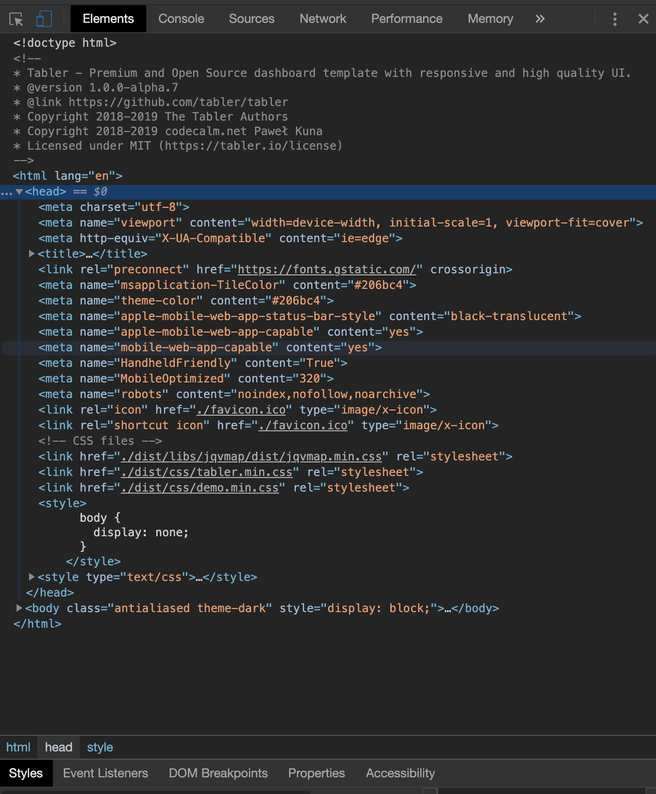

# Define dependencies {#custom-templates-dependencies}

## Introduction
The web provides a myriad of relevant **open source** HTML templates like [Colorlib](https://colorlib.com) and [Creative Tim](https://www.creative-tim.com/bootstrap-themes/free). Many of the RinteRface packages are actually built on top of those resources. However, some of them may require more efforts to work with `{shiny}`, for reasons mentioned in Chapter \@ref(web-dependencies):

  * `{shiny}` is built on top of [Bootstrap 3](https://getbootstrap.com/docs/3.3/) (HTML, CSS and Javascript framework), and changing the framework will not be a trivial endeavor. However, [shinymaterial](https://github.com/ericrayanderson/shinymaterial) and [shiny.semantic](https://github.com/Appsilon/shiny.semantic) are good examples that show this is possible.
  * `{shiny}` relies on [jQuery](https://jquery.com). Consequently, all templates based upon [React](https://fr.reactjs.org), [Vue](https://vuejs.org) and other Javascript framework will not be natively supported. Again, there exist some [examples](https://github.com/alandipert/react-widget-demo/blob/master/app.R) for React with `{shiny}` and more generally,
the [reactR](https://react-r.github.io/reactR/) package developed by Kent Russell and Alan Dipert. Chapter \@ref(going-further-reactR) provides a general overview.

In the next chapters, we will focus on the pretty [tabler.io](https://preview-dev.tabler.io/layout-dark.html) dashboard template (Figure \@ref(fig:tabler-dark)). We'll describe how to create an R wrapper on top of it, thereby making it available for all shiny users. 

```{r tabler-dark, echo=FALSE, fig.cap='Tabler dashboard overview', out.width='100%'}
knitr::include_graphics("images/practice/tabler-dark.png")
```

::: {.importantblock data-latex=""}
This chapter was written about two years ago, on top of the __1.0.0-alpha.7__ GitHub [release](https://github.com/tabler/tabler/tree/14d0c001436b85d2a4533d63680d209affdf774b). 
If the Tabler library significantly evolved since that date, the way to incorporate it into 
the shiny ecosystem remains __unchanged__. Hence, the methods we describe below may be __generalized__ to other
templates. We recommend to read this chapter before the next part in \@ref(workflow-charpente), during
which we present a more automated workflow, if you want to grasp the main concepts.
:::

## Discover the project
The first step of any template adaptation consists of __exploring__ the underlying GitHub [repository](https://github.com/tabler/tabler/tree/14d0c001436b85d2a4533d63680d209affdf774b)
and look for mandatory elements, like CSS/JS __dependencies__. 
This is a similar strategy if you want to incorporate an htmlwidget as well. 

As depicted by Figure \@ref(fig:tabler-github), the most important folders are:

  - __dist__, which contains CSS and JS files as well as other libraries like Bootstrap and jQuery. 
  It is also a good moment to look at the version of each dependency that might conflict with Shiny.
  - __demo__ is the website folder used for demonstration purpose. 
  This is our source to explore the template capabilities in depth.
  
The __scss__ and __build__ folder may be used to customize the tabler template directly. However as stated above, directions on how to do so are out of scope for this book.  

```{r tabler-github, echo=FALSE, fig.cap='GitHub project exploration', out.width='100%'}
knitr::include_graphics("images/practice/tabler-github.png")
```

## Identify mandatory dependencies
`Bootstrap 4`, `jQuery`, `tabler.min.css` and `tabler.min.js` are key elements for the template, 
contrary to flag icons which are optional (and take a lot of space). 
If your goal is to release your template on CRAN, be mindful of the 5 Mb maximum size limit. 
From personal experience, I can attest that this is quite challenging to manage.

To inspect dependencies, we proceed as follows:

  - __Download__ or __clone__ the GitHub repository.
  - Go to the __demo folder__ and open the `layout-dark.html` file.
  - Open the __HTML inspector__.
  
As shown on Figure \@ref(fig:tabler-deps) left-hand side, we need to include the `tabler.min.css` from the header. If you are not convinced, try to remove it from the DOM and see what happens. [jqvmap](https://www.10bestdesign.com/jqvmap/) is actually related to an external visualization plugin used in the demo. Finally the `demo.min.css` file is for the demo purpose. 
This will not prevent the template from working, so we will skip it for now. So far so good, we only need one file thus!
  
```{r tabler-deps, echo=FALSE, fig.show = "hold", out.width = "50%", fig.align = "default", fig.cap="tabler dependencies overview"}

knitr::include_graphics("images/practice/tabler-deps-2.png")
```

JavaScript dependencies are shown on the right-hand side and located at the end of the body tag. Because we will not need all chart-related dependencies like `apexcharts`, `jquery.vmap` and `vmap world`, we may safely ignore them. We only retain the Bootstrap 4, jQuery core and `tabler.min.js`, in the same order.

## Bundle dependencies
With the help of the `htmlDependency()` function, we are going to create our main Tabler HTML dependency containing all assets to allow our template to render properly. In this example, we are going to cheat a bit: instead of handling local files, we will use a CDN (content delivery network) that hosts all necessary Tabler [assets](https://www.jsdelivr.com/package/npm/tabler). This avoids to include all the necessary files in the R package, as well as in a GitHub repository.

::: {.warningblock data-latex=""}
For a __production__ template, that is designed to go on CRAN,
we recommend to host files __locally__, as described in Chapter \@ref(workflow-charpente).
:::

```{r}
library(htmltools)
tablers_deps <- htmlDependency(
  name = "tabler",
  version = "1.0.7", # we take that of tabler,
  src = c(href = "https://cdn.jsdelivr.net/npm/tabler@1.0.0-alpha.7/dist/"),
  script = "js/tabler.min.js",
  stylesheet = "css/tabler.min.css"
)
```

We advise the reader to create one HTML dependency per element. The Bootstrap version is `4.3.1`. We can also use a CDN:

```{r}
bs4_deps <- htmlDependency(
  name = "Bootstrap",
  version = "4.3.1",
  src = c(href = "https://stackpath.bootstrapcdn.com/bootstrap/4.3.1/js/"),
  script = "bootstrap.bundle.min.js"
)
```

We finally create our dependency manager:

```{r}
# add all dependencies to a tag. Don't forget to set 
# append to TRUE to preserve any existing dependency
add_tabler_deps <- function(tag) {
  # below, the order is of critical importance!
  deps <- list(bs4_deps, tablers_deps)
  attachDependencies(tag, deps, append = TRUE)
}
```

Notice the dependencies order in the `deps` list. This will be exactly the same order in the `head` of the HTML page. Some libraries require to be loaded at a specific place, like the Tabler dependencies which must come after Bootstrap. 

Let's see how to use `add_tabler_deps()`. We consider a `<div>` placeholder and check for its dependencies with `findDependencies()`. 
Then, we wrap it with `add_tabler_deps()`:

```{r}
tag <- div()
findDependencies(tag)
tag <- add_tabler_deps(div())
findDependencies(tag)
```

As shown above, our dependencies are applied to the div, in the correct order. This order is set by the list `list(bs4_deps, tablers_deps)` and allows use to avoid potential __conflicts__. If we try to run this simple tag in a shiny app, we notice that all dependencies are added to the `<head>` tag, whereas the original template loads JavaScript dependencies in the `<body>`. 

::: {.noteblock data-latex=""}
Unfortunately, `{htmltools}` does not allow developers to distribute dependencies in different places yet.
:::

Here there is no impact, but this might be no-go for templates requiring JavaScript to be placed in the body. In practice, this is challenging to guess and may only be solved by manual testing.

```{r, eval=FALSE}
library(shiny)
ui <- fluidPage(tag)
server <- function(input, output, session) {}
shinyApp(ui, server)
```

Even though the `add_tabler_deps()` function may be applied to any tag, we will use it with the core HTML template, that remain to be designed!

Would you like to see if our dependency system works? Let's meet in the next chapter to design the main dashboard layout.
