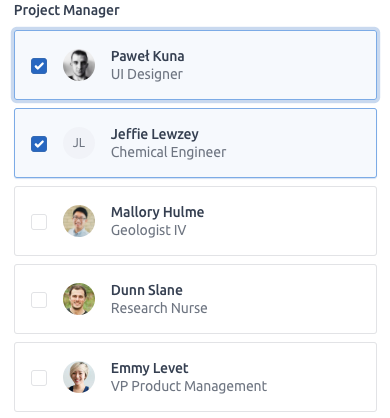

# Develop custom input widgets {#custom-templates-inputs}
In the previous chapter, we built template __dependencies__, the page __skeleton__, as well as containers like cards. Now is a great time to integrate new inputs, leveraging all knowledge from Chapter \@ref(shiny-input-system).

## Tabler action button
Let's start with a simple input: the __action button__. Tabler has built-in HTML buttons with a substantial amount of custom styles, compared to the classic Shiny action button. 

### Reminders about the action button
Below is the `actionButton()` code:

```{r}
actionButton <- function (inputId, label, icon = NULL, 
                          width = NULL, ...)  {
  value <- restoreInput(id = inputId, default = NULL)
  tags$button(
    id = inputId, 
    style = if (!is.null(width)) {
      paste0("width: ", validateCssUnit(width), ";")
    }, 
    type = "button", 
    class = "btn btn-default action-button", 
    `data-val` = value, 
    list(validateIcon(icon), label), ...
  )
}
```

The button tag has some __attributes__ like 
id, style, type, class, `data-val`, label and children passed via `...`.

When the app starts, the action button has the value 0, and each click increments its value by 1. How is this behavior controlled? If you recall, it is due to the input binding file, specifically the one for the action button:

```{r, echo=FALSE, results='asis'}
js_code <- "var actionButtonInputBinding = new InputBinding();
$.extend(actionButtonInputBinding, {
  find: function(scope) {
    return $(scope).find('.action-button');
  },
  getValue: function(el) {
    return $(el).data('val') || 0;
  },
  // ....; Extra code removed
});"
code_chunk_custom(js_code, "js")
```

What you see above is not the whole script since we focus on the first method, that is `find`. It will look for all elements having the class `action-button`, making it possible to define multiple action buttons at the same time.

Consequently, if we go back to the previous section, the `actionButton()` has the class `action-button`, thereby making it visible to the binding. Interestingly, all elements having the class `action-button` will be considered by the same shiny input binding. 

### Application to Tabler
First of all, let's compare the tabler HTML button to the Shiny action button.

```{r, echo=FALSE, results='asis'}
html_code <- '<button class="btn btn-primary">Button</button>'
code_chunk_custom(html_code, "html")
```

We convert it to R code. The button API contains more style and we leave the reader to add extra elements 
as an exercise.

```{r}
tabler_button <- function(inputId, label, status = NULL, 
                          icon = NULL, width = NULL, ...) {
  # SEE BELOW
  }
```

In Tabler, the button __status__ is mandatory, which is the reason why it is a function parameter. We assume that by default, the button has a blue color, which is given by `btn-primary`:

```{r, eval=FALSE}
btn_cl <- paste0(
  "btn action-button",
  if (is.null(status)) {
    " btn-primary"
  } else {
    paste0(" btn-", status)
  }
)
```

Moreover, we add an horizontal right margin to the icon, if provided so that the label renders well (`mr-1`, where m stands for margin, r is the right direction and 1 is the margin value). 

```{r, eval=FALSE}
# custom right margin
if (!is.null(icon)) icon$attribs$class <- paste0(
  icon$attribs$class, " mr-1"
)
```

The button tag is identical to that of Shiny, which is the reason why we don't show it here. The whole code may be found [here](https://github.com/DivadNojnarg/outstanding-shiny-ui-code/blob/b040a24e576f5d190825be0433edac288bbfbc26/R/tabler.R#L622).

```{r, echo=FALSE, results='asis'}
code_chunk(OSUICode::get_example("tabler/button"), "r")
```

We easily check that clicking on the button increments the related input. Thus, one may see how easy it is to implement a Tabler input button, built on top of the Shiny action button. The output is shown in Figure \@ref(fig:tabler-button).

```{r tabler-button, echo=FALSE, fig.cap='Tabler action button.', out.width='100%', fig.align='center'}
knitr::include_graphics("images/practice/tabler-button.png")
```

::: {.noteblock data-latex=""}
As a general rule, don't try to reinvent the wheel and see whether any existing Shiny element may be used instead.
:::

## Toggle Switch
We implement the toggle __switch__ component. The HTML structure may be inspected [here](https://github.com/tabler/tabler/blob/14d0c001436b85d2a4533d63680d209affdf774b/demo/form-elements.html) (or in  `demo/form-elements.html` if you already downloaded the repository locally). 
```{r, echo=FALSE, results='asis'}
html_code <- '<label class="form-check form-switch">
  <input class="form-check-input" type="checkbox" checked>
  <span class="form-check-label">Option 1</span>
</label>'
code_chunk_custom(html_code, "html")
```

Notice that the tabler switch has the checkbox type, which is very similar to the Shiny checkbox (a switch being a checkbox with a different style):

```{r}
checkboxInput("test", "Test", TRUE)
```

Therefore, we should again be able to build on top of an existing input [binding](https://github.com/rstudio/shiny/blob/60db1e02b03d8e6fb146c9bb1bbfbce269231add/srcjs/input_binding_checkbox.js#L1). We create the `tabler_switch()` function.

```{r}
tabler_switch <- function(inputId, label, value = FALSE, 
                          width = NULL) {
  # SEE BELOW
  }
```

We start to recover any possible bookmarked value with `restoreInput()`:

```{r, eval=FALSE}
value <- restoreInput(id = inputId, default = value)
```

Then, in line with the above HTML structure, we design the input tag. If we want to reuse the `shiny::checkboxInput()` binding, we must not forget the `type = checkbox`:

```{r, echo=FALSE, results='asis'}
js_code <- "$.extend(checkboxInputBinding, {
  find: function(scope) {
    return $(scope).find('input[type=\"checkbox\"]');
  }
  // other methods
});"
code_chunk_custom(js_code, "js")
```

```{r, eval=FALSE}
input_tag <- tags$input(
  id = inputId, 
  type = "checkbox",
  class = "form-check-input"
)
```

We conditionally add a `checked` attribute depending on the current `value` parameter:

```{r, eval=FALSE}
if (!is.null(value) && value) {
  input_tag <- tagAppendAttributes(
    input_tag, 
    checked = "checked"
  )
}
```

We proceed to the main wrapper creation, which has a `label` tag having the `form-check form-switch` class, as well as an optional `width` parameter:

```{r, eval=FALSE}
input_wrapper <- tags$label(
  class = "form-check form-switch", 
  style = if (!is.null(width)) {
    paste0("width: ", validateCssUnit(width), ";")
  }
)
```

We finally put everything together with `tagAppendChildren()`, the whole code being accessible [here](https://github.com/DivadNojnarg/outstanding-shiny-ui-code/blob/b040a24e576f5d190825be0433edac288bbfbc26/R/tabler.R#L661):

```{r, eval=FALSE}
  tagAppendChildren(
    input_wrapper,
    input_tag,
    span(class = "form-check-label", label)
  )
```

Besides, we may also create an `update_tabler_switch()` function similar to the `updateCheckboxInput()`. We leverage `OSUICode::dropNulls()`, a function that removes all `NULL` elements from a list. If you remember, the `session$sendInputMessage` from R is received by the `receiveMessage` method on the JavaScript side:

```{r, eval=FALSE}
update_tabler_switch <- function (session, inputId, 
                                  label = NULL, 
                                  value = NULL) {
  message <- dropNulls(list(label = label, value = value))
  session$sendInputMessage(inputId, message)
}
```

In the following example, the action button toggles the switch input value when clicked, as shown in Figure \@ref(fig:tabler-toggle).

```{r, echo=FALSE, results='asis'}
code_chunk(OSUICode::get_example("tabler/switch"), "r")
```

```{r tabler-toggle, echo=FALSE, fig.cap='Tabler action button updating a toggle input.', out.width='75%', fig.align='center'}
knitr::include_graphics("images/practice/tabler-toggle.png")
```

Et voilà! Two inputs in just a few minutes. 


## Navbar menu input {#custom-templates-inputs-navbar}
As stated in Chapter \@ref(shiny-input-system), it is quite straightforward to bind elements other than primary inputs (HTML elements with the input tag) to Shiny. As a reminder, we created a custom input binding to detect the state of a `{shinydashboard}` box.
In Chapter \@ref(custom-templates-skeleton), we designed the `tabler_navbar()`, as well as the `tabler_navbar_menu()` and `tabler_navbar_menu_item()`. As in `{shinydashboard}`, it would be great to capture the currently selected tab to subsequently perform actions on the server side, updating the selected tab based on a button click.

Where do we start? First of all, we add an __id__ attribute to the `tabler_navbar_menu()` so that it holds the corresponding `input$id`. Whether to use `inputId` or `id` as a parameter name is up to you, `id` being personally prefered in that case:

```{r}
tabler_navbar_menu <- function(..., inputId = NULL) {
  tags$ul(
    id = inputId, 
    class = "nav nav-pills navbar-nav",
    ...
  )
}
```

The next step is the JS `navbarMenuBinding` creation. We decide to look for the `navbar-nav` class in the `find` method. Below, we describe the binding step by step. You may find the whole working code at the end of this example:

```{r, echo=FALSE, results='asis'}
js_code <- "find: function(scope) {
  return $(scope).find('.navbar-nav');
}"
code_chunk_custom(js_code, "js")
```

In the `initialize` method, we ensure that if no tab is selected at start, the first tab will be selected by default. Otherwise, we select the activated tab. We use the __template literals__ to ease the insertion of JS code in strings (``${menuId} .nav-link.active``):

```{r, echo=FALSE, results='asis'}
js_code <- "initialize: function(el) {
  let menuId = '#' + $(el).attr('id');
  let activeTab = $(`${menuId} .nav-link.active`);
  // if multiple items are found
  if (activeTab.length > 0) {
    let tabId = $(activeTab).attr('data-value');
    $(activeTab).tab('show');
    $(`#${tabId}`).addClass('show active');
  } else {
    $(`${menuId} .nav-link`)
      .first()
      .tab('show');
  }
}"
code_chunk_custom(js_code, "js")
```

The role of `getValue` is to return the currently selected tab. 
As a reminder, here is the `tabler_navbar_menu_item()` function:

```{r, eval=FALSE}
tabler_navbar_menu_item <- function(text, tabName, 
                                    icon = NULL, 
                                    selected = FALSE) {
  
  item_cl <- paste0("nav-link", if(selected) " active")
  
  tags$li(
    class = "nav-item",
    a(
      class = item_cl,
      `data-value` = tabName,
      # Commented since not relevant
    )
  )
}
```

From that function, the active item has is the `a` element with the classes `nav-link active`. We recover the tab value stored in the `data-value` attribute. A bit of jQuery does the trick:

```{r, echo=FALSE, results='asis'}
js_code <- "getValue: function(el) {
  let activeTab = $(el).find('a').filter('nav-link active');
  return $(activeTab).attr('data-value');
}"
code_chunk_custom(js_code, "js")
```

`setValue` is the function allowing to update the active tab. Bootstrap 4 already has
predefined methods to [activate](https://getbootstrap.com/docs/4.0/components/navs/#via-javascript) tabs. The easiest way is to select the tab by name like `$('#tabMenu a[data-target="#tab1"]').tab('show')`. The `receiveMessage` is simply applying the `setValue` method:

```{r, echo=FALSE, results='asis'}
js_code <- "setValue: function(el, value) {
  let hrefVal = '#' + value;
  let menuId = $(el).attr('id');
  $(`#${menuId} a[data-target=\"${hrefVal}\"]`).tab('show');
}

receiveMessage: function(el, data) {
  this.setValue(el, data);
}"
code_chunk_custom(js_code, "js")
```

Besides, we have to create the `update_tabler_tab_item()` function:

```{r}
update_tabler_tab_item <- function(
  inputId, 
  value, 
  session = getDefaultReactiveDomain()
) {
  session$sendInputMessage(inputId, message = value)
}
```

`subscribe` tells Shiny when to change the current input value and made it available
in the whole app. We may listen to multiple events, keeping in mind that events occur in the following order:

  - `hide.bs.tab` (on the current active tab).
  - `show.bs.tab` (on the to-be-shown tab).
  - `hidden.bs.tab` (on the previous active tab, the same one as for the hide.bs.tab event).
  - `shown.bs.tab` (on the newly-active just-shown tab, the same one as for the show.bs.tab event).
  
Hence, it makes more sense to listen to `shown.bs.tab`, that is wait for the current tab to be shown:

```{r, echo=FALSE, results='asis'}
js_code <- "subscribe: function(el, callback) {
  // important to use shown.bs.tab and not show.bs.tab!
  $(el).on('shown.bs.tab.navbarMenuBinding', function(e) {
    callback();
  });
},
  
unsubscribe: function(el) {
  $(el).off('.navbarMenuBinding');
}"
code_chunk_custom(js_code, "js")
```

The whole binding code is located [here](https://github.com/DivadNojnarg/outstanding-shiny-ui-code/blob/db99b034b06a1ab26ef27bf864b2c853626ebc19/inst/tabler/tabler-update-navbar/navbarMenuBinding.js).

How do we include this custom input binding in our package? In `{OSUICode}`, we created the following HTML __dependency__:

```{r, eval=FALSE}
tabler_custom_js <- htmlDependency(
  name = "tabler-bindings",
  version = "1.0.7",
  src = "tabler",
  package = "OSUICode",
  script = "input-bindings/navbarMenuBinding.js"
)
```

We also updated the `add_tabler_deps`, as below.

```{r, eval=FALSE}
add_tabler_deps <- function(tag) {
  # below, the order is of critical importance!
  deps <- list(bs4_deps, tablers_deps, tabler_custom_js)
  attachDependencies(tag, deps, append = TRUE)
}
```

We test the new `navbar_menu()` binding below.

```{r, echo=FALSE, results='asis'}
code_chunk(OSUICode::get_example("tabler/update-navbar", view_code = FALSE), "r")
```

Here we are! 

## Exercises
1. Have a look at the Tabler documentation about [buttons](https://github.com/tabler/tabler/blob/14d0c001436b85d2a4533d63680d209affdf774b/demo/buttons.html) and extend the `tabler_button` function accordingly.
2. Propose an implementation of the `Advanced selectboxes` shown [here](https://github.com/tabler/tabler/blob/14d0c001436b85d2a4533d63680d209affdf774b/demo/form-elements.html) and Figure \@ref(fig:tabler-advanced-select).

```{r tabler-advanced-select, echo=FALSE, fig.cap='Advanced select input with user image.', out.width='40%', fig.align='center'}

```

3. Cards are central elements of all templates. So are tabset panels. Try to modify the `tabler_card()` function
to create a `tabler_tab_card()` function, adding tab navigation within the card header.  
