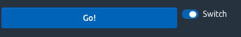

# Develop custom input widgets {#custom-templates-inputs}
In the previous chapter, we built template dependencies, the page skeleton, as well as containers like cards. However, it would be nice to customize user interactions by integrating new inputs. In this chapter, we will apply knowledge from Chapter \@ref(shiny-input-system) about creating new Shiny input. 

## Tabler action button
Let's start with a simple input: the action button. Tabler has built-in HTML buttons with a substantial amount of custom styles, compared to the classic Shiny action button. 

### Reminders about the action button
Below is the code of the `actionButton` input.

```{r}
actionButton <- function (inputId, label, icon = NULL, width = NULL, ...)  {
  value <- restoreInput(id = inputId, default = NULL)
  tags$button(
    id = inputId, 
    style = if (!is.null(width)) paste0("width: ", validateCssUnit(width), ";"), 
    type = "button", 
    class = "btn btn-default action-button", 
    `data-val` = value, 
    list(validateIcon(icon), label), ...
  )
}
```

The button tag has some attributes: id, style, type, class, `data-val`, label and children passed via `...`

When the app starts, the action button has the value 0 and each click will increment its value by 1. How is this behaviour created? For each Shiny input element (radio, slider), there is an associated JavaScript file, called input binding, which you can find [here](https://github.com/rstudio/shiny/tree/master/srcjs). In our case, we are only interested in the action button binding:

```javascript
var actionButtonInputBinding = new InputBinding();
$.extend(actionButtonInputBinding, {
  find: function(scope) {
    return $(scope).find(".action-button");
  },
  getValue: function(el) {
    return $(el).data('val') || 0;
  },
  // ... other methods
});
```

What you see above is **not** the whole script since we focus on the first method, that is `find`. It will look for **all** elements having the class `action-button`, making it possible to define multiple action buttons at the same time.

Consequently, if we go back to the previous section, the `actionButton` has the class `action-button`, thereby making it visible to the binding. Interestingly, all elements having the class `action-button` will be considered by the same shiny input binding. 

### Application to Tabler
First of all, let's compare the tabler HTML button to the Shiny action button.

```html
<button class="btn btn-primary">Button</button>
```

We convert it to R. The button API contains more style and leave the reader to add extra elements as an exercise.

```{r}
tabler_button <- function(inputId, label, status = NULL, icon = NULL, width = NULL, ...) {
  
  btn_cl <- paste0(
    "btn action-button",
    if (is.null(status)) {
      " btn-primary"
    } else {
      paste0(" btn-", status)
    }
  )
  
  value <- restoreInput(id = inputId, default = NULL)
  
  # custom right margin
  if (!is.null(icon)) icon$attribs$class <- paste0(
    icon$attribs$class, " mr-1"
  )
  
  tags$button(
    id = inputId, 
    style = if (!is.null(width)) paste0("width: ", validateCssUnit(width), ";"), 
    type = "button", 
    class = btn_cl, 
    `data-val` = value, 
    list(icon, label), ...
  )
}
```

In Tabler, the button status is mandatory, which is the reason why it is a parameter of the function. Moreover, we need to add an horizontal right margin to the icon, if provided so that the label renders well (`mr-1`, where m stands for margin, r is the right direction and 1 is the margin value). We assume that by default, the button wil have a blue color, that is given by `btn-primary`.


```{r, eval=FALSE}
ui <- tabler_page(
  tabler_body(
    tabler_button(
      "btn", 
      HTML(paste("Value", textOutput("val"), sep = ":")), 
      icon = icon("thumbs-up"), 
      width = "25%"
    )
  )
)

server <- function(input, output, session) {
  output$val <- renderText(input$btn)
}

shinyApp(ui, server)
```

We easily check that clicking on the button increments the related input. Thus, one may see how easy it is to implement a custom Tabler input button, built on top of the Shiny action button. The output is shown in Figure \@ref(fig:tabler-button).

```{r tabler-button, echo=FALSE, fig.cap='Tabler action button'}
knitr::include_graphics("images/practice/tabler-button.png")
```

<br>
<div class="callout callout-info">
As a general rule, don't try to reinvent the wheel and see whether any existing Shiny element may be reused/adapted!
</div>
<br>

## Toggle Switch
We implement the toggle [switch](https://preview-dev.tabler.io/docs/form-elements.html#custom-selectboxes) component. 

```html
<label class="form-check form-switch">
  <input class="form-check-input" type="checkbox" checked>
  <span class="form-check-label">Option 1</span>
</label>
```

Notice that the tabler switch has the checkbox type, which is very similar to the Shiny checkbox (a switch is a checkbox with a different style)

```{r}
checkboxInput("test", "Test", TRUE)
```

Therefore, we should again be able to build on top of an existing input [binding](https://github.com/rstudio/shiny/blob/master/srcjs/input_binding_checkbox.js). We create the `tabler_switch` function:

```{r}
tabler_switch <- function(inputId, label, value = FALSE, width = NULL) {
  
  value <- restoreInput(id = inputId, default = value)
  input_tag <- tags$input(
    id = inputId, 
    type = "checkbox",
    class = "form-check-input"
  )
  
  if (!is.null(value) && value) {
    input_tag <- input_tag %>% tagAppendAttributes(checked = "checked")
  }
  
  input_wrapper <- tags$label(
    class = "form-check form-switch", 
    style = if (!is.null(width)) {
      paste0("width: ", validateCssUnit(width), ";")
    }
  )
  
  input_wrapper %>% tagAppendChildren(
    input_tag,
    span(class = "form-check-label", label)
  )
}
```

Besides, we may also create an `update_tabler_switch` function similar to the `updateCheckboxInput`. We will also need `dropNulls`, a function that removes all NULL elements from a list (this function is often used in all custom Shiny templates). If you remember, the `sendInputMessage` from R will be received by the ` receiveMessage` method on the JavaScript side.

```{r}
dropNulls <- function (x) {
  x[!vapply(x, is.null, FUN.VALUE = logical(1))]
}

update_tabler_switch <- function (session, inputId, label = NULL, value = NULL) {
  message <- dropNulls(list(label = label, value = value))
  session$sendInputMessage(inputId, message)
}
```

In the following example, the action button toggles the switch input value when clicked, as shown in Figure \@ref(fig:tabler-toggle).

```{r, eval=FALSE}
ui <- tabler_page(
  tabler_body(
    fluidRow(
      tabler_button("update", "Go!", width = "25%", class = "mr-2"),
      tabler_switch("toggle", "Switch", value = TRUE, width = "25%")
    )
  )
)

server <- function(input, output, session) {
  observe(print(input$toggle))
  observeEvent(input$update, {
    update_tabler_switch(
      session, 
      "toggle", 
      value = !input$toggle
    )
  })
}

shinyApp(ui, server)
```

```{r tabler-toggle, echo=FALSE, fig.cap='Tabler action button updating a toggle input'}

```

Et voilà! Two inputs in few minutes. 


## Navbar menu input
As stated in Chapter \@ref(shiny-input-system), it is quite straightforward to bind other elements than pure inputs (HTML elements with the input tag) to Shiny. As a reminder, we created a custom input binding to detect the state of a shinydashboard box (collapsed/uncollapsed).
In chapter \@ref(custom-templates-skeleton), we created the `tabler_navbar` as well as the `tabler_navbar_menu` and `tabler_navbar_menu_item`. As in shinydashboard, it would be nice to capture the currently selected tab to be able to perform actions on the server side, updating the selected tab based on a button click.

Where do we start? First of all, we add an id attribute to the `tabler_navbar_menu` so that it holds the corresponding `input$id`. Whether to use `inputId` or `id` as a parameter name is up to you, but keep in mind that `inputId` does not exist in HTML. 

```{r}
tabler_navbar_menu <- function(..., inputId = NULL) {
  tags$ul(id = inputId, class = "nav nav-pills navbar-nav", ...)
}
```

The next step is the `navbarMenuBinding` creation. We decide to look for the `navbar-nav` class in the `find` method. Below, we describe the binding step by step. You may find the whole working code at the end of this example.

```javascript
find: function(scope) {
  return $(scope).find('.navbar-nav');
}
```

In the `initialize` method, we ensure that if no tab is selected at start, the first tab will be selected by default. Otherwise, we select the activated tab. We use the string interpolation to ease the insertion of JS code in strings (``${menuId} .nav-link.active``).

```javascript
initialize: function(el) {
  let menuId = '#' + $(el).attr('id');
  let activeTab = $(`${menuId} .nav-link.active`);
  // if multiple items are found
  if (activeTab.length > 0) {
    let tabId = $(activeTab).attr('data-value');
    $(activeTab).tab('show');
    $(`#${tabId}`).addClass('show active');
  } else {
    $(`${menuId} .nav-link`)
      .first()
      .tab('show');
  }
}
```

The role of `getValue` is to return the currently selected tab. As a reminder, here is the `tabler_navbar_menu_item` function:

```{r}
tabler_navbar_menu_item <- function(text, tabName, icon = NULL, selected = FALSE) {
  
  item_cl <- paste0("nav-link", if(selected) " active")
  
  tags$li(
    class = "nav-item",
    a(
      class = item_cl,
      href = paste0("#", tabName),
      `data-toggle` = "pill", # see https://getbootstrap.com/docs/4.0/components/navs/
      `data-value` = tabName,
      role = "tab",
      span(class = "nav-link-icon d-md-none d-lg-inline-block", icon),
      span(class = "nav-link-title", text)
    )
  )
}
```

From that function, the active item has is the `a` element with the classes `nav-link active`. We recover the tab value stored in the `data-value` attribute. A bit of jQuery will do the trick!


```javascript
getValue: function(el) {
  let activeTab = $(el).find('a').filter('nav-link active');
  return $(activeTab).attr('data-value');
}
```


`setValue` is the function allowing to update the active tab. Bootstrap 4 already has
predefined methods to [activate](https://getbootstrap.com/docs/4.0/components/navs/#via-javascript) tabs. The easiest way is to select the tab by name like `$('#tabMenu a[href="#tab1"]').tab('show')`. The `receiveMessage` is simply applying the `setValue` method.

```javascript
setValue: function(el, value) {
  let hrefVal = '#' + value;
  let menuId = $(el).attr('id');
  $(`#${menuId} a[href="${hrefVal}"]`).tab('show');
}

receiveMessage: function(el, data) {
  this.setValue(el, data);
}
```

Besides, we have to create the `update_tabler_tab_item` function.

```{r}
update_tabler_tab_item <- function(inputId, value, session = getDefaultReactiveDomain()) {
  session$sendInputMessage(inputId, message = value)
}
```

`subscribe` will tell Shiny when to change the current input value and made it available
in the whole app. We may listen to multiple events, keeping in mind that events occur in the following order:

  - hide.bs.tab (on the current active tab)
  - show.bs.tab (on the to-be-shown tab)
  - hidden.bs.tab (on the previous active tab, the same one as for the hide.bs.tab event)
  - shown.bs.tab (on the newly-active just-shown tab, the same one as for the show.bs.tab event)
  
Hence, it makes more sense to listen to `shown.bs.tab` (wait the current tab to be shown).

```javascript
subscribe: function(el, callback) {
  // important to use shown.bs.tab and not show.bs.tab!
  $(el).on('shown.bs.tab.navbarMenuBinding', function(e) {
    callback();
  });
},
  
unsubscribe: function(el) {
  $(el).off('.navbarMenuBinding');
}
```

Below is a recap of the binding with the creation and registration included:

```javascript
$(function() {
  // Input binding
  let navbarMenuBinding = new Shiny.InputBinding()
  $.extend(navbarMenuBinding, {
    find: function(scope) {
      return $(scope).find('.navbar-nav');
    },
    initialize: function(el) {
      let menuId = '#' + $(el).attr('id');
      let activeTab = $(`${menuId} .nav-link.active`);
      // if multiple items are found
      if (activeTab.length > 0) {
        let tabId = $(activeTab).attr('data-value');
        $(activeTab).tab('show');
        $(`#${tabId}`).addClass('show active');
      } else {
        $(`${menuId} .nav-link`)
          .first()
          .tab('show');
      }
    },
    // Given the DOM element for the input, return the value
    getValue: function(el) {
      let activeTab = $(el).find('a').filter('.nav-link.active');
      return $(activeTab).attr('data-value');
    },
    setValue: function(el, value) {
      let hrefVal = '#' + value;
      let menuId = $(el).attr('id');
      $(`#${menuId} a[href="${hrefVal}"]`).tab('show');
    },
    receiveMessage: function(el, data) {
      this.setValue(el, data);
    },
    subscribe: function(el, callback) {
      $(el).on('shown.bs.tab.navbarMenuBinding', function(event) {
        callback();
      });
    },
    unsubscribe: function(el) {
      $(el).off('.navbarMenuBinding');
    }
  });
  
  Shiny.inputBindings.register(navbarMenuBinding, 'navbar-menu');
});
```

We test the new `navbar_menu` binding below.


```{r, eval=FALSE}
ui <- tabler_page(
  tabler_navbar(
    brand_url = "https://preview-dev.tabler.io", 
    brand_image = "https://preview-dev.tabler.io/static/logo.svg", 
    nav_menu = tabler_navbar_menu(
      id = "current_tab",
      tabler_navbar_menu_item(
        text = "Tab 1",
        icon = NULL,
        tabName = "tab1",
        selected = TRUE
      ),
      tabler_navbar_menu_item(
        text = "Tab 2",
        icon = NULL,
        tabName = "tab2"
      )
    ),
    tabler_button("update", "Change tab", icon = icon("exchange-alt"))
  ),
  tabler_body(
    tabler_tab_items(
      tabler_tab_item(
        tabName = "tab1",
        sliderInput(
          "obs", 
          "Number of observations:",
          min = 0,
          max = 1000, 
          value = 500
        ),
        plotOutput("distPlot")
      ),
      tabler_tab_item(
        tabName = "tab2",
        p("Second Tab")
      )
    ),
    footer = tabler_footer(
      left = "Rstats, 2020", 
      right = a(href = "https://www.google.com")
    )
  )
)
server <- function(input, output, session) {
  output$distPlot <- renderPlot({
    hist(rnorm(input$obs))
  })
  
  observeEvent(input$current_tab, {
    showNotification(
      paste("Hello", input$current_tab), 
      type = "message",
      duration = 1
    )
  })
  
  observeEvent(input$update, {
    newTab <- if (input$current_tab == "tab1") "tab2" else "tab1"
    update_tabler_tab_item("current_tab", newTab)
  })
}
shinyApp(ui, server)
```

Here we are! 


## Exercises
1. Have a look at the Tabler documentation about [buttons](https://preview-dev.tabler.io/docs/buttons.html) and extend the `tabler_button` function accordingly.
2. Propose an implementation of the `Advanced selectboxes` shown [here](https://preview-dev.tabler.io/docs/form-elements.html#).
3. Cards are a central elements of all templates. So are tabset panels. Improve the `tab_card` function developed in exercise 1 of Chapter \@ref(custom-templates-skeleton) so that one may easily recover the currently selected tab. Hint: a custom input binding is required.