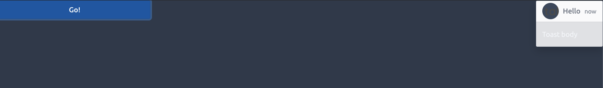
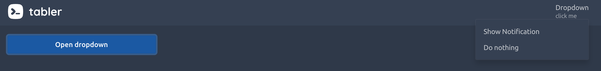
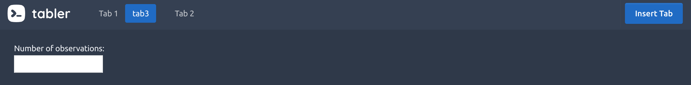

# Adding more interactivity {#custom-templates-interactivity}
In this part, we are going to bring even more life to the template element. 
We first see how to enhance an existing static HTML component, through a simple progress bar example. 
Then we explore more complex elements involving specific Shiny patterns.

All the JavaScript handlers described below are gathered in an HTML dependency, as well as an input binding(s):

```{r, eval=FALSE}
# contains bindings and other JS code
tabler_custom_js <- htmlDependency(
  name = "tabler-bindings",
  version = "1.0.7",
  src = "tabler",
  package = "OSUICode",
  script = c(
    "input-bindings/navbarMenuBinding.js",
    "tabler_progress_handler.js",
    "tabler_toast_handler.js",
    "tabler_dropdown_handler.js",
    "tabler_insert_tab_handler.js"
  )
)
```

## Custom progress bars
__Progress bars__ are a good way to display metric related to a progress, for instance tracking the number of remaining tasks for a project. In general, those elements are static HTML. Hence, it would be interesting to update the current value from the server side. Since it is not an proper input element, implementing an input binding is inappropriate and we decide to proceed with a custom handler. We first create the `tabler_progress()` tag which is mainly composed of:

  - `style` gives the current progress value. This is the main element.
  - `min` and `max` are bounds, in general between 0 and 100.
  - `id` ensures the progress bar uniqueness, thereby avoiding conflicts.

```{r}
tabler_progress <- function(id = NULL, value) {
  div(
    class = "progress",
    div(
      id = id, 
      class = "progress-bar",
      style = paste0("width: ", value, "%"),
      role = "progressbar",
      `aria-valuenow` = as.character(value),
      `aria-valuemin` = "0",
      `aria-valuemax` = "100",
      span(class = "sr-only", "38% Complete")
    )
  )
}

update_tabler_progress <- function(
  id, 
  value, 
  session = shiny::getDefaultReactiveDomain()
) {
  message <- list(id = session$ns(id), value = value)
  session$sendCustomMessage(
    type = "update-progress",
    message
  )
}
```

The next element is the `update_tabler_progress()` function which sends two elements from R to JS:

  - The progress __id__.
  - The new __value__.

On the JS side, we leverage the well known `Shiny.addCustomMessageHandler`. As mentioned in Chapter \@ref(survival-kit-javascript), `sendCustomMessage` and `addCustomMessageHandler` are connected by the __type__ parameter. This is crucial! Moreover, as the sent message is a R list, it becomes an JSON, meaning that elements must be accessed with a `.` in JS:

```js
$(function () {
  Shiny.addCustomMessageHandler(
    'update-progress', function(message) {
    $('#' + message.id).css('width', message.value +'%');
  });
});
```

We finally test these components in a simple app, whom output is depicted in Figure \@ref(fig:tabler-progress):

```{r, eval=FALSE}
library(shiny)
library(OSUICode)
library(shinyWidgets)
ui <- tabler_page(
  tabler_body(
    noUiSliderInput(
      inputId = "progress_value",
      label = "Progress value",
      min = 0, 
      max = 100,
      value = 20
    ),
    tabler_progress(id = "progress1", 12)
  )
)

server <- function(input, output, session) {
  observeEvent(input$progress_value, {
    update_tabler_progress(
      id = "progress1", 
      input$progress_value
    )
  })
}
shinyApp(ui, server)
```

```{r tabler-progress, echo=FALSE, fig.cap='Progress bar component updated by a slider', out.width='100%'}
knitr::include_graphics("images/practice/tabler-progress.png")
```

::: {.noteblock data-latex=""}
How to handle custom messages in shiny modules? Well, it is pretty straightforward: we wrap any id with the module __namespace__ given by __session$ns()__ before sending it to JS. You may even do it by default.
:::

Is there a way to directly update the progress from the client which would avoid to exchange data between R and JS, thereby saving some time?

The idea is to get rid of the classic `session$sendCustomMessage` and `Shiny.addCustomMessageHandler` method. We could directly create a function that inserts a script in the UI taking a __trigger__ and __target__ as main parameters. This function would have to be inserted multiple times if multiple triggers had to update the same target. The JS logic is slightly different:

  - We have to wait for shiny to be connected so that the JS `Shiny` object is ready.
  - We recover the trigger element with any JS/jQuery method.
  - We leverage the noUiSlider [API](https://refreshless.com/nouislider/) to listen to any update in the range. It's fine because the slider instance has already been initialized in the shinyWidget [input binding](https://github.com/dreamRs/shinyWidgets/blob/master/inst/assets/nouislider/nouislider-bindings.js#L100). This would not work if we were not waiting for shiny to be connected (you may try)! Notice the use of `this.get()` in the event listener, which avoids to repeat `slider.noUiSlider`
  - We modify the `width` CSS property of the target like in the previous example.

```js
$(document).on('shiny:connected', function(event) {
  let slider = document.getElementById('triggerId');
  slider.noUiSlider.on('update', function(event) {
    $('#targetId').css('width', this.get() + '%');
  });
});
```

```{r, eval=FALSE}
update_tabler_progress2 <- function(trigger, target) {
  tags$script(
    paste0(
      "$(document).on('shiny:connected', function(event) {
        let slider = document.getElementById('", trigger, "');
        slider.noUiSlider.on('update', function(event) {
          $('#", target, "').css('width', this.get() + '%');
        });
      });
      "
      )
  )
}

ui <- tabler_page(
  update_tabler_progress2("progress_value", "progress1"),
  update_tabler_progress2("progress_value2", "progress2"),
  tabler_body(
    fluidRow(
      noUiSliderInput(
        inputId = "progress_value",
        label = "Progress value 1",
        min = 0, 
        max = 100,
        value = 20
      ),
      noUiSliderInput(
        inputId = "progress_value2",
        label = "Progress value 2",
        min = 0, 
        max = 100,
        value = 80,
        color = "red"
      )
    ),
    tabler_progress(id = "progress1", 12),
    br(), br(),
    tabler_progress(id = "progress2", 100)
  )
)

server <- function(input, output, session) {}
shinyApp(ui, server)
```

Question: Run the above example in an external web browser, then stop the app from RStudio. Try to move both sliders. What happens for the progress bars? Compare with a classic `update` function. How could you explain this? 

Overall this way is a bit more complex. Yet, assuming a very complex app with data manipulation, tons of inputs and visualizations, everything that can be done from the client (web browser) is less work for the R server part and a better end-user experience! Building outstanding shiny apps is not only designing amazing user interfaces, it's also about __optimization__ and speed as mentioned by Colin Fay et al. in their [book](https://engineering-shiny.org/optimjs.html) [@thinkrShiny].


## User feedback: toasts
__Toasts__ are components to send discrete user feedback, contrary to modals which open in the middle of the page. Toasts may open on all sides of the window and are similar to the Shiny __notifications__ (see [here](https://shiny.rstudio.com/reference/shiny/0.14/showNotification.html)). The Tabler toast component is built on top of [Bootstrap 4](https://getbootstrap.com/docs/4.3/components/toasts/). Therefore, we rely on this documentation.

### Toast skeleton
The skeleton is the HTML structure of the toast:

```html
<div class="toast show" role="alert" aria-live="assertive" 
aria-atomic="true" data-autohide="false" data-toggle="toast">
  <div class="toast-header">
    <span class="avatar mr-2" 
    style="background-image: url(...)"></span>
    <strong class="mr-auto">Mallory Hulme</strong>
    <small>11 mins ago</small>
    <button type="button" class="ml-2 close" 
    data-dismiss="toast" aria-label="Close">
      <span aria-hidden="true">&times;</span>
    </button>
  </div>
  <div class="toast-body">
    Hello, world! This is a toast message.
  </div>
</div>
```

Toasts are mainly composed of a header and a body. There might be a close button in case the toast does not hide itself. If multiple toasts appear one after each others, they are stacked, the latest being at the bottom of the stack. The position is controlled with the style attribute like `style="position: absolute; top: 0; right: 0;"` for a top-right placement. Accessibility parameters like `aria-live` are detailed [here](https://getbootstrap.com/docs/4.3/components/toasts/#accessibility).

### The toast API
Toasts have a JS API to control their behavior, for instance `$('<toast_selector>').toast(option)`, where option is a __JSON__ with the following fields:

  - __animation__ applies a CSS fade transition to the toast and is TRUE by default. 
  - __autohide__ automatically hides the toast (TRUE by default).
  - __delay__ is the delay to hide the toast (500 ms).

There are three methods: __hide__, __show__ and __dispose__ (dispose ensures the toast does not appear anymore). Finally, we may fine tune the toast behavior with four events: `show.bs.toast`, `shown.bs.toast`, `hide.bs.toast`, `hidden.bs.toast` (like for tabs).

### R implementation
We first create the toast skeleton. We assume our toast hides automatically, so that we may remove the delete button as well as the `data-autohide="false` attribute. All parameters are optional except the toast id, which is required to toggle the toast:

```{r}
tabler_toast <- function(id, title = NULL, subtitle = NULL, 
                         ..., img = NULL) {
  
  toast_header <- div(
    class = "toast-header",
    if (!is.null(img)) {
      span(
        class = "avatar mr-2", 
        style = sprintf("background-image: url(%s)", img)
      )
    },
    if (!is.null(title)) strong(class = "mr-2", title),
    if (!is.null(subtitle)) tags$small(subtitle)
  )
  
  toast_body <- div(class = "toast-body", ...)
  
  toast_wrapper <- div(
    id = id,
    class = "toast",
    role = "alert",
    style = "position: absolute; top: 0; right: 0;",
    `aria-live` = "assertive",
    `aria-atomic` = "true",
    `data-toggle` = "toast"
  )
  
  toast_wrapper %>% 
    tagAppendChildren(toast_header, toast_body)
}
```

We create the `show_tabler_toast()` function. Since the toast automatically hides, it does not make sense to create the hide function, as well as the dispose:

```{r}
show_tabler_toast <- function(
  id, 
  options = NULL, 
  session = getDefaultReactiveDomain()
) {
  message <- dropNulls(
    list(
      id = id,
      options = options
    )
  )
  session$sendCustomMessage(type = "tabler-toast", message)
}
```

The corresponding JS handler is given by:

```js
$(function() {
  Shiny.addCustomMessageHandler(
    'tabler-toast', function(message) {
      $(`#${message.id}`)
        .toast(message.options)
        .toast('show');

      // add custom Shiny input to listen to the toast state
      $(`#${message.id}`).on('hidden.bs.toast', function() {
        Shiny.setInputValue(
          message.id, 
          true, 
          {priority: 'event'}
        );
      });
  });
});
```

We first configure the toast and show it. Notice how we chained jQuery methods (see Chapter \@ref(survival-kit-javascript))! We optionally add an __event listener__ to capture the `hidden.bs.toast` event, so that we may trigger an action when the toast is closed. The `input$id` is used for that purpose in combination with the `Shiny.setInputValue`. Notice the extra parameter `{priority: 'event'}`: basically, once the toast is closed, `input$id` is always be TRUE, thereby breaking the __reactivity__. Adding this extra parameter __forces__ the evaluation of the input, although constant over time.


### Wrap up

```{r, eval=FALSE}
ui <- tabler_page(
  tabler_toast(
    id = "toast", 
    title = "Hello", 
    subtitle = "now", 
    "Toast body",
    img = "https://preview-dev.tabler.io/static/logo.svg"
  ),
  tabler_button("launch", "Go!", width = "25%")
)

server <- function(input, output, session) {
  observe(print(input$toast))
  observeEvent(input$launch, {
    removeNotification("notif")
    show_tabler_toast(
      "toast", 
      options = list(
        animation = FALSE,
        delay = 3000
      )
    )
  })
  
  observeEvent(input$toast, {
    showNotification(
      id = "notif",
      "Toast was closed", 
      type = "warning",
      duration = 1,
      
    )
  })
}

shinyApp(ui, server)
```

```{r tabler-toast, echo=FALSE, fig.cap='Tabler toast element', out.width='100%'}

```

## Transform an element in a custom action button
As seen in Chapter \@ref(custom-templates-inputs), any `<button>`, `<a>` element holding the `action-button` class may eventually become an action button. The Tabler template has dropdown menus in the navbar and we would like to transform those dropdown items in action buttons. The `tabler_dropdown` functions takes the following parameters:

  - __id__ is required by the `show_tabler_dropdown` (see below) function which opens the menu.
  - __title__ is the dropdown menu name.
  - __subtitle__ is optional text.
  - __img__ is an optional image.
  - __...__ hosts the `tabler_dropdown_item` (see below).

```{r}
tabler_dropdown <- function(..., id = NULL, title, 
                            subtitle = NULL, img = NULL) {
  
  img_tag <- if (!is.null(img)) {
    span(
      class = "avatar", 
      style = sprintf("background-image: url(%s)", img)
    )
  }
  
  titles_tag <- div(
    class = "d-none d-xl-block pl-2",
    div(title),
    if (!is.null(subtitle)) {
      div(class = "mt-1 small text-muted", subtitle)
    }
  )
  
  link_tag <- a(
    href = "#",
    id = id, 
    class = "nav-link d-flex lh-1 text-reset p-0",
    `data-toggle` = "dropdown",
    `aria-expanded` = "false"
  ) %>% 
    tagAppendChildren(img_tag, titles_tag)
  
  dropdown_tag <- div(
    class = "dropdown-menu dropdown-menu-right", 
    `aria-labelledby` = id, 
    ...
  )
  
  div(class = "nav-item dropdown") %>% tagAppendChildren(
    link_tag,
    dropdown_tag
  )
}
```

To convert a dropdown item in an action button , we add the `action-button` class as well as the `id` parameter to recover the corresponding input id.

```{r}
tabler_dropdown_item <- function(..., id = NULL) {
  a(
    id = id, 
    class = "dropdown-item action-button", 
    href = "#", 
    ...
  )
}
```

We finally create the `show_tabler_dropdown()` as well as the corresponding Shiny message handler.

```{r}
show_tabler_dropdown <- function(
  id, 
  session = getDefaultReactiveDomain()
) {
  session$sendCustomMessage(
    type = "show-dropdown", 
    message = id
  )
}
```

To show the dropdown, we use the __dropdown__ method which is linked to the `data-toggle="dropdown"` of `tabler_dropdown()`. 

```js
$(function() {
  Shiny.addCustomMessageHandler(
   'show-dropdown', function(message) {
      $(`#${message}`).dropdown('show');
  });
});
```

Let's play with it! (See Figure \@ref(fig:tabler-dropdown))

```{r, eval=FALSE}
ui <- tabler_page(
  tabler_navbar(
    brand_url = "https://preview-dev.tabler.io", 
    brand_image = "https://preview-dev.tabler.io/static/logo.svg", 
    nav_menu = NULL, 
    tabler_dropdown(
      id = "mydropdown",
      title = "Dropdown",
      subtitle = "click me",
      tabler_dropdown_item(
        id = "item1",
        "Show Notification"
      ),
      tabler_dropdown_item(
        "Do nothing"
      )
    )
  ),
  tabler_body(
    tabler_button("show", "Open dropdown", width = "25%"),
    footer = tabler_footer(
      left = "Rstats, 2020", 
      right = a(href = "https://www.google.com")
    )
  )
)
server <- function(input, output, session) {
  
  observeEvent(input$show, {
    show_tabler_dropdown("mydropdown")
  })
  
  observeEvent(input$item1, {
    showNotification(
      "Success", 
      type = "message",
      duration = 2,
      
    )
  })
}
shinyApp(ui, server)
```

```{r tabler-dropdown, echo=FALSE, fig.cap='Tabler dropdown element', out.width='100%'}

```

## Tab events
Do you remember about the navbar element and the __tabsetpanel__ system of Chapter \@ref(custom-templates-skeleton)? __Navs__ allow to organize any app into several tabs, acting like a multi pages application. This is a powerful tool for Shiny since it is currently not straightforward to create [multi-pages](https://community.rstudio.com/t/shiny-app-composed-of-many-many-pages/7698) Shiny apps like anyone would do with a website. Navs relie on the Bootstrap4 API but we only used few JS functions.

### Insert/Remove tabs in tabsetpanel {#insert-tabs}
How about dynamically inserting/removing tabs from a `tabler_navbar()`? We chose this example since it involves extra technical details about Shiny. 

How do we proceed? If you recall about the `tabler_navbar_menu_item()` and `tabler_tab_item()` coupling, inserting a tab implies to insert the trigger in the navigation menu as well as the content in the dashboard body. Therefore, we need to know the structure of what we insert. Below is a reminder:

  - `tabler_navbar_menu_item()` are `<li>` elements.
  - `tabler_navbar_menu_item()` is a `<div>` element with specific classes.

```html
<li class="nav-item">
  <a class="nav-link" href="#ww" data-toggle="pill" data-value="ww" role="tab">
    <span class="nav-link-icon d-md-none d-lg-inline-block"></span>
    <span class="nav-link-title">ww</span>
  </a>
</li>

<div role="tabpanel" class="tab-pane fade container-fluid" id="ww"></div>
```

We design the `insert_tabler_tab()` function similar to the Shiny `insertTab()`. 
To handle shiny modules, we wrap the __inputId__ in the session namespace __session$ns__. We create the menu item element based on the provided new tab:

```{r}
insert_tabler_tab <- function(
  inputId, 
  tab, 
  target, 
  position = c("before", "after"),
  select = FALSE, 
  session = getDefaultReactiveDomain()
) {
  
  inputId <- session$ns(inputId)
  position <- match.arg(position)
  navbar_menu_item <- tags$li(
    class = "nav-item",
    a(
      class = "nav-link",
      href = "#",
      `data-target` = paste0("#", session$ns(tab$attribs$id)),
      `data-toggle` = "pill",
      `data-value` = tab$attribs$id,
      role = "tab",
      tab$attribs$id
    )
  )
  
  tab <- force(as.character(tab))
  navbar_menu_item <- force(as.character(navbar_menu_item))
  
  message <- dropNulls(
    list(
      inputId = inputId,
      content = tab,
      link = navbar_menu_item,
      target = target,
      position = position,
      select = select
    )
  )
  session$sendCustomMessage(type = "insert-tab", message)
}
```

On the JS side, we capture the R message (list) in two elements:

  - `$divTag` contains the tab __content__.
  - `$liTag` contains the tab link, ie the __navigation__ part.

Depending on the position parameter, we use the `insertAfter()` and `insertBefore()` jQuery methods. Finally, if the newly inserted tab has to be selected, we activate the corresponding tab element with `$(tablink).tab('show')`. 

```js
$(function() {
  Shiny.addCustomMessageHandler(
    'insert-tab', function(message) {
      // define div and li targets
      let $divTag = $(message.content);
      let $liTag = $(message.link);
      let targetId = '#' + message.target;
      if (message.position === 'after') {
        $divTag.insertAfter($(targetId));
        $liTag.insertAfter(
          $('[data-target="' + targetId + '"]')
            .parent()
        );
      } else if (message.position === 'before') {
        $divTag.insertBefore($(targetId));
        $liTag.insertBefore(
          $('[data-target="' + targetId + '"]')
            .parent()
        );
      }
      
      if (message.select) {
        // trigger a click on corresponding the new tab button. 
        let newTabId = $divTag.attr('id');
        $('#' + 
          message.inputId + 
          ' a[data-target="#' + 
          newTabId +'"]').tab('show');
      }
  });
});
```


```{r, eval=FALSE}
insert_tabler_tab_example(1)
```

If the tab is well inserted, we notice that the slider and the plot are not properly shown, as illustrated in Figure \@ref(fig:tabler-insert-tab-fail). 

```{r tabler-insert-tab-fail, echo=FALSE, fig.cap='The newly inserted tab fails to render its content!', out.width='100%'}

```

How could we explain that? It is a __dependency__ issue: the slider input relies on a specific JS [library](http://ionden.com/a/plugins/ion.rangeSlider/), namely ionRangesSlider, as depicted in Figure \@ref(fig:slider-deps). In our previous example, if you open the HTML inspector, the dependency is not included in the page. 

```{r slider-deps, echo=FALSE, fig.cap='Slider dependencies.', out.width='100%'}
knitr::include_graphics("images/practice/slider-deps.png")
```

Even stranger, when we use `renderUI()` to conditionally render the slider, the dependency is only included when the go button is pressed. How does Shiny includes them? 


```{r, eval=FALSE}
ui <- fluidPage(
  shiny::actionButton("go", "Go!", class = "btn-success"),
  uiOutput("slider"),
  plotOutput("distPlot")
)

# Server logic
server <- function(input, output) {
  
  output$slider <- renderUI({
    req(input$go > 0)
    sliderInput(
      "obs", 
      "Number of observations:",
      min = 0, 
      max = 1000, 
      value = 500
    )
  })
  
  output$distPlot <- renderPlot({
    req(input$obs)
    hist(rnorm(input$obs))
  })
}

# Complete app with UI and server components
shinyApp(ui, server)
```

Let's look at `renderUI`:

```{r, eval=FALSE}
renderUI <- function (
  expr, 
  env = parent.frame(), 
  quoted = FALSE, 
  outputArgs = list()) {
  installExprFunction(expr, "func", env, quoted)
  createRenderFunction(func, function(result, shinysession, 
                                      name, ...) {
    if (is.null(result) || length(result) == 0) 
      return(NULL)
    #processDeps(result, shinysession)
    result
  }, uiOutput, outputArgs)
}
```

The last line returned is `processDeps(result, shinysession)`. This function is responsible to handle dependencies during run time. `processDeps` (R side) works with `Shiny.renderContent` (JS side), 
as already mentioned in part \@ref(insert-ui). The latter takes a tag element as well as an 
object containing its HTML code and dependencies, for instance:

```js
exports.renderContent($tag[0], {
  html: $tag.html(),
  deps: message.tag.deps
}); 
```

In the following, we modify the `insert_tabler_tab()` to include the dependencies processing step.

```{r}
insert_tabler_tab <- function(
  inputId, 
  tab, 
  target, 
  position = c("before", "after"),
  select = FALSE, 
  session = getDefaultReactiveDomain()
) {
  
  inputId <- session$ns(inputId)
  position <- match.arg(position)
  navbar_menu_item <- tags$li(
    class = "nav-item",
    a(
      class = "nav-link",
      href = "#",
      `data-target` = paste0("#", session$ns(tab$attribs$id)),
      `data-toggle` = "pill",
      `data-value` = tab$attribs$id,
      role = "tab",
      tab$attribs$id
    )
  )
  
  message <- dropNulls(
    list(
      inputId = inputId,
      content = processDeps(tab, session),
      link = processDeps(navbar_menu_item, session),
      target = target,
      position = position,
      select = select
    )
  )
  session$sendCustomMessage(type = "insert-tab", message)
}
```

We then apply the `Shiny.renderContent` method to the tab content and navigation item.

```js
$(function() {
  Shiny.addCustomMessageHandler('insert-tab', function(message) {
    // define div and li targets
    let $divTag = $(message.content.html);
    let $liTag = $(message.link.html);
    let targetId = '#' + message.target;
    
    if (message.position === 'after') {
      $divTag.insertAfter($(targetId));
      $liTag.insertAfter(
        $('[data-target="' + targetId +   '"]')
          .parent()
      );
    } else if (message.position === 'before') {
      $divTag.insertBefore($(targetId));
      $liTag.insertBefore(
        $('[data-target="' + targetId +   '"]')
          .parent()
      );
    }
    
    // needed to render input/output in newly added tab. It takes the possible
    // deps and add them to the tag. Indeed, if we insert a tab, its deps are not
    // included in the page so it can't render properly
    Shiny.renderContent(
      $liTag[0], 
      {html: $liTag.html(), deps: message.link.deps}
    );
    Shiny.renderContent(
      $divTag[0], 
      {html: $divTag.html(), deps: message.content.deps}
    );
    
    if (message.select) {
      // trigger a click on corresponding the new tab button. 
      let newTabId = $divTag.attr('id');
      $('#' + 
        message.inputId + 
        ' a[data-target="#' + 
        newTabId   
        +'"]').tab('show');
    }
  });
});
```

We check if our approach works as expected.


```{r, eval=FALSE}
insert_tabler_tab_example(2)
```

```{r process-deps, echo=FALSE, fig.cap='processDeps and Shiny.renderContent in action.', out.width='100%'}
knitr::include_graphics("images/practice/process-deps.png")
```

Et voila! As shown in Figure \@ref(fig:process-deps), everything is properly displayed.

## Exercises
1. Taking inspiration on the `insert_tabler_tab()` function, write the `remove_tabler_tab()` function.
2. Based on the Tabler [documentation](https://preview-dev.tabler.io/docs/tooltips.html), add the `tabler_tooltip()` function. Hint: you may also check the corresponding Bootstrap 4 help.
