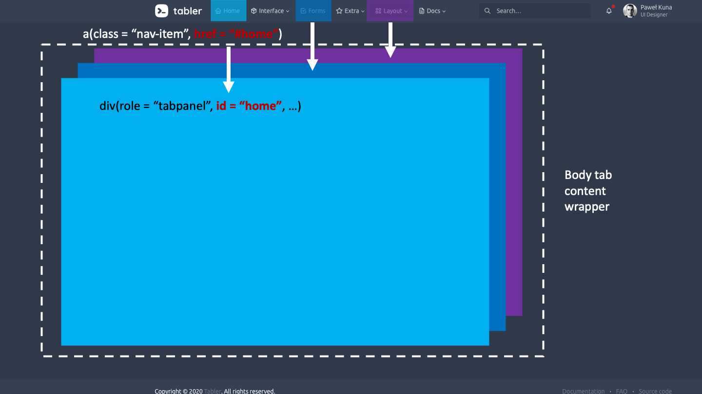
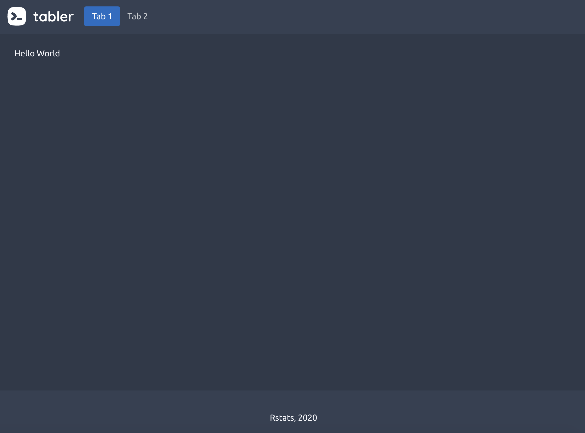
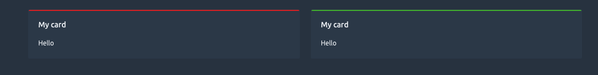

# Create template elements {#custom-templates-skeleton}
The list of all available tabler __layouts__ is quite impressive (horizontal, vertical, compressed, right to left, dark, ...). In the next steps, we will focus on the __dark-compressed__ template, leaving the reader to try other templates as an exercise.

## Identify template elements
We are quite lucky since there is nothing fancy about the tabler layout. As usual, let's inspect the `layout-condensed-dark.html` (located `/demo` folder) on Figure \@ref(fig:tabler-layout-intro)

```{r tabler-layout-intro, echo=FALSE, fig.cap='Tabler condensed layout', out.width='100%'}
knitr::include_graphics("images/practice/tabler-layout-intro.png")
```

There are two main components:

  - the __header__ containing the brand logo, the navigation and dropdown
  - the __content__ containing the dashboard body as well as the footer


::: {.warningblock data-latex=""}
The dashboard body does not mean `<body>` tag!
:::

That is it!

## Design the page layout

### The page wrapper

Do you remember the structure of a basic HTML page seen in Chapter \@ref(web-intro-html)? Well, if not, here is a reminder.

```html
<!DOCTYPE HTML>
<html lang="en">
  <head>
    <!-- head content here -->
    <title>A title</title>
  </head>
  <body>
    <!-- body content here -->
  </body>
</html>
```

We actually don't need to include the `<html>` tag since shiny does it on the fly, as described in details in chapter \@ref(build-shiny-ui). Below we construct a list of tags with `tagList()`, including the __head__ and the __body__. In the head we have the `meta` tags which have multiple purposes:

  - Describe the encoding.
  - How to display the app on different devices. For instance `apple-mobile-web-app-status-bar-style` is for iOS devices mobile support. 
  - Set the __favicon__, which is an icon representing the website icon, that is the one you may see on the right side of the searchbar. Try [twitter](https://twitter.com/home) for instance. 
  
The page __title__ and favicon may be changed by the developer, so they may be included as function parameters. If you remember, there should also be CSS in the head but they are missing! Actually, the insertion of dependencies is be achieved by our very own `add_tabler_deps()` function defined in Chapter \@ref(custom-templates-dependencies). Tabler comes with two main __themes__, namely white and dark, which may be applied through the `<body>` class attribute (respectively `antialiased theme-dark` and `antialiased`). The __...__ parameter contains other template elements like the header and the dashboard body, that remains to be designed. As shown in Figure \@ref(fig:tabler-dark) of Chapter \@ref(custom-templates-selection), the tabler dashboard template may contain a __navigation__ bar as well as a __footer__. As they are not mandatory, we don't create dedicated parameters and pass all elements in the `...` slot:

```{r}
tabler_page <- function(..., dark = TRUE, title = NULL, favicon = NULL){
  
  # head
  head_tag <- tags$head(
    tags$meta(charset = "utf-8"),
    tags$meta(
      name = "viewport", 
      content = "
        width=device-width, 
        initial-scale=1, 
        viewport-fit=cover"
    ),
    tags$meta(`http-equiv` = "X-UA-Compatible", content = "ie=edge"),
    tags$title(title),
    tags$link(
      rel = "preconnect", 
      href = "https://fonts.gstatic.com/", 
      crossorigin = NA
    ),
    tags$meta(name = "msapplication-TileColor", content = "#206bc4"),
    tags$meta(name = "theme-color", content = "#206bc4"),
    tags$meta(name = "apple-mobile-web-app-status-bar-style", content = "black-translucent"),
    tags$meta(name = "apple-mobile-web-app-capable", content = "yes"),
    tags$meta(name = "mobile-web-app-capable", content = "yes"),
    tags$meta(name = "HandheldFriendly", content = "True"),
    tags$meta(name = "MobileOptimized", content = "320"),
    tags$meta(name = "robots", content = "noindex,nofollow,noarchive"),
    tags$link(rel = "icon", href = favicon, type = "image/x-icon"),
    tags$link(rel = "shortcut icon", href = favicon, type="image/x-icon")
  )
  
  # body
  body_tag <- tags$body(
    tags$div(
      class = paste0("antialiased ", if (dark) "theme-dark"),
      style = "display: block;",
      tags$div(class = "page", ...)
    )
  ) %>% add_tabler_deps()
  
  tagList(head_tag, body_tag)
}
```

Below we quickly test if a tabler element renders well, to confirms whether our setup is adequate. To do this, we include a random tabler element taken from the demo HTML page, using `HTML()`.

::: {.importantblock data-latex=""}
Let's be clear: this is only for __testing purposes__! In production, you should avoid this as much as 
possible because of __security__ issues and the __bad readability__ of the code. 
:::

This also checks that our basic Shiny input/output system works as expected with a `sliderInput()` 
linked to a `plotOutput`. We finally leverage the `{thematic}` package so that plot and template background match:

```{r, eval=FALSE}
library(shiny)
library(thematic)

thematic_shiny()

ui <- tabler_page(
  "test", 
  sliderInput("obs", "Number of observations:",
              min = 0, max = 1000, value = 500
  ),
  plotOutput("distPlot"),
  br(),
  HTML(
    '<div class="col-sm-6 col-lg-3">
   <div class="card">
      <div class="card-body">
         <div class="d-flex align-items-center">
            <div class="subheader">Sales</div>
            <div class="ml-auto lh-1">
               <div class="dropdown">
                  <a class="dropdown-toggle text-muted" href="#" 
                  data-toggle="dropdown" aria-haspopup="true" 
                  aria-expanded="false">
                  Last 7 days
                  </a>
                  <div class="dropdown-menu dropdown-menu-right">
                     <a class="dropdown-item active" href="#">Last 7 days</a>
                     <a class="dropdown-item" href="#">Last 30 days</a>
                     <a class="dropdown-item" href="#">Last 3 months</a>
                  </div>
               </div>
            </div>
         </div>
         <div class="h1 mb-3">75%</div>
         <div class="d-flex mb-2">
            <div>Conversion rate</div>
            <div class="ml-auto">
               <span class="text-green d-inline-flex align-items-center lh-1">
                  7% 
                  <svg xmlns="http://www.w3.org/2000/svg" 
                  class="icon ml-1" width="24" height="24" viewBox="0 0 24 24" 
                  stroke-width="2" stroke="currentColor" fill="none" 
                  stroke-linecap="round" stroke-linejoin="round">
                     <path stroke="none" d="M0 0h24v24H0z"></path>
                     <polyline points="3 17 9 11 13 15 21 7"></polyline>
                     <polyline points="14 7 21 7 21 14"></polyline>
                  </svg>
               </span>
            </div>
         </div>
         <div class="progress progress-sm">
            <div class="progress-bar bg-blue" style="width: 75%" 
            role="progressbar" aria-valuenow="75" aria-valuemin="0" 
            aria-valuemax="100">
               <span class="sr-only">75% Complete</span>
            </div>
         </div>
      </div>
   </div>
</div>
    '
  ),
title = "Tabler test"
)
server <- function(input, output) {
  output$distPlot <- renderPlot({
    hist(rnorm(input$obs))
  })
}
shinyApp(ui, server)
```

Ok, our info card and the shiny element work like a charm, which is a good start.  Now we may focus on the aesthetics.

### The body content
In this part, we translate the dashboard __body__ HTML code to R. As a reminder, the [html2r](https://alandipert.shinyapps.io/html2r/) by [Alan Dipert](https://github.com/alandipert) substantially speeds up the conversion process. You copy the code in the HTML text area, click on convert and get the R shiny output. We create a function called `tabler_body()`. The __...__ parameter holds all the dashboard body elements and the __footer__ is dedicated for the future `tabler_footer()` function.

```{r}
tabler_body <- function(..., footer = NULL) {
  div(
    class = "content",
    div(class = "container-xl", ...),
    tags$footer(class = "footer footer-transparent", footer)
  )
}
```

Let's test it with the previous example.

```{r, eval=FALSE}
ui <- tabler_page(tabler_body(h1("Hello World")))
server <- function(input, output) {}
shinyApp(ui, server)
```

Way better!


### The footer

The footer is composed of a left and right containers. 
We decide to create parameters left and right in which the user may pass any elements:

```{r}
tabler_footer <- function(left = NULL, right = NULL) {
  div(
    class = "container",
    div(
      class = "row text-center align-items-center flex-row-reverse",
      div(class = "col-lg-auto ml-lg-auto", right),
      div(class = "col-12 col-lg-auto mt-3 mt-lg-0", left)
    )
  )
}
```

All the class __attributes__ are taken from the original HTML template. 
If you are already familiar with Bootstrap 4, you may easily customize the style. 
In short, `row` means that all elements are aligned on a row, 
`text-center` and `align-items-center` handle the text and content centering. 
`flex-row-reverse` display elements in a reversed order. 
Notice also that a `row` element contains columns created with the `col` class. 
The Bootstrap grid system relies on the Flexible Box Module, also known as [flexbox](https://developer.mozilla.org/en-US/docs/Web/CSS/CSS_Flexible_Box_Layout/Basic_Concepts_of_Flexbox). 

As above, let's check our brand new element.

```{r, eval=FALSE}
ui <- tabler_page(
  tabler_body(
    p("Hello World"),
    footer = tabler_footer(
      left = "Rstats, 2020", 
      right = a(href = "https://www.google.com", "More")
    )
  )
)
server <- function(input, output) {}
shinyApp(ui, server)
```

### The navbar (or header)
This function is called `tabler_header()`. In the Tabler template, the __header__ has the 
`navbar navbar-expand-md navbar-light` classes. We don't need the `navbar-light` class 
since we are only interested in the dark theme. As shown on Figure \@ref(fig:tabler-header),
the header is composed of four elements:

  - The navbar __toggler__ is only visible when we reduce the screen width, like on mobile devices.
  - The __brand__ image
  - The __navigation__ menu.
  - The __dropdown__ menus (this is not mandatory).
  
```{r tabler-header, echo=FALSE, fig.cap='Tabler header structure', out.width='100%'}
knitr::include_graphics("images/practice/tabler-header.png")
```

You may have a look at the [Bootstrap 4](https://getbootstrap.com/docs/4.0/components/navbar/) documentation for extra configuration and layout.

Each of these element will be considered as a parameter to the `tabler_navbar()` function, 
except the navbar toggler which is a default element and must not be removed. 
Morever, we only show the brand element when it is provided. The __...__ 
parameter is a slot for extra elements (between the menu and dropdowns). 
In the following, we start by creating the main container, that is `header_tag` and its unique child `container_tag`. The latter has four children `toggler_tag`, `brand_tag`, `dropdown_tag` and `navmenu_tag`. In this situations, `{htmltools}` functions like `tagAppendChild()` and `tagAppendChildren()` are game changers to better organize the code and make it more __maintainable__. One never knows in advance how much extra feature will be added to that component. Hence being cautious at the very beginning is crucial! 


```{r}
tabler_navbar <- function(..., brand_url = NULL, brand_image = NULL, 
                          nav_menu, nav_right = NULL) {
  
  header_tag <- tags$header(class = "navbar navbar-expand-md")
  container_tag <- tags$div(class = "container-xl")
  
  # toggler for small devices (must not be removed)
  toggler_tag <- tags$button(
    class = "navbar-toggler", 
    type = "button", 
    `data-toggle` = "collapse", 
    `data-target` = "#navbar-menu",
    span(class = "navbar-toggler-icon")
  )
  
  # brand elements
  brand_tag <- if (!is.null(brand_url) || !is.null(brand_image)) {
    a(
      href = if (!is.null(brand_url)) {
        brand_url
      } else {
        "#"
      },
      class = "navbar-brand navbar-brand-autodark 
      d-none-navbar-horizontal pr-0 pr-md-3",
      if(!is.null(brand_image)) {
        img(
          src = brand_image, 
          alt = "brand Image",
          class = "navbar-brand-image"
        )
      }
    )
  }
  
  dropdown_tag <- if (!is.null(nav_right)) {
    div(class = "navbar-nav flex-row order-md-last", nav_right)
  }
  
  navmenu_tag <- div(
    class = "collapse navbar-collapse", 
    id = "navbar-menu",
    div(
      class = "d-flex flex-column flex-md-row flex-fill 
      align-items-stretch align-items-md-center",
      nav_menu
    ),
    if (length(list(...)) > 0) {
      div(
        class = "ml-md-auto pl-md-4 py-2 py-md-0 mr-md-4 
        order-first order-md-last flex-grow-1 flex-md-grow-0", 
        ...
      )
    }
  )
  
  container_tag <- container_tag %>% tagAppendChildren(
    toggler_tag,
    brand_tag,
    dropdown_tag,
    navmenu_tag
  )
  
  header_tag %>% tagAppendChild(container_tag)
  
}
```

The __navbar menu__ is the main navbar component. The __...__ parameter is a slot for the __menu items__. 
Compared to the original tabler dashboard template where there is only the `navbar-nav` class, we have to add at least, the `nav` class to make sure items are correctly activated/inactivated. The `nav-pills` class is to select pills instead of basic tabs (see [here](https://getbootstrap.com/docs/4.0/components/navs/)), which is nothing more than a cosmetic consideration. Notice the `ul` tag that will contain `li` elements, that is the navbar items:

```{r}
tabler_navbar_menu <- function(...) {
  tags$ul(class = "nav nav-pills navbar-nav", ...)
}
```

Besides, each navbar menu item could be either a simple button or contain multiple menu sub-items. 
For now, we only focus on simple items.

#### Navbar navigation {#tabler-navbar-navigation}
The navbar is crucial since it drives the template navigation. We would like to associate each item to a separate page in the body content. This would allow us to navigate to a new page each time we change an item. In brief, it is very similar to the Shiny `tabsetPanel()` function.

In HTML, menu items are `<a>` tags (links) with a given `href` attribute pointing to a specific page located in the server files. With Shiny, as applications are single page by design, we can't split our content into multiple pages. The strategy here is to create a __tabbed navigation__, to mimic __multi-pages layout__.

Let's see how the tab navigation works. In the menu list, all items must have: 

  - A __data-toggle__ attribute set to `tab` or `pill`.
  - A __href__ or __data-target__ attribute holding a unique __id__, being mandatory since it points the menu item to the corresponding body content. 
  
::: {.importantblock data-latex=""}
Importantly, `href` navigation appears to be broken on shinyapps.io, RStudio Connect (actually all rstudio product relying on __workers__ to spread the user load across multiple R processes). 
Therefore, we'll choose the `data-target` attribute. 
:::

  
On the body side, tab panels are contained in a __tabset__ panel (simple div container), have a `role` attribute set to `tabpanel` and an __id__ corresponding the __data-target__ passed in the menu item. The exact match between __id__ and __data-target__ is mandatory, as shown in Figure \@ref(fig:tabler-tabset). 

```{r tabler-tabset, echo=FALSE, fig.cap='Tabler tabset main principle', out.width='100%'}

```

Below, we propose a possible implementation of a menu item, as well as the corresponding body tab panel. The text parameter corresponds to the nav item text displayed in the menu. We also added an optional icon and the ability to select the item at start:

```{r}
tabler_navbar_menu_item <- function(text, tabName, icon = NULL, 
                                    selected = FALSE) {
  
  item_cl <- paste0("nav-link", if(selected) " active")
  
  tags$li(
    class = "nav-item",
    a(
      class = item_cl,
      `data-target` = paste0("#", tabName),
      `data-toggle` = "pill",
      `data-value` = tabName,
      role = "tab",
      span(class = "nav-link-icon d-md-none d-lg-inline-block", icon),
      span(class = "nav-link-title", text)
    )
  )
}
```

We also decided to add a fade transition effect between tabs, as per Bootstrap 4 documentation, 
which consists in the `fade` extra class:

```{r}
tabler_tab_items <- function(...) {
  div(class = "tab-content", ...)
}

tabler_tab_item <- function(tabName = NULL, ...) {
  div(
    role = "tabpanel",
    class = "tab-pane fade container-fluid",
    id = tabName,
    ...
  )
}
```

What about testing this in a shiny app?

```{r, eval=FALSE}
ui <- tabler_page(
  tabler_navbar(
    brand_url = "https://preview-dev.tabler.io", 
    brand_image = "https://preview-dev.tabler.io/static/logo.svg", 
    nav_menu = tabler_navbar_menu(
      tabler_navbar_menu_item(
        text = "Tab 1",
        icon = NULL,
        tabName = "tab1",
        selected = TRUE
      ),
      tabler_navbar_menu_item(
        text = "Tab 2",
        icon = NULL,
        tabName = "tab2"
      )
    )
  ),
  tabler_body(
    tabler_tab_items(
      tabler_tab_item(
        tabName = "tab1",
        p("Hello World")
      ),
      tabler_tab_item(
        tabName = "tab2",
        p("Second Tab")
      )
    ),
    footer = tabler_footer(
      left = "Rstats, 2020", 
      right = a(href = "https://www.google.com")
    )
  )
)
server <- function(input, output) {}
shinyApp(ui, server)
```

At this point you might argue that we did not even validated the template elements. 
For instance, going back to the `tabler_navbar_menu_item` function, we find the following possible issues:

  - What happens if the user provides an invalid tabName, 
  ie a text that is not valid for jQuery like `tab&?++`?
  - What happens if the user accidentally activates two tabs at start?
  
We see later in Chapter \@ref(custom-templates-testing) how to validate those parameters.

#### Fine tune tabs behavior
Quite good isn't it? You notice however that even if the first tab is selected by default, its content is not shown. To fix this, we apply our jQuery skills. According to the Bootstrap documentation, we must trigger the __show__ event on the active tab at start, as well as add the classes `show` and `active` to the associated tab panel in the dashboard body. We therefore target the nav item that has the active class and if no item is found, we select the first item by default and activate its body content.

```js
$(function() {
  // this makes sure to trigger the show event on the active   tab at start
  let activeTab = $('#navbar-menu .nav-link.active');
  // if multiple items are found
  if (activeTab.length > 0) {
    let tabId = $(activeTab).attr('data-value');
    $(activeTab).tab('show');
    $(`#${tabId}`).addClass('show active');
  } else {
    $('#navbar-menu .nav-link')
      .first()
      .tab('show');
  }
});
```

This script is included in the the below app `www` folder. We see in Chapter \@ref(custom-templates-inputs) that custom input binding may perfectly handle this situation and are actually preferred.

```{r, eval=FALSE}
thematic_shiny()
# example with custom JS code to activate tabs
shinyAppDir(system.file("tabler/tabler_tabs", package = "OSUICode"))
```

The result is shown on Figure \@ref(fig:tabler-nav).  We'd also suggest to include at least one input/output per tab, to test whether everything works properly. 

```{r tabler-nav, echo=FALSE, fig.cap='Tabler template with navbar', out.width='100%'}

```


Looks like we are done for the main template elements. Actually, wouldn't it be better to include, at least, card containers?

### Card containers
Card are a central piece of template as they may contain visualizations, metrics and much more. Fortunately, Tabler has a large range of __card containers__. 


#### Classic card
What we call a classic card is like the [shinydashboard](https://rstudio.github.io/shinydashboard/structure.html) `box()` container. The card structure has key elements:

- A __width__ to control the space taken by the card in the Bootstrap [grid](https://getbootstrap.com/docs/4.0/layout/grid/).
- A __title__, in general in the header (tabler does always not follow this rule and header is optional).
- A __body__ where is the main content.
- Style elements like color __statuses__.
- A __footer__ (optional, tabler does not include this).

A comprehensive list of all tabler card features may be found [here](https://preview-dev.tabler.io/docs/cards.html). To be faster, we copy the following HTML code in the [html2R](https://github.com/alandipert/html2r) shiny app to convert it to Shiny tags:

```html
<div class="col-md-6">
  <div class="card">
    <div class="card-status-top bg-danger"></div>
    <div class="card-body">
      <h3 class="card-title">Title</h3>
      <p>Some Text.</p>
    </div>
  </div>
</div>
```

Below is the result. The next step consists in replacing all content by parameters to the `tabler_card()` function, whenever necessary. For instance, the first `<div>` sets the card width. The Bootstrap grid ranges from 0 to 12, so why not create a width parameter to control the card size. We proceed similarly for the title, status, body content. It seems reasonable to allow title to be `NULL` (if so, the title is not be shown), same thing for the status. Regarding the card default width, a value of six also makes sense, which would take half of the row:

```{r}
tabler_card <- function(..., title = NULL, status = NULL, width = 6,
                        stacked = FALSE, padding = NULL) {

  card_cl <- paste0(
    "card",
    if (stacked) " card-stacked",
    if (!is.null(padding)) paste0(" card-", padding)
  )

  status_tag <- if (!is.null(status)) {
    div(class = paste0("card-status-top bg-", status))
  }

  body_tag <- div(
    class = "card-body",
    # we could have a smaller title like h4 or h5...
    if (!is.null(title)) {
      h3(class = "card-title", title)
    },
    ...
  )

  main_wrapper <- div(class = paste0("col-md-", width))
  card_wrapper <- div(class = card_cl)

  card_wrapper <- card_wrapper %>% tagAppendChildren(status_tag, body_tag)
  main_wrapper %>% tagAppendChild(card_wrapper)
}
```

In the meantime, it would be also convenient to be able to display cards in the same row. 
Let's create the `tabler_row()`:

```{r}
tabler_row <- function(...) {
  div(class = "row row-deck", ...)
}
```

Below, we show an example of the `tabler_card()` function, in combination with the `{apexcharter}` package.

```{r, eval=FALSE}
library(apexcharter)
library(dplyr)
library(ggplot2)
# test the card
data("economics_long")
economics_long <- economics_long %>%
  group_by(variable) %>%
  slice((n()-100):n())

spark_data <- data.frame(
  date = Sys.Date() + 1:20,
  var1 = round(rnorm(20, 50, 10)),
  var2 = round(rnorm(20, 50, 10)),
  var3 = round(rnorm(20, 50, 10))
)

my_card <- tabler_card(
  apexchartOutput("my_chart"), 
  title = "My card", 
  status = "danger"
)

thematic_shiny()

ui <- tabler_page(
  tabler_body(
    tabler_row(
      my_card,
      tabler_card(
        apexchartOutput("spark_box"), 
        title = "My card", 
        status = "success"
      ) 
    )
  )
)
server <- function(input, output) {
  output$my_chart <- renderApexchart({
    apex(
      data = economics_long, 
      type = "area", 
      mapping = aes(x = date, y = value01, fill = variable)
    ) %>%
      ax_yaxis(decimalsInFloat = 2) %>% # number of decimals to keep
      ax_chart(stacked = TRUE) %>%
      ax_yaxis(max = 4, tickAmount = 4)
  })
  
  output$spark_box <- renderApexchart({
    spark_box(
      data = spark_data[, c("date", "var3")],
      title = mean(spark_data$var3), 
      subtitle = "Variable 3",
      color = "#FFF", background = "#2E93fA",
      title_style = list(color = "#FFF"),
      subtitle_style = list(color = "#FFF")
    )
  })
}
shinyApp(ui, server)
```

The code output is shown on Figure \@ref(fig:tabler-card).

```{r tabler-card, echo=FALSE, fig.cap='Tabler card component', out.width='100%'}

```

### Ribbons: card components
Let's finish this part by including a card component, 
namely the [ribbon](https://preview-dev.tabler.io/docs/ribbons.html).

```{r}
tabler_ribbon <- function(..., position = NULL, color = NULL, bookmark = FALSE) {
  
  ribbon_cl <- paste0(
    "ribbon",
    if (!is.null(position)) sprintf(" bg-%s", position),
    if (!is.null(color)) sprintf(" bg-%s", color),
    if (bookmark) " ribbon-bookmark"
  )
  div(class = ribbon_cl, ...)
}
```

Integrating the freshly created ribbon component requires to modify the card structure since the ribbon is added after the body tag, and no parameter is associated with this slot. We could also modify the `tabler_card()` function but `{htmltools}` offers tools to help us. Since the ribbon should be put after the card body, we may think about the `tagAppendChild()` function, introduced in Chapter \@ref(htmltools-overview):

```{r}
# add the ribbon to a card
my_card <- tabler_card(title = "Ribbon", status = "info")

str(my_card)

my_card$children[[1]] <- my_card$children[[1]] %>% 
  tagAppendChild(
    tabler_ribbon(
      icon("info-circle", class = "fa-lg"), 
      bookmark = TRUE,
      color = "red"
    )
  )
```

As shown above, the ribbon has been successfuly included in the card tag. Now, we check how it looks in a shiny app.

```{r, eval=FALSE}
thematic_shiny()
ui <- tabler_page(
  tabler_body(
    my_card
  )
)
server <- function(input, output) {}
shinyApp(ui, server)
```

```{r tabler-ribbon, echo=FALSE, fig.cap='Tabler ribbon component', out.width='100%'}
knitr::include_graphics("images/practice/tabler-ribbon.png")
```

### Icons
Not mentioned before but we may include fontawesome icons provided with Shiny, as well as other libraries. 
Moreover, Tabler has a internal svg library located [here](https://preview-dev.tabler.io/icons.html).


## Exercises
1. Consider the tab card at the very bottom of the tabler [documentation](https://preview-dev.tabler.io/docs/cards.html). Propose an implementation of that feature.
2. Have a look at this [page](https://preview-dev.tabler.io/snippets.html). Select two elements and create the corresponding R functions.
