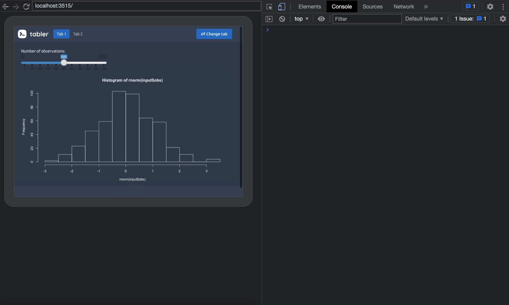

# Testing and validating template elements {#custom-templates-testing}
Until now, we have been building the template boilerplate, that is, the main skeleton functions (page, navbar, navbar menu, ...) as well as some components, such as cards, ribbons and progress bars. We also exposed some techniques to substantially give more __interactivity__ to the template, leveraging our freshly acquired JavaScript skills. Does this mean we are ready to make the template public? Not yet since some essentials steps are missing:


  - Input __validation__ is a crucial step toward success. Briefly, it consists of checking user inputs so that your functions fail __safely__ and elegantly by providing meaningful error messages or warnings. This concept has already been covered in _R for Data Science_ [@R4DS], _Advanced R_ [@AdvancedR] and many other resources. Hence, we are not trying to reinvent the wheel, and we rely on the already existing patterns, whose effectiveness is no longer to be demonstrated. Welcome to the __defensive programming__ world! 
  - On the other hand, testing components allows us to check if a function does what it is supposed to do. Consequently, it is a proof of __robustness__ and increases __reproducibility__. It significantly reduces the mental load when it comes to start code __refactoring__, thereby making you feel slightly less guilty about creating breaking changes since, most of the time, your tests will be able to capture those errors. 

## Validate template functions

### Create your own validations
Below, we showcase some examples to __validate__ user inputs. We first consider the `tabler_card()` element from Chapter \@ref(custom-templates-skeleton):

```{r}
library(shiny)
tabler_card <- function(..., title = NULL, status = NULL, 
                        width = 6, stacked = FALSE, 
                        padding = NULL) {

  card_cl <- paste0(
    "card",
    if (stacked) " card-stacked",
    if (!is.null(padding)) paste0(" card-", padding)
  )

  status_tag <- if (!is.null(status)) {
    div(class = paste0("card-status-top bg-", status))
  }

  main_wrapper <- div(class = paste0("col-md-", width))
  
  # ...Code commented for space reasons
}
```

The first thing is to think about what to validate. Here, we see at least three tests:

  - Checking the __status__ value.
  - Checking the __width__ value.
  - Checking the __padding__ value.
  
Writing validation tests requires knowing about the underlying mechanisms. In our case, we must know the Bootstrap 4 __grid__ rules and valid color __statuses__. The Bootstrap 4 [grid](https://getbootstrap.com/docs/4.0/layout/grid/) ranges from 1 to 12. In other words, a card having a width of 12 will take the full page, whereas we may align three cards of width 4. Valid [statuses](https://getbootstrap.com/docs/4.0/utilities/colors/) are primary, secondary, success, info, danger, warning, light and dark.

It is therefore pretty straightforward to validate the card width as it must be numeric and between 1 and 12. Moreover, since the template has other containers including the width parameter, we create a function to rule them all:

```{r}
validate_width <- function(width) {
  if (is.numeric(width)) {
    if (width < 1 || width > 12) {
      stop(
        "\n width must belong to [1, 12], as per
        BS4 grid documentation.
        See https://getbootstrap.com/docs/4.0/layout/grid/."
      )
    }
  } else {
    stop("width must be numeric.")
  }
}

validate_width(4)
try(validate_width(-1)) 
try(validate_width(13)) 
try(validate_width("string")) 
```

To check the status parameter, we save the valid statuses in a vector and take the `validStatuses` function from `{shinydashboard}` [utils](https://github.com/rstudio/shinydashboard/blob/4ac99720653f2295f486734c862e56c82edb5d80/R/utils.R#L121). It also make sense to create a function since this parameter is widely used among other template components. 
Contrary to the `{shinydashboard}` function, our custom `valid_status()` does not fail 
if the status is `NULL` since it is not a mandatory parameter.

```{r}
valid_statuses <- c(
  "primary", 
  "secondary",
  "success", 
  "info", 
  "warning", 
  "danger",
  "light",
  "dark"
)

validate_status <- function(status) {

  if (is.null(status)) {
    return(TRUE) 
  } else {
    if (status %in% valid_statuses) {
      return(TRUE)
    }
  }

  stop("Invalid status: ", status, ". Valid statuses are: ",
       paste(valid_statuses, collapse = ", "), ".")
}
```

We finish by the padding validation. According to the Tabler documentation, 
there are three possible choices, namely `sm`, `md` or `lg`:

```{r}
valid_paddings <- c("sm", "md", "lg")

validate_padding <- function(padding) {
  if (!is.null(padding)) {
    if (!(padding %in% valid_paddings)) {
      stop("Invalid status: ", padding, ". Valid choices are: ",
       paste(valid_paddings, collapse = ", "), ".")
    }
  }
}
```

We apply all these validation to our card element.

```{r}
tabler_card <- function(..., title = NULL, status = NULL, 
                        width = 6, stacked = FALSE, 
                        padding = NULL) {
  
  validate_status(status)
  validate_width(width)
  validate_padding(padding)
  
  # ... remaining code
}
```

As of R 4.0.0, the `stopifnot()` function may be a good alternative to `stop()`. 

::: {.noteblock data-latex=""}
We recommend to be __reasonable__ and not to validate every single parameter, as it might be not that productive and could cause frustration for the 
end users. 
:::

### Existing utils functions

#### Validating tags
With the above approach, it takes some time to create all validation functions. Fortunately, packages like `{shinydashboard}` include really powerful validation functions, especially `tagAssert()`. This function has been included in the book side package (`{OSUICode}`) so that you may use it at any time:

```{r}
library(OSUICode)
myTag <- div(class = "bg-blue")

tagAssert(myTag, type = "div")
tagAssert(myTag, class = "bg-blue")
```

```{r, eval=FALSE}
try(tagAssert(myTag, type = "li"))
```

```{r, echo=FALSE}
if (knitr::is_html_output()) {
  try(tagAssert(myTag, type = "li"))
}
```

```{r, echo=FALSE, results='asis'}
code <- 'Error in tagAssert(myTag, type = "li") : 
Expected tag to be of type li'
exclude_from_html(code)
```

Importantly, `tagAssert()` raises an error if the condition is not fulfilled. Another function, `tagMatches()` simply returns `TRUE` or `FALSE`. It looks for `ìd`, `class`, `name` and any other tag attribute like `data-value`. Like `tagAssert()`, `tagMatches()` is also available in `{OSUICode}`.

```{r}
tagMatches(myTag, id = "d")
tagMatches(myTag, class = "bg-blue")
```

#### Validating CSS units
The `validateCssUnit()` function belongs to the Shiny exported function. It is useful to quickly check any parameter involving a CSS unit like `width` and `height`.

```{r}
library(shiny)
validateCssUnit("5px")
validateCssUnit("5rem")
validateCssUnit("100%")
```

```{r, eval=FALSE}
try(validateCssUnit("plop"))
```

```{r, echo=FALSE}
if (knitr::is_html_output()) {
  try(validateCssUnit("plop"))
}
```

```{r, echo=FALSE, results='asis'}
code <- 'Error in validateCssUnit("plop") :
"plop" is not a valid CSS unit
(e.g., "100%", "400px", "auto")'
exclude_from_html(code)
```

### Example: refine navbar menu items

#### Avoid wrong jQuery selectors
In Chapter \@ref(custom-templates-skeleton), we developed the `tabler_navbar_menu_item()` function. The `tabName` parameter is critical since it is responsible for driving the navigation. We must ensure that the value provided by the user is compatible with jQuery __selectors__ [conventions](https://api.jquery.com/category/selectors/). To illustrate the problem, we consider the example below, where the second tab name is `hello%%&1`:

```{r, eval=FALSE}
tabler_navbar_menu_item(
  text = "Tab 2",
  icon = NULL,
  tabName = "hello%%&1"
)
```

```{r, echo=FALSE, results='asis'}
code_chunk(OSUICode::get_example("tabler/wrong-tab", view_code = FALSE), "r")
```

Notice that we cannot see the second tab content. This issue is quite vicious since we don't even see any error message on the JS side. Below is a proposal for the `validate_tab()` function. We first detect any punctuation in the provided input with `[[:punct:]]`. The trick is not to capture the `_` that is valid in jQuery. We use a negative look-ahead assertion `(?!_)`. 
We finally raise an error if any punctuation is found:

```{r}
validate_tabName <- function(tabName) {
  forbidden <- "(?!_)[[:punct:]]"
  wrong_selector <- grepl(forbidden, tabName, perl = TRUE)
  if (wrong_selector) {
    stop(
      paste(
        "Please do not use punctuation characters in tabNames.
        This might cause JavaScript issues."
      )
    )
  }
}
validate_tabName("plop")
try(validate_tabName("test%")) # will fail
```

`validate_tabName()` must be then inserted at the beginning of `tabler_navbar_menu_item()`, as well as in `tabler_tab_item()`, the latter also relying on tabName.

#### Checking for multiple selected items
Another issue is the possibility of having multiple selected tab items at the start. Looking back at `tabler_navbar_menu()`, this is not surprising since there are absolutely no checks!

```{r}
tabler_navbar_menu <- function(...) {
  tags$ul(class = "nav nav-pills navbar-nav", ...)
}
```

A classic method to inspect items provided to `tabler_navbar_menu()` is to capture them in a list. We extract the children of those items via ``lapply(list(...), `[[`, "children")``. As a reminder, a Shiny tag is a structure containing the tag name, a named list of attributes, and the children (See chapter \@ref(htmltools-overview)). For each child, we apply the `{shinydashboard}` internal function `findAttribute()`, which allows us to search for a specific attribute value in a given tag. We use the `vapply()` to return an atomic vector, such as `c(1, 2)` (lists are vectors but recursive) and compute the sum of the vector. Each `TRUE` occurrence is counted as 1 and `FALSE` 0. Therefore, if the latter is higher than 1, it means that the user provided more than 1 selected tab, which should subsequently raise an error:

```{r}
tabler_navbar_menu <- function(...) {
  
  items <- unlist(
    lapply(list(...) , `[[`, "children"), 
    recursive = FALSE
  )
  res <- sum(
    vapply(
      items, 
      findAttribute, 
      "class", 
      "nav-link active", 
      FUN.VALUE = logical(1)
    )
  )
  if (res > 1) {
    stop("Cannot have multiple selected items at start!")
  }
  
  tags$ul(class = "nav nav-pills navbar-nav", ...)
}
```

```{r, eval=FALSE}
try({
  tabler_navbar_menu(
    tabler_navbar_menu_item(
      text = "Tab 1",
      tabName = "tab1",
      selected = TRUE
    ),
    tabler_navbar_menu_item(
      text = "Tab 2",
      tabName = "tab2",
      selected = TRUE
    )
  )
})
#> Cannot have multiple selected items at start!
```

## Testing templates elements
Imagine if one day, someone or yourself accidentally removed the width validation function, after a significant code refactoring. Later, you receive a new message from GitHub, stating that someone opened a new issue. According to the report, the card is not properly displayed although no error is thrown. Among the 400 lines of code provided, you hardly notice that the width parameter is set to 13, which is not in line with the Bootstrap 4 documentation, as it should remain between 1 and 12. You lost 10 minutes and so did your end user, which is even worse. 

With a proper testing pipeline, this problem could have been avoided. Ironically, writing the corresponding test takes only two minutes.

A reference for testing functions is the [{testthat}](https://testthat.r-lib.org/index.html) package [@R-testthat]. In short, a __unit test__ consists of setting __expectations__ about our function and checking whether they __fail__ or __pass__. For instance, in the previous `tabler_card()` example, `validate_width()` must fail if the given width is not in the expected bounds or not numeric. We apply the `test_that()` function with a description containing the test __context__, followed by the expectations inside the curly brackets.

```{r, eval=FALSE}
library(testthat)
test_that("validate width works", {
  expect_error(tabler_card(width = -1))
  expect_error(tabler_card(width = 13))
  expect_error(tabler_card(width = "hello world"))
})
```

```{r, echo=FALSE}
if (knitr::is_html_output()) {
  library(testthat)
  test_that("validate width works", {
    expect_error(tabler_card(width = -1))
    expect_error(tabler_card(width = 13))
    expect_error(tabler_card(width = "hello world"))
  })
}
```

```{r, echo=FALSE, results='asis'}
code <- 'Test passed !'
exclude_from_html(code)
```

We then test `validate_status()` and `validate_padding()`.

```{r}
test_that("validate status works", {
  expect_error(tabler_card(status = "toto"))
})

test_that("validate padding works", {
  expect_error(tabler_card(width = "xs"))
})
```

So far so good. In few lines of code, we substantially increased the __robustness__ of our function without increasing its __complexity__. Now, let's try to remove the `validate_width()` step from the `tabler_card()`.

```{r, eval=FALSE}
tabler_card <- function(..., title = NULL, status = NULL, 
                        width = 6, stacked = FALSE, 
                        padding = NULL) {
  
  # validation
  # validate_width(width)
  validate_status(status)
  validate_padding(padding)
  
  # ... Code commented
}
```

```{r, echo=FALSE}
tabler_card <- function(..., title = NULL, status = NULL, 
                        width = 6, stacked = FALSE, 
                        padding = NULL) {
  
  # validation
  # validate_width(width)
  validate_status(status)
  validate_padding(padding)
  
  card_cl <- paste0(
    "card", 
    if (stacked) " card-stacked",
    if (!is.null(padding)) paste0(" card-", padding)
  )
  
  div(
    class = paste0("col-md-", width),
    div(
      class = card_cl,
      if (!is.null(status)) {
        div(class = paste0("card-status-top bg-", status))
      },
      div(
        class = "card-body",
        # we could have a smaller title like h4 or h5...
        if (!is.null(title)) {
          h3(class = "card-title", title)
        },
        ...
      )
    )
  )
  
}
```

```{r}
test_that("validate width works", {
  expect_error(tabler_card(width = -1))
  expect_error(tabler_card(width = 13))
  expect_error(tabler_card(width = "hello world"))
})
```

Notice how the three above tests elegantly fail. The provided context ("validate width works") immediately indicates the culprit, which is a game changer for debugging.

### Caveats
As stated above, there might be situations where tests should be carefully written and not rely too much on upstream package structure. I propose considering a real-life example involving the `{shinyMobile}` CRAN package, depending on `{shiny}` and `{htmltools}`. It has a function, namely `preview_mobile()` allowing you to preview an app on a mobile device iframe. This function has an internal [test](https://github.com/schloerke/shinyMobile/blob/5e0344ad083217d0bd3be82aff446e63fbb1d000/tests/testthat/test-preview_mobile.R#L18) to check if HTML dependencies are properly applied. However, the test may fail if Shiny dependencies are updated, which is independent of `{shinyMobile}` but would eventually prevent `{shiny}` from being released on [CRAN](https://github.com/RinteRface/shinyMobile/pull/211). Below is what is obtained with `{shiny}` 1.6.0.

```{r, echo=FALSE, results='asis'}
tmp_code <- '#> [[1]]
#> List of 10
#>  $ name      : chr "marvel-devices-css"
#>  $ version   : chr "1.0.0"
#>  ...
#> 
#> [[2]]
#> List of 10
#>  $ name      : chr "bootstrap"
#>  $ version   : chr "3.4.1"
#>  ...'
code_chunk_custom(tmp_code)
```

Then doing `expect_length(deps, 2)` is [fine](https://github.com/schloerke/shinyMobile/commit/5e0344ad083217d0bd3be82aff446e63fbb1d000#diff-d206e3d4eeee0729f4975a2a8e8414182a6603d10aca57be2c3eb97b5fe7e160L25). However, with `{shiny}` 1.7.0 (it could also come from another `{htmltools}` version), the result is significantly different: 

```{r, echo=FALSE, results='asis'}
tmp_code <- '#> [[1]]
#> List of 10
#>  $ name      : chr "jquery"
#>  $ version   : chr "3.6.0"
#>  ...
#> 
#> [[2]]
#> List of 10
#>  $ name      : chr "marvel-devices-css"
#>  $ version   : chr "1.0.0"
#>  ...
#> 
#> [[3]]
#> List of 10
#>  $ name      : chr "bootstrap"
#>  $ version   : chr "3.4.1"
#>  ...'
code_chunk_custom(tmp_code)
```

The returned list contains one extra dependency, thereby breaking the underlying test. This subsequently requires changing the test. 

### Testing template behavior
Testing the JavaScript behavior is one of the biggest challenges to validating a template. If the R component has been carefully validated, it does not mean that its JavaScript effects are. For instance, let's consider the `tabler_progress()`  that may be updated with `update_tabler_progress()`. How do we check whether the progress value is correctly set?
  
#### R side
Testing the R side is quite easy. Let's recall the `update_tabler_progress()` function:

```{r, eval=FALSE}
update_tabler_progress <- function(
  id, 
  value, 
  session = shiny::getDefaultReactiveDomain()
) {
  message <- list(id = session$ns(id), value = value)
  session$sendCustomMessage(type = "update-progress", message)
}
```

This function does two things:

  - __Captures__ the __id__ of the targeted progress and its new __value__.
  - Sends the message the JS.

The test consists of checking whether we send all elements to the __session__. We first create
a dummy session environment which contains `ns` to mimic the `session$ns` function
and `sendCustomMessage` to test the message handler part:

```{r}
session <- as.environment(
  list(
    ns = identity,
    sendCustomMessage = function(type, message) {
      session$lastCustomMessage <- list(
        type = type, 
        message = message
      )
    }
  )
)
```

Here, `sendCustomMessage` simply stores the last sent message in `session$lastCustomMessage`, and `session$ns` returns the provided element:

```{r}
session$ns("test")
session$sendCustomMessage("test", message = "hello")
session$lastCustomMessage
```

We then call `update_tabler_progress()` with some random parameters and capture the
last sent message in the `res` variable:

```{r}
library(OSUICode)
update_tabler_progress(
  id = "myprogress", 
  value = 10, 
  session = session
)
res <- session$lastCustomMessage
```

::: {.importantblock data-latex=""}
Importantly, don't forget to set the session parameter to `session`, otherwise,
it will default to `shiny::getDefaultReactiveDomain` which is `NULL` outside of the Shiny app.
:::

Now we can set expectations:

  - `res` must be a list of length 2.
  - The expected custom handler type is `update-progress`.
  - The sent value is 10.
  - The sent id is `myprogress`.
  
And next we can translate into `{testthat}`:

```{r}
test_that("update progress works", {
  update_tabler_progress(
    id = "myprogress", 
    value = 10, 
    session = session
  )
  res <- session$lastCustomMessage
  
  expect_length(res, 2)
  expect_equal(res$type, "update-progress")
  expect_length(res$message, 2)
  expect_equal(res$message$id, "myprogress")
  expect_equal(res$message$value, 10)
})
```

This test being set, it ensures seamlessly capturing any breaking change in the API.

#### JS side {#custom-templates-testing-js}
In the following, we have to test whether the corresponding JS handler works as expected:

```{r, echo=FALSE, results='asis'}
js_code <- "Shiny.addCustomMessageHandler(
  'update-progress', function(message) {
    $('#' + message.id)
      .css('width', message.value +'%')
      .attr('aria-valuenow', message.value);
});"
code_chunk_custom(js_code, "js")
```

We leverage the `{crrry}` packages developed by Colin Fay from ThinkR.
Overall, `{crrry}` is an adaptation of `{crrri}`, specifically optimized for `{shiny}`, which is a native Chrome Remote Interface in R using the Chrome Debugging Protocol. In other words, it provides tools to programmatically control
the web browser and do many things like inspecting a web page, 
taking screenshots, testing... You may know `{shinytest}`, which relies on another technology,
phantomjs. The latter does not play well with `Bootstrap 4` templates, which is why we don't use it
here. At the time of writing, RStudio is working on `{shinytest2}`, which will leverage the Chrome Debugging Protocol, thereby fixing the current issues with Bootstrap 4 and above. However, as it is not yet public, we could not describe it in this book.

::: {.noteblock data-latex=""}
`{crrry}` is already introduced in the `Engineering Production-Grade Shiny Apps` book (https://engineering-shiny.org/step-secure.html#testing-the-interactive-logic) [@thinkrShiny].
:::

The first step is to call the `update_tabler_progress()` example locally and add the returned
url to the following code. We run the app in another process with `{processx}`:

```{r, eval=FALSE}
p <- processx::process$new(
  "Rscript", 
  c(
    "-e",  
    "options('shiny.port'= 3515);
     OSUICode::run_example('tabler/update-progress')"
  )
)

Sys.sleep(2)

p$is_alive()
#> [1] TRUE
```

That way, we can run our test in the main R process, after checking that our task `p` is alive. Here the app
loads immediately, but you may wait some time if there are computations:

```{r, eval=FALSE}
library(crrry)
library(testthat)
test <- CrrryOnPage$new(
  chrome_bin = pagedown::find_chrome(),
  chrome_port = httpuv::randomPort(),
  url = "http://localhost:3515/",
  headless = TRUE
)
#> Running '/Applications/Google Chrome.app/...' 
#>   '--no-first-run --headless' \
#>   '--user-data-dir=/Users/david/Library/...' \
#>   '--remote-debugging-port=31683'
```

We wait for Shiny to be ready:

```{r, eval=FALSE}
test$wait_for_shiny_ready()
#> Shiny is computing
#> ✔ Shiny is still running
```

Note the output of `--remote-debugging-port=31683` gives the link to the Chrome devtools link
to inspect the current app, as shown in Figure \@ref(fig:tabler-crrry-debug). In practice, open a web browser window and type `localhost:<REMOTE-DEBUGGING-PORT>`. Follow the instructions and select the `Console` tab within the developer tools. 


```{r tabler-crrry-debug, echo=FALSE, fig.cap='Tabler progress bar debug tools.', out.width='100%'}
knitr::include_graphics("images/practice/tabler-crrry-debug.png")
```

It is now time to write the JS testing logic. We know that moving the slider triggers
the `update_tabler_progress()` function. This is how we change the slider value,
thanks to the noUiSlider [API](https://refreshless.com/nouislider/slider-read-write/#section-setting). We first
select the slider DOM element and call `noUiSlider.set` on the selected instance:

```{r, echo=FALSE, results='asis'}
js_code <- "var slider = document.getElementById('progress_value');
slider.noUiSlider.set(50);"
code_chunk_custom(js_code, "js")
```

We use `call_js()` to update the slider value within our testing pipeline (R side):

```{r, eval=FALSE}
test$call_js(
  "var slider = document.getElementById('progress_value');
   slider.noUiSlider.set(50);
  "
)
#> ── Launching JS: 
#> var slider = document.getElementById('progress_value');
#>     slider.noUiSlider.set(50);
#>     ───────────────────────────────────────────────────
#> Shiny is computing
#> ✔ Shiny is still running
```

According to Figure \@ref(fig:tabler-crrry-debug-2), if the slider is properly updated, the progress bar also seems to have the expected value.

```{r tabler-crrry-debug-2, echo=FALSE, fig.cap='Updated slider.', out.width='100%'}
knitr::include_graphics("images/practice/tabler-crrry-debug-2.png")
```

We recover the progress value knowing that it is contained in the `aria-valuenow`
attribute, as a string. We have to convert it to a number with `parseInt`:

```{r, eval=FALSE}
val <- test$call_js(
  "parseInt($('#progress1').attr('aria-valuenow'), 10);
  "
)
#> ── Launching JS: 
#> parseInt($('#progress1').attr('aria-valuenow'), 10);
#>     ──────────────────────────────────────────────────
#> Shiny is computing
#> ✔ Shiny is still running
expect_equal(val$result$value, 50)

# Will fail 
expect_equal(val$result$value, 30)
#> Error: val$result$value not equal to 30.
#> 1/1 mismatches
#> [1] 50 - 30 == 20

# stop the test whenever satisfied
test$stop()
```

The test is a success, meaning that `update_tabler_progress()`, especially the associated
custom message handler, works. This test was simple and did not involve any input elements.
Yet, `{crrry}` also supports setting input values with `shiny_set_input(id, value)`.


### Test input bindings
We decide to add more complexity and show how to test a home-made __input binding__. We are going to test the Tabler navbar JavaScript logic developed in Chapter \@ref(custom-templates-inputs-navbar). Before starting to test, we define the expectations:

  - If no `tabler_navbar_menu_item()` is selected by default, at the start, the first item is selected.
  It must have the `active` class on it. Hence, we have to check whether the first `<a class="nav-link">` 
  has the active class.
  - Moreover, if one item is selected at start, we have to make sure this item has the `active` class.
  - We have to ensure that clicking on another link switches the currently selected link so that
  the corresponding input on the R side is properly updated.
  - When we call `update_tabler_tab_item()`, we have to check whether the active link is
  successfully changed.
  - Each time a navbar item is active, the corresponding body `tabler_tab_item()` must hold the
  `active show` class, to make sure the tab content is visible. Only one tab may have those classes at a time.
  
As described above, we run our app in another R process, so as to keep the main process
for the test:


```{r, eval=FALSE}
p <- processx::process$new(
  "Rscript", 
  c(
    "-e",  
    "options('shiny.port'= 3515); 
    OSUICode::run_example('tabler/update-navbar')" 
  )
)

Sys.sleep(2)

p$is_alive()
#> [1] TRUE

test <- CrrryOnPage$new(
  chrome_bin = pagedown::find_chrome(),
  chrome_port = httpuv::randomPort(),
  url = "http://localhost:3515/",
  headless = TRUE
)
#> Running '/Applications/Google Chrome.app/...' 
#>   '--no-first-run --headless' \
#>   '--user-data-dir=/Users/david/Library/...' \
#>   '--remote-debugging-port=11028'

test$wait_for_shiny_ready()
#> Shiny is computing
#> ✔ Shiny is still running
```

After running the above code, browse to `localhost:<REMOTE-DEBUGGING-PORT>` and you should get what is shown in Figure \@ref(fig:tabler-crrry-debug-3).

```{r tabler-crrry-debug-3, echo=FALSE, fig.cap='Tabler navbar example with debug tools.', out.width='100%'}

```

At start, no link was selected, meaning we expect the first link to be active and shown. The navbar
may be targeted using the `navbar-nav` class, and we use `find` to locate the active child, which must
have the `nav-link active` classes. We also control that only one item is selected by inspecting the length
of the active nav link items. We extract its index with `index`, which is contained in the `data-value` attribute:

```{r, eval=FALSE}
active <- test$call_js(
  "$('.navbar-nav').find('.nav-link.active').length"
)
#> ── Launching JS: 
#>  $('.navbar-nav').find('.nav-link.active').length 
#>     ─────────────────────────────────────────────────
#> Shiny is computing
#> ✔ Shiny is still running
expect_equal(active$result$value, 1)

test$wait_for_shiny_ready()
#> Shiny is computing
#> ✔ Shiny is still running

res1 <- test$call_js(
  "$('.navbar-nav')
    .find('.nav-link.active')
    .attr('data-value')"
)
#> ── Launching JS: $('.navbar-nav')
#>     .find('.nav-link.active')
#>     .attr('data-value')
#>     ────────────────────────────────────────────────-
#> Shiny is computing
#> ✔ Shiny is still running
expect_equal(res1$result$value, "tab1")
```

Now let's see whether the body tab has the good index. We target the `tab-content` class and look
for the element having `active show` classes. We recover its id which contains the tab name:

```{r, eval=FALSE}
res2 <- test$call_js(
  "$('.tab-content').find('.active.show').attr('id')"
)
#> ── Launching JS: 
#>  $('.tab-content').find('.active.show').attr('id') 
#>     ─────────────────────────────────────────────────
#> Shiny is computing
#> ✔ Shiny is still running
expect_equal(res1$result$value, res2$result$value)
```

We programmatically change the active tab by clicking on the second link, with `click`. Below we use
`.nav-link:eq(1)` to select the second link, but we could use `.nav-link:not(.active)` since
we only have two links. We also recover the index of the selected link and the corresponding tab. If 
everything happens well, we expect their value to be 2:

```{r, eval=FALSE}
test$call_js("$('.navbar-nav .nav-link:eq(1)').click();")

res3 <- test$call_js(
  "$('.navbar-nav')
    .find('.nav-link.active')
    .attr('data-value')"
)
#> ── Launching JS: $('.navbar-nav')
#>     .find('.nav-link.active')
#>     .attr('data-value') 
#>     ─────────────────────────────────────────────────
#> Shiny is computing
#> ✔ Shiny is still running
expect_equal(res3$result$value, "tab2")

test$wait_for_shiny_ready()
#> Shiny is computing
#> ✔ Shiny is still running

res4 <- test$call_js(
  "$('.tab-content')
    .find('.active.show')
    .attr('id')"
)
#> ── Launching JS: $('.tab-content')
#>     .find('.active.show')
#>     .attr('id')
#>     ────────────────────────────────────────────────
expect_equal(res3$result$value, res4$result$value)
```

We then click on the "change tab" button, which has the `update` id. The latter,
actually triggers `update_tabler_tab_item()`. We also want to check its behavior and expect
to be back on tab 1:

```{r, eval=FALSE}
test$call_js("$('#update').click();")
#> ── Launching JS: $('#update').click(); 
#>     ────────────────────────────────────────────────
#> Shiny is computing
#> ✔ Shiny is still running

res5 <- test$call_js(
  "$('.navbar-nav')
    .find('.nav-link.active')
    .attr('data-value')"
)
#> ── Launching JS: $('.navbar-nav')
#>     .find('.nav-link.active')
#>     .attr('data-value')
#>     ────────────────────────────────────────────────
#> Shiny is computing
#> ✔ Shiny is still running
expect_equal(res5$result$value, "tab1")

test$wait_for_shiny_ready()
#> Shiny is computing
#> ✔ Shiny is still running

res6 <- test$call_js(
  "$('.tab-content')
    .find('.active.show')
    .attr('id')"
)
#> Shiny is computing
#> ✔ Shiny is still running
expect_equal(res5$result$value, res6$result$value)
```

If the test is successful, it means that the `receiveMessage` and `setValue` methods
work as expected. We finally test the input value by setting its value to `tab2` with `shiny_set_input`.
All Shiny input values are stored in the `Shiny.shinyapp.$inputValues` object, as shown in Chapter \@ref(shiny-input-lifecycle):

```{r, eval=FALSE}
test$shiny_set_input("current_tab", "tab2")
#> ── Setting id current_tab with value tab2 
#>     ───────────────────────────────────────────────
#> Shiny is computing
#> ✔ Shiny is still running
tab_input <- test$call_js(
  "Shiny.shinyapp.$inputValues.current_tab"
)
#> ── Launching JS: Shiny.shinyapp.$inputValues.current_tab 
#>     ───────────────────────────────────────────────
#> Shiny is computing
#> ✔ Shiny is still running
expect_equal(tab_input$result$value, "tab2")
test$stop()
```

This does not effect the navbar but triggers the notification.

As an exercise, we leave the reader to write a test to check the app behavior when
the second tab is active at start. 
