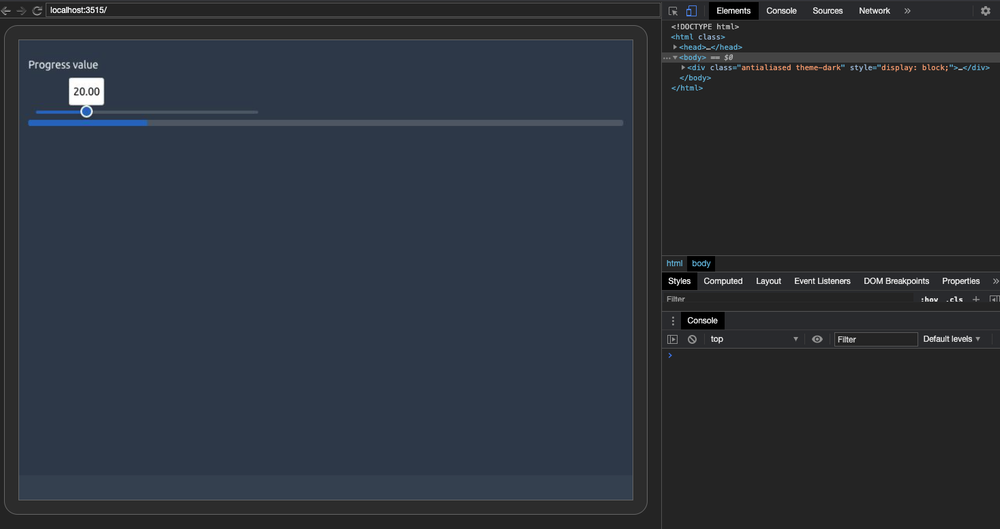

# Testing and validating templates elements {#custom-templates-testing}
Until now, we have been building the template boilerplate, that is the main skeleton functions (page, navbar, navbar menu, ...) as well as some components such as cards, ribbons, progress bars. We also exposed some techniques to substantially give more interactivity to the template, leveraging our freshly acquired JavaScript skills. Does this mean we are ready to make the template public? Not yet since some essentials steps are missing:


  - Input validation is a crucial step toward success. Briefly, it consists in checking user inputs so that your functions fail safely and elegantly by providing meaningful error messages or warnings. This concept has already been covered in R for Data Science, Advanced R and a lot of other resources. Hence, I am not trying to reinvent the wheel and we will rely on already existing patterns, whose effectiveness is no longer to be demonstrated. Welcome to the defensive programming world! 
  - On the other hand, testing components allows to check if a functions does what it is supposed to do. Consequently, it is a proof of robustness, and increases reproducibility. It significantly reduces the mental load when it comes to start code refactoring, thereby making you feel slightly less guilty about creating breaking changes since, most of the time, your tests will be able to capture those error. 


## Validate template functions

### Create your own validations
Below, we will show some examples to validate user inputs. We first consider the `tabler_card` element from Chapter \@ref(custom-templates-skeleton).

```{r}
tabler_card <- function(..., title = NULL, status = NULL, width = 6, stacked = FALSE, padding = NULL) {
  
  card_cl <- paste0(
    "card", 
    if (stacked) " card-stacked",
    if (!is.null(padding)) paste0(" card-", padding)
  )
  
  div(
    class = paste0("col-md-", width),
    div(
      class = card_cl,
      if (!is.null(status)) {
        div(class = paste0("card-status-top bg-", status))
      },
      div(
        class = "card-body",
        # we could have a smaller title like h4 or h5...
        if (!is.null(title)) {
          h3(class = "card-title", title)
        },
        ...
      )
    )
  )
  
}
```

The first thing is to think about what to validate. Here, I see at least 3 test:

  - checking the status value
  - checking the width value
  - checking the padding value
  
Writing validation tests requires knowledge about the underlying mechanisms. In our case, we must know the Bootstrap 4 grid rules and valid color statuses. The Bootstrap 4 [grid](https://getbootstrap.com/docs/4.0/layout/grid/) ranges from 1 to 12. In other words, a card having a width of 12 will take the full page wherease, we may align 3 cards or width 4. Valid [statuses](https://getbootstrap.com/docs/4.0/utilities/colors/) are primary, secondary, success, info, danger, warning, light and dark.

It is therefore pretty straightforward to validate the card width: it must be numeric and between 1 and 12. Moreover, since the template has other containers including the width parameter, we will create a function

```{r}
validate_width <- function(width) {
  if (is.numeric(width)) {
    if (width < 1 || width > 12) {
      stop("width must belong to [1, 12], as per Bootstrap 4 grid documentation. See more at https://getbootstrap.com/docs/4.0/layout/grid/")
    }
  } else {
    stop("width must be numeric")
  }
}

# validate_width(-1)
# validate_width(13)
# validate_width("string")
```

To check the status parameter, we save the valid statuses in a vector and take the `validStatuses` function from shinydashboard [utils](https://github.com/rstudio/shinydashboard/blob/master/R/utils.R). It also make sense to create a function since this parameter is widely used among template components. Contrary to the shinydashboard function, our custom `valid_status` does not fail if the status is NULL since it is not a mandatory parameter.

```{r}
valid_statuses <- c(
  "primary", 
  "secondary",
  "success", 
  "info", 
  "warning", 
  "danger",
  "light",
  "dark"
)

validate_status <- function(status) {

  if (is.null(status)) {
    return(TRUE) 
  } else {
    if (status %in% valid_statuses) {
      return(TRUE)
    }
  }

  stop("Invalid status: ", status, ". Valid statuses are: ",
       paste(valid_statuses, collapse = ", "), ".")
}
```

We finish by the padding validation. According to the Tabler documentation, there are three possible choices, namely `sm`, `md` or `lg`.

```{r}

valid_paddings <- c("sm", "md", "lg")

validate_padding <- function(padding) {
  if (!is.null(padding)) {
    if (!(padding %in% valid_paddings)) {
      stop("Invalid status: ", padding, ". Valid choices are: ",
       paste(valid_paddings, collapse = ", "), ".")
    }
  }
}
```

We apply all these validation to our card element.

```{r}
tabler_card <- function(..., title = NULL, status = NULL, width = 6, stacked = FALSE, padding = NULL) {
  
  validate_status(status)
  validate_width(width)
  validate_padding(padding)
  
  card_cl <- paste0(
    "card", 
    if (stacked) " card-stacked",
    if (!is.null(padding)) paste0(" card-", padding)
  )
  
  div(
    class = paste0("col-md-", width),
    div(
      class = card_cl,
      if (!is.null(status)) {
        div(class = paste0("card-status-top bg-", status))
      },
      div(
        class = "card-body",
        # we could have a smaller title like h4 or h5...
        if (!is.null(title)) {
          h3(class = "card-title", title)
        },
        ...
      )
    )
  )
  
}
```

As of R 4.0.0, the `stopifnot` function may be a good alternative to `stop`. 

We recommend to be reasonable and not to validate every single parameter.


### Existing utils functions

#### Validating tags
The problem with the above approach is that it may take time to create all validation functions. Fortunately, packages like {shinydashboard} include really powerful validation functions, especially `tagAssert`. This function has been included in the book side package so that you may use it at any time.

```{r, eval=FALSE}
myTag <- div(class = "bg-blue")

tagAssert(myTag, type = "div")
tagAssert(myTag, type = "li") # will fail
tagAssert(myTag, class = "bg-blue")
```

Importantly, `tagAssert` will raise an error if the condition is not fulfilled. Another function, `tagMatches` simply returns TRUE/FALSE. It looks for `ìd`, `class`, `name` and any other tag attribute like `data-value`. Like `tagAssert`, `tagMatches` is also available in the book side package.

```{r, eval=FALSE}
tagMatches(myTag, id = "d")
tagMatches(myTag, class = "bg-blue")
```

#### Validating CSS units
The `validateCssUnit` belongs to the Shiny exported function. It is useful to validate any parameter involving a CSS unit like `width` and `height`.

There is no point to reuse what already exists and these tools will help you to be efficient for validating your template elements.


### Example: refine navbar menu items

#### Avoid wrong jQuery selectors
In Chapter \@ref(custom-templates-skeleton), we developed the `tabler_navbar_menu_item` function. The tabName parameter is critical since it is responsible for driving the navigation. We must ensure that the value provided by the user is compatible with jQuery selectors [conventions](https://api.jquery.com/category/selectors/). To illustrate the problem, we consider the example below, where the second tab name is `hello%%&1`:

```{r, eval=FALSE}
ui <- tabler_page(
  tabler_navbar(
    brand_url = "https://preview-dev.tabler.io", 
    brand_image = "https://preview-dev.tabler.io/static/logo.svg", 
    nav_menu = tabler_navbar_menu(
      inputId = "mymenu",
      tabler_navbar_menu_item(
        text = "Tab 1",
        icon = NULL,
        tabName = "tab1",
        selected = TRUE
      ),
      tabler_navbar_menu_item(
        text = "Tab 2",
        icon = NULL,
        tabName = "hello%%&1"
      )
    )
  ),
  tabler_body(
    tabler_tab_items(
      tabler_tab_item(
        tabName = "tab1",
        sliderInput(
          "obs", 
          "Number of observations:",
          min = 0,
          max = 1000, 
          value = 500
        ),
        plotOutput("distPlot")
      ),
      tabler_tab_item(
        tabName = "hello%%&1",
        p("Second Tab")
      )
    ),
    footer = tabler_footer(
      left = "Rstats, 2020", 
      right = a(href = "https://www.google.com", "More")
    )
  )
)
server <- function(input, output) {
  output$distPlot <- renderPlot({
    hist(rnorm(input$obs))
  })
}
shinyApp(ui, server)
```

Notice that we cannot see the second tab content. Below is a proposal for the `validate_tab` function. We first detect any punctuation in the provided input. Although not mandatory, we extract it to send a meaningful error message.
We finally raise an error if any punctuation is found.

```{r}
validate_tabName <- function(tabName) {
  temp <- grepl("[[:punct:]]", tabName)
  wrong_selector <- stringr::str_extract_all(tabName, "[[:punct:]]")[[1]] %>% 
    stringr::str_c(collapse = "")
  if (temp) stop(paste("Please do not use punctuation characters like",  wrong_selector,"in tabNames. This might cause JavaScript issues."))
}
# validate_tabName("test%") # fails
validate_tabName("plop")
```

`validate_tabName` must be then inserted at the beginning of `tabler_navbar_menu_item` as well as in `tabler_tab_item`, the latter also relying on tabName.

#### Checking for multiple selected items
Another issue is the possibility to have multiple selected tab items at start. Looking back at `tabler_navbar_menu`, this is not surprising since there are absolutely no checks!

```{r}
tabler_navbar_menu <- function(...) {
  tags$ul(class = "nav nav-pills navbar-nav", ...)
}
```

A classic method to inspect items provided to `tabler_navbar_menu` is to capture them in a list. We extract the children of those items `lapply(list(...) , "[", 3)` (A shiny tag is a structure where the first position holds the tag name, the second is a named list of attributes and the third slot is for children). For each children we apply the shinydashboard internal function `findAttribute`, that allows to search for a specific attribute value in a given tag. We use the `vapply` to return an atomic vector (like `c(1, 2`), lists are vectors but recursive!) and compute the sum of the vector. Each TRUE occurrence is counted as 1 and FALSE 0. Therefore, if the latter is higher than 1, it means that the user provided more than 1 selected tab, which should subsequently raise an error.

```{r, eval=FALSE}
tabler_navbar_menu <- function(...) {
  
  items <- lapply(list(...) , `[`, 3)
  res <- sum(vapply(items, findAttribute, "class", "nav-link active", FUN.VALUE = logical(1)))
  if (res > 1) stop("Cannot have multiple selected items at start!")
  
  tags$ul(class = "nav nav-pills navbar-nav", ...)
}

# the code below must fail
menu <- tabler_navbar_menu(
  tabler_navbar_menu_item(
    text = "Tab 1",
    icon = NULL,
    tabName = "tab1",
    selected = TRUE
  ),
  tabler_navbar_menu_item(
    text = "Tab 2",
    icon = NULL,
    tabName = "tab2",
    selected = TRUE
  )
)
```


## Testing templates elements
Imagine if one day, someone or yourself accidentally remove the width validation function, after a significant refactoring. Later, you receive a new message from github, stating that someone opened a new issue. According to the report, the card is not properly displayed although no error is thrown. Among the 400 lines of code provided, you hardly notice that the width parameter is set to 13, which is not in line with the Bootstrap 4 documentation, as it should remain between 1 and 12. You lost 10 minutes, so is your end user, which is even worse. 

With a proper testing pipeline, this problem could have been avoided. Ironically, writing the corresponding test takes only 2 minutes.

A reference for testing functions is the [{testthat}](https://testthat.r-lib.org/index.html) package. In short, a unit test consists in setting expectations about our function and check whether they fail or pass. For instance, with our `tabler_card` example, the `validate_width` must fail if the given width is not in the expected bounds or not numeric. We apply the `test_that` function with a description of the test context, followed by the expectations inside the curly brackets.

```{r}
test_that("validate width works", {
  expect_error(tabler_card(width = -1))
  expect_error(tabler_card(width = 13))
  expect_error(tabler_card(width = "hello world"))
})
```

We then test `validate_status` and `validate_padding`.

```{r}
test_that("validate status works", {
  expect_error(tabler_card(status = "toto"))
})

test_that("validate padding works", {
  expect_error(tabler_card(width = "xs"))
})
```

So far so good. In few lines of code, we substantially increased the robustness of our function without increasing its complexity. Now, let's try to remove the `validate_width` step from the `tabler_card`.

```{r, eval=FALSE}
tabler_card <- function(..., title = NULL, status = NULL, width = 6, stacked = FALSE, padding = NULL) {
  
  validate_status(status)
  validate_padding(padding)
  
  card_cl <- paste0(
    "card", 
    if (stacked) " card-stacked",
    if (!is.null(padding)) paste0(" card-", padding)
  )
  
  div(
    class = paste0("col-md-", width),
    div(
      class = card_cl,
      if (!is.null(status)) {
        div(class = paste0("card-status-top bg-", status))
      },
      div(
        class = "card-body",
        # we could have a smaller title like h4 or h5...
        if (!is.null(title)) {
          h3(class = "card-title", title)
        },
        ...
      )
    )
  )
  
}


test_that("validate width works", {
  expect_error(tabler_card(width = -1))
  expect_error(tabler_card(width = 13))
  expect_error(tabler_card(width = "hello world"))
})
```

Notice how the 3 above tests elegantly fail. The provided context ("validate width works") immediately indicates the culprit, which is a game changer for debugging.


### Testing template behavior
Testing the JavaScript behavior is one of the biggest challenge to validate a template. If the 
R component has been carefully validated, it does not mean that its JavaScript effects
are! For instance, let's consider the `tabler_progress`  that may be updated with `update_tabler_progress`:

  - How do we check whether the progress value is correctly set?
  
#### R side
Testing the R side is quite easy. Let's recall the `update_tabler_progress` function:

```{r, eval=FALSE}
update_tabler_progress <- function(id, value, session = shiny::getDefaultReactiveDomain()) {
  message <- list(id = session$ns(id), value = value)
  session$sendCustomMessage(type = "update-progress", message)
}
```

This function does 2 things:

  - Captures the id of the targeted progress and its new value
  - Sends the message the JS

The test consists in checking whether we send all elements to the session. We first create
a dummy session environment which contains `ns` to mimic the `session$ns` function
and `sendCustomMessage` to test the message handler part:

```{r, eval=FALSE}
session <- as.environment(
  list(
    ns = identity,
    sendCustomMessage = function(type, message) {
      session$lastCustomMessage <- list(type = type, message = message)
    }
  )
)
```

Here, `sendCustomMessage` simply stores the last sent message in `session$lastCustomMessage`.

We then call `update_tabler_progress` with some random parameters and capture the
last sent message in the `res` variable:

```{r, eval=FALSE}
update_tabler_progress(id = "myprogress", value = 10, session = session)
res <- session$lastCustomMessage
```

Importantly, don't forget to set the session parameter to `session`, otherwise,
it will default to `shiny::getDefaultReactiveDomain` that is `NULL`.

This is time to set expectations:

  - `res` must be a list of length 2.
  - The expected custom handler type is `update-progress`.
  - The sent value is 10.
  - The sent id is `myprogress`.
  
and translate into `{testthat}`:

```{r, eval=FALSE}
test_that("update progress works", {
  
  session <- as.environment(
    list(
      ns = identity,
      sendCustomMessage = function(type, message) {
        session$lastCustomMessage <- list(type = type, message = message)
      }
    )
  )
  
  update_tabler_progress(id = "myprogress", value = 10, session = session)
  res <- session$lastCustomMessage
  
  expect_length(res, 2)
  expect_equal(res$type, "update-progress")
  expect_length(res$message, 2)
  expect_equal(res$message$id, "myprogress")
  expect_equal(res$message$value, 10)
})
```

This test being set, it ensures to seamlessly capture any breaking change in the API.

#### JS side
In the following, we have to test whether this piece of JS works as expected:

```javascript
Shiny.addCustomMessageHandler('update-progress', function(message) {
  $('#' + message.id)
    .css('width', message.value +'%')
    .attr('aria-valuenow', message.value);
});
```

We are going to leverage the `{crrry}` packages developed by Colin Fay from ThinkR.
Overall, [`{crrry}`](https://github.com/ColinFay/crrry) is an adaptation of [`{crrri}`](https://github.com/RLesur/crrri) for `{shiny}`, which is a native Chrome Remote Interface in R using the Chrome Debugging Protocol. In other words, it provides tools to programmatically control
the web browser and do many things like inspecting a web page, 
taking screenshots, testing... You may know `{shinytest}` that relies on another technology,
phantomjs. The latter does not play well with `Bootstrap 4` templates, that's why we'll not use it
here. 

`{crrry}` is already introduced in the `Engineering Production-Grade Shiny Apps` [book](https://engineering-shiny.org/step-secure.html#testing-the-interactive-logic). 

The first step is to run the `update_tabler_progress` example locally and add the returned
url to the following code. We run the app in another process with `{processx}`:

```{r, eval=FALSE}
p <- processx::process$new(
  "Rscript", 
  c( "-e",  "options('shiny.port'= 3515);OSUICode::update_tabler_progress_example()" )
)

Sys.sleep(2)

p$is_alive()
```

That way, we can run our test in the main R process, after checking that `p` is alive (here the app
loads immediately but you may wait some time if there are computations):

```{r, eval=FALSE}
library(crrry)
library(testthat)
test <- crrry::CrrryOnPage$new(
  chrome_bin = pagedown::find_chrome(),
  chrome_port = httpuv::randomPort(),
  url = "http://localhost:3515/",
  headless = TRUE
)
```

We wait Shiny to be ready:

```{r, eval=FALSE}
test$wait_for_shiny_ready()
```

Note the `--remote-debugging-port=31683` that gives the link to the Chrome devtools link
to inspect the current app, as shown Figure \@ref(fig:tabler-crrry-debug). 


```{r tabler-crrry-debug, echo=FALSE, fig.cap='Tabler progress bar debug tools', out.width='100%'}

```
It is now time to write the JS testing logic. We know that moving the slider triggers
the `update_tabler_progress` function. This is how we change the slider value,
thanks to the noUiSlider [API](https://refreshless.com/nouislider/slider-read-write/#section-setting):

```javascript
var slider = document.getElementById('progress_value');
slider.noUiSlider.set(50);
```

We use `call_js` to update the slider value within our testing pipeline:

```{r, eval=FALSE}
test$call_js(
  "var slider = document.getElementById('progress_value');
   slider.noUiSlider.set(50);
  "
)
```

According to Figure \@ref(fig:tabler-crrry-debug-2), the slider is properly updated,
the progress bar also seems to have the expected value.

```{r tabler-crrry-debug-2, echo=FALSE, fig.cap='Updated slider', out.width='100%'}
knitr::include_graphics("images/practice/tabler-crrry-debug-2.png")
```

We recover the progress value knowing that it is contained in the `aria-valuenow`
attribute, as a string. We have to convert it to a number with `parseInt`:

```{r, eval=FALSE}
val <- test$call_js(
  "parseInt($('#progress1').attr('aria-valuenow'));
  "
)
expect_equal(val$result$value, 50)

# stop the test whenever satisfied
test$stop()
```

The test pass, meaning that our `update_tabler_progress`, especially the associated
custom message handler, works. This test was simple and did not involve any input elements.
Yet, `{crrry}` also support setting input values with `shiny_set_input(id, value)`.


### Test input bindings
We decide to add more complexity and show how to test a home made input binding. We are going to
test the tabler navbar JavaScript logic developed in Chapter \@ref(custom-templates-inputs-navbar). 
Before starting to test, we define the expectations:

  - If no `tabler_navbar_menu_item` is selected by default, at start, the first item is selected.
  It must have the `active` class on it. We have to check whether the first `<a class="nav-link">` 
  has the active class.
  - Moreover, if one item is selected at start, we have to make sure this item has the `active` class.
  - We have to ensure that clicking on another link switch the currently selected link so that
  the corresponding input on the R side is properly updated.
  - When we call `update_tabler_tab_item` we have to check whether the active link is
  successfully changed.
  - Each time a navbar item is active, the corresponding body `tabler_tab_item` must hold the
  `active show` class, to make sure the tab content is visible. Only on tab may have those classes at a time.
  
As described above, we run our app in another R process, so as to keep the main process
for the test:


```{r, eval=FALSE}
p <- processx::process$new(
  "Rscript", 
  c( "-e",  "options('shiny.port'= 3515);OSUICode::update_tabler_navbar_example()" )
)

Sys.sleep(2)

p$is_alive()

test <- crrry::CrrryOnPage$new(
  chrome_bin = pagedown::find_chrome(),
  chrome_port = httpuv::randomPort(),
  url = "http://localhost:3515/",
  headless = TRUE
)

test$wait_for_shiny_ready()
```

At start, no link was selected, meaning we expect the first link to be active and shown. The navbar
may be targeted using the `navbar-nav` class and we use `find` to locate the active child which must
have the `nav-link active` classes. We also control that only 1 item is selected by inspecting the length
of the active nav link items. 
We extract its index with `index` which is contained in the `data-value` attribute:

```{r, eval=FALSE}
active <- test$call_js("$('.navbar-nav').find('.nav-link.active').length")
expect_equal(active$result$value, 1)

test$wait_for_shiny_ready()

res1 <- test$call_js("$('.navbar-nav').find('.nav-link.active').attr('data-value')")
expect_equal(res1$result$value, "tab1")
```

Now let's see whether to body tab has the good index. We target the `tab-content` class and look
for the element having `active show` classes. We recover its id which contains the tab name:

```{r, eval=FALSE}
res2 <- test$call_js("$('.tab-content').find('.active.show').attr('id')")
expect_equal(res1$result$value, res2$result$value)
```

We programmatically change the active tab by clicking on the second link. Below we use
`.nav-link:eq(1)` to select the second link but we could use `.nav-link:not(.active)` since
we only have 2 links. We also recover the index of the selected link and the corresponding tab. If 
everything happens well, we expect their value to be 2:

```{r, eval=FALSE}
test$call_js("$('.navbar-nav .nav-link:eq(1)').click();")

res3 <- test$call_js("$('.navbar-nav').find('.nav-link.active').attr('data-value')")
expect_equal(res3$result$value, "tab2")

test$wait_for_shiny_ready()

res4 <- test$call_js("$('.tab-content').find('.active.show').attr('id')")
expect_equal(res3$result$value, res4$result$value)
```

We then click on the "change tab" button, that has the `update` id. The latter,
actually triggers `update_tabler_tab_item`. We also want to check its behavior and expect
to be back on tab 1:

```{r, eval=FALSE}
test$call_js("$('#update').click();")

res5 <- test$call_js("$('.navbar-nav').find('.nav-link.active').attr('data-value')")
expect_equal(res5$result$value, "tab1")

test$wait_for_shiny_ready()

res6 <- test$call_js("$('.tab-content').find('.active.show').attr('id')")
expect_equal(res5$result$value, res6$result$value)
```

If the test is successful, it means that the `receiveMessage` and `setValue` methods
work as expected. We finally test the input value by setting its value to `tab2` with `shiny_set_input`.
All Shiny input values are stored in the `Shiny.shinyapp.$inputValues` object, as shown in Chapter \@ref(shiny-input-lifecycle):

```{r, eval=FALSE}
test$shiny_set_input("current_tab", "tab2")
tab_input <- test$call_js("Shiny.shinyapp.$inputValues.current_tab")
expect_equal(tab_input$result$value, "tab2")
```

This does not effect the navbar but triggers the notification.


As an exercise, we leave the reader to write a test to check the app behavior when
the second tab is active at start. 


