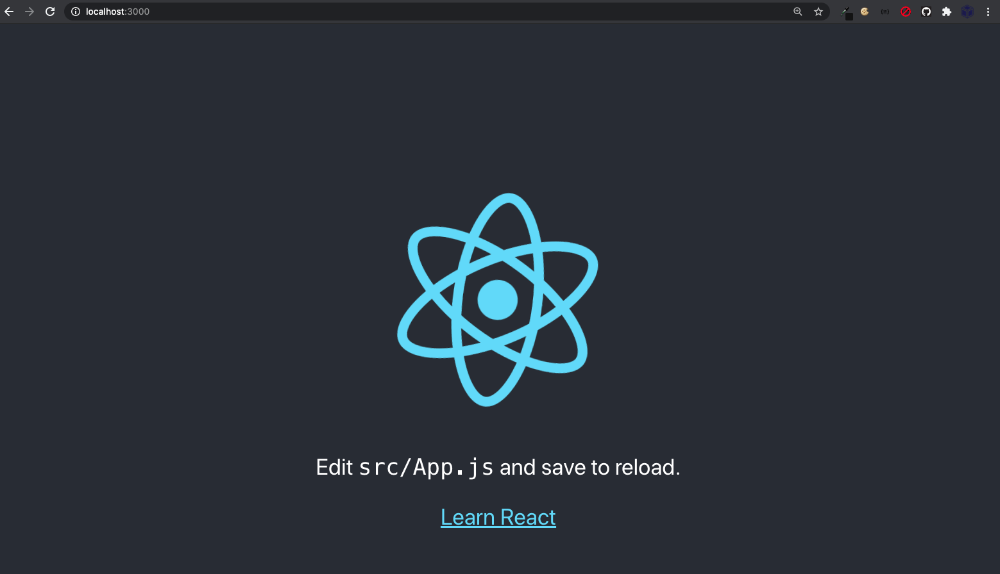

# R + Shiny + React: welcome `{reactR}` {#going-further-reactR}
[React](https://reactjs.org/) is an open source library designed to quickly develop user interfaces or UI components, on the front end. 
It has been developed by [Facebook](https://github.com/facebook/react) and the community (more than 1500 contributors) 
and made public in May 29 2013. It is currently used worldwide and has around 163k stars on the
Github ranking and widely impacts the mobile market, through the [React Native](https://reactnative.dev/) library.  
React is also really convenient to develop attractive documentations with [docusaurus](https://v2.docusaurus.io/).
If you ever have built user interfaces with pure JS, you might like React! 

Below, we give a short introduction to the React ecosystem and see how we can benefit from it from the
R Shiny side. 

## Quick introduction to React
To understand React there are few prerequisites notably basic HTML/CSS/JS knowledge. However,
if you managed to reach this chapter, you should not worry to much. 

### Setup
`Node` and `npm` are required. If you are not sure, run:

```shell
node -v
npm -v
```

At that stage it is also good to have [`yarn`](https://classic.yarnpkg.com/en/docs/install#mac-stable) as we'll need it for `{reactR}`.

If nothing is returned, please refer to section \@ref(install-node). To initiate a React [project](https://create-react-app.dev/),
we leverage the `npx` command:

```
npx create-react-app <PROJECT_NAME>
```

Replace `<PROJECT_NAME>` by the real name of your project. If this seems intimidating, 
keep in mind this is the same concept has using the `{golem}` [package](https://github.com/ThinkR-open/golem) 
to initiate the creation of robust shiny projects, except that we work from the terminal.

Once done (the package initialization takes some time), 
move to the project folder and launch the demo app:

```
cd <PROJECT_NAME> && npm start
```

If you have yarn, `yarn start` also works.

You should see something similar to Figure \@ref(fig:basic-react-app).

```{r basic-react-app, echo=FALSE, fig.cap='npm start opens the react app', out.width='100%'}

```

### Basics

## Introduction to `{reactR}`

### Scaffold inputs

### Toward custom components
Creating custom components in Shiny is not that easy. If we assume we want to create
a custom text container which color, size and many CSS properties can change dynamically. 
This is a bit different from the approach shown in Chapter \@ref(beautify-with-bootstraplib) since
the `{bslib}` gives access to Bootstrap [variables](https://rstudio.github.io/bslib/articles/bs4-variables.html) but not
basic CSS properties like the color of a `span` element.