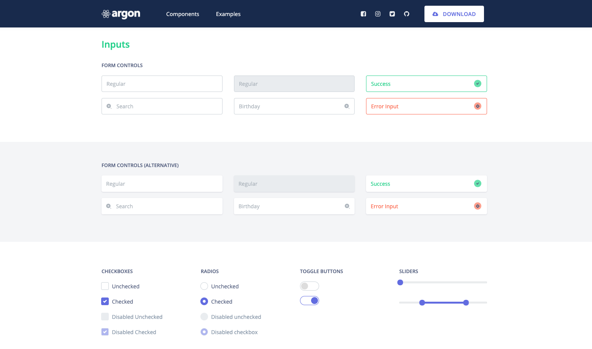
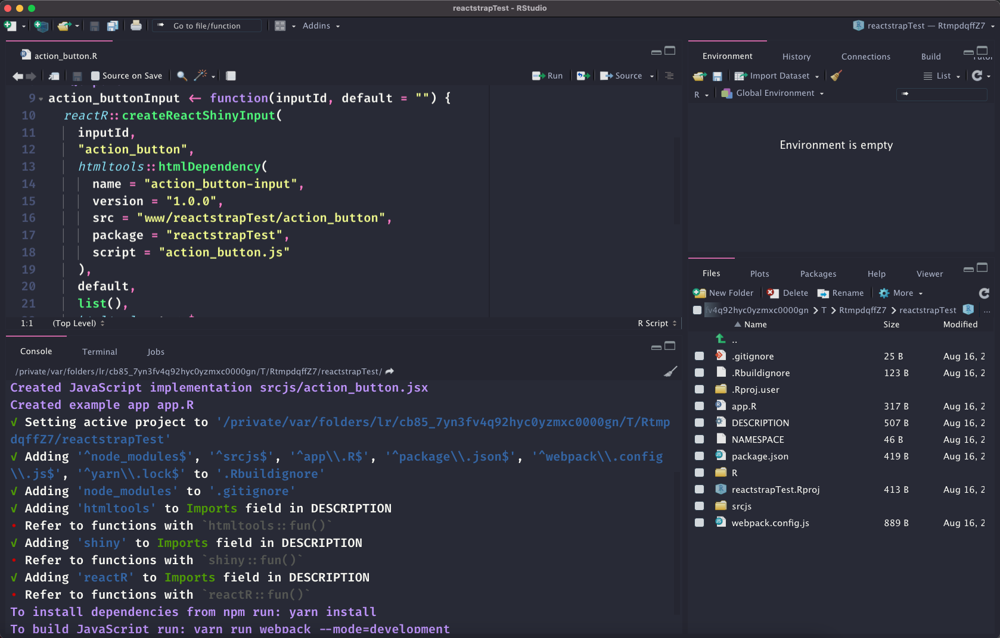
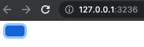
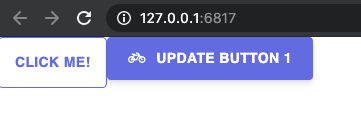
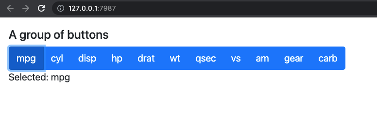

# Shiny and React with {reactR} {#going-further-reactR}
[React](https://reactjs.org/) is an open source library designed to quickly develop user interfaces or UI components, on the __front end__. 
It has been developed by [Facebook](https://github.com/facebook/react) and the community (more than 1500 contributors) and made public in May 29 2013. It is currently used worldwide and has around 163k stars on the GitHub ranking and widely impacts the mobile market, through the [React Native](https://reactnative.dev/) library. __React__ is also really convenient to develop attractive documentations with [docusaurus](https://v2.docusaurus.io/).
If you ever have built user interfaces with pure JS, you might like React! 

Below, we give a short introduction to the React ecosystem and see how we can benefit from it from the R Shiny side. By the end of this chapter, you'll be able to develop R interfaces to some nice React libraries like the Argon design [system](https://demos.creative-tim.com/argon-design-system-react/?_ga=2.179634850.760978196.1612189904-282783983.1612189904#/), shown Figure \@ref(fig:argon-design-react).

```{r argon-design-react, echo=FALSE, fig.cap='Argon design template with React.', out.width='100%'}

```

As another example, `{reactable}` is an HTML widget developed on top of the [`react-table`](https://github.com/tannerlinsley/react-table) library. 

## Quick introduction to React
To understand React, there are few prerequisites notably basic HTML/CSS/JS knowledge, especially JS modules (see section \@ref(about-js-modules)). However, if you managed to reach this chapter, you should not worry too much.

### Setup
__Node__ and __npm__ are required. If you are not sure, run:

```shell
node -v
npm -v
```

At that stage it is also good to have [`yarn`](https://classic.yarnpkg.com/en/docs/install#mac-stable), as we'll need it for `{reactR}`.

If nothing is returned, please refer to section \@ref(install-node). To initiate a React [project](https://create-react-app.dev/), we leverage the [`npx`](https://docs.npmjs.com/cli/v7/commands/npx) command:

```
npx create-react-app <PROJECT_NAME>
```

Replace `<PROJECT_NAME>` by the real name of your project. If this seems intimidating, 
keep in mind this is the same concept that the `{golem}` [package](https://github.com/ThinkR-open/golem) uses to initiate the creation of robust shiny projects, except that we work from the terminal.

Once done (the package initialization takes some time), 
move to the project folder and launch the demo app:

```
cd <PROJECT_NAME> && npm start
```

If you have yarn, `yarn start` also works.

You should see something similar to Figure \@ref(fig:basic-react-app).

```{r basic-react-app, echo=FALSE, fig.cap='npm start opens the react app.', out.width='50%', fig.align='center'}
knitr::include_graphics("images/going-further/basic-react-app.png")
```

Congrats! You are running your first React app.

### Basics
We are now all set up to start learning the basics of React. Among all created files,
notice the `/src/app.js` file. Inside the `App` function, we remove all the content inside
the `return` statement to put a simple `<h1>Hello, world!</h1>` HTML title. We also clean the imports
as we don't need any CSS and logo anymore. We obtain:

```jsx
function App() {
  return (
    <h1>Hello, world!</h1>
  );
}

// don't remove, this is needed by index.js
export default App; 
```

Once done, we run `npm build` (or `yarn build`), to rebuild the JS code and `npm start` to
restart the server and preview the app. In practice, once the server is launched, there is 
no need to restart it whenever the code is updated. A simple save will refresh the interface!

The code you see above is a React __component__. The definition is rather simple: it is a function that returns a moreless complex piece of UI. How are components rendered by React?

So far, we didn't have a look at the `/src/index.js` script. Inside we find:

```jsx
ReactDOM.render(
  App,
  document.getElementById('root')
);
```

::: {.noteblock data-latex=""}
Recent versions of `npx create-react-app` have `<React.StrictMode><App /></React.StrictMode>` instead of `App`, which does the same thing. You may also find `<App />`. In practice, we rarely modify this part.
:::

In short, this inserts the `App` component inside the element having __root__ as id in the main
HTML page. This HTML skeleton may be found in the `public/index.html` folder. You may imagine that at the end of the day, our app will be composed of multiple bricks and call `ReactDOM.render` on the top level component.

#### About JSX
We just wrote our first React component. Didn't you notice something weird in that code? 
JS and HTML are mixed, in what we called __JSX__, that is a syntax extension to JS. JSX makes the code
less verbose, for instance:

```js
React.createElement(
  'h1',
  'Hello, world!'
);
```

does exactly the same thing as above but when the code becomes more complex, it is nearly
impossible to read. 

Let's see how to pass variables into JSX. We want to show `Hello, <Your Name>`, we store
the name in a variable and modify the `app.js` code accordingly:

```jsx
function App() {
  const name = "David";
  return (
    <h1>Hello, {name}</h1>
  );
}
```

Expressions are passed within curly brackets `{expression}` and you may even call functions inside.
Tag attributes also require curly brackets. Let's modify the title tag to give it a color and 
a size.

```jsx
function App() {
  const name = "David";
  return (
    <h1 style={color: "red", fontSize: 40}>Hello, {name}</h1>
  );
}
```

Try to save. Why does this fail? We can't pass multiple object properties inside a single `{}`.
We need either double brackets like `{{object properties: values, ...}}` or to store the object in 
a variable before:

```jsx
function App() {
  const name = "David";
  return (
    <h1 style={{color: "red", fontSize: 40}}>Hello, {name}</h1>
  );
}

// OR

function App() {
  const name = "David";
  const myStyle = {
    color: "red", 
    fontSize: 40
  }
  return (
    <h1 style={myStyle}>Hello, {name}</h1>
  );
}
```

Notice that we write CSS properties following the __camelCase__ syntax, `font-size` being equivalent to `fontSize`.

#### Combining components {#react-map}
The whole interest is to combine multiple components to create reusable pieces. We edit the above code 
to create a `SayHello` component. Notice the __props__ parameter. It is a way to pass configuration from the parent component. In that case, we want to display the person name, that is `props.name`. In the meantime, we edit the `App` parent component and call `SayHello` three times, passing a different name like `<SayHello name="David" />` (this is the reason why we recover `props.name` in the lower level component):

```jsx
function SayHello(props) {
  return (
    <h1>Hello, {props.name}</h1>
  );
}


function App() {
  return(
  <>
    <SayHello name="David" />
    <SayHello name="Lisa" />
    <SayHello name="Simon" />
  </>
  );
}
```

::: {.noteblock data-latex=""}
Notice the enclosing `<>...</>`. This is called a React __fragment__ and useful if we don't want to
insert any extra `<div>` in the DOM. 
:::

We could be even more efficient by leveraging the lists capabilities. We create an array
of names and apply the `map` method to return the corresponding `<SayHello />` sub-component:

```jsx
const names = ["David", "Lisa", "Simon"];
function App() {
  const sayHelloToAll = names.map(
    (name) => <SayHello key={name} name={name} />
  ); 
  return(sayHelloToAll);
}
```

::: {.warningblock data-latex=""}
By convention, all elements inside a `map` require __keys__. 
:::

__Props__ are __read-only__ and must not be modified withing their own component. 
How do we update components then?

#### Component state {#react-hooks}
A component __state__ is private and controlled by this same component. Since React 16.8 and the introduction of __hooks__, this is not necessary to convert the component function to a [class](https://reactjs.org/docs/components-and-props.html#function-and-class-components). 
The easiest example to illustrate hooks capabilities is the button. Each time, we click on a button,
we want to keep the current number of clicks in a state, like the `actionButton()`. We start by
importing the `useState` function from `react` and create a new `ActionButton` component. 
Inside, we set the state with `useState` that create the state variable `count` as well as the function to update it, namely `setCount`. This way to create two variables at once is called array __destructuring__. We set the initial number of counts to 0: 

```jsx
import {useState} from 'react';

function ActionButton() {
  const [count, setCount] = useState(0);
}
```

Next step is to create the button skeleton. We provide an `onClick` property that updates
the button state. Inside, we write an anonymous function which calls `setCount` and increments
the count value by 1. At this point, you may replace the `app.js` content by:

```jsx
import {useState} from 'react';

function ActionButton() {
  const [count, setCount] = useState(0);
  return(
    <button onClick={() => setCount(count + 1)}>
      Number of clicks: {count}
    </button >
  );
}

function App() {
  return (
    <ActionButton />
  );
}

export default App;
```

We may improve the previous app and add a reset button within the `ActionButton` component that
sets the count back to 0:

```jsx
function ActionButton() {
  const [count, setCount] = useState(0);
  return(
    <>
    <button onClick={() => setCount(count + 1)}>
      Number of clicks: {count}
    </button >
    <button onClick={() => setCount(0)}>
      Reset
    </button >
    </>
  );
}
```

It would make more sense to only show the reset button once the button has been clicked,
at least once. We define the `isResetVisible` variable which is `true` whenever the
count is higher than 0 and `false` if the count is 0, leveraging the JS __ternary__ operator. We store the reset button in a variable and only return something if `isResetVisible` is `true`:

```jsx
function ActionButton() {
  const [count, setCount] = useState(0);
  const isResetVisible = count > 0 ? true : false;
  let resetButton;
  if (isResetVisible) {
    resetButton = <button onClick={() => setCount(0)}>
      Reset
    </button >
  }
  return (
    <>
      <button onClick={() => setCount(count + 1)}>
        Number of clicks: {count}
      </button >
      {resetButton}
    </>
  );
}
```

That's all folks! Now that you get a better understanding of how React works, 
let's see how to use it with Shiny. 

## Introduction to `{reactR}` 

::: {.importantblock data-latex=""}
This section has been written and tested with `{reactR}` `0.4.4`.
Some feature may change in future releases. 
:::

In this part, we see how to leverage `{reactR}` [@R-reactR] to bring few component from the `reactstrap` [library](https://reactstrap.github.io/) to Shiny.

To install `{reactR}`:

```{r, eval=FALSE}
# stable from CRAN
install.packages("reactR")

# lastest from GitHub
remotes::install_github("react-R/reactR")
```

In the following, we are going to propose an implementation of the `reactstrap` button, which is a Bootstrap 4 and React powered action button. 

### Setup
`{reactR}` exposes the `scaffoldReactShinyInput()` that sets the necessary pieces of code
to get started with the input development (see Figure \@ref(fig:reactR-init-input)):

  - An `<input_name>.R` file containing the input skeleton as well as its related update function, located in the `./R` folder.
  It also creates a custom HTML dependency pointing to the input JS logic.
  - A `jsx` file with a boilerplate to start developing the input JS logic, located in the `./srcjs` folder.
  - A `package.json` file containing dependencies. 
  - An `app.R` file to host the input demonstration code. 
  - A `webpack.config.js` file (discussed later).
  - Classic R package files like `DESCRIPTION`, `.Rbuildignore`...
  Interestingly, the `.Rbuildignore`contains few lines to ignore non standard files and
  folders like `srcjs` and `package.json`.

Besides, providing an optional dependency with a name and version taken from __npm__ installs all necessary dependencies in the `package.json` file:

```{r, eval=FALSE}
path <- file.path(tempdir(), "reactstrapTest")
usethis::create_package(path, rstudio = TRUE)

# Wait new project to be created before running 
# the following!!!
reactR::scaffoldReactShinyInput(
  "action_button", 
  list(
    "reactstrap" = "^8.9.0"
  )
)
```

```{r reactR-init-input, echo=FALSE, fig.cap='Package initialization with {reactR}.', out.width='100%'}

```

Note that `{reactR}` provides __webpack__ as JS code manager. To __build__ the JS code, we go to the RStudio terminal tab (or any terminal) and run at the package root:

```
yarn install
yarn run webpack --mode=development
```

This installs all dependencies listed in the `package.json` file and create a `package-lock.json` file. If you ever used `{renv}`, this is very similar and guarantees isolation of your package. All dependencies are stored in the `node_modules` folder.

The `run webpack` command compiles the JS in production ready code. Should you need to customize the build pipeline, the webpack configuration is located in `webpack.config.js`. On the R side, the generated JS file is referenced in an HTML dependencies, located in the `<input_name>.R` file. 
If you specify the `--mode=development` tag, it falls back to development code. 

In the following, we see how to customize the newly created component.

### Customize the R logic
A `{reactR}` input is composed of R and JS code that both exchange information. Upon initialization, we obtained a `.R/action_button.R` code:

```{r, eval=FALSE}
action_buttonInput <- function(inputId, default = "") {
  reactR::createReactShinyInput(
    inputId,
    "action_button",
    htmltools::htmlDependency(
      name = "action_button-input",
      version = "1.0.0",
      src = "www/reactstrapTest/action_button",
      package = "reactstrapTest",
      script = "action_button.js"
    ),
    default,
    list(),
    htmltools::tags$span
  )
}
```

For convenience, we remove the input suffix to name it `action_button`. 
Overall, this function calls `reactR::createReactShinyInput()` that:
  - Give the widget a class and id. The class is targeted on the JS side (see \@ref(reactR-jsx-logic)) and is necessary to make it working.
  - Sets all necessary dependencies (React, ...) as well as the internal JS code (see \@ref(reactR-jsx-logic)).
  - Creates the input HTML code with `{htmltools}`. 
  - Sets the default value, through the `default` parameter.
  - Allow to pass a list of options inside the `list()` container. By default,
  nothing is sent but we will use it very soon. 
  
We also have the corresponding update input function, which we renamed to `update_action_button()` for consistency:

```{r, eval=FALSE}
update_action_button <- function(session, inputId, value, 
                                 configuration = NULL) {
  message <- list(value = value)
  if (!is.null(configuration)) {
    message$configuration <- configuration
  }
  session$sendInputMessage(inputId, message);
}
```

In Shiny, the end-user cannot decide what is the initial value of an action button. It is always set to 0 by default. Therefore, we decided to remove the default parameter from `action_button()` and make it 0 by default. 
In order to add a label and change the button color, we introduce two extra parameters and
add them the the configuration list:

```{r, eval=FALSE}
action_button <- function(
  inputId,
  label,
  status = "primary"
) {
  reactR::createReactShinyInput(
    # ... unchanged ...
    default = 0,
    configuration = list(
      label = label,
      status = status
    ),
    htmltools::tags$div
  )
}
```

Let's see below how to make this interactice with some JSX code.

### Implement the JS logic {#reactR-jsx-logic}
It's time to develop the logic. For now, the `action_button.jsx` file only contains a placeholder generated by `{reactR}`. The reactstrap documentation provides a [boilerplate](https://reactstrap.github.io/components/buttons/), which we slightly modified, according to the `{reactR}` documentation:

```jsx
import { reactShinyInput } from 'reactR';
import { Button } from 'reactstrap';

function ActionButton() {
  return (
    <Button
      color="primary">
    </Button>
  );
}

reactShinyInput(
  '.action_button',
  'reactstrapTest.action_button',
  ActionButton
);
```

As you can see, we need to import the `Button` component from `reactstrap` as well as
the `reactShinyInput` function from the `{reactR}` package. To generate our JS code, we recompile with `yarn run webpack`, document and reload the package functions:

```{r, eval=FALSE}
devtools::document()
devtools::load_all()
```

In the `./app.R` script, we have to tell Shiny we want to use Bootstrap 4 instead of Bootstrap 3, through the `bslib::bs_theme` function. Erase the existing code and replace it by the following:

```{r, echo=FALSE, results='asis'}
code_chunk(OSUICode::get_example("demo-button", package = "reactstrapTest"))
```

As you can see Figure \@ref(fig:react-action-button-basic), the button label is not displayed nor its value. 
This is because we missed to leverage the component arguments that are `configuration`, `value`, `setValue`, making the link between R and JS. 

```{r react-action-button-basic, echo=FALSE, fig.cap='Work in progress action button with React.', out.width='100%'}

```

### Improve the JS logic
We modify the `action_button.jsx` code to add those three parameters to the `ActionButton` component:

```jsx
function ActionButton({ configuration, value, setValue }) {
  return (
    <Button
      color={configuration.status}
      onClick={() => setValue(value + 1)}>
      {configuration.label}
    </Button>
  );
}
```

Remember that `configuration` is an R list and sent to JS as a JSON object with `reactR::createReactShinyInput()`. On the JS side, we access its properties with `configuration.<PROPERTY>`. `value` is the current button value, which is 0 when the app is started.

How do we set handle the value change upon click? Well, this is pretty straightforward. The `Button` element has an `onClick` [property](https://reactstrap.github.io/components/buttons/) inside which we can pass the `setValue` function and increment it by 1 (`setValue` is an internal hook, see \@ref(react-hooks)). 


In the below example, we update a button from the server side with `update_action_button()`:

```{r, echo=FALSE, results='asis'}
code_chunk(OSUICode::get_example("demo-update-button", package = "reactstrapTest"))
```

Clicking on the first button should increment its value in the R console. You may play around
by changing the default color. After clicking on the second button, you should get the result shown Figure \@ref(fig:react-action-button).

```{r react-action-button, echo=FALSE, fig.cap='Fully working React powered action button.', out.width='100%'}

```

### Exercise 1
Based on the previous example and the `reactstrap` documentation, improve the action button component.
1. Add it a `size` style parameter.
2. Add it a `disabled` parameter. 
3. Add it an `outline` style parameter. 

### Technical considerations
Under the hood, the JS `reactShinyInput` function provides a wrapper to automatically __bind__ the input element. This is convenient as it allows to solely focus on the component logic rather than binding it to the shiny system. It takes three parameters:

  - The __element__ class which is obtained from the R side by `createReactShinyInput()`.
  - The __input binding__ name which is useful to store a reference in the `Shiny.InputBindings` registry. Recent version of `{reactR}` use `<PACKAGE_NAME>.<INPUT_NAME>` as convention, which avoids conflicts between inputs belonging to two different packages. 
  - The React __component__ function. 
  - There is an optional fourth parameter allowing to pass custom __options__ like
  rate [policies](https://github.com/react-R/reactR/blob/7dccb68a0989cf642d4a5a3eb90b59d1ae773002/srcjs/input.js#L137). 
  
Overall, [`reactShinyInput`](https://github.com/react-R/reactR/blob/7dccb68a0989cf642d4a5a3eb90b59d1ae773002/srcjs/input.js#L72) extends the `Shiny.InputBinding` class by providing extra methods like:
  
```js
getInputConfiguration(el) {
  return $(el).data('configuration');
}
setInputConfiguration(el, configuration) {
  $(el).data('configuration', configuration);
}
```

`getInputConfiguration` and `setInputConfiguration`, respectively get and set the user provided configuration, passed in the `createReactShinyInput()` R side function. Under the hood (in addition to ship the `{reactR}`, React, ReactTools HTML dependencies and any user defined custom dependencies), `createReactShinyInput()` generates three tag elements:

  - The first tag is the element placeholder containing the unique __id__. React will insert 
  the component inside this target with `ReactDOM.render`. 
  - The second tag is a script containing the __value__ passed as __JSON__. 
  - The second tag is a script containing the __configuration__, also passed as JSON.
  
```{r, eval=FALSE}
library(shiny)
reactR::createReactShinyInput(
  inputId = "plop", 
  class = "myinput", 
  dependencies = htmltools::findDependencies(icon("bicycle")), 
  default = 0, 
  configuration = list(a = 1, b = "test"), 
  container = div
)
```
<!-- Manually formatted for pdf output -->

```
#> <div id="plop" class="myinput"></div>
#> <script id="plop_value" type="application/json">0</script>
#> <script 
#>  id="plop_configuration" 
#>  type="application/json">{"a":1,"b":"test"}
#> </script>
```
  
The configuration and values are processed in the __initialize__ method since it is called before the input is bound:

```js
// Within reactR's initialize method...
$(el).data('value', JSON.parse($(el).next().text()));
$(el).data(
  'configuration', 
  JSON.parse($(el).next().next().text())
);
```

The configuration and values are stored in the corresponding data attributes. The most important part is the __render__ method that creates the React element based upon its configuration and value and renders it in the DOM:

```js
// reactR's render method
render(el) {
  const element = React.createElement(component, {
    configuration: this.getInputConfiguration(el),
    value: this.getValue(el),
    setValue: this.setValue.bind(this, el),
    el: el
  });
  ReactDOM.render(element, el);
}
```

The `render` method is called once inside `subscribe` and also each time the element is updated
with `receiveMessage`.

### Exercise 2 {#reactR-exercise-2}
1. Add an`icon` (from fontawesome) parameter to the `ActionButton` component.
Hint: You might find helpful to capture its HTML dependency with `htmltools::findDependencies(iconTag)` so as to properly render it. In HTML `icon("bicycle")` produces `<i class="fa fa-bicycle" role="presentation" aria-label="bicycle icon"></i>`. However, in React we want `<i className="fa fa-bicycle />`. Therefore, you will have to extract the icon class and send it to JS in the configuration list.
2. Implement the logic on the JS side. Hint: you may use the code in appendix \@ref(reactR-exercise-2-appendix).
3. Try your code inside a Shiny app.

### Add another input

#### Button group input

In this section, we design a radio input consisting of multiple buttons displayed side by side. The corresponding widget has a label and must show the currently selected value.

We initialized the input elements with:

```{r, eval=FALSE}
reactR::scaffoldReactShinyInput("button_group")
```

As shown previously, this creates `./srcjs/button_group.jsx` and `.R/button_group.R`. 
The `button_group()` function has four parameters, the most critical being `choices`.
We expect the user to pass a vector like `names(mtcars)`, and we selected the first choice by default. We might add a `selected` parameter but leave this for the reader as a simple exercise. The function is defined below:

```{r, eval=FALSE}
button_group <- function(
  inputId,
  label,
  choices,
  status = "primary"
) {
  reactR::createReactShinyInput(
    inputId,
    "button_group",
    htmltools::htmlDependency(
      name = "button_group-input",
      version = "1.0.0",
      src = "www/reactstrapTest",
      package = "reactstrapTest",
      script = "button_group.js"
    ),
    default = choices[1],
    configuration = list(
      label = label,
      choices = choices,
      status = status
    ),
    htmltools::tags$div
  )
}
```

The expected `reactstrap` button group HTML structure is rather simple including a title, the list of button tags and the selected item in a paragraph:

```jsx
<div>
  <h5>Radio Buttons</h5>
  <ButtonGroup>
    <Button 
      color="primary" 
      onClick={...} 
      active={value === 1}>
      One
    </Button>
    <Button 
      color="primary" 
      onClick={...} 
      active={value === 2}>
      Two
    </Button>
    // ... other buttons ...
  </ButtonGroup>
  <p>Selected: {value}</p>
</div>
```

Inside `./srcjs/button_group.jsx`, we first import the required function and components:

```jsx
import { reactShinyInput } from 'reactR';
import { Button, ButtonGroup } from 'reactstrap';
```

We then design the `ButtonGroupUI` JS function that will return our component. The critical step is to recover the user choices (`configuration.choices`) and store them in a variable. Then, we leverage the `map` feature (see \@ref(react-map)) to iterate over each choice and programmatically create all buttons:

```jsx
function ButtonGroupUI({ configuration, value, setValue }) {
  const choices = configuration.choices
  // programmatically create buttons
  const buttons = choices.map(
    (choice) => <Button
      key={choice}
      color={configuration.status}
      onClick={() => setValue(choice)}
      active={value === choice}>
        {choice}
      </Button>
  )
  // ... other code
```

We finally return the whole component in a fragment `<>` to prevent from creating extra `div`. The whole code is shown below:

```jsx
import { reactShinyInput } from 'reactR';
import { Button, ButtonGroup } from 'reactstrap';

function ButtonGroupUI({ configuration, value, setValue }) {
  
  // ... create buttons ... //

  return (
    <>
      <h5>{configuration.label}</h5>
      <ButtonGroup>
       {buttons}
      </ButtonGroup>
      <p>Selected: {value}</p>
    </>
  );
}
```

Now, we may test the newly created element in a Shiny app:

```{r, echo=FALSE, results='asis'}
code_chunk(OSUICode::get_example("demo-button-group", package = "reactstrapTest"))
```

According to Figure \@ref(fig:react-button-group), there are rooms for improvements but it is a good start!

```{r react-button-group, echo=FALSE, fig.cap='Fully working React powered button group (similar to the Shiny radio input).', out.width='100%'}

```


#### Modularize JS code

Imagine if we had to repeat this for ten different elements. As we start to accumulate components, it is good practice to start modularizing our code. Inside the `./srcjs/action_button.jsx`, we wrap the `reactShinyInput` call into an `export` statement:

```jsx
// To add in ./srcjs/action_button.jsx
export default function initActionButton(){
  reactShinyInput(
    '.action_button',
    'reactstrapTest.action_button',
    ActionButton
  );
}
```

We apply the same strategy in the `./srcjs/button_group.jsx` script:

```jsx
// To add in `./srcjs/button_group.jsx`
export default function initButtonGroup(){
  reactShinyInput(
    '.button_group',
    'reactstrapTest.button_group',
    ButtonGroupUI
  );
}
```
 
We create a `main.jsx` file containing the necessary code to import and initialize our two components:

```jsx
import initActionButton from './action_button.jsx';
import initButtonGroup from './button_group.jsx';

initActionButton();
initButtonGroup();
```

We have to modify the `webpack.config.js` to change the entry point to `main.jsx`, whose output will be `main.js`:

```{js}
entry: [
  path.join(__dirname, 'srcjs', 'main.jsx')
],
output: {
  path: path.join(__dirname, 'inst/www/reactstrapTest'),
  filename: 'main.js'
}
```

This means we have to update the HTML dependency on the R side, for instance in the `button_group.R`, we replace the existing dependency by the following:

```{r, eval=FALSE}
# ... button_group.R start
# ... 
  htmltools::htmlDependency(
    name = "button_group-input",
    version = "1.0.0",
    src = "www/reactstrapTest",
    package = "reactstrapTest",
    script = "main.js"
  )
# ...
# button_group.R end
```

We proceed similarly in the `action_button.R` script.


## Further resources
`{shiny.fluent}` [@R-shiny.fluent] leverages `{shiny.react}` [@R-shiny.react], that is another [alternative](https://appsilon.github.io/shiny.react/index.html) to bring React to Shiny. 