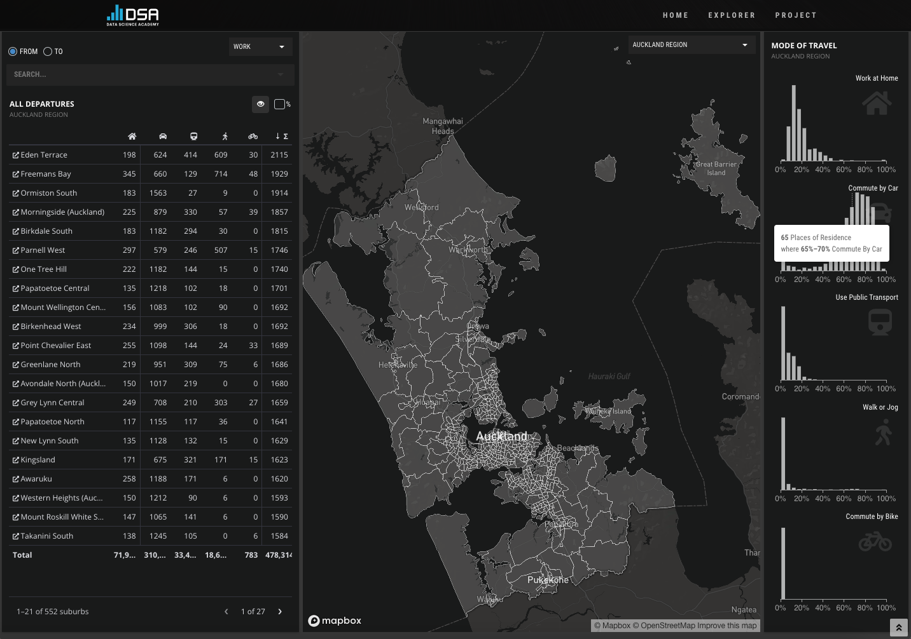
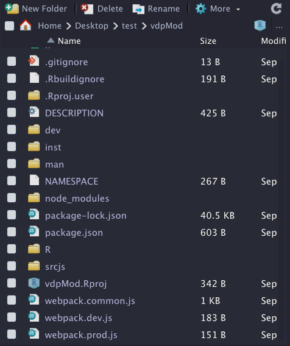
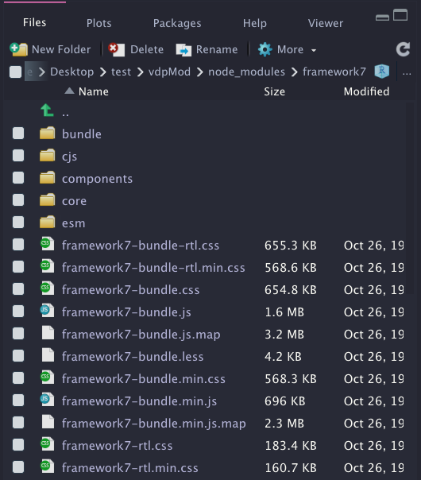
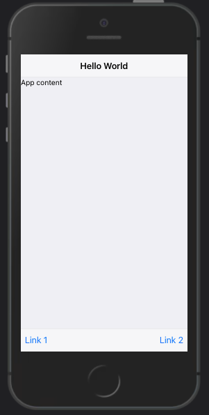
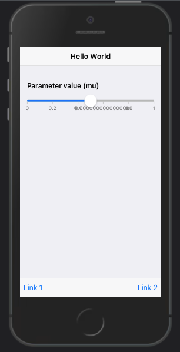
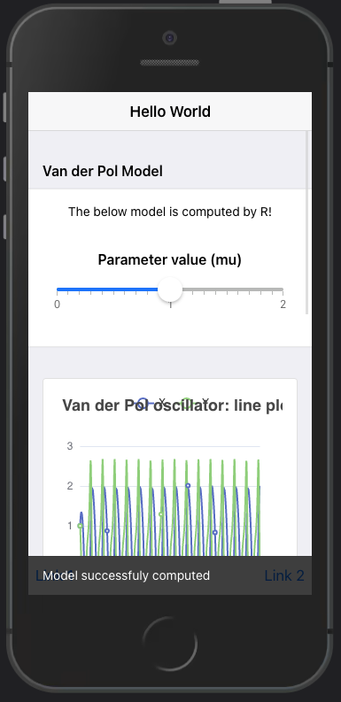
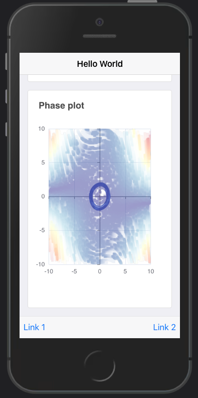

# Divide and Conquere {#going-further-webdev}

## Motivations
Adapting an external HTML template to R requires time, efforts and competent people. As an example, it took me about two years to get `{shinyMobile}` on the road, definitely not a compatible timeline for more urgent projects which have to be released under weeks.

What if, instead, we decided to handle the UI part with usual web languages like HTML, JS and CSS, thereby avoiding the time consuming HTML to R conversion and input binding creation?
  
Theoretically, any front-end web developer could take care of creating the user interface. There already exists HTML templates for [Shiny](https://shiny.rstudio.com/articles/templates.html), allowing one to leverage any existing HTML skeleton. The result may be literally stunning, as shown during the latest Shiny [contest](https://nz-stefan.shinyapps.io/commute-explorer-2/?_ga=2.70875408.1031573581.1632613467-748932920.1610966288) and illustrated on Figure \@ref(fig:htmlTemplate-app). However, from a modern web development point of view, there are nowadays much more suited tools to build and maintain application like React and webpack from the previous chapter. 

```{r htmlTemplate-app, echo=FALSE, fig.cap='Commute explorer app, Shiny Contest winner 2021.', out.width='100%'}

```

Eventually, the above approach would permit the R developers, that are most of the time not a UI design experts, to focus on the __business logic__ and improve the code base quality. On the other hands, the web developers could focus on building the user interface with their favorite web tools and prepare the link with the R part, without necessarily have a deep knowledge of R.

This chapter may be of interest to any company leveraging Shiny and having people with different programming background who wish to better work together around that same technology.

In the following, I'll show you how one may seamlessly leverage Shiny and some modern web dev tools like JSX, ES6, webpack and external JS viz libraries. 

## State of the art
Let's make a list of all requirements for such a project. Since we are working with both web languages and R, we may select `{packer}` [@R-packer] that briefly allows to use `webpack`, a JavaScript __bundler__, in any R project. Moreover, we seek for a robust R __package__ template structure for Shiny, which is a perfect task for `{golem}`. As for the icing on the cake, `{packer}` offers a plug and play function to set up a `{golem}` project with `webpack`, through `packer::scaffold_golem()`. 

::: {.noteblock data-latex=""}
An excellent introduction exposing how to maintain robust JavaScript code inside a Shiny project, featuring webpack and NPM, may be found in JavaScript for R (https://book.javascript-for-r.com/webpack-intro.html) by John Coene. 
:::

To install `{packer}` and `{golem}`, we run:

```{r, eval=FALSE}
# CRAN
install.packages(c("packer", "golem"))
# development version
remotes::install_github("JohnCoene/packer")
remotes::install_github("ThinkR-open/golem")
```

## About the project

### Topic
We are going to develop an ordinary differential equation solver app for the Van Der Pol oscillator, whose equations may be found below:

\begin{equation}
  \begin{cases}
    \dot{x}=y,\\
    \dot{y}=\mu (1-x^2)y-x.
  \end{cases}
\end{equation}

Importantly, we don't really focus on the scientific content and the app will be very simple regarding its features. As shown above, there is only one parameter namely $\mu$, which we will vary to see its influence on the whole system. 


### Initialize the project
We assume that the R developer is the first to setup the project, even though in theory, both can do. 

```{r, eval=FALSE}
golem::create_golem("vdpMod")
```

We then call the specific `{packer}` function to setup a `{golem}` compatible structure:

```{r, eval=FALSE}
packer::scaffold_golem()
```

You should end up with the file structure depicted on Figure \@ref(fig:vdpMod-init).

```{r vdpMod-init, echo=FALSE, fig.cap='vdpMod project initialization with {golem} and {packer}.', out.width='50%', fig.align='center'}

```

The structure is basically the same provided by `{golem}` with addition of extra files for JS code management by `{packer}`. This is the same principle shown in chapters \@ref(workflow-charpente) and \@ref(going-further-reactR). Let's pause here for the R setup and continue later in this chapter.

::: {.noteblock data-latex=""}
With the latest `{packer}` github version, you may get a plug and play Framework7 project by running `packer::scaffold_golem(framework7 = TRUE)`.
:::

### UI design
The UI will contain a slider input to change $\mu$ as well as two plots, one for the solutions `x` and `y` and another for the __phase plan__ analysis including the vector field and a simple trajectory from a chosen initial condition. In short, phase plan [analysis allows to __qualitatively__ study a non linear systems, that is determine:

  - What are the __steady states__ (state for which the system does not change in time).
  - The nature of the steady states (stable, unstable).
  - Whether there are __bifurcations__ (change in number of steady state and stability).
  - ... This is just wonderful believe me!

After knowing all those details, we may easily predict given an initial condition, how the system will react to any external perturbation. If you want to know more, this [book](https://www.springer.com/gp/book/9780387952239) is a good starting point. 

To build the user interface, we selected the [Framework7](https://framework7.io/) template, already mentioned in part \@ref(mobile-shiny-intro) since we want this app to be optimized for __mobile__ platforms. Besides, as `{shinyMobile}` does not implement all its features yet, this will also allow us to fully exploit the Framework7 API. The graphic output part will be handled by [echartsjs](https://echarts.apache.org/en/index.html), offering quite amazing vector field outputs, as depicted [here](https://echarts.apache.org/examples/en/editor.html?c=flowGL-noise&gl=1&theme=dark). 

### R Business logic
Before designing the app and dive into the reactivity, let's first think about the business logic. On the server side, we want to write the model equations, create a function to solve it, compute the vector field... in a `.R/model.R` script. The first step is to store the equations. As it is a two dimensions ODE system, we can use a simple vector:

```{r}
vdp_equations <- c(
  "Y",
  "p['mu'] * (1 - X^2) * Y - X"
)
```

Equations are solved with the `{deSolve}` package [@R-deSolve], whose performances are enough for this example (For more complex examples, one may switch to compiled code with Fortran, C or C++, `{deSolve}` providing a convenient API for compiled code).

```{r}
solve_model <- function(Y0, t, model, parms) {
  deSolve::ode(y = Y0, times = t, model, parms)
}
```

`Y0` refers to the initial condition, `t` is the time for which we integrate, `model` contains the equations and `parms` is a vector of parameters. Importantly, `{deSolve}` requires the model to be written as follows (`t` being the time, `y` a 2D vector and `p` a parameter vector), returning the value of `x` and `y` in a list:


```{r}
vdp <- function(t, y, p) {
  with(as.list(y), {
    dX <- eval(parse(text = vdp_equations[1]))
    dY <- eval(parse(text = vdp_equations[2]))
    list(c(X=dX, Y=dY))
  })
}
```

From there, calling `solve_model()` will return a vector containing our solutions at each time step:

```{r}
solve_model(
  Y0 = c(X = 1, Y = 1),
  t = seq(0, 1, .1),
  vdp,
  c(mu = 0.1)
)
```

It is therefore straightforward to plot __solutions__. However, this output does not tell use anything about the __vector field__. Below is the code used to generate it. `mag` represents the speed along trajectories resulting from a linear combination of the vertical speed and the horizontal speed components, respectively `dy` and `dx`. It is obtained after applying the Pythagorean theorem:

\begin{equation}
  mag = \sqrt{dx^2 + dy^2}
\end{equation}

We will use it later to setup appropriate color code in the JS code:

```{r}
build_phase_data <- function(xgrid, ygrid, p) {
  vectors <- expand.grid(x = xgrid, y = ygrid)
  X <- vectors$x
  Y <- vectors$y
  vectors$dx <- eval(parse(text = vdp_equations[1]))
  vectors$dy <- eval(parse(text = vdp_equations[2]))
  vectors$mag <- sqrt(
    vectors$dx * vectors$dx + 
    vectors$dy * vectors$dy
  )
  vectors
}
```

```{r}
grid <- seq(-10, 10)
phase_plan <- build_phase_data(grid, grid, c(mu = 1))
# Original is 441 rows, we provide a subset
phase_plan[1:5, ]
```

We obtain a matrix indicating for each `(X,Y)` in the grid what are the vertical and horizontal speed, respectively `dX` and `dY` as well as the resulting speed, `mag`, thereby allowing to draw the [phase plan](https://en.wikipedia.org/wiki/Phase_plane). 

The last step is to create a main wrapper that will call `solve_model()` and `build_phase_data()` at once. Remember that on the UI side, we generate two outputs, the time series and the phase portrait. The first one requires data obtained from `solve_model()`. The second one requires a subset of `solve_model()` output and `build_phase_data()`. Since `solve_model()` returns a matrix, we convert it to a `data.frame`, easier to handle on the JS side:

```{r}
generate_model_data <- function(model, pars, grid) {
  model_output <- solve_model(
    Y0 = c(X = 1, Y = 1),
    t = seq(0, 100, .1),
    model,
    pars
  )
  
  # time series (x = f(t), y = f(t))
  data <- data.frame(model_output)
  modelData <- list(t = data$time, X = data$X, Y = data$Y)
  
  # phase plan
  trajectoryData <- data[, c("X", "Y")]
  names(trajectoryData) <- NULL
  
  phaseData <- build_phase_data(grid, grid, pars)
  names(phaseData) <- NULL
  
  # return data
  list(
    lineData = modelData,
    phaseData = jsonlite::toJSON(phaseData, pretty = TRUE),
    trajectoryData = jsonlite::toJSON(
      trajectoryData, 
      pretty = TRUE
    )
  )
}
```

This is basically all we need! I highly encourage you not to dive into
__reactivity__ first, as this is significantly harder to debug. This way, you can
design unit test for these functions without having to handle the Shiny machinery. 

### Add Shiny
Now that the business logic is safe, we describe what we must do on the server side. Remember that the original idea is to have a slider which we can move to see what impact $\mu$ has on the whole system. 

In the main `.R/app_server.R` script, we set a reactive expression containing the vector of parameters (here we only have one but you may imagine to add more later):

```{r, eval=FALSE}
pars <- reactive({
  req(input$mu)
  c(mu = input$mu)
})
```

Then, we add an `observeEvent()` listening to any change in `pars()`, triggered as a result of a UI action, that is a slider input change. Inside, we generate the model data with `generate_model_data()` and send them to JS through the websocket with `session$sendCustomMessage`:

```{r, eval=FALSE}
observeEvent(pars(), {
  session$sendCustomMessage(
    "model-data",
    generate_model_data(vdp, pars(), seq(-10, 10))
  )
})
```

That's all folks! I hope you start to realize the benefits of extracting the business logic out of Shiny. For more complex apps, we recommend to start developing modules and not put the whole code inside `.R/app_server.R`. 

This is all what the R developer would have to do:

  - Write the business logic.
  - Add reactivity and send data to JS.
  - Talk to the JS developer about what inputs should be on the UI side ...

Now let's see what happens on the Front-end side.

### Create the interface
This is where the front-end developers come to play and believe me, there is quite some work for them. 

#### Setup dev JS dependencies
The first thing is to continue with the package setup to add development libraries necessary for building the JS code. 
For now, those dependencies are listed in `./package.json` and only cover `webpack`:

```{r, echo=FALSE, results='asis'}
js_code <- '"devDependencies": {
  "webpack": "^5.53.0",
  "webpack-cli": "^4.8.0",
  "webpack-merge": "^5.8.0"
}'
code_chunk_custom(js_code, "js")
```

Since we'll be using quite modern JS syntay (ES6) and some JSX, we have to install __Babel__ that will compile our code to a JS code that all web browsers can understand. 

```{r, eval=FALSE}
packer::npm_install(
  c(
    "babel", 
    "babel-loader", 
    "@babel/core", 
    "@babel/preset-env"
  ), 
  scope = "dev"
)
```

As we depend on Framework7 and echartsjs, we install them as production dependencies (needed by the app):

```{r, eval=FALSE}
packer::npm_install(
  c(
    "framework7", 
    "echarts", 
    "echarts-gl"
  ),
  scope = "prod"
)
```

You should obtain this JSON:

```{r, echo=FALSE, results='asis'}
js_code <- '"devDependencies": {
  "@babel/core": "^7.15.5",
  "@babel/preset-env": "^7.15.6",
  "babel": "^6.23.0",
  "babel-loader": "^8.2.2",
  "webpack": "^5.53.0",
  "webpack-cli": "^4.8.0",
  "webpack-merge": "^5.8.0"
},
"dependencies": {
  "echarts": "^5.2.1",
  "echarts-gl": "^2.0.8",
  "framework7": "^6.3.4"
}'
code_chunk_custom(js_code, "js")
```

We modify the `./srcjs/config/loader.json` to include the required loaders for `js`, `jsx` and `css` files. For css, `{packer}` exposes a functions, `use_loader_rule()`:

```{r, eval=FALSE}
use_loader_rule(
  c("style-loader", "css-loader"),
  test = "\\.css$"
)
```

which gives:

```{r, echo=FALSE, results='asis'}
js_code <- '[
  {
    "test": "\\.css$",
    "use": [
      "style-loader",
      "css-loader"
    ]
  }
]'
code_chunk_custom(js_code, "js")
```

Interestingly, Framework7 allows to write JSX code without the need of importing React. This is very convenient but require to add an extra [loader](https://www.npmjs.com/package/framework7-loader) as well as a babel react component (you may imagine to design a `use_loader_framework7()` function ...):

```{r, eval=FALSE}
use_loader_rule(
  "framework7-loader", 
  test = "\\.(f7).(html|js|jsx)$",
  use = list("babel-loader", "framework7-loader")
)
packer::npm_install("@babel/preset-react", scope = "dev")
```

```{r, echo=FALSE, results='asis'}
js_code <- '[
  // ... style loader ...
  {
    "test": "\\.(f7).(html|js|jsx)$",
    "use": [
      "babel-loader",
      "framework7-loader"
    ]
  }
]'
code_chunk_custom(js_code, "js")
```

Alternatively, one can copy the `./package.json` from [here](https://github.com/RinteRface/shinyComponent/tree/07ef8216c5803147691d95343ef6639a0e1ecf2f) to get exactly the same package versions I used when I initialized this project and call `packer::npm_install()` to pull the dependencies and install them for the project.  

We create a `./.babelrc` script providing some configuration for Babel to handle JSX. Within the terminal, we call `touch .babelrc` and add it the following code:

```{r, echo=FALSE, results='asis'}
js_code <- '{
  "presets": [
    "@babel/preset-env",
    "@babel/preset-react"
  ]
}'
code_chunk_custom(js_code, "js")
```

We can ultimately bundle our JS code and check whether the app starts:

```{r, eval=FALSE}
packer::bundle()
devtools::load_all()
run_app()
```

```{r vdpMod-basic-app, echo=FALSE, fig.cap='vdpMod basic app.', fig.align='center', out.width='100%'}
knitr::include_graphics("images/going-further/vdpMod-basic-app.png")
```

#### Basic R UI skeleton
The package configuration is successful but we still have to modify the `./R/app_ui.R` to be consistent with the Framework7 expectations. According to what is required in the [documentation](https://framework7.io/docs/app-layout.html), the `body` must contain a tag with the an id, followed by the `index.js` JS code (obtained after compilation with `{packer}`). The order is important as not following it will break the app:

```{r, eval=FALSE}
app_ui <- function(request, title = NULL) {
  tagList(
    # Leave this function for adding external resources
    golem_add_external_resources(title),
    # Your application UI logic
    tags$body(
      div(id = "app"),
      tags$script(src = "www/index.js")
    )
  )
}
```

Note that we also have to consider meta tags in the header to handle the viewport, mobile platforms... This is done inside `golem_add_external_resources()`. Besides, we had to comment out the `bundle_resources()` call since it would have added the dependencies in the head, before the app tag, which is not consistent with the Framework7 requirements:

```{r, eval=FALSE}
golem_add_external_resources <- function(title){

  add_resource_path(
    'www', app_sys('app/www')
  )

  tags$head(
    favicon(),
    tags$meta(charset = "utf-8"),
    tags$meta(
      name = "viewport",
      content = "width=device-width, initial-scale=1,
      maximum-scale=1, minimum-scale=1, user-scalable=no,
      viewport-fit=cover"
    ),
    tags$meta(
      name = "apple-mobile-web-app-capable",
      content = "yes"
    ),
    tags$meta(name = "theme-color", content = "#2196f3"),
    tags$title(title)
    # removed code
  )
}
```

This is all what we need on the R UI side since most of the code will be written in JSX. 

#### Create the app layout in JS
We have the R logic, the R/UI skeleton but few steps remain such as initializing the app as discussed in \@ref(mobile-initialization).
Everything happens in the `./srcjs/index.js` script. For now it should be like below:

```{r, echo=FALSE, results='asis'}
js_code <- "import { message } from './modules/message.js';
import 'shiny';

// In shiny server use:
// session$sendCustomMessage('show-packer', 'hello packer!')
Shiny.addCustomMessageHandler('show-packer', (msg) => {
  message(msg);
});"
code_chunk_custom(js_code, "js")
```

which is a placeholder provided by `{packer}`. While we don't need it,
note how we may seamlessly import functions from one script to another with just an `import` statement followed by the function name and the script path. We'll use this syntax all over the place. What do we need now? We import `Framework7` required for the app initialization in `new Framework7({...})`: 

```{r, echo=FALSE, results='asis'}
js_code <- "import 'shiny';
// Import Framework7
import Framework7 from 'framework7';"
code_chunk_custom(js_code, "js")
```

Then, we import the css, whose assets are located under `./node_modules/framework7` and as shown on Figure \@ref(fig:vdpMod-framework7-resources). To capture all CSS, we'll point to `framework7/framework7-bundle.min.css` (bundle usually corresponds to all components):

```{r, echo=FALSE, results='asis'}
js_code <- "import 'shiny';
// Import Framework7
import Framework7 from 'framework7';
// Import Framework7 Styles
import 'framework7/framework7-bundle.min.css';"
code_chunk_custom(js_code, "js")
```

```{r vdpMod-framework7-resources, echo=FALSE, fig.cap='Framework7 assets in node modules.', out.width='50%', fig.align='center'}

```

The way we imported Framework7 does not provide any other component. To lighten the JS code, Framework7 has a modular organisation, thereby consisting in inporting only what we require. According to Figure \@ref(fig:vdpMod-framework7-resources), those components are located in `framework7/esm/components/<COMPONENT_NAME>/<SCRIPT.js>`
If you remember correctly, we seek for a slider widget to update the model parameter value. Moreover, it's always nice to notify the user when the new results are available, so let's do it with a toast:

```{r, echo=FALSE, results='asis'}
js_code <- "// ... Other imports ...

// Install F7 Components using .use() method on class:
import Range from 'framework7/esm/components/range/range.js';
import Toast from 'framework7/esm/components/toast/toast.js';
Framework7.use([Range, Toast]);"
code_chunk_custom(js_code, "js")
```

For the layout, we selected the main App component template, documented [here](https://framework7.io/docs/router-component.html#main-app-component). Overall, it offers a better way to organize the app code in different component modules, the `App` being the top level component:

```{r, echo=FALSE, results='asis'}
js_code <- "// ... Other imports ...

import App from './components/app.f7.jsx';
let app = new Framework7({
  el: '#app',
  theme: 'ios',
  // specify main app component
  component: App
});"
code_chunk_custom(js_code, "js")
```

`el` targets the app tag `id` defined in `./R/app_ui.R`. If you ever have to change it, don't forget to replace it in both places. The `component` slot hosts the `App` which has to be defined. We assumed it is created in a `./srcjs/components/app.f7.jsx`, `.` being the root of the `srcjs` folder. Interestingly, it has the `.jsx` extension, the JSX syntax being very convenient to mix HTML and JavaScript code in the same file. It is crucial to name the files `<name>.f7.jsx` as it will allow the Framework7 loader to work properly. Practically, a template file will always look the same. We export the main component as a function that may have some parameters. Each component must return a __render__ function containing some tags. Below is a `./srcjs/components/list.f7.jsx` example: 

```{r, echo=FALSE, results='asis'}
jsx_code <- "export default () => {

  const ListItem = (props) => {
    return (
      <li>{props.title}</li>
    )
  }

  return () => (
    <ul>
      <ListItem title=\"Item 1\" />
      <ListItem title=\"Item 2\" />
    </ul>
  )
}"
code_chunk_custom(jsx_code, "jsx")
```

You may even split the code into more small pieces, below we assume `list-item.f7.jsx` is in the same directory as the main component:

```{r, echo=FALSE, results='asis'}
jsx_code <- "// list-item.f7.jsx
export default (props) => {
  return () => <li>{props.title}</li>;
}"
code_chunk_custom(jsx_code, "jsx")
```

```{r, echo=FALSE, results='asis'}
jsx_code <- "import ListItem from './list-item.f7.jsx';
export default () => {

  return () => (
    <ul>
      <ListItem title=\"Item 1\" />
      <ListItem title=\"Item 2\" />
    </ul>
  )
}"
code_chunk_custom(jsx_code, "jsx")
```

We define the preliminary main app component in `./srcjs/components/app.f7.jsx`, the layout being composed of a `navbar` (top), a `toolbar` (bottom) and the page content, as already discussed in \@ref(framework7-layouts):

```{r, echo=FALSE, results='asis'}
jsx_code <- 'export default (props, context) => {
  const title = \'Hello World\';
  const content = \'App content\';

  return () => (
    <div id="app">
      <div class="view view-main view-init safe-areas">
        <div class="page">
          <div class="navbar">
            <div class="navbar-bg"></div>
            <div class="navbar-inner">
              <div class="title">{title}</div>
            </div>
          </div>
          <div class="toolbar toolbar-bottom">
            <div class="toolbar-inner">
              <a href="#" >Link 1</a>
              <a href="#" >Link 2</a>
            </div>
          </div>
          <div class="page-content">
           {content}
          </div>
        </div>
      </div>
    </div>
  )
}'
code_chunk_custom(jsx_code, "jsx")
```


`props` are elements passed to the component (see \@ref(react-map)) and `context` is an object containing [helpers](https://framework7.io/docs/router-component.html#component-context) such as:

  - `$f7` refers to app instance.
  - `$update` to programmatically re-render the component. 

Once done, we run and preview the app according to Figure \@ref(fig:vdpMod-basic-app-2). We are slowly getting there!

```{r, eval=FALSE}
packer::bundle()
devtools::load_all()
run_app()
```

```{r vdpMod-basic-app-2, echo=FALSE, fig.cap='vdpMod basic app with main app component template.', out.width='40%', fig.align='center'}

```

We add the slider component that is going to drive the model computation inside `./srcjs/components/vdp.f7.jsx`, leveraging the Framework7 range widget described [here](https://framework7.io/docs/range-slider.html#range-slider-auto-initialization). To lighten the JS code, we decide to rely on the auto-initialized widget. All attributes are stored in `data-<ATTR>` format and the `range-slider-init` class ensures to get the widget properly initialized. The range is inserted in a block container for a better display. We finally bind it an [event](https://framework7.io/docs/range-slider.html#app-and-range-slider-instance-events) listening to any value change so that we can assign a Shiny input value and use it on the R side:

```{r, echo=FALSE, results='asis'}
jsx_code <- "const VdpWidget = (props, { $f7, $update}) => {
  // Handle range change for ODE model computation
  const getRangeValue = (e) => {
    const range = $f7.range.get(e.target);
    Shiny.setInputValue(range.el.id, range.value);
    $update();
  };

  return () => (
    <div>
      <div class=\"block-title\">Parameter value (mu)</div>
      <div class=\"block\">
        <div
          class=\"range-slider range-slider-init\"
          data-min=\"0\"
          data-min=\"0\"
          data-max=\"2\"
          data-step=\"0.1\"
          data-label=\"true\"
          data-value=\"0.1\"
          data-scale=\"true\"
          data-scale-steps=\"2\"
          data-scale-sub-steps=\"10\"
          id=\"mu\"
          onrangeChange={(e) => getRangeValue(e)}
          ></div>
      </div>  
    </div>
  )
}

export { VdpWidget };"
code_chunk_custom(jsx_code, "jsx")
```

Inside `./srcjs/components/app.f7.jsx`, we import the newly designed component and replace `{content}`:

```{r, echo=FALSE, results='asis'}
jsx_code <- "import VdpWidget from './vdp.f7.jsx';

export default (props) => {
  const title = 'Hello World';
  
  return () => (
    <div id=\"app\">
      <div class=\"view view-main view-init safe-areas\">
        <div class=\"page\">
          <!-- Navbar -->
          <!-- Toolbar -->
          <div class=\"page-content\">
            <VdpWidget label=\"Van der Pol Model\"/>
          </div>
        </div>
      </div>
    </div>
  )
}"
code_chunk_custom(jsx_code, "jsx")
```

On the R side, you may add this in the server code to track the range value:

```{r, eval=FALSE}
observeEvent(input$mu, {
  print(input$mu)
})
```

After recompiling, this gives us Figure \@ref(fig:vdpMod-basic-app-3).

```{r vdpMod-basic-app-3, echo=FALSE, fig.cap='vdpMod basic app with range slider.', out.width='40%', fig.align='center'}

```

You'll notice that `input$mu` only exist after the range is dragged. To give it an initial value, we design an additional function, `initializeVdpWidget` located in `./srcjs/components/vdp.f7.jsx`, taking the app instance as parameter. Inside, we listen to the `shiny:connected`, create `input$mu` giving it the initial range value. We finally export the new function:

```{r, echo=FALSE, results='asis'}
js_code <- "const initializeVdpWidget = (app) => {
  $(document).on('shiny:connected', () => {
    // Init vals for ODE model computation
    Shiny.setInputValue(
      'mu', 
      parseFloat($('#mu').attr('data-value'), 10), 
      {priority: 'event'}
    );
  });
}

export { VdpWidget, initializeVdpWidget };"
code_chunk_custom(js_code, "js")
```

Inside `./srcjs/components/app.f7.jsx`, we update our import field, passing an extra parameter `$f7` which captures the app instance required by `initializeVdpWidget`:

```{r, echo=FALSE, results='asis'}
js_code <- "import { VdpWidget, initializeVdpWidget } from './vdp.f7.jsx';
export default (props, { $f7 }) => {

  initializeVdpWidget($f7);
  // ... unchanged ...
}"
code_chunk_custom(js_code, "js")
```

Congratulations, we are now ready to move to the last part about creating the visualization.

#### Plot model data with echartsjs
As stated above, we leverage echarts and echarts-gl to plot the model results. Like for other dependencies, we have to import them, specifically in the `./srcjs/components/vdp.f7.jsx` component:

```{r, echo=FALSE, results='asis'}
js_code <- "// Import plotting library
import * as echarts from 'echarts';
import 'echarts-gl';"
code_chunk_custom(js_code, "js")
```

To work properly, [echarts](https://echarts.apache.org/handbook/en/get-started/) requires to setup an HTML empty container in the DOM with height and width in pixels, as well as an __id__. I recommend using percentage for width so as to fill the entire parent container:

```{r, echo=FALSE, results='asis'}
html_code <- '<div id="my-plot" style="width:100%; min-height:400px;"></div>'
code_chunk_custom(html_code, "html")
```

On the JS side, we instantiate the plot and set the options list to give it a title, set the axis labels, add the time series:

```{r, echo=FALSE, results='asis'}
js_code <- "myChart = echarts.init(document.getElementById('my-plot'));
myChartOptions = {
  title: { text: 'Plot title' },
  legend: { data:[...] },
  xAxis: { data: ...},
  yAxis: { type: ... },
  series: [
    {
      name: ...,
      type: ...,
      data: ...
    },
    // other data
  ]
};
myChart.setOption(myChartOptions);"
code_chunk_custom(js_code, "js")
```

Obviously, many more options exist, but this is enough for this example.
We edit the `VdpWidget` render function to include the time series plot of model solution, below the range slider:

```{r, echo=FALSE, results='asis'}
jsx_code <- "const VdpWidget = (props, { $f7, $update}) => {
  // ... unchanged ...
  
  const plotStyle = {
    width: '100%',
    minHeight: '400px'
  }
  
  return () => (
    <div>
      <div class=\"block-title\">{props.label}</div>
      <div class=\"block block-strong text-align-center\">
        <p>The below model is computed by R!</p>
        <!-- range slider block -->
      </div>
      <div class=\"card card-outline\">
        <div class=\"card-content card-content-padding\">
          <div id=\"line-plot\" style={plotStyle}></div>
        </div>
      </div>
    </div>
  )
}"
code_chunk_custom(jsx_code, "jsx")
```

The initialization happens once, that's why we include it inside the existing `shiny:connect` event listener in the `initializeVdpWidget` function. Notice how we make the plot responsive to any viewport change, by calling the echarts `resize` method when the window is resized:

```{r, echo=FALSE, results='asis'}
js_code <- "const initializeVdpWidget = (app) => {
  let linePlot;
  $(document).on('shiny:connected', () => {
    // ... unchanged ...
    // prepare echarts plots
    linePlot = echarts.init(document.getElementById('line-plot'));
  });
  
  // Resize plot, responsive
  $(window).on('resize', function(){
    linePlot.resize();
  });
};"
code_chunk_custom(js_code, "js")
```

The next step is to recover the model data sent from R with the `session$sendCustomMessage("model-data", ...)` in `./R/app_server.R`. We create a dedicated message handler on the JS side still in `initializeVdpWidget`. As a reminder, since we send a list from R, items are accessed with `message.<FIELD>` in JS:

```{r, echo=FALSE, results='asis'}
js_code <- "const initializeVdpWidget = (app) => {
  // ... shiny:connected ...
  
  // Recover ODE data from R
  let lineData, linePlotOptions;
  
  Shiny.addCustomMessageHandler(
    'model-data', (message) => {
      lineData = message.lineData;
  });
}"
code_chunk_custom(js_code, "js")
```

We set the plot options. For the time series chart, we'll display the solution X (`lineData['X']`) and Y (`lineData['Y']`) as a function of time (`lineData['t']`). The plot type is `line`:

```{r, echo=FALSE, results='asis'}
js_code <- "const initializeVdpWidget = (app) => {
  // ... shiny:connected ...
  
  Shiny.addCustomMessageHandler(
    'model-data', (message) => {
      // ... recover data ...
      
      // set options
      linePlotOptions = {
        title: {
          text: 'Time series plot'
        },
        legend: { data: ['X', 'Y'] },
        xAxis: { data: lineData['t'] },
        yAxis: { type: 'value' },
        series: [
          {
            name: 'X',
            type: 'line',
            data: lineData['X']
          },
          {
            name: 'Y',
            type: 'line',
            data: lineData['Y']
          }
        ]
      };
      
      // use configuration item and data specified to show chart
      linePlot.setOption(linePlotOptions);
  });
}"
code_chunk_custom(js_code, "js")
```

We finally leverage the Framework7 toast API to send a message to the user, telling the model is up to date:

```{r, echo=FALSE, results='asis'}
js_code <- "const initializeVdpWidget = (app) => {
  Shiny.addCustomMessageHandler(
    'model-data', (message) => {
      // ... plot config ...
      
      // Notify plot update
      app.toast.create({
        text: 'Model successfuly computed',
        closeTimeout: 2000,
      }).open();
  });
}"
code_chunk_custom(js_code, "js")
```

After rebuilding the JS code, you should get Figure \@ref(fig:vdpMod-basic-app-4).

```{r vdpMod-basic-app-4, echo=FALSE, fig.cap='vdpMod basic app with time series output.', out.width='40%', fig.align='center'}

```

#### Exercise: add the phase portrait

Based on the example shown [here](https://echarts.apache.org/examples/en/editor.html?c=flowGL-noise&gl=1&theme=dark), you'll have to add the phase portrait chart to the current application. 

1. In `VdpWidget`, add the card container that will hold the phase plan, right after the time series card. The plot will have the `phase-plot` id:

```{r, echo=FALSE, results='asis'}
jsx_code <- "const VdpWidget = (props, { $f7, $update}) => {
  // ... getRangeValue ...
  // ... plotStyle ...
  return () => (
    <div>
      <div class=\"block-title\">{props.label}</div>
      <div class=\"block block-strong text-align-center\">
        <p>The below model is computed by R!</p>
        <!-- range slider block -->
      </div>
      <!-- line plot -->
      TO ADD
    </div>
  )
}"
code_chunk_custom(jsx_code, "jsx")
```

2. In `initializeVdpWidget`, inside the `shiny:connected` event listener,
initialize the new `phasePlot` instance. Fill in the `...`.

```{r, echo=FALSE, results='asis'}
js_code <- "const initializeVdpWidget = (app) => {
  let linePlot, ...;
  $(document).on('shiny:connected', () => {
  // ... Init vals for ODE model computation ...
  // ... Time series plot init ...
  ... = echarts.init(document.getElementById(...));
  });
  // ...
}"
code_chunk_custom(js_code, "js")
```

3. Ensure it is properly resized by adding an entry to the `resize` event listener. Fill in the `...`.

```{r, echo=FALSE, results='asis'}
js_code <- "const initializeVdpWidget = (app) => {
  
  //... shiny:connected ...
  
  $(window).on('resize', function(){
    linePlot.resize();
    ....resize();
  });
  
}"
code_chunk_custom(js_code, "js")
```

4. In `initializeVdpWidget`, after the `linePlotOptions`, create a new
`phasePlotOptions` object containing the plot title. Fill in the `...`.

```{r, echo=FALSE, results='asis'}
js_code <- "const initializeVdpWidget = (app) => {
 // ... shiny:connected ...
 // ... resize plots ...
 let lineData, linePlotOptions, phasePlotOptions, 
 phaseData, trajectoryData;
 
 Shiny.addCustomMessageHandler(
    'model-data', (message) => {
    lineData = message.lineData;
    phaseData = message.phaseData;
    trajectoryData = message.trajectoryData;
    
    ... = {
      title: {
        text: 'Phase plot'
      },
      xAxis: {
        type: 'value'
      },
      yAxis: {
        type: 'value'
      }
    }
  });
}"
code_chunk_custom(js_code, "js")
```

Since we plot Y against X (it was X and Y against time in the previous plot), we add two entries to the previous configuration.

5. The first layer is a flow GL chart showing particles movement in the vector field. The chosen __type__ `flowGL` entry ensures we utilize the proper chart module. We pass the `phaseData` recovered from the R side. Other properties are responsible for controlling the particle appearance like the speed, size and transparency. You may try with different values to see what happens in the plot. Fill in the `...`.

```{r, echo=FALSE, results='asis'}
js_code <- "phasePlotOptions = {
  // ... title, axis ...
  series: [
    {
      type: ...,
      data: ...,
      particleDensity: 64,
      particleSize: 5,
      particleSpeed: 4,
      supersampling: 4,
      particleType: 'point',
      itemStyle: {
        opacity: 0.5
      }
    },
    // Other series
  ]
}"
code_chunk_custom(js_code, "js")
```

6. How do we control the flow chart visual aspect? As a reminder, `phaseData` is a matrix with 5 columns, the last one being a measure of the flow speed. Ideally, we would like to set up a scale representing different speeds. This is where we introduce the __visualMap__ property, which exposes multiple sub-properties like:

  - `show` to display a scale.
  - `min` and `max` to set the color grid. 
  - `dimension` is the column of data used to apply colors (here `mag`).
  - `inRange.color` defines a color palette for all values in the range. The provided examples default to 11 predefined colors. 

`min` and `max` are determined as per below calculation. Fill in the `...`.

```{r, echo=FALSE, results='asis'}
js_code <- "let magMin = Infinity;
let magMax = -Infinity;
for (let i = 0; i < message.phaseData.length; i++) {
  let magTemp = message.phaseData[i][4];
  magMax = Math.max(..., ...);
  magMin = Math.min(..., ...);
}"
code_chunk_custom(js_code, "js")
```

```{r, echo=FALSE, results='asis'}
js_code <- "phasePlotOptions = {
  visualMap: {
    show: false,
    min: ...,
    max: ...,
    dimension: ..., // hint: column to select in phaseData
    inRange: {
      color: [
        '#313695',
        '#4575b4',
        '#74add1',
        '#abd9e9',
        '#e0f3f8',
        '#ffffbf',
        '#fee090',
        '#fdae61',
        '#f46d43',
        '#d73027',
        '#a50026'
      ]
    }
  }
}"
code_chunk_custom(js_code, "js")
```

7. The last data to show is the trajectory from the initial condition. Right after the flow GL data serie, we add an extra JSON pointing to `trajectoryData`. Fill in the `...`.

```{r, echo=FALSE, results='asis'}
js_code <- "series: [
  // flowGL data
  {
    type: ...,
    data: ...,
    symbol: 'none'
  }
]"
code_chunk_custom(js_code, "js")
```

8. Finally, at the end of the `model-data` Shiny custom handler, we apply the newly defined options to the plot instance. Fill in the `...`.

```{r, echo=FALSE, results='asis'}
js_code <- "phasePlot.setOption(...);"
code_chunk_custom(js_code, "js")
```

Recompile the code and enjoy the result displayed on Figure \@ref(fig:vdpMod-basic-app-5).

```{r vdpMod-basic-app-5, echo=FALSE, fig.cap='vdpMod basic app with time series output and phase portrait.', out.width='40%', fig.align='center'}

```

## Final product
Final code project may be found [here](https://github.com/DivadNojnarg/vdpMod/tree/a995480862aebb399be951cf3a28c51cc0e844eb). 

To go even further, part of the app logic may be delegated to a Plumber API, which the web developer can query to fetch data from. This is however out of the scope of this book. 
