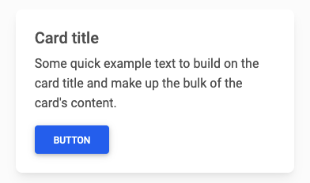
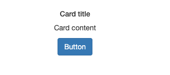
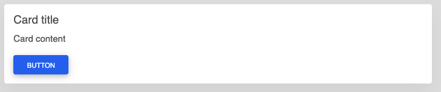
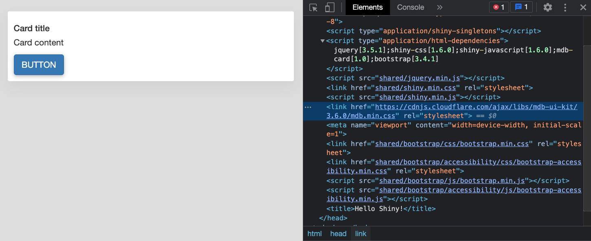
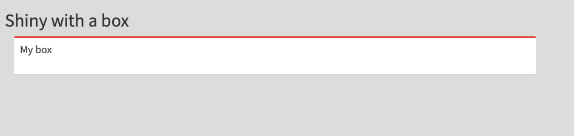
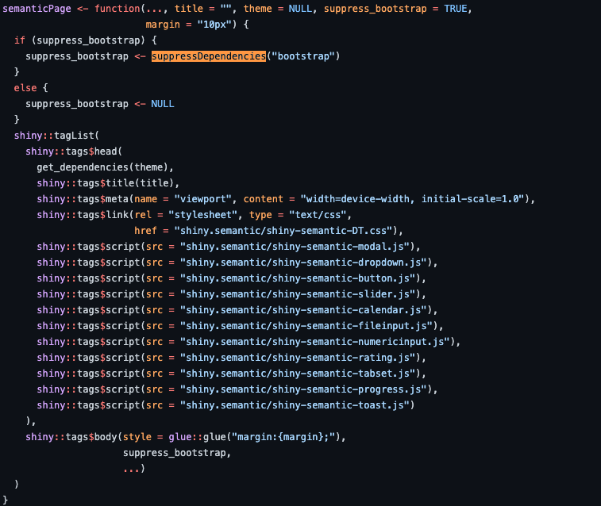

# Handle HTML dependencies with {htmltools} {#htmltools-dependencies}
In this chapter, I'll demonstrate how we can utilize `{htmltools}` [@R-htmltools] to manage web __dependencies__, that is handling CSS and JS code as well as other __assets__ in your Shiny apps. This literally opens the doors to work with almost any web framework and design outstanding user experiences with Shiny in a reasonable amount of time and __reproducible__ manner. 

## Motivations
In this example, we would like to include a Material Bootstrap [card](https://mdbootstrap.com/docs/standard/components/cards/) in a Shiny apps, as shown in Figure \@ref(fig:mdb-card). 

```{r mdb-card, echo=FALSE, fig.cap='Material Bootstrap design card.', out.width='50%', fig.align='center'}

```

The naive approach would be to include the HTML code directly in the app code. `my_card()` creates the card structure:

```{r}
library(shiny)
# we create the card function before
my_card <- function(...) {
  withTags(
    tags$div(
      class = "card",
      tags$div(
        class = "card-body",
        tags$h5(class = "card-title", "Card title"),
        tags$p(class = "card-text", "Card content"),
        tags$button(
          type = "button",
          class = "btn btn-primary",
          "Button"
        )
      )
    )
  )
}
```

Below is a Shiny app example:

```{r, echo=FALSE, results='asis'}
code_chunk(OSUICode::get_example("htmltools/deps/card/ex1"), "r")
```


```{r mdb-card-dirty, echo=FALSE, fig.cap='Attempt to display a Material Bootstrap card without dependencies in a Shiny app.', out.width='50%', fig.align='center'}

```

As depicted by Figure \@ref(fig:mdb-card-dirty), nothing is displayed, which was expected since `{shiny}` [@R-shiny] does not import Bootstrap 4 dependencies. Don't panic! We load the necessary css to display this card (if required, we could include the javascript as well). We could use either `includeCSS()`, `tags$head(tags$link(rel = "stylesheet", type = "text/css", href = "custom.css"))`, as described in the Shiny documentation [here](https://shiny.rstudio.com/articles/css.html). Web development best practices recommend pointing to an external file rather than including CSS in the head or as inline CSS (see Chapter \@ref(beautify-css)). In the below example, we use a __CDN__ (content delivery network), but that could be a local file in the `www/` folder:

```{r, echo=FALSE, results='asis'}
code_chunk(OSUICode::get_example("htmltools/deps/card/ex2"), "r")
```

The card may seem ugly, but at least it is displayed as shown on Figure \@ref(fig:mdb-card-deps). This approach is, however, not easy to share with other developers since there is no way to recover the specific dependency.

```{r mdb-card-deps, echo=FALSE, fig.cap='Material Bootstrap card within a simple app.', out.width='100%'}

```

The best approach actually consists in leveraging the `htmlDependency()` and `attachDependencies()` functions from `{htmltools}`.
`htmlDependency()` takes the following main parameters:

  - A __name__.
  - A __version__ (useful to remember on which version it is built upon).
  - A __path__ to the dependency (can be a CDN or a local folder).
  - __script__ and __stylesheet__ to respectively pass css and scripts.

```{r, eval = FALSE}
# handle dependency
mdb_cdn <- "https://cdnjs.cloudflare.com/ajax/libs/"
mdb_card_dep <- function() {
  htmlDependency(
    name = "mdb-card",
    version = "1.0",
    src = c(href = mdb_cdn),
    stylesheet = "mdb-ui-kit/3.6.0/mdb.min.css"
  )
}
```

If you are not pointing to a CDN and use local files, this is crucial to wrap the newly created dependency in a function since the path has to be determined at run time and not when the package builds. It means that if you are developing a package with dependencies, forgetting this step might prevent other users from getting the dependency working on their own machine (the differences between Unix and Windows OS paths is clearly a good example).

We create the card tag and give it the Material Bootstrap dependency through the `attachDependencies()` function.

::: {.noteblock data-latex=""}
In a recent version of `{htmltools}`, we may simply use `tagList(tag, deps)` instead. Importantly, `attachDependencies()` has an `append` parameter FALSE by default. Ensure to set it to TRUE if you want to keep already attached dependencies.
:::

```{r, eval = FALSE}
# create the card
my_card_with_deps <- function(...) {
  cardTag <- my_card(...)

  # attach dependencies (old way)
  # htmltools::attachDependencies(cardTag, bs4_card_dep())

  # simpler way
  tagList(cardTag, mdb_card_dep())

}

```

We finally run our app:

```{r, echo=FALSE, results='asis'}
code_chunk(OSUICode::get_example("htmltools/deps/card/ex3"), "r")
```

According to Figure \@ref(fig:mdb-card-deps-conflict), something seems to be broken or conflicting. If we look at the developer tools, we realize that the new Material Design stylesheet comes before the Shiny Bootstrap CSS, which is the source of our problems. 

::: {.importantblock data-latex=""}
This raises an important consideration about `htmlDependency()`. Under the hood, Shiny adds many necessary dependencies like Bootstrap and jQuery, and you have no control over where your own dependencies will be inserted. Section \@ref(htmltools-suppress-deps) explains how to seamlessly solve that issue.
:::

```{r mdb-card-deps-conflict, echo=FALSE, fig.cap='Conflict between Material Bootstrap and Bootstrap CSS. ', out.width='100%'}

```

With this approach, you can develop a package of custom dependencies that people
could use when they need to add custom elements in shiny.

## Importing HTML dependencies from other packages {#htmldeps-import}

The `{shinydashboard}` [@R-shinydashboard] package helps to design dashboards with Shiny. In the following, we would like to integrate the box component in a classic Shiny App (without the dashboard layout). However, if you try to include the box tag, you will notice that nothing is displayed since `{shiny}` does not have `{shinydashboard}` dependencies. `{htmltools}` contains a function, namely `findDependencies()` that looks for all dependencies attached to a tag. Before going further, let's define the basic dashboard skeleton:

```{r}
library(shinydashboard)
dashboard_ui <- dashboardPage(
  dashboardHeader(),
  dashboardSidebar(),
  dashboardBody()
)
```

There are numerous details associated with `{shinydashboard}` that we will not go into.
If you are interested in learning more, please [check out the package website](https://rstudio.github.io/shinydashboard/). The key point here is the main wrapper function `dashboardPage()`. The `fluidPage()` is another wrapper function that most are already familiar with. We apply `findDependencies()` on `dashboard_ui`:

```{r, eval=FALSE}
library(htmltools)
dashboard_deps <- findDependencies(dashboard_ui)
dashboard_deps[[1]]
```

```{r, echo=FALSE}
if (knitr::is_html_output()) {
  library(htmltools)
  dashboard_deps <- findDependencies(dashboard_ui)
  dashboard_deps[[1]]
}
```

```{r, echo=FALSE, results='asis'}
code <- 'List of 10
 $ name      : chr "font-awesome"
 $ version   : chr "5.13.0"
 $ src       :List of 1
  ..$ file: chr "www/shared/fontawesome"
 $ meta      : NULL
 $ script    : NULL
 $ stylesheet: chr [1:2] "css/all.min.css" 
 "css/v4-shims.min.css"
 $ head      : NULL
 $ attachment: NULL
 $ package   : chr "shiny"
 $ all_files : logi TRUE
 - attr(*, "class")= chr "html_dependency"'
exclude_from_html(code)
```

For space reasons, we only printed the first dependency output, but `dashboard_deps` is a list containing four dependencies:

  - [Font Awesome](https://fontawesome.com) handles icons. Interestingly, this dependency is provided by `dashboardHeader`, especially the `shiny::icon("bars")` that collapses the left sidebar.
  - [Bootstrap](https://getbootstrap.com/docs/3.3/) is the main HTML/CSS/JS template. Importantly,
please note the version 3.3.7, whereas the current is 4.5.2.
  - [AdminLTE](https://adminlte.io) is the dependency containing HTML/CSS/JS related to the admin template.
It is closely linked to Bootstrap 3.
  - shinydashboard, the CSS and javascript necessary for our dashboard to work properly. In practice,
integrating custom HTML templates to Shiny does not usually work out of the box for many reasons, and some modifications are necessary. For instance, here is a list of [changes](https://github.com/rstudio/shinydashboard/blob/4ac99720653f2295f486734c862e56c82edb5d80/srcjs/AdminLTE/README-shiny-mods.md) to optimize AdminLTE for Shiny. This has major consequences on the template maintenance such that upgrading to another AdminLTE version would require modifying all these elements by hand. You may understand why template maintainers are quite often reluctant to upgrade their dependencies as it might breake the whole package, quite easily.


Below, we attach the dependencies to the `box()` with `tagList()`, as shown above. Notice that our custom `box()` does not contain all parameters as in the official `{shinydashboard}` version, which is actually OK at this time. For a better contrast with the body, we add a custom color to the background,
as depicted by Figure \@ref(fig:shiny-import-box):

```{r}
my_dashboard_box <- function(title, status) {
  tagList(
    box(title = title, status = status), 
    dashboard_deps
  )
}
```

```{r, echo=FALSE, results='asis'}
code_chunk(OSUICode::get_example("htmltools/deps/dashboard"), "r")
```

```{r shiny-import-box, echo=FALSE, fig.cap='AdminLTE2 box inside classic Shiny app.', out.width='100%'}

```

You now have limitless possibilities. Interestingly, the [shinyWidgets](https://github.com/dreamRs/shinyWidgets/blob/5b1fe07eaa13ff9157effaa13187d560d4d97644/R/useBs4Dash.R#L123) `useBs4Dash()` function relies on the same approach.

## Suppress dependencies {#htmltools-suppress-deps}

In rare cases, you may need to remove an existing __conflicting__ dependency. The `suppressDependencies()` function allows users to perform this task. For instance, [shiny.semantic](https://github.com/Appsilon/shiny.semantic/tree/f184da21864db3c39ea5233187400a87df85fb0f) built on top of
semantic ui is not compatible with Bootstrap, the latter being dropped from the list, as illustrated by Figure \@ref(fig:semantic-suppress-bootstrap).

```{r semantic-suppress-bootstrap, echo=FALSE, fig.cap='Deletion of Bootstrap inside semanticPage.', out.width='100%'}

```


Below, we remove the AdminLTE2 dependency
from a `{shinydashboard}` page and nothing is displayed (as expected):

```{r, echo=FALSE, results='asis'}
code_chunk(OSUICode::get_example("htmltools/deps/remove-deps"), "r")
```

## Resolve dependencies {#resolve-dependencies}
Imagine a situation in which we would like to use the very last version of Font Awesome icons, which is currently 5.15.1 according to [jsdelivr](https://www.jsdelivr.com/package/npm/@fortawesome/fontawesome-free). We recall that `{shiny}` already provides version 5.13.0 through the `icon()` function. Including another version would probably cause conflicts, and we would like to avoid that case. `{htmltools}` has a `resolveDependencies()` tool that removes any redundant dependencies, keeping the dependency with the higher version if names are identical:

```{r, eval=FALSE}
jsdelivr_cdn <- "https://cdn.jsdelivr.net/npm/@fortawesome/"
ft_aws <- paste0(jsdelivr_cdn, "fontawesome-free@5.15.1/")
new_icon_dep <- htmlDependency(
  name = "font-awesome",
  version = "5.15.1",
  src = c(href = ft_aws),
  stylesheet = "css/all.min.css"
)

icon_deps <- list(
  new_icon_dep,
  findDependencies(shiny::icon("th"))[[1]]
)

resolveDependencies(icon_deps)
```

```{r, echo=FALSE}
if (knitr::is_html_output()) {
  jsdelivr_cdn <- "https://cdn.jsdelivr.net/npm/@fortawesome/"
  ft_aws <- paste0(jsdelivr_cdn, "fontawesome-free@5.15.1/")
  new_icon_dep <- htmlDependency(
    name = "font-awesome",
    version = "5.15.1",
    src = c(href = ft_aws),
    stylesheet = "css/all.min.css"
  )
  
  icon_deps <- list(
    new_icon_dep,
    findDependencies(shiny::icon("th"))[[1]]
  )
  
  resolveDependencies(icon_deps)
}
```

```{r, echo=FALSE, results='asis'}
code <- '[[1]]
List of 10
 $ name      : chr "font-awesome"
 $ version   : chr "5.15.1"
 $ src       :List of 1
  ..$ href: chr "https://cdn.jsdelivr.net/npm/@fortawesome
  /fontawesome-free@5.15.1/"
 $ meta      : NULL
 $ script    : NULL
 $ stylesheet: chr "css/all.min.css"
 $ head      : NULL
 $ attachment: NULL
 $ package   : NULL
 $ all_files : logi TRUE
 - attr(*, "class")= chr "html_dependency"'
exclude_from_html(code)
```

Combining `findDependencies()`, `suppressDependencies()` and `resolveDependencies()` gives you great power to successfully manage your dependencies!

## Insert Custom script in the head
With `{shinydashboardPlus}`, users can fine-tune their dashboard behavior with a simple option parameter passed to `dashboardPage()`. The `sidebarExpandOnHover` capability that consists of expanding the sidebar when hovering on it, is part of those [options](https://adminlte.io/themes/AdminLTE/documentation/index.html#adminlte-options), yet it is not exposed by `{shinydashboard}`. Under the hood, all those options are gathered in a list, then converted into __JSON__ to eventually generate a JavaScript configuration file. Until now, we only saw two ways to include scripts or stylesheets. How do we include any arbitrary script (defined on the fly by the user when the app starts) in a dependency?

`htmlDependency()` has a `head` parameter allowing passage of any lines of HTML to insert into the document head. We can easily imagine giving it a string containing a script. Below, we first construct the options list. Then, we create the dependency: notice since `src` is mandatory, we have to give it a value, but we will not use `script` nor `stylesheet` arguments.

```{r}
options <- list(
  sidebarExpandOnHover = TRUE,
  boxWidgetSelectors = list(
    remove = '[data-widget="remove"]'
  )
)

config_script <- function(options) {
  htmlDependency(
    "options",
    as.character(utils::packageVersion("shinydashboardPlus")),
    src = c(file = system.file(
      "shinydashboardPlus-2.0.0",
      package = "shinydashboardPlus")
    ),
    head = if (!is.null(options)) {
      paste0(
        "<script>var AdminLTEOptions = ",
        jsonlite::toJSON(
          options,
          auto_unbox = TRUE,
          pretty = TRUE
        ),
        ";</script>"
      )
    }
  )
}

# show the script
print(HTML(config_script(options)$head))
```

We invite the reader to run the example below involving `{shinydashboardPlus}`, open the HTML inspector and look at the head.

```{r, echo=FALSE, results='asis'}
code_chunk(OSUICode::get_example("htmltools/deps/custom"), "r")
```

According the the AdminLTE [documentation](https://adminlte.io/themes/AdminLTE/documentation/index.html#adminlte-options), global options must be passed before loading the `app.min.js` script. Creating this "dummy" dependency allowed us to do so, as shown on Figure \@ref(fig:htmltools-head-deps).


```{r htmltools-head-deps, echo=FALSE, fig.cap='Insert arbitrary script in the head.', out.width='100%'}
knitr::include_graphics("images/htmltools/htmltools-head-deps.png")
```
