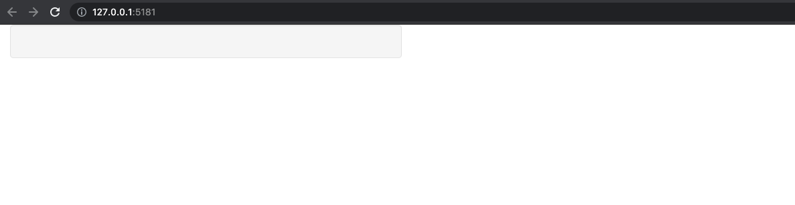

# htmltools overview {#htmltools-overview}

> ... However, if you already know HTML (or want to learn!) you can also work directly with HTML tags to achieve any level of customization you want
`r tufte::quote_footer('--- Hadley Wickham')`

`{htmltools}` [@R-htmltools] is a R package designed to:

  - Generate HTML __tags__ from R.
  - Handle web __dependencies__ (see chapter \@ref(htmltools-dependencies)).

Historically, `{htmltools}` was extracted out of `{shiny}` [@R-shiny] to be able to extend it, that is developing custom HTML tags, importing extra dependencies from the web. That's why, both packages have many common functions! At the moment, `{htmltools}` does not have a user guide, even though it is a key package for all web things!

## Writing HTML Tags from R

`{htmltools}` provides the necessary functions to write HTML tags that were introduced in Chapter \@ref(web-intro-html). In R, it is even more convenient than raw HTML since there is no opening/closing tag, a simple function call instead:

```{r}
library(htmltools)
tag <- div("Hello World")
tag
as.character(tag)
```

Inside the function call, all named elements become __attributes__, whereas unnamed elements become __children__. In some cases, tags may have empty attributes like `<input disabled>`. In that case,
the corresponding R code is `input(disabled = NA)`. Since tag functions produce shiny tags, that is HTML elements, we can capture the HTML output by converting it to a character with `as.character()`, as shown above.

## Notations
If you type `htmltools::tags$` in the R console, you should be suggested the most common available HTML tags, thereby making it fairly easy to switch between HTML and R, as shown Figure \@ref(fig:htmltools-tags)

```{r htmltools-tags, echo=FALSE, fig.cap='htmltools tags builder', out.width='100%'}
knitr::include_graphics("images/htmltools/htmltools-tags.png")
```

However, for convenience, the most commonly used tags like `p`, `h1`, `h2`, `h3`, `h4`, `h5`, `h6`, `a`, `br`, `div`, `span`, `pre`, `code`, `img`, `strong`, `em`, `hr`, ...
are accessible by a simple function call like:

```{r, eval=FALSE}
# good
h1("This is a title")

# correct but not necessary
tags$h1("This is a title")
```

Therefore, whether to use `tags$<TAG_NAME` or `<TAG_NAME>` depends if the tag is exported by default. Since `nav` is not exported, we write:

```{r, eval=FALSE}
# correct
tags$nav("This is the navigation")

# fail
try(nav("This is the navigation"))
```

When building custom templates, you will be writing a lot of tags! It might seem
too much work to always write `tags$<TAG_NAME>`. There exists a function called `withTags()`, such that wrapping your code in this function allows code like this, much
easier to write and read:

```{r, eval=FALSE}
# Better
withTags(
  nav(div(), ul(li(), li()))
)

# instead of 
tags$nav(div(), tags$ul(tags$li(), tags$li()))
```

If you had to gather multiple tags together, choose `tagList()` over `list()`, although the HTML output is the same:

```{r}
# good
tag_list_1 <- tagList(
  p("Some text"),
  div("Content")
)

str(tag_list_1)

# correct but not optimal
tag_list_2 <- list(
  p("Some text"),
  div("Content")
)

str(tag_list_2)
```


The first has the `shiny.tag.list` class in addition to `list`. `{golem}` [@R-golem] allows to test if an R object is a tag list. In this case, using a list would cause the test fail.


## Adding new tags
You may define extra HTML tags with the `tag()` function:

```{r}
customTag <- tag(
  "test", 
  list(class = "test", p("Custom Tag"))
)
str(customTag)
```

```{r, echo=FALSE}
tag_to_string(customTag)
```

Good practice is to check whether the created tag is in line with the HTML validation rules. If you want to check a web page, particularly a Shiny generated HTML page, W3C has an online validation [tool](https://validator.w3.org/). Be careful as, not following this rule will cause the HTML code to be invalid. By default, Shiny complies with all the recommendations, but we suggest you to be careful with any exotic template. 

## Alternative way to write tags
`{htmltools}` comes with the `HTML()` function that you can feed with raw HTML. Below, both code give exactly the same output:

```{r, eval = FALSE}
HTML("<div>Blabla</div>")
div("Blabla")
```

Internally, their classes are different:

```{r}
class(HTML("<div>Blabla</div>"))
class(div("Blabla"))
```

<!-- Why pick one over the other? -->

::: {.importantblock data-latex=""}
Doing so, you will not be able to use tags related functions, as in the next parts.
Therefore, we strongly recommend using R and not mixing HTML in R.
:::
 
Interestingly, if you want to convert raw HTML to R code, there is a Shiny App developed by Alan
Dipert from RStudio, namely [html2R](https://github.com/alandipert/html2r), shown Figure \@ref(fig:htmltools-html2R). Non standard attributes (like `data-toggle`) are not correctly processed but there are [solutions](https://github.com/alandipert/html2r/issues/2). This will save you precious time! A more recent approach is developed in section \@ref(workflow-charpente) and has be internally used to develop some of the RinteRface [templates](https://github.com/RinteRface).

```{r htmltools-html2R, echo=FALSE, fig.cap='Illustration of the html2R App', out.width='100%'}
knitr::include_graphics("images/htmltools/htmltools-html2R.png")
```

By converting HTML to R functions, it's possible to easily parameterize the generated tag.
and reuse it later in the code. It also allows to maintain one single code base (only R), which is much simpler in the long run if the code had to be reviewed by people non familiar with HTML.

## Playing with tags

The ultimate goal of `{htmltools}` is to manipulate, combine and rearrange tags in order to create flexible and rich HTML structures from R. Would you believe that the below example heavily relies on `{htmltools}` (Figure \@ref(fig:shinyRPG))?

```{r shinyRPG, echo=FALSE, fig.cap='shinyRPG was built with htmltools', out.width='50%', fig.align = 'center'}

```

If you want to try out this example, below is the showcase code:

```{r, eval=FALSE}
remotes::install_github("RinteRface/shinyRPG")
library(shinyRPG)
shinyRPGDemo()
```

Before becoming an `{htmltools}` wizard, let's learn the shiny tags fundamentals. 

### Tags structure

A __shiny tag__ is defined by:

  - A __name__ such as span, div, h1 ..., accessed with `tag$name`.
  - Some __attributes__, which can be accessed with `tag$attribs`.
  - __Children__, which can be accessed with `tag$children`.
  - A __class__, namely `shiny.tag`.

For instance:

```{r}
# create the tag
myTag <- div(
  class = "divclass", 
  id = "first",
  h1("My first child!"),
  span(class = "child", id = "baby", "Crying")
)
# access its name
# myTag$name
# access its attributes (id and class)
# myTag$attribs
# access children (returns a list of 2 elements)
# myTag$children
# access its class
str(myTag)
```

```{r, echo=FALSE}
tag_to_string(myTag)
```

How to modify the class of the second child?

```{r}
second_children <- myTag$children[[2]]
second_children$attribs$class <- "adult"
# This is not working ...
```

```{r, echo=FALSE}
tag_to_string(myTag)
```

Why is this not working? By assigning `myTag$children[[2]]` to second_children, `second_children$attribs$class <- "adult"` modifies the class of the copy and not the original object. Thus we do:

```{r}
myTag$children[[2]]$attribs$class <- "adult"
```

```{r, echo=FALSE}
tag_to_string(myTag)
```


### Practical examples: shinyRPG {#htmltools-shinyRPG}

Below we give concrete example on how to customize tags in the real life. There exists a 
nice RPG HTML template, that is [rpgui](http://ronenness.github.io/RPGUI/). It provides
the necessary elements to get started developing nice RPG looking user interfaces, as depicted by Figure \@ref(fig:rpgui-select).

```{r rpgui-select, echo=FALSE, fig.cap='rpgui select input', out.width='100%'}
knitr::include_graphics("images/htmltools/rpgui-select.png")
```

In the following, we consider the select input, which does not have exactly the same 
structure as the original shiny tag. However, it is convenient to reuse the shiny function
to limit our amount of work. We therefore start to write our custom input:

```{r}
rpgSelect <- function(inputId, label, choices, selected = NULL,
                      multiple = FALSE, size = NULL) {
  shiny::selectInput(
    inputId,
    label,
    choices,
    selected,
    multiple,
    selectize = FALSE,
    width = NULL,
    size
  )
}
```

According to the rpgui documentation, a select tag is composed of the following HTML elements:

```html
<select class="rpgui-dropdown">
	<option value="option1">option1</option>
	<option value="option2">option2</option>
	...
</select>
```

Adding a label tag on top of the slider, this is what we would like to get:

```html
<div>
  <label id="variable-label" for="variable">Variable:</label>
  <select 
    id="variable" 
    class="rpgui-dropdown">
    <option value="cyl" selected>Cylinders</option>
    <option value="am">Transmission</option>
    <option value="gear">Gears</option>
  </select>
</div>
```

We compare with our own `rpgSelect` function:

```{r, eval=FALSE}
rpgSelect(
  "variable", 
  "Variable:",
  c("Cylinders" = "cyl",
    "Transmission" = "am",
    "Gears" = "gear")
)
```

```{r, echo=FALSE}
rpgSelect(
  "variable", 
  "Variable:",
  c("Cylinders" = "cyl",
    "Transmission" = "am",
    "Gears" = "gear")
) %>% tag_to_string()
```

As shown in the above output, this is not exactly matching:

  - The outer div should not have any class.
  - The label should not have any class.
  - The input tag is wrapped inside a div container. It should not.
  - The input tag should have the `rpgui-dropdown` or `rpgui-list` class,
  depending on the size value. 
  
To fix the first problem we target the outer tag (`selectTag`), that is the tag returned by our `rpgSelect` function. The second row cleans the label class. The third row removes the extra outer div and only keeps its children, corresponding to the input tag. The last instruction ensure to set the appropriate class, depending on the size value:

```{r, eval=FALSE}
# Modify tag
selectTag$attribs$class <- NULL
# Clean extra label class
selectTag$children[[1]]$attribs$class <- NULL
# Remove extra outer div
selectTag$children[[2]] <- selectTag$children[[2]]$children[[1]]

# Add good class for rppgui binding
selectTag$children[[2]]$attribs$class <- if (is.null(size)) {
  "rpgui-dropdown"
} else {
  "rpgui-list"
}
```

The final version is shown below:

```{r}
rpgSelect <- function(inputId, label, choices, selected = NULL,
                      multiple = FALSE, size = NULL) {
  selectTag <- shiny::selectInput(
    inputId,
    label,
    choices,
    selected,
    multiple,
    selectize = FALSE,
    width = NULL,
    size
  )

  # Modify tag
  selectTag$attribs$class <- NULL
  # Clean extra label class
  selectTag$children[[1]]$attribs$class <- NULL
  # Remove extra outer div
  selectTag$children[[2]] <- selectTag$children[[2]]$children[[1]]

  # Add good class for rppgui binding
  selectTag$children[[2]]$attribs$class <- if (is.null(size)) {
    "rpgui-dropdown"
  } else {
    "rpgui-list"
  }

  selectTag
}
```

This yields:

```{r, echo=FALSE}
rpgSelect(
  "variable", 
  "Variable:",
  c("Cylinders" = "cyl",
    "Transmission" = "am",
    "Gears" = "gear")
) %>% tag_to_string()
```


### Useful functions for tags
As shown in the previous shinyRPG example, adding a class and an id to a tag may be done with:

```{r, eval=FALSE}
tag$attribs$class <- "class"
tag$attribs$id <- "id"
```

These are two lines of code, and believe me, for complex examples, it might be much worse, thereby significantly impairing code readability.
Fortunately, `{htmltools}` provides powerful functions to overcome this issue. Let's review some of them below.

#### Add attributes

`tagAppendAttributes()` adds a new attribute to the current tag. For instance, assuming we created a div without any id attribute:

```{r}
myTag <- div("A tag")
myTag <- tagAppendAttributes(myTag, id = "myid")
```

```{r, echo=FALSE}
tag_to_string(myTag)
```

You can pass as many attributes as you want, including __non-standard__ attributes such as `data-toggle` (see Bootstrap 3 [tabs](https://www.w3schools.com/bootstrap/bootstrap_ref_js_collapse.asp) for instance):

```{r}
myTag <- tagAppendAttributes(
  myTag, 
  `data-toggle` = "tabs", 
  class = "myclass"
)
```

```{r, echo=FALSE}
tag_to_string(myTag)
```

As a reminder, even though correct, the classic approach would requires two steps:

```{r}
myTag$attribs[["data-toggle"]] <- "newValue"
myTag$attribs$class <- "newClass"
```

```{r, echo=FALSE}
tag_to_string(myTag)
```

#### Check if tag has specific attribute

`tagHasAttribute()` checks if a tag has a specific attribute:

```{r}
# I want to know if div has a class
myTag <- div(class = "myclass")
tagHasAttribute(myTag, "class")
```

If you are familiar with `%>%`, the above also works:

```{r}
myTag %>% tagHasAttribute("class")
```

In practice, this function is useful when testing tag elements as shown in chapter \@ref(custom-templates-testing).

#### Get all attributes 

`tagGetAttribute()` gets the targeted attribute's value, if it exists, otherwise NULL:

```{r}
myTag <- div(class = "test")
# returns the class
tagGetAttribute(myTag, "class")
# returns NULL
tagGetAttribute(myTag, "id")
```

#### Set child/children

`tagSetChildren()` creates children for a given tag. For instance:

```{r}
myTag <- div(
  class = "parent", 
  id = "father", 
  "Father!"
)
child <- span("Daughter")
myTag <- tagSetChildren(myTag, child)
```

```{r, echo=FALSE}
tag_to_string(myTag)
```

::: {.warningblock data-latex=""}
`tagSetChildren()` __removes__ all existing children. Below we see another set of functions to add children while conserving existing ones. 
:::

#### Add child or children

`tagAppendChild()` and `tagAppendChildren()` add other tags to an existing tag.
Whereas `tagAppendChild()` only takes one tag, you can pass a list of tags to `tagAppendChildren()`.

```{r}
myTag <- div(class = "parent", "A tag", "Child 1")
otherTag <- span("Child 2")
myTag <- tagAppendChild(myTag, otherTag)
```

```{r, echo=FALSE}
tag_to_string(myTag)
```

#### Build your own functions

You might wonder why there is no `tagRemoveChild` or `tagRemoveAttributes`.
Let's look at the `tagAppendChild`:

```{r, eval = FALSE}
tagAppendChild <- function (tag, child) {
  tag$children[[length(tag$children) + 1]] <- child
  tag
}
```

Below we write the `tagRemoveChild`, where tag is the target and n is the position to remove in the list of children:

```{r}
myTag <- div(class = "parent", span("Hey!"))

# we create the tagRemoveChild function
tagRemoveChild <- function(tag, n) {
  # check if the list is empty
  if (length(tag$children) == 0) {
    stop(paste(tag$name, "does not have any children!"))
  }
  tag$children[n] <- NULL
  tag
}
myTag <- tagRemoveChild(myTag, 1)
```

```{r, echo=FALSE}
tag_to_string(myTag)
```

When defining the `tagRemoveChild`, we choose `[` instead of `[[` to allow to select multiple list elements. Also notice that the function raises an error if the provided tag does not have children. 

The `tagAppendChild()` is not able to insert at a specific position. We could draft the `tagInsertChild` building on top of the base R `append` function:

```{r}
tagInsertChild <- function(tag, child, position) {
  tag$children <- append(tag$children, list(child), position - 1)
  tag
}

res1 <- tagInsertChild(p(span("hello")), a(), 1)
res2 <- tagInsertChild(p(span("hello")), a(), 2)
```

```{r, echo=FALSE}
tag_to_string(res1)
```
```{r, echo=FALSE}
tag_to_string(res2)
```

::: {.noteblock data-latex=""}
As of `{htmltools}` 0.5.2, there is a new `tagInsertChildren` [function](https://rstudio.github.io/htmltools/reference/tagAppendChild.html). 
:::


### Other functions
The [golem](https://github.com/ThinkR-open/golem/blob/dev/inst/utils/golem_utils_ui.R) package written by [thinkr](https://thinkr.fr) contains neat functions to edit your tags. 

Particularly, the `tagRemoveAttributes`:

```{r}
tagRemoveAttributes <- function(tag, ...) {
  attrs <- as.character(list(...))
  for (i in seq_along(attrs)) {
    tag$attribs[[ attrs[i] ]] <- NULL
  }
  tag
}
```

```{r}
myTag <- div(class = "test", id = "coucou", "Hello")
myTag <- tagRemoveAttributes(myTag, "class", "id")
```

```{r, echo=FALSE}
tag_to_string(myTag)
```


### Conditionally set attributes

Sometimes, you only want to set attributes under specific conditions. 

```{r}
my_button <- function(color = NULL) {
  tags$button( 
    style = paste("color:", color),
    p("Hello")
  )
}
```

Calling `my_button()` would give:

```{r, echo=FALSE}
tag_to_string(my_button())
```

This example will not fail but having `style="color: "` is not clean. We may use conditions:

```{r}
my_button <- function(color = NULL) {
  tags$button( 
    style = if (!is.null(color)) paste("color:", color),
    p("Hello")
  )
}
```

Below, we call `my_button("blue")` and `my_button()`:

```{r, echo=FALSE}
tag_to_string(my_button("blue"))
```
```{r, echo=FALSE}
tag_to_string(my_button())
```


In this example, style won't be available if color is not specified.

### Using %>%

While doing a lot of manipulation for a tag, if you don't need to create intermediate
objects, this is a good idea to use `%>%` from [magrittr](https://magrittr.tidyverse.org):

```{r, eval = FALSE}
myTag <- div(class = "cl", h1("Hello")) %>% 
  tagAppendAttributes(id = "myid") %>%
  tagAppendChild(p("some extra text here!"))
```

```{r, echo=FALSE}
tag_to_string(myTag)
```

This is overall easier to follow and read.

### Programmatically create children elements

Assume you want to create a tag with five children inside:

```{r, eval = FALSE}
myTag <- div(
  span(1),
  span(2),
  span(3),
  span(4),
  span(5)
)
```

```{r, echo=FALSE}
myTag <- div(
  span(1),
  span(2),
  span(3),
  span(4),
  span(5)
)
tag_to_string(myTag)
```

The structure is correct but imagine if you had to create 1000 `span()` or fancier tag. The previous approach is not consistent with the __DRY__ programming concept. `lapply()` function will be useful here (or the purrr `map()` family):

```{r, eval = FALSE}
# base R
div(lapply(1:5, function(i) span(i)))
# purrr + %>%
map(1:5, function(i) span(i)) %>% div()
```

```{r, echo=FALSE}
tag_to_string(div(lapply(1:5, function(i) span(i))))
```

## Modern `{htmltools}`

::: {.importantblock data-latex=""}
This section requires basic CSS knowledge, particularly CSS selectors. Please read Chapter \@ref(beautify-css) before going further.  
:::

As of `{htmltools}` 0.5.2, the new `tagQuery()` function makes manipulating shiny tags a real pleasure, in addition to be more efficient. If you know and like jQuery (Chapter \@ref(intro-jquery)), the API is really similar. If you don't know jQuery yet, no problem, we'll see it later in the book!

As a preliminary example, we want to modify the third `span` element from the above example:

```{r}
spans <- div(div(p(), lapply(1:5, function(i) span(i))))
spans$children[[1]]$children[[2]][[3]]$attribs$class <- "test" 
```

```{r, echo=FALSE}
tag_to_string(spans)
```

Below is the new `{htmltools}` approach which leverages `tagQuery()`:
 
```{r}
spans <- div(div(p(), lapply(1:5, function(i) span(i))))
spans <- tagQuery(spans)$
  find("span")$
  filter(function(x, i) i == 3)$
  addAttrs("class" = "amazing-tag")$
  allTags()
```

```{r, echo=FALSE}
tag_to_string(spans)
```

As you may notice, the first approach may lead to poorly written code as soon as the 
tag structure gets more complex. You may easily end up with things like `tag$children[[1]]$children[[2]]$children[[1]]$attribs$class` which is nearly impossible to maintain. 
The second approach is much more human readable, even though not necessarily shorter in this example. 
The biggest advantage is that is does not always depends on the overall tag structure. As an exercise, you may wrap the `span` elements inside another `div` parent:

```{r}
spans <- div(div(p(), div(lapply(1:5, function(i) span(i)))))
spans <- tagQuery(spans)$
  find("span")$
  filter(function(x, i) i == 3)$
  addAttrs("class" = "amazing-tag")$
  allTags()
```

```{r, echo=FALSE}
tag_to_string(spans)
```

The above code still works, while the previous one would require to be updated. See it as a sort of `tidyverse` style for R tags!

Another reason to prefer the new `tagQuery()` API is the substantial performance [gains](https://rstudio.github.io/htmltools/articles/tagQuery.html#performance-1). Interestingly, under the hood, most if not all older `{htmltools}` functions like `tagAppendChildren()` or `tagAppendAttributes()` call the `tagQuery()` API when `.cssSelector` is provided. In practice,
while one can achieve multiple modifications at once with a single `tagQuery()` call, it requires a combination of multiple `tagAppendChildren()`/`tagAppendAttributes()` to reach the same result, thereby leading to less performance. 

Are you ready to become a tag witcher?

### Basics
`tagQuery()` accepts a tag or list of tags as input and returns a data structure containing:

- `$allTags()`: all tags.
- `$selectedTags()`: selected tags, default to `$allTags()`.

As an example:

```{r}
tag_query <- tagQuery(div(p()))
class(tag_query)
tag_query
```

As shown above, the returned result is not a shiny tag. Instead, it is a [R6](https://r6.r-lib.org/articles/Introduction.html) class having methods to handle those tags.

### Query tags

Below is a table summarizing all available query methods. Note that at the time of writing, `tagQuery()` only support simple CSS selectors. For instance, `data-...` selectors are not covered, as well as `,`, `+` and `~`. However, we'll see below there are many options to work around. 

| Method   |     Description     | Example |
|:----------:|:-------------:|
| children | Get all the direct descendants of each selected tag | 
| find     | Get all descendants of each selected tag          | 
| parent   | Get the direct ancestors of each selected tag      | 
| parents  | Get all parents of each selected tag               |  
| siblings | Get all siblings of each selected tag
| filter   | Subset selected tags with CSS selectors or R function |        
| resetSelected   | Reset set of selected tags to the root tag |

According to Figure \@ref(fig:htmltools-query-tags), while `$children()` selects only direct descendants, `$find()` is slightly more powerful and drills down to any level deeper. `$filter()` is convenient to subset selected tags, for instance, depending on a specific attribute. A dedicated section  (\@ref(htmtools-chain-queries)) covers `$resetSelected()` which essentially reset the current selection to the root tag. Whereas `$parent()` allow to go up step by step returning each time the direct ancestor, `$parents()` returns all ancestors. If you need to be even more specific, `$closest(cssSelector)` goes up until it finds the matching `cssSelector`. Note that, if `cssSelector = NULL`, `$closest()` is equivalent to call `$selectedTags()`. 

```{r htmltools-query-tags, echo=FALSE, fig.cap='tagQuery API: overview of query methods.', out.width='100%'}
knitr::include_graphics("images/htmltools/htmltools-query-tags.png")
```

Let's consider an example consisting of a tabset panel with three tabs. Those menu items are one of the most challenging elements to handle when building a custom Shiny template and the new `tagQuery()` literally make it a breeze to handle. A detailed case study is available section \@ref(tabler-navbar-navigation). 

```{r}
temp_tabs <- lapply(1:3, function(i) {
  tabPanel(i, paste("Tab", i))
})
tabs <- bs4Dash::tabsetPanel(.list = temp_tabs)
```


```{r, echo=FALSE}
tag_to_string(tabs)
```

TO DO: describes a bit more the tabset structure

How would you select the third tab content element?

```{r, eval=FALSE}
tagQuery(tabs)$
  find("div.tab-pane")$ # div element with tab-pane class
  filter(function(x, i) tagGetAttribute(x, "data-value") == 3)
```

```{r, echo=FALSE}
tag_to_string(
  tagQuery(tabs)$
  find("div.tab-pane")$ # div element with tab-pane class
  filter(function(x, i) tagGetAttribute(x, "data-value") == 3)$
  selectedTags()
)
```

Note that we provided an anonymous R function to `$filter()`, where x is the tag and i the index, allowing us to drill down to the third tab which has `data-value = 3`. 

As an exercise, I give you 2 minutes to find the classic `{htmltools}` equivalent. If you don't manage, it means the new `tagQuery()` system is rather convenient. 

### Modify tags
As shown in the preliminary example, the main interest of querying tag is to ultimately modify them! 
`tagQuery()` exposes methods to modify attributes, children of the query selection. 

#### Playing with attributes
As shown Figure \@ref(fig:htmltools-modify-attributes), there are currently two main methods to alter tag attributes, namely `$addAttrs()` (equivalent of `tagAppendAttributes`) and `$removeAttrs()`, even though more specific methods exists, for instance `$addClass()`, `$removeClass()` and `$toggleClass()`.

| Method   |     Description     | Example |
|:----------:|:-------------:|
| addAttrs | Add any number of attributes to each selected tag |                     
| removeAttrs  | Remove any number of attributes to each selected tag            | 
| hasAttrs | Check if the selected tag have the specified attribute(s) |
| addClass  | Add any number of new classes to each selected tag          | 
| removeClass  | Remove any number of classes to each selected tag          |
| hasClass | Check if the selected tag have the specified classe(s) |


```{r htmltools-modify-attributes, echo=FALSE, fig.cap='tagQuery API: modify tag attributes.', out.width='100%'}

```

Bootstrap 4 allows to apply a fade [transition](https://getbootstrap.com/docs/4.6/components/navs/#fade-effect) between tabs, provided that those tabs have the `fade` class. Below is how to seamlessly do it with `tagQuery()`:

```{r, eval=FALSE}
tagQuery(tabs)$
  find(".tab-pane")$
  addClass("fade")
```

```{r, echo=FALSE}
tag_to_string(
  tagQuery(tabs)$
  find(".tab-pane")$
  addClass("fade")$
  selectedTags()
)
```

#### Altering tag/children/siblings
Below are listed some methods to alter the current tag or its children, as depicted Figure \@ref(fig:htmltools-alter-tags).

| Method   |     Description     | Example |
|:----------:|:-------------:|
| append | Insert content after the children of each selected tag |                     
| prepend  | Insert content before the children of each selected tag            | 
| empty  | Remove all children from the selected tag |
| remove | Remove all selected tags |
| before | Insert content before each selected tag |
| after | Insert content after each selected tag |
| replaceWith | Replace the currently selected tag by the provided tag |

```{r htmltools-alter-tags, echo=FALSE, fig.cap='tagQuery API: alter tags children.', out.width='100%'}
knitr::include_graphics("images/htmltools/htmltools-alter-tags.png")
```

Going back to our previous tabs example, we would like to include an icon before each tab title. We leverage the `$prepend()` method, after selecting the `a` elements part of the tab navigation:

```{r}
# Add extra item to tabs at the end
new_tabs <- tagQuery(tabs)$
  find("a")$
  prepend(icon("flag"))
```

```{r, echo=FALSE}
tag_to_string(
  new_tabs$selectedTags()
)
```

```{r, eval=FALSE}
ui <- fluidPage(new_tabs$allTags())
server <- function(input, output, session) {}
shinyApp(ui, server)
```

Result is shown Figure \@ref(fig:htmltools-tabs-icons).

```{r htmltools-tabs-icons, echo=FALSE, fig.cap='tagQuery API in action: a customized Shiny tabsetPanel.', out.width='100%'}

```


### Chain tag queries {#htmtools-chain-queries}
One of the strength of the `tagQuery()` API is the ability to chain methods, where the classic `{htmltools}` syntax might be repetitive and heavy. `$resetSelected()` allows to reset the tag selection to the root tag after a given operation, thereby making it possible to chain multiple queries with different purposes. The overall flow is more human readable than a step by step approach, similarly to the `tidyverse` or `ggplot` grammar. Let's combine all previous examples:

```{r}
# add fade class to all panels
tagQuery(tabs)$
  find(".tab-pane")$
  addClass("fade")$
  removeClass("active")$
  filter(function(x, i) tagGetAttribute(x, "data-value") == 3)$
  addClass("active")$
  resetSelected()$
  # new operation: add icon before each nav link title
  find("a")$
  prepend(icon("flag"))$
  # Here the next operation use the same target
  # We don't need to reset the scope
  removeClass("active")$
  # Select third nav link
  filter(function(x, i) tagGetAttribute(x, "data-value") == 3)$
  # Make it active
  addClass("active")$
  allTags()
```


### Specific cases
There are situations where the previous methods won't work. What if you want to modify all
tabs content from `Tab i` to `This is tab i`. A common mistake would be to proceed as follows:

```{r, eval=FALSE}
tagQuery(tabs)$
  find(".tab-pane")$
  empty()$
  append(lapply(1:3, function(i) paste("This is tab", i)))
```

```{r, echo=FALSE}
tag_to_string(
  tagQuery(tabs)$
  find(".tab-pane")$
  empty()$
  append(lapply(1:3, function(i) paste("This is tab", i)))$
  selectedTags()
)
```

You may think it will add each text to the corresponding panel item but methods like `$append()` and `$prepend()` add the same elements. Therefore it will actually adds three new children to each selected panel. For this case where the content is index specific, we have to utilize `$each()`. It takes an anonymous function as input, with two parameters, x is the tag and i is the current index. Inside that function, you may edit the tag depending on the index and return the modified structure:

```{r, eval=FALSE}
tagQuery(tabs)$
  find(".tab-pane")$
  empty()$
  each(function(x, i) {
    # replace text
    x <- tagAppendChildren(x, paste("This is tab", i))
    # return edited tag
    x
  })
```

```{r, echo=FALSE}
tag_to_string(
  tagQuery(tabs)$
  find(".tab-pane")$
  empty()$
  each(function(x, i) {
    # replace text
    x <- tagAppendChildren(x, paste("This is tab", i))
    # return edited tag
    x
  })$
  selectedTags()
)
```

### Practice

Let's rewrite the shinyRPG select (see \@ref(htmltools-shinyRPG)) input using the new `tagQuery()` API. As a reminder, the function is given by:

```{r}
rpgSelect <- function(inputId, label, choices, selected = NULL,
                      multiple = FALSE, size = NULL) {
  selectTag <- shiny::selectInput(
    inputId,
    label,
    choices,
    selected,
    multiple,
    selectize = FALSE,
    width = NULL,
    size
  )

  # Modify tag
  selectTag$attribs$class <- NULL
  # Clean extra label class
  selectTag$children[[1]]$attribs$class <- NULL
  # Remove extra outer div
  selectTag$children[[2]] <- selectTag$children[[2]]$children[[1]]

  # Add good class for rppgui binding
  selectTag$children[[2]]$attribs$class <- if (is.null(size)) {
    "rpgui-dropdown"
  } else {
    "rpgui-list"
  }

  selectTag
}
```

The new approach is described below and leverages almost all the `tagQuery()` API tools. We first remove the outer div class and the label class with `$removeAttrs()`. These two steps don't need any reset since the label is a child of the outer div. The next step, that is targeting the select element requires to use `$siblings()` to catch the `div` parent followed by a `$children()`, which will capture the select (interestingly, we could also have reset the selection with `$resetSelected()` and apply `$find()`). We add it a custom class with `$addClass()`. We finally go back to the parent outer `div` with `$resetSelected()` and apply `$each()` to replace the inner `div` by its children. 

```{r}
rpgSelect <- function(inputId, label, choices, selected = NULL,
                      multiple = FALSE, size = NULL) {
  selectTag <- shiny::selectInput(
    inputId,
    label,
    choices,
    selected,
    multiple,
    selectize = FALSE,
    width = NULL,
    size
  )
  
  selectClass <- if (is.null(size)) { # add class
    "rpgui-dropdown"
  } else {
    "rpgui-list"
  }
  
  tagQuery(selectTag)$
    removeAttrs("class")$ # remove outer div class
    find(".control-label")$
    removeAttrs("class")$ # remove class from child label
    siblings()$ # go down to the div 
    children()$ # go down to the select tag
    addClass(selectClass)$ # add class to child select
    resetSelected()$# go back to div parent
    each(function(x, i) {
      x$children[[2]] <- x$children[[2]]$children
    })$ # replace div parent 
    allTags()
}
```

### Alter tag rendering
In this section, we'll see what is probably one of the most advanced `{htmltools}` feature, recently introduced in 0.5.2. How would you render a tag differently depending on different conditions, like external options, specific theme version, ...?

For instance, assume you want to create development specific tags, that only appear in Shiny `dev` mode:

```{r}
devmode(TRUE)
getOption("shiny.devmode")
```

Then we create our custom tag with the `.renderHook` parameter available for `{htmltools}` tag element, providing a function (`hook`) that will be called upon tag rendering:

```{r}
customTag <- span("", .renderHook = function(x) {
  if (getOption("shiny.devmode")) {
    tagAppendAttributes(
      x, 
      style=
      "color: red; 
      border-style: dashed;
      border-color: blue;"
    )
  } 
})
```

```{r, echo=FALSE}
tag_to_string(customTag)
```

Note that if the tag already has any existing hook, `tagAddRenderHook()` adds another hook to the current list. An option controls whether to erase existing hooks.

```{r}
customTag <- tagAddRenderHook(customTag, function(x) {
  if (getOption("shiny.devmode")) {
    tagAppendChildren(x, "UNDER REWORK")
  } 
})
```

The hooks list is accessible with:

```{r}
customTag$.renderHooks
# Remove first hook
# customTag$.renderHooks[[1]] <- NULL
```

which is convenient to remove previous hooks. 

Let's try it in a Shiny app with the `dev` mode enabled:

```{r, eval=FALSE}
ui <- fluidPage(
  sidebarLayout(
    sidebarPanel(customTag),
    mainPanel(customTag)
  )
)
server <- function(input, output, session) {}
shinyApp(ui, server)
```

We disable the `dev` mode:

```{r, eval=FALSE}
devmode(devmode = FALSE)
getOption("shiny.devmode")
shinyApp(ui, server)
```

The result is shown Figure \@ref(fig:htmltools-renderHook).

```{r htmltools-renderHook, echo=FALSE, fig.show = "hold", out.width = "50%", fig.align = "default", fig.cap="tagAddRenderHook in action. Left: Shiny dev mode enabled; right: Shiny dev mode disabled."}


```

In Chapter \@ref(bslib-renderHook) we'll discuss another use case, which is about theme-dependent rendering, that is for instance, render a tag differently whether Shiny is in Bootstrap 3 or Bootstrap 4 mode. 