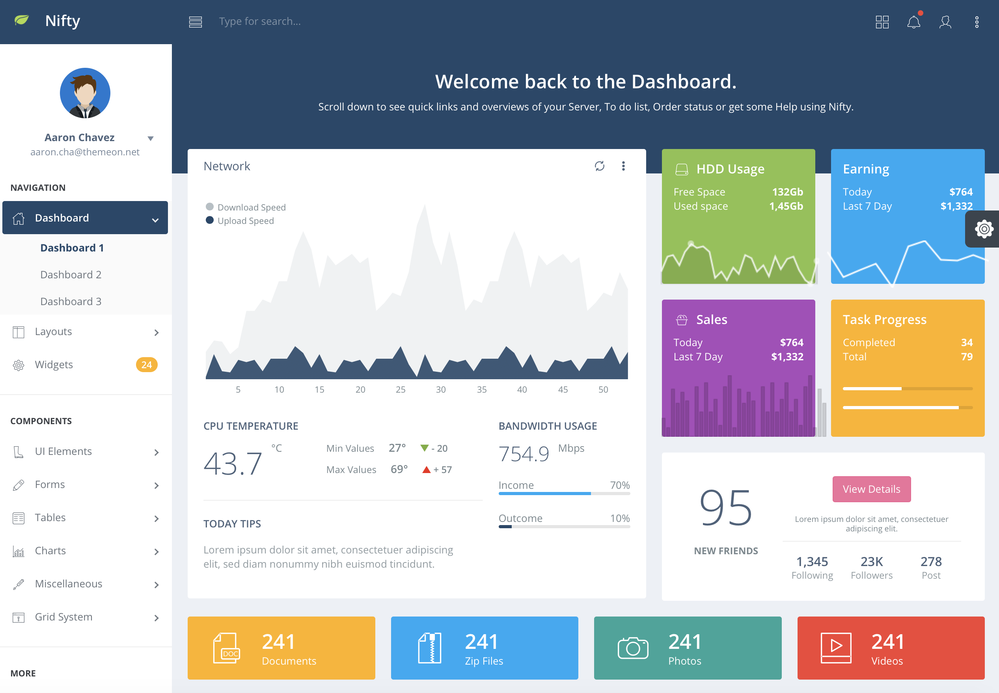
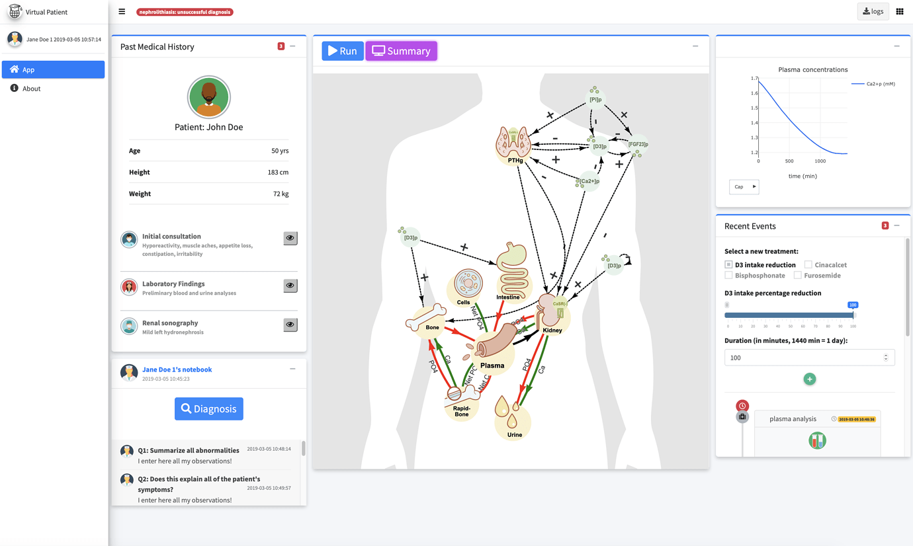

--- 
title: "Outstanding User Interfaces with Shiny"
author: "David Granjon"
date: "`r Sys.Date()`"
documentclass: krantz
bibliography: [book.bib, packages.bib]
biblio-style: apalike
fontsize: 10pt
monofont: "Source Code Pro"
monofontoptions: "Scale=0.7"
link-citations: yes
colorlinks: yes
lot: yes
lof: yes
site: bookdown::bookdown_site
output:
  - bookdown::gitbook
  - rmarkdown::md_document
description: "A book about deeply customizing Shiny app for production."
favicon: images/favicon.ico
github-repo: DivadNojnarg/outstanding-shiny-ui
graphics: yes
nocite: '@*'
always_allow_html: true
---

```{r echo=FALSE}
box_args <- function(
  vrulecolor = 'white',
  hrule = c('\\abLongLine', '\\abShortLine', ''),
  title = '', vrulewidth = '0pt',
  icon = 'Bomb', iconcolor = 'black'
) {
  hrule <- match.arg(hrule)
  sprintf(
    '[%s][%s][\\textbf{%s}]{%s}{\\fa%s}{%s}',
    vrulecolor, hrule, title, vrulewidth, icon, iconcolor
  )
}
```

# Welcome {-}

This book is still under active development and intended for a 2021 Q2 release in the [R Series](https://www.routledge.com/go/the-r-series) by Chapman
& Hall.


## Is this book for me? {-}

Before going further, the reader must:

  - Be comfortable with basic R structures and concepts, functional and object oriented programming ([R6](https://r6.r-lib.org/))
  - Have solid knowledge of [Shiny](https://mastering-shiny.org)
  
  
Basic knowledge in HTML and JavaScript is a plus but not mandatory.

If you fulfill the above prerequisites, you should read this book if you answer yes to the one of following questions:

  - Do you want to know how to develop shiny apps with a more professional look and feel?
  - Have you ever wondered how to design new input widgets to unleash interactivity?
  - Do you want to better handle JS and CSS in your apps?
  - How may I develop a mobile friendly template for Shiny?
  - How may I include React in my shiny apps?
  - Are you simply curious about what happens under the hood?
  

## Learning objectives {-}

This book will help you to:
 
  - Understand how Shiny deals with the classic web development standards and what are the main differences.
  - Manipulate Shiny tags from R to create custom layouts.
  - Harness the power of CSS and JavaScript to quickly design apps standing out from the pack.
  - Discover the steps to import and convert existing web frameworks like [Bootstrap 4](https://getbootstrap.com/), [framework7](https://framework7.io/)
  - Learn how Shiny internally deals with inputs.
  - Learn more about less documented Shiny mechanisms (websockets, sessions, ...).
  

## Why another Shiny related book? {#why-this-book}

There are various Shiny focused resources introducing [basic](https://shiny.rstudio.com/tutorial/) as well as advanced topics such as [modules](https://shiny.rstudio.com/articles/#modules) and [Javascript/R](https://js4shiny.com) interactions, however, handling advanced user interfaces design was never an emphasis. Clients often desire custom templates, yet this generally exceeds core features of Shiny (not out of the box). 

Generally, R App developers lack a significant background in web development and often find this requirement overwhelming. It was this sentiment that motivated writing this book, namely to provide readers the necessary knowledge to extend Shiny's layout, input widgets and output elements. This project officially started at the end of 2018 but was stopped when Joe Cheng revealed the upcoming [Mastering Shiny Book](https://mastering-shiny.org). Fortunately, the later, does not cover a lot about the customization of Shiny user interfaces. Besides, this book may constitute a good complement to the work in progress [Engineering Production-Grade Shiny Apps](https://engineering-shiny.org) by the ThinkR team, where the link between Shiny and CSS/JavaScript is covered. For a deep dive into JavaScript and R interactions, the [upcoming book](https://javascript-for-r.com/) by John Coene covers topics like htmlWidgets, interactive documents and computations.

## Book structure {-}

This book is organized into seven parts:

  - Part 1 demonstrates the link between Shiny and the classic web languages like HTML, CSS and JavaScript. We gradually introduce some of the necessary web development knowledge to be able to read the book. We explore the web dependencies behind Shiny such as Bootstrap and jQuery. We dive into the `{htmltools}` [@R-htmltools] package, providing functions to create and manipulate HTML tags from R as well as manage web dependencies. 
  - Part 2 focuses on CSS and Sass. We provide the reader with basic CSS knowledge to get the most out of Sass, a powerful tool to seamlessly alter Shiny apps style, in a more reproducible manner. All along this part, we showcase examples from the R community like `{fresh}` [@R-fresh] and `{bslib}` [@R-bslib], to significantly beautify apps with only few lines of code. 
  - Part 3 contains chapters dedicated to the Shiny input system. This part starts with a JavaScript hands on, then exposes how Shiny works under the hood by introducing the websockets which allows the communication between R and JavaScript. We explore the Shiny input life cycle, that is how they are created and updated. We expose JS techniques to get rid of unnecessary `renderUI` patterns that may speed up Shiny apps. This part contains many hidden gems to significantly and quickly enhance apps.
  - Part 4 focuses on the development of a new template for Shiny by demonstrating examples from the `{tablerDash}` [@R-tablerDash] package. These, and more may be explored further as part of the [RinteRface](https://rinterface.com/) project. This case study mobilizes all knowledge acquired in the previous parts. 
  - Part 5 introduces a new opinionated package, `{charpente}` [@R-charpente], that substantially reduce the burden of JavaScript management during the development of Shiny extensions. 
  - Part 6 dives into mobile web development through a practical study involving a rework of `{shinyMobile}` [@R-shinyMobile]. We give a brief introduction to the progressive web application world with some patterns to get started like service workers, web manifests,
offline pages.
  - Part 7 exposes other alternatives like React, taking examples from the `{reactR}` [@R-reactR] package.


Parts are sorted by difficulty level, the last one being the most technical. However, this does not mean the reader
must read all chapters. Given the very heterogeneous background of the community, some people may focus on the JavaScript section, while
others will read the Sass part or the mobile development examples. Some patterns exposed in this book may apply
to classic Shiny apps projects, that are not necessarily meant to extend Shiny per se, but may need a highly customized experience.
Beyond the aesthetic aspect, this book tries to expose best practices to develop optimized shiny apps!

By the end of that book, the reader should be able to entirely customize Shiny in a reasonable amount of time. 
  
## Code structure {#welcome-code-structure}
This book has a side package containing all the necessary material to run the code without having to reload each previous snippet.

```{r, eval=FALSE}
remotes::install_github("DivadNojnarg/outstanding-shiny-ui-code
")
```

It covers Chapters \@ref(shiny-input-system), \@ref(shiny-custom-handler) and the whole Practice section.

There is another good reason for this package: provide a robust method to bundle JavaScript/CSS code along side any shiny app. Indeed, it is quite tempting to proceed as below:

```{r, eval=FALSE}
ui <- fluidPage(
  tags$script(
    "$(function() {
      Shiny.addCustomMessageHandler('hello', function(message) {     
        alert(message); 
      });
    });
    "
  ),
  actionButton("go", "Send")
)

server <- function(input, output, session) {
  observeEvent(input$go, {
    session$sendCustomMessage("hello", message = "plop")
  })
}

shinyApp(ui, server)
```

It is fine if the app purpose is a simple demonstration. In our case, since we aim at providing reusable template elements, we need a better approach, that will be described later.

## Preliminary exercices {-}
Before starting with technical details, we propose to play a little game. Among all the images shown, what are the ones corresponding to shiny apps?

```{r shiny-guess2, echo=FALSE, fig.show = "hold", out.width = "50%", fig.align = "default"}


```

```{r shiny-guess3, echo=FALSE, fig.show = "hold", out.width = "50%", fig.align = "default"}
knitr::include_graphics("images/intro/covid-tracker.png")
knitr::include_graphics("images/intro/tabler.png")
```


## Extra material {-}

This book may serve as material for workshops. See below a list of recent events.

### e-Rum 2020 {-}
[Novartis](https://www.novartis.com) associates Mustapha Larbaoui and David Granjon gave a workshop entitled "Advanced User Interfaces for Shiny Developers" at the latest 2020 virtual [e-Rum](https://2020.erum.io/program/workshops/) conference whose detailed agenda is available [here](https://github.com/Novartis/Advanced-User-Interfaces-for-Shiny-Developers). This two hours workshop takes a lot of inspiration on this book. An [RStudio Cloud](https://rstudio.cloud) dedicated project is deployed [here](https://rstudio.cloud/project/1395473) and slides are located [here](https://rinterface.com/shiny/talks/eRum2020/dg/index.html).

### R/Pharma 2020 {-}
This books served as resource for the 2020 [R/Pharma](https://rinpharma.com/workshops/) **Unleash Shiny** workshop held by John Coene, Colin Fay and David Granjon. Slides are available [here](https://rinterface.com/shiny/talks/RPharma2020/) and exercises accessible from [here](https://github.com/RinteRface/Unleash-Shiny). This workshop expects an higher level than the e-Rum one.

## About RinteRface {-}
The [RinteRface](https://rinterface.com/) project is an initiative aiming to provide one of the most famous HTML [templates](https://github.com/RinteRface) to Shiny. Everything started by the collaboration of [John Coene](https://john-coene.com/) and [David Granjon](https://divadnojnarg.github.io/) early 2018 on `{shinybulma}` [@R-shinybulma] to officially release RinteRface November 2018 with `{shinydashboardPlus}` [@R-shinydashboardPlus], `{bs4Dash}` [@R-bs4Dash] as line-up packages.

```{r rinterface-release, echo=FALSE, fig.cap='Official release of RinteRface, November 28 2018', out.width='100%'}
knitr::include_graphics("images/intro/rinterface_release.png")
```

The biggest RinteRface accomplishment is probably the work in progress `{shinyMobile}` package, which was initially called `{shinyF7}`, in collaboration with the [dreamRs](https://www.dreamrs.fr/) team.

Since 2019, RinteRface has been involved in various R related events like local R meetups or conferences ([Zurich R User Group](https://www.meetup.com/fr-FR/Zurich-R-User-Group/), [baselR](https://www.meetup.com/BaselR/), [useR2019](https://user2019.r-project.org/), [satRdayNeuchatel2020](https://neuchatel2020.satrdays.org/), [e-Rum2020](https://2020.erum.io/), [RPharma2020](https://rinpharma.com/)).

RinteRface is a contributor in the [Shiny Developers Series](https://shinydevseries.com/post/episode-4-rinterface/), hosted by Eric Nantz, also known as the [theRcast
](https://r-podcast.org/).

RinteRface work has been awarded several times at the 2 latest shiny contests (2019 and 2020), through contributions like:

  - A virtual [lab](https://community.rstudio.com/t/shiny-contest-submission-a-virtual-lab-for-teaching-physiology/25348) for teaching physiology (2019), the Apps.Physiol [plateform](https://rinterface.com/AppsPhysiol.html), fuelled by `{bs4Dash}` and hosted in `{CaPO4Sim}` [@R-CaPO4Sim]

```{r virtual-patient, echo=FALSE, fig.cap='The virtual patient simulator of {CaPO4Sim}', out.width='100%'}
knitr::include_graphics("images/intro/virtual_patient_mobile.png")
```
  
  - `{deminR}` [@R-deminR], a [minesweeper](https://community.rstudio.com/t/deminr-a-minesweeper-for-r-2020-shiny-contest-submission/56356) for R (2020), powered by `{shinyMobile}`
  
```{r deminR, echo=FALSE, fig.cap='{deminR}, a minesweeper for R', out.width='100%'}
knitr::include_graphics("images/intro/deminR_light.png")
```

RinteRface is very grateful to the R community and this book is a sort of acknowledgment! 

## Acknowledgements {-}
- I am very grateful to Douglas Robinson for proof reading the book and fixing many typos it contained
- A special thanks to my friends John and Victor for contributing to [RinteRface](https://rinterface.com/)
- Thanks to the eRum organizers for inviting me to the virtual [e-Rum2020](https://2020.erum.io) conference
- RinteRface and this book won't exist without the amazing R community. Thanks for their valuable feedback


## Packages {-}
```{r, echo=FALSE}
pkgs <- c(
  "shiny",
  "shinydashboard",
  "htmltools",
  "purrr",
  "magrittr",
  "ggplot2",
  "thematic",
  "fresh",
  "testthat",
  "jstools",
  "scales",
  "dplyr",
  "apexcharter",
  "shinyWidgets",
  "charpente",
  "bs4Dash",
  "shinyMobile",
  "shinybulma",
  "deminR",
  "CaPO4Sim",
  "shinydashboardPlus",
  "golem",
  "tablerDash",
  "blogdown",
  "httpuv",
  "websocket",
  "bslib",
  "reactR",
  "shinyjs",
  "jsonlite",
  "httpuv",
  "sass",
  "httr",
  "shinylogs",
  "waiter"
)

for (pkg in pkgs) {
  suppressPackageStartupMessages({
    suppressWarnings({
      library(pkg, warn.conflicts = FALSE, character.only = TRUE)
    })
  })
}
```

This book was built with `r R.version.string` and the following packages:

```{r, echo = FALSE, results="asis"}
# Creates a nice table for package list. Thanks @Hadley Wickham
pkgs <- sessioninfo::package_info(pkgs, dependencies = FALSE)
df <- tibble(
  package = pkgs$package,
  version = pkgs$ondiskversion,
  source = gsub("@", "\\\\@", pkgs$source)
)
knitr::kable(df, format = "markdown")
```

```{r, setup, include=FALSE}
# automatically create a bib database for R packages
knitr::write_bib(c(
  .packages(), 'bookdown', 'knitr', 'rmarkdown'
), 'packages.bib')
```
