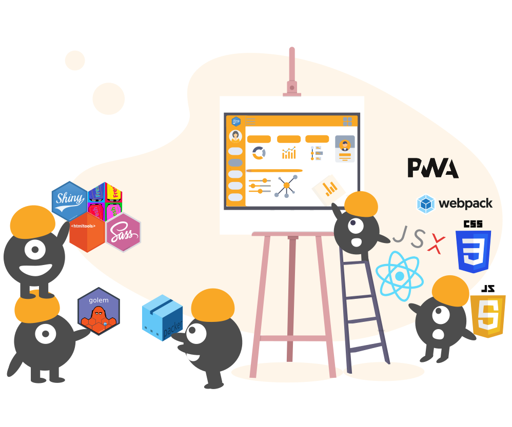

--- 
title: "Outstanding User Interfaces with Shiny"
author: "David Granjon"
date: "`r Sys.Date()`"
documentclass: krantz
classoption: krantz2, openany
bibliography: [book.bib, packages.bib]
biblio-style: apalike
fontsize: 10pt
monofontoptions: "Scale=0.7"
link-citations: yes
colorlinks: yes
site: bookdown::bookdown_site
output:
  - bookdown::gitbook
  - rmarkdown::md_document
description: "A book about deeply customizing Shiny app for production."
github-repo: DivadNojnarg/outstanding-shiny-ui
graphics: yes
nocite: '@*'
always_allow_html: true
cover-image: https://raw.githubusercontent.com/DivadNojnarg/outstanding-shiny-ui/master/images/intro/crc-press-cover.svg
---

```{r, include=FALSE}
options(tinytex.verbose = TRUE)
```

```{r echo=FALSE}
box_args <- function(
  vrulecolor = 'white',
  hrule = c('\\abLongLine', '\\abShortLine', ''),
  title = '', vrulewidth = '0pt',
  icon = 'Bomb', iconcolor = 'black'
) {
  hrule <- match.arg(hrule)
  sprintf(
    '[%s][%s][\\textbf{%s}]{%s}{\\fa%s}{%s}',
    vrulecolor, hrule, title, vrulewidth, icon, iconcolor
  )
}

def.chunk.hook  <- knitr::knit_hooks$get("chunk")
knitr::knit_hooks$set(chunk = function(x, options) {
  x <- def.chunk.hook(x, options)
  ifelse(options$size != "normalsize", paste0("\n \\", options$size,"\n\n", x, "\n\n \\normalsize"), x)
})
```

# Welcome {-}

<style>
img.left {
float: left;
margin-right: 1em;
}
</style>



`r if (knitr::is_html_output()) '
This book is the result of three years of spare time work and passion about the open source R Shiny world. It is under final development and intended for a 2022 Q2 release in the [R Series](https://www.routledge.com/go/the-r-series) by Chapman
& Hall. The author warmly thanks CRC Press for allowing this online version to remain free and accessible to everyone. 
'`

## Is this book for me? {-}

You are an experienced Shiny user and you want to learn more about the underlying web technologies so that you can quickly customize your apps. Good news: basic knowledge in __HTML__, __CSS__ and __JavaScript__ is a plus but not mandatory.

If you fulfill the above prerequisites, you should read this book if you have already asked one of the following questions:

  - How to develop Shiny apps with a more __professional__ look and feel?
  - How to design new input widgets to unleash __interactivity__?
  - How to better handle JS and CSS in Shiny apps?
  - How to develop a __mobile__-friendly template for Shiny?
  - How to include __React__ in Shiny apps?
  

## Learning objectives {-}

This book will help you to:
 
  - Understand how Shiny deals with the classic __web development__ standards and what are the main differences.
  - Manipulate HTML __tags__ from R to create custom __layouts__.
  - Harness the power of CSS and JavaScript to quickly design apps standing out from the pack.
  - Discover the steps to import and convert existing web frameworks like [Bootstrap 4](https://getbootstrap.com/) and [framework7](https://framework7.io/).
  - Learn how Shiny internally deals with inputs.
  - Learn more about less-documented Shiny mechanisms (websockets, sessions, ...).
  

## Book structure {-}

This book is organized into seven parts:

  - Part 1 demonstrates the link between Shiny and the classic web technologies like HTML, CSS and JavaScript. Some of the necessary web development knowledge are gradually introduced, to be able to read the book. We explore the web dependencies behind Shiny such as Bootstrap and jQuery. We dive into the `{htmltools}` [@R-htmltools] package, providing functions to create and manipulate HTML tags from R as well as manage web dependencies. 
  
  - Part 2 focuses on cascading stylesheets (CSS) and Sass (Syntactically Awesome Style Sheets). We provide the reader with basic CSS knowledge to get the most out of Sass, a powerful tool to seamlessly alter Shiny apps's style in a more reproducible manner. All along this part, we showcase examples from the R community like `{fresh}` [@R-fresh] and `{bslib}` [@R-bslib], to significantly beautify apps with only few lines of code. 
  
  - Part 3 contains chapters dedicated to the Shiny input system. This part starts with a JavaScript hands-on, then exposes how Shiny works under the hood by introducing the websockets, which allows the communication between R and JavaScript. We explore the Shiny input life cycle, that is, how they are created and updated. We expose JS techniques to get rid of unnecessary `renderUI` patterns that may speed up Shiny apps. This part contains many hidden gems to significantly and quickly enhance apps.
  
  - Part 4 focuses on the development of a new template for Shiny by demonstrating examples from the `{tablerDash}` [@R-tablerDash] package. These, and more, may be explored further as part of the [RinteRface](https://rinterface.com/) project. This case study mobilizes all knowledge acquired in the previous parts. 
  
  - Part 5 introduces a new opinionated package, `{charpente}` [@R-charpente], that substantially reduces the burden of JavaScript management during the development of Shiny extensions. 
  
  - Part 6 dives into mobile web development through a practical study involving a rework of `{shinyMobile}` [@R-shinyMobile]. We give a brief introduction to the progressive web application world with some patterns to get started like service workers, web manifests,
offline pages.

  - Part 7 exposes other alternatives like React, taking examples from the `{reactR}` [@R-reactR] package. Chapter \@ref(going-further-webdev) presents a novel approach to develop Shiny apps leveraging modern web development tools like webpack or the JSX syntax, where the UI is JavaScript-driven and computations are mostly done on the server side (R). We finally suggest further directions to definitely master the development of beautiful and optimized user interfaces with Shiny. 


Parts are sorted by difficulty level, the last one being the most technical. However, this does not mean the reader
must read all chapters. Given the very heterogeneous background of the community, some people may focus on the JavaScript section, while others will read the Sass part or the mobile development examples. Some patterns exposed in this book may apply to classic Shiny apps projects, that are not necessarily meant to extend Shiny per se, but may need a highly customized experience.
Beyond the aesthetic aspect, this book tries to expose best practices to develop __optimized__ shiny apps.

By the end of that book, the reader should be able to entirely customize any Shiny app in a reasonable amount of time. 
  
## Code structure {#welcome-code-structure .unnumbered}
This book has a side package containing all the necessary material to run the code without having to reload each previous snippet.

```{r, eval=FALSE}
remotes::install_github("DivadNojnarg/OSUICode")
library(OSUICode)
```

## About RinteRface {-}
The [RinteRface](https://rinterface.com/) project is an initiative aiming to provide one of the most famous HTML [templates](https://github.com/RinteRface) to Shiny. Everything started with the collaboration of [John Coene](https://john-coene.com/) and [David Granjon](https://divadnojnarg.github.io/) in early 2018 on `{shinybulma}` [@R-shinybulma] to the official release of RinteRface in November 2018 with `{shinydashboardPlus}` [@R-shinydashboardPlus], `{bs4Dash}` [@R-bs4Dash] as line-up packages.

The biggest RinteRface accomplishment is probably the work-in-progress `{shinyMobile}` package, which was initially called `{shinyF7}`, in collaboration with the [dreamRs](https://www.dreamrs.fr/) team.

Since 2019, RinteRface has been involved in various R-related events like local R meetups or conferences ([Zurich R User Group](https://www.meetup.com/fr-FR/Zurich-R-User-Group/), [baselR](https://www.meetup.com/BaselR/), [useR2019](https://user2019.r-project.org/), [satRdayNeuchatel2020](https://neuchatel2020.satrdays.org/), [e-Rum2020](https://2020.erum.io/), [RPharma2020](https://rinpharma.com/)).

RinteRface is a contributor in the [Shiny Developers Series](https://shinydevseries.com/post/episode-4-rinterface/), hosted by Eric Nantz, also known as the [theRcast
](https://r-podcast.org/).

RinteRface work has been awarded several times at the two latest Shiny contests (2019 and 2020), through contributions like:

  - A virtual [lab](https://community.rstudio.com/t/shiny-contest-submission-a-virtual-lab-for-teaching-physiology/25348) for teaching physiology (2019), the Apps.Physiol [platform](https://rinterface.com/AppsPhysiol.html), fueled by `{bs4Dash}` and hosted in `{CaPO4Sim}` [@R-CaPO4Sim]

```{r virtual-patient, echo=FALSE, fig.cap='{CaPO4Sim}: a virtual patient simulator.', out.width='100%'}
knitr::include_graphics("images/intro/virtual_patient_mobile.png")
```
  
  - `{deminR}` [@R-deminR], a [minesweeper](https://community.rstudio.com/t/deminr-a-minesweeper-for-r-2020-shiny-contest-submission/56356) for R (2020), powered by `{shinyMobile}`
  
```{r deminR, echo=FALSE, fig.cap='{deminR}, a minesweeper for R.', out.width='100%'}
knitr::include_graphics("images/intro/deminR_light.png")
```

RinteRface is very grateful to the R community, and this book is a sort of acknowledgment.

## Acknowledgements {-}
- I'd like to warmly thank all CRC reviewers: [Emily Riederer](https://emilyriederer.netlify.app/), [Barret Schloerke](http://schloerke.com/) and [Eric Nantz](https://shinydevseries.com/authors/admin/) for their valuable comments and help. 
- My eternal gratitude to Barret Schloerke for spending hours to get Github Actions working and deploying all app examples in this book (>= 100).
- [Howard Baek](http://insidethetv.rbind.io/) for testing almost all chapters. Howard was the perfect book target with good knowledge in Shiny and beginner level in web development. 
- Many thanks to [Hadley Wickham](http://hadley.nz/) for his general thoughts about the book organization. This was really helpful to reorder the content. 
- I am very grateful to Douglas Robinson for proof reading the first book manuscript and fixing many typos it contained.
- A special thanks to my friends John and Victor for contributing to [RinteRface](https://rinterface.com/).
- Thanks to the ThinkR team: Diane, Margot, Cervan, Colin, Sébastien and Vincent for providing material support during most of the RinteRface workshops.  
- RinteRface and this book won't exist without the amazing R community. Thanks for their valuable feedback.
- The front cover was designed using the amazing [undraw](https://undraw.co/) open source illustration library. Many thanks to [Katerina Limpitsouni](https://twitter.com/ninaLimpi) for making this possible. 

## Packages {-}
```{r, echo=FALSE}
pkgs <- c(
  "OSUICode",
  "shiny",
  "shinydashboard",
  "htmltools",
  "purrr",
  "magrittr",
  "ggplot2",
  "thematic",
  "fresh",
  "testthat",
  "jstools",
  "scales",
  "dplyr",
  "apexcharter",
  "shinyWidgets",
  "charpente",
  "bs4Dash",
  "shinyMobile",
  "shinybulma",
  "deminR",
  "CaPO4Sim",
  "shinydashboardPlus",
  "golem",
  "tablerDash",
  "blogdown",
  "httpuv",
  "websocket",
  "bslib",
  "reactR",
  "shinyjs",
  "jsonlite",
  "httpuv",
  "sass",
  "httr",
  "shinylogs",
  "waiter",
  "shiny.router",
  "blaze",
  "brochure",
  "shiny.fluent",
  "shiny.react",
  "packer",
  "deSolve"
)

for (pkg in pkgs) {
  suppressPackageStartupMessages({
    suppressWarnings({
      library(pkg, warn.conflicts = FALSE, character.only = TRUE)
    })
  })
}
```

This book was written with `{bookdown}` [@R-bookdown] in the [RStudio](https://www.rstudio.com/products/rstudio/download/) desktop and [VSCode](https://code.visualstudio.com/) IDEs. The website is hosted by RinteRface, and all apps are automatically deployed at each commit by a specific Github Actions [workflow](https://github.com/DivadNojnarg/outstanding-shiny-ui/blob/48262eebad957c7586ad87d7989be8dbb0632655/.github/workflows/deploy_apps.yaml).
This book was built with `r R.version.string` and the following packages:

```{r, echo = FALSE, results="asis"}
# Creates a nice table for package list. Thanks @Hadley Wickham
pkgs <- sessioninfo::package_info(pkgs, dependencies = FALSE)
df <- tibble(
  package = pkgs$package,
  version = pkgs$ondiskversion,
  source = gsub("@", "\\\\@", pkgs$source)
)
knitr::kable(df, format = "markdown")
```

```{r, setup, include=FALSE, warning=FALSE}
library(knitr)
library(htmltools)
# automatically create a bib database for R packages
knitr::write_bib(c(
  .packages(), 'bookdown', 'knitr', 'rmarkdown'
), 'packages.bib')

# Limit output with like str()
options(width = 50)

# Show R console output instead of embedding the HTML
#if (knitr::is_html_output()) {
  registerS3method(
    "knit_print", "shiny.tag",
    getS3method("print", "shiny.tag")
  )
  registerS3method(
    "knit_print", "shiny.tag.list",
    getS3method("print", "shiny.tag.list")
  )
  registerS3method(
    "knit_print", "html",
    getS3method("print", "html")
  )
#}

knitr::opts_chunk$set(
  collapse = FALSE,
  comment = "#>",
  size = "scriptsize"
)

# Programmatically create code chunks
code_chunk <- function(output, language = "r"){
  cat(paste0("```", language, "\n"))
  cat(output)
  cat("\n```\n")
}

# exclude from html output
exclude_from_html <- function(output, language="") {
  if (!knitr::is_html_output()) {
    # Add \n to first element to be able to replace by \n#>
    output <- paste0("\n", output)
    # Replace all \n by \n#> so that each line starts by #>
    output <- gsub(pattern = "\n", "\n#>  ", output)
    # prevents new line for first element
    output <- sub("\n", "", output)
    code_chunk(output, language)
  }
}


code_chunk_custom <- function(output, language="") {
  cat("\\scriptsize\n\n")
  cat(paste0("```", language, "\n"))
  cat(output)
  cat("\n```\n\n")
  cat("\\normalsize\n\n")
}  

```
