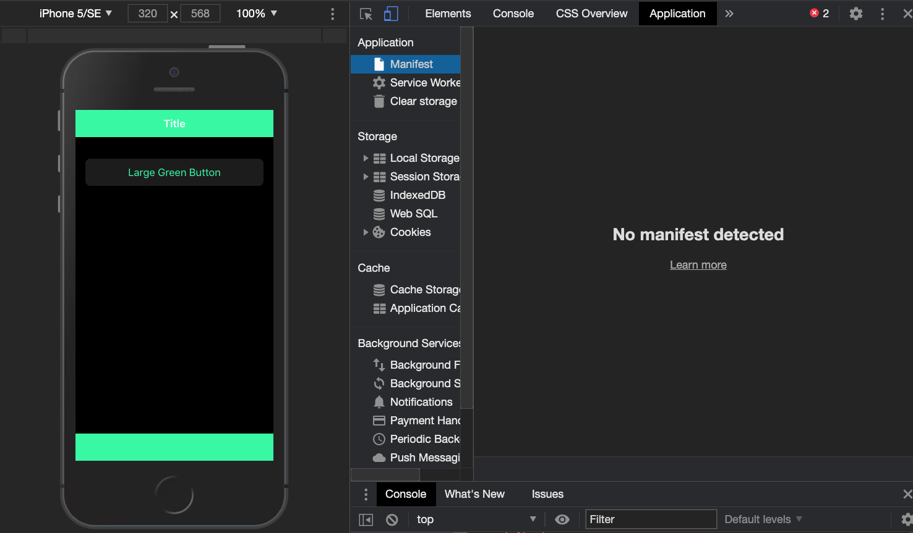
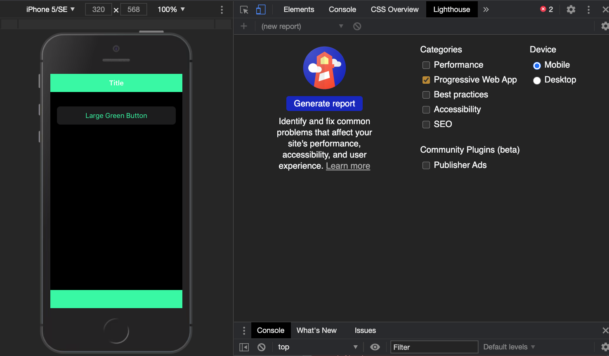
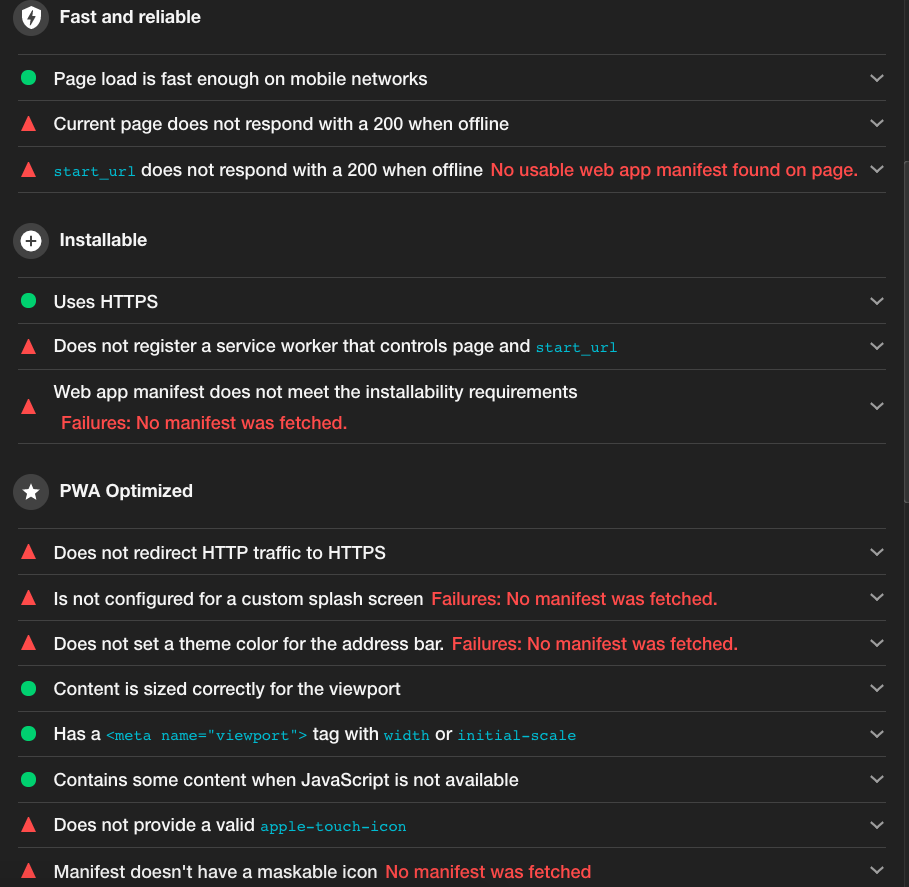
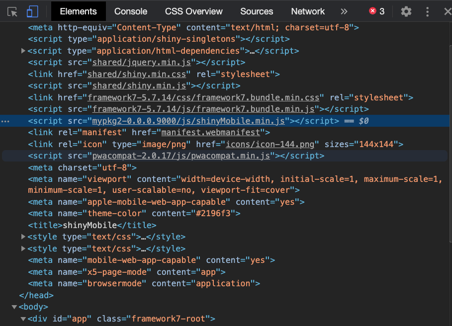
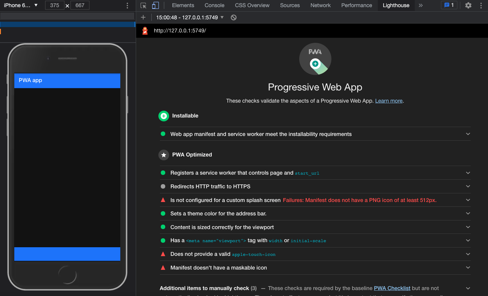
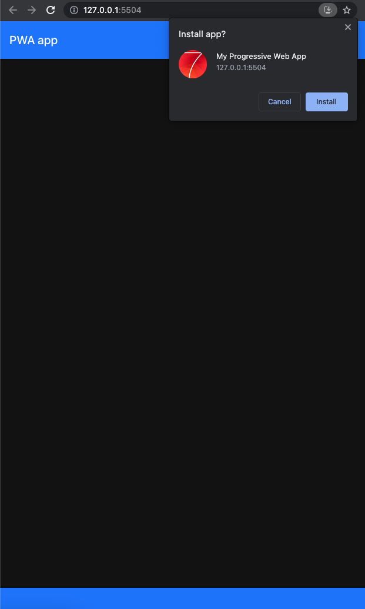
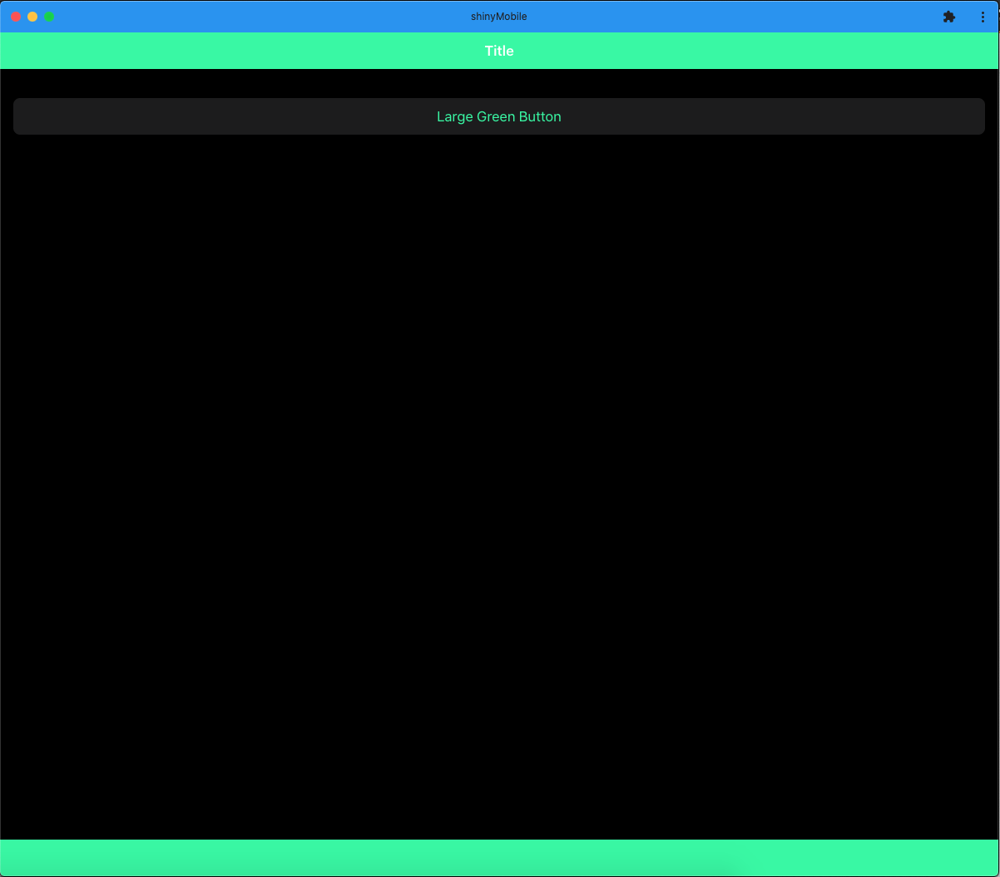
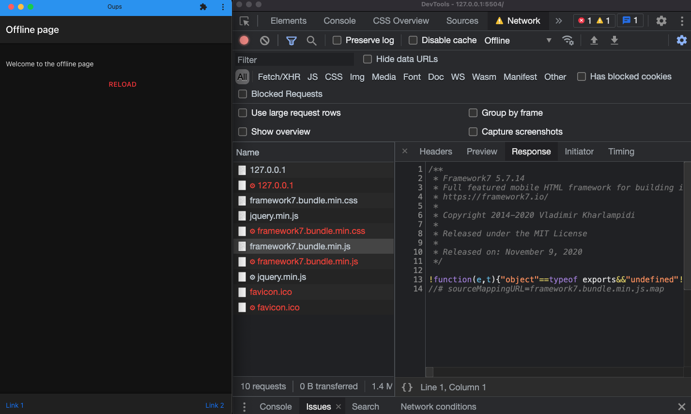

# `{shinyMobile}` and PWA {#mobile-pwa}
Transforming a classic Shiny app into a __PWA__ is a game changer for end users. By the end of this chapter, you'll be able to provide top notch features for your shiny apps like:

  - Add a __fullscreen__ support.
  - Make them __installable__.
  - Support __offline__ capabilities.

::: {.importantblock data-latex=""}
Some of the PWA features won't work with [iOS](https://medium.com/@firt/progressive-web-apps-on-ios-are-here-d00430dee3a7), like the install prompt.
:::

::: {.warningblock data-latex=""}
As a reminder, the code examples shown throughout this chapter are gathered in the `{OSUICode}` package accessible [here](https://github.com/DivadNojnarg/outstanding-shiny-ui-code), specifically PWA apps are available [here](https://github.com/DivadNojnarg/outstanding-shiny-ui-code/tree/master/inst/shinyMobile/pwa). 
:::

## Introduction

Below, we review one by one the necessary steps to convert a shiny app to a __PWA__. To get a good idea of what our mission exactly is, we leverage the `Application` tab of the developer tools as shown on Figure \@ref(fig:mobile-pwa-1). Alternatively, one
may use the [Google Lighthouse](https://developers.google.com/web/tools/lighthouse/) utility to provide a general diagnosis to the app, as illustrated on Figure \@ref(fig:mobile-pwa-2). There are many categories like __performance__, __accessibility__. In our case, let's just select the PWA category, check the mobile device radio and click on generate a report.

```{r mobile-pwa-1, echo=FALSE, fig.cap='Application tab of the developers tools', out.width='100%', fig.align = "center"}

```

```{r mobile-pwa-2, echo=FALSE, fig.cap='Google Lightouse utility', out.width='100%', fig.align = "center"}

```

According to the diagnostic result displayed on Figure \@ref(fig:mobile-pwa-lighthouse-result), we don't meet all requirements, most importantly there is:

  - No __manifest__.
  - No __service worker__.
  - No icons. 
  - No offline fallback.

```{r mobile-pwa-lighthouse-result, echo=FALSE, fig.cap='Lighthouse audit result', out.width='100%'}

```

## `{charpente}` and PWA tools

`{charpente}` has tools to help design a PWA, particularly the `set_pwa()` function which does all the previously mentioned steps in only one line of code. There are however a few prerequisites:

  - The app must __belong to a package__. However, if you followed the previous chapter, this is already the case. 
  - The function must target the app directory.
  
Let's create a `inst/examples/pwa-app` sub-folder and the `app.R` file:

```{r, eval=FALSE}
library(shiny)
library(shinyMobile)

ui <- f7_page(
  navbar = f7_navbar("PWA App"),
  toolbar = f7_toolbar(),
  title = "shinyMobile"
)

server <- function(input, output, session) {}
shinyApp(ui, server)
```

Then we set the PWA configuration with `set_pwa()`. Overall, this function generates a `manifest.webmanifest` file, downloads the Google PWA compatibility script, adds a custom dependency pointing to the `manifest.webmanifest` file and a `144x144` icon file, copies a boilerplate `service-worker.js` with its `offline.html` page and optionally registers the service worker (whose code is borrowed from [web.dev](https://web.dev/offline-fallback-page/#registering-the-service-worker)):

```js
window.addEventListener('load', () => {
  if ('serviceWorker' in navigator) {
    var pathname = window.location.pathname;
    navigator.serviceWorker
      .register(pathname + 'service-worker.js', { scope: pathname})
      .then(function() { console.log('Service Worker Registered'); });
  };
});
```

In the `{shinyMobile}` case, as Framework7 already registers any provided __service
worker__, we don't need that initialization script. Therefore, to skip the creation 
of `sw-register.js` and importing it in `main.js`, we should actually call:

```{r, eval=FALSE}
set_pwa("inst/examples/pwa-app", register_service_worker = FALSE)
```

Importantly, this function does not handle icon creation. There are tools such as 
[appsco](https://appsco.pe/developer/splash-screens) and 
[app-manifest](https://app-manifest.firebaseapp.com), to create 
those custom icons and splash screens, if you need to.

In the following, we provide more detail about the mentioned steps.

### Create the manifest
We would like to create a __JSON__ configuration file like this:

```js
{
  "short_name": "My App",
  "name": "Super amazing app",
  "description": "This app is just mind blowing",
  "icons": [
    {
      "src": "icons/icon.png",
      "type": "image/png",
      "sizes": "192x192"
    }
    // ...
  ],
  "start_url": "<APP_URL>",
  "background_color": "#3367D6",
  "display": "standalone",
  "scope": "/",
  "theme_color": "#3367D6",
  "shortcuts": [
    {
      "name": "Open toast",
      "short_name": "Shortcut",
      "description": "Do something",
      "url": "<APP_URL>/...",
      "icons": [{ "src": "icons/shortcut.png", "sizes": "192x192" }]
    }
  ]
}
```

This file has to be accessible by the app, hence best practice is to put it in the `/www` folder, 
icon images being hosted in the `/www/icons` sub-directory. The `{charpente}` `create_manifest()` function writes a JSON file at the provided location.
Interestingly the `shortcuts` fields gives the ability to start the app in a specific state, so that end users save time. This feature is only supported by latest Android devices as well as up to date Windows 10 computers (no Apple support). In practice, the shortcut url can be processed by `shiny::parseQueryString` on the server side. For instance, if the url contains a query string like `https://domain/path/?foo=1`, we could show a notification:

```{r, eval=FALSE}
observeEvent(session$clientData$url_search, {
  query <- parseQueryString(session$clientData$url_search)
  req(length(query) > 0)
  # Ways of accessing the values
  if (as.numeric(query$foo) == 1) {
    f7_notif(text = "Plop")
  }
})
```

The web manifest and icons have to be included in the `head` before the Google PWA compatibility script:

```html
<link rel="manifest" href="manifest.webmanifest" />
<!-- include icon also from manifest -->
<link rel="icon" type="image/png" 
  href="icons/icon-144.png" sizes="144x144" />
```


`set_pwa()` internally calls `create_pwa_dependency()` which creates an HTML __dependency__ containing all necessary resources:

```{r, eval=FALSE}
#' PWA dependencies utils
#'
#' @description This function attaches PWA manifest and icons to the given tag
#'
#' @param tag Element to attach the dependencies.
#'
#' @importFrom utils packageVersion
#' @importFrom htmltools tagList htmlDependency
#' @export
add_pwa_deps <- function(tag) {
 pwa_deps <- htmlDependency(
  name = "pwa-utils",
  version = packageVersion("shinyMobile"),
  src = c(file = "shinyMobile-0.0.0.9000"),
  head = "<link rel=\"manifest\" 
    href=\"manifest.webmanifest\"/>
    <link rel=\"icon\" type=\"image/png\" 
    href=\"icons/icon-144.png\" sizes=\"144x144\" />",
  package = "mypkg2",
 )
 tagList(tag, pwa_deps)
}
```

In practice, since the package already relies on other dependencies like Framework7, we will leverage the `add_dependencies()` function to add all dependencies at once. 

::: {.noteblock data-latex=""}
All provided icons must follow the convention `icon-<size_in_px>.png` like
 `icon-144.png`, which is the default.
:::

### Google PWA compatibility
As we use the Google PWA compatibility script, we have to include at least one icon 
like `<link rel="icon" type="image/png" href="res/icon-128.png" sizes="128x128" />`. 
However, we found some discrepancies between the developer tools recommendations and the 
PWA compatibility script. Therefore, we recommend to follow the developer tools prescriptions, that
is to include at least one icon of size 144x144. All other elements are generated by the script itself, 
which is convenient. Indeed, having to handle all possible screen sizes and different OS is particularly
tricky, repetitive, and not interesting.

The HTML dependency is downloaded with `create_dependency("pwacompat", options = charpente_options(bundle = FALSE))`.
Don't forget to update the `add_dependencies()` call in `f7_page()` by including the two new dependencies, that is `pwa` and `pwacompat`:

```{r, eval=FALSE}
f7_page <- function(..., navbar, toolbar, title = NULL, 
                    options = NULL) {

  # Config tag (unchanged)

  # Body tag (unchanged)

  tagList(
    tags$head(
      # Head content (unchanged)
    ),
    add_dependencies(
      body_tag,
      deps = c("framework7", "shinyMobile", "pwa", "pwacompat")
    )
  )
}
```

Calling `devtools::load_all()` and running the app again, you should see the new dependencies
in the `head` (Figure \@ref(fig:mobile-pwa-deps)).

```{r mobile-pwa-deps, echo=FALSE, fig.cap='New PWA dependencies in the head tag.', out.width='100%'}

```

Yet, according to Figure \@ref(fig:mobile-pwa-missing-sw), we still miss the __service worker__,
as shown in the manifest diagnostic. This demonstrates how powerful are the developer tools as
the end user is always guided step by step.

```{r mobile-pwa-missing-sw, echo=FALSE, fig.cap='Missing service worker registration.', out.width='100%'}
knitr::include_graphics("images/mobile/mobile-pwa-missing-sw.png")
```

### Service worker and offline page
The second mandatory step to make our app installable is the __service worker__.
We borrowed and modified the code from [web.dev](https://web.dev/offline-fallback-page/). `set_pwa()` copies this code in the the provided app `/www` folder:

```js
// Incrementing OFFLINE_VERSION will kick off the install 
// event and force previously cached resources to be 
// updated from the network.
const OFFLINE_VERSION = 1;
const CACHE_NAME = "offline";
// Customize this with a different URL if needed.
const OFFLINE_URL = "offline.html";

self.addEventListener("install", (event) => {
  // Install logic
});

self.addEventListener("activate", (event) => {
  // Activate logic
});

self.addEventListener("fetch", (event) => {
  // Fetch logic
});
```

This service worker is composed of three steps, which we succinctly describe below.

#### Installation
During the __installation__ step, the cache is initialized and assets like HTML page (`offline.html`), CSS, JS, images are asynchronously cached. Assets's respective path is taken from the server location, for instance, Framework7 assets are located in `framework7-5.7.14/...` and jQuery assets in `shared/`. Best practice is to look at the developer tools `Source` tab which provides the right location. 

```js
self.addEventListener("install", (event) => {
  event.waitUntil(
    (async () => {
      const cache = await caches.open(CACHE_NAME);
      await cache.add(new Request(OFFLINE_URL, { cache: "reload" }));
      // Cache other assets ...
    })()
  );
  // Force the waiting service worker to become 
  // the active service worker.
  self.skipWaiting();
});
```

#### Activation
This step ensures that the service worker boots. As the service worker boot-up time may be delayed (until 0.5s), the navigation preload [feature](https://developers.google.com/web/updates/2017/02/navigation-preload) guaranties to have reasonable performances by making network request in parallel of the booting process. In sum, don't touch this code!

```js
self.addEventListener("activate", (event) => {
  event.waitUntil(
    (async () => {
      // Enable navigation preload if it's supported.
      // Speeds up 
      if ("navigationPreload" in self.registration) {
        await self.registration.navigationPreload.enable();
      }
    })()
  );

  // Tell the active service worker to take control of 
  // the page immediately.
  self.clients.claim();
});
```

#### Fetch
Once active, the service worker intercepts all network requests sent by the client and returns answers according to a predefined strategy. Here we set the "network first" strategy, meaning we always try to return an answer from the network and fall back to the cache if the request failed (for instance in case of missing internet connection). In the above code, there are two kind of requests: __navigation__, that is related to an HTML page and Other requests corresponding to static assets like CSS or JS. Therefore, we have an `if` and `else` statement to consider those two cases. If you would like to know more about caching strategies please refer to the Google documentation: https://developers.google.com/web/tools/workbox/modules/workbox-strategies. 

```js
// Fix service-worker bug
if (event.request.cache === 'only-if-cached') return;

// We only want to call event.respondWith() if this 
// is a navigation request for an HTML page ...
if (event.request.mode === "navigate") {
  // Navigation request
} else {
  // Other requests
}
```

Below is the navigation request logic, that is what will be triggered each time an end-user points to your app. As stated above, if the navigation preload is available, we return the preload response. If not, the request is fetched. In case of failure, we fallback to the offline HTML page, cached during the installation step.  

```js
// Navigation request logic
event.respondWith(
  (async () => {
    try {
      // First, try to use the navigation preload response 
      // if it's supported.
      const preloadResponse = await event.preloadResponse;
      if (preloadResponse) {
        return preloadResponse;
      }

      // Always try the network first.
      const networkResponse = await fetch(event.request);
      return networkResponse;
    } catch (error) {
      console.log("Returning offline page instead.", error);

      const cache = await caches.open(CACHE_NAME);
      const cachedResponse = await cache.match(OFFLINE_URL);
      return cachedResponse;
    }
  })()
);
```

All other requests are handled in the `else` statement. The logic remains the same. We first try to get assets from the network and fallback to the cache upon error, that is for instance in offline mode. 
  
```js
// Other requests
event.respondWith(
  (async () => {
    try {
      // Always try the network first.
      const networkResponse = await fetch(event.request);
      return networkResponse;
      
    } catch (error) {
      
      const cache = await caches.open(CACHE_NAME);
      const cachedResponse = await cache.match(event.request);
      if (cachedResponse) return cachedResponse;
      
    }
  })()
);
```

To sum up, this service worker redirects the end user to the offline cached page (`offline.html`) whenever the app is offline, thereby offering a better user experience. The full code is located [here](https://github.com/DivadNojnarg/outstanding-shiny-ui-code/blob/5bc49eab9496696a06da3f62d6aaf8ef468cdad4/inst/shinyMobile/pwa/www/service-worker.js).

::: {.importantblock data-latex=""}
We strongly advise to keep the same file names. 
:::

#### Registration

The next step involves the service worker __registration__. Framework7 has a dedicated module in the app configuration. We modify the `config` in `helpers_config.js` before initializing the `app` and run `build_js()` to update the minified file:

```js
config.serviceWorker = {
  path: window.location.pathname + 'service-worker.js',
  scope: window.location.pathname
};
```

If the process is successful, you get the result shown in Figure \@ref(fig:mobile-pwa-registered-sw).

```{r mobile-pwa-registered-sw, echo=FALSE, fig.cap='Registered service worker.', out.width='100%'}
knitr::include_graphics("images/mobile/mobile-pwa-registered-sw.png")
```

#### Offline fallback

The new PWA standard imposes to return a valid response when the app is __offline__. The offline page is also copied from `{charpente}` and below is a summarized version:

```html
<!DOCTYPE html>
<html>
  <head>
    <!-- Required meta tags ... -->
    <link 
      rel="stylesheet" 
      href="framework7-5.7.14/css/framework7.bundle.min.css">
  </head>
  <body>
    <div id="app">
      <!-- App content (navbar, toolbar, page, ...) -->
    </div>
    <script type="text/javascript" src="shared/jquery.min.js">
    </script>
    <script 
      type="text/javascript"     
      src="framework7-5.7.14/js/framework7.bundle.min.js">
    </script>
    <!-- Path to your app js -->
    <script>
      var app = new Framework7({ 
        // ...
      });
      // ...
    </script>
  </body>
</html>
```

Notice that jQuery, required for easier DOM interactions, as well as Framework7 CSS and JS assets are cached in the above service worker script, thereby making them
available to `offline.html`. This offline fallback relies on Framework7 for consistency reasons but could be replaced by any other HTML page, keeping in mind the update the service worker. The whole code is stored [here](https://github.com/DivadNojnarg/outstanding-shiny-ui-code/blob/5bc49eab9496696a06da3f62d6aaf8ef468cdad4/inst/shinyMobile/pwa/www/offline.html).

Now, let's audit our app again: congrats! It is __installable__ and reliable, although 
further PWA optimization may be provided. 

```{r mobile-pwa-audit-final, echo=FALSE, fig.cap='Installable shinyMobile app.', out.width='100%'}

```

::: {.importantblock data-latex=""}
A common source of error is the __browser cache__. It is best practice to regularly empty it. Alternatively, one may runs in incognito mode, which does not cache files. 
:::

### Disable PWA for the end user
With the above approach, `{shinyMobile}` will always look for a service worker to register.
Particularly, this would raise an error in case no service worker is found on the server.
What if the user doesn't want to create a PWA, let's say for less important applications? 
We may add a parameter to `f7_page()`, for instance `allowPWA`, that is either `TRUE` or `FALSE`,
store its value in the `body` `data-pwa` attribute.

```{r, eval=FALSE}
f7_page <- function(..., navbar, toolbar, title = NULL,
                    options = shinyMobile_options,
                    allowPWA = TRUE) {

  # ... unchanged

  # create body_tag
  body_tag <- tags$body(
    `data-pwa` = tolower(allowPWA),
    tags$div(
      id = "app",
      # ... unchanged
    )
  )
    
  # ... unchanged
}
```

We recover it on the JS side within `helpers_config.js`:

```js
// check if the app is intended to be a PWA
let isPWA = $('body').attr('data-pwa') === "true";

if (isPWA) {
  config.serviceWorker = {
    path: window.location.pathname + "service-worker.js",
    scope: window.location.pathname
  };
}

```

It __only__ creates `config.serviceWorker` if the user specified `allowPWA = TRUE`.

## Handle the installation
It is a great opportunity to propose a [custom](https://developers.google.com/web/fundamentals/app-install-banners/native) installation experience. 

::: {.warningblock data-latex=""}
To be able to install the app, make sure to replace `start_url` by the url
 where the app is deployed like `https://dgranjon.shinyapps.io/installable-pwa-app/` for instance.
 Missing that step would cause an issue during the service worker registration.  
:::

We create a new script with `create_js("helpers_pwa")` and export the `setPWA` function:

```js
export const setPWA = (app) => {
  // Install logic
};
```

Once the installation criteria are met, the web browser raises the __beforeinstallprompt__ event, (except
on the iOS platform which is not compatible yet. We add an event listener inside `setPWA`:

```js
let deferredPrompt;
window.addEventListener('beforeinstallprompt', (e) => {
  // Prevent the mini-infobar from appearing on mobile
  e.preventDefault();
  // Stash the event so it can be triggered later.
  deferredPrompt = e;
});
```

This code adds an event listener to the window, prevents it from showing at start with `e.preventDefault` and
captures it in an external variable called `deferredPrompt`. 

The next step comprises the design of our custom piece of UI that will trigger the `prompt` install. We can benefit from the rich Framework7 interface and display
a [toast](https://framework7.io/docs/toast.html) containing an install button. The initialization
is fairly simple, following the pattern `app.<COMPONENT>.create(parameters)`:

```js
// Create custom install UI
let installToast = app.toast.create({
  position: 'center',
  text: `<button 
    id="install-button" 
    class="toast-button button color-green">
    Install
  </button>`
});
```

We give it an id so as to call it later and edit the __beforeinstallprompt__ event listener to show the toast:

```js
let deferredPrompt;
window.addEventListener('beforeinstallprompt', (e) => {
  // Prevent the mini-infobar from appearing on mobile
  e.preventDefault();
  // Stash the event so it can be triggered later.
  deferredPrompt = e;
  // Show install trigger
  installToast.open();
});
```

::: {.noteblock data-latex=""}
With jQuery like `$(window).on('beforeinstallprompt', ...)`, we would capture the event with `e.originalEvent`!
:::

We register a second event listener, which fires on the toast button click. We first close the 
toast, call the `prompt` method on the deferred event and log the result:

```js
app.utils.nextTick(function() {
  $('#install-button').on('click', function() {
    // close install toast
    installToast.close();
    if (!deferredPrompt) {
      // The deferred prompt isn't available.
      return;
    }
    // Show the install prompt.
    deferredPrompt.prompt();
    // Log the result
    deferredPrompt.userChoice.then((result) => {
      console.log('OK', 'userChoice', result);
      // Reset the deferred prompt variable, since
      // prompt() can only be called once.
      deferredPrompt = null;
    });
  });
}, 500);
```

Inside `init.js`, we add our brand new module:

```js
import { setConfig } from './helpers_config.js';
import { setPWA } from './helpers_pwa.js'
// other imports ...
$( document ).ready(function() {
  let config = setConfig();
  // create app instance
  app = new Framework7(config);
  // PWA setup
  setPWA(app);
});
```

We run `build_js()` and deploy the app to shinyapps.io (remember, we must serve the app under HTTPS). Figure \@ref(fig:mobile-pwa-installable)
illustrates the install prompt window that appears to install the app. Once installed, the __beforeinstallprompt__
event does not fire anymore and the app may be launched as a standalone app, for instance on macOSX (Figure \@ref(fig:mobile-pwa-installed)).

```{r mobile-pwa-installable, echo=FALSE, fig.cap='Install prompt window.', out.width='100%'}

```

```{r mobile-pwa-installed, echo=FALSE, fig.cap='Installed PWA on macOSX.', out.width='100%'}

```

On Figure \@ref(fig:mobile-pwa-installed), the blue window color corresponds to the `tags$meta(name = "theme-color", content = "#2196f3")`, passed in the `f7_page()` layout element. Whenever the connection is lost, the redirection occurs to 
the `offline.html` page, as shown on Figure \@ref(fig:mobile-pwa-offline).

```{r mobile-pwa-offline, echo=FALSE, fig.cap='Offline HTML template.', out.width='100%'}

```

The final product may be run with:

```{r, echo=FALSE, results='asis'}
code_chunk(OSUICode::get_example("shinyMobile/pwa"), "r")
```

## Workbox
[Workbox](https://developers.google.com/web/tools/workbox) is a more robust alternative 
to the approach described above with boilerplate code to enable:

  - pre-caching of dependencies like CSS and JS but also images and Google fonts
  to improve performances.
  - Improve offline experience.
  - ...

::: {.importantblock data-latex=""}
This part does not work yet at the time of review submission. 
I'll probably remove it ...
:::

## Other resources
The process described above works perfectly for any Shiny template. The reader may also consider other packages like [{shiny.pwa}](https://github.com/pedrocoutinhosilva/shiny.pwa), that creates a PWA compatible structure at run time, within the app `/www` folder. 
