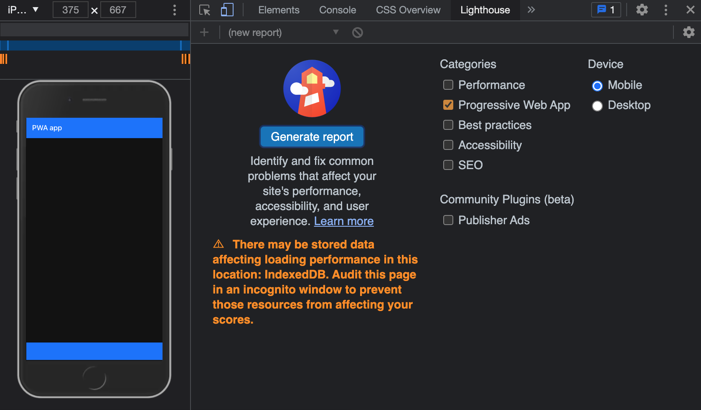

# `{shinyMobile}` and PWA {#mobile-pwa}
Transforming a classic Shiny app into a PWA is a game changer for end users.
The first step is to setup a valid web manifest with icons and favicon.

## Disclaimers
Some of the PWA features won't work with [iOS](https://medium.com/@firt/progressive-web-apps-on-ios-are-here-d00430dee3a7), like the
install prompt. 

## Introduction

Below, we review one by one the steps necessary to convert a shiny app to a PWA.
To get a goo idea of what we exactly miss, we leverage the `Application` tab of the
developer tools.

The overall expected result is shown Figure \@ref(fig:mobile-pwa). Alternatively, one
may use the Google Lighthouse utility to provide a general diagnosis to the app.
There are many categories like performance, accessibility. In our case, let's just select
the PWA category, select the mobile device radio and click on generate a report.

```{r mobile-pwa, echo=FALSE, fig.cap='Application tab of the developers tools', out.width='50%', fig.align = "default", fig.show = "hold"}
knitr::include_graphics("images/mobile/mobile-pwa-application.png")

```

According to the diagnostic result displayed on Figure \@ref(fig:mobile-pwa-lighthouse-result), we miss many elements:

  - No manifest.
  - No service worker.
  - No icons. 

```{r mobile-pwa-lighthouse-result, echo=FALSE, fig.cap='Lighthouse audit result', out.width='100%'}
knitr::include_graphics("images/mobile/mobile-pwa-lighthouse-result.png")
```

## `{charpente}` and PWA tools

`{charpente}` has tools to help designing a PWA. The `set_pwa` function is a wrapper
that does all the previously mentioned step in only one line of code. There are however few
prerequisites:

  - The app must belong to a package.
  - The function must target the app directory.
  
  
As a reminder, the demonstration apps are located within the `inst/examples` folder.
We create the `pwa-app` sub-folder and the `app.R` file:

```{r, eval=FALSE}
library(shiny)
library(shinyMobile)

ui <- f7_page(
  "Test",
  navbar = f7_navbar("Title"),
  toolbar = f7_toolbar(),
  title = "shinyMobile"
)

server <- function(input, output, session) {}
shinyApp(ui, server)
```

Then we set the PWA configuration:

```{r, eval=FALSE}
set_pwa("inst/examples/pwa-app")
```

This function generates a `manifest.webmanifest` file, downloads the Google PWA compatibility
script, adds a custom dependency pointing to the `manifest.webmanifest` file and a `144x144` icon file,
copies a boilerplate `service-worker.js` with its `offline.html` page and optionally registers the
service worker (code borrowed from [web.dev](https://web.dev/offline-fallback-page/#registering-the-service-worker):

```javascript
window.addEventListener('load', () => {
  if ('serviceWorker' in navigator) {
    navigator.serviceWorker.register('service-worker.js');
  };
});
```

In the `{shinyMobile}` case, as Framework7 already registers any linked service
worker, we don't need that initialization script. Therefore, we actually call:

```{r, eval=FALSE}
set_pwa("inst/examples/pwa-app", register_service_worker = FALSE)
```

Importantly, this functions does not handle icon creation. There are tools such as 
[appsco](https://appsco.pe/developer/splash-screens) and 
[app-manifest](https://app-manifest.firebaseapp.com), to create 
those custom icons and splash screens, if you need to.

Below we give more detail

### Create the manifest
We want to create a JSON configuration file like this:

```javascript
{
  "short_name": "My App",
  "name": "Super amazing app",
  "description": "This app is just mind blowing",
  "icons": [
    {
      "src": "icons/icon.png",
      "type": "image/png",
      "sizes": "192x192"
    }
    // ...
  ],
  "start_url": "https://whatever-url.com/",
  "background_color": "#3367D6",
  "display": "standalone",
  "scope": "/",
  "theme_color": "#3367D6"
}
```

This file has to be accessible by the app so best practice is to put it in the `/www` folder.
and images are hosted in a sub-directory `/www/icons`.


The `create_manifest` function is basically writing a JSON file at the provided location:

```{r}
create_manifest <- function(path, name = "My Progressive Web App", shortName = "My App",
                            description = "What it does!", lang = "en-US",
                            startUrl = "/", display = c("minimal-ui", "standalone", "fullscreen", "browser"),
                            background_color = "#ffffff", theme_color = "#ffffff") {

  display <- match.arg(display)

  manifest <- list(
    name = name,
    short_name = shortName,
    description = description,
    lang = lang,
    start_url = startUrl,
    display = display,
    background_color = background_color,
    theme_color = theme_color,
    icons = data.frame(
      src = "icons/icon-144.png",
      sizes = "144x144"
    )
  )

  # create /www folder if does not exist yet
  if (!dir.exists(paste0(path, "/www"))) {
    dir.create(paste0(path, "/www/icons"), recursive = TRUE)
  }
  jsonlite::write_json(
    manifest, 
    path = paste0(path, "/www/manifest.webmanifest"),
    pretty = TRUE,
    auto_unbox = TRUE
  )
  
  ui_done("Web manifest successfully created!")
}
```

The web manifest and icons have to be included in the `head` before the Google PWA compatibility
script:

```html
<link rel="manifest" href="manifest.webmanifest" />
<!-- include icon also from manifest -->
<link rel="icon" type="image/png" href="icons/logo-144.png" sizes="144x144" />
```


`set_pwa` includes a `create_pwa_dependency` function that creates an HTML dependency 
containing all necessary resources:

```{r, eval=FALSE}
#' PWA dependencies utils
#'
#' @description This function attaches PWA manifest and icons to the given tag
#'
#' @param tag Element to attach the dependencies.
#'
#' @importFrom utils packageVersion
#' @importFrom htmltools tagList htmlDependency
#' @export
add_pwa_deps <- function(tag) {
 pwa_deps <- htmlDependency(
  name = "pwa-utils",
  version = packageVersion("shinyMobile"),
  src = c(file = "shinyMobile-0.0.0.9000"),
  head = "<link rel=\"manifest\" href=\"manifest.webmanifest\"  />
<link rel=\"icon\" type=\"image/png\" href=\"icons/icon-144.png\" sizes=\"144x144\" />",
  package = "mypkg2",
 )
 tagList(tag, pwa_deps)
}
```

Importantly, all provided icons must follow the convention `icon-<size_in_px>.png` like
 `icon-144.png`, which is the default.

### Google PWA compatibility
As we use the google PWA compatibility script, we have to include at least one icon 
like `<link rel="icon" type="image/png" href="res/icon-128.png" sizes="128x128" />`. 
However, we found some discrepancies between the developer tools recommendations and the 
PWA compatibility script. We recommend to follow the developer tools prescriptions, that
is to include at least one icon of size 144x144. All other elements are generated by the script itself, 
which is extremely convenient. Indeed, having to handle all possible screen sizes and different OS is particularly
tricky, repetitive and not interesting.

The web manifest included in the `head` in the following order:

```html
<script async src="path/to/pwacompat.min.js"></script>
```

The HTML dependency is downloaded with `create_dependency("pwacompat", options = charpente_options(bundle = FALSE))`.
Don't forget to update the `add_dependencies` list by including the two new dependencies:

```{r, eval=FALSE}
f7_page <- function(..., navbar, toolbar, title = NULL, options = NULL) {

  config_tag <- tags$script(
    type = "application/json",
    `data-for` = "app",
    jsonlite::toJSON(
      x = options,
      auto_unbox = TRUE,
      json_verbatim = TRUE
    )
  )

  # create body_tag
  body_tag <- tags$body(
    tags$div(
      id = "app",
      tags$div(
        class = "view view-main",
        tags$div(
          class = "page",
          navbar,
          toolbar,
          tags$div(
            class = "page-content",
            ...
          )
        )
      )
    ),
    config_tag
  )

  tagList(
    tags$head(
      tags$meta(charset = "utf-8"),
      tags$meta(
        name = "viewport",
        content = "width=device-width, initial-scale=1, maximum-scale=1, minimum-scale=1, user-scalable=no, viewport-fit=cover"
      ),
      tags$meta(
        name = "apple-mobile-web-app-capable",
        content = "yes"
      ),
      tags$meta(
        name = "theme-color",
        content = "#2196f3"
      ),
      tags$title(title)
    ),
    add_dependencies(
      body_tag,
      deps = c("framework7", "shinyMobile", "pwa", "pwacompat")
    )
  )
}
```

If you do `devtools::load_all()` and run the app again, you should see the new dependencies
in the `head` (Figure \@ref(fig:mobile-pwa-deps)).

```{r mobile-pwa-deps, echo=FALSE, fig.cap='New PWA dependencies in the head tag.', out.width='100%'}
knitr::include_graphics("images/mobile/mobile-pwa-deps.png")
```

Yet, according to Figure \@ref(fig:mobile-pwa-missing-sw), we still miss the service worker,
as shown in the manifest diagnostic. This shows how powerful are the developer tools and
the end user is always guided step by step.

```{r mobile-pwa-missing-sw, echo=FALSE, fig.cap='Missing service worker registration.', out.width='100%'}
knitr::include_graphics("images/mobile/mobile-pwa-missing-sw.png")
```

### Service worker and offline page
The second mandatory step to make our app installable is the service worker.
We borrowed the code from [web.dev](https://web.dev/offline-fallback-page/). `set_pwa` copies
this code in the `www` folder of the provided app:

```javascript
/*
Copyright 2015, 2019, 2020 Google LLC. All Rights Reserved.
 Licensed under the Apache License, Version 2.0 (the "License");
 you may not use this file except in compliance with the License.
 You may obtain a copy of the License at
 http://www.apache.org/licenses/LICENSE-2.0
 Unless required by applicable law or agreed to in writing, software
 distributed under the License is distributed on an "AS IS" BASIS,
 WITHOUT WARRANTIES OR CONDITIONS OF ANY KIND, either express or implied.
 See the License for the specific language governing permissions and
 limitations under the License.
*/

// Incrementing OFFLINE_VERSION will kick off the install event and force
// previously cached resources to be updated from the network.
const OFFLINE_VERSION = 1;
const CACHE_NAME = "offline";
// Customize this with a different URL if needed.
const OFFLINE_URL = "offline.html";

self.addEventListener("install", (event) => {
  event.waitUntil(
    (async () => {
      const cache = await caches.open(CACHE_NAME);
      // Setting {cache: 'reload'} in the new request will ensure that the
      // response isn't fulfilled from the HTTP cache; i.e., it will be from
      // the network.
      await cache.add(new Request(OFFLINE_URL, { cache: "reload" }));
    })()
  );
  // Force the waiting service worker to become the active service worker.
  self.skipWaiting();
});

self.addEventListener("activate", (event) => {
  event.waitUntil(
    (async () => {
      // Enable navigation preload if it's supported.
      // See https://developers.google.com/web/updates/2017/02/navigation-preload
      if ("navigationPreload" in self.registration) {
        await self.registration.navigationPreload.enable();
      }
    })()
  );

  // Tell the active service worker to take control of the page immediately.
  self.clients.claim();
});

self.addEventListener("fetch", (event) => {
  // We only want to call event.respondWith() if this is a navigation request
  // for an HTML page.
  if (event.request.mode === "navigate") {
    event.respondWith(
      (async () => {
        try {
          // First, try to use the navigation preload response if it's supported.
          const preloadResponse = await event.preloadResponse;
          if (preloadResponse) {
            return preloadResponse;
          }

          // Always try the network first.
          const networkResponse = await fetch(event.request);
          return networkResponse;
        } catch (error) {
          // catch is only triggered if an exception is thrown, which is likely
          // due to a network error.
          // If fetch() returns a valid HTTP response with a response code in
          // the 4xx or 5xx range, the catch() will NOT be called.
          console.log("Fetch failed; returning offline page instead.", error);

          const cache = await caches.open(CACHE_NAME);
          const cachedResponse = await cache.match(OFFLINE_URL);
          return cachedResponse;
        }
      })()
    );
  }

  // If our if() condition is false, then this fetch handler won't intercept the
  // request. If there are any other fetch handlers registered, they will get a
  // chance to call event.respondWith(). If no fetch handlers call
  // event.respondWith(), the request will be handled by the browser as if there
  // were no service worker involvement.
});
```

This service worker redirects the end user to the offline cached page whenever
the app is offline, thereby offering a better user experience. It explicitly 
targets an `offline.html` page. Therefore, we strongly advise to keep the same file names.

The next step is to mention and register the service worker. Framework7 has a dedicated module in the 
app configuration. We modify `init.js` and run `compress_js()` to update the minified file:

```javascript
serviceWorker: {
  path: 'service-worker.js'
}
```

If the process is successful, you get the result shown in Figure \@ref(fig:mobile-pwa-registered-sw).

```{r mobile-pwa-registered-sw, echo=FALSE, fig.cap='Registered service worker.', out.width='100%'}
knitr::include_graphics("images/mobile/mobile-pwa-registered-sw.png")
```

The new standard imposes to return a valid response when the app is offline. The offline page is
also copied from `{charpente}`:

```html
<!DOCTYPE html>
<html lang="en">
  <head>
    <meta charset="utf-8" />
    <meta http-equiv="X-UA-Compatible" content="IE=edge" />
    <meta name="viewport" content="width=device-width, initial-scale=1" />

    <title>You are offline</title>

    <!-- inline the webpage's stylesheet -->
    <style>
      body {
        font-family: helvetica, arial, sans-serif;
        margin: 2em;
      }

      h1 {
        font-style: italic;
        color: #373fff;
      }

      p {
        margin-block: 1rem;
      }

      button {
        display: block;
      }
    </style>
  </head>
  <body>
    <h1>You are offline</h1>

    <p>Click the button below to try reloading.</p>
    <button type="button">⤾ Reload</button>

    <!-- inline the webpage's javascript file -->
    <script>
      document.querySelector("button").addEventListener("click", () => {
        window.location.reload();
      });
    </script>
  </body>
</html>
```

Now, let's audit our app again: congrats! Our app is installable, reliable, although 
further PWA optimization may be provided. 

```{r mobile-pwa-audit-final, echo=FALSE, fig.cap='Installable shinyMobile app.', out.width='100%'}
knitr::include_graphics("images/mobile/mobile-pwa-audit-final.png")
```

## Handle the installation
__Note__: To be able to install the app, make sure to replace `start_url` by the url
 where the app is deployed like `https://dgranjon.shinyapps.io/installable-pwa-app/` for instance.
 Missing that step would cause an issue during the service worker registration. 
Once the installation criteria are met, the web browser raises the `beforeinstallprompt` event.
To check it, we edit the `init.js` script and add:

```javascript
let deferredPrompt;
window.addEventListener('beforeinstallprompt', (e) => {
  // Prevent the mini-infobar from appearing on mobile
  e.preventDefault();
  // Stash the event so it can be triggered later.
  deferredPrompt = e;
  app.toast.create({
    text: 'You can install the app!',
    position: 'center',
    closeButton: true,
  });
});
```


It is a great opportunity to propose a [custom](https://developers.google.com/web/fundamentals/app-install-banners/native) 
installation experience. 
