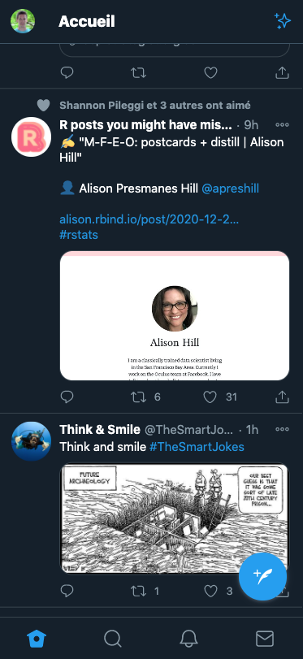
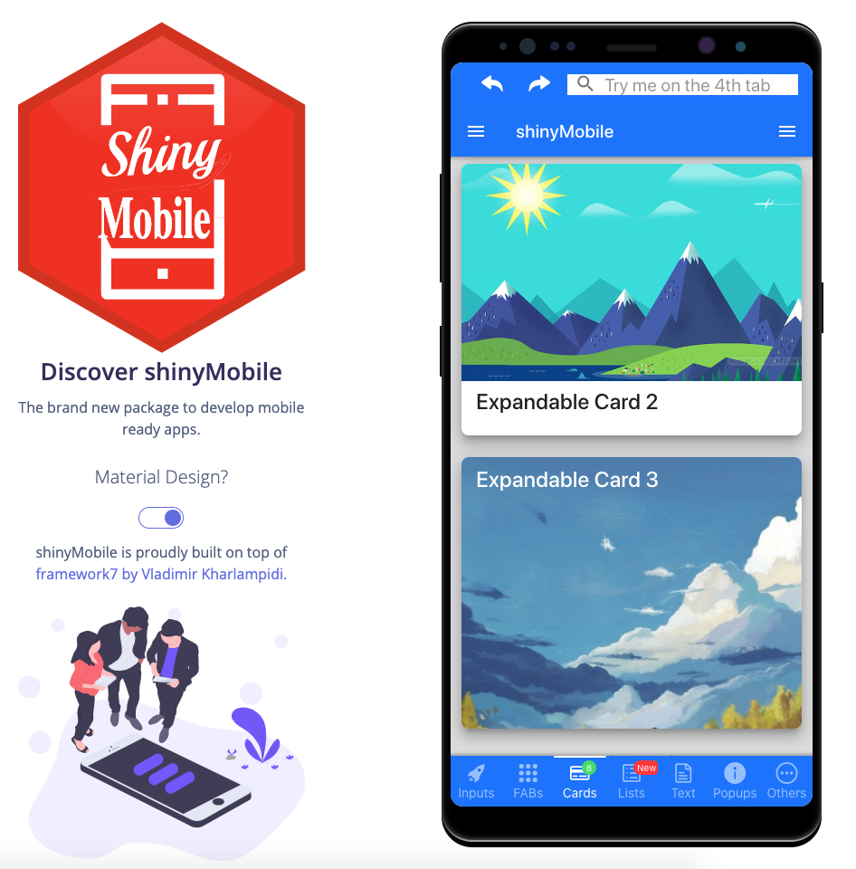

# Introduction {#mobile-shiny-intro}
## Case study objectives
All previously mentioned templates, except [Framework7](https://v5.framework7.io/docs/), are best suited for __desktop__ usage. 
Even though most of them like `{bs4Dash}` work quite well on __mobile__ platforms, 
you don't get the native look and feel that you have with mobile apps like twitter, 
as shown on Figure \@ref(fig:mobile-twitter).

```{r mobile-twitter, echo=FALSE, fig.cap='Twitter design on mobile devices', out.width='50%', fig.align = 'center'}

```

The goal of this part is to introduce you to mobile development for Shiny. We are going to
reconstruct the `{shinyMobile}` package with the help of `{charpente}` and all what we have
learnt since the beginning of the book. 

## About mobile development
Mobile app development consists in developing an application for mobile devices that is
tablets, phones (Android, ipadOS). We call a __native__ app when it is dedicated for the specified
platform. For instance, iOS applications are developed using Objective-C or __Swift__ whereas android apps are mainly developed
with Java. Those apps are __faster__ than web apps since they exploit the full capabilities of the platform. The UI is also
more consistent, they may be installed via a __stores__ (App store, google play) and work __offline__. 
The main issue is the need to know multiple languages and maintain multiple code bases. 

Isn't there something between pure web apps and native apps? 

## Progressive web apps

### Introduction
__Progressive web apps__ or ([PWA](https://web.dev/what-are-pwas/)) improve classic web apps
capabilities by being able to have a __full screen__ display, being installable, provide a launch screen,
like native apps with a consistent UI. They must obey to three rules:

  - Being __capable__: media control, file system access, ...
  - Being __reliable__: fast and usable offline. Transparent failures.
  - Being __installable__:  Standalone use, launch from user's home screen.

### What does "installable" mean?
There are several criteria to meet the installable state:

  - The app must be served over __HTTPS__.
  - Include a __manifest__, that is a __JSON__ file specifying app __metadata__ like its name, short name (`short_name`), icons to use
  for user's home screen and launch screen (displayed image before the first paint), 
  the start url (`start_url`), the display mode (generally standalone),
  the splash screen background color (`background_color`)...
  - Have a registered __service worker__, which can __cache__ the app content, thereby making sure to provide offline
  support.
  
Once all criteria are fulfilled, the web browser may shows an __installation prompt__ to start the process.
  
### How to develop a PWA?
Nowadays, there exist tools to develop native looking apps with a common language, JavaScript. 
This is the case of [Framework7](https://framework7.io/). `{shinyMobile}` (Figure \@ref(fig:mobile-shinyMobile)) was developed with this template. Other tools like the Google __PWA__ compatibility [script](https://github.com/GoogleChromeLabs/pwacompat) 
significantly reduces the pain to make our apps installable on multiple platforms. 

```{r mobile-shinyMobile, echo=FALSE, fig.cap='Twitter design on mobile devices', out.width='100%'}

```

Let's meet in the next part to start your mobile development journey!