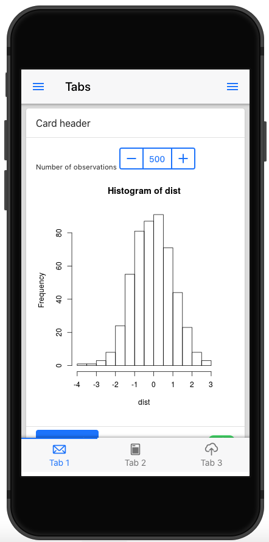
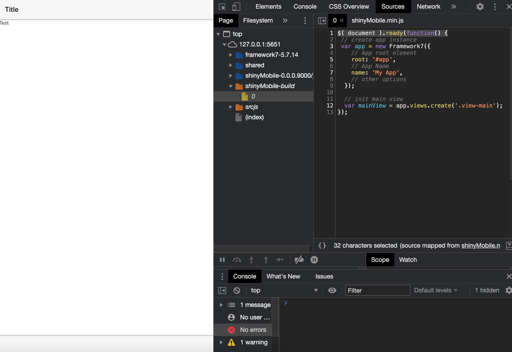
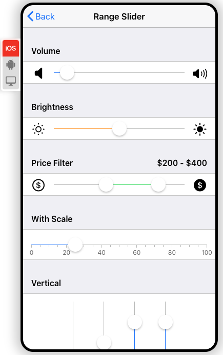
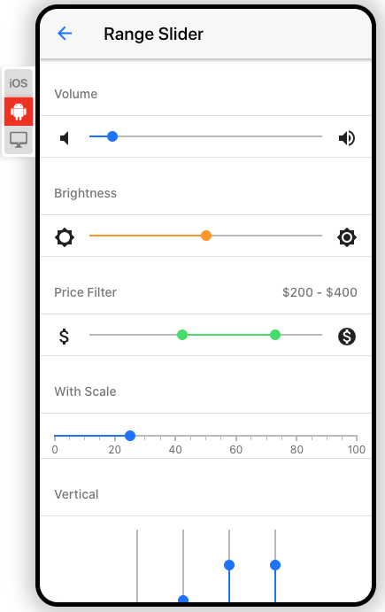

# Reconstruct `{shinyMobile}` {#mobile-shinyMobile}

## Introduction to Framework7
Framework7 is the HTML/CSS/JavaScript engine that fuels `{shinyMobile}`. 
It is a flexible toolkit to build native looking web apps or progressive
web apps (PWA). It has a incredibly rich ecosystem:

  - Provides a core JavaScript API, React API, Vue API, Svelte API.
  - A CLI to ease the creation of PWA, provide boilerplate and started templates.
  - A full set of native [icons](https://framework7.io/icons/).
  - Hundreds of components with different look for iOS and material design, even desktop. 
  - A comprehensive set of [documentation](https://framework7.io/docs/). 
  - A supportive [community](https://forum.framework7.io/). 

## Initiate the package
This is time to initialize the package structure and extract the Framework7 dependencies.
To get an idea of the package file structure, we run:

```{r}
library(charpente)
get_dependency_assets("framework7")
```

We browse to the [package](https://framework7.io/docs/package.html) structure page,
which provides details about necessary components. We are going to use the bundle version since
the lite approach is missing several components. We therefore only need `framework7.bundle.min.js` and
`framework7.bundle.min.css`, which is the default options of `create_dependency`:

```{r, eval=FALSE}
path <- file.path(tempdir(), "shinyMobile")
create_charpente(path, license = "mit")
```

Once the package created and opened, we download Framework7 dependencies:

```{r, eval=FALSE}
create_dependency("framework7")
```

which generates the `framework7-dependencies.R` script:

```{r, eval=FALSE}
add_framework7_deps <- function(tag) {
 framework7_deps <- htmltools::htmlDependency(
  name = "framework7",
  version = "5.7.14",
  src = c(file = "framework7-5.7.14"),
  script = "js/framework7.bundle.min.js",
  stylesheet = "css/framework7.bundle.min.css",
  package = "shinyMobile",
 )
 htmltools::tagList(tag, framework7_deps)
}
```


## Framework7 Layouts
Framework7 has 3 predefined layouts (Figure \@ref(fig:mobile-framework7-layouts)):

  - Single page layout.
  - Multi tabs layout.
  - Split layout: this template is focused for tablet/desktop use. 
  It is composed of a sidebar and a main panel.
  
```{r mobile-framework7-layouts, echo=FALSE, fig.cap='Framework7 layouts', out.width='33%', fig.align = "default", fig.show = "hold"}
knitr::include_graphics("images/mobile/mobile-shinymobile-single-layout.png")

knitr::include_graphics("images/mobile/mobile-shinymobile-split-layout.png")
```

Let's start simple and select the single page layout, whose corresponding HTML is 
given by:

```html
<!DOCTYPE html>
<html>
  <head>
    <!-- Required meta tags-->
    <meta charset="utf-8">
    <meta name="viewport" content="width=device-width, initial-scale=1, maximum-scale=1, minimum-scale=1, user-scalable=no, viewport-fit=cover">
    <meta name="apple-mobile-web-app-capable" content="yes">
    <!-- Color theme for statusbar (Android only) -->
    <meta name="theme-color" content="#2196f3">
    <!-- Your app title -->
    <title>My App</title>
    <!-- Path to Framework7 Library Bundle CSS -->
    <link rel="stylesheet" href="path/to/framework7.bundle.min.css">
    <!-- Path to your custom app styles-->
    <link rel="stylesheet" href="path/to/my-app.css">
  </head>
  <body>
    <!-- App root element -->
    <div id="app">

      <!-- Your main view, should have "view-main" class -->
      <div class="view view-main">
        <!-- Initial Page, "data-name" contains page name -->
        <div data-name="home" class="page">

          <!-- Top Navbar -->
          <div class="navbar">
            <div class="navbar-bg"></div>
            <div class="navbar-inner">
              <div class="title">Awesome App</div>
            </div>
          </div>

          <!-- Bottom Toolbar -->
          <div class="toolbar toolbar-bottom">
            <div class="toolbar-inner">
              <!-- Toolbar links -->
              <a href="#" class="link">Link 1</a>
              <a href="#" class="link">Link 2</a>
            </div>
          </div>

          <!-- Scrollable page content -->
          <div class="page-content">
            <p>Page content goes here</p>
            <!-- Link to another page -->
            <a href="/about/">About app</a>
          </div>
        </div>
      </div>
    </div>
    <!-- Path to Framework7 Library Bundle JS-->
    <script type="text/javascript" src="path/to/framework7.bundle.min.js"></script>
    <!-- Path to your app js-->
    <script type="text/javascript" src="path/to/my-app.js"></script>
  </body>
</html>
```

The `head` tag contains meta tags, some of them required for the PWA features. 
The most important part is the dependencies that will be included there. Note that
the order matters: Framework7 dependencies go first, other dependencies follow. 
The `body` tag is composed of several layers. The first one is the `app` root element, which
is crucial to the template initialization. We'll come back on that point in the next section. 
Then we find the `view view-main` component, inside which we find the `page`. The page contains
the `navbar`, `toolbar` (bottom bar) and the `page content`. Framework7 inserts JavaScript code
at the end of the body. Don't worry, we can include them in the `head` as well. 

Using `html_2_R` we convert the above code to R and extract the `f7_page` function. We replace
the title content by a title parameter, we remove all CSS and JS links since we add
them with the `add_dependencies` function applied to `body`. The page content is contained in a `...` parameter.
We also move the navbar and toolbar content to create 2 other layout functions:

```{r}
f7_page <- function(..., navbar, toolbar, title = NULL) {
  tagList(
    tags$head(
      tags$meta(charset = "utf-8"),
      tags$meta(
        name = "viewport",
        content = "width=device-width, initial-scale=1, maximum-scale=1, minimum-scale=1, user-scalable=no, viewport-fit=cover"
      ),
      tags$meta(
        name = "apple-mobile-web-app-capable",
        content = "yes"
      ),
      tags$meta(
        name = "theme-color",
        content = "#2196f3"
      ),
      tags$title(title)
    ),
    add_dependencies(
      tags$body(
        tags$div(
          id = "app",
          tags$div(
            class = "view view-main",
            tags$div(
              class = "page",
              navbar,
              toolbar,
              tags$div(
                class = "page-content",
                ...
              )
            )
          )
        )
      ),
      deps = "framework7",
    )
  )
}
```

Below are the `navbar` and `toolbar` components. The navbar has only a title parameter and
the toolbar may contain items in a `...` parameter. In practice they may contain more element
but this is enough for now:

```{r}
f7_navbar <- function(title) {
  tags$div(
    class = "navbar",
    tags$div(class = "navbar-bg"),
    tags$div(
      class = "navbar-inner",
      tags$div(
        class = "title",
        title
      )
    )
  )
}

f7_toolbar <- function(...) {
  tags$div(
    class = "toolbar toolbar-bottom",
    tags$div(
      class = "toolbar-inner",
      ...
    )
  )
}
```

Don't forget to regularly insert roxygen documentation with the insert roxygen skeleton 
RStudio feature. 

At that point, we can try to run a simple shiny app:

```{r, eval=FALSE}
devtools::load_all()
library(shiny)

ui <- f7_page(
  "Test",
  navbar = f7_navbar("Title"),
  toolbar = f7_toolbar(),
  title = "shinyMobile"
)

server <- function(input, output, session) {}
shinyApp(ui, server)
```

which displays nothing, but returns no error. We are actually missing the app initialization step.

## App initialization
This step is mandatory to activate all template components (router, panels, ...).
We create a custom script with `create_js`:

```{r, eval=FALSE}
create_js("init")
```

and add the following piece of JS inside:

```javascript
$( document ).ready(function() {
  var app = new Framework7({
    // App root element
    root: '#app',
    // App Name
    name: 'My App',
    // other options
  });
});
```

This script creates the app instance so as to be able to use [methods](https://framework7.io/docs/app.html#app-methods-properties),
get other information, interact with layout elements and listen to app events (offline, online, ...). 
Since the root element is a direct child of the body, the `root` property is not
mandatory. The full configuration list may be found [here](https://framework7.io/docs/app.html).
The next step is to initialize the main view, we add this line right after the app creation:

```javascript
var mainView = app.views.create('.view-main');
```

Once done, we compress the corresponding JS file to create the `shinyMobile.min.js` code
and update the `f7_page` to include the new dependency, after the Framework7 one:

```{r, eval=FALSE}
compress_js()

# updated f7_page
f7_page <- function(..., navbar, toolbar, title = NULL) {
  tagList(
    tags$head(
      tags$meta(charset = "utf-8"),
      tags$meta(
        name = "viewport",
        content = "width=device-width, initial-scale=1, maximum-scale=1, minimum-scale=1, user-scalable=no, viewport-fit=cover"
      ),
      tags$meta(
        name = "apple-mobile-web-app-capable",
        content = "yes"
      ),
      tags$meta(
        name = "theme-color",
        content = "#2196f3"
      ),
      tags$title(title)
    ),
    add_dependencies(
      tags$body(
        tags$div(
          id = "app",
          tags$div(
            class = "view view-main",
            tags$div(
              class = "page",
              navbar,
              toolbar,
              tags$div(
                class = "page-content",
                ...
              )
            )
          )
        )
      ),
      deps = c("framework7", "shinyMobile"),
    )
  )
}

devtools::load_all()
```

If you run the previous app again, it should work as shown on Figure \@ref(fig:mobile-shinyMobile-firstapp).
The right panel displays the developer tools inside which we can seamlessly debug the JS code, by
leveraging source maps. 

```{r mobile-shinyMobile-firstapp, echo=FALSE, fig.cap='First working {shinyMobile} app', out.width='100%'}

```

From now, we can add a welcome notification message leveraging the [notification](https://framework7.io/docs/notification.html) API.
There are 2 steps:

  - Create the notification instance with `app.notification.create(parameters)`.
  - Tell the app to open the notification at start with `app.notification.open()`.
  
We add the following code to `init.js` and call `compress_js()`:
```javascript
var notification = app.notification.create({
  text: 'Welcome to shinyMobile!',
  on: {
    opened: function () {
      console.log('Notification opened')
    }
  }
}).open();
```

It will open at start up and close on swipe gesture. The Framework7 API is quite easy to
understand and extremely powerful.

## App configuration
The [app](https://framework7.io/docs/app.html) object has a tremendous amount of methods and parameters.
In this section, we briefly describe the most significant and how to set it up.
Among all parameters, there are metadata parameters like __name__ and __version__. Once the app initialized, all
app parameters are accessible with the `.` notation. For instance, if you setup a version number it is accessible 
with `app.version`.

One of the most important parameter is the __theme__ that controls the overall app design (Figure \@ref(fig:mobile-framework7-themes)):

  - `ios` corresponds the iOS design.
  - `md` to material design.
  - `aurora` to a desktop optimized design.
  
The good new is that if this parameter is set to `auto`, Framework7 will detect the
current device and accordingly adapt the design. Nothing prevents you from forcing the
iOS layout on android devices, even though being irrelevant. 

```{r mobile-framework7-themes, echo=FALSE, fig.cap='Framework7 skins: iOS (left), md (right).', out.width='50%', fig.align = "default", fig.show = "hold"}


```