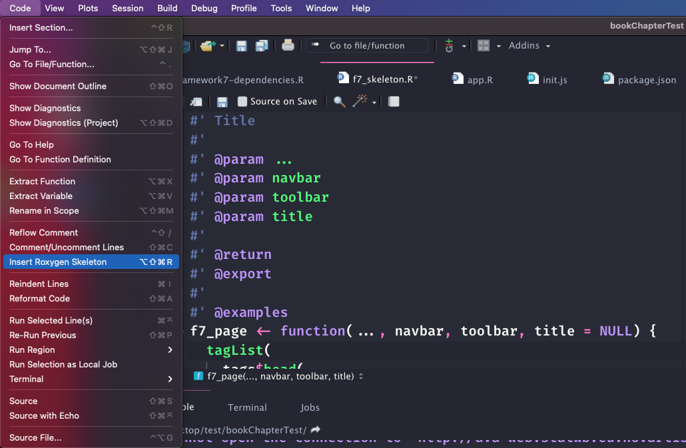

# Reconstruct `{shinyMobile}` {#mobile-shinyMobile}

::: {.importantblock data-latex=""}
This section has been written and tested with Framework7 `5.7.14`.
Some feature may change in future releases. 
However, fear not! The process follows the same general principles. 
:::

::: {.warningblock data-latex=""}
As a reminder, the code examples shown throughout this chapter are gathered in the `{OSUICode}` package accessible at https://github.com/DivadNojnarg/OSUICode/tree/1d42aa7531705954d3c21921c8bbb10623b20d12. 
:::

## Introduction to Framework7
Framework7 is the HTML/CSS/JavaScript engine that fuels `{shinyMobile}`. 
It is a flexible toolkit to build __native__ looking web apps or progressive
web apps (PWA). It has an incredibly rich ecosystem:

  - Provides a core JavaScript API, __React__ API, __Vue__ API, __Svelte__ API.
  - A CLI (command line interface) to ease the creation of __PWA__, provide boilerplate and starter templates.
  - A full set of native [icons](https://framework7.io/icons/).
  - Hundreds of components with different look for __iOS__ and __material design__, even desktop. 
  - A comprehensive set of [documentation](https://framework7.io/docs/). 
  - A supportive [community](https://forum.framework7.io/). 

## Initiate the package
This is time to initialize the __package__ structure and extract the Framework7 __dependencies__.
To get an idea of the package file structure, we run:

```{r}
library(charpente)
```

```{r, eval=FALSE}
get_dependency_assets("framework7", tag = "5.7.14") 
# Output was manually truncated for formatting reasons
#> $url
#> [1] "https://cdn.jsdelivr.net/npm/framework7@5.7.14/"
#> 
#> $files
#>                                 name
#> 2          framework7.bundle.min.css
#> 6                 framework7.min.css
#> 11          framework7.bundle.min.js
#> 15                 framework7.min.js
#> 18         framework7-lite.bundle.js
#> 19     framework7-lite.bundle.min.js
#> 23            framework7-lite.min.js
#>                                            hash
#> 2  P0Yv9hUd1e2zLYv9F3eEiJ29wz3ZOSIbdHGEj3Jwzyo=
#> 6  fYS3dYPbdZeiQAM9wTUQiLP82ZTcVoA970gb2Ov7EFY=
#> 11 k0i6vZYYH7MIgZvxSp4eQFS2HCEXy1ae5BF/YWSMyys=
#> 15 FJ+5ZHj8V2fzT7Lts0ELaWSC4ZJtmxQzRuWeWwke9a0=
#> 18 EiVuejoa3kTItzhZ5mw7WhB+Ah75R5HpM+34hijj7wA=
#> 19 LKMinGOXYGPI4wdD4ZIPp5kx84PP3f7EkD8dUxFPRAI=
#> 23 liT0rss/O3G2MtXQ3/zAu+8jmTrrPhwiqV+Pd58qJJo=
#> 
#> $hasSubfolders
#> [1] TRUE
```

We browse to the [package](https://framework7.io/docs/package.html) page,
which provides details about all necessary components. We are going to use the __bundle__ version since
the lite approach is missing several components, particularly Framework7 widgets. We therefore target `framework7.bundle.min.js` and `framework7.bundle.min.css`:

```{r, eval=FALSE}
path <- file.path(tempdir(), "shinyMobile")
create_charpente(path, license = "mit")
```

Once the package created and opened, we download Framework7 dependencies, specifying
the following version, that is `5.7.14`, and targeting `bundle.min` files by setting `charpente_options(bundle = TRUE)` (default to `FALSE`):

```{r, eval=FALSE}
create_dependency(
  "framework7", 
  tag = "5.7.14", 
  options = charpente_options(bundle = TRUE)
)
```

Besides, this generates the `framework7-dependencies.R` script:

```{r, eval=FALSE}
add_framework7_deps <- function(tag) {
 framework7_deps <- htmltools::htmlDependency(
  name = "framework7",
  version = "5.7.14",
  src = c(file = "framework7-5.7.14"),
  script = "js/framework7.bundle.min.js",
  stylesheet = "css/framework7.bundle.min.css",
  package = "shinyMobile",
 )
 htmltools::tagList(tag, framework7_deps)
}
```


## Framework7 Layouts {#framework7-layouts}
Framework7 has three predefined layouts (Figure \@ref(fig:mobile-framework7-layouts)):

  - __Single page__ layout.
  - __Multi tabs__ layout.
  - __Split__ layout, targeting tablet/desktop. It is composed of a sidebar and a main panel.
  
```{r mobile-framework7-layouts, echo=FALSE, fig.cap='Framework7 layouts.', out.width='33%', fig.align = "default", fig.show = "hold"}
knitr::include_graphics("images/mobile/mobile-shinymobile-single-layout.png")
knitr::include_graphics("images/mobile/mobile-shinymobile-tabs-layout.png")
knitr::include_graphics("images/mobile/mobile-shinymobile-split-layout.png")
```

Let's start simple and choose the single page layout, whose corresponding HTML is 
given by:

```html
<!DOCTYPE html>
<html>
  <head>
    <!-- Head content (see below) -->
  </head>
  <body>
    <!-- App root element (see below) -->
  
    <!-- Path to Framework7 Library Bundle JS-->
    <script type="text/javascript" 
      src="path/to/framework7.bundle.min.js"></script>
    <!-- Path to your app js-->
    <script type="text/javascript" 
      src="path/to/my-app.js"></script>
  </body>
</html>
```

The `head` tag contains __meta__ tags (some are required for __PWA__ features) which are discussed in the next Chapter \@ref(mobile-pwa). 
The most important part is the dependencies that will be included. Note that
the order matters: Framework7 dependencies go first, other dependencies follow. 

```html
<head>
  <!-- Required meta tags-->
  <meta charset="utf-8">
  <meta name="viewport" content="width=device-width, 
    initial-scale=1, maximum-scale=1, minimum-scale=1, 
    user-scalable=no, viewport-fit=cover">
  <meta name="apple-mobile-web-app-capable" content="yes">
  <!-- Color theme for statusbar (Android only) -->
  <meta name="theme-color" content="#2196f3">
  <!-- Your app title -->
  <title>My App</title>
  <!-- Path to Framework7 Library Bundle CSS -->
  <link rel="stylesheet" 
    href="path/to/framework7.bundle.min.css">
  <!-- Path to your custom app styles-->
  <link rel="stylesheet" href="path/to/my-app.css">
</head>
```

The `body` tag is composed of several layers. The first one is the `app` __root__ element, which is crucial to the template __initialization__. We'll come back on that point in the next section. 

```html
<!-- App root element -->
<div id="app">
  <!-- Your main view, should have "view-main" class -->
  <div class="view view-main">
    <!-- Initial Page -->
    <div class="page">
      <!-- Top Navbar -->
      
      <!-- Bottom Toolbar -->
  
      <!-- Scrollable page content -->
      
    </div>
  </div>
</div>
```

Then, we find the __view__ component, inside which is located the __page__, hosting the __navbar__, __toolbar__ (bottom bar) and the __page content__.

```html
<!-- Top Navbar -->
<div class="navbar">
  <div class="navbar-bg"></div>
  <div class="navbar-inner">
    <div class="title">Awesome App</div>
  </div>
</div>

<!-- Bottom Toolbar -->
<div class="toolbar toolbar-bottom">
  <div class="toolbar-inner">
    <!-- Toolbar links -->
    <a href="#" class="link">Link 1</a>
    <a href="#" class="link">Link 2</a>
  </div>
</div>

<!-- Scrollable page content -->
<div class="page-content">
  <p>Page content goes here</p>
  <!-- Other content -->
</div>
```

Although, Framework7 inserts JavaScript code at the end of the body, we can include them in the `head` as well. 

Leveraging the `{charpente}` `html_2_R()`, we convert the above code to R and extract the `f7_page()` function. We replace the title content with a title parameter, paying attention to remove all CSS and JS links, as they are already included with the `add_dependencies()` function applied to `body`. The page content is contained in a `...` parameter.
We also move the `navbar` and `toolbar` content to create two other layout functions. Meta tags are commented for space reasons but are available [here](https://github.com/DivadNojnarg/outstanding-shiny-ui-code/blob/0ba1c35b85342c6933cc56489bae41186cc01601/R/shinyMobile.R#L74):

```{r, echo=FALSE}
f7_page <- function(..., navbar, toolbar, title = NULL) {
  tagList(
    tags$head(
      tags$meta(charset = "utf-8"),
      tags$meta(
        name = "viewport",
        content = "width=device-width, initial-scale=1, 
        maximum-scale=1, minimum-scale=1, user-scalable=no, 
        viewport-fit=cover"
      ),
      tags$meta(
        name = "apple-mobile-web-app-capable",
        content = "yes"
      ),
      tags$meta(
        name = "theme-color",
        content = "#2196f3"
      ),
      tags$title(title)
    ),
    add_dependencies(
      tags$body(
        tags$div(
          id = "app",
          tags$div(
            class = "view view-main",
            tags$div(
              class = "page",
              navbar,
              toolbar,
              tags$div(
                class = "page-content",
                ...
              )
            )
          )
        )
      ),
      deps = "framework7"
    )
  )
}
```

```{r, eval=FALSE}
f7_page <- function(..., navbar, toolbar, title = NULL) {
  tagList(
    tags$head(
      # Meta tags are commented for space reasons
      tags$title(title)
    ),
    add_dependencies(
      tags$body(
        tags$div(
          id = "app",
          tags$div(
            class = "view view-main",
            tags$div(
              class = "page",
              navbar,
              toolbar,
              tags$div(class = "page-content", ...)
            )
          )
        )
      ),
      deps = "framework7"
    )
  )
}
```

Below are the `navbar` and `toolbar` components. The navbar has only a title parameter and
the toolbar may contain items in a `...` parameter. In practice they may contain more elements,
but this is enough for now:

```{r, eval=FALSE}
f7_navbar <- function(title) {
  tags$div(
    class = "navbar",
    tags$div(class = "navbar-bg"),
    tags$div(
      class = "navbar-inner",
      tags$div(
        class = "title",
        title
      )
    )
  )
}

f7_toolbar <- function(...) {
  tags$div(
    class = "toolbar toolbar-bottom",
    tags$div(
      class = "toolbar-inner",
      ...
    )
  )
}
```

::: {.noteblock data-latex=""}
Don't forget to regularly insert roxygen documentation with the insert roxygen skeleton RStudio feature (Figure \@ref(fig:mobile-insert-roxygen)) and run `devtools::document()`, `devtools::load_all()`. 
:::

```{r mobile-insert-roxygen, echo=FALSE, fig.cap='RStudio helper to add roxygen2 skeleton to any R function. ', out.width='100%'}

```

At this point, we can try to run a simple shiny app. Best practice is to save the `app.R` file in the `./inst/demo` folder:

<!-- Won't be deployed -->

```{r, eval=FALSE}
library(shiny)

ui <- f7_page(
  "Test",
  navbar = f7_navbar("Title"),
  toolbar = f7_toolbar(),
  title = "shinyMobile"
)

server <- function(input, output, session) {}
shinyApp(ui, server)
```

which displays nothing, but returns no error. We actually forgot the app __initialization__ step.


## App initialization {#mobile-initialization}
This step is mandatory to __activate__ all template __components__ (router, panels, ...).
We create a custom script with `create_js`, which automatically updates the `{charpente}` provided `main.js` entry point:

```{r, eval=FALSE}
create_js("init")
```

We add the following piece of JS inside `init.js`:

```js
$( document ).ready(function() {
  app = new Framework7({
    // App root element
    root: '#app',
    // App Name
    name: 'My App',
    // other options
  });
});
```

Importantly, we made `app` global so as to access it in other scopes. There is currently no easy way to workaround this issue. 

::: {.warningblock data-latex=""}
Most of the code inside `init.js` is wrapped in a function that waits the document to be ready before interacting with the __DOM__. This is necessary since the configuration is retrieved from a `script` DOM element inserted when the application starts, thus not immediately available. If you try to remove the `$( document ).ready(function(...)});`, an error will be raised since the configuration cannot be properly retrieved. 
::: 

This script creates the app instance necessary to leverage Framework7 [methods](https://framework7.io/docs/app.html#app-methods-properties),
initialize other __widgets__, interact with layout elements and listen to app events (offline, online, ...). Since the root element is a direct child of the body, the `root` property is not
mandatory. The full configuration list may be found [here](https://framework7.io/docs/app.html).
The next step consists in initializing the main view, we add this line right after the app creation:

```js
let mainView = app.views.create('.view-main');
```

Once done, we compress the corresponding JS file to create the `shinyMobile.min.js` code, 
update the `f7_page()` to include the new dependency, after the Framework7 one, and document the package to setup the package imports:

```{r, eval=FALSE}
build_js()

# updated f7_page
f7_page <- function(..., navbar, toolbar, title = NULL) {
  tagList(
    tags$head(
      # Head content (unchanged)
    ),
    add_dependencies(
      # Body tag (unchanged)
      deps = c("framework7", "shinyMobile")
    )
  )
}

# Initialize NAMESPACE file
devtools::document()
```

The working app is shown on Figure \@ref(fig:mobile-shinyMobile-firstapp).
The right panel displays the developer tools inside which we can seamlessly debug the JS code, by
leveraging __source maps__. 

```{r mobile-shinyMobile-firstapp, echo=FALSE, fig.cap='First working {shinyMobile} app.', out.width='100%'}
knitr::include_graphics("images/mobile/mobile-shinyMobile-firstapp.png")
```

From now, we can add a welcome notification message with the [notification](https://framework7.io/docs/notification.html) API. There are two steps:

  - Create the notification instance with `app.notification.create(parameters)`.
  - Tell the app to open the notification at start with `app.notification.open()`.
  
We add the following code to `init.js` and call `build_js()`:
```js
let notification = app.notification.create({
  text: 'Welcome to shinyMobile!',
  on: {
    opened: function () {
      console.log('Notification opened');
    }
  }
}).open();
```

It opens at app start up and closes on swipe gesture. The Framework7 API is quite easy to
understand and extremely powerful. Chapter \@ref(mobile-widgets) gives a better introduction to the main Framework7 widgets. 

## App configuration
The [app](https://framework7.io/docs/app.html) object has a tremendous amount of methods and parameters. In this section, we briefly describe the most significant and how to set them up.
Among all parameters, there are metadata parameters like __name__ and __version__. Once the app initialized, all app parameters are accessible with the `.` notation. For instance, if you set a version number, it is accessible later with `app.version`.

### Global theme

__theme__ controls the overall app design (Figure \@ref(fig:mobile-framework7-themes)):

  - `ios` corresponds the __iOS__ design.
  - `md` stands for __material__ design.
  - `aurora` is a __desktop__ optimized design.
  
As this parameter is set to `auto`, Framework7 detects the
current device stored in `app.device`, and accordingly adapts the design. Nothing prevents you from forcing the iOS layout on android devices, even though being quite irrelevant. Here are many properties to [review](https://framework7.io/docs/device.html).


```{r mobile-framework7-themes, echo=FALSE, fig.cap='Framework7 skins: iOS (left), md (right).', out.width='30%', fig.align = "center", fig.show = "hold"}
knitr::include_graphics("images/mobile/mobile-shinymobile-slider-ios.png")
knitr::include_graphics("images/mobile/mobile-shinymobile-slider-md.png")
```

### Events
The app is able to emit events whenever relevant like `init`, `resize`, `online`, `offline`, which
allows to add interactivity:

```js
app = new Framework7({
  on: {
    init: function () {
      console.log('App initialized');
    },
    // other events
  }
});
```

### Components configuration
All Framework7 components are highly customizable. Yet, if you know that some 
parameters are not going to change, it is a good idea to make them global and share them
across all instances. For example, notifications have global options. Let's add this code
to the `init.js` script directly inside the `var app = new Framework7({ ... })`:

```js
notification: {
  title: 'My App',
  closeTimeout: 3000,
}
```

This means all notifications will close after three seconds and have the `My App` title. We rebuild the JS code with `build_js()` and run the previous app example. We add another notification to the `init.js` script with a delay of one second so as to test this global feature. Note the use of the internal Framework7 [utils](https://framework7.io/docs/utils.html#nexttick) `app.utils.nextTick`, which is nothing more than a `setTimeout` function

```js
let otherMessage = app.notification.create({
  text: 'You look great!'
});
  
// equivalent to setTimeout ...
app.utils.nextTick(function() {
  otherMessage.open();
}, 1000);
```


### Allow end-user configuration
In the above sections, we described some parameters to configure the app. Yet, 
we did setup all values directly in JavaScript. How do we allow the end user to provide
his very own parameters?

The idea is the following:

  - We create an options argument in the `f7_page()` function which accepts a list
  of parameters.
  - We convert it to the JSON format and store it in a tag, ideally next to the `body` element.
  - We recover those data on the JS side and update the app initialization method.
  
The `f7_page()` may be accordingly modified. We convert the options list to a JSON with `jsonlite::toJSON` and embed it in a script tag (as a reminder, we exploit this method in section \@ref(secondary-inputs)). 
The `data-for` attribute with the __id__ attribute guarantees the uniqueness of our configuration script:

```{r, eval=FALSE}
config_tag <- shiny::tags$script(
  type = "application/json",
  `data-for` = "app",
  jsonlite::toJSON(
    x = options,
    auto_unbox = TRUE,
    json_verbatim = TRUE
  )
)
```

We then create an intermediate `body_tag` component where we insert the configuration tag.

```{r, eval=FALSE}
f7_page <- function(..., navbar, toolbar, title = NULL, 
                    options = NULL) {

  # Create config (see above) 

  # create body_tag
  body_tag <- tags$body(
    # Body content (unchanged)
    # Config tag 
    config_tag
  )

  tagList(
    tags$head(
      # Head content (unchanged)
    ),
    add_dependencies(
      body_tag,
      deps = c("framework7", "shinyMobile")
    )
  )
}
```

On the JS side, the data collection must occur before the app initialization and is quite easy with the jQuery `find` method:

```js
let config = $(document).find("script[data-for='app']");
config = JSON.parse(config.html());
```

We accordingly update the app initialization:

```js
app = new Framework7({
  // App root element
  root: '#app',
  // App Name
  name: 'My App',
  version: config.version,
  // other options
  theme: config.theme,
  notification: {
    closeTimeout: 3000
  }
});
```

What happens if the user forgets to supply the version number? `data.version` is undefined
and the app still works! The biggest advantage of this approach is the fact that all `TRUE`
and `FALSE` (R) are converted to `true` and `false` (JS), which avoids unnecessary conversion steps.
However, we are still missing many potential configuration options. For instance, with the above code,
only `root`, `name`, `version`, `theme`, `notifications`, `touch` are considered. If the user
provides any other option, it is ignored.

In theory, this is what we could do to make sure that all elements are considered:

```js
app = new Framework7(config);
// Don't forget to set the root!
config.root = "#app";
```

It is assumed that the user exactly knows what to provide in the list, especially mandatory elements. 
Knowing the tremendous number of options, it might be slightly overwhelming for a new user. What we suggest is to provide a default option list, say `shinyMobile_options`, available for `f7_page()`:

```{r, eval=FALSE}
shinyMobile_options <- list(
  theme = "auto",
  dark = TRUE,
  filled = FALSE,
  color = "#007aff",
  iosTranslucentBars = FALSE,
  navbar = list(
    iosCenterTitle = TRUE,
    hideOnPageScroll = TRUE
  ),
  toolbar = list(
    hideOnPageScroll = FALSE
  ),
  # remaining options ...
)

f7_page <- function(
  # other parameters are not mentioned
  options = shinyMobile_options
) {
  # function body ...
}

```

You only need to add one line of documentation in the roxygen part and write `app = new Framework7(config);` on the JS side, which is convenient to maintain. This approach avoids to create too many parameters, but be careful about the documentation, as it may cause frustration for the end user. Don't forget that since `config` is an object, 
you may add any other properties, methods, on the fly with the `.` notation or `app.utils.extend`.


::: {.noteblock data-latex=""}
You finally may ask why we put `dark`, `color` and `filled` in the options list given they
are not part of the app API parameters. As any unknown parameter is not considered by the `Framework7` class, we can definitely keep them here, which is easier to treat on the JS side.
:::

### Modify configuration
As previously stated, the app configuration is passed during the initialization process, through
`new Framework7(config)`. What if the user wants to programmatically change these options
when the app is running?

Since app parameters are located in `app.params`, the idea would be to extend that list:

```js
let newParams = {
  dialog: {
    buttonOk:  "Yeaaaah!",
    buttonCancel: "Ouuups!"
  }
}
app.utils.extend(app.params, newParams);
```

The above example changes the default buttons text for all modal dialog. 

::: {.warningblock data-latex=""}
As far as I know, some options won't work like the __global theme__, which 
would require to re-initialize the app and is not possible.  
::: 

### Global data and methods {#mobile-global-data}
The Framework7 __data__ parameters allows to store global elements, data, and use them in different scripts:

```js
config.data = function () {
  return {
    username: 'dgranj',
    firstName: 'David',
    lastName: 'Granjon',
    // may also be array
    widgets: []
  };
};
```

Similarly __methods__ hosts all global app methods, functions you may re-use in different parts. Like for `app.data`, we access them with `app.methods`:

```js
config.methods = {
  getUsername: function() {
    app.data.username;
  },
  // other methods
}
```

::: {.importantblock data-latex=""}
Since Framework7 6.0.0, `app.data` has been removed in favor of a more flexible alternative called `store`. It is documented here: https://framework7.io/docs/store.html.
:::


### Other elements {#mobile-shinyMobile-other}
Framework7 provides mobile specific modules like [`touch`](), which is a long press event (here 750 ms). This is something you can usually do on many mobile apps. The touch module parameters are defined as follows:

```js
touch: {
  tapHold: true,
  tapHoldDelay: 750,
}
```

which translates into a named list in R:

```{r, eval=FALSE}
list(
  tapHold = TRUE,
  tapHoldDelay = 750,
  # other touch options
)
```

To activate that feature, we update  `shinyMobile_options()`:

```{r}
shinyMobile_options <- list(
  theme = "auto",
  dark = TRUE,
  filled = FALSE,
  color = "#007aff",
  iosTranslucentBars = FALSE,
  navbar = list(
    iosCenterTitle = TRUE,
    hideOnPageScroll = TRUE
  ),
  toolbar = list(
    hideOnPageScroll = FALSE
  ),
  # TOUCH MODULE OPTIONS
  touch = list(
    tapHold = TRUE,
    tapHoldDelay = 750,
    iosTouchRipple = FALSE
  )
  # remaining options ...
)
```

We create a button element and add it the `taphold` event in `init.js`:

```js
$('#mybutton').on('taphold', function () {
  app.dialog.alert('Tap hold fired!');
});
```

The `app.R` script should look like:

```{r, echo=FALSE, results='asis'}
code_chunk(OSUICode::get_example("shinyMobile/taphold"), "r")
```

::: {.warningblock data-latex=""}
Once the app is running, don't forget to open the developer tools and
set the device on mobile mode (iPhone or android) since `taphold` does not fire
on desktop (Figure \@ref(fig:mobile-shinyMobile-taphold)). You may place a breakpoint
inside the `taphold` event listener to check that it is properly triggered.
::: 

`taphold` also triggers events related to the click like text selection, which is rarely desirable. Hence, we have to add the following code to `init.js`, making sure to check that `touch` exists:

```js
// tapHold custom css
if (config.hasOwnProperty("touch")) {
  if (config.touch.tapHold) {
    $("<style>")
      .prop("type", "text/css")
      .html(
        `-moz-user-select: none;
        -webkit-user-select: none;
        user-select: none;`
      )
      .appendTo("head");
  }
}
```

It disables classic text selection after a long press in the window. 

```{r mobile-shinyMobile-taphold, echo=FALSE, fig.cap='Long press or taphold event.', out.width='100%'}
knitr::include_graphics("images/mobile/mobile-shinyMobile-taphold.png")
```

An important remark is the click handling in Framework7. Framework7 has its own internal [router](https://framework7.io/docs/view.html) that allows to pass data between pages and perform quite
advanced actions. Do you remember the `app.views.create('.view-main');` step? This real purpose is actually to activate the internal router. While extremely convenient for classic web apps, 
this feature is not completely suited for Shiny that does not natively support multi pages apps. 
The recent [work](https://github.com/ColinFay/brochure) in the field is promising and plays well
with `{shinyMobile}` (see [here](https://github.com/RinteRface/shinyMobile/issues/136)) but this is out of the scope of this chapter. The internal router has strong implications, for instance clicking on 
`<a href="https://www.google.com/">Click me</a>` will fail (while it works like
a charm for a classic shiny app).

To fix this issue, Framework7 has a `clicks` module options, accepting any valid CSS selector. 
Below is the default configuration:

```js
clicks: {
  externalLinks: '.external',
}
```

Consequently, in order to skip the internal router, links must have the `.external` class.

```{r, echo=FALSE, results='asis'}
code_chunk(OSUICode::get_example("shinyMobile/links"), "r")
```

::: {.importantblock data-latex=""}
One might be tempted to target all `a` elements: this is a bad idea, 
as it also target tabs navigation, which eventually fails. Therefore, it is best 
practice to add the `external` class to all the necessary links like `a(href = "https://www.google.com/", "Click me", class = "external")`
:::

## Theming and colors {#mobile-shinyMobile-theming}
Framework7 offers 15 color [themes](https://framework7.io/docs/color-themes.html?theme=light&bars=empty&color=%09+%23673ab7) with a dark/light global appearance. To apply them, we add `color-theme-COLOR` to the
parent element. Best practice is to target the `body` since it is the parent of all the page
content, thereby ensuring global consistency. The dark theme is triggered by adding the
`theme-dark` class to `html`. Since `body` belongs to `f7_page()` but not `html` (added by
Shiny at startup), we can apply the color in R, while the dark mode has to be activated from JS:

```{r, eval=FALSE}
f7_page <- function(..., navbar, toolbar, 
                    title = NULL, options = NULL) {
  
  body_cl <- NULL
  if (!is.null(options$color)) {
    body_cl <- sprintf("color-theme-%s", options$color)
  }
  
  # Config tag (unchanged)
  
  # Modify the body tag to add a class
  tags$body(
    class = body_cl,
    # ... App wrapper (unchanged),
    config_tag
  )
  
  # ...
  
}
```

This approach assumes the user to pass the color name as parameter like `pink`, `yellow` and won't be considered in the remaining of the book. 
What if we want to allow more flexibility and add any existing HEX color? 
Framework7 has tools, namely `app.utils.colorThemeCSSProperties`, that is a JS method
creating the required CSS on the fly depending on the provided HEX color. For instance, if we select a
cyberpunk green color:

```js
app.utils.colorThemeCSSProperties('#42f5a1');
// /* Custom color theme */
// {
//   "--f7-theme-color": "#42f5a1";
//   "--f7-theme-color-rgb": "66, 245, 161";
//   "--f7-theme-color-shade": "#1bf38e";
//   "--f7-theme-color-tint": "#69f7b4";
// }
```

The commented code has to be injected in the app CSS. I personally don't think its a problem
to look for a specific HEX code, knowing that many tools can help. Therefore, I prefer the
second approach. We edit the `init.js` code by adding the following JS snippet:

```js
if (config.hasOwnProperty('color')) {
  let colorCSS = app.utils.colorThemeCSSProperties(config.color);
  $('<style>')
    .prop('type', 'text/css')
    .html(`:root {
    --f7-theme-color:${colorCSS["--f7-theme-color"]};
    --f7-theme-color-rgb:${colorCSS["--f7-theme-color-rgb"]};
    --f7-theme-color-shade:${colorCSS["--f7-theme-color-shade"]};
    --f7-theme-color-tint:${colorCSS["--f7-theme-color-tint"]};
    }`)
    .appendTo("head");
}
```

`config.hasOwnProperty('color')` ensures that this code does not run if color is missing from the
provided config. Then, we generate an object, `colorCSS`, containing the theme color properties with `app.utils.colorThemeCSSProperties(config.color)`.
Importantly, as this is an object, we can't insert it in a string. However, we can extract its
properties 1 by 1 to generate the relevant piece of CSS, for instance `colorCSS["--f7-theme-color"]`. Then we add a `style` tag to the `head`
containing the CSS rule. Once done, recompile the JS
with `build_js()` and try with the following app.

```{r, echo=FALSE, results='asis'}
code_chunk(OSUICode::get_example("shinyMobile/white-filled"), "r")
```

We can go further and apply the `filled` theme, which is an alternative design where all
`navbar`, `toolbar`, ... are filled with the theme color. In that case, we add the following CSS inside `init.js`:

```js
if (!config.hasOwnProperty('filled')) config.filled = false;
if (config.filled) {
  let filledCSS = `
    :root,
    :root.theme-dark,
    :root .theme-dark {
      --f7-bars-bg-color: var(--f7-theme-color);
      --f7-bars-bg-color-rgb: var(--f7-theme-color-rgb);
      --f7-bars-translucent-opacity: 0.9;
      --f7-bars-text-color: #fff;
      --f7-bars-link-color: #fff;
      --f7-navbar-subtitle-text-color: rgba(255,255,255,0.85);
      --f7-bars-border-color: transparent;
      --f7-tabbar-link-active-color: #fff;
      --f7-tabbar-link-inactive-color: rgba(255,255,255,0.54);
      --f7-sheet-border-color: transparent;
      --f7-tabbar-link-active-border-color: #fff;
    }
    .appbar,
    .navbar,
    .toolbar,
    .subnavbar,
    .calendar-header,
    .calendar-footer {
      --f7-touch-ripple-color: var(--f7-touch-ripple-white);
      --f7-link-highlight-color: var(--f7-link-highlight-white);
      --f7-button-text-color: #fff;
      --f7-button-pressed-bg-color: rgba(255,255,255,0.1);
    }
    .navbar-large-transparent,
    .navbar-large.navbar-transparent {
      --f7-navbar-large-title-text-color: #000;
    
      --r: 0;
      --g: 122;
      --b: 255;
      --progress: var(--f7-navbar-large-collapse-progress);
      --f7-bars-link-color: rgb(
        calc(var(--r) + (255 - var(--r)) * var(--progress)),
        calc(var(--g) + (255 - var(--g)) * var(--progress)),
        calc(var(--b) + (255 - var(--b)) * var(--progress))
      );
    }
    .theme-dark .navbar-large-transparent,
    .theme-dark .navbar-large.navbar-transparent {
      --f7-navbar-large-title-text-color: #fff;
  }`;
  
  $('<style>')
    .prop('type', 'text/css')
    .html(`${filledCSS}`)
    .appendTo("head");
}
```

The result is displayed on Figure \@ref(fig:mobile-shinyMobile-theming). Don't forget to set `filled = TRUE` in `shinyMobile_options`.

```{r mobile-shinyMobile-theming, echo=FALSE, fig.cap='Filled blue color theme.', out.width='100%'}
knitr::include_graphics("images/mobile/mobile-shinyMobile-theming.png")
```

Let's finish this section with the __dark__ mode. We leverage the Framework7 app method 
element since we could also toggle the dark mode under other circumstances. We add a
`toggleDarkTheme` function to the methods object then trigger it depending on the value
of the config. If the user don't provide any value, we set `config.dark` to `false`. We insert it right before `app = new Framework7(config);` inside `init.js`:

```js
// ... get config
config.methods = {
  toggleDarkTheme: function () {
    let self = this;
    let $html = self.$('html');
    $html.toggleClass('theme-dark');
  }
};

if (!config.hasOwnProperty('dark')) config.dark = false;

app = new Framework7(config);

if (config.dark) {
  app.methods.toggleDarkTheme();
}

// ... other code
```


At this point `init.js` is given in appendix \@ref(mobile-shinyMobile-appendix). 

```{r, echo=FALSE, results='asis'}
code_chunk(OSUICode::get_example("shinyMobile/dark-filled"), "r")
```

The overall expected result is shown Figure \@ref(fig:mobile-shinyMobile-dark).

```{r mobile-shinyMobile-dark, echo=FALSE, fig.cap='Dark mode in {shinyMobile}.', out.width='100%'}

```

## Modularize JS code {#mobile-modularizeJS}
As shown above, the `init.js` code starts to grow and this is not a good sign. 
In this section, we show how to utilize the `import` and `export` statements, possible
owing to the `esbuild` JS bundler. Note that this is a more modern version of writing equivalent to the `module.exports` and `require` shown in \@ref(about-js-modules).

In the R console, we run `create_js("helpers_config", add_reference = FALSE)`, which creates a new JS script but does not import it in the `main.js` `esbuild` entry point. Inside we extract a function containing all steps to set up the app configuration object:

```js
export const setConfig = () => {
  // collect all data elements stored in body
  let config = $(document).find("script[data-for='app']");
  config = JSON.parse(config.html());

  // always erase existing root value just in case the user 
  // changes the root. This may be harmful
  config.root = "#app";

  // store app methods
  config.methods =  {
    toggleDarkTheme: function() {
      let self = this;
      let $html = self.$("html");
      $html.toggleClass("theme-dark");
    }
  };

  // App data
  config.data = function() {
    return {
      // any interesting element to save
    };
  };

  return config;
};
```

This function does not have any argument and must return the `config` variable that will be subsequently injected in `new Framework7(config)` to initialize the app. In the `init.js` script, we import the `setConfig()` function and call it within `$( document ).ready`:

```js
import { setConfig } from './helpers_config.js';

$( document ).ready(function() {
  let config = setConfig();
  // create app instance
  app = new Framework7(config);
  // ...
});
```

We finally bundle our code with `build_js()`.

::: {.warningblock data-latex=""}
If the function has a side effect, for instance modify a variable located in another scope, it must return the transformed variable output, so that it can be tracked at the upper level. 
:::

We have now set all foundations. In the next chapter, we see how to convert a `{shinyMobile}` app (and any vanilla shiny app) into a __progressive web app__ (PWA). 

## Exercise
Continue to improve the JS code by adding an extra helper consisting of all related theme and layout features.

1. Run `create_js("helpers_theme", add_reference = FALSE)`.
2. Add it a `setTouchStyle` function (copy and paste code from \@ref(mobile-shinyMobile-other)):

```js
const setTouchStyle = (config) => {
  if (config.hasOwnProperty("touch")) {
    if (config.touch.tapHold) {
      // touch logic
    }
  }
};
```

3. Add it a `setColorTheme` function (copy and paste code from \@ref(mobile-shinyMobile-theming)):

```js
const setColorTheme = (config, app) => {
  if (config.hasOwnProperty('color')) {
    // logic 
  }
};
```

4. Add it a `setFilledTheme` function (copy and paste code from \@ref(mobile-shinyMobile-theming)):

```js
const setFilledTheme = (config) => {
  if (!config.hasOwnProperty('filled')) config.filled = false;
  if (config.filled) {
    // logic 
  }
};
```

5. Add it the `setDarkMode` function:

```js
const setDarkMode = (config, app) => {
  if (!config.hasOwnProperty('dark')) config.dark = false;
  if (config.dark) {
    app.methods.toggleDarkTheme();
  }
};
```

6. Finish by exporting the `initTheme` function, that calls all previously defined helpers:

```js
export const initTheme = (config, app) => {
  setTouchStyle(config);
  setColorTheme(config, app);
  setFilledTheme(config);
  setDarkMode(config, app);
};
```

7. Move to the `init.js` script and import the `helpers_theme.js`.

```js
import { initTheme } from './helpers_theme.js'
```

8. `initTheme` has to be called after app instantiation. You should obtain something like below. Once done, rebuild the JS code with `build_js()` and test with an app example. 

```js
import { setConfig } from './helpers_config.js';
import { initTheme } from './helpers_theme.js'

$( document ).ready(function() {
  let config = setConfig();
  // create app instance
  app = new Framework7(config);
  
  // Set theme: dark mode, touch, filled, color, taphold css
  initTheme(config, app);
  // ...
});
```