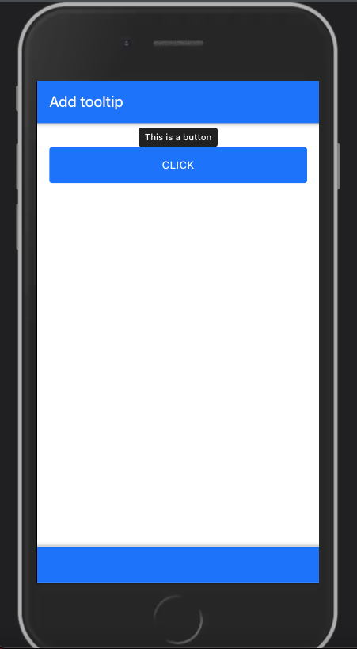

# Design widgets {#mobile-widgets}
Framework7 brings dozens of different __widgets__ like a photo browser, virtual lists (high performance lists), messages, notifications and toasts. Figure \@ref(fig:mobile-widgets-examples) shows from left to right the chat widget, the floating action buttons and the gauges.

```{r mobile-widgets-examples, echo=FALSE, fig.show = "hold", out.width = "33%", fig.align = "default", fig.cap="Framework7 widgets. From left to right: chat, floating action button and gauges."}
knitr::include_graphics("images/mobile/mobile-widget-chat.png")
knitr::include_graphics("images/mobile/mobile-widget-fab.png")
knitr::include_graphics("images/mobile/mobile-widget-gauges.png")
```

Looking at the [documentation](https://v5.framework7.io/docs/), the API is most of the time always the same, that is, we create the widget:

```{r, echo=FALSE, results='asis'}
js_code <- "app.widget.create(parameters);"
code_chunk_custom(js_code, "js")
```

and we update, open or close it later:

```{r, echo=FALSE, results='asis'}
js_code <- "app.widget.update(newParameters);
app.widget.open();
app.widget.close();"
code_chunk_custom(js_code, "js")
```

I must admit, there are few deviations like the navbar (`app.navbar.show()`) or the modal [dialog](https://v5.framework7.io/docs/dialog.html#dialog-shortcuts), but we have enough common points to design a main wrapper that creates any widget and update/open/close it.

What we do below significantly simplifies the R/JS API by providing a general method to initialize and update some of those widgets.

::: {.warningblock data-latex=""}
As a reminder, the code examples shown throughout this chapter are gathered in the `{OSUICode}` package accessible here: https://github.com/DivadNojnarg/OSUICode/tree/1d42aa7531705954d3c21921c8bbb10623b20d12, specifically at https://github.com/DivadNojnarg/OSUICode/blob/1d42aa7531705954d3c21921c8bbb10623b20d12/R/shinyMobile.R#L151 for widgets. 
:::

## Build the UI
We know that JavaScript must receive a configuration object to create the widget instance.
As shown earlier in this book, there is a simple way to achieve this. Let's consider the [gauge](https://v5.framework7.io/docs/gauge.html) example: 

On the UI side, we expect to have:

```{r, echo=FALSE, results='asis'}
html_code <- '<div class="gauge"></div>'
code_chunk_custom(html_code, "html")
```

Upon widget instantiation, Framework7 populates this container with the relevant tags and attributes. The `f7_gauge()` function creates a `div` tag with the `gauge` class, as well as a configuration tag:

```{r, eval=FALSE}
f7_gauge <- function(id, value, options = NULL) {

  if (is.null(options[["valueText"]])) {
    options[["valueText"]] <- paste(value * 100, "%")
  }

  gaugeProps <- c(list(value = value), options)

  gaugeConfig <- shiny::tags$script(
    type = "application/json",
    `data-for` = id,
    jsonlite::toJSON(
      x = gaugeProps,
      auto_unbox = TRUE,
      json_verbatim = TRUE
    )
  )

  shiny::tags$div(
    class = "gauge",
    id = id,
    gaugeConfig
  )
}
```

We provide a default for the `valueText` option that should display the current
value followed by a `%` symbol. Note that the class is crucial to target the relevant tag on the JS side. All other widgets more or less follow the same scheme. Be careful about __partial matching__
with the `$` operator. This is the reason why we used `[[` instead: with `$`, `valueText` could be
matched with `valueTextColor`, leading to unexpected behavior.


## Widgets without preexisting UI
There are few widgets like __toasts__ and __notifications__ that don't have any predefined UI element when the app starts. In this case, we simply send the configuration to JS, through the __session__:

```{r, eval=FALSE}
f7_notif <- function(
  id = NULL, 
  text, 
  options = NULL, 
  session = shiny::getDefaultReactiveDomain()
) {

  if (!is.null(options$icon)) {
    options$icon <- as.character(options$icon)
  }

  message <- c(
    dropNulls(list(id = session$ns(id), text = text)), 
    options
  )
  # see my-app.js function
  session$sendCustomMessage("notification", message)

}
```

Pay attention to the `options$icon` element. As we can't convert Shiny tags to __JSON__, it
must be converted to character first. If multiple parameters should contain tags, you must treat them accordingly.

## Initialize the widget {#mobile-widgets-initialize}
On the JS side, we create a new script, `widgets.js`: 

```{r, eval=FALSE}
library(charpente)
create_js("widgets")
```

We set an array containing all compatible widget names in two categories and concatenate
in a `widgets` element:

```{r, echo=FALSE, results='asis'}
js_code <- "const uiWidgets = ['gauge', 'swiper', 'searchbar'];
const serverWidgets = ['toast', 'photoBrowser', 'notification'];
const widgets = uiWidgets.concat(serverWidgets);"
code_chunk_custom(js_code, "js")
```

Notice that as we are going to use the `app` object, we import them from the `init.js` script, located
in the same `./srcjs` folder.

We then define the `activateWidget` function, only considering UI widgets. 

```{r, echo=FALSE, results='asis'}
js_code <- "const activateWidget = (widget) => {
 // function logic
};"
code_chunk_custom(js_code, "js")
```

Since we have two widgets categories, this function first checks whether the widget is part of the `uiWidgets` array with `indexOf`:

```{r, echo=FALSE, results='asis'}
js_code <- "const activateWidget = (widget) => {
  if (uiWidgets.indexOf(widget) > -1) {
    // Init widget
  }
};"
code_chunk_custom(js_code, "js")
```

As there may be multiple widgets of the same type, we must loop through all
possible elements. This is where the class is important and must match the widget generic name.
For instance, the gauge has the `gauge` class, and the methods are always `app.gauge.`.
How do we loop through multiple widgets? We use the jQuery `each` method:

```{r, echo=FALSE, results='asis'}
js_code <- "const activateWidget = (widget) => {
  if (uiWidgets.indexOf(widget) > -1) {
    $('.' + widget).each(function() {
      // Init widget
    }
  }
};"
code_chunk_custom(js_code, "js")
```

We see that `$('.' + widget)` gives `$('.gauge')` when the widget is a gauge, which
targets all gauges one by one. Then for each gauge, we extract the configuration containing
all options passed by the end user. Remember that each element has a unique id. 
We extract the current element `$(this)` in the `$el` variable and search for a 
script tag pointing to the unique tag having `$el.attr('id')` as id. The configuration is parsed
and converted to an object. Note that most of the time, Framework7 expects to have `el`
attributes which simply contain the CSS selector of the current element, 
in other words its unique id `'#' + $el.attr('id')`:

```{r, echo=FALSE, results='asis'}
js_code <- "let $el = $(this);
let config = $(document).find(
  'script[data-for=\"' + $el.attr('id') + '\"]'
);
config = JSON.parse(config.html());
// add the id
config.el = '#' + $el.attr('id');"
code_chunk_custom(js_code, "js")
```

The final step consists of initializing the widget, which is quite straightforward if we notice that
`app.gauge` is the same as `app["gauge"]`. We obtain the general code:

```{r, echo=FALSE, results='asis'}
js_code <- "app[widget].create(config);"
code_chunk_custom(js_code, "js")
```

For the server widgets, it is even simpler. We recover the message with a `Shiny.addCustomMessageHandler("type", callback)` and
initialize it. The only possible source of problem is the custom message `type` that must be the same 
as the one specified in the R function with `session$sendCustomMessage("type", message)`. As shown in the below code, we can chain methods and immediately open the widget, right after its creation. Moreover, it is always good practice to let Shiny know about the widget state, that is whether it is currently opened. This is the reason why we added an `on` property to the message. All widgets trigger [events](https://v5.framework7.io/docs/notification.html#dom-events), 
for instance, notifications have the `notification:opened` and `notification:closed`. For each event, we set an input value on the fly, with `Shiny.setInputValue` as explained in section \@ref(quick-inputs). This way, our future users can know exactly when the widget is closed or opened, thereby being able to trigger any subsequent action. This obviously requires the widget to pass an optional `id` attribute to ensure the uniqueness.

```{r, echo=FALSE, results='asis'}
js_code <- "// Server widget logic
Shiny.addCustomMessageHandler(widget, function(message) {
  if (message.id !== undefined) {
    message.on = {
      opened: function() {
        Shiny.setInputValue(message.id, true);
      },
      closed: function() {
        Shiny.setInputValue(message.id, false);
      }
    }; 
  }

  app[widget].create(message).open();
});"
code_chunk_custom(js_code, "js")
```

We create an `else` statement following the `if` condition (handling the UI widgets) and put the server widget logic inside:

```{r, echo=FALSE, results='asis'}
js_code <- "const activateWidget = (widget) => {
  if (uiWidgets.indexOf(widget) > -1) {
    // UI widget logic
  } else {
    // Server widget logic
  }
};"
code_chunk_custom(js_code, "js")
```

The full JavaScript code may be found [here](https://github.com/DivadNojnarg/outstanding-shiny-ui-code/blob/5bc49eab9496696a06da3f62d6aaf8ef468cdad4/srcjs/widgets.js#L7).

The final step aims at activating all widgets. We proceed with a `forEach` loop:

```{r, echo=FALSE, results='asis'}
js_code <- "// Loop over all widgets to activate them
widgets.forEach(function(w) {
  activateWidget(w);
});"
code_chunk_custom(js_code, "js")
```

Let's try below with a notification example, where we capture the state of the notification in an input element. This triggers another notification on the server side, in another `observeEvent()`. 

```{r, echo=FALSE, results='asis'}
code_chunk(OSUICode::get_example("shinyMobile/notification"), "r")
```

```{r mobile-shinyMobile-notification, echo=FALSE, fig.cap='Notification widget (top).', out.width='100%'}

```

## Update widgets {#mobile-widgets-update}
We would like to develop a similar generalized interface to update any element in the DOM. Instead of having a collection of function like `update_f7_gauge()` or `update_f7_swiper()`, we want a single `update_f7_instance()` function, which will be easier to maintain.  

We leverage the `app.data` element (see Chapter \@ref(mobile-global-data)) to store all instances by widget type. Inside `helper_config.js`, we add a empty gauge array to `config.data`:

```{r, echo=FALSE, results='asis'}
js_code <- "config.data = function() {
  return {
    // any other widget type to cache ...
    gauge: []
  };
};"
code_chunk_custom(js_code, "js")
```

The array name must be the same as the app method. For instance,
we have `app.gauge`, which means that we should create `config.data.gauge` and not `config.data.gauges`, as it would lead to errors later.

Once the cache is available, we have to modify the JavaScript, which creates the widget instance,
to store the new instance in the cache, as shown Figure \@ref(fig:mobile-widget-store). We add the following code, where `w` refers to the widget instance:

```{r, echo=FALSE, results='asis'}
js_code <- "// ui widgets
app.data[widget][$el.attr('id')] = w;"
code_chunk_custom(js_code, "js")
```

::: {.noteblock data-latex=""}
This manipulation does not make sense for server widgets 
as they are already generated by the server.
:::

The `activateWidget` function should be:

```{r, echo=FALSE, results='asis'}
js_code <- "// Instantiate a widget
const activateWidget = (widget) => {
  // Handle ui side widgets
  if (uiWidgets.indexOf(widget) > -1) {
    $('.' + widget).each(function() {
      // unchanged

      // feed the create method
      let w = app[widget].create(config);
      // Store the widget instance in the app data cache
      app.data[widget][$el.attr('id')] = w;
    });
  } else {
    // Server widgets logic
    // Unchanged
  }
};"
code_chunk_custom(js_code, "js")
```

Once done, this is time to design `update_f7_instance()`. The R code sends a message to
the current session containing:

  - The __id__ of the element to update.
  - The new __configuration__.
  
Since we send a __JSON__, the hardest part is to correctly process shiny tags. How do we track shiny tags? As a reminder, let's run the code below:

```{r}
class(shiny::div())
class(shiny::tagList(shiny::div(), shiny::h1()))
```

For each configuration element, we must check whether its class contains `shiny.tag` or `shiny.tag.list` and convert it to a character. Moreover, it may contain a nested list, like this:

```{r, eval = FALSE}
options = list(
  buttons = list(
   list(
     text = "Some text",
     icon = f7Icon("info"),
     color = "pink"
   )
  )
)
```

In that case, our function must be __recursive__ to handle any item having the `list` class. If the element is simple text or numeric, we return it as is.

We finally get:

```{r, eval=FALSE}
update_f7_instance <- function(
  id, 
  options, 
  session = shiny::getDefaultReactiveDomain()
) {

  # Convert any shiny tag into character so that toJSON 
  # does not cry
  listRenderTags <- function(l) {
    lapply(
      X = l,
      function(x) {
        if (inherits(x, c("shiny.tag", "shiny.tag.list"))) {
          as.character(x)
        } else if (inherits(x, "list")) {
          # Recursive part
          listRenderTags(x)
        } else {
          x
        }
      }
    )
  }
  options <- listRenderTags(options)

  message <- list(id = session$ns(id), options = options)
  session$sendCustomMessage("update-instance", message)
}
```

On the JS side, we receive the message, still in the `widget.js` script:

```{r, echo=FALSE, results='asis'}
js_code <- "Shiny.addCustomMessageHandler(
  'update-instance', 
  function(message) {
    // Treat message ...
  }
);"
code_chunk_custom(js_code, "js")
```

All widgets are stored by __type__ in the app data, for instance, the element having a unique id
`mygauge` is located in `app.data['gauge']['mygauge']`. As there is no easy way to recover the widget type given its id, the first step of the message handler is to find where our instance is located. We design a nested __for__ loop. The outer loop scans all `app.data` __properties__ (i.e. widget categories), while the inner loop scans all existing instances for each category. Whenever, the `message.id` matches the instance name, we store the corresponding widget category in a variable:

```{r, echo=FALSE, results='asis'}
js_code <- "let instanceFamily;
for (const property in app.data) {
  for (const e in app.data[property]) {
    if (e === message.id) {
      instanceFamily = property;
    }
  }
}"
code_chunk_custom(js_code, "js")
```

We then access the old instance using the newly defined variable and the `message.id`.
We capture its parameters located in `oldInstance.params`. From there, multiple options are available:

  - We extend the old configuration with the new one.
  - We entirely overwrite the existing options. 
  
In what follows, we decided to merge the old and new configurations using `app.utils.extend`:

```{r, echo=FALSE, results='asis'}
js_code <- "let oldInstance = app.data[instanceFamily][message.id];
let oldConfig = oldInstance.params;
let newConfig = app.utils.extend(oldConfig,  message.options);"
code_chunk_custom(js_code, "js")
```

The next steps consist of destroying the old instance, initializing the new instance, and refreshing 
the `app.data` cache:

```{r, echo=FALSE, results='asis'}
js_code <- "// Destroy old instance
oldInstance.destroy();
// Create new config
let newInstance = app[instanceFamily].create(newConfig);
// Update app data
app.data[instanceFamily][message.id] = newInstance;"
code_chunk_custom(js_code, "js")
```

The whole code can be found [here](https://github.com/DivadNojnarg/outstanding-shiny-ui-code/blob/5bc49eab9496696a06da3f62d6aaf8ef468cdad4/srcjs/widgets.js#L55).
The update concept is illustrated Figure \@ref(fig:mobile-widget-store).

```{r mobile-widget-store, echo=FALSE, fig.cap='Initializing and updating widgets in the app.data store.', fig.align = 'center', out.width='100%'}
knitr::include_graphics("images/mobile/mobile-widget-store.png")
```

The code below is an example showing how to update a gauge from the server (Figure \@ref(fig:mobile-widget-update-gauge)). As you may notice, this
approach is not perfect as the user has to explicitly update the `valueText` field so that
it reflects the new value. Similarly, you may ask why the gauge value has to be between 0 and 1,
instead of 0 and 100. The reason comes from the Framework7 API. You might be tempted to convert the value inside `f7_gauge()` (so that the user only provides a number between 0 and 100), but
this would also mean having to manually convert the value in the `update_f7_instance()` function later. As stated in previous chapters, there is always a compromise between a simple API that is easy for the developer to maintain and the user's experience. This issue may/should be solved with comprehensive documentation.

```{r, echo=FALSE, results='asis'}
code_chunk(OSUICode::get_example("shinyMobile/update-gauge"), "r")
```

```{r mobile-widget-update-gauge, echo=FALSE, fig.cap='Update gauge on the server side. We inspect app.data.gauge within the JS console.', fig.align = 'center', out.width='100%'}
knitr::include_graphics("images/mobile/mobile-widget-update-gauge.png")
```

::: {.noteblock data-latex=""}
If you don't see the `Install` button, copy over the `www` folder from your PWA app.
:::

## More complex elements
We consider the `tooltip` [example](https://v5.framework7.io/docs/tooltip.html). A tooltip is a help text generally displayed on hover (or click) over a specific element. They are commonly used to improve user experience in all websites. Framework7 provides two tooltips APIs:

  - A purely-UI side API where the tooltip is attached to a tag.
  - A server-side API where the tooltip is dynamically injected in the page content.
  
While the first approach is obviously not interesting for us since it does not involve a single line of JS, the second approach heavily relies on the `app.data` object. This is the one we choose to study. 

### Add a tooltip
In the following, we design the `add_f7_tooltip()` function that may be added right after the existing gauge and notification widgets. Since a tooltip is attached to a DOM element, `add_f7_tooltip()` must provide parameters to identify its target, that is either __id__ or CSS __selector__, but not both. Therefore, we create a helper function, `validate_selector()`, that checks if the end user provides `id` or `selector`. 

```{r, eval=FALSE}
validate_selector <- function(id, selector) {
  if (!is.null(id) && !is.null(selector)) {
    stop("Please choose either target or selector!")
  }
}
```
   
`%OR%` ensures that we return `a` if not `NULL` otherwise `b`.

```{r, eval=FALSE}
"%OR%" <- function(a, b) if (!is.null(a)) a else b
```

`add_f7_tooltip()` sends the tooltip target, as well a list of options to JS with the `add_tooltip` identifier.

```{r, eval=FALSE}
add_f7_tooltip <- function(
  id = NULL, 
  selector = NULL, 
  options,
  session = shiny::getDefaultReactiveDomain()
) {
  # We use already defined popover functions
  validate_selector(id, selector)
  if (!is.null(id)) id <- paste0("#", session$ns(id))
  options$targetEl <- id %OR% selector
  session$sendCustomMessage("add_tooltip", options)
}
```

On the JS side within `widgets.js`, we recover the message by building a custom message handler with `Shiny.addCustomMessageHandler` pointing to `add_tooltip`. Again, if there is a mismatch between R and JS __type__, the API won't work. Like all Framework7 widgets,
creating a tooltip is rather straightforward:

```{r, echo=FALSE, results='asis'}
js_code <- "Shiny.addCustomMessageHandler('add_tooltip', function(message) {
  app.tooltip.create(message).show();
});"
code_chunk_custom(js_code, "js")
```

As mentioned earlier, this syntax is fine since `message` is a JSON element and we can also chain methods. There is however a problem: `add_tooltip` is fired
each time the user triggers a specific element on the R side. It means the tooltip __instance__ is 
created each time, which is not optimal. To fix this issue, we set a tooltips cache in the `app.data` object and accordingly modify `helpers_config.js`:

```{r, echo=FALSE, results='asis'}
js_code <- "config.data = function() {
  return {
    gauge: [], 
    tooltips: []
  };
};"
code_chunk_custom(js_code, "js")
```

We update the previous custom handler so that we:

  - Check if the tooltip instance is already in the cached `app.data` before creating an instance. If is is already there, nothing has to be done.
  - Each time we create a new instance, we save it in the `app.data` cache to retrieve it later.
  
```{r, echo=FALSE, results='asis'}
js_code <- "Shiny.addCustomMessageHandler('add_tooltip', function(message) {
  // We store all created instances in app data so that we don't
  // recreate them later if they exist ...
  if (app.data.tooltips[message.targetEl] === undefined) {
    // create instance
    let t = app.tooltip.create(message);
    // Open tooltip
    t.show();
    // Storage in app data (tooltips array)
    app.data.tooltips[message.targetEl] = t;
  }
});"
code_chunk_custom(js_code, "js")
```  

We store the current instance with `app.data.tooltips[message.targetEl] = t;`.
The __reference__ is given by `message.targetEl` that is the target to apply the tooltip on. When multiple tooltips are created, we may search for them by target name, which is a reasonable choice. For instance, `app.data.tooltips["#mybutton"]` points to the tooltip associated with the element having `#mybutton` as id. So far so good!

```{r, echo=FALSE, results='asis'}
code_chunk(OSUICode::get_example("shinyMobile/add-tooltip"), "r")
```

```{r mobile-widget-add-tooltip, echo=FALSE, fig.cap='Create a tooltip on the server and attach it to a DOM element.', fig.align = 'center', out.width='30%'}

```

### Update a tooltip
Framework7 does not provide any native `enable/disable` method, which means that once the tooltip is activated on a given element, it is visible forever (Figure \@ref(fig:mobile-widget-add-tooltip)), unless destroyed.
The main purpose of `update_f7_tooltip()` is to avoid this, by temporarily disabling any tooltip and reactivating it later. Like for `add_f7_tooltip()`, we may target either by `id` or provide a more complex CSS selector. We support two actions: toggle the tooltip (enable/disable) and update, that is, change data like the displayed text.

```{r, eval=FALSE}
update_f7_tooltip <- function(
  id = NULL, 
  selector = NULL,
  action = c("toggle", "update"), 
  text = NULL,
  session = shiny::getDefaultReactiveDomain()
) {
  validate_selector(id, selector)
  if (!is.null(id)) id <- paste0("#", session$ns(id))
  targetEl <- id %OR% selector
  message <- dropNulls(
    list(
      targetEl = targetEl, 
      action = action, 
      text = text
    )
  )
  session$sendCustomMessage("update_tooltip", message)
}
```

`update_f_tooltip()` sends three elements to JS, namely the tooltip target element `message.targetEl`, the optional new text, that is `message.text` and the action to perform `message.action` (either update or toggle state).
   
The corresponding JS handler:

  - Checks if the specified tooltip instance exists and only update if it is the case.
  - Handles two situations: updating the tooltip content or toggling the tooltip visibility.
  It is actually more than just showing/hiding the tooltip. Remember that each tooltip is shown
  on hover so applying hide on a visible tooltip will only have effect until the user
  hovers again over the same tooltip, which is useless.
  
In `widgets.js`, right after the `add_tooltip` handler, we add the `update` logic, that consists in changing the text:

```{r, echo=FALSE, results='asis'}
js_code <- "Shiny.addCustomMessageHandler(
  'update_tooltip', function(message) {
  // Don't do anything if the instance is not there in app data
    if (app.data.tooltips[message.targetEl] !== undefined) {
      let t = app.data.tooltips[message.targetEl];
      if (message.action === 'update') {
        t.setText(message.text);
      }
    }
});"
code_chunk_custom(js_code, "js")
```

The corresponding tooltip instance is accessed in `app.data` with `app.data.tooltips[message.targetEl]`
and stored in a local variable, `t`. We apply the Framework7 tooltip [method](https://v5.framework7.io/docs/tooltip.html#tooltip-app-methods) `setText` only if the user action corresponds to `update`.

The next step is to handle the `toggle` case. We check whether the current instance is active, applying the `app.tooltip.get` method on `message.targetEl`. If the instance is alive, we get an object, while we obtain undefined if it does not exist. We then call the `app.tooltip.destroy` method on the current instance:

```{r, echo=FALSE, results='asis'}
js_code <- "Shiny.addCustomMessageHandler(
  'update_tooltip', function(message) {
    // Don't do anything if the instance is not there in app data
    if (app.data.tooltips[message.targetEl] !== undefined) {
      let t = app.tooltip.get(message.targetEl);
      if (message.action === 'update') {
        t.setText(message.text);
      } else if (message.action === 'toggle') {
        // destroy
        if (t) {
          t.destroy();
        }
      }
    }
});"
code_chunk_custom(js_code, "js")
```

Wait a moment ... There are two issues with this code. As `t` is a variable pointing
to the current instance, if we destroy that instance, `t` will point to a destroyed element the next time it is called, and any action like `setText` will raise an error. The trick is to create a shallow clone with `Object.assign` that won't be affected by the `destroy` method, save the shallow clone in the `app.data` cache and destroy the old instance. Therefore, we update the `tooltips.js` script:

```{r, echo=FALSE, results='asis'}
js_code <- "Shiny.addCustomMessageHandler(
  'update_tooltip', function(message) {
    if (app.data.tooltips[message.targetEl] !== undefined) {
      // Try to get the instance
      let t = app.tooltip.get(message.targetEl);
      if (message.action === 'update') {
        if (t) {
          t.setText(message.text);
        }
      } else if (message.action === 'toggle') {
        if (t) {
          // create copy that won't be modified if 
          // t is destroyed!
          let cachedTooltip = Object.assign({}, t);
          // save copy to replace the deleted one in the app data
          app.data.tooltips[message.targetEl] = cachedTooltip;
          // destroy current instance
          t.destroy();
        } 
      }
    }
});"
code_chunk_custom(js_code, "js")
```

We also check whether the instance is alive before updating it. We are still missing the `re-activation` step that consists in rebuilding the tooltip instance based on the cached data `app.data.tooltips[message.targetEl]` previously saved. All parameters are contained in the `params` object (instance element):

```{r, echo=FALSE, results='asis'}
js_code <- "// Capture parameters
let pars = app.data.tooltips[message.targetEl].params;
// Recreate the tooltip based on the copy configuration
t = app.tooltip.create(pars);
// Replace the app data instance
app.data.tooltips[message.targetEl] = t;"
code_chunk_custom(js_code, "js")
```

The final JS code is:

```{r, echo=FALSE, results='asis'}
js_code <- "Shiny.addCustomMessageHandler(
  'update_tooltip', function(message) {
  if (app.data.tooltips[message.targetEl] !== undefined) {
    // Unchanged
    if (message.action === 'update') {
      // Unchanged
    } else if (message.action === 'toggle') {
      if (t) {
        // Unchanged
      } else {
        // Capture parameters
        let pars = app.data.tooltips[message.targetEl].params;
        // Recreate the tooltip based on the copy configuration
        t = app.tooltip.create(pars);
        // Replace the app data instance
        app.data.tooltips[message.targetEl] = t;
      }
    }
  }
});"
code_chunk_custom(js_code, "js")
```

You may find an example below.

```{r, echo=FALSE, results='asis'}
code_chunk(OSUICode::get_example("shinyMobile/update-tooltip"), "r")
```