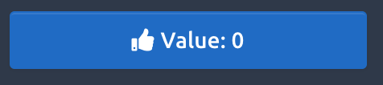
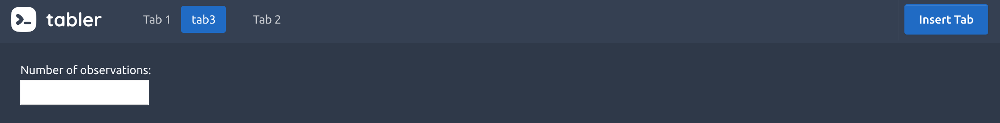

--- 
title: "Outstanding User Interfaces with Shiny"
author: "David Granjon"
date: "`r Sys.Date()`"
site: bookdown::bookdown_site
output: bookdown::gitbook
documentclass: book
bibliography: [book.bib, packages.bib]
biblio-style: apalike
link-citations: yes
github-repo: rstudio/bookdown-demo
description: "This book will serve as content for the 2020 erum workshop."
---

# Prerequisites {-}

  - Be familiar with [Shiny](https://mastering-shiny.org)
  - Basic knowledge in HTML and JavaScript is a plus but not mandatory

## Disclaimer {-}

This book is not an HTML/Javascript/CSS course! Instead, it provides a _survival kit_ to be able to customize Shiny. I am sure however that readers will want to explore more about these topics.

## Is this book for me? {-}

You should read this book if you answer yes to the following questions:

  - Do you want to know how to develop outstanding shiny apps?
  - Have you ever wondered how to develop new input widgets?
  

## Related content {-}

See the [RStudio Cloud](https://rstudio.cloud) dedicated project.
This book will serve as a reference for the e-Rum2020 [workshop](https://2020.erum.io/program/workshops/) about "Advanced User Interfaces for Shiny Developers", provided by [Novartis](https://www.novartis.com). The detailed agenda is available [here](https://github.com/Novartis/Advanced-User-Interfaces-for-Shiny-Developers).

## Acknowledgements {-}
- I am very grateful to Douglas Robinson for proof reading the book and fixing many typos it contained.
- A special thanks to my friends John and Victor for contributing to RinteRface. By contribution, I am not meaning only code contribution but also support in any form.
- Thanks to the eRum organizers for giving me the opportunity to present this work at the virtual [e-Rum2020](https://2020.erum.io) conference
- RinteRface and this book won't exist without the amazing R community. Thanks for their valuable feedback.


## Packages {-}
```{r setup}
library(shiny)
library(shinydashboard)
library(cascadess)
library(htmltools)
library(purrr)
library(magrittr)
library(ggplot2)
library(thematic)
library(fresh)
library(testthat)
library(jstools)
library(scales)
library(dplyr)
library(apexcharter)
library(shinyWidgets)
```

```{r include=FALSE}
# automatically create a bib database for R packages
knitr::write_bib(c(
  .packages(), 'bookdown', 'knitr', 'rmarkdown'
), 'packages.bib')
```

<!--chapter:end:index.Rmd-->

\mainmatter

# Introduction {#intro}

There are various Shiny focused resources introducing [basic](https://shiny.rstudio.com/tutorial/) as well as advanced topics such as [modules](https://shiny.rstudio.com/articles/#modules) and [Javascript/R](https://js4shiny.com) interactions, however, handling advanced user interfaces design was never an emphasis. Clients often desire custom templates, yet this generally exceeds core features of Shiny (not out of the box). 

Generally, R App developers lack a significant background in web development and often find this requirement overwhelming. It was this sentiment that motivated writing this book, namely to provide readers the necessary knowledge to extend Shiny's layout, input widgets and output elements. This project officially started at the end of 2018 but was stopped when Joe Cheng revealed the upcoming [Mastering Shiny Book](https://mastering-shiny.org). Fortunately, the later, does not cover a lot about the customization of Shiny user interfaces. Besides, this book may constitute a good complement to the work in progress [Engineering Production-Grade Shiny Apps](https://engineering-shiny.org) by the ThinkR team, where the link between Shiny and CSS/JavaScript is covered. 

This book is organized into five parts. 

  - We first go through the basics of HTML, JavaScript and jQuery 
  - Part 2 contains chapters dedicated to the partially hidden features of Shiny, yet so fun. We dedicate an entire chapter to describe how inputs work in detail and how to add new inputs to the system
  - In part 3, we dive into the `{htmltools}` package, providing functions to create and manipulate shiny tags as well as manage dependencies 
  - Part 4 focuses on the development of a new template for Shiny by demonstrating examples from the `{tablerDash}`, `{bs4Dash`} and `{shinyMobile}` packages. These, and more may be explored further as part of the RinteRface project.
  - Part 5 present some tools of the R community, like `{fresh}`, to beautify apps with only few lines of code
  
## About the code
This book has a side package containing all the necessary material to run the code without having to reload each previous snippet.

```{r, eval=FALSE}
remotes::install_github("DivadNojnarg/outstanding-shiny-ui-code
")
```

It covers Chapters \@ref(shiny-input-system), \@ref(shiny-custom-handler) and the whole Practice section.

There is another good reason for this package: provide a robust method to bundle JavaScript/CSS code along side any shiny app. Indeed, it is quite tempting to proceed as below:

```{r, eval=FALSE}
ui <- fluidPage(
  tags$script(
    "$(function() {
      Shiny.addCustomMessageHandler('hello', function(message) {     alert(message); 
      });
    });
    "
  ),
  actionButton("go", "Send")
)

server <- function(input, output, session) {
  observeEvent(input$go, {
    session$sendCustomMessage("hello", message = "plop")
  })
}

shinyApp(ui, server)
```

It is fine if the app purpose is a simple demonstration. In our case, since we aim at providing reusable template elements, we need a better approach, that will be described later.

## Preliminary exercices
Before starting with technical details, we propose to play a little game. Among all the images shown, what are the ones corresponding to shiny apps? Images are numbered from A to F (left to right, top to bottom).

```{r shiny-guess1, echo=FALSE, fig.show = "hold", out.width = "50%", fig.align = "default"}
knitr::include_graphics("images/intro/deminR.png")
knitr::include_graphics("images/intro/shinyMons.png")
```

```{r shiny-guess2, echo=FALSE, fig.show = "hold", out.width = "50%", fig.align = "default"}
knitr::include_graphics("images/intro/nifty.png")
knitr::include_graphics("images/intro/virtual_patient.png")
```

```{r shiny-guess3, echo=FALSE, fig.show = "hold", out.width = "50%", fig.align = "default"}
knitr::include_graphics("images/intro/covid-tracker.png")
knitr::include_graphics("images/intro/tabler.png")
```

<!--chapter:end:intro.Rmd-->

# (PART\*) Survival Kit {-}

This part will give you basis in HTML, JavaScript to get started...

<!--chapter:end:survival-kit.Rmd-->

# HTML {#survival-kit-html}
This chapter provides a short introduction to the HTML language. As a quick example, open up RStudio and perform the following:

  - Load shiny with `library(shiny)` 
  - Execute `p("Hello World")` 
  
Notice the output format is an example of an HTML tag!

## HTML Basics
HTML (Hypertext Markup Language) is derived from SGML (Standard Generalized markup Language). An HTML file contains tags that may be divided into 2 categories:

  - paired-tags: the text is inserted between the opening and the closing tag
  - closing-tags

```html
<!-- paired-tags -->
<p></p>
<div></div>

<!-- self-closing tags -->
<iframe/>

<input/>
<br/>
```

Tags may be divided into 3 categories, based on their role:

  - structure tags: they constitute the skeleton of the HTML page (`<title></title>`, `<head></head>`, `<body></body>`)
  - control tags: script, inputs and buttons (and more). Their role is to include external resources, provide interactivity with the user
  - formatting tags: to control the size, font of the wrapped text
  
Finally, we distinguish block and inline elements:

  - block elements may contain other tags and take the full width (block or inline). `<div></div>` is the most commonly used block element. All elements of a block are printed on top of each others
  - inline elements (for instance `<span></span>`, `<a></a>`) are printed on the same line. They can not contain block tags but may contain other nested inline tags. In practice, we often see `<a><span></span></a>` 
  - inline-block elements allow to insert block element in an inline 
  
Consider the following example. This is clearly a bad use of HTML conventions since an inline tag can not host block elements.

```html
<span>
  <div><p>Hello World</p></div>
  <div></div>
</span>
```

Importantly, `<div>` and `<span>` don't have any semantic meaning, contrary to `<header>` and `<footer>`, which allow to structure the HTML page.

## Tag attributes
Attributes are text elements allowing to specify some properties of the tag. For instance for a link tag (`<a></a>`), we actually expect more than just the tag itself: a target url and how to open the new page ... In all previous examples, tags don't have any attributes. Yet, there exist a large range of attributes and we will only see 2 of them for now (the reason is that these are the most commonly used in CSS and JavaScript):

  - class: may be shared between multiple tags
  - id: each must be unique
  
```html
<div class="awesome-item" id="myitem"></div>
<!-- the class awesome-item may be applied to multiple tags -->
<span class="awesome-item"></span>
```

Both attributes are widely used by CSS and JavaScript (see Chapter \@ref(survival-kit-javascript) with the jQuery selectors) to apply a custom style to a web page. Class attributes apply to multiple elements, however the id attribute is restricted to only one item.

Interestingly, there exists another attribute category, know as non-standard attributes like `data-toggle`. We will see them later in the book (see Chapter \@ref(custom-templates-skeleton)).


## HTML page: skeleton
An HTML page is a collection of tags which will be interpreted by the web browser step by step. The simplest HTML page may be defined as follows:

```html
<!DOCTYPE HTML>
<html>
  <head>
  <!-- head content here -->
  </head>
  <body>
  <!-- body content here -->
  </body>
</html>
```

  - `<html>` is the may wrapper
  - `<head>` and `<body>` are the 2 main children
    * `<head>` contains dependencies like styles and JavaScript files (but not only), 
    * `<body>` contains the page content and it is displayed on the screen. We will see later that JavaScript files are often added just before the end of the `<body>`.

<br/>
<div class="callout callout-warning">
Only the body content is displayed on the screen!
</div>
<br/>
  
Let's write the famous Hello World in HTML:
  
```html
<!DOCTYPE HTML>
<html>
  <head>
  <!-- head content here -->
  </head>
  <body>
  <p>Hello World</p>
  </body>
</html>
```

In order to preview this page in a web browser, you need to save the above snippet to a script `hello-world.html` and double-click on it. It will open with your default web browser.


## About the Document Object Model (DOM)
The DOM stands for "Document Object Model" and is a convenient representation of the html document. There actually exists multiple DOM types, namely DOM-XML and DOM-HTML but we will only focus on the latter. If we consider the last example (Hello World), the associated DOM tree may be inspected in Figure \@ref(fig:html-dom).

### Visualizing the DOM: the HTML inspector
Below, we introduce a tool that will facilitate our exploration of beautiful shiny user interfaces. In this section, we restrict the description to the first panel of the HTML inspector [^inspector]. This feature is available in all web browser, however for demonstration purposes, we will only focus on Chrome.

   - Open the hello-world.html example in a web browser (google chrome [here](https://www.google.com/chrome/))
   - Right-click to open the HTML inspector (developer tools must be enabled if it is not the case)
   
The HTML inspector is a convenient tool to explore the structure of the current HTML page. On the left-hand side, the DOM tree is displayed where we clearly see that `<html>` is the parent of `<head>` and `<body>`. `<body>` has also 1 child, that is `<p>`. We may preview any style (CSS) associated to the selected element on the right panel as well as Event Listeners (JavaScript), which will be discussed that in the next chapter.

```{r html-dom, echo=FALSE, fig.cap='Inspection of the DOM in the Hello World example'}
knitr::include_graphics("images/survival-kit/dom.png")
```

[^inspector]: As shown in Figure \@ref(fig:html-dom), the inspector also has tools to debug JavaScript code, inspect files, run performances audit, ... We will describe some of these later in the book.


## Preliminary introduction to CSS and JavaScript
To introduce this section, I propose to look at the very first website, early in the 90's (August 1991 exactly). From an esthetic point of view (see Figure \@ref(fig:www-first)), this is far from what we can observe today as shown in Figure \@ref(fig:www-rinterface).

```{r www-first, echo=FALSE, fig.cap='World wide web website'}
knitr::include_graphics("images/survival-kit/www-first.png")
```

```{r www-rinterface, echo=FALSE, fig.cap='RinteRface website: https://rinterface.com'}
knitr::include_graphics("images/survival-kit/www-rinterface.png")
```

How can we explain that difference? One of the main reason is the absence of CSS (Cascading Style Sheet) since the first CSS release only appeared in December 1996, that is 5 years later than the first web site publication. CSS allows to deeply customize the appearance of any web page by changing colors, fonts, margins and much more. We acknowledge, the role of JavaScript cannot be demonstrated through the previous example. Yet its impact is as important as CSS, so that it is now impossible to dissociate HTML, CSS and JavaScript.

### HTML and CSS
CSS (Cascading Style Sheets) changes the style of HTML tags by targeting specific classes or ids. For instance, if we want all p tags to have red color we will use:

```css
p {
  color: red;
}
```

To include CSS in an HTML page, we use the `<style>` tag as follows:

```html
<!DOCTYPE HTML>
<html>
  <head>
    <style type="text/css">
      p {
        color: red;
      }
    </style>
  </head>
  <body>
  <p>Hello World</p>
  </body>
</html>
```

You may update the hello-world.html script and run it in your web-browser to see the difference. The example may be slight, but shows how we may control the look and feel of the display. In a development context, we will see later that css files may so big that it is better to include them in external files.

### HTML and JavaScript
You will see how quickly/seamlessly you may add awesome features to your shiny app.

Let's consider the following example:

```html
<!DOCTYPE HTML>
<html>
  <head>
    <style type="text/css">
      p {
        color: red;
      }
    </style>
    <script language="javascript">
      // displays an alert 
      alert('Click on the Hello World text!');
      // change text color
      function changeColor(color){
        document.getElementById('hello').style.color = "green";
      }
    </script>
  </head>
  <body>
    <!-- onclick attributes applies the JavaScript function changeColor define above -->
    <p id="hello" onclick="changeColor('green')">Hello World</p>
  </body>
</html>
```

In few lines of code, you can change the color of the text. This is only the beginning!

Let's move to the next chapter to discover JavaScript!

<!--chapter:end:survival-kit-html.Rmd-->

# JavaScript {#survival-kit-javascript}

## Introduction 
JavaScript (JS) was created in 1995 by Brendan Eich and is also known as ECMAScript (ES). Interestingly, you might have heard about ActionScript, which is no more than an implementation of ES by Adobe Systems. Nowadays, JavaScript is the centerpiece of web development across all websites. 

Here is a quick example. If you have a personal blog, you probably know Hugo or Jekyll. These tools allow one to rapidly develop a professional looking (or at least not too ugly) blog in just a few minutes. This allows bloggers to focus on the content, which is really the point! Now, if you open the HTML inspector introduced in Chapter \@ref(survival-kit-html), click on the elements tab, which may open by default, and uncollapse the `<head>` tag, you see that a lot of scripts are included, as shown in Figure \@ref(fig:scripts-list). Similarly for the `<body>` tag.

```{r scripts-list, echo=FALSE, fig.cap='A website is full of JavaScript'}
knitr::include_graphics("images/survival-kit/scripts-list.png")
```

There are 2 ways to include scripts:

  - Use the `<script>` tag with the JS code inside
  - Add the `onclick` attribute to a button to trigger JS as soon as it is clicked (This is similar to event listeners, see below)
  - Import an external file containing the JS code and only
  
```html
<script type="text/javascript">
// JS code here
</script>
```

```html
<!-- We use the src attribute to link the external file -->
<script type="text/javascript" src="file.js">
```

Whether to choose the first, second or third method depends on the content of your script. If we consider the JS library jQuery, it unfortunately contains so much code making it a challenge to understand. This often makes users avoid the first method.

## Setup
Like R or Python, JavaScript (JS) is an interpreted language, executed client-side, in other words in the browser. This also means that JS code may not be run without a suitable tool.

### Node
[Node](https://nodejs.org/en/) contains an interpreter for JS as well as a dependencies manager, npm (Node Package Manager). To install Node on your computer, browse to the website and follow the installation instructions. Afterwards, open a terminal and check if

```
$ which node
$ node --version
```
returns something. If not, Node may not be properly installed. 

### Choose a good IDE
Personally, I really like [VSCode](https://code.visualstudio.com) for coding with JS, as it contains a Node interpreter allowing you to seamlessly execute any JS code. As a side note, I encourage you to try the dracula color theme, which is my favorite! Many also chose the [Rstudio IDE](https://rstudio.com/products/rstudio/), provided that you have Node installed. Below, we will see how to run a JS code in both IDE's.

### First Script
Let's write our first script:

```javascript
console.log("Hello World");
```

You notice that all instruction end by `;`. You can run this script either in Rstudio IDE or VSCode. 

```{r script-vscode, echo=FALSE, fig.cap='Run JS in VSCode'}
knitr::include_graphics("images/survival-kit/script-vscode.png")
```

In VSCode, clicking on the run arrow (top center) of Figure \@ref(fig:script-vscode), triggers the `node hello.js` command, which tells Node to run the script. We see the result in the right panel (code=0 means the execution is fine and we even have the compute time). To run this script in the RStudio IDE, one needs to click on the terminal tab (you could also open a basic terminal) and type `node hello.js` (or `node mycustompath/hello.js` if you are not in the folder containing the script). You should see the Hello World message in the console (see Figure \@ref(fig:script-rstudio)).

```{r script-rstudio, echo=FALSE, fig.cap='Run JS in a terminal'}
knitr::include_graphics("images/survival-kit/script-rstudio.png")
```

## Programming with JS: basis
We are now all set to introduce the basis of JS. As many languages, JS is made of variables and instructions. All instructions end by the `;` symbol.

### JS types
JS defines several types:

  - Number: does not distinguish between integers and others (in R for instance, numeric contains integers and double)
  - String: characters ('blabla')
  - Boolean: true/false
  
To check the type of an element, we may use the `typeof` operator.

```javascript
typeof 1; // number
typeof 'pouic'; // string
```

<br>
<div class="callout callout-danger">
In JS, `typeof` is not a function like in R!!! Therefore don't write `typeof('string');`.
</div>
<br>

### Variables

Variables are key elements in programmation. They allow to store intermediate results and do other manipulations. In JS, a variable is defined by:

  - a type
  - a name
  - a value

<br>
<div class="callout callout-danger">
Valid variable names: 
<ul>
<li>don't use an existing name like typeof</li>
<li>don't start with a number (123soleil)</li>
<li>don't include any space (total price)</li>
</ul>
</div>
<br>

Besides, code style is a critical element in programming, increasing readability, and general consistence. There are several styles, the main ones being `snake_case` and `camelCase`. I personally use the camelCase syntax to write variables in JS. To set a variable we use `let` (there exists `var` but this is not the latest JS norm (ESMAScript 6 or ES6). You will see later that we still use `var` in the shiny core and many other R packages). 

There are two ways to create variables in JavaScript.

#### Const
In JavaScript, a variable may be created with `const`:

```javascript
const n = 1;
n = 2; // error
const n = 3; // error
const a;
a = 1; // errors
```

As shown above, such variables:

  - Cannot be modified
  - Cannot share the same name
  - Must be assigned a value


#### let
Another way to define a variable:

```javascript
let myVariable = 'welcome';
myVariable = 1;
console.log(myVariable);
```

Then we may use all mathematical operators to manipulate our variables.

```javascript
let myNumber = 1; // affectation
myNumber--; // decrement
console.log(myNumber); // print 0
```

<br>
<div class="callout callout-info">
List of numerical operators in JS: 
<ul>
<li>+</li>
<li>-</li>
<li>*</li>
<li>/</li>
<li>% (modulo)</li>
<li>++ (incrementation)</li>
<li>-- (decrementation)</li>
</ul>
</div>
<br>

To concatenate two strings, we use the`+` symbol. 

You may also know `var` to declare variables. What is the difference with `let`? It is mainly a scope [reason](https://www.w3schools.com/js/js_let.asp): 
```javascript
var i = 1;
{
  var i = 2; // this will modify i globally, not locally
}
console.log(`i is ${i}`); // i is 2.

let j = 1;
{
  let j = 2; // j is only declared locally and not globally!
}
console.log(`j is ${j}`); // j is 1
```

### Conditions
Below are the operators to check conditions.

<br>
<div class="callout callout-info">
<ul>
<li>== (A equal B)</li>
<li>!= (A not equal to B)</li>
<li>\> (>=)</li>
<li>< (<=)</li>
<li>AND (A AND B)</li>
<li>OR (A OR B)</li>
</ul>
</div>
<br>

To test conditions there exists several ways:

  - `if (condition) { console.log('Test passed'); }`
  - `if (condition) { instruction A} else { instruction B }`
  
This is very common to other languages (and R for instance). Whenever a lot of possible conditions need to be evaluated, it is better to choose the `switch`.


```javascript
switch (variable) {
  case val1: // instruction 1
  break; // don't forget the break!
  case val2:  // instruction 2
  break;
  default: // when none of val1 and val2 are satisfied
}
```


### Objects
JavaScript is an object oriented programming language (like Python). An object is defined by:

  - a type
  - some properties
  - some methods (to manipulate properties)
  
Let's define our first object below:

```javascript
const me = {
  name : 'Divad',
  age : 29,
  music : '',
  printName: function() {
    console.log(`I am ${this.name}`);
  }
}

me.geek = true; // works (see const variables above)
console.log(JSON.stringify(me)); // print a human readable object.
  
console.log(me.name);
console.log(me.age);
console.log(me.music);
// don't repeat yourself!!!
for (let key in me) { // here is it ok to use `in`
 console.log(`me[${key}] is ${me[key]}`);
}

me.printName();

me = {
  name: 'Paul',
  age: 40
} // error (see const variables above)
```

Some comments on the above code:

  - to access an object propertie, we use `object.propertie`
  - to print a human readable version of the object `JSON.stringify` will do the job
  - we introduced string interpolation with `${*}`. `*` may be any valid expression.
  - methods are accessed like properties (we may also pass parameters). We use `this` to refer to the object itself. Take note, we will see it a lot!
  
In JavaScript, we can find already predefined objects to interact with arrays, dates.

#### Arrays
An array is a structure allowing to store informations for instance

```javascript
const table = [1, 'plop'];
table.push('hello');
table = [2]; // error (as explain in above in the variable part)
console.log(table);
```

Array may be nested

```javascript
const nested = [1, ['a', [1, 2, 3]], 'plop'];
console.log(nested);
```

In arrays, elements may be accessed by their index, but as mentionned before, the first index is 0 (not 1 like in R). A convenient way to print all arrays's elements is to use an iteration:

```javascript
const nested = [1, ['a', [1, 2, 3]], 'plop'];
for (let i of nested) {
  console.log(i);
}

// or with the classic approach
for (let i = 0; i < nested.length; i++) {
  console.log(nested[i]);
}
```

Note that the `length` method returns the size of an array and is very convenient in for loops. Below is a table referencing the principal methods for arrays (we will use some of them later)

| Method/Property   |      Description     | 
|:----------:|:-------------:|
| length |  Return the number of elements in an array  | 
| Join(string separator) |  Transform an array in a string | 
| concat(array1, array2) |    Assemble 2 arrays   |  
| pop() | Remove the last element of an array |    
| shift() | Remove the first element of an array |
| unshift(el1, el2, ...) | Insert elements at the beginning of an array |
| push(el1, el2, ...) | Add extra elements at the end of an array |
| sort() | Sort array elements by increasing value of alphabetical order |
| reverse() | Symetric of sort() |

Quite honestly, we mainly use `push` and `length` in the next chapters.


#### Strings
Below are the main methods related to the String object (character in R)

| Method/Property/Operator   |     Description     | 
|:----------:|:-------------:|
| + (operator) |  String concatenation  | 
| length |  String length  | 
| indexOf() | Gives the position of the character following the input string |
| toLowerCase() | Put the string in small letters |
| toUpperCase() | Put the string in capital letters |


#### Math
Below we mention some useful methods to handle mathematical objects

| Method   |     Description     | 
|:----------:|:-------------:|
| parseInt() |  Convert a string to integer  | 
| parseFloat() |  Conversion to floating number  | 

All classic functions like `sqrt`, trigonometric functions are of course available. We call them with the `Math.*` prefix.


### Iterations
Iterations allow to repeat an instruction or a set of instructions multiple times. Let's assume we have an array containing 100000 random numbers. How would you do to automatically print them? This a what we are going to see below!

#### For loops
The for loop has multiple uses. Below is a classic case where we start by defining the index (variable). We then set an upper bound  (the array length) and we finish by incrementing the index value. The code between curly braces is then executed.

```javascript
const table = [...Array(100).keys()]; // create an empty array of length 100 (so from 0 to 99, not from 1 to 100 like in R!!!)
for (let i = 0; i < table.length; i++) {
    console.log(table[i]); 
}
```

The way we created the array is a bit special and deserves some explanations: 

  - `Array` is a method to define a new array. We call it this way `Array(arrayLength)` since we don't want to write 100 values 1 by 1. But if you try `console.log(Array(10));` you will get `[ <10 empty items> ]`, meaning that 10 slots are available but nothing is inside yet.
  - `keys` defines keys for each table index. As a reminder, since `Array(10)` is an object (check with `console.log(typeof Array(10));`) we may use `Array(10).keys()`. This creates an Array Iterator
  - `...` is a [spread syntax](https://developer.mozilla.org/en-US/docs/Web/JavaScript/Reference/Operators/Spread_syntax), and is called with an iterable object (see above)

<br>
<div class="callout callout-danger">
NOTE: Contrary to R, JavaScript index starts from 0 (not from 1)! This is good to keep in mind when we will mix both R and JS.
</div>
<br>

Let's have a look at the `forEach` method for arrays (introduced in ES5):

```javascript
const letters = ["a", "b", "c", "d"];
letters.forEach((letter) => {
  console.log(letter);
});
```

Below is another way to create a for loop (introduced in ES6):

```javascript
const samples = ['blabla', 1, null]; // this is an array!
for (let sample of samples) {
 console.log(sample);
}
```

What loop `for` loop should we use? The answer is: it depends on the situation! Actually, there even exists other ways (replace `of` by `in` and you get the indexes of the array, like with the first code, but this is really [not recommended](https://hacks.mozilla.org/2015/04/es6-in-depth-iterators-and-the-for-of-loop/)).


#### Other iterations: while
While loops are another way to iterate, as long as the condition defined is TRUE. The incrementation step is done at the end of the instruction. 

```javascript
const h = 3; i = 0;
while (i <= h) {
  console.log(i);
  i++; // we need to increment to avoid infinite loop
}
```

### Functions
Functions are useful to wrap a succession of instructions to accomplish a given task. Defining functions allows programmers to save time (less copy and paste, less search and replace), make less errors and easily share code. In modern JavaScript (ES6), functions are defined as follows:

```javascript
const a = 1;
const fun = (parm1, parm2) => {
  console.log(a);
  let p = 3;
  return Math.max(parm1, parm2); // I use the Math object that contains the max method
}
let res = fun(1, 2);
console.log(res); // prints a and 2. a global
console.log(p); // fails because p was defined inside the function
```

This above functions computes the maximum of 2 provided numbers. Some comments about scoping rules: variables defined inside the function are available for the function, but are not available outside the function definition. It should be noted that functions may use global variables defined outside of it.

#### Export functions: about modules
What happens if you wrote 100 functions that you want to reuse in different scripts? To prevent copying and pasting, we will now introduce the concept of modules. Let's save the below function in a script `utils.js`:

```javascript
const findMax = (parm1, parm2) => {
  return Math.max(parm1, parm2); // I use the Math object that contains the max method
}

module.exports = {
  findMax = findMax
}
```

Let's create a `test.js` script in the same folder that uses the `findMax` function. To do this, we need to import the corresponding module:

```javascript
const {findMax} = require('./utils.js');
findMax(1, 2); // prints 2
```

In the next chapters, we will see that some of the underlying JS code to build custom shiny inputs share the same utils functions. Therefore, introducing modules is necessary.

### Event listeners
When you explore a web application, clicking on a button usually triggers something like a computation, a modal or an alert. How does this work?
In JavaScript, interactivity plays a critical role. Indeed, you want the web application to react to user inputs like mouse clicks, keyboard events. Below we introduce DOM events.

Let's consider a basic HTML button.

```html
<button id="mybutton">Go!</button>
```

On the JavaScript side, we first capture the button element using its id selector (`getElementById`).

```javascript
const btn = document.getElementById('mybutton');
```

We then apply the `addEventListener` method. In short, an event listener is a program that triggers when a given event occurs (we can add multiple event listeners per HTML element). It takes 2 main parameters:

  - the event: click, change, mouseover, ...
  - the function to call
  
```javascript
btn.addEventListener('click', function() {
  alert('Thanks!');
});
```

<br>
<div class="callout callout-info">
We could compare the JavaScript events to Shiny observeEvent in which we are listenning to a specific user input. 
</div>
<br>


## jQuery

### Introduction
[jQuery](https://jquery.com) is a famous JavaScript library providing a user friendly interface to manipulate the DOM and is present in almost all actual websites. It is slightly easier (understand more convenient to use) than vanilla JS, even though web developers tend to avoid it to go back to vanilla JS (Bootstrap 5, the next iteration of Bootstrap will not rely on jQuery anymore). To use jQuery in a webpage, we must include its code either by dowloading the code and putting the minified JS file in our HTML or setting a link to a CDN. 

```html
<!doctype html>
<html lang="en">
<head>
  <meta charset="utf-8">
  <title>Including jQuery</title>
  <!-- How to include jQuery -->
  <script src="https://code.jquery.com/jquery-3.5.0.js"></script>
</head>
<body>
 
<p>Hello World</p>

 
<script>
$('p').css('color', 'red');
</script>
 
</body>
</html>
```

### Syntax
Below is a minimal jQuery code representing its philosophy ("write less, do more."):

```javascript
$(selector).action();
```
The selector slot stands for any jQuery selector like class, id, element, [attribute], :input (will select all input elements) and many [more](https://www.w3schools.com/jquery/jquery_ref_selectors.asp). As a reminder, let's consider the following example:

```html
<p class="text">Hello World</p>
```

To select and interact with this element, we use JavaScript and jQuery:

```javascript
let inner = document.getElementsByClassName('text').innerHTML; // vanilla JS
let inner = $('.text').html(); // jQuery
```

This is of course possible to chain selectors

```html
<ul class="list">
  <li class="item">1</li>
  <li class="item">2</li>
  <li class="item">3</li>
  <li class="item" id="precious-item">4</li>
</ul>

<ul class="list" id="list2">
  <li class="item">1</li>
  <li class="item">2</li>
  <li class="item">3</li>
  <li class="item">4</li>
</ul>
```

```javascript
let items = $('.list .item'); // will return an array containing 8 li tags
let otherItems = $('#list2 .item'); // will select only li tags from the second ul element
let lists = $('ul'); // will return an array with 2 ul elements
let firstItem = $('#list2:first-child'); // will return the first li element of the second ul.
```

jQuery is obviously simpler than pure JavaScript. 

### Useful functions
There exist filtering functions dedicated to simplify item [selection](https://api.jquery.com/category/traversing/). We gathered the one mostly used in Shiny below.

#### Travel in the DOM

| Method   |     Description     | 
|:----------:|:-------------:|
| children() | Get the children of each element passed in the selector (important: only travels a single level down the DOM tree) |
| first() | Given an list of elements, select the first item | 
| last() | Given an list of elements, select the last item |
| find() | Look for a descendant of the selected element(s) that could be multiple levels down in the DOM |
| closest() | Returns the first ancestor matching the condition (travels up in the DOM) |
| filter() | Fine tune element selection by applying a filter. Only return element for which the condition is true |
| siblings() | Get all siblings of the selected element(s) |
| next() | Get the immediately following sibling |
| prev() | Get the immediately preceding sibling |
| not() | Given an existing set of selected elements, remove element(s) that match the given condition | 


#### Manipulate tags
Below is a list of the main jQuery [methods](https://api.jquery.com/category/manipulation/) to manipulate tags (adding class, css property...)

| Method   |     Description     | 
|:----------:|:-------------:|
| addClass() | Add class or multiple classes to the set of matched elements |
| hasClass() | Check if the matched element(s) have a given class |
| removeClass() | Remove class or multiple classes to the set of matched elements |
| attr() | Get or set the value of a specific attribute |
| after() | Insert content after |
| before () | Insert content before |
| css() | Get or set a css property | 
| remove() | Remove element(s) from the DOM |
| val() | Get the current value of the matched element(s) |

TO DO: add more methods

### Chaining jQuery methods
A lot of jQuery methods may be chained, that is like pipe operations in R.

```html
<ul>
  <li>Item 1</li>
  <li>Item 2</li>
  <li>Item 3</li>
  <li>Item 4</li>
  <li>Item 5</li>
</ul>
```

We end the chain by `;` and each step is indent by 2 spaces in the right direction.

```javascript
$('ul')
  .first()
  .css('color', 'green') // add some style with css
  .attr('id', 'myAwesomeItem') // add an id attribute
  .addClass('amazing-ul');
```

### Iterations
Like in vanilla JavaScript, it is possible to do iterations in jQuery. Let's consider the following HTML elements.

```html
<ul>
  <li>Item 1</li>
  <li>Item 2</li>
</ul>
```

We apply the `each` method to change the style of each matched element step by step.

```javascript
$('li').each(function() {
  $(this).css('visibility', 'hidden'); // will hide all li items
});
```

Notice that the following code `$('li').css('visibility', 'hidden');` will do exactly the same! This is explained by the implicit iteration process handled by most of jQuery methods.

The `map` methods has a different purpose. It creates a new object based on the provided one. 

```javascript
const items = [0, 1, 2, 3, 4, 5];
const threshold = 3;

let filteredItems = $.map(items, function(i) {
  // removes all items > threshold
  if (i > threshold) 
    return null;
  return i;
});
```

### Good practice
It is recommended to wrap any jQuery code as follows:

```javascript
$(document).ready(function(){
  // your code
});

// or a shortcut

$(function() {
  // your code
});
```

Indeed, do you guess what would happen if you try to modify an element that does not even exist? The code above will make sure that the document is ready before starting any jQuery manipulation.


### Events
In jQuery there exists a significant number methods related to events. Below are the most popular:

```javascript
$(element).click(); // click event
$(element).change(); // trigger change on an element
$(element).on('click', function() {
 // whatever
}); // attach an event handler function. Here we add click for the example
$(element).one('click', function() {
 // whatever
}); // the difference with on is that one will trigger only once
$(element).resize(); // useful to trigger plot resize in Shiny so that they correctly fit their container
$(element).trigger('change') // similar to $(element).change(); You will find it in the Shiny core.
```

The `.on` event is frequently used in Shiny since it allows to pass custom events which are not part of the JS prefined events. For instance shinydashboard relies on a specific HTML/JavaScript/CSS template including a homemade API for handling the dashboard events. Don't worry if this section is not clear at the moment. We will see practical examples in the following chapters.


### Extending objects
A last feature we need to mention about jQuery is the ability to extend objects with additional properties and/or method. 

```javascript
// jQuery way
$(function() {
  let object1 = {
    apple: 0
  };
  $.extend(object1, {
    print: function() {
      console.log(this);
    }
  });
  object1.print();
});
```

With vanilla JS we would use `Object.defineProperty`:

```javascript
// pure JavaScript
Object.defineProperty(object1, 'print', {
  value: function() {
    console.log(this);
  },
  writable: false
});
```

<!--chapter:end:survival-kit-javascript.Rmd-->

# (PART\*) Shiny: What's under the Hood? {-}

<!--chapter:end:shiny.Rmd-->

# Introduction {#shiny-intro}

## Shiny, HTML, CSS and JavaScript 
In the book prerequisites, to get the most out of this book, it was recommended that the reader should be quite familiar with Shiny. In the two previous chapters, we quickly introduced HTML and JavaScript. However, in this chapter, we are going to see what Shiny has under the hood.

Shiny allows the development of web applications with R in minutes. Let's face it: this is quite mind blowing! While this may not be a production ready app, it will still be a fully functional, working prototype. Believe me, doing a web application with pure HTML/CSS and JavaScript is more difficult, especially for someone with a non-web developer background. 

Is Shiny less customizable than a classic web app? Not at all! Indeed, Shiny has its own engine to build HTML tags, through R, meaning that all HTML elements are available. You may also include any custom [JavaScript](https://shiny.rstudio.com/articles/packaging-javascript.html) or [CSS](https://mastering-shiny.org/advanced-ui.html) code. 

Do you remember about the first exercise in Chapter \@ref(survival-kit-html)?

```{r, eval=FALSE}
library(shiny)
p("Hello World")
```

The `p` function generates HTML (see chapter \@ref(htmltools-overview)). The main difference between HTML tags and Shiny tags is the absence of closing tag for Shiny. For instance, in raw HTML, we expect `<p>` to be closed by `</p>`. In Shiny, we only call `p(...)`, where `...` may be attributes like class/id or children tags.

In this chapter, we will answer to the following questions:

- What web dependencies is Shiny based on?
- How is R/JavaScript communication achieved?
- How does Shiny deal with inputs? 


In Chapter \@ref(htmltools-dependencies) we will explore tools to manage HTML dependencies. In Chapter \@ref(insert-tabs), we will see a special case to insert dependencies during the app runtime. Finally, in the last part of this book, we will be designing custom inputs and knowing how to debug them is priceless.

## Websocket: R/JS bidirectional communication {#shiny-websocket}
How does R (server) and JavaScript (client) communicate? This is a built-in Shiny feature highlighted [here](https://github.com/rstudio/shiny), which leverages the [httpuv](https://github.com/rstudio/httpuv) and [websocket](https://github.com/rstudio/websocket) packages. Before going further let's define what is a websocket! It is an advanced technology allowing bidirectional communication between a client and a server. For instance, a chat system may be built on top of a websocket. In the following, we will show how to inspect the websocket in a web browser. Let's run the following app (see  \@ref(fig:shiny-websocket), left panel)

```{r, eval=FALSE}
shinyApp(
  ui = fluidPage(
    selectInput("variable", "Variable:",
                c("Cylinders" = "cyl",
                  "Transmission" = "am",
                  "Gears" = "gear")),
    tableOutput("data")
  ),
  server = function(input, output) {
    output$data <- renderTable({
      mtcars[, c("mpg", input$variable), drop = FALSE]
    }, rownames = TRUE)
  }
)
```

After opening the HTML inspector, we select the network tab and search for websocket in the list. By choosing the message tab, you may inspect what R and JavaScript say to each others. On the JavaScript side, the websocket is created in the shinyapp.js [file](https://github.com/rstudio/shiny/blob/master/srcjs/shinyapp.js). The first element received from R is the first message in the list shown in Figure \@ref(fig:shiny-websocket). It is a JSON object containing the method used as well as passed data. In the meantime, you may change the select input value.

```javascript
socket.send(JSON.stringify({
  method: 'init',
  data: self.$initialInput
}));
```

The second message received from R is after updating the select input.

```javascript
this.sendInput = function(values) {
  var msg = JSON.stringify({
    method: 'update',
    data: values
  });
// other things
};
```

Although complex, it is extremely useful to check whether the input / output communication are working properly. If not, we would see the error field identifying the issue. 

Finally, `Shiny.shinyapp.$socket.readyState` returns the state of the socket connection. It should be 1 if your app is running. In some instances when the socket is closed, nothing would be shown. Note that the R option `options(shiny.trace = TRUE)` allows the websocket messages to be displayed directly in the R console.


```{r shiny-websocket, echo=FALSE, fig.cap='Shiny websocket'}
knitr::include_graphics("images/survival-kit/shiny-websocket.png")
```

## The Shiny session object {#shiny-session}
We won't be able to go anywhere without giving some reminders about the Shiny [session](https://shiny.rstudio.com/reference/shiny/1.4.0/session.html) object. Why do we say object? `session` is actually an instance of the [`ShinySession`](https://github.com/rstudio/shiny/blob/master/R/shiny.R) R6 class. 
The initialization takes one parameter, namely the websocket. As shown in the last section, the websocket allows bidirectional exchanges between R and JS. Understanding how R and JS communicate allows us to discuss the Shiny input system.

  - `sendCustomMessage` sends messages from R to JS. It calls the private `sendMessage` method which itself calls `write`. The message is sent only when the session is opened, throught the websocket `private$websocket$send(json)`. If the `shiny.trace` [option](https://shiny.rstudio.com/reference/shiny/0.14/shiny-options.html) is TRUE, a message showing the sent JSON is displayed, which is useful for debugging.
  - `sendInputMessage` is used to update inputs from the server
  
The below code is extracted from the `shiny.R` [file](https://github.com/rstudio/shiny/blob/master/R/shiny.R).

```{r}
sendCustomMessage = function(type, message) {
  data <- list()
  data[[type]] <- message
  private$sendMessage(custom = data)
}

sendInputMessage = function(inputId, message) {
  data <- list(id = inputId, message = message)
  
  # Add to input message queue
  private$inputMessageQueue[[length(private$inputMessageQueue) + 1]] <- data
  # Needed so that Shiny knows to actually flush the input message queue
  self$requestFlush()
}


sendMessage = function(...) {
  # This function is a wrapper for $write
  msg <- list(...)
  if (anyUnnamed(msg)) {
    stop("All arguments to sendMessage must be named.")
  }
  private$write(toJSON(msg))
}


write = function(json) {
  if (self$closed){
    return()
  }
  traceOption <- getOption('shiny.trace', FALSE)
  if (isTRUE(traceOption) || traceOption == "send")
    message('SEND ',
            gsub('(?m)base64,[a-zA-Z0-9+/=]+','[base64 data]',json,perl=TRUE))
  private$websocket$send(json)
}
# ...
```

No worry if it is not clear at the moment. We will discuss those elements in the following sections.

<!--chapter:end:shiny-intro.Rmd-->

# Shiny's input system {#shiny-input-system}
Shiny inputs are key elements of Shiny apps since they are a way for the end-user to interact with the app. You may know `sliderInput`, `numericInput`, `checkboxInput` but sometimes you may need fancier elements like `knobInput` from [shinyWidgets](https://github.com/dreamRs/shinyWidgets/blob/master/R/input-knob.R), as depicted on Figure \@ref(fig:fancy-inputs) or even more sophisticated inputs like the `smartSelect` of [shinyMobile](https://github.com/RinteRface/shinyMobile/blob/master/R/f7-inputs.R) (Figure \@ref(fig:fancy-inputs), right panel). Have you ever wondered what are the mechanisms behind inputs? Have you ever dreamt to develop your own?

The goal of this section is to understand how Shiny inputs work.

```{r fancy-inputs, echo=FALSE, fig.show = "hold", out.width = "50%", fig.align = "default", fig.cap='Custom shiny inputs. left: knobInput from shinyWidgets; right: smart select from shinyMobile'}
knitr::include_graphics("images/survival-kit/jquery-knobs.png")
knitr::include_graphics("images/survival-kit/smart-select.png")
```

## Shiny JavaScript sources
The Shiny input system relies on the Shiny JavaScript sources. They are located in the srcjs folder shown in Figure \@ref(fig:shiny-js-sources).

```{r shiny-js-sources, echo=FALSE, fig.cap='Shiny JavaScript sources'}
knitr::include_graphics("images/survival-kit/shiny-js-sources.png")
```


Notice the `_start.js` and `_end.js`. These will be used by the `Gruntfile.js`, that is a [grunt-based](https://gruntjs.com) tool to run different tasks such as concatenate multiple JavaScript files, lint the code, minify it ... See [here](https://github.com/rstudio/shiny/tree/master/tools) for a summary.

```javascript
grunt.registerTask('default', [
  'concat',
  'string-replace',
  'validateStringReplace',
  'eslint',
  'configureBabel',
  'babel',
  'uglify'
]);
```

These results in a large big [file](https://github.com/rstudio/shiny/blob/master/inst/www/shared/shiny.js) and its minified [version](https://github.com/rstudio/shiny/blob/master/inst/www/shared/shiny.min.js) in the `shiny/inst/www/shared` folder.


## The Shiny JavaScript object
The `Shiny` object is exported at the top of the `shiny.js` file [^export-js]. In other words, this means that we may use this object and any of its properties within the HTML inspector console tab, in any JavaScript file or shiny app as below.

```{r, eval=FALSE}
ui <- fluidPage(
  tags$script(
    "$(function() {
      console.log(Shiny);
    });
    "
  )
)
server <- function(input, output, session) {}
shinyApp(ui, server)
```

This object contains many properties and methods as shown in Figure \@ref(fig:shiny-object). Some of particular interest, such as like `Shiny.setInputValue`, `Shiny.addCustomMessageHandler`, `Shiny.shinyapps`, `Shiny.bindAll`, ... will be detailed later

```{r shiny-object, echo=FALSE, fig.cap='The Shiny JavaScript object'}
knitr::include_graphics("images/survival-kit/shiny-object.png")
```

[^export-js]: Refer to Chapter \@ref(survival-kit-javascript) if you don't remember how to export an object and make it available to all JS files.

## Initialization
When we run our app, most of the time it works just fine! The question is, how are the inputs and outputs handeled correctly to allow this to happen? Upon initialization, Shiny runs several JavaScript functions. Not surprisingly, there is one called [`init_shiny`](https://github.com/rstudio/shiny/blob/master/srcjs/init_shiny.js) containing a subtantial number of elements such as `bindInputs` and `unbindInputs` to bind/unbind inputs. Besides, they are accessible to the programmer (see a usecase [here](https://stackoverflow.com/questions/51633326/dateinput-not-working-on-dt-in-shiny)). To illustrate what they do, let's run the app below.

```{r, eval=FALSE}
ui <- fluidPage(
  sliderInput("obs", "Number of observations:",
              min = 0, max = 1000, value = 500
  ),
  plotOutput("distPlot")
)

server <- function(input, output, session) {
  output$distPlot <- renderPlot({
    hist(rnorm(input$obs))
  })
}
shinyApp(ui, server)
```

We then open the HTML inspector and run `Shiny.unbindAll(document)` (document is the scope, that is where to search). Try to change the slider input. You will notice that nothing happens. Now let's type `Shiny.bindAll(document)` and update the slider value. Moving the slider successfuly update the plot. Magic isn't it? This simply shows that when inputs are not bound, nothing happens so binding inputs is necessary. 

Let's see below what is an input binding and how it works.

## Input bindings

### Input structure
An input element is given by the `<input>` tag as well as several attributes.

```html
<input id = inputId type = "text" class = "input-text" value = value>
```

  - id garantees the input uniquess. We will see very soon that all instances of the same input share a unique input binding, therefore id is mandatory.
  - [type](https://www.w3schools.com/tags/att_input_type.asp) 
  - class is targeted by CSS and JavaScript
  - value holds the input value

### Binding Shiny inputs
An input binding allows Shiny to identify each instance of a given input and what you may do with this input. For instance, a slider input must update whenever the range is dragged or when the left and right arrows of the keyboard are pressed. It relies on a class defined in the `input_binding.js` [file](https://github.com/rstudio/shiny/blob/master/srcjs/input_binding.js). 

Let's describe each method chronologically. For better convenience, the book side package contains step by step demonstrations which may be found [here](https://github.com/DivadNojnarg/outstanding-shiny-ui-code/blob/master/R/inputs.R). Each example is called by the `customTextInputExample`, which takes the input binding step as only parameter. For instance `customTextInputExample(1)` will invoke the first step.

#### Find the input
The first step, is critical which is to locate the input in the DOM. On the R side, we define an input, with a specific attribute that will serve as a receptor for the binding. For most of inputs, this may be handled by the type attribute. In other cases, this may be the class, like for the `actionButton`. On the JS side, we need a method that will identify this receptor. Moreover, two different types of inputs (for instance `radioButton` and `selectInput`) cannot have the same receptor for conflict reasons, whereas two instances of the same input type can (if your app contains 10 sliders, they all share the same input binding!). The receptor identifier is provided by the `find` method of the `InputBinding` class. This method must be applied on a scope, that is the `document`.  `find` accepts any valid jQuery selector. Note the `console.log` only here for debugging purpose.

```javascript
find: function(scope) {
  console.log($(scope).find('.input-text'));
  return $(scope).find('.input-text');
}
```

Figure \@ref(fig:shiny-find-inputs) summarizes this important step.

```{r shiny-find-inputs, echo=FALSE, fig.cap='How to find inputs?'}
knitr::include_graphics("images/survival-kit/shiny-find-inputs.png")
```

Below, we are going to create a new binding for the `textInput`, with only two methods mentioned in the previous section, that is `find` and `getValue`. For that, we need to create a customized text input, `customTextInput` to make it unique. We now add the `input-text` class and make our own input binding pointing to that specific class.

```{r}
customTextInput <- function (inputId, label, value = "", width = NULL, placeholder = NULL) {
  
  # this external wrapper ensure to control the input width
  div(
    class = "form-group shiny-input-container", 
    style = if (!is.null(width)) {
      paste0("width: ", validateCssUnit(width), ";")
    },
    # input label
    shinyInputLabel(inputId, label), 
    
    # input element + JS dependencies
    tagList(
      customTextInputDeps(),
      tags$input(
        id = inputId,
        type = "text",
        class = "form-control input-text",
        value = value,
        placeholder = placeholder
      )
    )
  )
}
```

The last part of the code contains a `tagList` with two elements:

  - The element input binding
  - The input tag
  
Below is an example of how we managed the dependency creation in our side package.
Considering multiple inputs, we will add more script to the dependency by passing a vector to the script parameter. 

```{r, eval=FALSE}
customTextInputDeps <- function() {
  htmlDependency(
    name = "customTextBindings",
    version = "1.0.0",
    src = c(file = system.file("chapter5/input-bindings", package = "OSUICode")),
    script = "customTextInputBinding.js"
  )
}
```

In the [shinyMobile](https://github.com/RinteRface/shinyMobile/tree/master/inst/framework7-5.5.0) package, we chose a more robust approach. All bindings are contained in a folder and compressed so that we generate only one minified file containing all collapsed bindings. 

Figure \@ref(fig:text-input) shows the main elements of the `textInput` widget. In the above code, `shinyInputLabel` is a Shiny internal function that creates the numeric input label, or in other word the text displayed next to it. The core input element is wrapped by `tags$input`. No worry if the structure seems unclear, we will give more details about shiny tags in the Chapter \@ref(htmltools-overview).

```{r text-input, echo=FALSE, fig.cap='Shiny\'s textInput elements'}
knitr::include_graphics("images/survival-kit/text-input.png")
```


We invite the reader to run the first example below and open the HTML inspector and look at the `console.log` result.

```{r, eval=FALSE}
customTextInputExample(1)
```

Results are shown on Figure \@ref(fig:shiny-find-inputs-result). If the corresponding input is found, you should see the corresponding tag element in the HTML inspector console.

```{r shiny-find-inputs-result, echo=FALSE, fig.cap='find method output'}
knitr::include_graphics("images/survival-kit/shiny-find-inputs-result.png")
```

#### Initialize inputs
Upon initialization, Shiny calls the `initializeInputs` function that takes all input bindings and call their `initialize` method before binding all inputs. Note that once an input has been initialized it has a `_shiny_initialized` tag to avoid initializing it twice. The initialize method is not always defined but some elements require to be explicitly initialized or activated. For instance the  [Framework7](https://framework7.io) API, on top of which [shinyMobile](https://github.com/RinteRface/shinyMobile) is built, require to instantiate all elements. Below is an example for the [toggle](https://framework7.io/docs/toggle.html) input:

```javascript
// what is expected
let toggle = app.toggle.create({
  el: '.toggle',
  on: {
    change: function () {
      console.log('Toggle changed')
    }
  }
});
```

`el: '.toggle'` means that we are looking at the element(s) having the `toggle` class. `app.toggle.create` is internal to the Framework7 API. The corresponding shinyMobile input binding starts as follows. 

```javascript
var f7ToggleBinding = new Shiny.InputBinding();
  $.extend(f7ToggleBinding, {
    initialize: function(el) {
      app.toggle.create({el: el});
    },
    // other methods
});
```

Once initialized, we may use all specific methods provided by the API. [Framework7](https://framework7.io) is clearly a gold mine, as its API provides many possible options for many inputs / widgets. Later in this section, we will demonstrate how to initialize a box element from the [AdminLTE2](https://adminlte.io/docs/2.4/js-box-widget) HTML template.

#### Get the value
`getValue(el)` returns the input value. The way to obtain the value is different for almost all inputs. For instance, the `textInput` is pretty simple since the value is located in the `value` attribute. `el` refers to the element holding the id attribute and recognized by the `find` method. Figure \@ref(fig:shiny-el) shows the result of a `console.log($(el));`.

```{r shiny-el, echo=FALSE, fig.cap='About el'}
knitr::include_graphics("images/survival-kit/shiny-el.png")
```

```javascript
getValue: function(el) {
  console.log($(el));
  return $(el).val();
}
```

To get the value, we apply the jQuery method `val` on the `$(el)` element and return the result.

```{r, eval=FALSE}
customTextInputExample(2)
```

This time, the input value is returned. Notice that when you try to change the text content, the output value does not update as we would normally expect. We are actually missing a couple of methods so that the binding is fully working. We will introduce them in the following sections!

#### Set and update 
`setValue(el, value)` is used to set the value of the current input. This method is necessary so that the input value may be updated. It has to be used in combination with `receiveMessage(el, data)`, which is the JavaScript part of all the R `updateInput` functions. We usually call the `setValue` method inside.

```javascript
setValue: function(el, value) {
  $(el).val(value);
}
```

Let's create a function to update our custom text input. Call it `updateCustomTextInput`. It requires at least 3 parameters:

- inputId tells which input to update.
- value is the new value. This will be taken by the `setValue ` JS method in the input binding
- session is the Shiny session object mentioned earlier. We will use the `sendInputMessage` to send values from R to JavaScript. The `receiveMessage` method will apply `setValue` with the data received from R.

```{r}
updateCustomTextInput <- function(inputId, value = NULL, session = getDefaultReactiveDomain()) {
  session$sendInputMessage(inputId, message = value)
}
```

We add `setValue` and `receiveMessage` to custom input binding.

```{r, eval=FALSE}
updateCustomTextInputExample(3)
```

Figure \@ref(fig:shiny-update-inputs) illustrates the main mechanisms.

```{r shiny-update-inputs, echo=FALSE, fig.cap='Events following a click on the update button. This figure demonstrates how R and JS communicate, through the websocket.'}
knitr::include_graphics("images/survival-kit/shiny-update-inputs.png")
```


If we have to pass multiple elements to update, we would have to change the `updateCustomTextInput` function such as:

```{r}
updateCustomTextInput <- function(inputId, value = NULL, placeholder = NULL, session = getDefaultReactiveDomain()) {
  message <- dropNulls(
    list(
      value = value,
      placeholder = placeholder
    )
  )
  session$sendInputMessage(inputId, message)
}
```

`dropNulls` is an internal function ensuring that the list does not contain NULL elements. We send a list from R, which is then serialized to a JSON object. In the `receiveMessage` method, properties like `value` may be accessed using the . notation:

```javascript
receiveMessage: function(el, data) {
  console.log(data);
  if (data.hasOwnProperty('value')) {
    this.setValue(el, data.value);
  }
  // other parameters to update...
}
```

So far so good! We managed to update the text input value. Yet, after clicking the button, the output value does not change. We are going to fix this missing step in the next section.

#### Subscribe
`subscribe(el, callback)` listens to events defining Shiny to update the input value and make it available in the app. Some API like Bootstrap explicitly mention those events (like `hide.bs.tab`, `shown.bs.tab`, ...).
Going back to our custom text input, what event would make it change?

- After a key is release on the keyboard. We may listen to `keyup`
- After copying and pasting any text in the input field or dictating text. The `input` event may be helpful

We may add those [events](https://javascript.info/events-change-input) to our binding using an event listener seen at the end of Chapter \@ref(survival-kit-javascript).

```javascript
$(el).on('keyup.customTextBinding input.customTextBinding', function(event) {
  callback(true);
});
```

`callback` ensures that the new value is captured by Shiny. We will come back later on the callback parameter.


```{r, eval=FALSE}
updateCustomTextInputExample(4)
```

Hooray! The output result is successfully changed when the input value is manually updated. However, nothing happens when we click on the update button. What did we miss? Looking back at the `receiveMessage` method, we changed the input value but how does Shiny knows that this step was successful? To check that no event is raised, we put a `console.log(event);` in the `subscribe` method. Any action like removing the text content or adding new text triggers event but clicking on the action button does not. Therefore, we must trigger an event and add it to the `subscribe` method. We may choose the `change` event, that triggers when an element is updated.

```javascript
$(el).on('change.customTextBinding', function(event) {
  callback(false);
});
```

Let's try again.

```{r, eval=FALSE}
updateCustomTextInputExample(5)
```

Perfect? Not exactly. 

#### Setting rate policies
It would be better to only change the input value once the keyboard is completely released for some time (and not each time a key is released). This is what we call debouncing, which allows a delay before telling Shiny to read the new value, and is achieved using the `getRatePolicy` method. Additionally, we must also pass `true` to the `callback` in the subscribe method, in order to apply our specific rate policy ([debounce](https://davidwalsh.name/javascript-debounce-function), throttle). This is useful for instance when we don't want to flood the server with useless update requests. For example when using a slider, we only want to send the value as soon as the range stops moving and not all intermediate values. Those elements are defined [here](https://github.com/rstudio/shiny/blob/master/srcjs/input_rate.js).


Run the app below and try to manually change the text input value by adding a couple of letters as fast as you can. What do you notice? We see the output value only updates when we release the keyboard.

```{r, eval=FALSE}
customTextInputExample(6)
```

You may adjust the delay according to your needs, but we caution to not set the delay too long as this becomes problematic too.

#### Register an input binding
At the end of the input binding definition, we register it for Shiny.

```javascript
let myBinding = new Shiny.inputBinding();
  $.extend(myBinding, {
  // methods go here
});

Shiny.inputBindings.register(myBinding, 'reference');
```

Although the Shiny [documentation](https://shiny.rstudio.com/articles/building-inputs.html) mentions a `Shiny.inputBindings.setPriority` method to handle conflicting bindings, this case almost never happens.

### Binding other elements
The Shiny input binding system is too convenient to be only used it for input elements. In {shinydashboard}, you may know the `box` function. Boxes are containers with a title, body, footer, as well as optional elements. It would be nice to capture the state of the box in an input, so as to trigger other actions as soon as this input changes. Since an input value is unique, we must add an `inputId` parameter to the box function. You may inspect the code [here](https://github.com/DivadNojnarg/outstanding-shiny-ui-code/blob/master/R/box2.R). 

Since we may collapse and uncollapse the box, we create the `updateBox2` function, which will toggle it:

```{r}
updateBox2 <- function(inputId, session = getDefaultReactiveDomain()) {
  session$sendInputMessage(inputId, message = NULL)
}
```

When collapsed, a box gets the `collapsed-box` class. Note: this will be useful for the input binding. As mentioned above, it is also necessary to know when to tell Shiny to update the value with the `subscribe` method. Most of the time, the change event might be sufficient, but as shinydashboard is built on top of [AdminLTE2](https://adminlte.io/docs/2.4/js-box-widget), it has an API to control the box behavior. We identify 2 events corresponding to the collapsible action: 
  
  - expanded.boxwidget (Triggered after the box is expanded)
  - collapsed.boxwidget (Triggered after the box is collapsed)
  
Unfortunately, after further investigations, those events are not possible to use since the AdminLTE code does not trigger them in the main JS [code](https://github.com/rstudio/shinydashboard/blob/master/srcjs/AdminLTE/app.js) (see the collapse method line 577-612). There are other solutions, as shown below with the `click` event. 
  
There is also a plug and play `toggleBox` method. To unleash the power of our box, we need to activate it with `$('#<box_id>').activateBox();` before the binding step. If you remember, the `initialize` method is exactly doing this:

```javascript
let boxBinding = new Shiny.InputBinding();
$.extend(boxBinding, {
  initialize: function(el) {
    $(el).activateBox(); // box activation
  },
  find: function(scope) {
    return $(scope).find('.box');
  },
  getValue: function(el) {
    let isCollapsed = $(el).hasClass('collapsed-box')
    return {collapsed: isCollapsed}; // this will be a list in R
  },
  setValue: function(el, value) {
    $(el).toggleBox();
  }, 
  receiveMessage: function(el, data) {
    this.setValue(el, data);
    $(el).trigger('change');
  },
  subscribe: function(el, callback) {
    $(el).on('click', '[data-widget="collapse"]', function(event) {
      setTimeout(function() {
        callback();
      }, 550);
    }); 
    
    $(el).on('change', function(event) {
      setTimeout(function() {
        callback();
      }, 550);
    });
  },
  unsubscribe: function(el) {
    $(el).off('.boxBinding');
  }
});

Shiny.inputBindings.register(boxBinding, 'box-input');
```

Some comments about the binding:

  - `getValue` returns an object which will give a list in R. This is in case we add other elements like the remove action available in AdminLTE
  - `setValue` calls the plug and play `toggleBox` method
  - `receiveMessage` must trigger a change event so that Shiny knows when the value needs to be updated
  - `subscribe` listens to the `click` event on the `[data-widget="collapse"]` element and delays the `callback` call by a value which is slightly higher than the default AdminLTE2 animation to collapse the box (500mx). If you omit this part, the input will not have time to properly update!!!
  - We don't need an extra listener for the `updateBox2` function since it also triggers a click on the collapse button, thereby forwarding to the corresponding listener

Let's try our new toy in a simple dashboard:

```{r, eval=FALSE}
ui <- fluidPage(
  # import shinydashboard deps without the need of the dashboard template
  useShinydashboard(),

  tags$style("body { background-color: ghostwhite};"),

  br(),
  box2(
   title = textOutput("box_state"),
   "Box body",
   inputId = "mybox",
   collapsible = TRUE,
   plotOutput("plot")
  ),
  actionButton("toggle_box", "Toggle Box", class = "bg-success")
 )

 server <- function(input, output, session) {
  output$plot <- renderPlot({
    req(!input$mybox$collapsed)
    plot(rnorm(200))
  })

  output$box_state <- renderText({
    state <- if (input$mybox$collapsed) "collapsed" else "uncollapsed"
    paste("My box is", state)
  })

  observeEvent(input$toggle_box, {
    updateBox2("mybox")
  })

 }

 shinyApp(ui, server)
```

## Utilities to quickly define new inputs

### Introduction
If you ever wondered where the `Shiny.onInputChange` or `Shiny.setInputValue` comes from (see  [article](https://shiny.rstudio.com/articles/communicating-with-js.html)), it is actually defined in the `initShiny` function. 

```javascript
exports.setInputValue = exports.onInputChange = function(name, value, opts) {
  opts = addDefaultInputOpts(opts);
  inputs.setInput(name, value, opts);
};
```

Briefly, this function avoids creating an input binding. It is faster to code but there is a price to pay: losing the ability to easily update the new input. Indeed, all input functions like `sliderInput` have their own update function like `updateSliderInput`, because of the custom input binding system (We will see it very soon)!

### Examples
`Shiny.setInputValues` becomes powerful when combined to the numerous Shiny JavaScript events listed [here](https://shiny.rstudio.com/articles/js-events.html). This is what
we use in the [shinyMobile](https://rinterface.github.io/shinyMobile/articles/shinyMobile_tools.html) package to store the current device information in a shiny input.
Briefly, Framework7 (on top of which is built shinyMobile) has a method `Framework7.device`, which gives many [details](https://framework7.io/docs/device.html) related to the user device.

```javascript
$(document).on('shiny:connected', function(event) {
  Shiny.setInputValue('deviceInfo', Framework7.device);
});
```

This allows to conditionally display elements and deeply customize the interface.
In the example below, the card will not show on mobile devices. 

```{r, eval= FALSE}
library(shinyMobile)
shinyApp(
  ui = f7Page(
    title = "My app",
    f7SingleLayout(
      navbar = f7Navbar(
        title = "shinyMobile info",
        hairline = FALSE,
        shadow = TRUE
      ),
      # main content
      uiOutput("card"),
      verbatimTextOutput("info"),
    )
  ),
  server = function(input, output, session) {
    
    output$info <- renderPrint(input$shinyInfo)

    # generate a card only for desktop
    output$card <- renderUI({
      if (!input$deviceInfo$desktop) {
        f7Card(
          "This is a simple card with plain text,
          but cards can also contain their own header,
          footer, list view, image, or any other element."
        )
      } else {
        f7Toast(
          session, 
          "You are on desktop! The card will not display", 
          position = "center"
        )
      }
    })
  }
)
```

### Custom data format
In some cases, the automatic Shiny R to JS data management may not meet our needs. For instance, assume we create a date in JS with `new Date()` and store it in a shiny input with `Shiny.setInputValue`. On the R side, we will not obtain a date but a character, which is not convenient. This is where input handlers are useful since they allow to manipulate data generated on the JS side before injecting them in R. Such handlers are created with `shiny::registerInputHandler` that takes 2 parameters:

  - type allows to connect the handler to `Shiny.setInputValue`. Note that the id is followed by the handler type, for instance `Shiny.setInputValue('test:handler', ...)` is connected to `shiny::registerInputHandler('handler', ...)`
  - a function to transform data, having data as main parameter
  
Below I exceptionally include JS code directly in the shiny app snippet, which is not best practice but convenient for the demonstration. Only the second input will give the correct result.

```{r, eval=FALSE}
# You must click on the window to create inputs!!
registerInputHandler("textDate", function(data, ...) {
  if (is.null(data)) {
    NULL
  } else {
    res <- try(as.Date(unlist(data)), silent = TRUE)
    if ("try-error" %in% class(res)) {
      warning("Failed to parse dates!")
      # as.Date(NA)
      data
    } else {
      res
    }
  }
}, force = TRUE)

ui <- fluidPage(
  tags$script(
    "$(function(){
      $(window).on('click', function() {
        var currentTime = new Date();
        Shiny.setInputValue('time1', currentTime);
        Shiny.setInputValue('time2:textDate', currentTime);
      });
    });
    "
  ),
  verbatimTextOutput("res1"),
  verbatimTextOutput("res2")
)

server <- function(input, output, session) {
  output$res1 <- renderPrint(list(class(input$time1), input$time1))
  output$res2 <- renderPrint(list(class(input$time2), input$time2))
}

shinyApp(ui, server)
```

## Miscellaneous
We present some tools that may be useful...TO FINISH

### Get access to initial values 
Something we may notice when exploring the `initShiny` function is the existence of a `Shiny.shinyapp` object, defined as follows:

```javascript
var shinyapp = exports.shinyapp = new ShinyApp();
```


Let's explore what `shinyApp` contains. The definition is located in the shinyapps.js [script](https://github.com/rstudio/shiny/blob/master/srcjs/shinyapp.js). 

```javascript
var ShinyApp = function() {
  this.$socket = null;
  
  // Cached input values
  this.$inputValues = {};
  
  // Input values at initialization (and reconnect)
  this.$initialInput = {};
  
  // Output bindings
  this.$bindings = {};
  
  // Cached values/errors
  this.$values = {};
  this.$errors = {};
  
  // Conditional bindings (show/hide element based on expression)
  this.$conditionals = {};
  
  this.$pendingMessages = [];
  this.$activeRequests = {};
  this.$nextRequestId = 0;
  
  this.$allowReconnect = false;
};
```

It creates several properties, some of them are easy to guess like `inputValues` or `initialInput`. Let's run the example below and open the HTML inspector. Notice that the `sliderInput` is set to 500 at `t0` (initialization).

```{r, eval=FALSE}
ui <- fluidPage(
  sliderInput("obs", "Number of observations:",
              min = 0, max = 1000, value = 500
  ),
  plotOutput("distPlot")
)

server <- function(input, output, session) {
  output$distPlot <- renderPlot({
    hist(rnorm(input$obs))
  })
}
shinyApp(ui, server)
```


Figure \@ref(fig:shiny-initial-inputs) shows how to access Shiny's initial input value with `Shiny.shinyapp.$initialInput.obs`. After changing the slider position, its value is given by `Shiny.shinyapp.$inputValues.obs`. `$initialInput` and `$inputValues` contains many more elements, however we are only interested in the slider function in this example.

```{r shiny-initial-inputs, echo=FALSE, fig.cap='Explore initial input values'}
knitr::include_graphics("images/survival-kit/shiny-init-input.png")
```

<!--chapter:end:shiny-input-system.Rmd-->

# Custom handlers: from R to JavaScript {#shiny-custom-handler}
Shiny provides tools to ease the communication between R and JavaScript, as illustrated in section \@ref(shiny-websocket). How does R send messages to JavaScript?

We already discussed the usage of `sendInputMessage()` in the input binding section \@ref(shiny-input-system). The other important method is `sendCustomMessage(type, message)`. It works by pair with the JS method `Shiny.AddCustomMessageHandler`, linked with the type parameter.

```{r, eval=FALSE}
say_hello_to_js <- function(text, session = getDefaultReactiveDomain()) {
  session$sendCustomMessage(type = 'say-hello', message = text)
}
```

The JavaScript receptor is defined below:

```javascript
$(function() {
  Shiny.AddCustomMessageHandler('say-hello', function(message) {
    alert(`R says ${message} to you!`)
  });
});
```

The shiny app below will simply print a welcome message every 5 seconds. We obviously set `options(shiny.trace = TRUE)`. Figure \@ref(fig:shiny-custom-message) summarizes the main mechanisms involved in the R to JS communication. The corresponding code may be found [here](https://github.com/DivadNojnarg/outstanding-shiny-ui-code/blob/master/R/say_hello.R).

```{r, eval=FALSE}
shinyAppDir(system.file("chapter6/say_hello", package = "OSUICode"))
```

You will find a whole chapter dedicated to custom handlers here \@ref(custom-templates-interactivity).

```{r shiny-custom-message, echo=FALSE, fig.cap='From R to JavaScript'}
knitr::include_graphics("images/survival-kit/shiny-custom-message.png")
```

<!--chapter:end:shiny-custom-handler.Rmd-->

# (PART\*) htmltools {-}

While building a custom html template, you will need to know more about the wonderful [htmltools](https://github.com/rstudio/htmltools) developed by Winston Chang, member of the shiny core team. It has the same spirit as devtools, that is, making your web developer life easier. What follows does not have the pretention to be an exhaustive guide about this package. Yet, it will provide you yith the main tools to be more efficient.


<!--chapter:end:htmltools.Rmd-->

# htmltools overview {#htmltools-overview}

## HTML Tags

htmltools contains tools to write HTML tags that were introduced in Chapter \@ref(survival-kit-html):

```{r, eval = FALSE}
div()
```

If you had to gather multiple tags together, prefer `tagList()` as `list()`, although the HTML output is the same. The first has the shiny.tag.list class in addition to list. (The [Golem](http://golemverse.org) package allows to test if an R object is a tag list. In this case, using a list would cause the test fail).

## Notations
Whether to use `tags$div` or `div` depends if the tag is exported by default.
For instance, you could use `htmltools::div` but not `htmltools::nav` since nav does not have a dedicated function (only for p, h1, h2, h3, h4, h5, h6, a, br, div, span, pre, code, img, strong, em, hr). 
Rather use `htmltools::tags$nav`. Alternatively, there exists a function (in shiny and htmltools) 
called `withTags()`. Wrapping your code in this function enables you to use `withTags(nav(), ...)` instead of `tags$nav()`, thereby omitting the `tags$` prefixes.

## Adding new tags
The `tag` function allows to add extra HTML tags not already defined. You may use it as follows:

```{r, eval = FALSE}
tag("test", list(class = "test", p("Custom Tag")))
# structure below
tag 
"test" 
list 
class = "test" 
p 
"Custom Tag" 
```

## Alternative way to write tags
htmltools comes with the `HTML()` function that you can feed with raw HTML:

```{r, eval = FALSE}
HTML('<div>Blabla</div>')
# will render exactly like
div("Blabla")

# but there class is different
class(HTML('<div>Blabla</div>'))
class(div("Blabla"))
```

You will not be able to use tag related functions, as in the following parts.
Therefore, I strongly recommand using R and not mixing HTML in R. Interestingly, if
you want to convert raw HTML to R code, there is a Shiny App developed by Alan
Dipert from RStudio, namely [html2R](https://github.com/alandipert/html2r). There
are some issues, non standard attributes (like `data-toggle`) are not correctly processed but there are [solutions](https://github.com/alandipert/html2r/issues/2). This will save you precious time!

```{r, echo = FALSE}
knitr::include_app("https://alandipert.shinyapps.io/html2r/", height = "600px")
```


## Playing with tags

### Tags structure

According to the `tag` function, a tag has:

- a name such as span, div, h1 ... `tag$name`
- some attributes, which you can access with `tag$attribs`
- children, which you can access with `tag$children`
- a class, namely "shiny.tag"

For instance:

```{r, eval = FALSE}
# create the tag
myTag <- div(
  class = "divclass", 
  id = "first",
  h1("Here comes your baby"),
  span(class = "child", id = "baby", "Crying")
)
# access its name
myTag$name
# access its attributes (id and class)
myTag$attribs
# access children (returns a list of 2 elements)
myTag$children
# access its class
class(myTag)
```

How to modify the class of the second child, namely span?

```{r, eval = FALSE}
second_children <- myTag$children[[2]]
second_children$attribs$class <- "adult"
myTag
# Hummm, this is not working ...
```

Why is this not working? By assigning `myTag$children[[2]]` to second_children, `second_children$attribs$class <- "adult"` modifies the class of the copy and not the original object. Thus we do:

```{r, eval = FALSE}
myTag$children[[2]]$attribs$class <- "adult"
myTag
```

In the following section we explore helper functions, such as `tagAppendChild` from htmltools.


### Useful functions for tags

htmltools and Shiny have powerful functions to easily add attributes to tags, check for existing attributes, get attributes and add other siblings to a list of tags.

#### Add attributes

- `tagAppendAttributes`: this function allow you to add a new attribute to the current tag.

For instance, assuming you created a div for which you forgot to add an id attribute:

```{r, eval = FALSE}
mydiv <- div("Where is my brain")
mydiv <- tagAppendAttributes(mydiv, id = "here_it_is")
```

You can pass as many attributes as you want, including non standard attributes such as `data-toggle` (see Bootstrap 3 tabs for instance):

```{r, eval = FALSE}
mydiv <- tagAppendAttributes(mydiv, `data-toggle` = "tabs")
# even though you could proceed as follows
mydiv$attribs[["aria-controls"]] <- "home"
```

#### Check if tag has specific attribute

- `tagHasAttribute`: to check if a tag has a specific attribute

```{r, eval = FALSE}
# I want to know if div has a class
mydiv <- div(class = "myclass")
has_class <- tagHasAttribute(mydiv, "class")
has_class
# if you are familiar with %>%
has_class <- mydiv %>% tagHasAttribute("class")
has_class
```

#### Get all attributes 

- `tagGetAttribute`: to get the value of the targeted attributes, if it exists, otherwise NULL.

```{r, eval = FALSE}
mydiv <- div(class = "test")
# returns the class
tagGetAttribute(mydiv, "class")
# returns NULL
tagGetAttribute(mydiv, "id")
```

#### Set child/children

- `tagSetChildren` allows to create children for a given tag. For instance:

```{r, eval = FALSE}
mydiv <- div(class = "parent", id = "mother", "Not the mama!!!")
# mydiv has 1 child "Not the mama!!!"
mydiv 
children <- lapply(1:3, span)
mydiv <- tagSetChildren(mydiv, children)
# mydiv has 3 children, the first one was removed
mydiv 
```

Notice that `tagSetChildren` removes all existing children. Below we see another set of functions to add children while conserving existing ones.

#### Add child or children

- `tagAppendChild` and `tagAppendChildren`: add other tags to an existing tag.
Whereas `tagAppendChild` only takes one tag, you can pass a list of tags to `tagAppendChildren`.

```{r, eval = FALSE}
mydiv <- div(class = "parent", id = "mother", "Not the mama!!!")
otherTag <- span("I am your child")
mydiv <- tagAppendChild(mydiv, otherTag)
```

You might wonder why there is no `tagRemoveChild` or `tagRemoveAttributes`.
Let's look at the `tagAppendChild`

```{r, eval = FALSE}
tagAppendChild <- function (tag, child) {
  tag$children[[length(tag$children) + 1]] <- child
  tag
}
```

Below we write the `tagRemoveChild`, where tag is the target and n is the position to remove in the list of children:

```{r, eval = FALSE}
mydiv <- div(class = "parent", id = "mother", "Not the mama!!!", span("Hey!"))

# we create the tagRemoveChild function
tagRemoveChild <- function(tag, n) {
  # check if the list is empty
  if (length(tag$children) == 0) {
    stop(paste(tag$name, "does not have any children!"))
  }
  tag$children[n] <- NULL
  tag
}
mydiv <- tagRemoveChild(mydiv, 1)
mydiv
```

When defining the `tagRemoveChild`, we choose `[` instead of `[[` to allow to select multiple list elements:

```{r, eval = FALSE}
mydiv <- div(class = "parent", id = "mother", "Not the mama!!!", "Hey!")
# fails
`[[`(mydiv$children, c(1, 2))
# works
`[`(mydiv$children, c(1, 2))
```

Alternatively, we could also create a `tagRemoveChildren` function. Also notice that the function raises an error if the provided tag does not have children. 

### Other interesting functions
The [Golem](https://github.com/ThinkR-open/golem/blob/dev/inst/utils/golem_utils_ui.R) package written by [thinkr](https://thinkr.fr) contains neat functions to edit your tags. 

Particularly, the `tagRemoveAttributes`:

```{r}
tagRemoveAttributes <- function(tag, ...) {
  attrs <- as.character(list(...))
  for (i in seq_along(attrs)) {
    tag$attribs[[ attrs[i] ]] <- NULL
  }
  tag
}
```

```{r, eval = FALSE}
mydiv <- div(class = "test", id = "coucou", "Hello")
tagRemoveAttributes(mydiv, "class", "id")
```


### Conditionally set attributes

Sometimes, you only want to set attributes under specific conditions. 

```{r, eval = FALSE}
my_button <- function(color = NULL) {
  tags$button( 
    style = paste("color:", color),
    p("Hello")
  )
}

my_button()
```

This example will not fail but having `style="color: "` is not clean. We may use conditions:

```{r, eval = FALSE}
my_button <- function(color = NULL) {
  tags$button( 
    style = if (!is.null(color)) paste("color:", color),
    p("Hello")
  )
}

my_button("blue")
my_button()
```

In this example, style won't be available if color is not specified.

### Using %>%

While doing a lot of manipulation for a tag, if you don't need to create intermediate
objects, this is a good idea to use `%>%` from [magrittr](https://magrittr.tidyverse.org):

```{r, eval = FALSE}
div(class = "cl", h1("Hello")) %>% 
  tagAppendAttributes(id = "myid") %>%
  tagAppendChild(p("some extra text here!"))
```

The pipe syntax is overall easier to follow and read.

### Programmatically create children elements

Assume you want to create a tag with three children inside:

```{r, eval = FALSE}
div(
  span(1),
  span(2),
  span(3),
  span(4),
  span(5)
)
```

The structure is correct but imagine if you had to create 1000 `span` or fancier tag. The previous approach is not consistent with DRY programming. `lapply` function will be useful here (or the purrr `map` family):

```{r, eval = FALSE}
# base R
div(lapply(1:5, function(i) span(i)))
# purrr + %>%
map(1:5, function(i) span(i)) %>% div()
```

<!--chapter:end:htmltools-overview.Rmd-->

# Dependency utilities {#htmltools-dependencies}
When creating a new template, you sometimes need to import custom HTML dependencies
are not available in shiny. Fortunately, this is not aproblem using htmltools!


## The dirty approach
This approach is dirty since it is not easily re-usable by others. Instead, we prefer a packaging approach, like in the next section. 

Let's consider the following example. I want to include a bootstrap 4 card in a shiny app. Briefly, Bootstrap is the most popular HTML/CSS/JS framework to develop websites and web apps. This example is taken from an interesting question [here](https://community.rstudio.com/t/create-a-div-using-htmltools-withtags/22439/2).
The naive approach would be to include the HTML code directly in the app code

```{r, eval = FALSE}

# we create the card function before
my_card <- function(...) {
  withTags(
    div(
      class = "card border-success mb-3",
      div(class = "card-header bg-transparent border-success"),
      div(
        class = "card-body text-success",
        h3(class = "card-title", "title"),
        p(class = "card-text", ...)
      ),
      div(class = "card-footer bg-transparent border-success", "footer")
    )
  )
}

# we build our app
shinyApp(
  ui = fluidPage(
    fluidRow(
      column(
        width = 6,
        align = "center",
        br(),
        my_card("blablabla. PouetPouet Pouet.")
      )
    )
  ),
  server = function(input, output) {}
)
```

and unfortunately see that nothing is displayed. If you remember, this was expected since
shiny does not contain bootstrap 4 dependencies and this card is unfortunately a
bootstrap 4 object. Don't panic! Load the necessary css to display
this card (if required, we could include the javascript as well). We could use either
`includeCSS()`, `tags$head(tags$link(rel = "stylesheet", type = "text/css", href = "custom.css"))`. See
more [here](https://shiny.rstudio.com/articles/css.html).

```{r, eval = FALSE}
shinyApp(
  ui = fluidPage(
    # load the css code
    includeCSS(path = "https://maxcdn.bootstrapcdn.com/bootstrap/4.0.0/css/bootstrap.min.css"),
    fluidRow(
      column(
        width = 6,
        align = "center",
        br(),
        my_card("blablabla. PouetPouet Pouet.")
      )
    )
  ),
  server = function(input, output) {}
)
```

The card may seem ugly but at least it is displayed. Fear not, we will fix the aesthetics later.

## The clean approach

We will use the `htmlDependency` and `attachDependencies` functions from htmltools.
The htmlDependency takes several arguments:

- the name of your dependency
- the version (useful to remember on which version it is built upon)
- a path to the dependency (can be a CDN or a local folder)
- script and stylesheet to respectively pass css and scripts

```{r, eval = FALSE}
# handle dependency
card_css <- "bootstrap.min.css"
bs4_card_dep <- function() {
  htmlDependency(
    name = "bs4_card",
    version = "1.0",
    src = c(href = "https://maxcdn.bootstrapcdn.com/bootstrap/4.0.0/css/"),
    stylesheet = card_css
  )
}
```

We create the card tag and give it the bootstrap 4 dependency through the `attachDependencies()` function. In recent version of htmltools, we may simply use
`tagList(tag, deps)` instead.

```{r, eval = FALSE}
# create the card
my_card <- function(...) {
  cardTag <- withTags(
    div(
      class = "card border-success mb-3",
      div(class = "card-header bg-transparent border-success"),
      div(
        class = "card-body text-success",
        h3(class = "card-title", "title"),
        p(class = "card-text", ...)
      ),
      div(class = "card-footer bg-transparent border-success", "footer")
    )
  )
  
  # attach dependencies (old way)
  # htmltools::attachDependencies(cardTag, bs4_card_dep())
  
  # simpler way
  tagList(cardTag, bs4_card_dep())
  
}

```

We finally run our app:

```{r, eval = FALSE}
# run shiny app 
ui <- fluidPage(
  title = "Hello Shiny!",
  fluidRow(
    column(
      width = 6,
      align = "center",
      br(),
      my_card("blablabla. PouetPouet Pouet.")
    )
  )
)

shinyApp(ui, server = function(input, output) { })
```

With this approach, you could develop a package of custom dependencies that people
could use when they need to add custom elements in shiny.


## Another example: Importing HTML dependencies from other packages

The shinydashboard package helps to design dashboards with shiny. In the following, we would like to integrate the box component in a classic Shiny App (without the dashboard layout). However, if you try to include the Shinydashboard box tag, you will notice that nothing is displayed since Shiny does not have shinydashboard dependencies. Fortunately htmltools contains a function, namely `findDependencies` that looks for all dependencies attached to a tag. Before going futher, let's define the basic skeleton of a shinydashboard:

```{r, eval = FALSE}
shinyApp(
  ui = dashboardPage(
    dashboardHeader(),
    dashboardSidebar(),
    dashboardBody(),
    title = "Dashboard example"
  ),
  server = function(input, output) { }
)
```

There are numerous details associated with shinydashboard that we will unfortunately not go into.  If you are interested in learning more, please [help yourself](https://rstudio.github.io/shinydashboard/). The key point here is the main wrapper function dashboardPage. The fluidPage is another wrapper function that most are already familiar with. We apply `findDependencies` on `dashboardPage`.

```{r, eval = FALSE}
deps <- findDependencies(
  dashboardPage(
    header = dashboardHeader(), 
    sidebar = dashboardSidebar(), 
    body = dashboardBody()
  )
)
deps
```

deps is a list containing four dependencies:

- [Font Awesome](https://fontawesome.com) handles icons
- [Bootstrap](https://getbootstrap.com/docs/3.3/) is the main HTML/CSS/JS template. Importantly,
please note the version 3.3.7, whereas the current is 4.3.1
- [AdminLTE](https://adminlte.io) is the dependency containg HTML/CSS/JS related to the admin template.
It is closely linked to Bootstrap 3. 
- shinydashboard, the CSS and javascript necessary for shinydashboard to work properly. In practice,
integrating custom HTML templates to shiny does not usually work out of the box for many reasons (Explain why!) and some modifications are necessary.


```
[[1]]
List of 10
$ name      : chr "font-awesome"
$ version   : chr "5.3.1"
$ src       :List of 1
..$ file: chr "www/shared/fontawesome"
$ meta      : NULL
$ script    : NULL
$ stylesheet: chr [1:2] "css/all.min.css" "css/v4-shims.min.css"
$ head      : NULL
$ attachment: NULL
$ package   : chr "shiny"
$ all_files : logi TRUE
- attr(*, "class")= chr "html_dependency"
[[2]]
List of 10
$ name      : chr "bootstrap"
$ version   : chr "3.3.7"
$ src       :List of 2
..$ href: chr "shared/bootstrap"
..$ file: chr "/Library/Frameworks/R.framework/Versions/3.5/Resources/library/shiny/www/shared/bootstrap"
$ meta      :List of 1
..$ viewport: chr "width=device-width, initial-scale=1"
$ script    : chr [1:3] "js/bootstrap.min.js" "shim/html5shiv.min.js" "shim/respond.min.js"
$ stylesheet: chr "css/bootstrap.min.css"
$ head      : NULL
$ attachment: NULL
$ package   : NULL
$ all_files : logi TRUE
- attr(*, "class")= chr "html_dependency"
[[3]]
List of 10
$ name      : chr "AdminLTE"
$ version   : chr "2.0.6"
$ src       :List of 1
..$ file: chr "/Library/Frameworks/R.framework/Versions/3.5/Resources/library/shinydashboard/AdminLTE"
$ meta      : NULL
$ script    : chr "app.min.js"
$ stylesheet: chr [1:2] "AdminLTE.min.css" "_all-skins.min.css"
$ head      : NULL
$ attachment: NULL
$ package   : NULL
$ all_files : logi TRUE
- attr(*, "class")= chr "html_dependency"
[[4]]
List of 10
$ name      : chr "shinydashboard"
$ version   : chr "0.7.1"
$ src       :List of 1
..$ file: chr "/Library/Frameworks/R.framework/Versions/3.5/Resources/library/shinydashboard"
$ meta      : NULL
$ script    : chr "shinydashboard.min.js"
$ stylesheet: chr "shinydashboard.css"
$ head      : NULL
$ attachment: NULL
$ package   : NULL
$ all_files : logi TRUE
- attr(*, "class")= chr "html_dependency"
```

Below, we attach the dependencies to the `box` with `tagList`, as shown above. Notice that our custom `box` does not contain all parameters from shinydashboard, which is actually ok at this time.

```{r, eval = FALSE}
my_box <- function(title, status) {
  tagList(box(title = title, status = status), deps)
}
ui <- fluidPage(
  titlePanel("Shiny with a box"),
  my_box(title = "My box", status = "danger"),
)
server <- function(input, output) {}
shinyApp(ui, server)
```

You now have limitless possibilities!  Interestingly, this same approach is the basis of [shinyWidgets](https://github.com/dreamRs/shinyWidgets/blob/master/R/useBs4Dash.R) for the `useBs4Dash` function and other related tools.

## Suppress dependencies

In rare cases, you may need to remove an existing conflicting dependency. The `suppressDependencies` function allows users to perform this. For instance, [shiny.semantic](https://github.com/Appsilon/shiny.semantic) built on top of 
semantic ui is not compatible with Bootstrap. Below, we remove the AdminLTE dependency
from a shinydashboard page and nothing is displayed (as expected):

```{r, eval = FALSE}
shinyApp(
  ui = dashboardPage(
    dashboardHeader(),
    dashboardSidebar(),
    dashboardBody(suppressDependencies("AdminLTE")),
    title = "Dashboard example"
  ),
  server = function(input, output) { }
)
```

<!--chapter:end:htmltools-dependencies.Rmd-->

# Other tools {#htmltools-other-tools}

## CSS
Sometimes, it is temptating to write inline CSS for a tag in the `style` attribute, for instance:

```{r, eval=FALSE}
title <- h4(
  "A title",
  style = "color: cyan; text-align: center; margin-top: 100px;"
)
shinyApp(ui = title, server = function(input, output) {})
```

As the number of CSS properties grows, the code may become hard to read. The [{cascadess}](https://github.com/nteetor/cascadess) package developed by [Nathan Teetor]() provides a more readable syntax, which works well with `%>%`.

```{r, eval=FALSE}
ui <- list(
  cascadess(),
  h4(
    "A title",
    .style %>%
      text(color = "cyan", align = "center") %>%
      margin(top = 5)
  )
)
shinyApp(ui, server = function(input, output) {})
```

{cascadess} is a pleasing way to learn CSS through R. For instance, the CSS [text formating](https://www.google.com/search?client=safari&rls=en&q=text+properties+css&ie=UTF-8&oe=UTF-8) includes properties like `text-color`, `text-align`, ...The `text` function has the same parameters, namely color, align, as shown in the above example. 

Notice that we included the `cascadess` function, which is nothing more than an htmldependency object necessary to apply styles on elements.

```{r}
cascadess()
```

Try to run the previous example without this element. Nothing will be properly displayed!

<!--chapter:end:htmltools-other-tools.Rmd-->

# (PART\*) Practice 1: a dashboard template {-}

In this chapter, you will learn how to build your own HTML templates taken from the web and package them, so that they can be re-used at any time by anybody.

<!--chapter:end:custom-templates.Rmd-->

# Template selection {#custom-templates-selection}
There are numerous HTML templates all over the web. However, few may be suitable for shiny.

  * shiny is built on top of [Bootstrap 3](https://getbootstrap.com/docs/3.3/) (HTML, CSS and Javascript framework), and changing the framework will not be a trivial endeavor. However, [shinymaterial](https://github.com/ericrayanderson/shinymaterial) and [shiny.semantic](https://github.com/Appsilon/shiny.semantic) are good examples that show this is possible.
  * shiny relies on [jQuery](https://jquery.com) (currently v 3.4.1 for shiny). Consequently, all templates based upon [React](https://fr.reactjs.org), [Vue](https://vuejs.org) and other Javascript framework will not be natively supported. Again, there exist some [examples](https://github.com/alandipert/react-widget-demo/blob/master/app.R) for React with shiny and more generally,
the [reactR](https://react-r.github.io/reactR/) package developed by Kent Russell and Alan Dipert from RStudio.

See [the github repository](https://github.com/rstudio/shiny/tree/master/inst/www/shared) for more details about all dependencies related to the shiny package.

> Notes: As shiny depends on Bootstrap 3.4.1, we recommend the user whom is interested in experimenting with Bootstrap 4 to be consciously aware of the potential incompatibilities. See a working example here with [bs4Dash](https://github.com/RinteRface/bs4Dash).

A good source of **open source** HTML templates is [Colorlib](https://colorlib.com) and [Creative Tim](https://www.creative-tim.com/bootstrap-themes/free).

In the next chapter, we will focus on the [tabler.io](https://preview-dev.tabler.io/layout-dark.html) dashboard template (See Figure \@ref(fig:tabler-dark)).

```{r tabler-dark, echo=FALSE, fig.cap='Tabler dashboard overview'}
knitr::include_graphics("images/practice/tabler-dark.png")
```

<!--chapter:end:custom-templates-intro.Rmd-->

# Package creation {#custom-templates-package}

## Introduction
Translating an HTML template into an R API requires the creation of a package. As stated in Chapter \@ref(intro), this is not a good practice to proceed as follows:

```{r, eval=FALSE}
ui <- fluidPage(
  useShinydashboard(),
  tags$script(
    "$(function() {
      let boxBinding = new Shiny.InputBinding();
      $.extend(boxBinding, {
        initialize: function(el) {
          $(el).activateBox();
        },
        find: function(scope) {
          return $(scope).find('.box');
        },
        getValue: function(el) {
          let isCollapsed = $(el).hasClass('collapsed-box');
          return {collapsed: isCollapsed}; // this will be a list in R
        },
        setValue: function(el, value) {
          $(el).toggleBox();
        }, 
        receiveMessage: function(el, data) {
          this.setValue(el, data);
          $(el).trigger('change');
        },
        subscribe: function(el, callback) {
          $(el).on('click', '[data-widget=\"collapse\"]', function(event) {
            setTimeout(function() {
              callback();
            }, 550);
          }); 
          $(el).on('change', function(event) {
            setTimeout(function() {
              callback();
            }, 550);
          });
        },
        unsubscribe: function(el) {
          $(el).off('.boxBinding');
        }
      });
      Shiny.inputBindings.register(boxBinding, 'box-input');
    });
    "
  ),
  
  box2(
    title = textOutput("box_state"),
    "Box body",
    inputId = "mybox",
    collapsible = TRUE,
    plotOutput("plot")
  ),
  actionButton("toggle_box", "Toggle Box")
)

server <- function(input, output, session) {
  output$plot <- renderPlot({
      req(!input$mybox$collapsed)
      plot(rnorm(200))
    })
    
    output$box_state <- renderText({
      state <- if (input$mybox$collapsed) "collapsed" else "uncollapsed"
      paste("My box is", state)
    })
    
    observeEvent(input$toggle_box, {
      updateBox2("mybox")
    })
}

shinyApp(ui, server)
```

Imagine if we had to repeat the process for more than twenty components. The package structure provides many advantages like:

  - Develop a comprehensive documentation of the underlying API
  - Design unit tests to guaranty code robustness and improve long term plan
  - Relevant file organization
  
## Step by step
[{usethis}](https://usethis.r-lib.org) is a game changer for package creation.
Below is a quick overview of all steps I followed to setup this book side package.


```{r, eval = FALSE}
library(usethis)
create_package("mypk")
# TO FINISH
```

<!--chapter:end:custom-templates-package.Rmd-->

# Define dependencies {#custom-templates-dependencies}
The Tabler template is a tiny Bootstrap 4 dashboard template. In this chapter, we will describe how to customize Tabler by providing an R wrapper. In this way, the underlying JavaScript code is left untouched yet we are able to incorporate greater functionality. 

## Discover the project
The first step of any template adaptation consists of exploring the underlying Github repository (if open source) and look for mandatory elements, like CSS/JS dependencies. This is a similar strategy if you want to incorporate an htmlWidget as well.  

```{r tabler-github, echo=FALSE, fig.cap='Github project exploration'}
knitr::include_graphics("images/practice/tabler-github.png")
```

As shown in Figure \@ref(fig:tabler-github), the most important folders are:

  - dist: contains CSS and JS files as well as other libraries like Bootstrap and jQuery. It is also a good moment to look at the version of each dependency that might conflict with Shiny 
  - demo is the website folder used for demonstration purpose. This is our source to explore the template capabilities in depth
  
The scss and build folder may be used to customize the tabler template directly. However as stated above, directions on how to do so are out of scope for this book.  

## Identify mandatory dependencies
Bootstrap 4, jQuery, tabler.min.css and tabler.min.js are key elements for the template, contrary to flag icons which are optional (and take a lot of space). If your goal is to release your template on CRAN, be mindful of the 5 Mb maximum size limit. From personal experience, I can attest that this is quite challenging to manage.

To inspect dependencies, we proceed as follows

  - Download or clone the Github repository
  - Go to the demo folder and open the layout-dark.html file
  - Open the HTML inspector
  
```{r tabler-deps, echo=FALSE, fig.show = "hold", out.width = "50%", fig.align = "default"}

knitr::include_graphics("images/practice/tabler-deps-1.png")
knitr::include_graphics("images/practice/tabler-deps-2.png")

```

As depicted in Figure \@ref(fig:tabler-deps) left-hand side, we need to include the tabler.min.css from the header. If you are not convinced, try to remove it from the DOM and see what happens. [jqvmap](https://www.10bestdesign.com/jqvmap/) is actually related to an external visualization plugin used in the demo. Finally the demo.min.css file is for the demo purpose. This will not prevent the template from working, so we will skip it for now. So far so good, we only need one file thus!

JavaScript dependencies are shown on the right-hand side and located at the end of the body tag. Because we will not need all chart-related dependencies like apexcharts, jquery.vmap and vmap world and may safely ignore them. We will keep the Bootstrap 4 bundle.js, jQuery core and tabler.min.js (the order is crucial).


## Bundle dependencies
With the help of the `htmltoolsDependency` function, we are going to create our main Tabler HTML dependency containing all assets to allow our template to render properly. In this example, I am going to cheat a bit: instead of handling local files, I will use a CDN (content delivery network) that hosts all necessary Tabler [assets](https://www.jsdelivr.com/package/npm/tabler). This avoids to include all the necessary files in the R package, as well as in a github repository.

```{r}
tablers_deps <- htmlDependency(
  name = "tabler",
  version = "1.0.7", # we take that of tabler,
  src = c(href = "https://cdn.jsdelivr.net/npm/tabler@1.0.0-alpha.7/dist/"),
  script = "js/tabler.min.js",
  stylesheet = "css/tabler.min.css"
)
```

I advise the reader to create one HTML dependency per element. The Bootstrap version is v4.3.1 (Shiny relies on 3.4.1) and jQuery is 3.5.0 (Shiny relies on 3.4.1). We can also use a CDN:

```{r}
bs4_deps <- htmlDependency(
  name = "Bootstrap",
  version = "4.3.1",
  src = c(href = "https://stackpath.bootstrapcdn.com/bootstrap/4.3.1/js/"),
  script = "bootstrap.bundle.min.js"
)

jQuery_deps <- htmlDependency(
  name = "jquery",
  version = "3.5.0",
  src = c(href = "https://code.jquery.com/"),
  script = "jquery-3.5.0.slim.min.js"
)
```

We finally create our dependency manager:

```{r}
# add all dependencies to a tag. Don't forget to set append to TRUE to preserve any existing dependency
add_tabler_deps <- function(tag) {
  # below, the order is of critical importance!
  deps <- list(bs4_deps, tablers_deps)
  attachDependencies(tag, deps, append = TRUE)
}
```

Notice the dependencies order in the `deps` list: this will be exactly the same order in the `head` of the HTML page. Some libraries require to be loaded at a specific place, like the Tabler dependencies which must come after Bootstrap. 
It is not surprising since Tabler is built on top of Bootstrap 4.

Let's see how to use `add_tabler_deps`. We consider a `<div>` placeholder and check for its dependencies with `findDependencies` (should be NULL). Then, we wrap it with `add_tabler_deps`. 

```{r}
tag <- div()
findDependencies(tag)
tag <- add_tabler_deps(div())
findDependencies(tag)
```

As shown above, our dependencies are applied to the div, in the correct order. This order is set by the list `list(bs4_deps, jQuery_deps, tablers_deps)` and allows use to avoid potential conflicts. If we try to run this simple tag in a shiny app, we notice that all dependencies are added to the `<head>` tag, whereas the original template loads JavaScript dependencies in the `<body>`. Unfortunately, htmltools does not allow developers to distribute dependencies in different places. Here there is no impact but for other templates like [Framework7](https://framework7.io) (which is powering [shinyMobile](https://github.com/RinteRface/shinyMobile)), JavaScript must be place in the body. In practice, this is challenging to guess and may only be solved by manual testing.

```{r, eval=FALSE}
ui <- fluidPage(tag)
server <- function(input, output, session) {}
shinyApp(ui, server)
```

Even though the `add_tabler_deps` function may be applied to any tag, we will use it with the core HTML template, that remain to be designed!

Would you like to see if our dependency system works? Let's meet in the next chapter to design the main dashboard layout.

<!--chapter:end:custom-templates-dependencies.Rmd-->

# Template skeleton {#custom-templates-skeleton}
The list of all available layouts is quite impressive (horizontal, vertical, compressed, right to left, dark, ...). In the next steps, we will focus on the dark-compressed template. We leave the reader to try other templates as an exercise.

## Identify template elements
We are quite lucky since there is nothing fancy about the tabler layout. As usual, let's inspect the layout-condensed-dark.html (in the tabler /demo folder) in Figure \@ref(fig:tabler-layout-intro)

```{r tabler-layout-intro, echo=FALSE, fig.cap='Tabler condensed layout'}
knitr::include_graphics("images/practice/tabler-layout-intro.png")
```

There are 2 main components:
- the header containing the brand logo, the navigation and dropdown
- the content containing the dashboard body as well as the footer

<br>
<div class="callout callout-danger">
Something important: the dashboard body does not mean `<body>` tag!
</div>
<br>


This is all!


## Design the page layout

### The page wrapper

Do you remember the structure of a basic html page seen in Chapter \@ref(survival-kit-html)? Well, if not, here is a reminder.

```html
<!DOCTYPE HTML>
<html>
  <head>
  <!-- head content here -->
  </head>
  <body>
    <p>Hello World</p>
  </body>
</html>
```

We actually don't need to include the `<html>` tag since shiny will automatically do it. Below we construct a list of tags with `tagList`, including the head and the body. In the head we have the `meta` tags which has multiple purposes:

  - describe the encoding, 
  - how to display the app on different devices. For instance `apple-mobile-web-app-status-bar-style` is for iOS devices mobile support. 
  - Set the favicon, which is an icon representing the website icon, that is the one you may see on the right side of the searchbar. Try [twitter](https://twitter.com/home) for instance. 
  
The page title and favicon may be changed by the developer, so they may be included as parameters of the function. If you remember, there also should be CSS in the head but nothing here! Actually, the insertion of dependencies will be achieved by our `addDeps` function defined in Chapter \@ref(custom-templates-dependencies). Tabler comes with 2 main themes, namely white and dark, which may be applied through the `<body>` class attribute (respectively "antialiased theme-dark" and "antialiased"). The ... parameter contain other template elements like the header and the dashboard body, that remain to be created. As shown in Figure \@ref(fig:tabler-dark) of Chapter \@ref(custom-templates-selection), the tabler dashboard template may contain a navigation bar and a footer. As they are not mandatory, we will not create dedicated parameters and pass all elements in the ...slot.

```{r}
tabler_page <- function(..., dark = TRUE, title = NULL, favicon = NULL){
  
  # head
  head_tag <- tags$head(
    tags$meta(charset = "utf-8"),
    tags$meta(
      name = "viewport", 
      content = "
        width=device-width, 
        initial-scale=1, 
        viewport-fit=cover"
    ),
    tags$meta(`http-equiv` = "X-UA-Compatible", content = "ie=edge"),
    tags$title(title),
    tags$link(
      rel = "preconnect", 
      href = "https://fonts.gstatic.com/", 
      crossorigin = NA
    ),
    tags$meta(name = "msapplication-TileColor", content = "#206bc4"),
    tags$meta(name = "theme-color", content = "#206bc4"),
    tags$meta(name = "apple-mobile-web-app-status-bar-style", content = "black-translucent"),
    tags$meta(name = "apple-mobile-web-app-capable", content = "yes"),
    tags$meta(name = "mobile-web-app-capable", content = "yes"),
    tags$meta(name = "HandheldFriendly", content = "True"),
    tags$meta(name = "MobileOptimized", content = "320"),
    tags$meta(name = "robots", content = "noindex,nofollow,noarchive"),
    tags$link(rel = "icon", href = favicon, type = "image/x-icon"),
    tags$link(rel = "shortcut icon", href = favicon, type="image/x-icon")
  )
  
  # body
  body_tag <- tags$body(
    tags$div(
      class = paste0("antialiased ", if(dark) "theme-dark"),
      style = "display: block;",
      tags$div(class = "page", ...)
    )
  ) %>% add_tabler_deps()
  
  tagList(head_tag, body_tag)
}
```

Below we quickly test if a tabler element renders well which confirms our setup is adequate. To do this, we include a random tabler element taken from the demo html page, using `HTML`. Let's be clear: you should avoid as much as possible using `HTML` because of security [issues](https://mastering-shiny.org/advanced-ui.html). This also checks that our basic Shiny input/output system works as expected with a sliderInput linked to a plot output.

```{r, eval=FALSE}
#thematic_on()
#onStop(thematic_off)
ui <- tabler_page(
  "test", 
  sliderInput("obs", "Number of observations:",
              min = 0, max = 1000, value = 500
  ),
  plotOutput("distPlot"),
  br(),
  HTML(
    '<div class="col-sm-6 col-lg-3">
   <div class="card">
      <div class="card-body">
         <div class="d-flex align-items-center">
            <div class="subheader">Sales</div>
            <div class="ml-auto lh-1">
               <div class="dropdown">
                  <a class="dropdown-toggle text-muted" href="#" data-toggle="dropdown" aria-haspopup="true" aria-expanded="false">
                  Last 7 days
                  </a>
                  <div class="dropdown-menu dropdown-menu-right">
                     <a class="dropdown-item active" href="#">Last 7 days</a>
                     <a class="dropdown-item" href="#">Last 30 days</a>
                     <a class="dropdown-item" href="#">Last 3 months</a>
                  </div>
               </div>
            </div>
         </div>
         <div class="h1 mb-3">75%</div>
         <div class="d-flex mb-2">
            <div>Conversion rate</div>
            <div class="ml-auto">
               <span class="text-green d-inline-flex align-items-center lh-1">
                  7% 
                  <svg xmlns="http://www.w3.org/2000/svg" class="icon ml-1" width="24" height="24" viewBox="0 0 24 24" stroke-width="2" stroke="currentColor" fill="none" stroke-linecap="round" stroke-linejoin="round">
                     <path stroke="none" d="M0 0h24v24H0z"></path>
                     <polyline points="3 17 9 11 13 15 21 7"></polyline>
                     <polyline points="14 7 21 7 21 14"></polyline>
                  </svg>
               </span>
            </div>
         </div>
         <div class="progress progress-sm">
            <div class="progress-bar bg-blue" style="width: 75%" role="progressbar" aria-valuenow="75" aria-valuemin="0" aria-valuemax="100">
               <span class="sr-only">75% Complete</span>
            </div>
         </div>
      </div>
   </div>
</div>
    '
  ),
title = "Tabler test"
)
server <- function(input, output) {
  output$distPlot <- renderPlot({
    hist(rnorm(input$obs))
  })
}
shinyApp(ui, server)
```

Ok, our info card and the shiny element work like a charm, which is a good start.  Now we may focus on the aesthetics.

### The body content
In this part, we translate the dashboard body HTML code to R. As a reminder, the [html2r](https://alandipert.shinyapps.io/html2r/) by [Alan Dipert](https://github.com/alandipert) substantially speeds up the conversion process. You copy the code in the HTML text area, click on convert and get the R shiny output. We create a function called `tabler_body`. The ... parameter holds all the dashboard body elements and the footer is dedicated for the future `tabler_footer` function.

```{r}
tabler_body <- function(..., footer = NULL) {
  div(
    class = "content",
    div(class = "container-xl", ...),
    tags$footer(class = "footer footer-transparent", footer)
  )
}
```

Let's test it with the previous example.

```{r, eval=FALSE}
ui <- tabler_page(tabler_body(h1("Hello World")))
server <- function(input, output) {}
shinyApp(ui, server)
```

Way better!


### The footer

The footer is composed of a left and right containers. We decide to create parameters left and right in which the user will be able to pass any elements. 

```{r}
tabler_footer <- function(left = NULL, right = NULL) {
  div(
    class = "container",
    div(
      class = "row text-center align-items-center flex-row-reverse",
      div(class = "col-lg-auto ml-lg-auto", right),
      div(class = "col-12 col-lg-auto mt-3 mt-lg-0", left)
    )
  )
}
```

All the class attributes are taken from the original HTML template. If you are already familiar with Bootstrap 4, you may easily customize the style. In short, `row` means that all elements will be aligned on a row, `text-center` amd `align-items-center` handle the text and content centering. `flex-row-reverse` display elements in a reversed order. Notice also that a `row` element contains columns created with the `col` class. The Bootstrap grid system relies on the Flexible Box Module, also known as [flexbox](https://developer.mozilla.org/en-US/docs/Web/CSS/CSS_Flexible_Box_Layout/Basic_Concepts_of_Flexbox). 

As above, let's check our brand new element.

```{r, eval=FALSE}
ui <- tabler_page(
  tabler_body(
    p("Hello World"),
    footer = tabler_footer(
      left = "Rstats, 2020", 
      right = a(href = "https://www.google.com", "More")
    )
  )
)
server <- function(input, output) {}
shinyApp(ui, server)
```

### The navbar (or header)
This function is called `tabler_header`. In the Tabler template, the header has the `navbar navbar-expand-md navbar-light` classes. We don't need the navbar-light class since we are only interested in the dark theme. As shown in Figure \@ref(fig:tabler-header), the navbar is composed of 4 elements:

  - the navbar toggler is only visible when we reduce the screen width, like on mobile devices
  - the brand image
  - the navigation
  - the dropdown menus (this is not mandatory)
  
```{r tabler-header, echo=FALSE, fig.cap='Tabler header structure'}
knitr::include_graphics("images/practice/tabler-header.png")
```

You may have a look at the [Bootstrap 4](https://getbootstrap.com/docs/4.0/components/navbar/) documentation for extra configuration and layout.

Each of these element will be considered as an input parameter to the `tabler_navbar` function, except the navbar toggler which is a default element and must not be removed. Morever, we will only show the brand element when it is provided. The ... parameter is a slot for extra elements (between the menu and dropdowns). In the following, we start by creating the main container, that is `header_tag` and its unique child `container_tag`. The latter has 4 children `toggler_tag`, `brand_tag`, `dropdown_tag` and `navmenu_tag`. In this situations, {htmltools} functions like `tagAppendChild` and `tagAppendChildren` are game changers to better organize the code and make it more maintainable. One never knows in advance how much extra feature will be added to that component. Hence being cautious at the very beginning is crucial! 


```{r}
tabler_navbar <- function(..., brand_url = NULL, brand_image = NULL, nav_menu, nav_right = NULL) {
  
  header_tag <- tags$header(class = "navbar navbar-expand-md")
  container_tag <- tags$div(class = "container-xl")
  
  # toggler for small devices (must not be removed)
  toggler_tag <- tags$button(
    class = "navbar-toggler", 
    type = "button", 
    `data-toggle` = "collapse", 
    `data-target` = "#navbar-menu",
    span(class = "navbar-toggler-icon")
  )
  
  # brand elements
  brand_tag <- if (!is.null(brand_url) || !is.null(brand_image)) {
    a(
      href = if (!is.null(brand_url)) {
        brand_url
      } else {
        "#"
      },
      class = "navbar-brand navbar-brand-autodark d-none-navbar-horizontal pr-0 pr-md-3",
      if(!is.null(brand_image)) {
        img(
          src = brand_image, 
          alt = "brand Image",
          class = "navbar-brand-image"
        )
      }
    )
  }
  
  dropdown_tag <- if (!is.null(nav_right)) {
    div(class = "navbar-nav flex-row order-md-last", nav_right)
  }
  
  navmenu_tag <- div(
    class = "collapse navbar-collapse", 
    id = "navbar-menu",
    div(
      class = "d-flex flex-column flex-md-row flex-fill align-items-stretch align-items-md-center",
      nav_menu
    ),
    if (length(list(...)) > 0) {
      div(
        class = "ml-md-auto pl-md-4 py-2 py-md-0 mr-md-4 order-first order-md-last flex-grow-1 flex-md-grow-0", 
        ...
      )
    }
  )
  
  container_tag <- container_tag %>% tagAppendChildren(
    toggler_tag,
    brand_tag,
    dropdown_tag,
    navmenu_tag
  )
  
  header_tag %>% tagAppendChild(container_tag)
  
}
```

The navbar menu is the main component of the navbar. The ... parameter is a slot for the menu items. Compared to the original tabler dashboard template where there is only the class navbar-nav, we have to add at least, the `nav` class to make sure items are correctly activated/inactivated. The `nav-pills` class is to select pills instead of basic tabs (see [here](https://getbootstrap.com/docs/4.0/components/navs/)), which is nothing more than a cosmetic consideration. Notice the `ul` tag that will contain `li` elements, that is the navbar items.

```{r}
tabler_navbar_menu <- function(...) {
  tags$ul(class = "nav nav-pills navbar-nav", ...)
}
```

Besides, each navbar menu item could be either a simple button or contain multiple menu sub-items. For now, we only focus on simple items.

#### Navbar navigation
The navbar is extremely important since it will drive the navigation of the template. We would like to associate each item to a separate page in the body content. This will allow us to go to a new page each time we change an item. In brief, it is very similar to the Shiny `tabsetPanel` function.

In HTML, menu items are `<a>` tags (links) with a given `href` attribute pointing to a specific page located in the server files. The point with a Shiny app is that we can't decide how to split our content into several pages. We only have app.R generating a simple HTML page. The strategy here is to create a tabbed navigation, to mimic multiple pages.

Let's see how tabset navigation works. In the menu list, all items must have: 

  - a `data-toggle` attribute set to tab 
  - an `href` attribute holding a unique id. This unique id is mandatory since it will point the menu item to the corresponding body content. 
  
On the body side, tab panels are contained in a tabset panel (simple div container), have a `role` attribute set to tabpanel and an `id` corresponding the `href` passed in the menu item. The exact match between `id` and `href` is mandatory, as shown in Figure \@ref(fig:tabler-tabset). 

```{r tabler-tabset, echo=FALSE, fig.cap='Tabler tabset main principle'}
knitr::include_graphics("images/practice/tabler-tabset.png")
```

Below, we propose a possible implementation of a menu item, as well as the corresponding body tab panel. The text parameter corresponds to the nav item text displayed in the menu. We also added an optional icon and the ability to select the item at start.

```{r}
tabler_navbar_menu_item <- function(text, tabName, icon = NULL, selected = FALSE) {
  
  item_cl <- paste0("nav-link", if(selected) " active")
  
  tags$li(
    class = "nav-item",
    a(
      class = item_cl,
      href = paste0("#", tabName),
      `data-toggle` = "pill", # see https://getbootstrap.com/docs/4.0/components/navs/
      `data-value` = tabName,
      role = "tab",
      span(class = "nav-link-icon d-md-none d-lg-inline-block", icon),
      span(class = "nav-link-title", text)
    )
  )
}
```

We also decided to add a fade transition effect between tabs, as per Bootstrap 4 documentation.

```{r}
tabler_tab_items <- function(...) {
  div(class = "tab-content", ...)
}

tabler_tab_item <- function(tabName = NULL, ...) {
  div(
    role = "tabpanel",
    class = "tab-pane fade container-fluid",
    id = tabName,
    ...
  )
}
```

What about testing this in a shiny app?

```{r, eval=FALSE}
ui <- tabler_page(
  tabler_navbar(
    brand_url = "https://preview-dev.tabler.io", 
    brand_image = "https://preview-dev.tabler.io/static/logo.svg", 
    nav_menu = tabler_navbar_menu(
      tabler_navbar_menu_item(
        text = "Tab 1",
        icon = NULL,
        tabName = "tab1",
        selected = TRUE
      ),
      tabler_navbar_menu_item(
        text = "Tab 2",
        icon = NULL,
        tabName = "tab2"
      )
    )
  ),
  tabler_body(
    tabler_tab_items(
      tabler_tab_item(
        tabName = "tab1",
        p("Hello World")
      ),
      tabler_tab_item(
        tabName = "tab2",
        p("Second Tab")
      )
    ),
    footer = tabler_footer(
      left = "Rstats, 2020", 
      right = a(href = "https://www.google.com")
    )
  )
)
server <- function(input, output) {}
shinyApp(ui, server)
```

At this point you might argue that we did not even validated the template elements. For instance, going back to the `tabler_navbar_menu_item` function, we find the following possible issues:

  - What happens if the user provides an invalid tabName, ie a text that is not valid for jQuery like `tab&?++`?
  - What happens if the user accidentally activates 2 tabs at start?
  
We will see later in Chapter \@ref(custom-templates-testing) how to validate those parameter.

#### Fine tune tabs behavior
Quite good isn't it? You will notice however that even if the first tab is selected by default, its content is not shown. To fix this, we will apply our jQuery skills. According to the Bootstrap documentation, we must trigger the show event on the active tab at start, as well as add the classes `show` and `active` to the associated tab panel in the dashboard body. We therefore target the nav item that has the active class and if no item is found, we select the first item by default and activate its body content.

```javascript
$(function() {
  // this makes sure to trigger the show event on the active   tab at start
  let activeTab = $('#navbar-menu .nav-link.active');
  // if multiple items are found
  if (activeTab.length > 0) {
    let tabId = $(activeTab).attr('data-value');
    $(activeTab).tab('show');
    $(`#${tabId}`).addClass('show active');
  } else {
    $('#navbar-menu .nav-link')
      .first()
      .tab('show');
  }
});
```

This script is included in the `www` folder of the below app. We'll see in Chapter \@ref(custom-templates-inputs) that custom input binding may perfectly handle this situation and are preferred.

```{r, eval=FALSE}
#thematic_on()
#onStop(thematic_off)
# example with custom JS code to activate tabs
shinyAppDir(system.file("chapter12/tabler_tabs", package = "OSUICode"))
```

The result is shown in Figure \@ref(fig:tabler-nav).  I'd also suggest to include at least 1 input/output per tab, to test whether everything works properly. 

```{r tabler-nav, echo=FALSE, fig.cap='Tabler template with navbar'}
knitr::include_graphics("images/practice/tabler-nav.png")
```


Looks like we are done for the main template elements. Actually, wouldn't it be better to include, at least, card containers?

### Card containers
Card are a central piece of template as they may contain visualizations, metrics and much more. Fortunately, Tabler has a large range of card containers. 


#### Classic card
What I call a classic card is like the `box` container of [shinydashboard](https://rstudio.github.io/shinydashboard/structure.html). The card structure has key elements:

- a width to control the space taken by the card in the Bootstrap [grid](https://getbootstrap.com/docs/4.0/layout/grid/)
- a title, in general in the header (tabler does always not follow this rule and header is optional)
- a body where is the main content
- style elements like color statuses
- a footer (optional, tabler does not include this)

A comprehensive list of all tabler card features may be found [here](https://preview-dev.tabler.io/docs/cards.html). To be faster, I will copy the following HTML code in the [html2R](https://github.com/alandipert/html2r) shiny app to convert it to Shiny tags

```html
<div class="col-md-6">
  <div class="card">
    <div class="card-status-top bg-danger"></div>
    <div class="card-body">
      <h3 class="card-title">Title</h3>
      <p>Some Text.</p>
    </div>
  </div>
</div>
```

Below is the result. The next step consist in replacing all content by parameters to the `tabler_card` function, whenever necessary. For instance, the first `<div>` sets the width of the card. The Bootstrap grid ranges from 0 to 12, so why not creating a width parameter to control the card size. We proceed similarly for the title, status, body content. It seems reasonable to allow title to be NULL (if so, the title will not be shown), same thing for the status. Regarding the card default width, a value of six also makes sense, which would take half of the row.

```{r}
tabler_card <- function(..., title = NULL, status = NULL, width = 6, padding = NULL) {
  
  card_cl <- paste0(
    "card", 
    if (!is.null(padding)) paste0(" card-", padding)
  )
  
  status_tag <- if (!is.null(status)) {
    div(class = paste0("card-status-top bg-", status))
  }
  
  body_tag <- div(
    class = "card-body",
    # we could have a smaller title like h4 or h5...
    if (!is.null(title)) {
      h3(class = "card-title", title)
    },
    ...
  )
  
  main_wrapper <- div(class = paste0("col-md-", width))
  card_wrapper <- div(class = card_cl)
  
  card_wrapper <- card_wrapper %>% tagAppendChildren(status_tag, body_tag)
  main_wrapper %>% tagAppendChild(card_wrapper)
}
```

In the meantime, I'd be also nice to be able to display cards in the same row. Let's create the `tabler_row`:

```{r}
tabler_row <- function(...) {
  div(class = "row row-deck", ...)
}
```

Below, we show an example of the `tabler_card` function, in combination with [apexcharter](https://github.com/dreamRs/apexcharter) by [dreamRs](https://www.dreamrs.fr).

```{r, eval=FALSE}
# test the card
data("economics_long")
economics_long <- economics_long %>%
  group_by(variable) %>%
  slice((n()-100):n())

spark_data <- data.frame(
  date = Sys.Date() + 1:20,
  var1 = round(rnorm(20, 50, 10)),
  var2 = round(rnorm(20, 50, 10)),
  var3 = round(rnorm(20, 50, 10))
)

my_card <- tabler_card(
  apexchartOutput("my_chart"), 
  title = "My card", 
  status = "danger"
)

ui <- tabler_page(
  tabler_body(
    tabler_row(
      my_card,
      tabler_card(
        apexchartOutput("spark_box"), 
        title = "My card", 
        status = "success"
      ) 
    )
  )
)
server <- function(input, output) {
  output$my_chart <- renderApexchart({
    apex(data = economics_long, type = "area", mapping = aes(x = date, y = value01, fill = variable)) %>%
      ax_yaxis(decimalsInFloat = 2) %>% # number of decimals to keep
      ax_chart(stacked = TRUE) %>%
      ax_yaxis(max = 4, tickAmount = 4)
  })
  
  output$spark_box <- renderApexchart({
    spark_box(
      data = spark_data[, c("date", "var3")],
      title = mean(spark_data$var3), 
      subtitle = "Variable 3",
      color = "#FFF", background = "#2E93fA",
      title_style = list(color = "#FFF"),
      subtitle_style = list(color = "#FFF")
    )
  })
}
shinyApp(ui, server)
```

The code output is also shown in Figure \@ref(fig:tabler-card).

```{r tabler-card, echo=FALSE, fig.cap='Tabler card component'}
knitr::include_graphics("images/practice/tabler-card.png")
```

### Ribbons: card components
Let's finish this part by including a card component, namely the [ribbon](https://preview-dev.tabler.io/docs/ribbons.html).

```{r}
tabler_ribbon <- function(..., position = NULL, color = NULL, bookmark = FALSE) {
  
  ribbon_cl <- paste0(
    "ribbon",
    if (!is.null(position)) sprintf(" bg-%s", position),
    if (!is.null(color)) sprintf(" bg-%s", color),
    if (bookmark) " ribbon-bookmark"
  )
  div(class = ribbon_cl, ...)
}
```

Integrating the freshly created ribbon component requires to modify the card structure since the ribbon is added after the body tag, and not parameter is associated with this slot. We could also modify the `tabler_card` function but htmltools contains tools to help us. Since the ribbon should be put after the card body (but in the card container), we may think about the `tagAppendChild` function, introduced in Chapter \@ref(htmltools-overview):

```{r}
# add the ribbon to a card
my_card <- tabler_card(title = "Ribbon", status = "info")

str(my_card)

my_card$children[[1]] <- my_card$children[[1]] %>% 
  tagAppendChild(
    tabler_ribbon(
      icon("info-circle", class = "fa-lg"), 
      bookmark = TRUE,
      color = "red"
    )
  )
```

As shown above, the ribbon has been successfuly included in the card tag. Now, we check how it looks in a shiny app.

```{r, eval=FALSE}
ui <- tabler_page(
  tabler_body(
    my_card
  )
)
server <- function(input, output) {}
shinyApp(ui, server)
```

```{r tabler-ribbon, echo=FALSE, fig.cap='Tabler ribbon component'}
knitr::include_graphics("images/practice/tabler-ribbon.png")
```

### Icons
Not mentionned before but we may include fontawesome icons provided with Shiny, as well as other libraries. Moreover, Tabler has a internal svg library located [here](https://preview-dev.tabler.io/icons.html).


## Exercises
1. Consider the tab card at the very bottom of the tabler [documentation](https://preview-dev.tabler.io/docs/cards.html). Propose an implementation of that feature.
2. Have a look at this [page](https://preview-dev.tabler.io/snippets.html). Select 2 elements and create the corresponding R functions.

<!--chapter:end:custom-templates-skeleton.Rmd-->

# Testing and validating templates elements {#custom-templates-testing}
Until now, we have been building the template boilerplate, that is the main skeleton functions (page, navbar, navbar menu, ...) as well as some components such as cards, ribbons, progress bars. We also exposed some techniques to substantially give more interactivity to the template, leveraging our freshly acquired JavaScript skills. Does this mean we are ready to make the template public? Not yet since some essentials steps are missing:


  - Input validation is a crucial step toward success. Briefly, it consists in checking user inputs so that your functions fail safely and elegantly by providing meaningful error messages or warnings. This concept has already been covered in R for Data Science, Advanced R and a lot of other resources. Hence, I am not trying to reinvent the wheel and we will rely on already existing patterns, whose effectiveness is no longer to be demonstrated. Welcome to the defensive programming world! 
  - On the other hand, testing components allows to check if a functions does what it is supposed to do. Consequently, it is a proof of robustness, and increases reproducibility. It significantly reduces the mental load when it comes to start code refactoring, thereby making you feel slightly less guilty about creating breaking changes since, most of the time, your tests will be able to capture those error. 


## Validate template functions

### Create your own validations
Below, we will show some examples to validate user inputs. We first consider the `tabler_card` element from Chapter \@ref(custom-templates-skeleton).

```{r}
tabler_card <- function(..., title = NULL, status = NULL, width = 6, stacked = FALSE, padding = NULL) {
  
  card_cl <- paste0(
    "card", 
    if (stacked) " card-stacked",
    if (!is.null(padding)) paste0(" card-", padding)
  )
  
  div(
    class = paste0("col-md-", width),
    div(
      class = card_cl,
      if (!is.null(status)) {
        div(class = paste0("card-status-top bg-", status))
      },
      div(
        class = "card-body",
        # we could have a smaller title like h4 or h5...
        if (!is.null(title)) {
          h3(class = "card-title", title)
        },
        ...
      )
    )
  )
  
}
```

The first thing is to think about what to validate. Here, I see at least 3 test:

  - checking the status value
  - checking the width value
  - checking the padding value
  
Writing validation tests requires knowledge about the underlying mechanisms. In our case, we must know the Bootstrap 4 grid rules and valid color statuses. The Bootstrap 4 [grid](https://getbootstrap.com/docs/4.0/layout/grid/) ranges from 1 to 12. In other words, a card having a width of 12 will take the full page wherease, we may align 3 cards or width 4. Valid [statuses](https://getbootstrap.com/docs/4.0/utilities/colors/) are primary, secondary, success, info, danger, warning, light and dark.

It is therefore pretty straightforward to validate the card width: it must be numeric and between 1 and 12. Moreover, since the template has other containers including the width parameter, we will create a function

```{r}
validate_width <- function(width) {
  if (is.numeric(width)) {
    if (width < 1 || width > 12) {
      stop("width must belong to [1, 12], as per Bootstrap 4 grid documentation. See more at https://getbootstrap.com/docs/4.0/layout/grid/")
    }
  } else {
    stop("width must be numeric")
  }
}

# validate_width(-1)
# validate_width(13)
# validate_width("string")
```

To check the status parameter, we save the valid statuses in a vector and take the `validStatuses` function from shinydashboard [utils](https://github.com/rstudio/shinydashboard/blob/master/R/utils.R). It also make sense to create a function since this parameter is widely used among template components. Contrary to the shinydashboard function, our custom `valid_status` does not fail if the status is NULL since it is not a mandatory parameter.

```{r}
valid_statuses <- c(
  "primary", 
  "secondary",
  "success", 
  "info", 
  "warning", 
  "danger",
  "light",
  "dark"
)

validate_status <- function(status) {

  if (is.null(status)) {
    return(TRUE) 
  } else {
    if (status %in% valid_statuses) {
      return(TRUE)
    }
  }

  stop("Invalid status: ", status, ". Valid statuses are: ",
       paste(valid_statuses, collapse = ", "), ".")
}
```

We finish by the padding validation. According to the Tabler documentation, there are three possible choices, namely `sm`, `md` or `lg`.

```{r}

valid_paddings <- c("sm", "md", "lg")

validate_padding <- function(padding) {
  if (!is.null(padding)) {
    if (!(padding %in% valid_paddings)) {
      stop("Invalid status: ", padding, ". Valid choices are: ",
       paste(valid_paddings, collapse = ", "), ".")
    }
  }
}
```

We apply all these validation to our card element.

```{r}
tabler_card <- function(..., title = NULL, status = NULL, width = 6, stacked = FALSE, padding = NULL) {
  
  validate_status(status)
  validate_width(width)
  validate_padding(padding)
  
  card_cl <- paste0(
    "card", 
    if (stacked) " card-stacked",
    if (!is.null(padding)) paste0(" card-", padding)
  )
  
  div(
    class = paste0("col-md-", width),
    div(
      class = card_cl,
      if (!is.null(status)) {
        div(class = paste0("card-status-top bg-", status))
      },
      div(
        class = "card-body",
        # we could have a smaller title like h4 or h5...
        if (!is.null(title)) {
          h3(class = "card-title", title)
        },
        ...
      )
    )
  )
  
}
```

As of R 4.0.0, the `stopifnot` function may be a good alternative to `stop`. 

We recommend to be reasonable and not to validate every single parameter.


### Existing utils functions

#### Validating tags
The problem with the above approach is that it may take time to create all validation functions. Fortunately, packages like {shinydashboard} include really powerful validation functions, especially `tagAssert`. This function has been included in the book side package so that you may use it at any time.

```{r, eval=FALSE}
myTag <- div(class = "bg-blue")

tagAssert(myTag, type = "div")
tagAssert(myTag, type = "li") # will fail
tagAssert(myTag, class = "bg-blue")
```

Importantly, `tagAssert` will raise an error if the condition is not fulfilled. Another function, `tagMatches` simply returns TRUE/FALSE. It looks for `d`, `class`, `name` and any other tag attribute like `data-value`. Like `tagAssert`, `tagMatches` is also available in the book side package.

```{r, eval=FALSE}
tagMatches(myTag, id = "d")
tagMatches(myTag, class = "bg-blue")
```

#### Validating CSS units
The `validateCssUnit` belongs to the Shiny exported function. It is useful to validate any parameter involving a CSS unit like `width` and `height`.

There is no point to reuse what already exists and these tools will help you to be efficient for validating your template elements.


### Example: refine navbar menu items

#### Avoid wrong jQuery selectors
In Chapter \@ref(custom-templates-skeleton), we developed the `tabler_navbar_menu_item` function. The tabName parameter is critical since it is responsible for driving the navigation. We must ensure that the value provided by the user is compatible with jQuery selectors [conventions](https://api.jquery.com/category/selectors/). To illustrate the problem, we consider the example below, where the second tab name is `hello%%&1`:

```{r, eval=FALSE}
ui <- tabler_page(
  tabler_navbar(
    brand_url = "https://preview-dev.tabler.io", 
    brand_image = "https://preview-dev.tabler.io/static/logo.svg", 
    nav_menu = tabler_navbar_menu(
      inputId = "mymenu",
      tabler_navbar_menu_item(
        text = "Tab 1",
        icon = NULL,
        tabName = "tab1",
        selected = TRUE
      ),
      tabler_navbar_menu_item(
        text = "Tab 2",
        icon = NULL,
        tabName = "hello%%&1"
      )
    )
  ),
  tabler_body(
    tabler_tab_items(
      tabler_tab_item(
        tabName = "tab1",
        sliderInput(
          "obs", 
          "Number of observations:",
          min = 0,
          max = 1000, 
          value = 500
        ),
        plotOutput("distPlot")
      ),
      tabler_tab_item(
        tabName = "hello%%&1",
        p("Second Tab")
      )
    ),
    footer = tabler_footer(
      left = "Rstats, 2020", 
      right = a(href = "https://www.google.com", "More")
    )
  )
)
server <- function(input, output) {
  output$distPlot <- renderPlot({
    hist(rnorm(input$obs))
  })
}
shinyApp(ui, server)
```

Notice that we cannot see the second tab content. Below is a proposal for the `validate_tab` function. We first detect any punctuation in the provided input. Although not mandatory, we extract it to send a meaningful error message.
We finally raise an error if any punctuation is found.

```{r}
validate_tabName <- function(tabName) {
  temp <- grepl("[[:punct:]]", tabName)
  wrong_selector <- stringr::str_extract_all(tabName, "[[:punct:]]")[[1]] %>% 
    stringr::str_c(collapse = "")
  if (temp) stop(paste("Please do not use punctuation characters like",  wrong_selector,"in tabNames. This might cause JavaScript issues."))
}
# validate_tabName("test%") # fails
validate_tabName("plop")
```

`validate_tabName` must be then inserted at the beginning of `tabler_navbar_menu_item` as well as in `tabler_tab_item`, the latter also relying on tabName.

#### Checking for multiple selected items
Another issue is the possibility to have multiple selected tab items at start. Looking back at `tabler_navbar_menu`, this is not surprising since there are absolutely no checks!

```{r}
tabler_navbar_menu <- function(...) {
  tags$ul(class = "nav nav-pills navbar-nav", ...)
}
```

A classic method to inspect items provided to `tabler_navbar_menu` is to capture them in a list. We extract the children of those items `lapply(list(...) , "[", 3)` (A shiny tag is a structure where the first position holds the tag name, the second is a named list of attributes and the third slot is for children). For each children we apply the shinydashboard internal function `findAttribute`, that allows to search for a specific attribute value in a given tag. We use the `vapply` to return an atomic vector (like `c(1, 2`), lists are vectors but recursive!) and compute the sum of the vector. Each TRUE occurrence is counted as 1 and FALSE 0. Therefore, if the latter is higher than 1, it means that the user provided more than 1 selected tab, which should subsequently raise an error.

```{r, eval=FALSE}
tabler_navbar_menu <- function(...) {
  
  items <- lapply(list(...) , `[`, 3)
  res <- sum(vapply(items, findAttribute, "class", "nav-link active", FUN.VALUE = logical(1)))
  if (res > 1) stop("Cannot have multiple selected items at start!")
  
  tags$ul(class = "nav nav-pills navbar-nav", ...)
}

# the code below must fail
menu <- tabler_navbar_menu(
  tabler_navbar_menu_item(
    text = "Tab 1",
    icon = NULL,
    tabName = "tab1",
    selected = TRUE
  ),
  tabler_navbar_menu_item(
    text = "Tab 2",
    icon = NULL,
    tabName = "tab2",
    selected = TRUE
  )
)
```


## Testing templates elements
Imagine if one day, someone or yourself accidentally remove the width validation function, after a significant refactoring. Later, you receive a new message from github, stating that someone opened a new issue. According to the report, the card is not properly displayed although no error is thrown. Among the 400 lines of code provided, you hardly notice that the width parameter is set to 13, which is not in line with the Bootstrap 4 documentation, as it should remain between 1 and 12. You lost 10 minutes, so is your end user, which is even worse. 

With a proper testing pipeline, this problem could have been avoided. Ironically, writing the corresponding test takes only 2 minutes.

A reference for testing functions is the [{testthat}](https://testthat.r-lib.org/index.html) package. In short, a unit test consists in setting expectations about our function and check whether they fail or pass. For instance, with our `tabler_card` example, the `validate_width` must fail if the given width is not in the expected bounds or not numeric. We apply the `test_that` function with a description of the test context, followed by the expectations inside the curly brackets.

```{r}
test_that("validate width works", {
  expect_error(tabler_card(width = -1))
  expect_error(tabler_card(width = 13))
  expect_error(tabler_card(width = "hello world"))
})
```

We then test `validate_status` and `validate_padding`.

```{r}
test_that("validate status works", {
  expect_error(tabler_card(status = "toto"))
})

test_that("validate padding works", {
  expect_error(tabler_card(width = "xs"))
})
```

So far so good. In few lines of code, we substantially increased the robustness of our function without increasing its complexity. Now, let's try to remove the `validate_width` step from the `tabler_card`.

```{r, eval=FALSE}
tabler_card <- function(..., title = NULL, status = NULL, width = 6, stacked = FALSE, padding = NULL) {
  
  validate_status(status)
  validate_padding(padding)
  
  card_cl <- paste0(
    "card", 
    if (stacked) " card-stacked",
    if (!is.null(padding)) paste0(" card-", padding)
  )
  
  div(
    class = paste0("col-md-", width),
    div(
      class = card_cl,
      if (!is.null(status)) {
        div(class = paste0("card-status-top bg-", status))
      },
      div(
        class = "card-body",
        # we could have a smaller title like h4 or h5...
        if (!is.null(title)) {
          h3(class = "card-title", title)
        },
        ...
      )
    )
  )
  
}


test_that("validate width works", {
  expect_error(tabler_card(width = -1))
  expect_error(tabler_card(width = 13))
  expect_error(tabler_card(width = "hello world"))
})
```

Notice how the 3 above tests elegantly fail. The provided context ("validate width works") immediately indicates the culprit, which is a game changer for debugging.


### Testing template behavior

DO DO (with crrry)

## Testing JavaScript
We could not finish this chapter without mentionning tools to validate JavaScript code. We will particularly focus on [JSHint](https://jshint.com), which has a R [wrapper](https://github.com/dreamRs/jstools), nicely provided by the dreamRs team. Below is an example of how to check all the [shinyMobile](https://github.com/RinteRface/shinyMobile) JavaScript input bindings at once:

```{r, eval = FALSE}
bindings <- list.files(
  path = system.file("framework7-5.5.0/input-bindings", package = "shinyMobile"),
  recursive = TRUE,
  full.names = TRUE
)
jshint_file(input = bindings, options = jshint_options(jquery = TRUE, globals = list("Shiny", "app")))
```

You may fine tune the `jshint_file` behavior with the [`jshint_options`](https://jshint.com/docs/options/). One is often tempted to call `eval` in JS code, which will result in a JSHint error. An option called `evil` exists to disable the corresponding test. However, we recommand to play the game, accept those error and try to fix them instead of cheating with options!

<!--chapter:end:custom-templates-testing.Rmd-->

# Develop custom input widgets {#custom-templates-inputs}
In the previous chapter, we built template dependencies, the page skeleton, as well as containers like cards. However, it would be nice to customize user interactions by integrating new inputs. In this chapter, we will apply knowledge from Chapter \@ref(shiny-input-system) about creating new Shiny input. 

## Tabler action button
Let's start with a simple input: the action button. Tabler has built-in HTML buttons with a substantial amount of custom styles, compared to the classic Shiny action button. 

### Reminders about the action button
Below is the code of the `actionButton` input.

```{r}
actionButton <- function (inputId, label, icon = NULL, width = NULL, ...)  {
  value <- restoreInput(id = inputId, default = NULL)
  tags$button(
    id = inputId, 
    style = if (!is.null(width)) paste0("width: ", validateCssUnit(width), ";"), 
    type = "button", 
    class = "btn btn-default action-button", 
    `data-val` = value, 
    list(validateIcon(icon), label), ...
  )
}
```

The button tag has some attributes: id, style, type, class, `data-val`, label and children passed via `...`

When the app starts, the action button has the value 0 and each click will increment its value by 1. How is this behaviour created? For each Shiny input element (radio, slider), there is an associated JavaScript file, called input binding, which you can find [here](https://github.com/rstudio/shiny/tree/master/srcjs). In our case, we are only interested in the action button binding:

```javascript
var actionButtonInputBinding = new InputBinding();
$.extend(actionButtonInputBinding, {
  find: function(scope) {
    return $(scope).find(".action-button");
  },
  getValue: function(el) {
    return $(el).data('val') || 0;
  },
  // ... other methods
});
```

What you see above is **not** the whole script since we focus on the first method, that is `find`. It will look for **all** elements having the class `action-button`, making it possible to define multiple action buttons at the same time.

Consequently, if we go back to the previous section, the `actionButton` has the class `action-button`, thereby making it visible to the binding. Interestingly, all elements having the class `action-button` will be considered by the same shiny input binding. 

### Application to Tabler
First of all, let's compare the tabler HTML button to the Shiny action button.

```html
<button class="btn btn-primary">Button</button>
```

We convert it to R. The button API contains more style and leave the reader to add extra elements as an exercise.

```{r}
tabler_button <- function(inputId, label, status = NULL, icon = NULL, width = NULL, ...) {
  
  btn_cl <- paste0(
    "btn action-button",
    if (is.null(status)) {
      " btn-primary"
    } else {
      paste0(" btn-", status)
    }
  )
  
  value <- restoreInput(id = inputId, default = NULL)
  
  # custom right margin
  if (!is.null(icon)) icon$attribs$class <- paste0(
    icon$attribs$class, " mr-1"
  )
  
  tags$button(
    id = inputId, 
    style = if (!is.null(width)) paste0("width: ", validateCssUnit(width), ";"), 
    type = "button", 
    class = btn_cl, 
    `data-val` = value, 
    list(icon, label), ...
  )
}
```

In Tabler, the button status is mandatory, which is the reason why it is a parameter of the function. Moreover, we need to add an horizontal right margin to the icon, if provided so that the label renders well (`mr-1`, where m stands for margin, r is the right direction and 1 is the margin value). We assume that by default, the button wil have a blue color, that is given by `btn-primary`.


```{r, eval=FALSE}
ui <- tabler_page(
  tabler_body(
    tabler_button(
      "btn", 
      HTML(paste("Value", textOutput("val"), sep = ":")), 
      icon = icon("thumbs-up"), 
      width = "25%"
    )
  )
)

server <- function(input, output, session) {
  output$val <- renderText(input$btn)
}

shinyApp(ui, server)
```

We easily check that clicking on the button increments the related input. Thus, one may see how easy it is to implement a custom Tabler input button, built on top of the Shiny action button. The output is shown in Figure \@ref(fig:tabler-button).

```{r tabler-button, echo=FALSE, fig.cap='Tabler action button'}

```

<br>
<div class="callout callout-info">
As a general rule, don't try to reinvent the wheel and see whether any existing Shiny element may be reused/adapted!
</div>
<br>

## Toggle Switch
We implement the toggle [switch](https://preview-dev.tabler.io/docs/form-elements.html#custom-selectboxes) component. 

```html
<label class="form-check form-switch">
  <input class="form-check-input" type="checkbox" checked>
  <span class="form-check-label">Option 1</span>
</label>
```

Notice that the tabler switch has the checkbox type, which is very similar to the Shiny checkbox (a switch is a checkbox with a different style)

```{r}
checkboxInput("test", "Test", TRUE)
```

Therefore, we should again be able to build on top of an existing input [binding](https://github.com/rstudio/shiny/blob/master/srcjs/input_binding_checkbox.js). We create the `tabler_switch` function:

```{r}
tabler_switch <- function(inputId, label, value = FALSE, width = NULL) {
  
  value <- restoreInput(id = inputId, default = value)
  input_tag <- tags$input(
    id = inputId, 
    type = "checkbox",
    class = "form-check-input"
  )
  
  if (!is.null(value) && value) {
    input_tag <- input_tag %>% tagAppendAttributes(checked = "checked")
  }
  
  input_wrapper <- tags$label(
    class = "form-check form-switch", 
    style = if (!is.null(width)) {
      paste0("width: ", validateCssUnit(width), ";")
    }
  )
  
  input_wrapper %>% tagAppendChildren(
    input_tag,
    span(class = "form-check-label", label)
  )
}
```

Besides, we may also create an `update_tabler_switch` function similar to the `updateCheckboxInput`. We will also need `dropNulls`, a function that removes all NULL elements from a list (this function is often used in all custom Shiny templates). If you remember, the `sendInputMessage` from R will be received by the ` receiveMessage` method on the JavaScript side.

```{r}
dropNulls <- function (x) {
  x[!vapply(x, is.null, FUN.VALUE = logical(1))]
}

update_tabler_switch <- function (session, inputId, label = NULL, value = NULL) {
  message <- dropNulls(list(label = label, value = value))
  session$sendInputMessage(inputId, message)
}
```

In the following example, the action button toggles the switch input value when clicked, as shown in Figure \@ref(fig:tabler-toggle).

```{r, eval=FALSE}
ui <- tabler_page(
  tabler_body(
    fluidRow(
      tabler_button("update", "Go!", width = "25%", class = "mr-2"),
      tabler_switch("toggle", "Switch", value = TRUE, width = "25%")
    )
  )
)

server <- function(input, output, session) {
  observe(print(input$toggle))
  observeEvent(input$update, {
    update_tabler_switch(
      session, 
      "toggle", 
      value = !input$toggle
    )
  })
}

shinyApp(ui, server)
```

```{r tabler-toggle, echo=FALSE, fig.cap='Tabler action button updating a toggle input'}
knitr::include_graphics("images/practice/tabler-toggle.png")
```

Et voil! Two inputs in few minutes. 


## Navbar menu input
As stated in Chapter \@ref(shiny-input-system), it is quite straightforward to bind other elements than pure inputs (HTML elements with the input tag) to Shiny. As a reminder, we created a custom input binding to detect the state of a shinydashboard box (collapsed/uncollapsed).
In chapter \@ref(custom-templates-skeleton), we created the `tabler_navbar` as well as the `tabler_navbar_menu` and `tabler_navbar_menu_item`. As in shinydashboard, it would be nice to capture the currently selected tab to be able to perform actions on the server side, updating the selected tab based on a button click.

Where do we start? First of all, we add an id attribute to the `tabler_navbar_menu` so that it holds the corresponding `input$id`. Whether to use `inputId` or `id` as a parameter name is up to you, but keep in mind that `inputId` does not exist in HTML. 

```{r}
tabler_navbar_menu <- function(..., inputId = NULL) {
  tags$ul(id = inputId, class = "nav nav-pills navbar-nav", ...)
}
```

The next step is the `navbarMenuBinding` creation. We decide to look for the `navbar-nav` class in the `find` method. Below, we describe the binding step by step. You may find the whole working code at the end of this example.

```javascript
find: function(scope) {
  return $(scope).find('.navbar-nav');
}
```

In the `initialize` method, we ensure that if no tab is selected at start, the first tab will be selected by default. Otherwise, we select the activated tab. We use the string interpolation to ease the insertion of JS code in strings (``${menuId} .nav-link.active``).

```javascript
initialize: function(el) {
  let menuId = '#' + $(el).attr('id');
  let activeTab = $(`${menuId} .nav-link.active`);
  // if multiple items are found
  if (activeTab.length > 0) {
    let tabId = $(activeTab).attr('data-value');
    $(activeTab).tab('show');
    $(`#${tabId}`).addClass('show active');
  } else {
    $(`${menuId} .nav-link`)
      .first()
      .tab('show');
  }
}
```

The role of `getValue` is to return the currently selected tab. As a reminder, here is the `tabler_navbar_menu_item` function:

```{r}
tabler_navbar_menu_item <- function(text, tabName, icon = NULL, selected = FALSE) {
  
  item_cl <- paste0("nav-link", if(selected) " active")
  
  tags$li(
    class = "nav-item",
    a(
      class = item_cl,
      href = paste0("#", tabName),
      `data-toggle` = "pill", # see https://getbootstrap.com/docs/4.0/components/navs/
      `data-value` = tabName,
      role = "tab",
      span(class = "nav-link-icon d-md-none d-lg-inline-block", icon),
      span(class = "nav-link-title", text)
    )
  )
}
```

From that function, the active item has is the `a` element with the classes `nav-link active`. We recover the tab value stored in the `data-value` attribute. A bit of jQuery will do the trick!


```javascript
getValue: function(el) {
  let activeTab = $(el).find('a').filter('nav-link active');
  return $(activeTab).attr('data-value');
}
```


`setValue` is the function allowing to update the active tab. Bootstrap 4 already has
predefined methods to [activate](https://getbootstrap.com/docs/4.0/components/navs/#via-javascript) tabs. The easiest way is to select the tab by name like `$('#tabMenu a[href="#tab1"]').tab('show')`. The `receiveMessage` is simply applying the `setValue` method.

```javascript
setValue: function(el, value) {
  let hrefVal = '#' + value;
  let menuId = $(el).attr('id');
  $(`#${menuId} a[href="${hrefVal}"]`).tab('show');
}

receiveMessage: function(el, data) {
  this.setValue(el, data);
}
```

Besides, we have to create the `update_tabler_tab_item` function.

```{r}
update_tabler_tab_item <- function(inputId, value, session = getDefaultReactiveDomain()) {
  session$sendInputMessage(inputId, message = value)
}
```

`subscribe` will tell Shiny when to change the current input value and made it available
in the whole app. We may listen to multiple events, keeping in mind that events occur in the following order:

  - hide.bs.tab (on the current active tab)
  - show.bs.tab (on the to-be-shown tab)
  - hidden.bs.tab (on the previous active tab, the same one as for the hide.bs.tab event)
  - shown.bs.tab (on the newly-active just-shown tab, the same one as for the show.bs.tab event)
  
Hence, it makes more sense to listen to `shown.bs.tab` (wait the current tab to be shown).

```javascript
subscribe: function(el, callback) {
  // important to use shown.bs.tab and not show.bs.tab!
  $(el).on('shown.bs.tab.navbarMenuBinding', function(e) {
    callback();
  });
},
  
unsubscribe: function(el) {
  $(el).off('.navbarMenuBinding');
}
```

Below is a recap of the binding with the creation and registration included:

```javascript
$(function() {
  // Input binding
  let navbarMenuBinding = new Shiny.InputBinding()
  $.extend(navbarMenuBinding, {
    find: function(scope) {
      return $(scope).find('.navbar-nav');
    },
    initialize: function(el) {
      let menuId = '#' + $(el).attr('id');
      let activeTab = $(`${menuId} .nav-link.active`);
      // if multiple items are found
      if (activeTab.length > 0) {
        let tabId = $(activeTab).attr('data-value');
        $(activeTab).tab('show');
        $(`#${tabId}`).addClass('show active');
      } else {
        $(`${menuId} .nav-link`)
          .first()
          .tab('show');
      }
    },
    // Given the DOM element for the input, return the value
    getValue: function(el) {
      let activeTab = $(el).find('a').filter('.nav-link.active');
      return $(activeTab).attr('data-value');
    },
    setValue: function(el, value) {
      let hrefVal = '#' + value;
      let menuId = $(el).attr('id');
      $(`#${menuId} a[href="${hrefVal}"]`).tab('show');
    },
    receiveMessage: function(el, data) {
      this.setValue(el, data);
    },
    subscribe: function(el, callback) {
      $(el).on('shown.bs.tab.navbarMenuBinding', function(event) {
        callback();
      });
    },
    unsubscribe: function(el) {
      $(el).off('.navbarMenuBinding');
    }
  });
  
  Shiny.inputBindings.register(navbarMenuBinding, 'navbar-menu');
});
```

How do we include this custom input binding in our package? In the side package code, we created the following HTML dependency:

```{r, eval=FALSE}
tabler_custom_js <- htmlDependency(
  name = "tabler-bindings",
  version = "1.0.7",
  src = c(href = "tabler"),
  package = "OSUICode",
  script = "input-bindings/navbarMenuBinding.js"
)
```

We also updated the `add_tabler_deps`, as below.

```{r, eval=FALSE}
add_tabler_deps <- function(tag) {
  # below, the order is of critical importance!
  deps <- list(bs4_deps, tablers_deps, tabler_custom_js)
  attachDependencies(tag, deps, append = TRUE)
}
```

We test the new `navbar_menu` binding below.

```{r, eval=FALSE}
ui <- tabler_page(
  tabler_navbar(
    brand_url = "https://preview-dev.tabler.io", 
    brand_image = "https://preview-dev.tabler.io/static/logo.svg", 
    nav_menu = tabler_navbar_menu(
      id = "current_tab",
      tabler_navbar_menu_item(
        text = "Tab 1",
        icon = NULL,
        tabName = "tab1",
        selected = TRUE
      ),
      tabler_navbar_menu_item(
        text = "Tab 2",
        icon = NULL,
        tabName = "tab2"
      )
    ),
    tabler_button("update", "Change tab", icon = icon("exchange-alt"))
  ),
  tabler_body(
    tabler_tab_items(
      tabler_tab_item(
        tabName = "tab1",
        sliderInput(
          "obs", 
          "Number of observations:",
          min = 0,
          max = 1000, 
          value = 500
        ),
        plotOutput("distPlot")
      ),
      tabler_tab_item(
        tabName = "tab2",
        p("Second Tab")
      )
    ),
    footer = tabler_footer(
      left = "Rstats, 2020", 
      right = a(href = "https://www.google.com")
    )
  )
)
server <- function(input, output, session) {
  output$distPlot <- renderPlot({
    hist(rnorm(input$obs))
  })
  
  observeEvent(input$current_tab, {
    showNotification(
      paste("Hello", input$current_tab), 
      type = "message",
      duration = 1
    )
  })
  
  observeEvent(input$update, {
    newTab <- if (input$current_tab == "tab1") "tab2" else "tab1"
    update_tabler_tab_item("current_tab", newTab)
  })
}
shinyApp(ui, server)
```

Here we are! 


## Exercises
1. Have a look at the Tabler documentation about [buttons](https://preview-dev.tabler.io/docs/buttons.html) and extend the `tabler_button` function accordingly.
2. Propose an implementation of the `Advanced selectboxes` shown [here](https://preview-dev.tabler.io/docs/form-elements.html#).
3. Cards are a central elements of all templates. So are tabset panels. Improve the `tab_card` function developed in exercise 1 of Chapter \@ref(custom-templates-skeleton) so that one may easily recover the currently selected tab. Hint: a custom input binding is required.

<!--chapter:end:custom-templates-inputs.Rmd-->

# Adding more interactivity {#custom-templates-interactivity}
In this part, we are going to add more life to the template element. We first see how to enhance an existing static HTML component. Then we will explore complex feedback mechanisms to provide more interactivity to your app.

All the JavaScript handlers described below are gathered in an HTML dependency, as well as the custom input binding(s).

```{r, eval=FALSE}
# contains bindings and other JS code
tabler_custom_js <- htmlDependency(
  name = "tabler-bindings",
  version = "1.0.7",
  src = c(href = "tabler"),
  package = "OSUICode",
  script = c(
    "input-bindings/navbarMenuBinding.js",
    "tabler_progress_handler.js",
    "tabler_toast_handler.js",
    "tabler_dropdown_handler.js",
    "tabler_insert_tab_handler.js"
  )
)
```

## Custom progress bars
Progress bars are a good way to display metric related to a progress, for instance tracking the number of remaining tasks for a project. In general, those elements are static HTML. Hence, it would be interesting to be able to update the current value from the server side. Since it is not an proper input element, implementing an input binding is inappropriate and we decide to proceed with the `sendCustomMessage`/`addCustomMessageHandler` pair. We first create the `tabler_progress` tag which is mainly composed of:

- `style` gives the current progress value. This is the main element
- `min` and `max` are bounds, in general between 0 and 100
- `id` ensures the progress bar uniqueness, thereby avoiding conflicts

```{r}
tabler_progress <- function(id = NULL, value) {
  div(
    class = "progress",
    div(
      id = id, 
      class = "progress-bar",
      style = paste0("width: ", value, "%"),
      role = "progressbar",
      `aria-valuenow` = as.character(value),
      `aria-valuemin` = "0",
      `aria-valuemax` = "100",
      span(class = "sr-only", "38% Complete")
    )
  )
}

update_tabler_progress <- function(id, value, session = shiny::getDefaultReactiveDomain()) {
  message <- list(id = session$ns(id), value = value)
  session$sendCustomMessage(type = "update-progress", message)
}
```

The next element is the `update_tabler_progress` function which sends 2 elements from R to JS:

- The progress `id`
- The new value

On the JS side, we have a basic `addCustomMessageHandler`. As mentioned in Chapter \@ref(survival-kit-javascript), `sendCustomMessage` and `addCustomMessageHandler` are connected by the `type` parameter. This is crucial! Moreover, as the sent message is a R list, it becomes an JSON, meaning that elements must be accessed with a `.` in JS:

```javascript
$(function () {
  Shiny.addCustomMessageHandler('update-progress', function(message) {
    $('#' + message.id).css('width', message.value +'%');
  });
});
```

We finally test these components in a simple app, whom output is depicted in Figure \@ref(fig:tabler-progress):

```{r, eval=FALSE}
ui <- tabler_page(
  tabler_body(
    noUiSliderInput(
    inputId = "progress_value",
    label = "Progress value",
    min = 0, 
    max = 100,
    value = 20
  ),
    tabler_progress(id = "progress1", 12)
  )
)

server <- function(input, output, session) {
  observeEvent(input$progress_value, {
    update_tabler_progress(
      id = "progress1", 
      input$progress_value
    )
  })
}
shinyApp(ui, server)
```

```{r tabler-progress, echo=FALSE, fig.cap='Progress bar component updated by a slider'}
knitr::include_graphics("images/practice/tabler-progress.png")
```

<br>
<div class="callout callout-info">
NOTE: How to handle custom messages in shiny modules? Well, it is pretty straightforward: we wrap any id with the module namespace given by `session$ns()` before sending it to JS. You may even do it by default (without modules) like in the previous example since `session$ns()` will be `""`.
</div>
<br>


## User feedback: toasts
Toasts are components to send discrete user feedback, contrary to modals which open in the middle of the page. Toasts may open on all sides of the window and are similar to the Shiny notifications (see [here](https://shiny.rstudio.com/reference/shiny/0.14/showNotification.html)). The tabler toast component is built on top of [Bootstrap 4](https://getbootstrap.com/docs/4.3/components/toasts/). Therefore, we will rely on this documentation.

### Toast skeleton
The skeleton is the HTML structure of the toast:

```html
<div class="toast show" role="alert" aria-live="assertive" aria-atomic="true" data-autohide="false" data-toggle="toast">
  <div class="toast-header">
    <span class="avatar mr-2" style="background-image: url(...)"></span>
    <strong class="mr-auto">Mallory Hulme</strong>
    <small>11 mins ago</small>
    <button type="button" class="ml-2 close" data-dismiss="toast" aria-label="Close">
      <span aria-hidden="true">&times;</span>
    </button>
  </div>
  <div class="toast-body">
  Hello, world! This is a toast message.
  </div>
</div>
```

Toasts are mainly composed of a header and a body. There might be a close button in case the toast does not hide itself. If multiple toasts appear one after each others, they are stacked, the latest being at the bottom of the stack. The position is controled with the style attribute like `style="position: absolute; top: 0; right: 0;"` for a top-right placement. Accessibility parameters like `aria-live` are detailed [here](https://getbootstrap.com/docs/4.3/components/toasts/#accessibility).

### The toast API
Toasts have a JS API to control their behaviour, for instance `$('<toast_selector>').toast(option)`, where option is a JSON with the following fields:

- animation applies a CSS fade transition to the toast and is TRUE by default 
- autohide automatically hides the toast (TRUE by default)
- delay is the delay to hide the toast (500 ms)

There are 3 methods: hide, show and dispose (dispose ensures the toast does not appear anymore). Finally, we may fine tune the toast behavior with 4 events: show.bs.toast, shown.bs.toast, hide.bs.toast, hide.bs.toast, hidden.bs.toast (like for tabs).


### R implementation
We first create the toast skeleton. We assume our toast will hide automatically, so that we may remove the delete button as well as the `data-autohide="false` attribute. All parameters are optional except the toast id, which is required to toggle the toast:

```{r}
tabler_toast <- function(id, title = NULL, subtitle = NULL, ..., img = NULL) {
  
  toast_header <- div(
    class = "toast-header",
    if (!is.null(img)) {
      span(
        class = "avatar mr-2", 
        style = sprintf("background-image: url(%s)", img)
      )
    },
    if (!is.null(title)) strong(class = "mr-2", title),
    if (!is.null(subtitle)) tags$small(subtitle)
  )
  
  toast_body <- div(class = "toast-body", ...)
  
  toast_wrapper <- div(
    id = id,
    class = "toast",
    role = "alert",
    style = "position: absolute; top: 0; right: 0;",
    `aria-live` = "assertive",
    `aria-atomic` = "true",
    `data-toggle` = "toast"
  )
  
  toast_wrapper %>% tagAppendChildren(toast_header, toast_body)
}
```

We create the `show_tabler_toast` function. Since the toast automatically hides, it does not make sense to create the hide function, as well as the dispose.

```{r}
show_tabler_toast <- function(id, options = NULL, session = getDefaultReactiveDomain()) {
  message <- dropNulls(
    list(
      id = id,
      options = options
    )
  )
  session$sendCustomMessage(type = "tabler-toast", message)
}
```

The corresponding JS handler is given by:

```javascript
$(function() {
  Shiny.addCustomMessageHandler('tabler-toast', function(message) {
    $(`#${message.id}`)
      .toast(message.options)
      .toast('show');

    // add custom Shiny input to listen to the toast state
    $(`#${message.id}`).on('hidden.bs.toast', function() {
      Shiny.setInputValue(message.id, true, {priority: 'event'});
    });
  });
});
```

We first configure the toast and show it. Notice how we chained jQuery methods (see Chapter \@ref(survival-kit-javascript))! We optionally add an event listener to capture the `hidden.bs.toast` event, so that we may trigger an action when the toast is closed. The `input$id` will be used for that purpose in combination with the `Shiny.setInputValue`. Notice the extra parameter `{priority: 'event'}`: basically, once the toast is closed, `input$id` will always be TRUE, thereby breaking the reactivity. Adding this extra parameter forces the evaluation of the input, although constant over time.


### Wrap up

```{r, eval=FALSE}
ui <- tabler_page(
  tabler_toast(
    id = "toast", 
    title = "Hello", 
    subtitle = "now", 
    "Toast body",
    img = "https://preview-dev.tabler.io/static/logo.svg"
  ),
  tabler_button("launch", "Go!", width = "25%")
)

server <- function(input, output, session) {
  observe(print(input$toast))
  observeEvent(input$launch, {
    removeNotification("notif")
    show_tabler_toast(
      "toast", 
      options = list(
        animation = FALSE,
        delay = 3000
      )
    )
  })
  
  observeEvent(input$toast, {
    showNotification(
      id = "notif",
      "Toast was closed", 
      type = "warning",
      duration = 1,
      
    )
  })
}

shinyApp(ui, server)
```

```{r tabler-toast, echo=FALSE, fig.cap='Tabler toast element'}
knitr::include_graphics("images/practice/tabler-toast.png")
```

## Transform an element in a custom action button
As seen in Chapter \@ref(custom-templates-inputs), any `<button>`, `<a>` element holding the `action-button` class may eventually become an action button. The Tabler template has dropdown menus in the navbar and we would like to transform those dropdown items in action buttons. The `tabler_dropdown` functions takes the following parameters:

  - id is required by the `show_tabler_dropdown` (see below) function which opens the menu
  - title is the dropdown menu name
  - subtitle is optional text
  - img is an optional image
  - ... hosts the `tabler_dropdown_item` (see below)

```{r}
tabler_dropdown <- function(..., id = NULL, title, subtitle = NULL, img = NULL) {
  
  img_tag <- if (!is.null(img)) {
    span(
      class = "avatar", 
      style = sprintf("background-image: url(%s)", img)
    )
  }
  
  titles_tag <- div(
    class = "d-none d-xl-block pl-2",
    div(title),
    if (!is.null(subtitle)) {
      div(class = "mt-1 small text-muted", subtitle)
    }
  )
  
  link_tag <- a(
    href = "#",
    id = id, 
    class = "nav-link d-flex lh-1 text-reset p-0",
    `data-toggle` = "dropdown",
    `aria-expanded` = "false"
  ) %>% 
    tagAppendChildren(img_tag, titles_tag)
  
  dropdown_tag <- div(
    class = "dropdown-menu dropdown-menu-right", 
    `aria-labelledby` = id, 
    ...
  )
  
  div(class = "nav-item dropdown") %>% tagAppendChildren(
    link_tag,
    dropdown_tag
  )
}
```

To convert a dropdown item in an action button , we add the `action-button` class as well as the `id` parameter to recover the corresponding input id.

```{r}
tabler_dropdown_item <- function(..., id = NULL) {
  a(id = id, class = "dropdown-item action-button", href = "#", ...)
}
```

We finally create the `show_tabler_dropdown` as well as the corresponding Shiny message handler.

```{r}
show_tabler_dropdown <- function(id, session = getDefaultReactiveDomain()) {
  session$sendCustomMessage(type = "show-dropdown", message = id)
}
```

To show the dropdown, we use the `dropdown` method which is linked to the `data-toggle="dropdown"` of `tabler_dropdown`. 

```javascript
$(function() {
  Shiny.addCustomMessageHandler('show-dropdown', function(message) {
    $(`#${message}`).dropdown('show');
  });
});
```

Let's play with it! (See Figure \@ref(fig:tabler-dropdown))

```{r, eval=FALSE}
ui <- tabler_page(
  tabler_navbar(
    brand_url = "https://preview-dev.tabler.io", 
    brand_image = "https://preview-dev.tabler.io/static/logo.svg", 
    nav_menu = NULL, 
    tabler_dropdown(
      id = "mydropdown",
      title = "Dropdown",
      subtitle = "click me",
      tabler_dropdown_item(
        id = "item1",
        "Show Notification"
      ),
      tabler_dropdown_item(
        "Do nothing"
      )
    )
  ),
  tabler_body(
    tabler_button("show", "Open dropdown", width = "25%"),
    footer = tabler_footer(
      left = "Rstats, 2020", 
      right = a(href = "https://www.google.com")
    )
  )
)
server <- function(input, output, session) {
  
  observeEvent(input$show, {
    show_tabler_dropdown("mydropdown")
  })
  
  observeEvent(input$item1, {
    showNotification(
      "Success", 
      type = "message",
      duration = 2,
      
    )
  })
}
shinyApp(ui, server)
```

```{r tabler-dropdown, echo=FALSE, fig.cap='Tabler dropdown element'}
knitr::include_graphics("images/practice/tabler-dropdown.png")
```

## Tab events
Do you remember about the navbar element and the tabsetpanel system of Chapter \@ref(custom-templates-skeleton)? Navs allow to organize any app into several tabs, acting like pages. This is a powerful tool for Shiny since it is currently not straightforward to create [multi-pages](https://community.rstudio.com/t/shiny-app-composed-of-many-many-pages/7698) Shiny apps like anyone would do with a website. Navs relie on the Bootstrap4 API but we only used few JS functions.

### Insert/Remove tabs in tabsetpanel {#insert-tabs}
How about dynamically inserting/removing tabs from a `tabler_navbar`? I chose this example since it involves extra technical details about Shiny. 

How do we proceed? if you remember about the `tabler_navbar_menu_item` and `tabler_tab_item` coupling, inserting a tab implies to insert the trigger in the navigation menu as well as the content in the dashboard body. Therefore, we need to know the structure of what we insert. Below is a reminder:

- `tabler_navbar_menu_item` are `<li>` elements
- `tabler_navbar_menu_item` is a `<div>` element with specific classes

```html
<li class="nav-item">
  <a class="nav-link" href="#ww" data-toggle="pill" data-value="ww" role="tab">
    <span class="nav-link-icon d-md-none d-lg-inline-block"></span>
    <span class="nav-link-title">ww</span>
  </a>
</li>

<div role="tabpanel" class="tab-pane fade container-fluid" id="ww"></div>
```

We design the `insert_tabler_tab` function similar to the Shiny `insertTab`. 
To handle shiny modules, we wrap the inputId in the session namespace `session$ns`. We create the menu item element based on the provided new tab.

```{r}
insert_tabler_tab <- function(inputId, tab, target, position = c("before", "after"),
                              select = FALSE, session = getDefaultReactiveDomain()) {
  
  inputId <- session$ns(inputId)
  position <- match.arg(position)
  navbar_menu_item <- tags$li(
    class = "nav-item",
    a(
      class = "nav-link",
      href = paste0("#", session$ns(tab$attribs$id)),
      `data-toggle` = "pill",
      `data-value` = tab$attribs$id,
      role = "tab",
      tab$attribs$id
    )
  )
  
  tab <- force(as.character(tab))
  navbar_menu_item <- force(as.character(navbar_menu_item))
  
  message <- dropNulls(
    list(
      inputId = inputId,
      content = tab,
      link = navbar_menu_item,
      target = target,
      position = position,
      select = select
    )
  )
  session$sendCustomMessage(type = "insert-tab", message)
}
```

On the JS side, we capture the R message (list) in two elements:

  - `$divTag` contains the tab content
  - `$liTag` contains the tab link, ie the navigation part

Depending on the position parameter, we use the `insertAfter` and `insertBefore` jQuery methods. Finally, if the newly inserted tab has to be
selected, we activate the corresponding tab element with `$(tablink).tab('show')`. 

```javascript
$(function() {
  Shiny.addCustomMessageHandler('insert-tab', function(message) {
    // define div and li targets
    let $divTag = $(message.content);
    let $liTag = $(message.link);
    
    if (message.position === 'after') {
      $divTag.insertAfter($('#' + message.target));
      $liTag.insertAfter($('[href ="#' + message.target + '"]').parent());
    } else if (message.position === 'before') {
      $divTag.insertBefore($('#' + message.target));
      $liTag.insertBefore($('[href ="#' + message.target + '"]').parent());
    }
    
    if (message.select) {
    // trigger a click on corresponding the new tab button. 
      let newTabId = $divTag.attr('id');
      $('#' + message.inputId + ' a[href="#' + newTabId +'"]').tab('show');
    }
  });
});
```


```{r, eval=FALSE}
insert_tabler_tab_example(1)
```

If the tab is well inserted, we notice that the slider and the plot are not properly shown, as illustrated in Figure \@ref(fig:tabler-insert-tab-fail). 

```{r tabler-insert-tab-fail, echo=FALSE, fig.cap='The newly inserted tab fails to render its content!'}

```

How could we explain that? It is a dependency issue: the slider input relies on a specific JS [library](http://ionden.com/a/plugins/ion.rangeSlider/), namely ionRangesSlider, as depicted in Figure \@ref(fig:slider-deps). In our previous example, if you open the HTML inspector, the dependency is not included in the page. 

```{r slider-deps, echo=FALSE, fig.cap='Slider dependencies.'}
knitr::include_graphics("images/practice/slider-deps.png")
```

Even stranger, when we use `renderUI` to conditionally render the slider (note: this is a dummy example), the dependency is only included when the go button is pressed. How does Shiny includes them? 


```{r, eval=FALSE}
ui <- fluidPage(
  shiny::actionButton("go", "Go!", class = "btn-success"),
  uiOutput("slider"),
  plotOutput("distPlot")
)

# Server logic
server <- function(input, output) {
  
  output$slider <- renderUI({
    req(input$go > 0)
    sliderInput(
      "obs", 
      "Number of observations:",
      min = 0, 
      max = 1000, 
      value = 500
    )
  })
  
  output$distPlot <- renderPlot({
    req(input$obs)
    hist(rnorm(input$obs))
  })
}

# Complete app with UI and server components
shinyApp(ui, server)
```

Let's look at `renderUI`:

```{r, eval=FALSE}
renderUI <- function (expr, env = parent.frame(), quoted = FALSE, outputArgs = list()) {
    installExprFunction(expr, "func", env, quoted)
    createRenderFunction(func, function(result, shinysession, 
        name, ...) {
        if (is.null(result) || length(result) == 0) 
            return(NULL)
        #processDeps(result, shinysession)
      result
    }, uiOutput, outputArgs)
}
```

The last line returned is `processDeps(result, shinysession)`. This function is responsible to handle dependencies during runtime.  `processDeps` (R side) works with `Shiny.renderContent` (JS side). The latter takes a tag element as well as an object containing its HTML code and dependencies, for instance:

```javascript
exports.renderContent($tag[0], {
  html: $tag.html(),
  deps: message.tag.deps
}); 
```

In the following, we modify the `insert_tabler_tab` to include the dependencies processing step.

```{r}
insert_tabler_tab <- function(inputId, tab, target, position = c("before", "after"),
                              select = FALSE, session = getDefaultReactiveDomain()) {
  
  inputId <- session$ns(inputId)
  position <- match.arg(position)
  navbar_menu_item <- tags$li(
    class = "nav-item",
    a(
      class = "nav-link",
      href = paste0("#", session$ns(tab$attribs$id)),
      `data-toggle` = "pill",
      `data-value` = tab$attribs$id,
      role = "tab",
      tab$attribs$id
    )
  )
  
  message <- dropNulls(
    list(
      inputId = inputId,
      content = processDeps(tab, session),
      link = processDeps(navbar_menu_item, session),
      target = target,
      position = position,
      select = select
    )
  )
  session$sendCustomMessage(type = "insert-tab", message)
}
```

We then apply the `Shiny.renderContent` method to the tab content and navigation item.

```javascript
$(function() {
  Shiny.addCustomMessageHandler('insert-tab', function(message) {
  // define div and li targets
    let $divTag = $(message.content.html);
    let $liTag = $(message.link.html);
    
    if (message.position === 'after') {
      $divTag.insertAfter($('#' + message.target));
      $liTag.insertAfter($('[href ="#' + message.target +   '"]').parent());
    } else if (message.position === 'before') {
      $divTag.insertBefore($('#' + message.target));
      $liTag.insertBefore($('[href ="#' + message.target +   '"]').parent());
    }
  
      // needed to render input/output in newly added tab. It takes the possible
      // deps and add them to the tag. Indeed, if we insert a tab, its deps are not
      // included in the page so it can't render properly
      Shiny.renderContent($liTag[0], {html: $liTag.html(), deps: message.link.deps});
      Shiny.renderContent($divTag[0], {html: $divTag.html(), deps: message.content.deps});
    
    if (message.select) {
    // trigger a click on corresponding the new tab button. 
    let newTabId = $divTag.attr('id');
      $('#' + message.inputId + ' a[href="#' + newTabId   +'"]').tab('show');
    }
  });
});
```

We check if our approach works as expected.


```{r, eval=FALSE}
insert_tabler_tab_example(2)
```

```{r process-deps, echo=FALSE, fig.cap='processDeps and Shiny.renderContent in action.'}
knitr::include_graphics("images/practice/process-deps.png")
```

Et voila! As shown in Figure \@ref(fig:process-deps), everything is properly displayed.

## Exercises
1. Taking inspiration on the `insert_tabler_tab` function, write the `remove_tabler_tab` function.
2. Based on the Tabler [documentation](https://preview-dev.tabler.io/docs/tooltips.html), add the `tabler_tooltip` function. Hint: you may also check the corresponding Bootstrap 4 help.

<!--chapter:end:custom-templates-interactivity.Rmd-->

# (PART\*) Beautify with CSS and SASS {-}

This part will introduce you to tools like [{fresh}](https://dreamrs.github.io/fresh/index.html) and [{bootstraplib}](https://rstudio.github.io/bootstraplib/index.html)

<!--chapter:end:beautify.Rmd-->

# Beautify with fresh {#beautify-with-fresh}
[{fresh}](https://github.com/dreamRs/fresh) is an R package developed by the dreamRs team, also authors of [shinyWidget](https://github.com/dreamRs/shinyWidgets) and [esquisse](https://github.com/dreamRs/esquisse). All dreamRs projects are clearly a great source of inspiration to design oustansding Shiny apps, I recommend the reader to explore!

## {fresh}, the big picture
CSS is probably the poor sibling of this book, which is mainly focused on R and JavaScript interactions. Nevertheless, it remains important to develop consistant themes. One of the main problem with CSS is to handle the growing number of files and the code repetition. Nowadays, web developers mainly use [SASS](https://sass-lang.com/guide), which provides access to variables,  mathematical operators, nesting, thereby reducing the code complexicity and extending the possibilities. [Rstudio](https://rstudio.com) developed the [{sass}](https://rstudio.github.io/sass/articles/sass.html) package, which makes it possible to use in Shiny apps or Rmarkdown documents. {fresh} is built on top of {sass} and what you see in Figure \@ref(fig:bs4Dash-fresh) may be done in few minutes!

```{r bs4Dash-fresh, echo=FALSE, fig.cap='Few lines of code to create a bs4Dash dark theme!'}
knitr::include_graphics("images/beautify/bs4Dash-fresh.png")
```

```{r, eval=FALSE}
library(bs4Dash)
# Theme -------------------------------------------------------------------

bs4DashTheme <- create_theme(
  bs4dash_vars(
    navbar_dark_color = "#bec5cb",
    navbar_dark_active_color = "#FFF",
    navbar_dark_hover_color = "#FFF"
  ),
  bs4dash_yiq(contrasted_threshold = 10, text_dark = "#FFF", text_light = "#272c30"),
  bs4dash_layout(main_bg = "#353c42"),
  bs4dash_sidebar_dark(
    bg = "#272c30", color = "#bec5cb", hover_color = "#FFF",
    submenu_bg = "#272c30", submenu_color = "#FFF", submenu_hover_color = "#FFF"
  ),
  bs4dash_status(dark = "#272c30"),
  bs4dash_color(gray_900 = "#FFF", white = "#272c30")
)


# App ---------------------------------------------------------------------


ui <- bs4DashPage(
  title = "bs4Dash Dark Mode",
  # sidebar_collapsed = FALSE,
  navbar = bs4DashNavbar(skin = "dark"),
  controlbar = bs4DashControlbar(
    skin = "dark",
    "This is the control bar"
  ),
  sidebar = bs4DashSidebar(
    title = "bs4Dash Dark Mode",
    skin = "dark",
    bs4SidebarMenu(
      bs4SidebarHeader("Menu:"),
      bs4SidebarMenuItem(
        tabName = "tab1",
        text = "UI components",
        icon = "home"
      ),
      bs4SidebarMenuItem(
        tabName = "tab2",
        text = "Tab 2"
      ),
      bs4SidebarMenuItem(
        text = "Item List",
        icon = "bars",
        startExpanded = TRUE,
        bs4SidebarMenuSubItem(
          text = "Item 1",
          tabName = "item1",
          icon = "circle-thin"
        ),
        bs4SidebarMenuSubItem(
          text = "Item 2",
          tabName = "item2",
          icon = "circle-thin"
        )
      )
    )
  ),
  body = bs4DashBody(

    use_theme(bs4DashTheme),

    bs4TabItems(
      bs4TabItem(
        tabName = "tab1",
        tags$h2("UI components"),
        tags$h4("bs4ValueBox"),
        fluidRow(
          bs4ValueBox(
            value = 150,
            subtitle = "ValueBox with primary status",
            status = "primary",
            icon = "shopping-cart",
            href = "#",
            width = 4
          ),
          bs4ValueBox(
            value = 150,
            subtitle = "ValueBox with secondary status",
            status = "secondary",
            icon = "shopping-cart",
            href = "#",
            width = 4
          ),
          bs4ValueBox(
            value = "53%",
            subtitle = "ValueBox with danger status",
            status = "danger",
            icon = "cogs",
            footer = "Hello World",
            width = 4
          )
        ),
        tags$h4("bs4InfoBox"),
        fluidRow(
          bs4InfoBox(
            value = 150,
            title = "InfoBox with primary status",
            iconStatus = "primary",
            icon = "shopping-cart",
            href = "#",
            width = 4
          ),
          bs4InfoBox(
            value = 150,
            title = "InfoBox with secondary status",
            iconStatus = "secondary",
            icon = "shopping-cart",
            href = "#",
            width = 4
          ),
          bs4InfoBox(
            value = "53%",
            title = "InfoBox with danger status",
            iconStatus = "danger",
            icon = "cogs",
            footer = "Hello World",
            width = 4
          )
        ),
        tags$h4("bs4Card"),
        fluidRow(
          bs4Card(
            title = "Card with primary status",
            closable = FALSE,
            width = 6,
            solidHeader = TRUE,
            status = "primary",
            collapsible = TRUE,
            p("Box Content")
          ),
          bs4Card(
            title = "Card with secondary status",
            closable = FALSE,
            width = 6,
            solidHeader = TRUE,
            status = "secondary",
            collapsible = TRUE,
            p("Box Content")
          ),
          bs4Card(
            title = "Card with danger status",
            closable = FALSE,
            width = 6,
            solidHeader = TRUE,
            status = "danger",
            collapsible = TRUE,
            p("Box Content")
          ),
          bs4Card(
            title = "Card with warning status",
            closable = FALSE,
            width = 6,
            solidHeader = TRUE,
            status = "warning",
            collapsible = TRUE,
            p("Box Content")
          ),
          bs4Card(
            title = "Card with info status",
            closable = FALSE,
            width = 6,
            solidHeader = TRUE,
            status = "info",
            collapsible = TRUE,
            p("Box Content")
          ),
          bs4Card(
            title = "Card with success status",
            closable = FALSE,
            width = 6,
            solidHeader = TRUE,
            status = "success",
            collapsible = TRUE,
            p("Box Content")
          )
        )
      ),
      bs4TabItem(
        tabName = "tab2",
        "Nothing to see here"
      )
    )
  )
)


server <- function(input, output) {

}


shinyApp(ui, server)
```

<!--chapter:end:beautify-with-fresh.Rmd-->

`r if (knitr:::is_html_output()) '
# References {-}
'`

<!--chapter:end:references.Rmd-->

