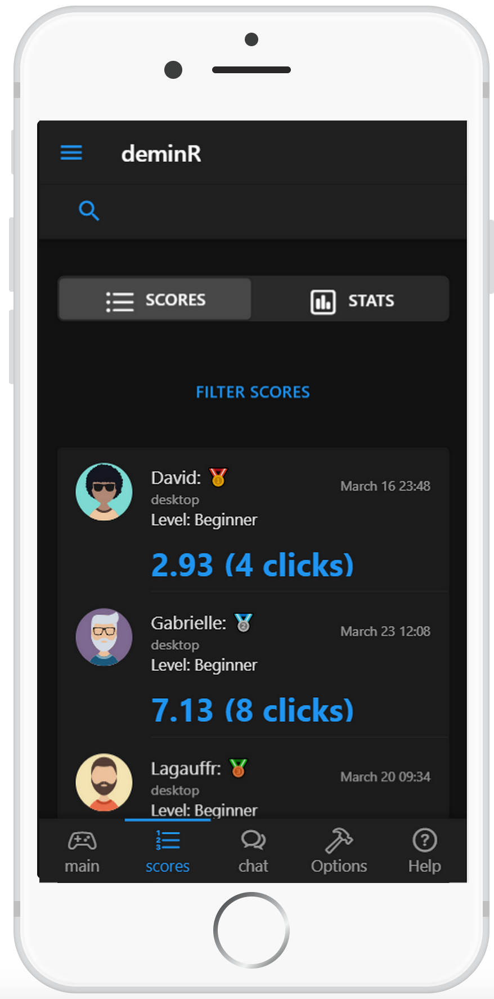
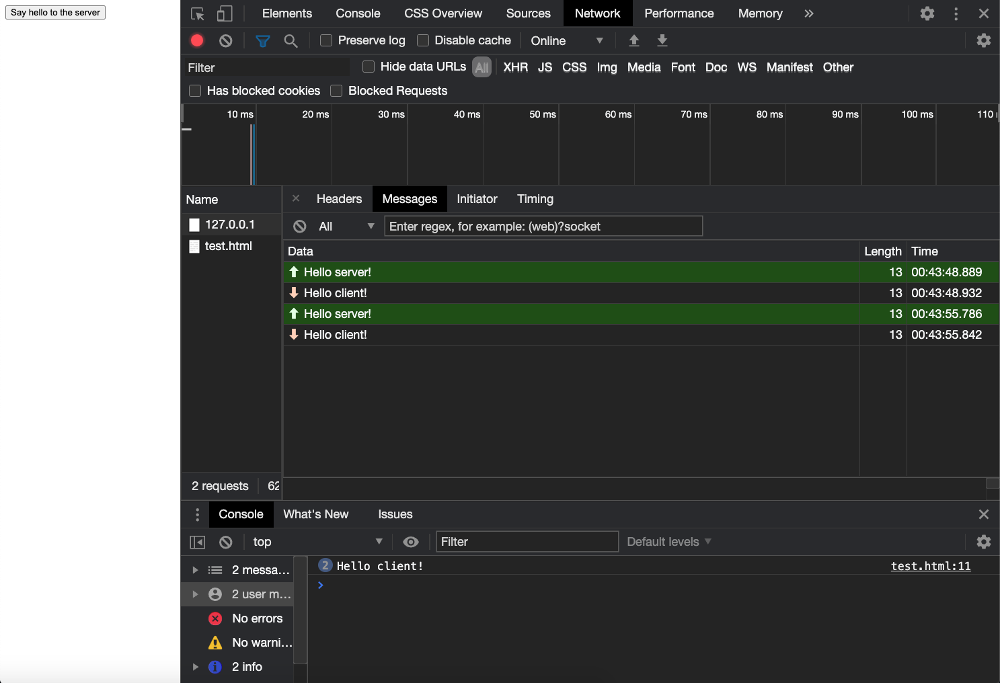
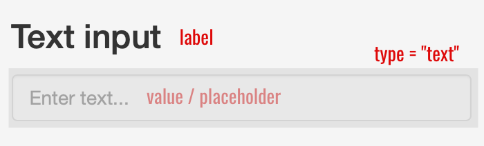
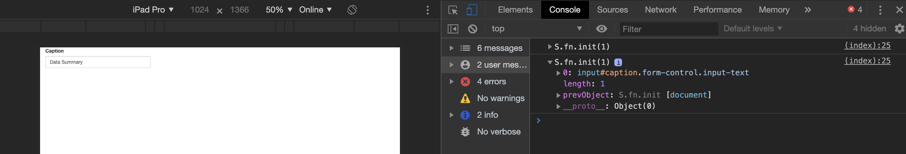
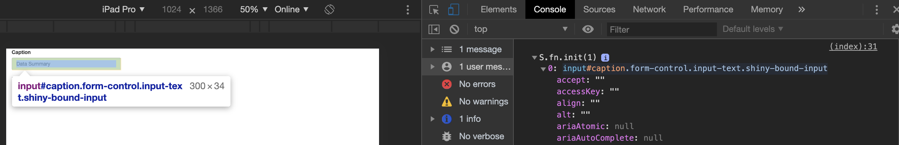
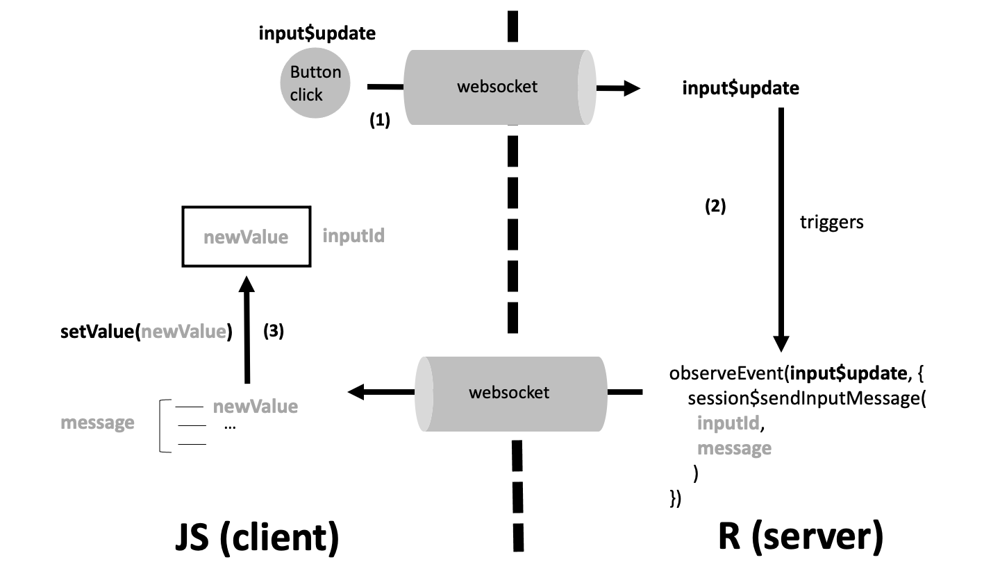
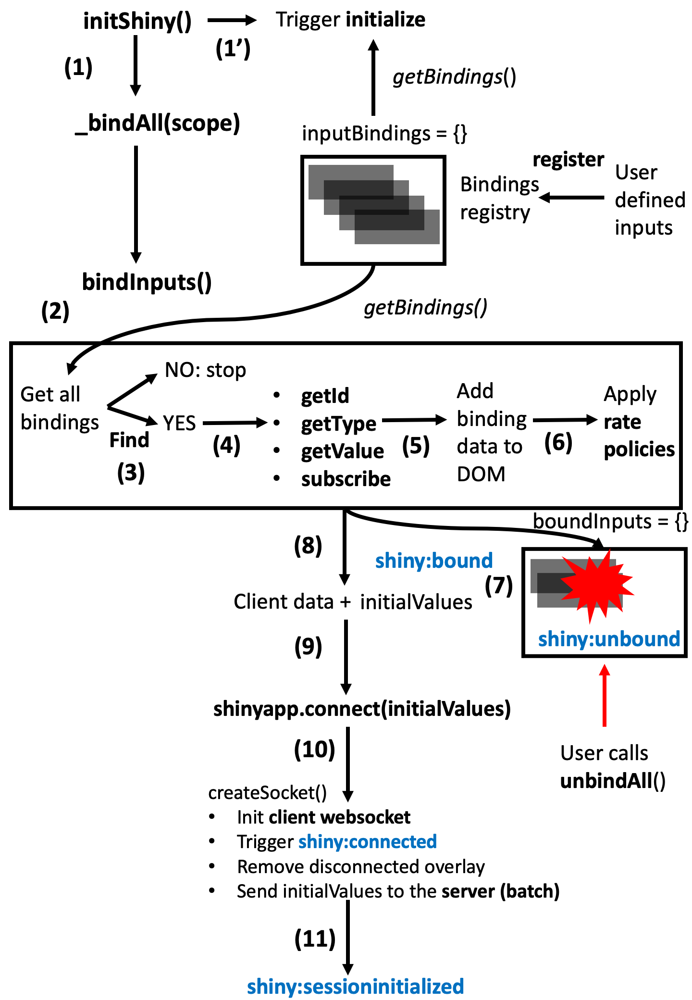
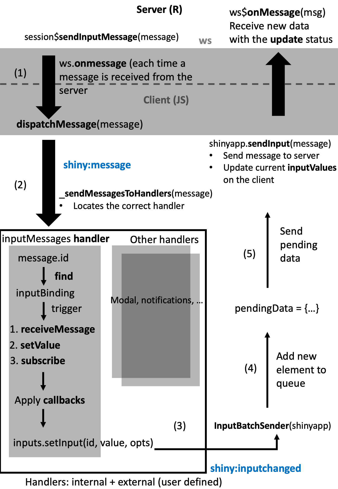

Welcome
=======

This book is still under active development and intended for a 2021 Q2
release in the [R Series](https://www.routledge.com/go/the-r-series) by
Chapman & Hall.

Disclaimer
----------

This book is not an HTML/Javascript/CSS course and won’t make you become
a web developer! Instead, it provides a *survival kit* to customize
Shiny. I am sure however that readers will want to explore more about
these topics.

Is this book for me?
--------------------

Before going further, the reader must:

-   Be comfortable with basic R structures and concepts, functional and
    object oriented programming ([R6](https://r6.r-lib.org/))
-   Have solid knowledge of [Shiny](https://mastering-shiny.org)

Basic knowledge in HTML and JavaScript is a plus but not mandatory.

If you fulfill the above prerequisites, you should read this book if you
answer yes to the following questions:

-   Do you want to know how to develop shiny apps with a more
    professional look and feel?
-   Have you ever wondered how to design new input widgets to unleash
    interactivity?
-   Are you simply curious about what happens under the hood?

Learning objectives
-------------------

This book will help you to:

-   Manipulate Shiny tags from R to create custom layouts
-   Harness the power of CSS and JavaScript to quickly design apps
    standing out from the pack
-   Discover the steps to import and convert existing web frameworks
    like [Bootstrap 4](https://getbootstrap.com/),
    [framework7](https://framework7.io/)
-   Learn how Shiny internally deals with inputs
-   Learn more about less documented Shiny mechanisms (websockets,
    sessions, …)

Why another Shiny related book?
-------------------------------

There are various Shiny focused resources introducing
[basic](https://shiny.rstudio.com/tutorial/) as well as advanced topics
such as [modules](https://shiny.rstudio.com/articles/#modules) and
[Javascript/R](https://js4shiny.com) interactions, however, handling
advanced user interfaces design was never an emphasis. Clients often
desire custom templates, yet this generally exceeds core features of
Shiny (not out of the box).

Generally, R App developers lack a significant background in web
development and often find this requirement overwhelming. It was this
sentiment that motivated writing this book, namely to provide readers
the necessary knowledge to extend Shiny’s layout, input widgets and
output elements. This project officially started at the end of 2018 but
was stopped when Joe Cheng revealed the upcoming [Mastering Shiny
Book](https://mastering-shiny.org). Fortunately, the later, does not
cover a lot about the customization of Shiny user interfaces. Besides,
this book may constitute a good complement to the work in progress
[Engineering Production-Grade Shiny Apps](https://engineering-shiny.org)
by the ThinkR team, where the link between Shiny and CSS/JavaScript is
covered. For a deep dive into JavaScript and R interactions, the
upcoming book by John Coene covers topics like htmlWidgets, interactive
documents and computations.

Book structure
--------------

This book is organized into six parts.

-   Part 1 demonstrates the link between Shiny and the classic web
    languages like HTML, CSS and JavaScript. We finish by exploring the
    dependencies behind Shiny (Bootstrap, jQuery, …)
-   In part 2, we dive into the `{htmltools}` (Cheng et al.
    [2020](#ref-R-htmltools)) package, providing functions to create and
    manipulate HTML tags from R as well as manage web dependencies
-   Part 3 contains chapters dedicated to the Shiny input system where
    we highlight some partially hidden features like websockets. This
    part starts with a JavaScript introduction that might be skipped if
    necessary!
-   Part 4 focuses on the development of a new template for Shiny by
    demonstrating examples from the `{tablerDash}` (Granjon
    [2020](#ref-R-tablerDash)[d](#ref-R-tablerDash)) package, being a
    serious refreshment to `{shinydashboard}` (Chang and Borges Ribeiro
    [2018](#ref-R-shinydashboard)). These, and more may be explored
    further as part of the [RinteRface](https://rinterface.com/)
    project.
-   Part 5 focuses on CSS and SASS, showcasing examples from the R
    community like `{fresh}` (Perrier and Meyer
    [2020](#ref-R-fresh)[b](#ref-R-fresh)), to beautify apps with only
    few lines of code
-   Part 6 dives into mobile web development through a practical study
    involving the `{shinyMobile}` package (Granjon, Perrier, and Rudolf
    [2020](#ref-R-shinyMobile))

Code structure
--------------

This book has a side package containing all the necessary material to
run the code without having to reload each previous snippet.

    remotes::install_github("DivadNojnarg/outstanding-shiny-ui-code
    ")

It covers Chapters @ref(shiny-input-system), @ref(shiny-custom-handler)
and the whole Practice section.

There is another good reason for this package: provide a robust method
to bundle JavaScript/CSS code along side any shiny app. Indeed, it is
quite tempting to proceed as below:

    ui <- fluidPage(
      tags$script(
        "$(function() {
          Shiny.addCustomMessageHandler('hello', function(message) {     alert(message); 
          });
        });
        "
      ),
      actionButton("go", "Send")
    )

    server <- function(input, output, session) {
      observeEvent(input$go, {
        session$sendCustomMessage("hello", message = "plop")
      })
    }

    shinyApp(ui, server)

It is fine if the app purpose is a simple demonstration. In our case,
since we aim at providing reusable template elements, we need a better
approach, that will be described later.

Preliminary exercices
---------------------

Before starting with technical details, we propose to play a little
game. Among all the images shown, what are the ones corresponding to
shiny apps?

Extra material
--------------

This book may serve as material for workshops. See below a list of
recent events.

### e-Rum 2020

[Novartis](https://www.novartis.com) associates Mustapha Larbaoui and
David Granjon gave a workshop entitled “Advanced User Interfaces for
Shiny Developers” at the latest 2020 virtual
[e-Rum](https://2020.erum.io/program/workshops/) conference whose
detailed agenda is available
[here](https://github.com/Novartis/Advanced-User-Interfaces-for-Shiny-Developers).
This two hours workshop takes a lot of inspiration on this book. An
[RStudio Cloud](https://rstudio.cloud) dedicated project is deployed
[here](https://rstudio.cloud/project/1395473) and slides are located
[here](https://rinterface.com/shiny/talks/eRum2020/dg/index.html).

### R/Pharma 2020

This books served as resource for the 2020
[R/Pharma](https://rinpharma.com/workshops/) **Unleash Shiny** workshop
held by John Coene, Colin Fay and David Granjon. Slides are available
[here](https://rinterface.com/shiny/talks/RPharma2020/) and exercises
accessible from [here](https://github.com/RinteRface/Unleash-Shiny).
This workshop expects an higher level than the e-Rum one.

About RinteRface
----------------

The [RinteRface](https://rinterface.com/) project is an initiative
aiming to provide one of the most famous HTML
[templates](https://github.com/RinteRface) to Shiny. Everything started
by the collaboration of [John Coene](https://john-coene.com/) and [David
Granjon](https://divadnojnarg.github.io/) early 2018 on `{shinybulma}`
(Coene [2020](#ref-R-shinybulma)) to officially release RinteRface
November 2018 with `{shinydashboardPlus}` (Granjon
[2020](#ref-R-shinydashboardPlus)[c](#ref-R-shinydashboardPlus)),
`{bs4Dash}` (Granjon [2020](#ref-R-bs4Dash)[a](#ref-R-bs4Dash)) as
line-up packages.

Official release of RinteRface, November 28 2018

The biggest RinteRface accomplishment is probably the work in progress
`{shinyMobile}` package, which was initially called `{shinyF7}`, in
collaboration with the [dreamRs](https://www.dreamrs.fr/) team.

Since 2019, RinteRface has been involved in various R related events
like local R meetups or conferences ([Zurich R User
Group](https://www.meetup.com/fr-FR/Zurich-R-User-Group/),
[baselR](https://www.meetup.com/BaselR/),
[useR2019](https://user2019.r-project.org/),
[satRdayNeuchatel2020](https://neuchatel2020.satrdays.org/),
[e-Rum2020](https://2020.erum.io/),
[RPharma2020](https://rinpharma.com/)).

RinteRface is a contributor in the [Shiny Developers
Series](https://shinydevseries.com/post/episode-4-rinterface/), hosted
by Eric Nantz, also known as the [theRcast](https://r-podcast.org/).

RinteRface work has been awarded several times at the 2 latest shiny
contests (2019 and 2020), through contributions like:

-   A virtual
    [lab](https://community.rstudio.com/t/shiny-contest-submission-a-virtual-lab-for-teaching-physiology/25348)
    for teaching physiology (2019), the Apps.Physiol
    [plateform](https://rinterface.com/AppsPhysiol.html), fuelled by
    `{bs4Dash}` and hosted in `{CaPO4Sim}` (Granjon
    [2020](#ref-R-CaPO4Sim)[b](#ref-R-CaPO4Sim))

The virtual patient simulator of {CaPO4Sim}

-   `{deminR}` (Devaux and Granjon [2020](#ref-R-deminR)), a
    [minesweeper](https://community.rstudio.com/t/deminr-a-minesweeper-for-r-2020-shiny-contest-submission/56356)
    for R (2020), powered by `{shinyMobile}`

{deminR}, a minesweeper for R

RinteRface is very grateful to the R community and this book is a sort
of acknowledgment!

Acknowledgements
----------------

-   I am very grateful to Douglas Robinson for proof reading the book
    and fixing many typos it contained
-   A special thanks to my friends John and Victor for contributing to
    [RinteRface](https://rinterface.com/)
-   Thanks to the eRum organizers for inviting me to the virtual
    [e-Rum2020](https://2020.erum.io) conference
-   RinteRface and this book won’t exist without the amazing R
    community. Thanks for their valuable feedback

Packages
--------

    library(shiny)

    ## Warning: package 'shiny' was built under R version 3.6.2

    library(shinydashboard)

    ## 
    ## Attaching package: 'shinydashboard'

    ## The following object is masked from 'package:graphics':
    ## 
    ##     box

    library(cascadess)

    ## 
    ## Attaching package: 'cascadess'

    ## The following object is masked from 'package:graphics':
    ## 
    ##     text

    library(htmltools)
    library(purrr)

    ## Warning: package 'purrr' was built under R version 3.6.2

    library(magrittr)

    ## 
    ## Attaching package: 'magrittr'

    ## The following object is masked from 'package:purrr':
    ## 
    ##     set_names

    library(ggplot2)

    ## Warning: package 'ggplot2' was built under R version 3.6.2

    ## 
    ## Attaching package: 'ggplot2'

    ## The following object is masked from 'package:cascadess':
    ## 
    ##     margin

    library(thematic)
    library(fresh)
    library(testthat)

    ## 
    ## Attaching package: 'testthat'

    ## The following objects are masked from 'package:magrittr':
    ## 
    ##     equals, is_less_than, not

    ## The following object is masked from 'package:purrr':
    ## 
    ##     is_null

    library(jstools)
    library(scales)

    ## Warning: package 'scales' was built under R version 3.6.2

    ## 
    ## Attaching package: 'scales'

    ## The following object is masked from 'package:purrr':
    ## 
    ##     discard

    library(dplyr)

    ## Warning: package 'dplyr' was built under R version 3.6.2

    ## 
    ## Attaching package: 'dplyr'

    ## The following object is masked from 'package:testthat':
    ## 
    ##     matches

    ## The following objects are masked from 'package:stats':
    ## 
    ##     filter, lag

    ## The following objects are masked from 'package:base':
    ## 
    ##     intersect, setdiff, setequal, union

    library(apexcharter)

    ## Warning: package 'apexcharter' was built under R version 3.6.2

    library(shinyWidgets)

    ## Warning: package 'shinyWidgets' was built under R version 3.6.2

    library(charpente)
    library(bs4Dash)

    ## 
    ## Attaching package: 'bs4Dash'

    ## The following objects are masked from 'package:shinydashboard':
    ## 
    ##     box, dashboardBody, dashboardHeader, dashboardPage,
    ##     dashboardSidebar, dropdownMenu, infoBox, infoBoxOutput, menuItem,
    ##     menuSubItem, renderInfoBox, renderValueBox, sidebarMenu,
    ##     sidebarUserPanel, tabBox, tabItem, tabItems, updateTabItems,
    ##     valueBox, valueBoxOutput

    ## The following objects are masked from 'package:shiny':
    ## 
    ##     column, tabPanel, tabsetPanel, updateTabsetPanel

    ## The following object is masked from 'package:graphics':
    ## 
    ##     box

    library(shinyMobile)
    library(shinybulma)
    library(deminR)

    ## 
    ## Attaching package: 'deminR'

    ## The following objects are masked from 'package:shinyMobile':
    ## 
    ##     f7SubNavbar, updateF7Login

    library(CaPO4Sim)

    ## Welcome to the Calcium Phosphate simulator, have Fun!

    library(shinydashboardPlus)

    ## 
    ## Attaching package: 'shinydashboardPlus'

    ## The following objects are masked from 'package:bs4Dash':
    ## 
    ##     attachmentBlock, box, controlbarItem, controlbarMenu,
    ##     dashboardControlbar, dashboardFooter, dashboardHeader,
    ##     dashboardPage, dashboardSidebar, descriptionBlock, dropdownDivider,
    ##     updateControlbarMenu, userMessage, userMessages, userPost,
    ##     userPostMedia, userPostTagItem, userPostTagItems

    ## The following object is masked from 'package:shinyWidgets':
    ## 
    ##     progressBar

    ## The following objects are masked from 'package:shinydashboard':
    ## 
    ##     box, dashboardHeader, dashboardPage, dashboardSidebar, messageItem,
    ##     notificationItem, taskItem

    ## The following object is masked from 'package:graphics':
    ## 
    ##     box

    library(golem)
    library(tablerDash)
    library(blogdown)

    ## Warning: package 'blogdown' was built under R version 3.6.2

    library(httpuv)

    ## Warning: package 'httpuv' was built under R version 3.6.2

    library(websocket)

    ## Warning: package 'websocket' was built under R version 3.6.2

    ## 
    ## Attaching package: 'websocket'

    ## The following object is masked from 'package:httpuv':
    ## 
    ##     WebSocket

<!--chapter:end:index.Rmd-->

(PART\*) Introduction
=====================

In this part, we show the deep link between Shiny and the web languages.

<!--chapter:end:web.Rmd-->
Shiny and the Web
=================

`{shiny}` (Chang, Cheng, Allaire, et al. [2020](#ref-R-shiny)) allows
the development of web applications with R in minutes. Let’s face it:
this is quite mind blowing! While this may not be a production ready
app, it will still be a fully functional, working prototype. Believe me,
doing a web application with pure HTML/CSS and JavaScript is more
difficult, especially for someone with a non-web developer background.

    library(shiny)

Shiny generates HTML code from R
--------------------------------

Let’s start with a little exercise:

1.  Run the following code:

<!-- -->

    p("Hello World")

1.  Copy and paste this code to the R console. What do you observe?

Notice the output format is an example of an HTML tag. The `p` function
generates HTML (see chapter @ref(htmltools-overview)). The main
difference between HTML tags and Shiny tags is the absence of closing
tag for Shiny. For instance, in raw HTML, we expect `
` to be closed
by `
`. In Shiny, we only call `p(...)`, where `...` may be
attributes like class/id or children tags. For a R developer, being able
to generate HTML code from R allows to remain focused on the main task
instead of the web development burdens. As stated in the general
introduction @ref(intro), a production app sometimes needs to custom
elements that are not contained or hidden in Shiny’s core.

Is a Shiny app less customizable than a classic web app? Not at all!
Under the hood, Shiny has its own engine to build HTML tags, through R,
meaning that all HTML elements are available. You may also include any
custom
[JavaScript](https://shiny.rstudio.com/articles/packaging-javascript.html)
or [CSS](https://mastering-shiny.org/advanced-ui.html) code.

HTML 101
--------

This chapter provides a short introduction to the 3 main web languages,
namely HTML, CSS and JavaScript. The following content is crucial to
understand part @ref(htmltools-overview) about HTML generation from R.

### HTML Basics

HTML (Hypertext Markup Language) is derived from SGML (Standard
Generalized markup Language). An HTML file contains tags that may be
divided into 2 categories:

-   paired-tags: the text is inserted between the opening and the
    closing tag
-   closing-tags

<!-- -->

    <!-- paired-tags -->
    

    

    <!-- self-closing tags -->
    <iframe/>
    
    <input/>
     

Tags may be divided into 3 categories, based on their role:

-   structure tags: they constitute the skeleton of the HTML page
    (`<title></title>`, `<head></head>`, `<body></body>`)
-   control tags: script, inputs and buttons (and more). Their role is
    to include external resources, provide interactivity with the user
-   formatting tags: to control the size, font of the wrapped text

Finally, we distinguish block and inline elements:

-   block elements may contain other tags and take the full width (block
    or inline). `

` is the most commonly used block element.
    All elements of a block are printed on top of each others
-   inline elements (for instance ``, ``) are
    printed on the same line. They can not contain block tags but may
    contain other nested inline tags. In practice, we often see
    `<a></a>`
-   inline-block elements allow to insert block element in an inline

Consider the following example. This is clearly a bad use of HTML
conventions since an inline tag can not host block elements.

    
      

Hello World

      

    

Importantly, `
` and `` don’t have any semantic meaning,
contrary to `<header>` and `<footer>`, which allow to structure the HTML
page.

### Tag attributes

Attributes are text elements allowing to specify some properties of the
tag. For instance for a link tag (``), we actually expect more
than just the tag itself: a target url and how to open the new page … In
all previous examples, tags don’t have any attributes. Yet, there exist
a large range of attributes and we will only see 2 of them for now (the
reason is that these are the most commonly used in CSS and JavaScript):

-   class: may be shared between multiple tags
-   id: each must be unique

<!-- -->

    

    <!-- the class awesome-item may be applied to multiple tags -->
    

Both attributes are widely used by CSS and JavaScript (see Chapter
@ref(survival-kit-javascript) with the jQuery selectors) to apply a
custom style to a web page. Class attributes apply to multiple elements,
however the id attribute is restricted to only one item.

Interestingly, there exists another attribute category, know as
non-standard attributes like `data-toggle`. We will see them later in
the book (see Chapter @ref(custom-templates-skeleton)).

### The simplest HTML skeleton

An HTML page is a collection of tags which will be interpreted by the
web browser step by step. The simplest HTML page may be defined as
follows:

    <!DOCTYPE HTML>
    <html lang="en">
      <head>
      <!-- head content here -->
        <title>A title</title>
      </head>
      <body>
      <!-- body content here -->
      </body>
    </html>

-   `<html>` is the may wrapper
-   `<head>` and `<body>` are the 2 main children
    -   `<head>` contains dependencies like styles and JavaScript files
        (but not only),
    -   `<body>` contains the page content and it is displayed on the
        screen. We will see later that JavaScript files are often added
        just before the end of the `<body>`.

Only the **body** content is **displayed** on the screen! W3C
[validation](https://validator.w3.org/#validate_by_input) imposes at
list a `title` tag in the `head` section and a `lang` attribute to the
`html` tag!

Let’s write the famous Hello World in HTML:

    <!DOCTYPE HTML>
    <html lang="en">
      <head>
        <!-- head content here -->
        <title>A title</title>
      </head>
      <body>
        
Hello World

      </body>
    </html>

In order to preview this page in a web browser, you need to save the
above snippet to a script `hello-world.html` and double-click on it. It
will open with your default web browser.

Below is how we would do with a Shiny app, only for demonstration
purpose (static HTML would be enough if no user interaction is
required).

    ui <- fluidPage(p("Hello World"))

    server <- function(input, output, session) {}

    shinyApp(ui, server)

From outside, it looks identical even though we’ll see in Chapter
@ref(web-dependencies) that this simple app actually contains much more
HTML than our previous example.

### About the Document Object Model (DOM)

The DOM stands for “Document Object Model” and is a convenient
representation of the html document. There actually exists multiple DOM
types, namely DOM-XML and DOM-HTML but we will only focus on the latter.
If we consider the last example (Hello World), the associated DOM tree
may be inspected in Figure @ref(fig:html-dom).

#### Visualizing the DOM with the HTML inspector

Below, we introduce a tool that will facilitate our exploration of
beautiful shiny user interfaces. In this section, we restrict the
description to the first panel of the HTML inspector.[1] This feature is
available in all web browsers, however for demonstration purposes, we
will only focus on the [Chrome
DevTools](https://developers.google.com/web/tools/chrome-devtools). It
may be opened:

-   After a right click and selecting inspect
-   After clicking on F12 (windows), fn + F12 on Mac (or
    Command+Option+C)

In the following:

-   Open the hello-world.html example with Chrome
-   Right-click to open the HTML inspector (developer tools must be
    enabled if it is not the case)

The HTML inspector is a convenient tool to explore the structure of the
current HTML page. On the left-hand side, the DOM tree is displayed
where we clearly see that `<html>` is the parent of `<head>` and
`<body>`. `<body>` has also 1 child, that is `
`. We may preview any
style (CSS) associated with the selected element on the right panel as
well as Event Listeners (JavaScript), which will be discussed later in
the book.

Inspection of the DOM in the Hello World example

#### HTML Inspector 101

In the following, we enumerate key features of the inspector `Elements`
tab. In addition to explore the HTML
[structure](https://developers.google.com/web/tools/chrome-devtools/dom),
the inspector allows to:

-   Dynamically change CSS at run time
-   Debug JavaScript code (put break points, …)
-   Run JavaScript code from the console.
-   Monitor any error or warning that may prevent your app or website
    from properly working

Another important feature is the ability to switch between different
devices, especially mobile platforms and to do a global performance
audit with [Google
LightHouse](https://developers.google.com/web/tools/lighthouse). The
[book](https://engineering-shiny.org/when-optimize.html#tools-for-profiling)
from Colin Fay et al. details the most relevant elements for Shiny app
development.

We propose at set of quick exercises to review the most important HTML
inspector capabilities that are commonly needed during Shiny app
customization. We consider the app already defined above:

    ui <- fluidPage(p("Hello World"))

    server <- function(input, output, session) {}

    shinyApp(ui, server)

##### Altering the DOM structure

1.  Run the `Hello World` app, right click on the only text element and
    click on inspect
2.  Notice we could have done similarly by clicking on the very top left
    corner `Inspect` icon (Command + maj + C for Mac) and hovering over
    the `Hello World` text

You should see a result similar to Figure @ref(fig:html-dom-inspect),
the `Inspect` icon being in blue. The selected element is highlighted
and a white box displays the main CSS properties like `text-color`,
`font-size`, margins, as well as accessibility parameters.

Inspection of the p element in the Hello World example

1.  In the `Elements` panel, double click between the `
` and `
`
    tags to edit the current text. Press enter when finished
2.  Let’s add some children to our `p` tag. Right click and select the
    `Edit as HTML` option. You may enter any valid HTML code inside.
    Don’t forget about some rules relative to inline and block tags
    (inline tags cannot contain block tags!!!)

As depicted in Figure @ref(fig:html-dom-edit), we could have done a
right click on the `p` tag to display more options like:

-   Add/edit an attribute. You may try to add it a class
    `class="awesome-text"` and an id `id="only-text"`
-   Delete the current tag (the `return` key would do it as well)
-   Copy the element with all nested elements
-   Only copy the outside HTML (ignore nested elements)
-   Extract the CSS selector or JavaScript path (code to select the
    element): `body > div > p` and
    `document.querySelector("body > div > p")`, respectively. These 2
    features are extremely powerful as they save you time. Try to copy
    and paste `document.querySelector("body > div > p")` in the
    JavaScript console at the bottom of the inspector window. It returns
    the selected HTML element, as shown in Figure
    @ref(fig:html-dom-js-path)! Amazing isn’ it?
-   Hide the element
-   Force a specific state. For instance buttons may be `active`,
    `inactive`

Modifications of the p element in the Hello World example

Extract the JavaScript path to select the p element

Whenever you are looking for a specific tag in a more complex page, the
`search tag` option is a game changer (Ctrl + F on Windows, command + F
within the Elements tab on a Mac). See Figure @ref(fig:html-dom-search).

Search for element having the “awesome-text” class

Finally, the inspector toolkit allows to reorder DOM elements with a
rather intuitive drag and drop feature. I invite the reader to carefully
explore those features as they will be crucial in the next chapters.

### Preliminary introduction to CSS and JavaScript

To introduce this section, I propose to look at the very first website,
early in the 90’s (August 1991 exactly). From an aesthetic point of view
(see Figure @ref(fig:www-first)), this is far from what we can observe
today as shown in Figure @ref(fig:www-rinterface).

World wide web website

RinteRface website:
<a href="https://rinterface.com" class="uri">https://rinterface.com</a>

How can we explain that difference? One of the main reason is the
absence of CSS (Cascading Style Sheet) since the first CSS release only
appeared in December 1996, that is 5 years later than the first web site
publication. CSS allows to deeply customize the appearance of any web
page by changing colors, fonts, margins and much more. We acknowledge,
the role of JavaScript cannot be demonstrated through the previous
example. Yet its impact is as important as CSS, so that it is now
impossible to dissociate HTML, CSS and JavaScript.

#### HTML and CSS

CSS (Cascading Style Sheets) changes the style of HTML tags by targeting
specific classes or ids. For instance, if we want all `p` tags to have
red color we will use:

    p {
      color: red;
    }

To include CSS in an HTML page, we use the `
        <title>A title</title>
      </head>
      <body>
        
Hello World

      </body>
    </html>

You may update the hello-world.html script and run it in your
web-browser to see the difference. The example may be slight, but shows
how we may control the look and feel of the display. In a development
context, we will see later that css files may so big that it is better
to include them in external files.

Let’s build a shiny app that does similar things. As a reminder, you may
use `tags$style` to include small pieces of CSS in your app:

    ui <- fluidPage(
      tags$style("p { color: red;}"),
      p("Hello World")
    )

    server <- function(input, output, session) {}

    shinyApp(ui, server)

#### Modifying CSS with the HTML inspector

##### Add inline properties

Run the previous app, right click the `p` element and open the
inspector. In the `Styles` tab, notice the `element.style` section. This
is to define inline new CSS rules for the selected item. Let’s add 2
rules by clicking inside the `element.style` container:

-   `border-style: dashed`. Indicates we want a box with dashed border
-   `border-color: ...`. To set a border color

After typing enter, the inline CSS is automatically added in the tag
element.

As you can see, CSS is rather self-explanatory. You probably noticed the
auto suggestion feature while typing a property, as shown in Figure
@ref(fig:html-dom-css). Don’t worry if everything seems overwhelming at
the moment. We’ll dedicate an entire part to CSS later in the book.

Edit CSS with Chrome DevTools

##### View local changes

Whenever playing around with a web page style or a shiny app, it may be
good to have an overview of all changes when you are satisfied about the
new design.

1.  Run the previous shiny app example and open the inspector
2.  In the Styles tab, add some new CSS properties to the first p
    element set of rules
3.  Once done press enter and click on the file name located at the
    top-right corner of the property box
4.  This opens the Sources tab. In the left sidebar, right click on the
    file name (index) and select `Local Modifications`
5.  This opens a `Git` like diff panel called `Changes` where you can
    review any change and see the previous values. If you refresh the
    page, you will loose every local change, unless the persistent
    authoring feature is active

Review all CSS changes

To get a deeper understanding of the different CSS options please refer
to the Google
[documentation](https://developers.google.com/web/tools/chrome-devtools/css).

#### HTML and JavaScript

You will see how quickly/seamlessly you may add awesome features to your
shiny app.

In the following example, we defined the `changeColor` function that
targets the element having `hello` id and change its color property to
green. The HTML element has an `onClick` attribute that triggers the
`changeColor` function each time the button is clicked.

    <!DOCTYPE HTML>
    <html lang="en">
      <head>
        
        
        <title>A title</title>
      </head>
      <body>
        <!-- onclick attributes applies the JavaScript function changeColor define above -->
        
Hello World

      </body>
    </html>

In few lines of code, you can change the color of the text. This is only
the beginning!

We see below that the process is not dramatically different in a Shiny
app. We wrap our custom JavaScript in the `tags$script` function (prefer
external scripts to add more code), as below:

    ui <- fluidPage(
      tags$script(
        "alert('Click on the Hello World text!');
         // change text color
         function changeColor(color){
           document.getElementById('hello').style.color = 'green';
         }
        "
      ),
      p(id = "hello", onclick="changeColor('green')", "Hello World")
    )

    server <- function(input, output, session) {}

    shinyApp(ui, server)

As demonstrated above, developing a shiny app is basically building a
website from R and is completely compatible with the web languages, that
is CSS and JavaScript. Sections @ref(htmltools-dependencies) and
@ref(shiny-input-system) present more robust tools and concepts to
extend Shiny.

<!--chapter:end:web-intro.Rmd-->

Discover Shiny dependencies
===========================

Introduction
------------

If Shiny creates HTML code for us, it is not enough to design a
beautiful working app with user interactions. As shown earlier, all
modern web sites and apps have a lot of CSS and JavaScript under the
hood. Let’s explore these elements in the following exercise.

The simplest Shiny layout is the `fluidPage`. The `shinyapp` predefined
Rstudio snippet will create a basic app skeleton (type shinyapp in
RStudio IDE):

    ui <- fluidPage(
      p("Hello World")
    )

    server <- function(input, output) {}
    shinyApp(ui, server)

At first glance, the page only contains text. Wait … are you sure about
this? Let’s run the above example and open the HTML inspector introduced
in @ref(web-intro-html). Results are displayed on Figure
@ref(fig:shiny-deps).

Shiny dependencies

1.  Click on “Open in Browser”
2.  Open the HTML inspector
3.  Locate the `<head>` tag
4.  Uncollapse it and search for the script containing
    `application/html-dependencies`
5.  List all dependencies

We see in the head section (delimited by `<head></head>`) that Shiny has
four dependencies:

-   json2
-   jQuery 3.4.1
-   shiny (custom JavaScript and CSS)
-   Bootstrap 3.4.1 (JavaScript and CSS) + other files (html5shiv,
    respond)

Bootstrap
---------

According to the gitstar ranking, [Bootstrap](https://getbootstrap.com)
comes at the 7th place (144563 stars) and 22th place for repositories
and organization, respectively. It has been first released in 2011 and
will welcome the fifth [version](https://v5.getbootstrap.com/) in few
months. It provides plug and play layout and interactive elements such
as tabs, navigation bars, tooltips, popovers and many input (forms),
which is rather convenient since it avoids writing a large amount of
CSS/JavaScript that would bring more complexity. The first release of
Shiny was shipped with [Bootstrap
2](https://github.com/rstudio/shinybootstrap2). Shiny currently relies
on Bootstrap 3 since v0.11, while a lot of efforts are being made to
provide a Bootstrap 4 compatibility, essentially through the
[bootstraplib](https://github.com/rstudio/bootstraplib) R package.

One of the great advantage of using Bootstrap is the responsiveness of
the design that can work either on desktop or mobile, even though
advanced user likely prefer other specialized libraries like
[Framework7](https://framework7.io/) or [onsenUI](https://onsen.io/) to
develop native looking apps.

Bootstrap 3 relies on the grid layout
[system](https://getbootstrap.com/docs/3.4/examples/grid/) that allows
to efficiently organize the content in row and columns. For instance the
`fluidRow` and `column` Shiny functions leverage the Bootstrap grid to
control how elements are displayed in a page.

jQuery, DOM manipulation
------------------------

[jQuery](https://jquery.com/) allows to perform DOM manipulation, that
is interacting with HMTL elements, in a more user-friendly manner than
with pure JavaScript. At that step, you might not be familiar with
JavaScript nor jQuery. Don’t worry chapter @ref(survival-kit-javascript)
will expose the basics. Below is a comparison on how you would select a
button HTML element with both technologies. I am sure you’ll notice how
jQuery[2] is more intuitive than JavaScript.

Javascript:

    var btn = document.getElementById('mybutton'); // select the button
    btn.addEventListener('click', function() { // action + consequences
      alert('You clicked me!'); // action
    });

jQuery:

    $('#mybutton').on('click', function() {
      alert('You clicked me!');
    });

Data formating
--------------

json2 is a library to handle the
[JSON](https://www.json.org/json-en.html) data format (JavaScript Object
Notation). We will see in section @ref(shiny-websocket) of Chapter
@ref(shiny-intro) that the R / JS communication involves data exchange
and given that data structures are not the same in R and JS, there must
be a way to ensure the translation. This is done through the
[jsonlite](https://cran.r-project.org/web/packages/jsonlite/index.html)
package that allows to transform JSON objects in R objects with
`jsonlite::fromJSON` and inversely with `jsonlite::toJSON`. Shiny
automatically handles the process and it works well most of the time!

Custom dependencies
-------------------

The last dependency contains custom JS and CSS code necessary for Shiny
to work, that is:

-   Fine tuning the layout
-   Registering input/output
-   Handling every single input/output action
-   Initializing and controlling the R/JS communication
-   Handling alerts/modals/notifications
-   …

Part @ref(shiny-js-object), @ref(shiny-input-system),
@ref(shiny-custom-handler) and @ref(custom-templates-interactivity)
showcase the most important elements of those custom files.

TO DO: link to CSS part

Exercise
--------

In the following exercise, we consider a more complex app with a slider
as well as a plot output.

1.  Run the app `runExample("01_hello")`
2.  Open the HTML inspector
3.  Delete the bootstrap.min.css and ion.rangeSlider.css
4.  Conclusions

To sump up, all these libraries are necessary to make Shiny what it is!

In Chapter @ref(htmltools-dependencies), we explore tools to manage HTML
dependencies. In Chapter @ref(insert-tabs), we study a special case to
insert dependencies during the app runtime.

Let’s move to the next part to discover the internal engine that creates
HTML code from R!

<!--chapter:end:web-dependencies.Rmd-->

(PART\*) Unleash {htmltools}: from R to HTML
============================================

While building a custom HTML template, you will need to know more about
the wonderful [htmltools](https://github.com/rstudio/htmltools). It has
the same spirit as devtools, that is, making your web developer life
easier. What follows does not have the pretention to be an exhaustive
guide about this package. Yet, it will provide you with the main tools
to be more efficient.

<!--chapter:end:htmltools.Rmd-->

htmltools overview
==================

`{htmltools}` (Cheng et al. [2020](#ref-R-htmltools)) is a R package
designed to:

-   Generate HTML tags from R
-   Handle web dependencies (see chapter @ref(htmltools-dependencies))

Historically, `{htmltools}` was extracted out of `{shiny}` (Chang,
Cheng, Allaire, et al. [2020](#ref-R-shiny)) to be able to extend it,
that is developing custom HTML tags, importing extra dependencies from
the web. That’s why, both packages have many common functions! At the
moment, `{htmltools}` does not have any user guide, although being a key
package for all web things!

Writing HTML Tags from R
------------------------

`{htmltools}` provides the necessary functions to write HTML tags that
were introduced in Chapter @ref(web-intro-html). In R, it is even more
convenient than raw HTML since their is no opening/closing tag, a simple
function call instead:

    div()

<!--html_preserve-->

<!--/html_preserve-->

does produce an HTML `

` tag. Inside the function call, all
named elements will become `attributes`, whereas unnamed elements will
become children. In some cases, tags may have empty attributes like
`<input disabled>`. In that case, the corresponding R code is
`input(disabled = NA)`.

Notations
---------

Whether to use `tags$div` or `div` depends if the tag is exported by
default. For instance, you could use `htmltools::div` but not
`htmltools::nav` since nav does not have a dedicated function (only for
`p`, `h1`, `h2`, `h3`, `h4`, `h5`, `h6`, `a`, `br`, `div`, `span`,
`pre`, `code`, `img`, `strong`, `em`, `hr`). Rather prefer
`htmltools::tags$nav`. Alternatively, there exists a function (in shiny
and htmltools) called `withTags`. Wrapping your code in this function
allows code like this `withTags(nav(), ...)` instead of `tags$nav()`,
thereby omitting the `tags$` prefixes. If you had to gather multiple
tags together, choose `tagList()` over `list()`, although the HTML
output is the same. The first has the `shiny.tag.list` class in addition
to `list`. Package like `{golem}` (Fay et al. [2020](#ref-R-golem)) (see
also
<a href="http://golemverse.org" class="uri">http://golemverse.org</a>)
allows to test if an R object is a tag list. In this case, using a list
would cause the test fail.

Adding new tags
---------------

The `tag` function allows to add extra HTML tags not already defined.
You may use it as follows:

    customTag <- tag("test", list(class = "test", p("Custom Tag")))
    str(customTag)

    ## List of 3
    ##  $ name    : chr "test"
    ##  $ attribs :List of 1
    ##   ..$ class: chr "test"
    ##  $ children:List of 1
    ##   ..$ :List of 3
    ##   .. ..$ name    : chr "p"
    ##   .. ..$ attribs : Named list()
    ##   .. ..$ children:List of 1
    ##   .. .. ..$ : chr "Custom Tag"
    ##   .. ..- attr(*, "class")= chr "shiny.tag"
    ##  - attr(*, "class")= chr "shiny.tag"

    customTag

<!--html_preserve-->
<test class="test">

Custom Tag

</test><!--/html_preserve-->

Good practice is to check whether the created tag is in line with the
HTML validation [rules](https://validator.w3.org/).

Alternative way to write tags
-----------------------------

`{htmltools}` comes with the `HTML()` function that you can feed with
raw HTML:

    HTML('
Blabla
')
    # will render exactly like
    div("Blabla")

    # but there class is different
    class(HTML('
Blabla
'))
    class(div("Blabla"))

You will not be able to use tag related functions, as in the following
parts. Therefore, I strongly recommend using R and not mixing HTML in R.
Interestingly, if you want to convert raw HTML to R code, there is a
Shiny App developed by Alan Dipert from RStudio, namely
[html2R](https://github.com/alandipert/html2r). There are some issues,
non standard attributes (like `data-toggle`) are not correctly processed
but there are
[solutions](https://github.com/alandipert/html2r/issues/2). This will
save you precious time! A more recent approach is developed in section
@ref(workflow-charpente) and has be internally used to develop some of
the RinteRface [templates](https://github.com/RinteRface).

Playing with tags
-----------------

### Tags structure

A tag is defined by:

-   A name such as span, div, h1 … `tag$name`
-   Some attributes, which can be accessed with `tag$attribs`
-   Children, which you can be accessed with `tag$children`
-   A class, namely `shiny.tag`

For instance:

    # create the tag
    myTag <- div(
      class = "divclass", 
      id = "first",
      h1("Here comes your baby"),
      span(class = "child", id = "baby", "Crying")
    )
    # access its name
    myTag$name
    # access its attributes (id and class)
    myTag$attribs
    # access children (returns a list of 2 elements)
    myTag$children
    # access its class
    class(myTag)

How to modify the class of the second child?

    second_children <- myTag$children[[2]]
    second_children$attribs$class <- "adult"
    myTag
    # This is not working ...

Why is this not working? By assigning `myTag$children[[2]]` to
second\_children, `second_children$attribs$class <- "adult"` modifies
the class of the copy and not the original object. Thus we do:

    myTag$children[[2]]$attribs$class <- "adult"
    myTag

### Useful functions for tags

`{htmltools}` and `{shiny}` have powerful functions to seamlessly
manipulate tags.

#### Add attributes

-   `tagAppendAttributes`: this function allows to add a new attribute
    to the current tag.

For instance, assuming we created a div without any id attribute:

    mydiv <- div("Where is my brain")
    mydiv <- tagAppendAttributes(mydiv, id = "here_it_is")

You can pass as many attributes as you want, including non standard
attributes such as `data-toggle` (see Bootstrap 3
[tabs](https://www.w3schools.com/bootstrap/bootstrap_ref_js_collapse.asp)
for instance):

    mydiv <- tagAppendAttributes(mydiv, list(`data-toggle` = "tabs", class = "myclass"))
    # even though you could proceed as follows but this requires 2 steps
    mydiv$attribs[["data-toggle"]] <- "tabs"
    mydiv$attribs$class <- "myclass"

#### Check if tag has specific attribute

-   `tagHasAttribute`: to check if a tag has a specific attribute

<!-- -->

    # I want to know if div has a class
    mydiv <- div(class = "myclass")
    has_class <- tagHasAttribute(mydiv, "class")
    has_class
    # if you are familiar with %>%
    has_class <- mydiv %>% tagHasAttribute("class")
    has_class

In practice, this function is useful when testing tag elements as shown
in chapter @ref(custom-templates-testing).

#### Get all attributes

-   `tagGetAttribute`: to get the value of the targeted attributes, if
    it exists, otherwise NULL.

<!-- -->

    mydiv <- div(class = "test")
    # returns the class
    tagGetAttribute(mydiv, "class")
    # returns NULL
    tagGetAttribute(mydiv, "id")

#### Set child/children

-   `tagSetChildren` allows to create children for a given tag. For
    instance:

<!-- -->

    mydiv <- div(class = "parent", id = "mother", "Not the mama!!!")
    # mydiv has 1 child "Not the mama!!!"
    mydiv 
    children <- lapply(1:3, span)
    mydiv <- tagSetChildren(mydiv, children)
    # mydiv has 3 children, the first one was removed
    mydiv 

Notice that `tagSetChildren` removes all existing children. Below we see
another set of functions to add children while conserving existing ones.

#### Add child or children

-   `tagAppendChild` and `tagAppendChildren`: add other tags to an
    existing tag. Whereas `tagAppendChild` only takes one tag, you can
    pass a list of tags to `tagAppendChildren`.

<!-- -->

    mydiv <- div(class = "parent", id = "mother", "Not the mama!!!")
    otherTag <- span("I am your child")
    mydiv <- tagAppendChild(mydiv, otherTag)

#### Build your own functions

You might wonder why there is no `tagRemoveChild` or
`tagRemoveAttributes`. Let’s look at the `tagAppendChild`

    tagAppendChild <- function (tag, child) {
      tag$children[[length(tag$children) + 1]] <- child
      tag
    }

Below we write the `tagRemoveChild`, where tag is the target and n is
the position to remove in the list of children:

    mydiv <- div(class = "parent", id = "mother", "Not the mama!!!", span("Hey!"))

    # we create the tagRemoveChild function
    tagRemoveChild <- function(tag, n) {
      # check if the list is empty
      if (length(tag$children) == 0) {
        stop(paste(tag$name, "does not have any children!"))
      }
      tag$children[n] <- NULL
      tag
    }
    mydiv <- tagRemoveChild(mydiv, 1)
    mydiv

When defining the `tagRemoveChild`, we choose `[` instead of `[[` to
allow to select multiple list elements:

    mydiv <- div(class = "parent", id = "mother", "Not the mama!!!", "Hey!")
    # fails
    `[[`(mydiv$children, c(1, 2))
    # works
    `[`(mydiv$children, c(1, 2))

Alternatively, we could also create a `tagRemoveChildren` function. Also
notice that the function raises an error if the provided tag does not
have children.

The `tagAppendChild` is not able to insert at a specific position. We
could draft the `tagInsertChild` building on top of the base R `append`
function:

    tagInsertChild <- function(tag, child, position) {
      tag$children <- append(tag$children, list(child), position - 1)
      tag
    }

    tagInsertChild(p(span("hello")), a(), 1)
    tagInsertChild(p(span("hello")), a(), 2)

### Other functions

The
[Golem](https://github.com/ThinkR-open/golem/blob/dev/inst/utils/golem_utils_ui.R)
package written by [thinkr](https://thinkr.fr) contains neat functions
to edit your tags.

Particularly, the `tagRemoveAttributes`:

    tagRemoveAttributes <- function(tag, ...) {
      attrs <- as.character(list(...))
      for (i in seq_along(attrs)) {
        tag$attribs[[ attrs[i] ]] <- NULL
      }
      tag
    }

    mydiv <- div(class = "test", id = "coucou", "Hello")
    tagRemoveAttributes(mydiv, "class", "id")

### Conditionally set attributes

Sometimes, you only want to set attributes under specific conditions.

    my_button <- function(color = NULL) {
      tags$button( 
        style = paste("color:", color),
        p("Hello")
      )
    }

    my_button()

This example will not fail but having `style="color: "` is not clean. We
may use conditions:

    my_button <- function(color = NULL) {
      tags$button( 
        style = if (!is.null(color)) paste("color:", color),
        p("Hello")
      )
    }

    my_button("blue")
    my_button()

In this example, style won’t be available if color is not specified.

### Using %&gt;%

While doing a lot of manipulation for a tag, if you don’t need to create
intermediate objects, this is a good idea to use `%>%` from
[magrittr](https://magrittr.tidyverse.org):

    div(class = "cl", h1("Hello")) %>% 
      tagAppendAttributes(id = "myid") %>%
      tagAppendChild(p("some extra text here!"))

The pipe syntax is overall easier to follow and read.

### Programmatically create children elements

Assume you want to create a tag with three children inside:

    div(
      span(1),
      span(2),
      span(3),
      span(4),
      span(5)
    )

The structure is correct but imagine if you had to create 1000 `span` or
fancier tag. The previous approach is not consistent with DRY
programming. `lapply` function will be useful here (or the purrr `map`
family):

    # base R
    div(lapply(1:5, function(i) span(i)))
    # purrr + %>%
    map(1:5, function(i) span(i)) %>% div()

Exercises
---------

### Exercise 1: tags structure (5 minutes)

Consider the following shiny tag:

    myTag <- a(
      class = "btn btn-large",
      type = "button",
      span(class = "child1", id = "super-span", 1),
      span(class = "child2", 2)
    )

    myTag

1.  Inspect its structure. Hint: you may use `str`.
2.  Access its class using `tagGetAttribute` and another method of your
    choice.
3.  Modify the first child class to `custom class`.

### Exercise 2: modifiying tags (5 minutes)

Let us consider the following tag:

    temp <- div("Hello World")

(You may chain functions with `%>%`)

1.  Replace its unique child by
    `a(href = "http://www.google.com", "click me!")`. Hint:
    `tagSetChildren` is your friend.
2.  Add 10 other `span`. Hint: tags may be programmatically generated
    with `lapply` or `purrr::map`.

<!--chapter:end:htmltools-overview.Rmd-->

Dependency utilities
====================

When creating a new template, you have to import custom HTML
dependencies that are not available in shiny. Fortunately, this is not a
problem with `{htmltools}` (Cheng et al. [2020](#ref-R-htmltools))!

The dirty approach
------------------

Let’s consider the following example. Since Bootstrap is one of the most
popular HTML/CSS/JS framework to develop websites and web apps, we want
to include a bootstrap 4 card in a shiny app. This case study is taken
from a RStudio Community
[question](https://community.rstudio.com/t/create-a-div-using-htmltools-withtags/22439/2).
The naive approach would be to include the HTML code directly in the app
code. This approach is dirty since it is not easily re-usable by others.

    # we create the card function before
    my_card <- function(...) {
      withTags(
        div(
          class = "card border-success mb-3",
          div(class = "card-header bg-transparent border-success"),
          div(
            class = "card-body text-success",
            h3(class = "card-title", "title"),
            p(class = "card-text", ...)
          ),
          div(class = "card-footer bg-transparent border-success", "footer")
        )
      )
    }

    # we build our app
    shinyApp(
      ui = fluidPage(
        fluidRow(
          column(
            width = 6,
            align = "center",
            br(),
            my_card("blablabla. PouetPouet Pouet.")
          )
        )
      ),
      server = function(input, output) {}
    )

Nothing is displayed which was expected since `{shiny}` (Chang, Cheng,
Allaire, et al. [2020](#ref-R-shiny)) does not contain bootstrap 4
dependencies and this card is a bootstrap 4 element. Don’t panic! We
load the necessary css to display this card (if required, we could
include the javascript as well). We could use either `includeCSS()`,
`tags$head(tags$link(rel = "stylesheet", type = "text/css", href = "custom.css"))`.
See more [here](https://shiny.rstudio.com/articles/css.html). Web
development best practice recommend to point to external file rather
than including CSS in the head or directly on a tag (inline CSS). In the
below example, we use a CDN (content delivery network) but that could be
a local file located in the `www/` folder.

    shinyApp(
      ui = fluidPage(
        # load the css code
        tags$head(
          tags$link(rel = "stylesheet", type = "text/css", href = "https://maxcdn.bootstrapcdn.com/bootstrap/4.0.0/css/bootstrap.min.css")
        ),
        fluidRow(
          column(
            width = 6,
            align = "center",
            br(),
            my_card("blablabla. PouetPouet Pouet.")
          )
        )
      ),
      server = function(input, output) {}
    )

The card may seem ugly but at least it is displayed.

The clean approach
------------------

The best approach consists in leveraging the `htmlDependency` and
`attachDependencies` functions from `{htmltools}`. The `htmlDependency`
function takes the following main parameters:

-   the dependency name
-   the version (useful to remember on which version it is built upon)
-   a path to the dependency (can be a CDN or a local folder)
-   script and stylesheet to respectively pass css and scripts

<!-- -->

    # handle dependency
    card_css <- "bootstrap.min.css"
    bs4_card_dep <- function() {
      htmlDependency(
        name = "bs4_card",
        version = "1.0",
        src = c(href = "https://maxcdn.bootstrapcdn.com/bootstrap/4.0.0/css/"),
        stylesheet = card_css
      )
    }

If you are not pointing to a CDN and use local files, this is crucial to
wrap the `htmlDependency` in a function since the path has to be
determined at run time and not when the package builds. It means that if
you are developing a package with dependencies, forgetting this step
might prevent other users to get the dependency working on their own
machine (the differences between Unix and Windows OS paths is clearly a
good example).

We create the card tag and give it the bootstrap 4 dependency through
the `attachDependencies` function. In recent version of `{htmltools}`,
we may simply use `tagList(tag, deps)` instead. Importantly,
`attachDependencies` has an `append` parameter FALSE by default. Ensure
to set it to TRUE if you want to keep already attached dependencies!

    # create the card
    my_card <- function(...) {
      cardTag <- withTags(
        div(
          class = "card border-success mb-3",
          div(class = "card-header bg-transparent border-success"),
          div(
            class = "card-body text-success",
            h3(class = "card-title", "title"),
            p(class = "card-text", ...)
          ),
          div(class = "card-footer bg-transparent border-success", "footer")
        )
      )
      
      # attach dependencies (old way)
      # htmltools::attachDependencies(cardTag, bs4_card_dep())
      
      # simpler way
      tagList(cardTag, bs4_card_dep())
      
    }

We finally run our app:

    # run shiny app 
    ui <- fluidPage(
      title = "Hello Shiny!",
      fluidRow(
        column(
          width = 6,
          align = "center",
          br(),
          my_card("blablabla. PouetPouet Pouet.")
        )
      )
    )

    shinyApp(ui, server = function(input, output) { })

With this approach, you can develop a package of custom dependencies
that people could use when they need to add custom elements in shiny.

Another example: Importing HTML dependencies from other packages
----------------------------------------------------------------

The `{shinydashboard}` (Chang and Borges Ribeiro
[2018](#ref-R-shinydashboard)) package helps to design dashboards with
shiny. In the following, we would like to integrate the box component in
a classic Shiny App (without the dashboard layout). However, if you try
to include the box tag, you will notice that nothing is displayed since
`{shiny}` does not have `{shinydashboard}` dependencies. `{htmltools}`
contains a function, namely `findDependencies` that looks for all
dependencies attached to a tag. Before going further, let’s define the
basic skeleton of a dashboard:

    shinyApp(
      ui = dashboardPage(
        dashboardHeader(),
        dashboardSidebar(),
        dashboardBody(),
        title = "Dashboard example"
      ),
      server = function(input, output) { }
    )

There are numerous details associated with shinydashboard that we will
not go into. If you are interested in learning more, please [help
yourself](https://rstudio.github.io/shinydashboard/). The key point here
is the main wrapper function `dashboardPage`. The `fluidPage` is another
wrapper function that most are already familiar with. We apply
`findDependencies` on `dashboardPage`.

    deps <- findDependencies(
      dashboardPage(
        header = dashboardHeader(), 
        sidebar = dashboardSidebar(), 
        body = dashboardBody()
      )
    )
    deps

    ## [[1]]
    ## List of 10
    ##  $ name      : chr "font-awesome"
    ##  $ version   : chr "5.13.0"
    ##  $ src       :List of 1
    ##   ..$ file: chr "www/shared/fontawesome"
    ##  $ meta      : NULL
    ##  $ script    : NULL
    ##  $ stylesheet: chr [1:2] "css/all.min.css" "css/v4-shims.min.css"
    ##  $ head      : NULL
    ##  $ attachment: NULL
    ##  $ package   : chr "shiny"
    ##  $ all_files : logi TRUE
    ##  - attr(*, "class")= chr "html_dependency"
    ## 
    ## [[2]]
    ## List of 10
    ##  $ name      : chr "font-awesome"
    ##  $ version   : chr "5.13.0"
    ##  $ src       :List of 1
    ##   ..$ file: chr "www/shared/fontawesome"
    ##  $ meta      : NULL
    ##  $ script    : NULL
    ##  $ stylesheet: chr [1:2] "css/all.min.css" "css/v4-shims.min.css"
    ##  $ head      : NULL
    ##  $ attachment: NULL
    ##  $ package   : chr "shiny"
    ##  $ all_files : logi TRUE
    ##  - attr(*, "class")= chr "html_dependency"
    ## 
    ## [[3]]
    ## List of 10
    ##  $ name      : chr "bootstrap"
    ##  $ version   : chr "3.4.1"
    ##  $ src       :List of 2
    ##   ..$ href: chr "shared/bootstrap"
    ##   ..$ file: chr "/Library/Frameworks/R.framework/Versions/3.6/Resources/library/shiny/www/shared/bootstrap"
    ##  $ meta      :List of 1
    ##   ..$ viewport: chr "width=device-width, initial-scale=1"
    ##  $ script    : chr [1:3] "js/bootstrap.min.js" "shim/html5shiv.min.js" "shim/respond.min.js"
    ##  $ stylesheet: chr "css/bootstrap.min.css"
    ##  $ head      : NULL
    ##  $ attachment: NULL
    ##  $ package   : NULL
    ##  $ all_files : logi TRUE
    ##  - attr(*, "class")= chr "html_dependency"
    ## 
    ## [[4]]
    ## List of 10
    ##  $ name      : chr "options"
    ##  $ version   : chr "2.0.0.9000"
    ##  $ src       :List of 1
    ##   ..$ file: chr "/Library/Frameworks/R.framework/Versions/3.6/Resources/library/shinydashboardPlus/shinydashboardPlus-0.6.0"
    ##  $ meta      : NULL
    ##  $ script    : NULL
    ##  $ stylesheet: NULL
    ##  $ head      : NULL
    ##  $ attachment: NULL
    ##  $ package   : NULL
    ##  $ all_files : logi TRUE
    ##  - attr(*, "class")= chr "html_dependency"
    ## 
    ## [[5]]
    ## List of 10
    ##  $ name      : chr "shinydashboardPlus"
    ##  $ version   : chr "2.0.0.9000"
    ##  $ src       :List of 1
    ##   ..$ file: chr "/Library/Frameworks/R.framework/Versions/3.6/Resources/library/shinydashboardPlus/shinydashboardPlus-0.6.0"
    ##  $ meta      : NULL
    ##  $ script    : chr [1:2] "js/app.min.js" "js/shinydashboardPlus.js"
    ##  $ stylesheet: chr [1:3] "css/AdminLTE.min.css" "css/_all-skins.min.css" "css/custom.css"
    ##  $ head      : NULL
    ##  $ attachment: NULL
    ##  $ package   : NULL
    ##  $ all_files : logi TRUE
    ##  - attr(*, "class")= chr "html_dependency"
    ## 
    ## [[6]]
    ## List of 10
    ##  $ name      : chr "shinydashboard"
    ##  $ version   : chr "0.7.1"
    ##  $ src       :List of 1
    ##   ..$ file: chr "/Library/Frameworks/R.framework/Versions/3.6/Resources/library/shinydashboard"
    ##  $ meta      : NULL
    ##  $ script    : NULL
    ##  $ stylesheet: chr "shinydashboard.css"
    ##  $ head      : NULL
    ##  $ attachment: NULL
    ##  $ package   : NULL
    ##  $ all_files : logi TRUE
    ##  - attr(*, "class")= chr "html_dependency"

deps is a list containing four dependencies:

-   [Font Awesome](https://fontawesome.com) handles icons.
    Interestingly, this dependency is provided by `dashboardHeader`,
    especially the `shiny::icon("bars")` that collapses the left sidebar
-   [Bootstrap](https://getbootstrap.com/docs/3.3/) is the main
    HTML/CSS/JS template. Importantly, please note the version 3.3.7,
    whereas the current is 4.5.2
-   [AdminLTE](https://adminlte.io) is the dependency containing
    HTML/CSS/JS related to the admin template. It is closely linked to
    Bootstrap 3
-   shinydashboard, the CSS and javascript necessary for our dashboard
    to work properly. In practice, integrating custom HTML templates to
    shiny does not usually work out of the box for many reasons and some
    modifications are necessary. For instance, here is a list of
    [changes](https://github.com/rstudio/shinydashboard/blob/master/srcjs/AdminLTE/README-shiny-mods.md)
    to optimize adminLTE for shiny. This has major consequences on the
    template maintenance such that upgrading to another AdminLTE version
    would require to modify all these elements by hand. You may
    understand why template maintainers are quite often reluctant to
    upgrade their dependencies as it might brake the whole package,
    quite easily.

Below, we attach the dependencies to the `box` with `tagList`, as shown
above. Notice that our custom `box` does not contain all parameters as
in the official `{shinydashboard}` version, which is actually ok at this
time.

    my_box <- function(title, status) {
      tagList(box(title = title, status = status), deps)
    }
    ui <- fluidPage(
      titlePanel("Shiny with a box"),
      my_box(title = "My box", status = "danger"),
    )
    server <- function(input, output) {}
    shinyApp(ui, server)

You now have limitless possibilities! Interestingly, this same approach
is the basis of
[shinyWidgets](https://github.com/dreamRs/shinyWidgets/blob/master/R/useBs4Dash.R)
for the `useBs4Dash` function and other related tools.

Suppress dependencies
---------------------

In rare cases, you may need to remove an existing conflicting
dependency. The `suppressDependencies` function allows users to perform
this. For instance,
[shiny.semantic](https://github.com/Appsilon/shiny.semantic) built on
top of semantic ui is not compatible with Bootstrap. Below, we remove
the AdminLTE dependency from a `{shinydashboard}` page and nothing is
displayed (as expected):

    shinyApp(
      ui = dashboardPage(
        dashboardHeader(),
        dashboardSidebar(),
        dashboardBody(suppressDependencies("AdminLTE")),
        title = "Dashboard example"
      ),
      server = function(input, output) { }
    )

Resolve dependencies
--------------------

Imagine a situation in which we would like to use the very last version
of fontawesome icons, that is currently 5.15.1 according to
[jsdelivr](https://www.jsdelivr.com/package/npm/@fortawesome/fontawesome-free).
We recall that `{shiny}` already provides version 5.13.0 through the
`icon` function. Including another version would probably cause
conflicts and we would like to avoid that case. `{htmltools}` has a
`resolveDependencies` tool that consists in removing any redundant
element, taking the last version if dependencies names are identical.

    new_icon_dep <- htmlDependency(
      name = "font-awesome", 
      version = "5.15.1", 
      src = c(href = "https://cdn.jsdelivr.net/npm/@fortawesome/fontawesome-free@5.15.1/"),
      stylesheet = "css/all.min.css"
    )

    icon_deps <- list(new_icon_dep, findDependencies(shiny::icon("th"))[[1]])

    resolveDependencies(icon_deps)

    ## [[1]]
    ## List of 10
    ##  $ name      : chr "font-awesome"
    ##  $ version   : chr "5.15.1"
    ##  $ src       :List of 1
    ##   ..$ href: chr "https://cdn.jsdelivr.net/npm/@fortawesome/fontawesome-free@5.15.1/"
    ##  $ meta      : NULL
    ##  $ script    : NULL
    ##  $ stylesheet: chr "css/all.min.css"
    ##  $ head      : NULL
    ##  $ attachment: NULL
    ##  $ package   : NULL
    ##  $ all_files : logi TRUE
    ##  - attr(*, "class")= chr "html_dependency"

Combining `findDependencies`, `suppressDependencies` and
`resolveDependencies` gives you great power to successfully manage your
dependencies!

Insert Custom script in the head
--------------------------------

With `{shinydashboardPlus}`, users can fine tune their dashboard
behavior with a simple option parameter passed to `dashboardPagePlus`.
The `sidebarExpandOnHover` capability that consists in expanding the
sidebar when hovering on it is part of those
[options](https://adminlte.io/themes/AdminLTE/documentation/index.html#adminlte-options),
yet not exposed by `{shinydashboard}`. Under the hood, all those options
are gathered in a (nested) list, then converted into JSON to eventually
generate a JavaScript configuration file. Until now, we only saw two
ways to include scripts or stylesheets. How do we include any arbitrary
script (defined on the fly by the user when the app starts) in an
dependency?

`htmlDependency` has a `head` parameter allowing to pass any lines of
HTML to insert into the document head. We can easily imagine passing a
string containing a script. Below, we first construct the options list.
Then, we create the dependency: notice since `src` is mandatory, we have
to give it a value but we will not use `script` nor `stylesheet`
arguments.

    options <- list(
      sidebarExpandOnHover = TRUE, 
      boxWidgetSelectors = list(
        remove = '[data-widget="remove"]'
      )
    )

    config_script <- function() {
      htmlDependency(
        "options",
        as.character(utils::packageVersion("shinydashboardPlus")),
        src = c(file = system.file("shinydashboardPlus-0.6.0", package = "shinydashboardPlus")),
        head = if (!is.null(options)) {
          paste0(
            ""
          )
        }
      )
    }

    # show the script
    print(HTML(config_script()$head))

    ## 

I invite the reader to run the example below involving
`{shinydashboardPlus}`, open the HTML inspector and look at the head.

     shinyApp(
       ui = dashboardPagePlus(
         collapse_sidebar = TRUE,
         options = options,
         header = dashboardHeaderPlus(
          enable_rightsidebar = TRUE,
          rightSidebarIcon = "gears"
         ),
         sidebar = dashboardSidebar(),
         body = dashboardBody(),
         rightsidebar = rightSidebar(),
         title = "DashboardPage"
       ),
       server = function(input, output) { }
     )

According the the AdminLTE
[documentation](https://adminlte.io/themes/AdminLTE/documentation/index.html#adminlte-options),
global options must be passed before loading the app.min.js script.
Creating this “dummy” dependency allowed us to isolate the script to
insert it before the app.min.js script (contained in another
[dependency](https://github.com/RinteRface/shinydashboardPlus/blob/master/R/deps.R#L43)),
as shown on Figure @ref(fig:htmltools-head-deps).

Insert arbitrary script in the head

<!--chapter:end:htmltools-dependencies.Rmd-->

Other tools
===========

CSS
---

Sometimes, it is temptating to write inline CSS for a tag in the `style`
attribute, for instance:

    title <- h4(
      "A title",
      style = "color: cyan; text-align: center; margin-top: 100px;"
    )
    shinyApp(ui = title, server = function(input, output) {})

As the number of CSS properties grows, the code may become hard to read.
The [{cascadess}](https://github.com/nteetor/cascadess) package
developed by [Nathan Teetor]() provides a more readable syntax, which
works well with `%>%`.

    ui <- list(
      cascadess(),
      h4(
        "A title",
        .style %>%
          text(color = "cyan", align = "center") %>%
          margin(top = 5)
      )
    )
    shinyApp(ui, server = function(input, output) {})

{cascadess} is a pleasing way to learn CSS through R. For instance, the
CSS [text
formating](https://www.google.com/search?client=safari&rls=en&q=text+properties+css&ie=UTF-8&oe=UTF-8)
includes properties like `text-color`, `text-align`, …The `text`
function has the same parameters, namely color, align, as shown in the
above example.

Notice that we included the `cascadess` function, which is nothing more
than an htmldependency object necessary to apply styles on elements.

    cascadess()

    ## List of 10
    ##  $ name      : chr "cascadess"
    ##  $ version   : chr "0.1.0"
    ##  $ src       :List of 2
    ##   ..$ file: chr "/Library/Frameworks/R.framework/Versions/3.6/Resources/library/cascadess/www/cascadess"
    ##   ..$ href: chr "cascadess/cascadess"
    ##  $ meta      : NULL
    ##  $ script    : NULL
    ##  $ stylesheet: chr "cascadess.min.css"
    ##  $ head      : NULL
    ##  $ attachment: NULL
    ##  $ package   : NULL
    ##  $ all_files : logi TRUE
    ##  - attr(*, "class")= chr "html_dependency"

Try to run the previous example without this element. Nothing will be
properly displayed!

<!--chapter:end:htmltools-other-tools.Rmd-->

(PART\*) Deep dive in the Shiny input system
============================================

<!--chapter:end:shiny.Rmd-->

JavaScript for Shiny
====================

To understand how Shiny works from inside, especially how inputs are
handled, we’ll gradually dive into its core which contains a substantial
amount of JavaScript (JS).

This chapter is a very brief introduction to JS and jQuery but still
necessary as this book is supposed to be standalone. Advanced JS users
may skip this part. MDN web docs by Mozilla is an excellent
[resource](https://developer.mozilla.org/en-US/docs/Web/JavaScript).

Shiny JavaScript sources
------------------------

Let’s have a look at the `{shiny}` (Chang, Cheng, Allaire, et al.
[2020](#ref-R-shiny)) github
[project](https://github.com/rstudio/shiny). As a R package, it is
composed of standard folders like `R`, `man`, `tests` and other
elements. The `inst` folder contains resources for external dependencies
like [Bootstrap 3](https://getbootstrap.com/docs/3.3/),
[jQuery](https://jquery.com/), [datatables](https://datatables.net/),
[fontawesome](https://fontawesome.com/), … mentioned in Chapter
@ref(web-dependencies) sorted in the `www/shared` sub-folder as well as
the whole CSS and JS Shiny codes. Notice the presence of minified files
like `shiny.min.js` and non minified elements such as `shiny.css`.
Overall, the minification process reduces the loading time of a web page
by removing comments, extra spaces, thereby decreasing the file size.
For instance `shiny.js` has 6628 lines of code, while `shiny.min.js` has
only 4.

Notice the `srcjs/` folder shown in Figure @ref(fig:shiny-js-sources).
It actually contains all pieces to reconstruct the whole `shiny.js`
file.

Shiny JavaScript sources

The `_start.js` and `_end.js` are used by the `Gruntfile.js`, that is a
[grunt-based](https://gruntjs.com) tool to run different tasks such as
concatenate multiple JavaScript files, lint the code, minify it … See
[here](https://github.com/rstudio/shiny/tree/master/tools) for a
summary.

    grunt.registerTask('default', [
      'concat',
      'string-replace',
      'validateStringReplace',
      'eslint',
      'configureBabel',
      'babel',
      'uglify'
    ]);

Since in Chapter (shiny-input-system) we’ll use some of those script, a
little understanding of the basic underlying JavaScript concepts is
necessary.

Introduction to JavaScript
--------------------------

JavaScript was created in 1995 by Brendan Eich and is also known as
ECMAScript (ES). Interestingly, you might have heard about ActionScript,
which is no more than an implementation of ES by Adobe Systems.
Nowadays, JavaScript is the centerpiece of web development across all
websites.

Here is a quick example. If you have a personal blog, you probably know
[Hugo](https://gohugo.io/) or [Jekyll](https://jekyllrb.com/),
especially the R interfaces like
[blogdown](https://bookdown.org/yihui/blogdown/) (Xie
[2020](#ref-R-blogdown)[a](#ref-R-blogdown)). These tools allow one to
rapidly develop a nice looking blog in just a few minutes, focusing on
the content rather than technical aspects, which is really the point!
Now, if you open the HTML inspector introduced in Chapter
@ref(web-intro-html), click on the elements tab, which may open by
default, and uncollapse the `<head>` tag, you see that a lot of scripts
are included, as shown in Figure @ref(fig:scripts-list). Similarly for
the `<body>` tag.

A website is full of JavaScript

There are three ways to include scripts:

-   Use the `

    <button id="hello" onclick="jsFunction()">Hello World</button>

    <!-- We use the src attribute to link the external file -->
    
      </head>
      <body>
       
        
Hello World

      
      
       
      </body>
    </html>

### Syntax

Below is a minimal jQuery code representing its philosophy (“write less,
do more.”):

    $(selector).action();

The selector slot stands for any jQuery selector like class, id,
element, \[attribute\], :input (will select all input elements) and many
[more](https://www.w3schools.com/jquery/jquery_ref_selectors.asp). As a
reminder, let’s consider the following example:

    
Hello World

To select and interact with this element, we use JavaScript and jQuery:

    let inner = document.getElementsByClassName('text').innerHTML; // vanilla JS
    let inner = $('.text').html(); // jQuery

This is of course possible to chain selectors:

    <ul class="list">
      <li class="item">1</li>
      <li class="item">2</li>
      <li class="item">3</li>
      <li class="item" id="precious-item">4</li>
    </ul>

    <ul class="list" id="list2">
      <li class="item">1</li>
      <li class="item">2</li>
      <li class="item">3</li>
      <li class="item">4</li>
    </ul>

    let items = $('.list .item'); // will return an array containing 8 li tags
    let otherItems = $('#list2 .item'); // will select only li tags from the second ul element
    let lists = $('ul'); // will return an array with 2 ul elements
    let firstItem = $('#list2:first-child'); // will return the first li element of the second ul.

### Useful functions

There exist filtering functions dedicated to simplify item
[selection](https://api.jquery.com/category/traversing/). Below are is a
list containing the mostly used in Shiny.

#### Travel in the DOM

<table>
<colgroup>
<col style="width: 44%" />
<col style="width: 55%" />
</colgroup>
<thead>
<tr class="header">
<th style="text-align: center;">Method</th>
<th style="text-align: center;">Description</th>
</tr>
</thead>
<tbody>
<tr class="odd">
<td style="text-align: center;">children()</td>
<td style="text-align: center;">Get the children of each element passed in the selector (important: only travels a single level down the DOM tree)</td>
</tr>
<tr class="even">
<td style="text-align: center;">first()</td>
<td style="text-align: center;">Given an list of elements, select the first item</td>
</tr>
<tr class="odd">
<td style="text-align: center;">last()</td>
<td style="text-align: center;">Given an list of elements, select the last item</td>
</tr>
<tr class="even">
<td style="text-align: center;">find()</td>
<td style="text-align: center;">Look for a descendant of the selected element(s) that could be multiple levels down in the DOM</td>
</tr>
<tr class="odd">
<td style="text-align: center;">closest()</td>
<td style="text-align: center;">Returns the first ancestor matching the condition (travels up in the DOM)</td>
</tr>
<tr class="even">
<td style="text-align: center;">filter()</td>
<td style="text-align: center;">Fine tune element selection by applying a filter. Only return element for which the condition is true</td>
</tr>
<tr class="odd">
<td style="text-align: center;">siblings()</td>
<td style="text-align: center;">Get all siblings of the selected element(s)</td>
</tr>
<tr class="even">
<td style="text-align: center;">next()</td>
<td style="text-align: center;">Get the immediately following sibling</td>
</tr>
<tr class="odd">
<td style="text-align: center;">prev()</td>
<td style="text-align: center;">Get the immediately preceding sibling</td>
</tr>
<tr class="even">
<td style="text-align: center;">not()</td>
<td style="text-align: center;">Given an existing set of selected elements, remove element(s) that match the given condition</td>
</tr>
</tbody>
</table>

#### Manipulate tags

Below is a list of the main jQuery
[methods](https://api.jquery.com/category/manipulation/) to manipulate
tags (adding class, css property…)

<table>
<colgroup>
<col style="width: 44%" />
<col style="width: 55%" />
</colgroup>
<thead>
<tr class="header">
<th style="text-align: center;">Method</th>
<th style="text-align: center;">Description</th>
</tr>
</thead>
<tbody>
<tr class="odd">
<td style="text-align: center;">addClass()</td>
<td style="text-align: center;">Add class or multiple classes to the set of matched elements</td>
</tr>
<tr class="even">
<td style="text-align: center;">hasClass()</td>
<td style="text-align: center;">Check if the matched element(s) have a given class</td>
</tr>
<tr class="odd">
<td style="text-align: center;">removeClass()</td>
<td style="text-align: center;">Remove class or multiple classes to the set of matched elements</td>
</tr>
<tr class="even">
<td style="text-align: center;">attr()</td>
<td style="text-align: center;">Get or set the value of a specific attribute</td>
</tr>
<tr class="odd">
<td style="text-align: center;">after()</td>
<td style="text-align: center;">Insert content after</td>
</tr>
<tr class="even">
<td style="text-align: center;">before ()</td>
<td style="text-align: center;">Insert content before</td>
</tr>
<tr class="odd">
<td style="text-align: center;">css()</td>
<td style="text-align: center;">Get or set a css property</td>
</tr>
<tr class="even">
<td style="text-align: center;">remove()</td>
<td style="text-align: center;">Remove element(s) from the DOM</td>
</tr>
<tr class="odd">
<td style="text-align: center;">val()</td>
<td style="text-align: center;">Get the current value of the matched element(s)</td>
</tr>
</tbody>
</table>

TO DO: add more methods

### Chaining jQuery methods

A lot of jQuery methods may be chained, that is like pipe operations in
R.

    <ul>
      <li>Item 1</li>
      <li>Item 2</li>
      <li>Item 3</li>
      <li>Item 4</li>
      <li>Item 5</li>
    </ul>

We end the chain by `;` and each step is indented by 2 spaces in the
right direction:

    $('ul')
      .first()
      .css('color', 'green') // add some style with css
      .attr('id', 'myAwesomeItem') // add an id attribute
      .addClass('amazing-ul');

### Iterations

Like in vanilla JavaScript, it is possible to do iterations in jQuery.
Let’s consider the following HTML elements:

    <ul>
      <li>Item 1</li>
      <li>Item 2</li>
    </ul>

We apply the `each` method to change the style of each matched element
step by step:

    $('li').each(function() {
      $(this).css('visibility', 'hidden'); // will hide all li items
    });

Notice that the following code `$('li').css('visibility', 'hidden');`
will do exactly the same! This is explained by the implicit iteration
process handled by most of jQuery methods.

The `map` methods has a different purpose. It creates a new object based
on the provided one.

    const items = [0, 1, 2, 3, 4, 5];
    const threshold = 3;

    let filteredItems = $.map(items, function(i) {
      // removes all items > threshold
      if (i > threshold) 
        return null;
      return i;
    });

### Good practice

It is recommended to wrap any jQuery code as follows:

    $(document).ready(function(){
      // your code
    });

    // or a shortcut

    $(function() {
      // your code
    });

Indeed, do you guess what would happen if you try to modify an element
that does not even exist? The code above will make sure that the
document is ready before starting any jQuery manipulation.

### Events

In jQuery there exists a significant number methods related to events.
Below are the most popular:

    $(element).click(); // click event
    $(element).change(); // trigger change on an element
    $(element).on('click', function() {
     // whatever
    }); // attach an event handler function. Here we add click for the example
    $(element).one('click', function() {
     // whatever
    }); // the difference with on is that one will trigger only once
    $(element).resize(); // useful to trigger plot resize in Shiny so that they correctly fit their container
    $(element).trigger('change') // similar to $(element).change(); You will find it in the Shiny core.

The `.on` event is frequently used in Shiny since it allows to pass
custom events which are not part of the JS predefined events. For
instance `{shinydashboard}` (Chang and Borges Ribeiro
[2018](#ref-R-shinydashboard)) relies on a specific HTML/JavaScript/CSS
template including a homemade API for handling the dashboard events.
Don’t worry if this section is not clear at the moment. We will see
practical examples in the following chapters.

### Extending objects

A last feature we need to mention about jQuery is the ability to extend
objects with additional properties and/or method.

    // jQuery way
    $(function() {
      let object1 = { apple: 0 };
      $.extend(object1, {
        print: function() {
          console.log(this);
        }
      });
      object1.print();
    });

With vanilla JS we would use `Object.defineProperty`:

    // pure JavaScript
    Object.defineProperty(object1, 'print', {
      value: function() {
        console.log(this);
      },
      writable: false
    });

Shiny, JavaScript and the HTML inspector
----------------------------------------

In the above part we gave some elementary JS knowledge. This section
comes back to the main point of this book, that is Shiny. We describe
how to leverage the developer tools so as to test,run and debug
JavaScript code related to a Shiny app.

### The console panel

While developing JS code, we often put some `console.log(var)` calls to
track the content of a given variable and check that our code is doing
what it is supposed to do. The resulting messages, errors or warnings
are printing in the console, also called a Real-eval-print loop (REPL)
suitable to experiment and practice your new JS/jQuery skills.

#### A real REPL

As a warm up, run the shiny app below and open the Chrome DevTools.
Notice the 2 `Console` tabs (next to `Elements` and at the bottom), as
depicted in Figure @ref(fig:dom-console). I prefer using the bottom one
to still see the `Elements` tab and preview DOM modifications in real
time.

    ui <- fluidPage()

    server <- function(input, output, session) {}

    shinyApp(ui, server)

Console panel in the DevTools

Interestingly, you may access any element contained in the window. Copy
and paste `$("body").addClass("plop");` in the prompt. Notice what
happens in the `Elements` tab.

#### Track errors and warnings

As discussed earlier in the book, a lot of Shiny app issues on [Stack
Overflow](https://stackoverflow.com/) or in the [RStudio
community](https://community.rstudio.com/) could be more easily solved
by quickly inspecting the console.

### Debug Shiny/JS code with the inspector

To debug Shiny apps from the inspector, you all your scripts have to be
in a folder accessible by the app like the `www/` folder or by using
`shiny::addResourcePath`. Moreover, if you have minified files, there
must be [source
maps](https://www.html5rocks.com/en/tutorials/developertools/sourcemaps/),
which will allow to reconstruct the original scripts, that is as they
were before the minification process. For instance, Shiny has the
`shiny.min.js.map`. In practice, most R packages bundling HTML templates
do not ship these files since they could be quite large (see package
size restriction for CRAN). The [framework7](https://framework7.io/)
HTML template, on top of which is built `{shinyMobile}`
\[R-shinyMobile\] has source maps but the size can reach 5MB which is
obviously too big to include in the R package.

In the following, we consider a very simple shiny app deployed on
[shinyapps.io](https://www.shinyapps.io/), where a notification is
displayed with JavaScript as soon as a user clicks an action button. I
also made some typos in my code and the goal is to find and fix them.

1.  Browse to the
    [app](https://dgranjon.shinyapps.io/debug_app_in_web_browser/)
2.  Open the Chrome DevTools
3.  Click on the action button (I am pretty sure you clicked before step
    2 ;))
4.  As expected and shown Figure @ref(fig:dom-debug-shiny-error), the
    console displays an error message:
    `Uncaught TypeError: Cannot read property 'show' of undefined`.
    Sounds good isn’t it?

Error in the console panel

1.  Expand the error message to show the stack trace. We see that the
    error occurred during an `onclick` event calling the `sendNotif`
    function. Interestingly, we can open this file by clicking on the
    provided link (notif.js:2). You should get a layout similar to
    Figure @ref(fig:dom-debug-shiny-sources), depending on your screen
    width.

Inspect the source causing the error

1.  Let’s briefly describe Figure @ref(fig:dom-debug-shiny-sources). On
    the left side, you can navigate through all files accessible by the
    web server, that is shiny internal resources, shiny external
    dependencies (like Bootstrap 3) as well as your own scripts. If the
    app is deployed on shinyapps.io, all scripts are located in a folder
    starting by `_w_`, which corresponds to the shinyapps.io workerId
    (this is a detail and not important to understand. See more
    [here](https://github.com/rstudio/shiny/blob/master/R/shiny.R#L69)).
    The central part contains any opened script like a classic IDE. The
    right side displays debugging tools which you may trigger by
    clicking on the corresponding accordion. The scope shows all
    variables/object values at a break point, watch allows to track
    specific elements and Event listener Breakpoints allows to stop at
    given listener type. We could create a new “watcher” by entering
    `typeof message` and clicking the add icon to check the message type
    within the `sendNotif` function. Watched expressions are saved when
    you close the browser.

2.  Put a break point line 2 by clicking on the left side of the center
    panel and click again on the action button to trigger the break
    point. I also additionally set 2 Watch Expressions (for message and
    duration) which type is string and number, respectively, as depicted
    on Figure @ref(fig:dom-debug-shiny-breakpoint). According to the
    results, nothing seems wrong for the function arguments.

Inspection of the scope at the breakpoint

1.  The error message
    `Uncaught TypeError: Cannot read property 'show' of undefined`
    actually means that `notification` does not exist. Try yourself by
    typing `Shiny.notification` in the console. You’ll get `undefined`.
    Instead, the console suggests `Shiny.notifications`. Let’s replace
    the wrong code in the `notif.js` script and then save it. Click on
    the “Resume script execution” blue button (top left of the right
    panel). Notice that a notification is displayed and no more error is
    thrown.

Congrats! You’ve just debugged your first shiny app from the web
inspector. In practice, your code is probably much more complex than
this example but the workflow remains the same.

Exercises
---------

Because the JavaScript console is a REPL, all JavaScript exercises may
be done inside, except exercise 3 which also involves HTML. In that
case, the reader may browse to [jsfiddle](https://jsfiddle.net/).

### Exercise 1: define variables

1.  Play with the example below

<!-- -->

    let myNumber = 1; // affectation
    myNumber--; // decrement
    console.log(myNumber); // print 0

### Exercise 2: define objects

Below is an object skeleton.

    const me = {
      name : ,
      age : ,
      music : ,
      printName: function() {
        console.log(`I am ${}`);
      }
    }

1.  Fill it with some random values.
2.  Access the name property.
3.  Create the printAge method, which returns the age. Hint: `this`
    refers to the object itself. For instance `this.name` gives the name
    property.

### Exercise 3: jQuery

[JSFiddle](https://jsfiddle.net/) allows to insert HTML, CSS and
JavaScript to test code, share and more. It also does not require you to
have any specific configuration on your machine so that you focus on
testing!

1.  Go to [JSFiddle](https://jsfiddle.net/)
2.  Insert the following HTML code chunk in the HTML sub-window.

<!-- -->

    <!DOCTYPE HTML>
    <html>
      <head>
      <!-- head content here -->
      </head>
      <body>
        <ul>
          <li>Item 1</li>
          <li>Item 2</li>
          <li>Item 3</li>
          <li>Item 4</li>
          <li>Item 5</li>
        </ul>
      </body>
    </html>

This is a very basic HTML skeleton

1.  In the JavaScript windows, select jQuery 3.4.1 in the dropdown menu
    (why 3.4.1? The latest Shiny release relies on that version. It is
    therefore best practice to ensure dependencies are similar, at least
    the major version).
2.  Since it is best practice to run jQuery code only when the document
    is ready (avoiding to target non existing elements), we wrap our JS
    code in the following:

<!-- -->

    $(function() {
      // your code
    });

    // or a more explicit syntax
    $(document).ready(function() {
      // code
    });

1.  Create an event listener to change the third item color as soon as
    one click on it. Hint 1: To select the a specific item you may use
    `$(selector:eq(i))` where i is the index of the element. Keep in
    mind that JavaScript starts from 0 and not 1 like R! Hint 2: as a
    reminder, to create an event listener in jQuery, we use the
    following pattern.

<!-- -->

    $("selector").on("event_name", function(e) {
      // your logic
    });

### Exercise 4: a pure JS action button

Below is another example of a button element with an attached event
listener. Clicking on the button will increment its value by 1. Fill in
the blanks!

    <!DOCTYPE HTML>
    <html>
      <head>
      <!-- head content here -->
      </head>
      <body>
        <button>click</button>
      </body>
    </html>

    $(function() {
        
      // recover the button inner html
      const btnText = ...;

        // event listener for button element
        $(...).click(function() {
        var val = ...;
        // (1) increment button 
        // (2) add the button value to the inner text
        ...
        
        // show alert given condition
        if (val > 3) {
          // do whatever you want
            ...
        }
      });
      
    });

<!--chapter:end:shiny-javascript.Rmd-->

Shiny’s internal: session and websockets
========================================

In this chapter, we will answer to the following question:

-   How is the R/JavaScript communication achieved?

At this point, users may find `options(shiny.minified = FALSE)` to debug
the Shiny.js core.

Websocket: R/JS bidirectional communication
-------------------------------------------

How does R (server) and JavaScript (client) communicate? This is a
built-in Shiny feature highlighted
[here](https://github.com/rstudio/shiny), which leverages the
[httpuv](https://github.com/rstudio/httpuv) package. Before going
further let’s define what is a websocket! It is an advanced technology
allowing bidirectional communication between a (or multiple) client(s)
and a server. For instance, a
[chat](https://dev.to/spukas/learn-websockets-by-building-simple-chat-app-dee)
system may be built on top of a websocket.[3] The server is created from
`{httpuv}` (Cheng and Chang [2020](#ref-R-httpuv)) and the client with
`{websocket}` (Chang, Cheng, Dipert, et al. [2020](#ref-R-websocket)) or
directly from JavaScript, as described below:

    library(httpuv)
    # set the server
    s <- startServer("127.0.0.1", 8080,
      list(
        onWSOpen = function(ws) {
          # The ws object is a WebSocket object
          cat("Server connection opened.\n")
          
          ws$onMessage(function(binary, message) {
            cat("Server received message:", message, "\n")
            ws$send("Hello client!")
          })
          ws$onClose(function() {
            cat("Server connection closed.\n")
          })
        }
      )
    )

On the server side, `startServer` expects a host, port and an app. In
the case of websockets, app is a list containing the `onWSOpen` function
defining all actions to perform after the connection is established.
Those actions are defined in the `{httpuv}` `WebSocket` R6 class:

-   `onMessage` is invoked whenever a message is received on this
    connection.
-   `onClose` is invoked when the connection is closed.
-   `send` sends a message from the server (to the client).

On the client, we may use the `{websocket}` `WebSocket` class provided
by the [websocket](https://github.com/rstudio/websocket) package. As
soon as the new socket instance is created, the server `onWSOpen`
function is called which displays the welcome message. Then a message is
sent from the client, received on the server and sent back to the
client.

    library(websocket)
    # set the client
    ws <- websocket::WebSocket$new("ws://127.0.0.1:8080/")
    ws$onMessage(function(event) {
      cat("Client received message:", event$data, "\n")
    })

    # Wait for a moment before running next line
    ws$send("Hello server!")

    # Close client
    ws$close()

Note that the client might also be built directly from JS as below,
which is actually what shiny does:

    <!DOCTYPE HTML>
    <html lang="en">
      <head>
        
        <title>Websocket Example</title>
      </head>
      <body>
        <!-- onclick attributes applies the JavaScript function changeColor define above -->
        <button onclick="mySocket.send('Hello server!')">Say hello to the server</button>
      </body>
    </html>

`host` and `port` must be identical on both server and client side!

If you open this file in a web browser, clicking on a button will send a
message to the server, as shown on Figure @ref(fig:general-websocket).

Server client communication

The reader must understand that when Shiny input/output are modified on
the client by an end user, there are a lot of exchanges between R and
JS, through the websocket. In the following, we briefly describe how
Shiny leverages this technology, on both server and client side.

### Shiny: websocket server side

#### Websocket creation

On the server, that is R, a websocket is initiated in the
[startApp](https://github.com/rstudio/shiny/blob/master/R/server.R#L440)
function, leveraging the `{httpuv}` package. In short, a shiny app
object is composed of a modified `{httpuv}` compatible app. Websocket
handlers are
[defined](https://github.com/rstudio/shiny/blob/master/R/server.R#L367)
by `handlerManager$addWSHandler(appHandlers$ws, "/", tail = TRUE)`.

    # see middleware.R
    httpuvApp <- handlerManager$createHttpuvApp()

    onWSOpen = function(ws) {
      return(wsHandlers$invoke(ws))
    }

    addWSHandler = function(wsHandler, key, tail = FALSE) {
      wsHandlers$add(wsHandler, key, tail)
    }

    # server.R (line 281-290)
    ws$onMessage(function(binary, msg) {
      # If unhandled errors occur, make sure they get properly logged
      withLogErrors(messageHandler(binary, msg))
    })

    # Message is first decoded -> See decodeMessage(msg)

    # Given a unique shinysession, messageHandler has 2 cases: init and update. This depends on the msg$method value. 
    # When init, input are managed before observers run. On update, we wait for observers to run before. See shinysession$manageInputs(msg$data, now = TRUE) below. 

    # shinysession$manageInputs(msg$data, now = TRUE)
    # Set the normal and client data input variables. Normally, managing
    # inputs doesn't take immediate effect when there are observers that
    # are pending execution or currently executing (including having
    # started async operations that have yielded control, but not yet
    # completed). The `now` argument can force this

    manageInputs = function(data, now = FALSE) {
      # ... normal inputs are located in private
    }

    ws$onClose(function() {
      shinysession$wsClosed()
      appsByToken$remove(shinysession$token)
      appsNeedingFlush$remove(shinysession$token)
    })

Note that the R option `options(shiny.trace = TRUE)` allows the
websocket messages to be displayed directly in the R console.

#### The Shiny session object

We won’t be able to go anywhere without giving some reminders about the
Shiny
[session](https://shiny.rstudio.com/reference/shiny/1.4.0/session.html)
object. Why do we say object? `session` is actually an instance of the
[`ShinySession`](https://github.com/rstudio/shiny/blob/master/R/shiny.R)
R6 class. The initialization takes one parameter, namely the websocket.
As shown in the last section, the websocket allows bidirectional
exchanges between R and JS. Understanding how R and JS communicate
allows us to discuss the Shiny input system.

-   `sendCustomMessage` sends messages from R to JS. It calls the
    private `sendMessage` method which itself calls `write`. The message
    is sent only when the session is opened, through the websocket
    `private$websocket$send(json)`. If the `shiny.trace`
    [option](https://shiny.rstudio.com/reference/shiny/0.14/shiny-options.html)
    is TRUE, a message showing the sent JSON is displayed, which is
    useful for debugging.
-   `sendInputMessage` is used to update inputs from the server. The
    message is stored in a message queue and ultimately sent through the
    websocket `private$websocket$send(json)`.

The below code is extracted from the `shiny.R`
[file](https://github.com/rstudio/shiny/blob/master/R/shiny.R).

    sendCustomMessage = function(type, message) {
      data <- list()
      data[[type]] <- message
      private$sendMessage(custom = data)
    }

    sendInputMessage = function(inputId, message) {
      data <- list(id = inputId, message = message)
      
      # Add to input message queue
      private$inputMessageQueue[[length(private$inputMessageQueue) + 1]] <- data
      # Needed so that Shiny knows to actually flush the input message queue
      self$requestFlush()
    }

    sendMessage = function(...) {
      # This function is a wrapper for $write
      msg <- list(...)
      if (anyUnnamed(msg)) {
        stop("All arguments to sendMessage must be named.")
      }
      private$write(toJSON(msg))
    }

    write = function(json) {
      if (self$closed){
        return()
      }
      traceOption <- getOption('shiny.trace', FALSE)
      if (isTRUE(traceOption) || traceOption == "send")
        message('SEND ',
                gsub('(?m)base64,[a-zA-Z0-9+/=]+','[base64 data]',json,perl=TRUE))
      private$websocket$send(json)
    }
    # ...

No worry if it is not clear at the moment. We will discuss those
elements in the following sections.

### Shiny: Websocket client side

On the JS side, the socket creation occurs in the `shinyapps.js`
[file](https://github.com/rstudio/shiny/blob/master/srcjs/shinyapp.js#L58):

    var ws = new WebSocket(protocol + '//' + window.location.host + defaultPath);

through the `WebSocket` object. `protocol` is the chosen protocol
(either `ws` or `wss` if using `https`). `window.location.host` contains
the host name and its
[port](https://developer.mozilla.org/fr/docs/Web/API/window/location).
Once the connection is opened, events are handled with the `onopen`
event registry:

    socket.onopen = function() {
      hasOpened = true;

      $(document).trigger({
        type: 'shiny:connected',
        socket: socket
      });

      self.onConnected(); // remove overlay

      socket.send(JSON.stringify({
        method: 'init',
        data: self.$initialInput
      }));

      while (self.$pendingMessages.length) {
        var msg = self.$pendingMessages.shift();
        socket.send(msg);
      }
    }

The `shiny:connected` event is triggered, any disconnected overlay (the
famous grayed out screen) is then removed from the DOM. Initial input
values are sent to the server via the `send` method. The `onmessage`
registry aims at handling messages received from the server.

    socket.onmessage = function(e) {
      self.dispatchMessage(e.data);
    };

It subsequently invokes the `dispatchMessage` method that sends message
to all handlers (through `_sendMessagesToHandlers`), triggering the
`shiny:message` event. Shiny has internal and custom provided handlers
(understand user-defined) stored in separate arrays. Each time, a
message type matches an handler, it is treated. For instance, there is a
dedicated internal handler for input messages, that bridges the gap
between a given input and the corresponding input binding. This handler
eventually triggers the `inputBinding.receiveMessage` method so that the
input value is updated on the client.

Finally the `onclose` method is called when the websocket connection is
closed.

    socket.onclose = function() {
          // These things are needed only if we've successfully opened the
          // websocket.
      if (hasOpened) {
        $(document).trigger({
          type: 'shiny:disconnected',
          socket: socket
        });

        self.$notifyDisconnected();
      }

      self.onDisconnected(); // Must be run before self.$removeSocket()
      self.$removeSocket();
    }

If the connection was open, the `shiny:disconnected` event is triggered.
Then, the disconnect overlay is added to the DOM (grayed out screen) and
the socket is removed.

### Example

In the following, we will show how to inspect the websocket in a web
browser. Let’s run the following app (see @ref(fig:shiny-websocket),
left panel)

    library(shiny)
    shinyApp(
      ui = fluidPage(
        selectInput("variable", "Variable:",
                    c("Cylinders" = "cyl",
                      "Transmission" = "am",
                      "Gears" = "gear")),
        tableOutput("data")
      ),
      server = function(input, output) {
        output$data <- renderTable({
          mtcars[, c("mpg", input$variable), drop = FALSE]
        }, rownames = TRUE)
      }
    )

After opening the HTML inspector, we select the network tab and search
for websocket in the list. By choosing the message tab, you may inspect
what R and JavaScript say to each others. As stated above, the first
message sent contains initial input values. Then Shiny recalculates the
table, notify when the recalculation is done and becomes idle. The
second message received from R is after updating the select input, which
triggers the same event cycle.

Although complex, it is extremely useful to check whether the input /
output communication are working properly. If not, we would see the
error field identifying the issue.

`Shiny.shinyapp.$socket.readyState` returns the state of the socket
connection. It should be 1 if your app is running. In some instances
when the socket is closed, an error would be raised.

Shiny websocket

We see below that we can even bypass the UI element and update the input
value directly via the websocket using `Shiny.shinyapp.$sendMsg` with
the `update` method.

    updateObsVal <- function(value) {
      sprintf(
        "Shiny.shinyapp.$sendMsg(JSON.stringify({
          method: 'update',
          data: {obs: %s}
        }));",
        value
      )
    }

    # below we shunt the slider input by sending message
    # directly through the websocket

    ui <- fluidPage(
      tags$button(
        "Update obs value",
        onclick = updateObsVal(4)
      ),
      sliderInput("obs", "Number of observations:",
                  min = 0, max = 1000, value = 500
      ),
      plotOutput("distPlot")
    )

    server <- function(input, output, session) {
      output$distPlot <- renderPlot({
        hist(rnorm(input$obs))
      })
    }

    shinyApp(ui, server)

The Shiny JavaScript object
---------------------------

The `Shiny` object is exported at the top of the `shiny.js` file.[4] In
other words, this means that we may use this object and any of its
properties within the HTML inspector console tab, in any JavaScript file
or shiny app as below.

    ui <- fluidPage(
      tags$script(
        "$(function() {
          console.log(Shiny);
        });
        "
      )
    )
    server <- function(input, output, session) {}
    shinyApp(ui, server)

This object contains many properties and methods as shown in Figure
@ref(fig:shiny-object). Some of particular interest, such as like
`Shiny.setInputValue`, `Shiny.addCustomMessageHandler`,
`Shiny.shinyapps`, `Shiny.bindAll`, … will be detailed later.

The Shiny JavaScript object

<!--chapter:end:shiny-intro.Rmd-->

Shiny’s input system
====================

Shiny inputs are key elements of Shiny apps since they are a way for the
end-user to interact with the app. You may know `sliderInput`,
`numericInput`, `checkboxInput` but sometimes you may need fancier
elements like `knobInput` from
[shinyWidgets](https://github.com/dreamRs/shinyWidgets/blob/master/R/input-knob.R),
as depicted on Figure @ref(fig:fancy-inputs) or even more sophisticated
inputs like the `smartSelect` of
[shinyMobile](https://github.com/RinteRface/shinyMobile/blob/master/R/f7-inputs.R)
(Figure @ref(fig:fancy-inputs), right panel). Have you ever wondered
what are the mechanisms behind inputs? Have you ever dreamt to develop
your own?

The goal of this section is to understand how Shiny inputs work and how
to create new ones.

Custom shiny inputs. left: knobInput from shinyWidgets; right: smart
select from shinyMobile

Input bindings
--------------

When we run our app, most of the time it works just fine! The question
is, how are the inputs (and outputs) handled to allow this to happen?
Upon initialization, Shiny runs several JavaScript functions. Some are
accessible to the programmer (see a usecase
[here](https://stackoverflow.com/questions/51633326/dateinput-not-working-on-dt-in-shiny)).
To illustrate what they do, let’s run the app below.

    library(shiny)
    ui <- fluidPage(
      sliderInput("obs", "Number of observations:",
                  min = 0, max = 1000, value = 500
      ),
      plotOutput("distPlot")
    )

    server <- function(input, output, session) {
      output$distPlot <- renderPlot({
        hist(rnorm(input$obs))
      })
    }
    shinyApp(ui, server)

We then open the HTML inspector and run `Shiny.unbindAll(document)`
(document is the scope, that is where to search). Try to change the
slider input. You will notice that nothing happens. Now let’s type
`Shiny.bindAll(document)` and update the slider value. Moving the slider
successfully update the plot. Magic isn’t it? This simply shows that
when inputs are not bound, nothing happens so binding inputs is
necessary.

We consider another example with multiple inputs.

    ui <- fluidPage(
      actionButton("unbind", "Unbind inputs", onclick = "Shiny.unbindAll();"),
      actionButton("bind", "Bind inputs", onclick = "Shiny.bindAll();"),
      lapply(1:3, function(i) {
        textInput(paste0("text_", i), paste("Text", i))
      }),
      lapply(1:3, function(i) {
        uiOutput(paste0("val_", i))
      })
    )

    server <- function(input, output, session) {
      lapply(1:3, function(i) {
        output[[paste0("val_", i)]] <- renderPrint(input[[paste0("text_", i)]])
      })
    }

    shinyApp(ui, server)

Let’s see below what is an input binding and how it works.

### Input structure

An input element is given by the `<input>` tag as well as several
attributes.

    <input id = inputId type = "text" class = "input-text" value = value>

-   id guarantees the input uniqueness. We will see very soon that all
    instances of the same input share a unique input binding, therefore
    id is mandatory.
-   [type](https://www.w3schools.com/tags/att_input_type.asp)
-   class is targeted by CSS and JavaScript
-   value holds the input value

### Binding Shiny inputs

An input binding allows Shiny to identify each instance of a given input
and what you may do with this input. For instance, a slider input must
update whenever the range is dragged or when the left and right arrows
of the keyboard are pressed. It relies on a class defined in the
`input_binding.js`
[file](https://github.com/rstudio/shiny/blob/master/srcjs/input_binding.js).

Let’s describe each method chronologically. For better convenience, the
book side package contains step by step demonstrations which may be
found
[here](https://github.com/DivadNojnarg/outstanding-shiny-ui-code/blob/master/R/inputs.R).
Each example is called by the `customTextInputExample`, which takes the
input binding step as only parameter. For instance
`customTextInputExample(1)` will invoke the first step.

#### Find the input

The first step, is critical which is to locate the input in the DOM. On
the R side, we define an input, with a specific attribute that will
serve as a receptor for the binding. For most of inputs, this may be
handled by the type attribute. In other cases, this may be the class,
like for the `actionButton`. On the JS side, we need a method that will
identify this receptor. Moreover, two different types of inputs (for
instance `radioButton` and `selectInput`) cannot have the same receptor
for conflict reasons, whereas two instances of the same input type can
(if your app contains 10 sliders, they all share the same input
binding!). The receptor identifier is provided by the `find` method of
the `InputBinding` class. This method must be applied on a scope, that
is the `document`. `find` accepts any valid jQuery selector. Note the
`console.log` only here for debugging purpose.

    find: function(scope) {
      console.log($(scope).find('.input-text'));
      return $(scope).find('.input-text');
    }

Figure @ref(fig:shiny-find-inputs) summarizes this important step.

How to find inputs?

Below, we are going to create a new binding for the `textInput`, with
only two methods mentioned in the previous section, that is `find` and
`getValue`. For that, we need to create a customized text input,
`customTextInput` to make it unique. We now add the `input-text` class
and make our own input binding pointing to that specific class.

    customTextInput <- function (inputId, label, value = "", width = NULL, placeholder = NULL) {
      
      # this external wrapper ensure to control the input width
      div(
        class = "form-group shiny-input-container", 
        style = if (!is.null(width)) {
          paste0("width: ", validateCssUnit(width), ";")
        },
        # input label
        shinyInputLabel(inputId, label), 
        
        # input element + JS dependencies
        tagList(
          customTextInputDeps(),
          tags$input(
            id = inputId,
            type = "text",
            class = "form-control input-text",
            value = value,
            placeholder = placeholder
          )
        )
      )
    }

The last part of the code contains a `tagList` with two elements:

-   The element input binding
-   The input tag

Below is an example of how we managed the dependency creation in our
side package. Considering multiple inputs, we will add more script to
the dependency by passing a vector to the script parameter.

    customTextInputDeps <- function() {
      htmlDependency(
        name = "customTextBindings",
        version = "1.0.0",
        src = c(file = system.file("chapter5/input-bindings", package = "OSUICode")),
        script = "customTextInputBinding.js"
      )
    }

In the
[shinyMobile](https://github.com/RinteRface/shinyMobile/tree/master/inst/framework7-5.5.0)
package, we chose a more robust approach. All bindings are contained in
a folder and compressed so that we generate only one minified file
containing all collapsed bindings.

Figure @ref(fig:text-input) shows the main elements of the `textInput`
widget. In the above code, `shinyInputLabel` is a Shiny internal
function that creates the numeric input label, or in other word the text
displayed next to it. The core input element is wrapped by `tags$input`.
No worry if the structure seems unclear, we will give more details about
shiny tags in the Chapter @ref(htmltools-overview).

Shiny’s textInput elements

We invite the reader to run the first example below and open the HTML
inspector and look at the `console.log` result.

    customTextInputExample(1)

Results are shown on Figure @ref(fig:shiny-find-inputs-result). If the
corresponding input is found, you should see the corresponding tag
element in the HTML inspector console.

find method output

#### Initialize inputs

Upon initialization, Shiny calls the `initializeInputs` function that
takes all input bindings and call their `initialize` method before
binding all inputs. Note that once an input has been initialized it has
a `_shiny_initialized` tag to avoid initializing it twice. The
initialize method is not always defined but some elements require to be
explicitly initialized or activated. For instance the
[Framework7](https://framework7.io) API, on top of which
[shinyMobile](https://github.com/RinteRface/shinyMobile) is built,
require to instantiate all elements. Below is an example for the
[toggle](https://framework7.io/docs/toggle.html) input:

    // what is expected
    let toggle = app.toggle.create({
      el: '.toggle',
      on: {
        change: function () {
          console.log('Toggle changed')
        }
      }
    });

`el: '.toggle'` means that we are looking at the element(s) having the
`toggle` class. `app.toggle.create` is internal to the Framework7 API.
The corresponding shinyMobile input binding starts as follows.

    var f7ToggleBinding = new Shiny.InputBinding();
      $.extend(f7ToggleBinding, {
        initialize: function(el) {
          app.toggle.create({el: el});
        },
        // other methods
    });

Once initialized, we may use all specific methods provided by the API.
[Framework7](https://framework7.io) is clearly a gold mine, as its API
provides many possible options for many inputs / widgets.

#### Get the value

`getValue(el)` returns the input value. The way to obtain the value is
different for almost all inputs. For instance, the `textInput` is pretty
simple since the value is located in the `value` attribute. `el` refers
to the element holding the id attribute and recognized by the `find`
method. Figure @ref(fig:shiny-el) shows the result of a
`console.log($(el));`.

About el

    getValue: function(el) {
      console.log($(el));
      return $(el).val();
    }

To get the value, we apply the jQuery method `val` on the `$(el)`
element and return the result.

    customTextInputExample(2)

This time, the input value is returned. Notice that when you try to
change the text content, the output value does not update as we would
normally expect. We are actually missing a couple of methods so that the
binding is fully working. We will introduce them in the following
sections!

#### Set and update

`setValue(el, value)` is used to set the value of the current input.
This method is necessary so that the input value may be updated. It has
to be used in combination with `receiveMessage(el, data)`, which is the
JavaScript part of all the R `updateInput` functions. We usually call
the `setValue` method inside.

    setValue: function(el, value) {
      $(el).val(value);
    }

Let’s create a function to update our custom text input. Call it
`updateCustomTextInput`. It requires at least 3 parameters:

-   inputId tells which input to update.
-   value is the new value. This will be taken by the `setValue` JS
    method in the input binding
-   session is the Shiny session object mentioned earlier. We will use
    the `sendInputMessage` to send values from R to JavaScript. The
    `receiveMessage` method will apply `setValue` with the data received
    from R.

<!-- -->

    updateCustomTextInput <- function(inputId, value = NULL, session = getDefaultReactiveDomain()) {
      session$sendInputMessage(inputId, message = value)
    }

We add `setValue` and `receiveMessage` to custom input binding.

    updateCustomTextInputExample(3)

Figure @ref(fig:shiny-update-inputs) illustrates the main mechanisms.

Events following a click on the update button. This figure demonstrates
how R and JS communicate, through the websocket.

If we have to pass multiple elements to update, we would have to change
the `updateCustomTextInput` function such as:

    updateCustomTextInput <- function(inputId, value = NULL, placeholder = NULL, session = getDefaultReactiveDomain()) {
      message <- dropNulls(
        list(
          value = value,
          placeholder = placeholder
        )
      )
      session$sendInputMessage(inputId, message)
    }

`dropNulls` is an internal function ensuring that the list does not
contain NULL elements. We send a list from R, which is then serialized
to a JSON object. In the `receiveMessage` method, properties like
`value` may be accessed using the . notation:

    receiveMessage: function(el, data) {
      console.log(data);
      if (data.hasOwnProperty('value')) {
        this.setValue(el, data.value);
      }
      // other parameters to update...
    }

So far so good! We managed to update the text input value. Yet, after
clicking the button, the output value does not change. We are going to
fix this missing step in the next section.

#### Subscribe

`subscribe(el, callback)` listens to events defining Shiny to update the
input value and make it available in the app. Some API like Bootstrap
explicitly mention those events (like `hide.bs.tab`, `shown.bs.tab`, …).
Going back to our custom text input, what event would make it change?

-   After a key is release on the keyboard. We may listen to `keyup`
-   After copying and pasting any text in the input field or dictating
    text. The `input` event may be helpful

We may add those [events](https://javascript.info/events-change-input)
to our binding using an event listener seen at the end of Chapter
@ref(survival-kit-javascript).

    $(el).on('keyup.customTextBinding input.customTextBinding', function(event) {
      callback(true);
    });

`callback` ensures that the new value is captured by Shiny. We will come
back later on the callback parameter.

    updateCustomTextInputExample(4)

Hooray! The output result is successfully changed when the input value
is manually updated. However, nothing happens when we click on the
update button. What did we miss? Looking back at the `receiveMessage`
method, we changed the input value but how does Shiny knows that this
step was successful? To check that no event is raised, we put a
`console.log(event);` in the `subscribe` method. Any action like
removing the text content or adding new text triggers event but clicking
on the action button does not. Therefore, we must trigger an event and
add it to the `subscribe` method. We may choose the `change` event, that
triggers when an element is updated.

    $(el).on('change.customTextBinding', function(event) {
      callback(false);
    });

Let’s try again.

    updateCustomTextInputExample(5)

Perfect? Not exactly.

#### Setting rate policies

It would be better to only change the input value once the keyboard is
completely released for some time (and not each time a key is released).
This is what we call debouncing, which allows a delay before telling
Shiny to read the new value, and is achieved using the `getRatePolicy`
method. Additionally, we must also pass `true` to the `callback` in the
subscribe method, in order to apply our specific rate policy
([debounce](https://davidwalsh.name/javascript-debounce-function),
throttle). This is useful for instance when we don’t want to flood the
server with useless update requests. For example when using a slider, we
only want to send the value as soon as the range stops moving and not
all intermediate values. Those elements are defined
[here](https://github.com/rstudio/shiny/blob/master/srcjs/input_rate.js).

Run the app below and try to manually change the text input value by
adding a couple of letters as fast as you can. What do you notice? We
see the output value only updates when we release the keyboard.

    customTextInputExample(6)

You may adjust the delay according to your needs, but we caution to not
set the delay too long as this becomes problematic too.

#### Register an input binding

At the end of the input binding definition, we register it for Shiny.

    let myBinding = new Shiny.inputBinding();
      $.extend(myBinding, {
      // methods go here
    });

    Shiny.inputBindings.register(myBinding, 'reference');

Although the Shiny
[documentation](https://shiny.rstudio.com/articles/building-inputs.html)
mentions a `Shiny.inputBindings.setPriority` method to handle
conflicting bindings, this case almost never happens.

### Edit an input binding

In some cases, we would like to access the input binding and change it’s
default behavior, even though not always recommended, since it will
affect **all** related inputs. As bindings are contained in a registry,
namely `Shiny.inputBindings`, one may seamlessly access and modify them.
This is a 5 steps process:

1.  Wait for the `shiny:connected`
    [event](https://shiny.rstudio.com/articles/js-events.html)
2.  Unbind all inputs with `Shiny.unbindAll()`
3.  Access the binding registry, `Shiny.inputBindings`
4.  Extend the binding and edit its content with `$.extend(... {...})`
5.  Apply the new changes with `Shiny.bindAll()`

<!-- -->

    $(function() {
      $(document).on('shiny:connected', function(event) {
        Shiny.unbindAll();
        $.extend(Shiny
          .inputBindings
          .bindingNames['shiny.actionButtonInput']
          .binding, {
            // do whathever you want to edit existing methods
          });
        Shiny.bindAll();
      });
    });

### Update a binding from the client

The interest of `receiveMessage` and `setValue` is to be able to update
the input from the server side, that is R, through the
`session$sendInputMessage`. Yet, this task might be done directly on the
client, thereby lowering the load on the server. We consider the
following example: a shiny app contains 2 actions buttons, clicking on
the first one increases the value of the second by 10. This won’t be
possible with the classic approach since a button click only increases
by 1. How do we proceed?

1.  We first set an event listener on the first button.
2.  We target the second button and get the input binding with
    `$obj.data('shiny-input-binding')`
3.  We recover the current value
4.  We call the `setValue` method of the input binding adding 10 to the
    current value
5.  Importantly, to let Shiny update the value on the R side, we must
    trigger an event that will be detected in the `subscribe` method of
    the action button input binding. The action button only has 1 event
    listener but other may be added. Don’t forget that triggering a
    `click` event would also increment the button value by 1! In the
    following we have to customize the `subscribe` method to work around

<!-- -->

    $(function() {
      // each time we click on #test (a button)
      $('#button1').on('click', function() {
        var $obj = $('#button2');
        var inputBinding = $obj.data('shiny-input-binding');
        var val = $obj.data('val') || 0;
        inputBinding.setValue($obj, val + 10);
        $obj.trigger('event');
      });
    });

If you click on the second button, the value increments only by 1 and
the plot will be only visible after 10 clicks, while only 1 click is
necessary on the first button. The reset button resets the second action
button value to 0. It implements the feature discussed in the previous
part, where we extend the button binding to add a `reset` method and
edit the `subscribe` method to add a `change` event listener, simply
telling shiny to get the new value. Contrary to `click`, `change` does
not increment the button value.

    $.extend(Shiny.inputBindings.bindingNames['shiny.actionButtonInput'].binding, {
      reset: function(el) {
       $(el).data('val', 0);
      },
      subscribe: function(el, callback) {
        $(el).on('click.actionButtonInputBinding', function(e) {
          var $el = $(this);
          var val = $el.data('val') || 0;
          $el.data('val', val + 1);

          callback();
        });
                
        // this does not trigger any click and won't change the button value            
        $(el).on('change.actionButtonInputBinding', function(e) {
          callback();
        });
      }
    });

Below is the working app.

    ui <- fluidPage(
      tags$head(
        tags$script(
          "$(function() {
            $(document).on('shiny:connected', function(event) {
              Shiny.unbindAll();
              $.extend(Shiny
                .inputBindings
                .bindingNames['shiny.actionButtonInput']
                .binding, {
                  reset: function(el) {
                   $(el).data('val', 0);
                  },
                  subscribe: function(el, callback) {
                    $(el).on('click.actionButtonInputBinding', function(e) {
                      var $el = $(this);
                      var val = $el.data('val') || 0;
                      $el.data('val', val + 1);

                      callback();
                    });
                    
                    $(el).on('change.actionButtonInputBinding', function(e) {
                      debugger;
                      callback();
                    });
                  
                  }
                });
              Shiny.bindAll();
            });
          
            $('#button1').on('click', function() {
              var $obj = $('#button2');
              var inputBinding = $obj.data('shiny-input-binding');
              var val = $obj.data('val') || 0;
              inputBinding.setValue($obj, val + 10);
              $obj.trigger('change'); 
            });
            $('#reset').on('click', function() {
              var $obj = $('#button2');
              var inputBinding = $obj.data('shiny-input-binding');
              inputBinding.reset($obj);
              $obj.trigger('change');
            });
          });
          "
        )
      ),
      actionButton("button1", icon("plus")),
      actionButton("button2", uiOutput("val")),
      actionButton("reset", icon("undo")),
      plotOutput("plot")
    )

    server <- function(input, output) {
      output$val <- renderUI({
        paste("Value: ", input$button2)
      })
      
      output$plot <- renderPlot({
        validate(need(input$button2 >= 10, message = "Only visible after 10 clicks on the second button"))
        hist(rnorm(100))
      })
      
      observeEvent(input$button2, {
        if (input$button2 == 0) {
          showNotification(
            "Button successfuly reset",
            type = "warning"
          )
        }
      })
    }

    shinyApp(ui, server)

This trick has been extensively used in the [virtual physiology
simulator](https://community.rstudio.com/t/shiny-contest-submission-a-virtual-lab-for-teaching-physiology/25348)
to trigger [animations](https://dgranjon.shinyapps.io/entry_level/).

Examples
--------

### {shinydashboard} boxes on steroids

The Shiny input binding system is too convenient to be only used for
input elements. In {shinydashboard}, you may know the `box` function.
Boxes are containers with a title, body, footer, as well as optional
elements. It would be nice to capture the state of the box in an input,
so as to trigger other actions as soon as this input changes. Since an
input value is unique, we must add an `inputId` parameter to the box
function. You may inspect the code
[here](https://github.com/DivadNojnarg/outstanding-shiny-ui-code/blob/master/R/box2.R).

Since we may collapse and uncollapse the box, we create the `updateBox2`
function, which will toggle it:

    updateBox2 <- function(inputId, session = getDefaultReactiveDomain()) {
      session$sendInputMessage(inputId, message = NULL)
    }

When collapsed, a box gets the `collapsed-box` class. Note: this will be
useful for the input binding. As mentioned above, it is also necessary
to know when to tell Shiny to update the value with the `subscribe`
method. Most of the time, the change event might be sufficient, but as
shinydashboard is built on top of
[AdminLTE2](https://adminlte.io/docs/2.4/js-box-widget), it has an API
to control the box behavior. We identify 2 events corresponding to the
collapsible action:

-   expanded.boxwidget (Triggered after the box is expanded)
-   collapsed.boxwidget (Triggered after the box is collapsed)

Unfortunately, after further investigations, those events are not
possible to use since the AdminLTE code does not trigger them in the
main JS
[code](https://github.com/rstudio/shinydashboard/blob/master/srcjs/AdminLTE/app.js)
(see the collapse method line 577-612). There are other solutions, as
shown below with the `click` event. To toggle the box, we use the
`toggleBox` method.

    let boxBinding = new Shiny.InputBinding();
    $.extend(boxBinding, {
      find: function(scope) {
        return $(scope).find('.box');
      },
      getValue: function(el) {
        let isCollapsed = $(el).hasClass('collapsed-box')
        return {collapsed: isCollapsed}; // this will be a list in R
      },
      setValue: function(el, value) {
        $(el).toggleBox();
      }, 
      receiveMessage: function(el, data) {
        this.setValue(el, data);
        $(el).trigger('change');
      },
      subscribe: function(el, callback) {
        $(el).on('click', '[data-widget="collapse"]', function(event) {
          setTimeout(function() {
            callback();
          }, 550);
        }); 
        
        $(el).on('change', function(event) {
          setTimeout(function() {
            callback();
          }, 550);
        });
      },
      unsubscribe: function(el) {
        $(el).off('.boxBinding');
      }
    });

    Shiny.inputBindings.register(boxBinding, 'box-input');

Some comments about the binding:

-   `getValue` returns an object which will give a list in R. This is in
    case we add other elements like the remove action available in
    AdminLTE
-   `setValue` calls the plug and play `toggleBox` method
-   `receiveMessage` must trigger a change event so that Shiny knows
    when the value needs to be updated
-   `subscribe` listens to the `click` event on the
    `[data-widget="collapse"]` element and delays the `callback` call by
    a value which is slightly higher than the default AdminLTE2
    animation to collapse the box (500mx). If you omit this part, the
    input will not have time to properly update!!!
-   We don’t need an extra listener for the `updateBox2` function since
    it also triggers a click on the collapse button, thereby forwarding
    to the corresponding listener

Let’s try our new toy in a simple dashboard:

    ui <- fluidPage(
      # import shinydashboard deps without the need of the dashboard template
      useShinydashboard(),

      tags$style("body { background-color: ghostwhite};"),

      br(),
      box2(
       title = textOutput("box_state"),
       "Box body",
       inputId = "mybox",
       collapsible = TRUE,
       plotOutput("plot")
      ),
      actionButton("toggle_box", "Toggle Box", class = "bg-success")
     )

     server <- function(input, output, session) {
      output$plot <- renderPlot({
        req(!input$mybox$collapsed)
        plot(rnorm(200))
      })

      output$box_state <- renderText({
        state <- if (input$mybox$collapsed) "collapsed" else "uncollapsed"
        paste("My box is", state)
      })

      observeEvent(input$toggle_box, {
        updateBox2("mybox")
      })

     }

     shinyApp(ui, server)

Even though animations are nice, it appears rather sub-optimal to wait
500 ms for a box to collapse. AdminLTE
[options](https://adminlte.io/themes/AdminLTE/documentation/index.html#adminlte-options)
allow to change this through the `$.AdminLTE.boxWidget` object. We
specify the `animationSpeed` property to 10 milliseconds and update the
input binding script to reduce the delay in the `subscribe` method (50
ms seems reasonable). To get a comparison try to run the example below.

    # You'll need the devel version of shinydashboardPlus
    #remotes::install_github("RinteRface/shinydashboardPlus")

    library(shiny)
    library(shinydashboard)
    library(shinydashboardPlus)
     
     ui <- dashboardPage(
       dashboardHeader(),
       dashboardSidebar(),
       dashboardBody(
         tags$style("body { background-color: ghostwhite}"),
         actionButton("toggle_box", "Toggle Box"),
         br(),
         box(
           title = textOutput("box_state"),
           "Box body",
           inputId = "mybox",
           collapsible = TRUE,
           closable = TRUE,
           plotOutput("plot")
         )
       )
     )
     
     server <- function(input, output, session) {
       output$plot <- renderPlot({
         req(!input$mybox$collapsed)
         plot(rnorm(200))
       })
       
       output$box_state <- renderText({
         state <- if (input$mybox$collapsed) "collapsed" else "uncollapsed"
         paste("My box is", state)
       })
       
       observeEvent(input$toggle_box, {
         updateBox("mybox", action = "toggle")
       })
       
       
       observeEvent(input$mybox$collapsed, {
         collapsed <- if (input$mybox$collapsed) "collapsed" else "uncollapsed"
         message <- paste("My box is", collapsed)
         showNotification(message, type = "warning", duration = 1)
       })
       
     }
     
     shinyApp(ui, server)

### Going further

We may imagine leveraging the input binding system to update any box
property and get rid of the classic `renderUI` approach. Indeed, until
now, there would be only one way to update a box from the server:

    ui <- fluidPage(
      # import shinydashboard deps without the need of the dashboard template
      useShinydashboard(),

      tags$style("body { background-color: ghostwhite};"),

      br(),
      uiOutput("custom_box"),
      selectInput("background", "Background", choices = shinydashboard:::validColors)
     )

     server <- function(input, output, session) {
      output$custom_box <- renderUI({
        box2(
          title = "Box",
          "Box body",
          background = input$background
        )
      })
     }

     shinyApp(ui, server)

The whole piece of UI is re-rendered each time, while only the box class
should be modified. This does not have much impact here but for a very
complex app festooned with inputs/outputs, the overall user experience
may be altered.

To do so, we proceed in 2 steps. The first part consists in customizing
the `box` function to gather as many parameter as possible in an option
list. For instance, we choose to extract background, width and title.
width and background are expected to be numeric and character,
respectively, while title might be any HTML tag, justifying the use of
`as.character`.

    box2 <- function(..., id = NULL, title = NULL, footer = NULL,
                     background = NULL, width = 6, height = NULL,
                     collapsible = FALSE, collapsed = FALSE) {
      
      props <- dropNulls(
        list(
          title = as.character(title),
          background = background,
          width = width
        )
      )
      
      # I removed some of the code to highlight that part
    }

This properties list has to be treated on the JS side. Before, we must
make it accessible within the `box2` HTML tag. We choose the following
approach, where we convert our properties to a JSON with
`jsonlite::toJSON` and embed them in a script tag. Note the `data-for`
attribute with the unique id parameter. This will guarantee the
uniqueness of our configuration script.

    box2 <- function(..., id = NULL, title = NULL, footer = NULL,
                     background = NULL, width = 6, height = NULL,
                     collapsible = FALSE, collapsed = FALSE) {
      
      # code not shown
      
      boxTag <- shiny::tags$div(
        class = if (!is.null(width)) paste0("col-sm-", width), 
        shiny::tags$div(
          id = id,
          class = boxClass, 
          headerTag, 
          shiny::tags$div(
            class = "box-body", 
            style = style,
            ...,
            sidebar[c(1, 3)],
          ), 
          if (!is.null(footer)) shiny::tags$div(
            class = if (isTRUE(footerPadding)) "box-footer" else "box-footer no-padding", footer)
        ),
        
        # this will make our props accessible from JS
        shiny::tags$script(
          type = "application/json",
          `data-for` = id,
          jsonlite::toJSON(
            x = props,
            auto_unbox = TRUE,
            json_verbatim = TRUE
          )
        )
      )
      
      boxTag
      
    }

Then, we have to update the `updateBox2` such that it handles both
toggle and update possibilities. `options` contains all updatable
properties like background, title and width. We don’t describe the
toggle case since it is quite similar to the previous implementations.
When the action is `update`, we enter the if statement and options must
be processed. If the option element is a shiny tag or a list of shiny
tag (`tagList`), we convert it to character. The returned message is a
vector containing the action as well as the option list.

    updateBox2 <- function(id, action = c("toggle", "update"), options = NULL,
                          session = getDefaultReactiveDomain()) {
      # for update, we take a list of options
      if (action == "update") {
        # handle case whare options are shiny tag or a list of tags ...
        options <- lapply(options, function(o) {
          if (inherits(o, "shiny.tag") || inherits(o, "shiny.tag.list")) {
            o <- as.character(o)
          }
          o
        })
        message <- dropNulls(c(action = action, options = options))
        session$sendInputMessage(id, message)
      } else {
        session$sendInputMessage(id, message = action)
      }
    }

On the JS side, we modify the `setValue` method to import our newly
defined properties. The `boxTag` has two children, the box and the
configuration script. `$(el)` refers to the box, therefore we have to
look one level up to be able to use the `find` method (find always goes
deeper in the DOM), namely `$(el).parent()`. From there, we only have to
target the script tag
`$(el).parent().find("script[data-for='" + el.id + "']")`. Once captured
in a variable, we parse the corresponding element to convert it to an
objects that we can manipulate: for instance `config.width` returns the
initial width. `value.options.width` will contain the new width value
provided in the `updateBox2` message output. Good practice is to check
whether `value.options.width` exists with
`value.options.hasOwnProperty("width")`. If yes we ensure whether its
value and `config.width` are different. We always choose `===` which
compares the type and the value (`==` only compares the value such that
`"1" == 1` is `true`). We then call the internal method `_updateWidth`
which is defined in the input binding. It has 3 parameters, el, o and n
(o and n being the old and new values, respectively):

    _updateWidth: function(el, o, n) {
      // removes old class
      $(el).parent().toggleClass("col-sm-" + o);
      $(el).parent().addClass("col-sm-" + n); 
      // trigger resize so that output resize
      $(el).trigger('resize');
    }

We must trigger a `resize` event so that output correctly scale. The
internal method is identified by an underscore since it is not an
inherited `Shiny.InputBinding` method.

We finally update the config value by the newly set value and repeat the
process for any other property.

    setValue: function(el, value) {
      var config = $(el).parent().find("script[data-for='" + el.id + "']");
      config = JSON.parse(config.html());
      
      // JS logic
      if (value.action === "update") {
        if (value.options.hasOwnProperty("width")) {
          if (value.options.width !== config.width) {
            this._updateWidth(el, config.width, value.options.width)
            config.width = value.options.width;
          }
        }
        // other items to update
      } else {
        // other tasks
      }
      
    }

If it represents a significant amount of work, it is also the guarantee
to lower the load on the server side.

Be careful with `this`. Indeed, called in an event listener, `this`
refers to the element that triggered the event and not to the input
binding object!

Utilities to quickly define new inputs
--------------------------------------

### Introduction

If you ever wondered where the `Shiny.onInputChange` or
`Shiny.setInputValue` comes from (see
[article](https://shiny.rstudio.com/articles/communicating-with-js.html)),
it is actually defined in the `initShiny` function.

    exports.setInputValue = exports.onInputChange = function(name, value, opts) {
      opts = addDefaultInputOpts(opts);
      inputs.setInput(name, value, opts);
    };

Briefly, this function avoids creating an input binding. It is faster to
code but there is a price to pay: losing the ability to easily update
the new input. Indeed, all input functions like `sliderInput` have their
own update function like `updateSliderInput`, because of the custom
input binding system (We will see it very soon)!

### Examples

`Shiny.setInputValues` becomes powerful when combined to the numerous
Shiny JavaScript events listed
[here](https://shiny.rstudio.com/articles/js-events.html). This is what
we use in the
[shinyMobile](https://rinterface.github.io/shinyMobile/articles/shinyMobile_tools.html)
package to store the current device information in a shiny input.
Briefly, Framework7 (on top of which is built shinyMobile) has a method
`Framework7.device`, which gives many
[details](https://framework7.io/docs/device.html) related to the user
device.

    $(document).on('shiny:connected', function(event) {
      Shiny.setInputValue('deviceInfo', Framework7.device);
    });

This allows to conditionally display elements and deeply customize the
interface. In the example below, the card will not show on mobile
devices.

    library(shinyMobile)
    shinyApp(
      ui = f7Page(
        title = "My app",
        f7SingleLayout(
          navbar = f7Navbar(
            title = "shinyMobile info",
            hairline = FALSE,
            shadow = TRUE
          ),
          # main content
          uiOutput("card"),
          verbatimTextOutput("info"),
        )
      ),
      server = function(input, output, session) {
        
        output$info <- renderPrint(input$shinyInfo)

        # generate a card only for desktop
        output$card <- renderUI({
          if (!input$deviceInfo$desktop) {
            f7Card(
              "This is a simple card with plain text,
              but cards can also contain their own header,
              footer, list view, image, or any other element."
            )
          } else {
            f7Toast(
              session, 
              "You are on desktop! The card will not display", 
              position = "center"
            )
          }
        })
      }
    )

### Custom data format

In some cases, the automatic Shiny R to JS data management may not meet
our needs. For instance, assume we create a date in JS with `new Date()`
and store it in a shiny input with `Shiny.setInputValue`. On the R side,
we will not obtain a date but a character, which is not convenient. This
is where input handlers are useful since they allow to manipulate data
generated on the JS side before injecting them in R. Such handlers are
created with `shiny::registerInputHandler` that takes 2 parameters:

-   type allows to connect the handler to `Shiny.setInputValue`. Note
    that the id is followed by the handler type, for instance
    `Shiny.setInputValue('test:handler', ...)` is connected to
    `shiny::registerInputHandler('handler', ...)`
-   a function to transform data, having data as main parameter

Below I exceptionally include JS code directly in the shiny app snippet,
which is not best practice but convenient for the demonstration. Only
the second input will give the correct result.

    # You must click on the window to create inputs!!
    registerInputHandler("textDate", function(data, ...) {
      if (is.null(data)) {
        NULL
      } else {
        res <- try(as.Date(unlist(data)), silent = TRUE)
        if ("try-error" %in% class(res)) {
          warning("Failed to parse dates!")
          # as.Date(NA)
          data
        } else {
          res
        }
      }
    }, force = TRUE)

    ui <- fluidPage(
      tags$script(
        "$(function(){
          $(window).on('click', function() {
            var currentTime = new Date();
            Shiny.setInputValue('time1', currentTime);
            Shiny.setInputValue('time2:textDate', currentTime);
          });
        });
        "
      ),
      verbatimTextOutput("res1"),
      verbatimTextOutput("res2")
    )

    server <- function(input, output, session) {
      output$res1 <- renderPrint(list(class(input$time1), input$time1))
      output$res2 <- renderPrint(list(class(input$time2), input$time2))
    }

    shinyApp(ui, server)

Hidden gems about inputs
------------------------

We present some tools that may be useful…TO FINISH

### Get the last changed input

#### Motivations

We probably all had this question one day: How can I get the last
changed input in Shiny? There are already some methods like this
[one](https://stackoverflow.com/questions/31250587/creating-shiny-reactive-variable-that-indicates-which-widget-was-last-modified)
provided by Dean Attali.

    runApp(
      shinyApp(
        ui = shinyUI(
          fluidPage(
            textInput('txt_a', 'Input Text A'),
            textInput('txt_b', 'Input Text B'),
            uiOutput('txt_c_out'),
            verbatimTextOutput("show_last")
          )
        ),
        server = function(input, output, session) {
          output$txt_c_out <- renderUI({
            textInput('txt_c', 'Input Text C')
          })
          
          values <- reactiveValues(
            lastUpdated = NULL
          )
          
          observe({
            lapply(names(input), function(x) {
              observe({
                input[[x]]
                values$lastUpdated <- x
              })
            })
          })
          
          output$show_last <- renderPrint({
            values$lastUpdated
          })
        }
      )
    )

Shouldn’t this be easier? Could we do that from the client instead,
thereby reducing the server load?

#### JavaScript, my friend

Here comes our friend, JavaScript. If you insert this snippet in the
head of your app, you will be able to get the last changed input (name,
value and type).

    $(document).on('shiny:inputchanged', function(event) {
      Shiny.setInputValue('pleaseStayHome', {name: event.name, value: event.value, type: event.binding.name.split('.')[1]});
    });

If you use this code in a custom shiny template, it is possible that
input bindings don’t have name, which would thereby make
`event.binding.name.split('.')[1]` crash because `event.binding` is
undefined. If so, you may remove this part:

    $(document).on('shiny:inputchanged', function(event) {
      Shiny.setInputValue('pleaseStayHome', {name: event.name, value: event.value});
    });

#### Example

`{shinyMobile}` natively implements this feature that may be accessed
with `input$lastInputChanged`.

    library(shinyMobile)
    shinyApp(
      ui = f7Page(
        title = "My app",
        f7SingleLayout(
          navbar = f7Navbar(
            title = "Single Layout",
            hairline = FALSE,
            shadow = TRUE
          ),
          toolbar = f7Toolbar(
            position = "bottom",
            f7Link(label = "Link 1", src = "https://www.google.com"),
            f7Link(label = "Link 2", src = "https://www.google.com", external = TRUE)
          ),
          # main content,
          f7Card(
            f7Text(inputId = "text", label = "Text"),
            f7Slider(inputId = "range1", label = "Range", min = 0, max = 2, value = 1, step = 0.1),
            f7Stepper(inputId = "stepper1", label = "Stepper", min = 0, max = 10, value = 5),
            verbatimTextOutput("lastChanged")
          )
        )
      ),
      server = function(input, output) {
        output$lastChanged <- renderPrint(input$lastInputChanged)
      }
    )

This approach has the advantage not to overload the server part with
complex logic.

#### About {shinylogs}

The `{shinylogs}` package developed by
[dreamRs](https://github.com/dreamRs/shinylogs) contains this feature
with much more advanced options.

    library(shinylogs)

    shinyApp(
      ui = fluidPage(
        numericInput("n", "n", 1),
        sliderInput("s", "s", min = 0, max = 10, value = 5),
        verbatimTextOutput("lastChanged")
      ),
      server = function(input, output, session) {
        # specific to shinylogs
        track_usage(storage_mode = store_null())
        output$lastChanged <- renderPrint(input$`.shinylogs_lastInput`)
      }
    )

Recap: Shiny App lifecycles
---------------------------

In the following, we’ll recap everything we see from chapter
@ref(shiny-intro).

### App initialization

What Shiny does client side on initialization

When a shiny apps starts, Shiny runs `initShiny` on the client. This
[function](https://github.com/rstudio/shiny/blob/master/srcjs/init_shiny.js)
has 3 main tasks:

-   Bind all inputs and outputs with `_bindAll()`.
-   Initialize all inputs (if necessary) with `initializeInputs`.
-   Initialize the client websocket connection mentioned in the previous
    chapter @ref(shiny-intro) and send initial values to the server.

Most input bindings are in principle bundled in the `{shiny}` package.
Some may be user-defined like in `{shinyMobile}` or even in a simple
shiny app. In any case, they are all contained in a binding registry,
namely `inputBindings` built on top the following class (the same apply
for output bindings):

    var BindingRegistry = function() {
      this.bindings = [];
      this.bindingNames = {};
    }

This class has method to `register` binding. This is the one we call
when doing `Shiny.inputBindings.register(myBinding, 'reference');`,
which appends the newly created binding to the bindings array.

When shiny starts, it has to find all defined bindings with the
`getBindings` method. Once done, for each binding, `find` is triggered.
If no corresponding element is found in the DOM, nothing is done. For
each found input, the following methods are triggered:

-   `getId` (no described before) returns the input id. This ensures the
    uniqueness and is critical!
-   `getType` optionally handles any `registerInputHandler` defined by
    the user on the R side.
-   `getValue` gets the initial input value.
-   `subscribe` registers event listeners driving the input behavior.

The data attribute `shiny-input-binding` is then added. This allows
shiny or any end-users to access the input binding methods from the
client (in practice, very few end-users will do that). The
`shiny-bound-input` class is added, the corresponding input is appended
to the `boundInputs` object (listing all bound inputs) and `shiny:bound`
triggered on the client.

Once done, shiny stores all initial values in a variable `initialInput`,
also containing all [client
data](https://shiny.rstudio.com/articles/client-data.html) and pass them
to the `Shinyapp.connect` method. As shown in @ref(shiny-intro), the
latter opens the client websocket connection, raises the
`shiny:connected` event and send all values to the server (R). Few time
after, `shiny:sessioninitialized` is triggered.

In chapter @ref(shiny-intro), we briefly described the `shiny`
JavaScript object. As an exercise, let’s explore what the
`Shiny.shinyApp` object contains. The definition is located in the
shinyapps.js
[script](https://github.com/rstudio/shiny/blob/master/srcjs/shinyapp.js).

    var ShinyApp = function() {
      this.$socket = null;
      
      // Cached input values
      this.$inputValues = {};
      
      // Input values at initialization (and reconnect)
      this.$initialInput = {};
      
      // Output bindings
      this.$bindings = {};
      
      // Cached values/errors
      this.$values = {};
      this.$errors = {};
      
      // Conditional bindings (show/hide element based on expression)
      this.$conditionals = {};
      
      this.$pendingMessages = [];
      this.$activeRequests = {};
      this.$nextRequestId = 0;
      
      this.$allowReconnect = false;
    };

It creates several properties, some of them are easy to guess like
`inputValues` or `initialInput`. Let’s run the example below and open
the HTML inspector. Notice that the `sliderInput` is set to 500 at `t0`
(initialization).

    ui <- fluidPage(
      sliderInput("obs", "Number of observations:",
                  min = 0, max = 1000, value = 500
      ),
      plotOutput("distPlot")
    )

    server <- function(input, output, session) {
      output$distPlot <- renderPlot({
        hist(rnorm(input$obs))
      })
    }
    shinyApp(ui, server)

Figure @ref(fig:shiny-initial-inputs) shows how to access Shiny’s
initial input value with `Shiny.shinyapp.$initialInput.obs`. After
changing the slider position, its value is given by
`Shiny.shinyapp.$inputValues.obs`. `$initialInput` and `$inputValues`
contains many more elements, however we are only interested in the
slider function in this example.

Explore initial input values

### Update input

Below we try to explain what are the mechanisms to update an input from
the server on the client. As stated above, it all starts with an
`update<name>Input` function call, which actually sends a message
through the current `session`. This message is received by the client
websocket message manager:

    socket.onmessage = function(e) {
      self.dispatchMessage(e.data);
    };

which sends the message to the appropriate
[handler](https://github.com/rstudio/shiny/blob/master/srcjs/shinyapp.js#L552),
that is `inputMessages`:

    addMessageHandler('inputMessages', function(message) {
      // inputMessages should be an array
      for (var i = 0; i < message.length; i++) {
        var $obj = $('.shiny-bound-input#' + $escape(message[i].id));
        var inputBinding = $obj.data('shiny-input-binding');

        // Dispatch the message to the appropriate input object
        if ($obj.length > 0) {
          var el = $obj[0];
          var evt = jQuery.Event('shiny:updateinput');
          evt.message = message[i].message;
          evt.binding = inputBinding;
          $(el).trigger(evt);
          if (!evt.isDefaultPrevented())
            inputBinding.receiveMessage(el, evt.message);
        }
      }
    });

In short, this does get the inputId and access the corresponding input
binding. Then it triggers the `shiny:updateinput`
[event](https://shiny.rstudio.com/articles/js-events.html) and call the
input binding `receiveMessage` method. This fires `setValue` and
`subscribe`. The way `subscribe` works is not really well covered in the
official
[documentation](https://shiny.rstudio.com/articles/building-inputs.html).
The `callback` function is actually defined during the initialization
[process](https://github.com/rstudio/shiny/blob/master/srcjs/init_shiny.js#L174):

    function valueChangeCallback(binding, el, allowDeferred) {
      var id = binding.getId(el);
      if (id) {
        var value = binding.getValue(el);
        var type = binding.getType(el);
        if (type)
          id = id + ":" + type;

        let opts = {
          priority: allowDeferred ? "deferred" : "immediate",
          binding: binding,
          el: el
        };
        inputs.setInput(id, value, opts);
      }
    }

`valueChangeCallback` ultimately calls
`inputs.setInput(id, value, opts)`. The latters involves a rather
complex chain of
[reactions](https://github.com/rstudio/shiny/blob/master/srcjs/input_rate.js)
(which is not described here). Overall, the result is stored in a queue,
namely `pendingData` and sent to the server with `shinyapp.sendInput`:

    this.sendInput = function(values) {
      var msg = JSON.stringify({
        method: 'update',
        data: values
      });

      this.$sendMsg(msg);
        
      $.extend(this.$inputValues, values);
      // other things ...
    }

The message has an `update` tag and is sent through the client
websocket, only if the connection is opened. If not, it is added to the
list of pending messages.

    this.$sendMsg = function(msg) {
      if (!this.$socket.readyState) {
        this.$pendingMessages.push(msg);
      }
      else {
        this.$socket.send(msg);
      }
    };

Finally, current `inputValues` are updated. On the server side, the new
value is received by the server websocket message handler, that is
`ws$onMessage(message)`.

What Shiny does client side on initialization

<!--chapter:end:shiny-input-system.Rmd-->

Custom handlers: from R to JavaScript
=====================================

Shiny provides tools to ease the communication between R and JavaScript,
as illustrated in section @ref(shiny-websocket). How does R send
messages to JavaScript?

We already discussed the usage of `sendInputMessage()` in the input
binding section @ref(shiny-input-system). The other important method is
`sendCustomMessage(type, message)`. It works by pair with the JS method
`Shiny.AddCustomMessageHandler`, linked with the type parameter.

    say_hello_to_js <- function(text, session = getDefaultReactiveDomain()) {
      session$sendCustomMessage(type = 'say-hello', message = text)
    }

The JavaScript receptor is defined below:

    $(function() {
      Shiny.AddCustomMessageHandler('say-hello', function(message) {
        alert(`R says ${message} to you!`)
      });
    });

The shiny app below will simply print a welcome message every 5 seconds.
We obviously set `options(shiny.trace = TRUE)`. Figure
@ref(fig:shiny-custom-message) summarizes the main mechanisms involved
in the R to JS communication. The corresponding code may be found
[here](https://github.com/DivadNojnarg/outstanding-shiny-ui-code/blob/master/R/say_hello.R).

    shinyAppDir(system.file("chapter6/say_hello", package = "OSUICode"))

You will find a whole chapter dedicated to custom handlers here
@ref(custom-templates-interactivity).

From R to JavaScript

Combining `Shiny.setInputValue`, `Shiny.addCustomMessageHandler`, here
is a fun example that sets the body background as a result of a simple
button click. We defined 3 JS pieces:

-   `getPokemon` whose script is adapted from Colin Fay et al. (see
    [here](https://engineering-shiny.org/optimjs.html)). This function
    fetch the [pokeapi](https://pokeapi.co/) data and if successful set
    an input value, which will be available on the R side
-   An event listener is set to the only button of the page so that each
    time we click, we call `getPokemon` to select a random background
    image
-   `input$pokeData` is actually a quite complex list (deeply nested
    JSON) and some manipulation is done from R in the `observeEvent`
    block. Once done, we send the data back to JS through the websocket
    (the session object sends a message).
-   On the JS side, the last block is a custom message handler that will
    add some inline CSS properties to the body element

<!-- -->

    library(shiny)

    ui <- fluidPage(
      tags$script(
        HTML(
          "$(function() {
            // Taken from Colin
            const getPokemon = () => {
              // FETCHING THE API DATA
              let randId = Math.floor(Math.random() * (+151 + 1 - +1)) + +1;
              fetch('https://pokeapi.co/api/v2/pokemon/' + randId)
              // DEFINE WHAT HAPPENS WHEN JAVASCRIPT RECEIVES THE DATA
              .then((data) =>{
                // TURN THE DATA TO JSON
                data.json().then((res) => {
                  // SEND THE JSON TO R
                  Shiny.setInputValue('pokeData', res, {priority: 'event'})
                })
              })
              // DEFINE WHAT HAPPENS WHEN THERE IS AN ERROR FETCHING THE API
              .catch((error) => {
                alert('Error catching result from API')
              })
            };
            
            // add event listener
            $('#button').on('click', function() {
              getPokemon();
            });
            
            // update background based on R data
            Shiny.addCustomMessageHandler('update_background', function(message) {
              $('body').css({
                'background-image':'url(' + message +')', 
                'background-repeat':'no-repeat'
              });
            });
            
          });
          "
        )
      ),
      tags$button(id = "button", "Go!", class = "btn-success")
    )

    server <- function(input, output, session) {
      
      observeEvent(input$pokeData, {
        background <- input$pokeData$sprites$other$`official-artwork`$front_default
        message(background)
        session$sendCustomMessage(type = "update_background", message = background)
      })
    }

    shinyApp(ui, server)

<!--chapter:end:shiny-custom-handler.Rmd-->

(PART\*) Practice 1: a dashboard template
=========================================

In this chapter, you will learn how to build your own HTML templates
taken from the web and package them, so that they can be re-used at any
time by anybody.

<!--chapter:end:custom-templates.Rmd-->

Template selection
==================

There are numerous HTML templates all over the web. However, few may be
suitable for shiny.

-   shiny is built on top of [Bootstrap
    3](https://getbootstrap.com/docs/3.3/) (HTML, CSS and Javascript
    framework), and changing the framework will not be a trivial
    endeavor. However,
    [shinymaterial](https://github.com/ericrayanderson/shinymaterial)
    and [shiny.semantic](https://github.com/Appsilon/shiny.semantic) are
    good examples that show this is possible.
-   shiny relies on [jQuery](https://jquery.com) (currently v 3.4.1 for
    shiny). Consequently, all templates based upon
    [React](https://fr.reactjs.org), [Vue](https://vuejs.org) and other
    Javascript framework will not be natively supported. Again, there
    exist some
    [examples](https://github.com/alandipert/react-widget-demo/blob/master/app.R)
    for React with shiny and more generally, the
    [reactR](https://react-r.github.io/reactR/) package developed by
    Kent Russell and Alan Dipert from RStudio.

See [the github
repository](https://github.com/rstudio/shiny/tree/master/inst/www/shared)
for more details about all dependencies related to the shiny package.

> Notes: As shiny depends on Bootstrap 3.4.1, we recommend the user whom
> is interested in experimenting with Bootstrap 4 to be consciously
> aware of the potential incompatibilities. See a working example here
> with [bs4Dash](https://github.com/RinteRface/bs4Dash).

A good source of **open source** HTML templates is
[Colorlib](https://colorlib.com) and [Creative
Tim](https://www.creative-tim.com/bootstrap-themes/free).

In the next chapter, we will focus on the
[tabler.io](https://preview-dev.tabler.io/layout-dark.html) dashboard
template (See Figure @ref(fig:tabler-dark)).

Tabler dashboard overview

<!--chapter:end:custom-templates-intro.Rmd-->

Define dependencies
===================

The Tabler template is a tiny Bootstrap 4 dashboard template. In this
chapter, we will describe how to customize Tabler by providing an R
wrapper. In this way, the underlying JavaScript code is left untouched
yet we are able to incorporate greater functionality.

Discover the project
--------------------

The first step of any template adaptation consists of exploring the
underlying Github repository (if open source) and look for mandatory
elements, like CSS/JS dependencies. This is a similar strategy if you
want to incorporate an htmlWidget as well.

Github project exploration

As shown in Figure @ref(fig:tabler-github), the most important folders
are:

-   dist: contains CSS and JS files as well as other libraries like
    Bootstrap and jQuery. It is also a good moment to look at the
    version of each dependency that might conflict with Shiny
-   demo is the website folder used for demonstration purpose. This is
    our source to explore the template capabilities in depth

The scss and build folder may be used to customize the tabler template
directly. However as stated above, directions on how to do so are out of
scope for this book.

Identify mandatory dependencies
-------------------------------

Bootstrap 4, jQuery, tabler.min.css and tabler.min.js are key elements
for the template, contrary to flag icons which are optional (and take a
lot of space). If your goal is to release your template on CRAN, be
mindful of the 5 Mb maximum size limit. From personal experience, I can
attest that this is quite challenging to manage.

To inspect dependencies, we proceed as follows

-   Download or clone the Github repository
-   Go to the demo folder and open the layout-dark.html file
-   Open the HTML inspector

As depicted in Figure @ref(fig:tabler-deps) left-hand side, we need to
include the tabler.min.css from the header. If you are not convinced,
try to remove it from the DOM and see what happens.
[jqvmap](https://www.10bestdesign.com/jqvmap/) is actually related to an
external visualization plugin used in the demo. Finally the demo.min.css
file is for the demo purpose. This will not prevent the template from
working, so we will skip it for now. So far so good, we only need one
file thus!

JavaScript dependencies are shown on the right-hand side and located at
the end of the body tag. Because we will not need all chart-related
dependencies like apexcharts, jquery.vmap and vmap world and may safely
ignore them. We will keep the Bootstrap 4 bundle.js, jQuery core and
tabler.min.js (the order is crucial).

Bundle dependencies
-------------------

With the help of the `htmltoolsDependency` function, we are going to
create our main Tabler HTML dependency containing all assets to allow
our template to render properly. In this example, I am going to cheat a
bit: instead of handling local files, I will use a CDN (content delivery
network) that hosts all necessary Tabler
[assets](https://www.jsdelivr.com/package/npm/tabler). This avoids to
include all the necessary files in the R package, as well as in a github
repository.

    tablers_deps <- htmlDependency(
      name = "tabler",
      version = "1.0.7", # we take that of tabler,
      src = c(href = "https://cdn.jsdelivr.net/npm/tabler@1.0.0-alpha.7/dist/"),
      script = "js/tabler.min.js",
      stylesheet = "css/tabler.min.css"
    )

I advise the reader to create one HTML dependency per element. The
Bootstrap version is v4.3.1 (Shiny relies on 3.4.1) and jQuery is 3.5.0
(Shiny relies on 3.4.1). We can also use a CDN:

    bs4_deps <- htmlDependency(
      name = "Bootstrap",
      version = "4.3.1",
      src = c(href = "https://stackpath.bootstrapcdn.com/bootstrap/4.3.1/js/"),
      script = "bootstrap.bundle.min.js"
    )

    jQuery_deps <- htmlDependency(
      name = "jquery",
      version = "3.5.0",
      src = c(href = "https://code.jquery.com/"),
      script = "jquery-3.5.0.slim.min.js"
    )

We finally create our dependency manager:

    # add all dependencies to a tag. Don't forget to set append to TRUE to preserve any existing dependency
    add_tabler_deps <- function(tag) {
      # below, the order is of critical importance!
      deps <- list(bs4_deps, tablers_deps)
      attachDependencies(tag, deps, append = TRUE)
    }

Notice the dependencies order in the `deps` list: this will be exactly
the same order in the `head` of the HTML page. Some libraries require to
be loaded at a specific place, like the Tabler dependencies which must
come after Bootstrap. It is not surprising since Tabler is built on top
of Bootstrap 4.

Let’s see how to use `add_tabler_deps`. We consider a `
`
placeholder and check for its dependencies with `findDependencies`
(should be NULL). Then, we wrap it with `add_tabler_deps`.

    tag <- div()
    findDependencies(tag)

    ## NULL

    tag <- add_tabler_deps(div())
    findDependencies(tag)

    ## [[1]]
    ## List of 10
    ##  $ name      : chr "Bootstrap"
    ##  $ version   : chr "4.3.1"
    ##  $ src       :List of 1
    ##   ..$ href: chr "https://stackpath.bootstrapcdn.com/bootstrap/4.3.1/js/"
    ##  $ meta      : NULL
    ##  $ script    : chr "bootstrap.bundle.min.js"
    ##  $ stylesheet: NULL
    ##  $ head      : NULL
    ##  $ attachment: NULL
    ##  $ package   : NULL
    ##  $ all_files : logi TRUE
    ##  - attr(*, "class")= chr "html_dependency"
    ## 
    ## [[2]]
    ## List of 10
    ##  $ name      : chr "tabler"
    ##  $ version   : chr "1.0.7"
    ##  $ src       :List of 1
    ##   ..$ href: chr "https://cdn.jsdelivr.net/npm/tabler@1.0.0-alpha.7/dist/"
    ##  $ meta      : NULL
    ##  $ script    : chr "js/tabler.min.js"
    ##  $ stylesheet: chr "css/tabler.min.css"
    ##  $ head      : NULL
    ##  $ attachment: NULL
    ##  $ package   : NULL
    ##  $ all_files : logi TRUE
    ##  - attr(*, "class")= chr "html_dependency"

As shown above, our dependencies are applied to the div, in the correct
order. This order is set by the list
`list(bs4_deps, jQuery_deps, tablers_deps)` and allows use to avoid
potential conflicts. If we try to run this simple tag in a shiny app, we
notice that all dependencies are added to the `<head>` tag, whereas the
original template loads JavaScript dependencies in the `<body>`.
Unfortunately, htmltools does not allow developers to distribute
dependencies in different places. Here there is no impact but for other
templates like [Framework7](https://framework7.io) (which is powering
[shinyMobile](https://github.com/RinteRface/shinyMobile)), JavaScript
must be place in the body. In practice, this is challenging to guess and
may only be solved by manual testing.

    ui <- fluidPage(tag)
    server <- function(input, output, session) {}
    shinyApp(ui, server)

Even though the `add_tabler_deps` function may be applied to any tag, we
will use it with the core HTML template, that remain to be designed!

Would you like to see if our dependency system works? Let’s meet in the
next chapter to design the main dashboard layout.

<!--chapter:end:custom-templates-dependencies.Rmd-->

Template skeleton
=================

The list of all available layouts is quite impressive (horizontal,
vertical, compressed, right to left, dark, …). In the next steps, we
will focus on the dark-compressed template. We leave the reader to try
other templates as an exercise.

Identify template elements
--------------------------

We are quite lucky since there is nothing fancy about the tabler layout.
As usual, let’s inspect the layout-condensed-dark.html (in the tabler
/demo folder) in Figure @ref(fig:tabler-layout-intro)

Tabler condensed layout

There are 2 main components: - the header containing the brand logo, the
navigation and dropdown - the content containing the dashboard body as
well as the footer

 

Something important: the dashboard body does not mean `<body>` tag!

 

This is all!

Design the page layout
----------------------

### The page wrapper

Do you remember the structure of a basic html page seen in Chapter
@ref(web-intro-html)? Well, if not, here is a reminder.

    <!DOCTYPE HTML>
    <html>
      <head>
      <!-- head content here -->
      </head>
      <body>
        
Hello World

      </body>
    </html>

We actually don’t need to include the `<html>` tag since shiny will
automatically do it. Below we construct a list of tags with `tagList`,
including the head and the body. In the head we have the `meta` tags
which has multiple purposes:

-   describe the encoding,
-   how to display the app on different devices. For instance
    `apple-mobile-web-app-status-bar-style` is for iOS devices mobile
    support.
-   Set the favicon, which is an icon representing the website icon,
    that is the one you may see on the right side of the searchbar. Try
    [twitter](https://twitter.com/home) for instance.

The page title and favicon may be changed by the developer, so they may
be included as parameters of the function. If you remember, there also
should be CSS in the head but nothing here! Actually, the insertion of
dependencies will be achieved by our `addDeps` function defined in
Chapter @ref(custom-templates-dependencies). Tabler comes with 2 main
themes, namely white and dark, which may be applied through the `<body>`
class attribute (respectively “antialiased theme-dark” and
“antialiased”). The … parameter contain other template elements like the
header and the dashboard body, that remain to be created. As shown in
Figure @ref(fig:tabler-dark) of Chapter
@ref(custom-templates-selection), the tabler dashboard template may
contain a navigation bar and a footer. As they are not mandatory, we
will not create dedicated parameters and pass all elements in the …slot.

    tabler_page <- function(..., dark = TRUE, title = NULL, favicon = NULL){
      
      # head
      head_tag <- tags$head(
        tags$meta(charset = "utf-8"),
        tags$meta(
          name = "viewport", 
          content = "
            width=device-width, 
            initial-scale=1, 
            viewport-fit=cover"
        ),
        tags$meta(`http-equiv` = "X-UA-Compatible", content = "ie=edge"),
        tags$title(title),
        tags$link(
          rel = "preconnect", 
          href = "https://fonts.gstatic.com/", 
          crossorigin = NA
        ),
        tags$meta(name = "msapplication-TileColor", content = "#206bc4"),
        tags$meta(name = "theme-color", content = "#206bc4"),
        tags$meta(name = "apple-mobile-web-app-status-bar-style", content = "black-translucent"),
        tags$meta(name = "apple-mobile-web-app-capable", content = "yes"),
        tags$meta(name = "mobile-web-app-capable", content = "yes"),
        tags$meta(name = "HandheldFriendly", content = "True"),
        tags$meta(name = "MobileOptimized", content = "320"),
        tags$meta(name = "robots", content = "noindex,nofollow,noarchive"),
        tags$link(rel = "icon", href = favicon, type = "image/x-icon"),
        tags$link(rel = "shortcut icon", href = favicon, type="image/x-icon")
      )
      
      # body
      body_tag <- tags$body(
        tags$div(
          class = paste0("antialiased ", if(dark) "theme-dark"),
          style = "display: block;",
          tags$div(class = "page", ...)
        )
      ) %>% add_tabler_deps()
      
      tagList(head_tag, body_tag)
    }

Below we quickly test if a tabler element renders well which confirms
our setup is adequate. To do this, we include a random tabler element
taken from the demo html page, using `HTML`. Let’s be clear: you should
avoid as much as possible using `HTML` because of security
[issues](https://mastering-shiny.org/advanced-ui.html). This also checks
that our basic Shiny input/output system works as expected with a
sliderInput linked to a plot output.

    #thematic_on()
    #onStop(thematic_off)
    ui <- tabler_page(
      "test", 
      sliderInput("obs", "Number of observations:",
                  min = 0, max = 1000, value = 500
      ),
      plotOutput("distPlot"),
      br(),
      HTML(
        '

       

          

             

                
Sales

                

                   

                      <a class="dropdown-toggle text-muted" href="#" data-toggle="dropdown" aria-haspopup="true" aria-expanded="false">
                      Last 7 days
                      </a>
                      

                         <a class="dropdown-item active" href="#">Last 7 days</a>
                         <a class="dropdown-item" href="#">Last 30 days</a>
                         <a class="dropdown-item" href="#">Last 3 months</a>
                      

                   

                

             

             
75%

             

                
Conversion rate

                

                   
                      7% 
                      <svg xmlns="http://www.w3.org/2000/svg" class="icon ml-1" width="24" height="24" viewBox="0 0 24 24" stroke-width="2" stroke="currentColor" fill="none" stroke-linecap="round" stroke-linejoin="round">
                         <path stroke="none" d="M0 0h24v24H0z"></path>
                         <polyline points="3 17 9 11 13 15 21 7"></polyline>
                         <polyline points="14 7 21 7 21 14"></polyline>
                      </svg>
                   
                

             

             

                

                   75% Complete
                

             

          

       

    

        '
      ),
    title = "Tabler test"
    )
    server <- function(input, output) {
      output$distPlot <- renderPlot({
        hist(rnorm(input$obs))
      })
    }
    shinyApp(ui, server)

Ok, our info card and the shiny element work like a charm, which is a
good start. Now we may focus on the aesthetics.

### The body content

In this part, we translate the dashboard body HTML code to R. As a
reminder, the [html2r](https://alandipert.shinyapps.io/html2r/) by [Alan
Dipert](https://github.com/alandipert) substantially speeds up the
conversion process. You copy the code in the HTML text area, click on
convert and get the R shiny output. We create a function called
`tabler_body`. The … parameter holds all the dashboard body elements and
the footer is dedicated for the future `tabler_footer` function.

    tabler_body <- function(..., footer = NULL) {
      div(
        class = "content",
        div(class = "container-xl", ...),
        tags$footer(class = "footer footer-transparent", footer)
      )
    }

Let’s test it with the previous example.

    ui <- tabler_page(tabler_body(h1("Hello World")))
    server <- function(input, output) {}
    shinyApp(ui, server)

Way better!

### The footer

The footer is composed of a left and right containers. We decide to
create parameters left and right in which the user will be able to pass
any elements.

    tabler_footer <- function(left = NULL, right = NULL) {
      div(
        class = "container",
        div(
          class = "row text-center align-items-center flex-row-reverse",
          div(class = "col-lg-auto ml-lg-auto", right),
          div(class = "col-12 col-lg-auto mt-3 mt-lg-0", left)
        )
      )
    }

All the class attributes are taken from the original HTML template. If
you are already familiar with Bootstrap 4, you may easily customize the
style. In short, `row` means that all elements will be aligned on a row,
`text-center` amd `align-items-center` handle the text and content
centering. `flex-row-reverse` display elements in a reversed order.
Notice also that a `row` element contains columns created with the `col`
class. The Bootstrap grid system relies on the Flexible Box Module, also
known as
[flexbox](https://developer.mozilla.org/en-US/docs/Web/CSS/CSS_Flexible_Box_Layout/Basic_Concepts_of_Flexbox).

As above, let’s check our brand new element.

    ui <- tabler_page(
      tabler_body(
        p("Hello World"),
        footer = tabler_footer(
          left = "Rstats, 2020", 
          right = a(href = "https://www.google.com", "More")
        )
      )
    )
    server <- function(input, output) {}
    shinyApp(ui, server)

### The navbar (or header)

This function is called `tabler_header`. In the Tabler template, the
header has the `navbar navbar-expand-md navbar-light` classes. We don’t
need the navbar-light class since we are only interested in the dark
theme. As shown in Figure @ref(fig:tabler-header), the navbar is
composed of 4 elements:

-   the navbar toggler is only visible when we reduce the screen width,
    like on mobile devices
-   the brand image
-   the navigation
-   the dropdown menus (this is not mandatory)

Tabler header structure

You may have a look at the [Bootstrap
4](https://getbootstrap.com/docs/4.0/components/navbar/) documentation
for extra configuration and layout.

Each of these element will be considered as an input parameter to the
`tabler_navbar` function, except the navbar toggler which is a default
element and must not be removed. Morever, we will only show the brand
element when it is provided. The … parameter is a slot for extra
elements (between the menu and dropdowns). In the following, we start by
creating the main container, that is `header_tag` and its unique child
`container_tag`. The latter has 4 children `toggler_tag`, `brand_tag`,
`dropdown_tag` and `navmenu_tag`. In this situations, {htmltools}
functions like `tagAppendChild` and `tagAppendChildren` are game
changers to better organize the code and make it more maintainable. One
never knows in advance how much extra feature will be added to that
component. Hence being cautious at the very beginning is crucial!

    tabler_navbar <- function(..., brand_url = NULL, brand_image = NULL, nav_menu, nav_right = NULL) {
      
      header_tag <- tags$header(class = "navbar navbar-expand-md")
      container_tag <- tags$div(class = "container-xl")
      
      # toggler for small devices (must not be removed)
      toggler_tag <- tags$button(
        class = "navbar-toggler", 
        type = "button", 
        `data-toggle` = "collapse", 
        `data-target` = "#navbar-menu",
        span(class = "navbar-toggler-icon")
      )
      
      # brand elements
      brand_tag <- if (!is.null(brand_url) || !is.null(brand_image)) {
        a(
          href = if (!is.null(brand_url)) {
            brand_url
          } else {
            "#"
          },
          class = "navbar-brand navbar-brand-autodark d-none-navbar-horizontal pr-0 pr-md-3",
          if(!is.null(brand_image)) {
            img(
              src = brand_image, 
              alt = "brand Image",
              class = "navbar-brand-image"
            )
          }
        )
      }
      
      dropdown_tag <- if (!is.null(nav_right)) {
        div(class = "navbar-nav flex-row order-md-last", nav_right)
      }
      
      navmenu_tag <- div(
        class = "collapse navbar-collapse", 
        id = "navbar-menu",
        div(
          class = "d-flex flex-column flex-md-row flex-fill align-items-stretch align-items-md-center",
          nav_menu
        ),
        if (length(list(...)) > 0) {
          div(
            class = "ml-md-auto pl-md-4 py-2 py-md-0 mr-md-4 order-first order-md-last flex-grow-1 flex-md-grow-0", 
            ...
          )
        }
      )
      
      container_tag <- container_tag %>% tagAppendChildren(
        toggler_tag,
        brand_tag,
        dropdown_tag,
        navmenu_tag
      )
      
      header_tag %>% tagAppendChild(container_tag)
      
    }

The navbar menu is the main component of the navbar. The … parameter is
a slot for the menu items. Compared to the original tabler dashboard
template where there is only the class navbar-nav, we have to add at
least, the `nav` class to make sure items are correctly
activated/inactivated. The `nav-pills` class is to select pills instead
of basic tabs (see
[here](https://getbootstrap.com/docs/4.0/components/navs/)), which is
nothing more than a cosmetic consideration. Notice the `ul` tag that
will contain `li` elements, that is the navbar items.

    tabler_navbar_menu <- function(...) {
      tags$ul(class = "nav nav-pills navbar-nav", ...)
    }

Besides, each navbar menu item could be either a simple button or
contain multiple menu sub-items. For now, we only focus on simple items.

#### Navbar navigation

The navbar is extremely important since it will drive the navigation of
the template. We would like to associate each item to a separate page in
the body content. This will allow us to go to a new page each time we
change an item. In brief, it is very similar to the Shiny `tabsetPanel`
function.

In HTML, menu items are `<a>` tags (links) with a given `href` attribute
pointing to a specific page located in the server files. The point with
a Shiny app is that we can’t decide how to split our content into
several pages. We only have app.R generating a simple HTML page. The
strategy here is to create a tabbed navigation, to mimic multiple pages.

Let’s see how tabset navigation works. In the menu list, all items must
have:

-   a `data-toggle` attribute set to tab
-   an `href` attribute holding a unique id. This unique id is mandatory
    since it will point the menu item to the corresponding body content.

On the body side, tab panels are contained in a tabset panel (simple div
container), have a `role` attribute set to tabpanel and an `id`
corresponding the `href` passed in the menu item. The exact match
between `id` and `href` is mandatory, as shown in Figure
@ref(fig:tabler-tabset).

Tabler tabset main principle

Below, we propose a possible implementation of a menu item, as well as
the corresponding body tab panel. The text parameter corresponds to the
nav item text displayed in the menu. We also added an optional icon and
the ability to select the item at start.

    tabler_navbar_menu_item <- function(text, tabName, icon = NULL, selected = FALSE) {
      
      item_cl <- paste0("nav-link", if(selected) " active")
      
      tags$li(
        class = "nav-item",
        a(
          class = item_cl,
          href = paste0("#", tabName),
          `data-toggle` = "pill", # see https://getbootstrap.com/docs/4.0/components/navs/
          `data-value` = tabName,
          role = "tab",
          span(class = "nav-link-icon d-md-none d-lg-inline-block", icon),
          span(class = "nav-link-title", text)
        )
      )
    }

We also decided to add a fade transition effect between tabs, as per
Bootstrap 4 documentation.

    tabler_tab_items <- function(...) {
      div(class = "tab-content", ...)
    }

    tabler_tab_item <- function(tabName = NULL, ...) {
      div(
        role = "tabpanel",
        class = "tab-pane fade container-fluid",
        id = tabName,
        ...
      )
    }

What about testing this in a shiny app?

    ui <- tabler_page(
      tabler_navbar(
        brand_url = "https://preview-dev.tabler.io", 
        brand_image = "https://preview-dev.tabler.io/static/logo.svg", 
        nav_menu = tabler_navbar_menu(
          tabler_navbar_menu_item(
            text = "Tab 1",
            icon = NULL,
            tabName = "tab1",
            selected = TRUE
          ),
          tabler_navbar_menu_item(
            text = "Tab 2",
            icon = NULL,
            tabName = "tab2"
          )
        )
      ),
      tabler_body(
        tabler_tab_items(
          tabler_tab_item(
            tabName = "tab1",
            p("Hello World")
          ),
          tabler_tab_item(
            tabName = "tab2",
            p("Second Tab")
          )
        ),
        footer = tabler_footer(
          left = "Rstats, 2020", 
          right = a(href = "https://www.google.com")
        )
      )
    )
    server <- function(input, output) {}
    shinyApp(ui, server)

At this point you might argue that we did not even validated the
template elements. For instance, going back to the
`tabler_navbar_menu_item` function, we find the following possible
issues:

-   What happens if the user provides an invalid tabName, ie a text that
    is not valid for jQuery like `tab&?++`?
-   What happens if the user accidentally activates 2 tabs at start?

We will see later in Chapter @ref(custom-templates-testing) how to
validate those parameter.

#### Fine tune tabs behavior

Quite good isn’t it? You will notice however that even if the first tab
is selected by default, its content is not shown. To fix this, we will
apply our jQuery skills. According to the Bootstrap documentation, we
must trigger the show event on the active tab at start, as well as add
the classes `show` and `active` to the associated tab panel in the
dashboard body. We therefore target the nav item that has the active
class and if no item is found, we select the first item by default and
activate its body content.

    $(function() {
      // this makes sure to trigger the show event on the active   tab at start
      let activeTab = $('#navbar-menu .nav-link.active');
      // if multiple items are found
      if (activeTab.length > 0) {
        let tabId = $(activeTab).attr('data-value');
        $(activeTab).tab('show');
        $(`#${tabId}`).addClass('show active');
      } else {
        $('#navbar-menu .nav-link')
          .first()
          .tab('show');
      }
    });

This script is included in the `www` folder of the below app. We’ll see
in Chapter @ref(custom-templates-inputs) that custom input binding may
perfectly handle this situation and are preferred.

    #thematic_on()
    #onStop(thematic_off)
    # example with custom JS code to activate tabs
    shinyAppDir(system.file("chapter12/tabler_tabs", package = "OSUICode"))

The result is shown in Figure @ref(fig:tabler-nav). I’d also suggest to
include at least 1 input/output per tab, to test whether everything
works properly.

Tabler template with navbar

Looks like we are done for the main template elements. Actually,
wouldn’t it be better to include, at least, card containers?

### Card containers

Card are a central piece of template as they may contain visualizations,
metrics and much more. Fortunately, Tabler has a large range of card
containers.

#### Classic card

What I call a classic card is like the `box` container of
[shinydashboard](https://rstudio.github.io/shinydashboard/structure.html).
The card structure has key elements:

-   a width to control the space taken by the card in the Bootstrap
    [grid](https://getbootstrap.com/docs/4.0/layout/grid/)
-   a title, in general in the header (tabler does always not follow
    this rule and header is optional)
-   a body where is the main content
-   style elements like color statuses
-   a footer (optional, tabler does not include this)

A comprehensive list of all tabler card features may be found
[here](https://preview-dev.tabler.io/docs/cards.html). To be faster, I
will copy the following HTML code in the
[html2R](https://github.com/alandipert/html2r) shiny app to convert it
to Shiny tags

    

      

        

        

          <h3 class="card-title">Title</h3>
          
Some Text.

        

      

    

Below is the result. The next step consist in replacing all content by
parameters to the `tabler_card` function, whenever necessary. For
instance, the first `
` sets the width of the card. The Bootstrap
grid ranges from 0 to 12, so why not creating a width parameter to
control the card size. We proceed similarly for the title, status, body
content. It seems reasonable to allow title to be NULL (if so, the title
will not be shown), same thing for the status. Regarding the card
default width, a value of six also makes sense, which would take half of
the row.

    tabler_card <- function(..., title = NULL, status = NULL, width = 6, padding = NULL) {
      
      card_cl <- paste0(
        "card", 
        if (!is.null(padding)) paste0(" card-", padding)
      )
      
      status_tag <- if (!is.null(status)) {
        div(class = paste0("card-status-top bg-", status))
      }
      
      body_tag <- div(
        class = "card-body",
        # we could have a smaller title like h4 or h5...
        if (!is.null(title)) {
          h3(class = "card-title", title)
        },
        ...
      )
      
      main_wrapper <- div(class = paste0("col-md-", width))
      card_wrapper <- div(class = card_cl)
      
      card_wrapper <- card_wrapper %>% tagAppendChildren(status_tag, body_tag)
      main_wrapper %>% tagAppendChild(card_wrapper)
    }

In the meantime, I’d be also nice to be able to display cards in the
same row. Let’s create the `tabler_row`:

    tabler_row <- function(...) {
      div(class = "row row-deck", ...)
    }

Below, we show an example of the `tabler_card` function, in combination
with [apexcharter](https://github.com/dreamRs/apexcharter) by
[dreamRs](https://www.dreamrs.fr).

    # test the card
    data("economics_long")
    economics_long <- economics_long %>%
      group_by(variable) %>%
      slice((n()-100):n())

    spark_data <- data.frame(
      date = Sys.Date() + 1:20,
      var1 = round(rnorm(20, 50, 10)),
      var2 = round(rnorm(20, 50, 10)),
      var3 = round(rnorm(20, 50, 10))
    )

    my_card <- tabler_card(
      apexchartOutput("my_chart"), 
      title = "My card", 
      status = "danger"
    )

    ui <- tabler_page(
      tabler_body(
        tabler_row(
          my_card,
          tabler_card(
            apexchartOutput("spark_box"), 
            title = "My card", 
            status = "success"
          ) 
        )
      )
    )
    server <- function(input, output) {
      output$my_chart <- renderApexchart({
        apex(data = economics_long, type = "area", mapping = aes(x = date, y = value01, fill = variable)) %>%
          ax_yaxis(decimalsInFloat = 2) %>% # number of decimals to keep
          ax_chart(stacked = TRUE) %>%
          ax_yaxis(max = 4, tickAmount = 4)
      })
      
      output$spark_box <- renderApexchart({
        spark_box(
          data = spark_data[, c("date", "var3")],
          title = mean(spark_data$var3), 
          subtitle = "Variable 3",
          color = "#FFF", background = "#2E93fA",
          title_style = list(color = "#FFF"),
          subtitle_style = list(color = "#FFF")
        )
      })
    }
    shinyApp(ui, server)

The code output is also shown in Figure @ref(fig:tabler-card).

Tabler card component

### Ribbons: card components

Let’s finish this part by including a card component, namely the
[ribbon](https://preview-dev.tabler.io/docs/ribbons.html).

    tabler_ribbon <- function(..., position = NULL, color = NULL, bookmark = FALSE) {
      
      ribbon_cl <- paste0(
        "ribbon",
        if (!is.null(position)) sprintf(" bg-%s", position),
        if (!is.null(color)) sprintf(" bg-%s", color),
        if (bookmark) " ribbon-bookmark"
      )
      div(class = ribbon_cl, ...)
    }

Integrating the freshly created ribbon component requires to modify the
card structure since the ribbon is added after the body tag, and not
parameter is associated with this slot. We could also modify the
`tabler_card` function but htmltools contains tools to help us. Since
the ribbon should be put after the card body (but in the card
container), we may think about the `tagAppendChild` function, introduced
in Chapter @ref(htmltools-overview):

    # add the ribbon to a card
    my_card <- tabler_card(title = "Ribbon", status = "info")

    str(my_card)

    ## List of 3
    ##  $ name    : chr "div"
    ##  $ attribs :List of 1
    ##   ..$ class: chr "col-md-6"
    ##  $ children:List of 1
    ##   ..$ :List of 3
    ##   .. ..$ name    : chr "div"
    ##   .. ..$ attribs :List of 1
    ##   .. .. ..$ class: chr "card"
    ##   .. ..$ children:List of 2
    ##   .. .. ..$ :List of 3
    ##   .. .. .. ..$ name    : chr "div"
    ##   .. .. .. ..$ attribs :List of 1
    ##   .. .. .. .. ..$ class: chr "card-status-top bg-info"
    ##   .. .. .. ..$ children: list()
    ##   .. .. .. ..- attr(*, "class")= chr "shiny.tag"
    ##   .. .. ..$ :List of 3
    ##   .. .. .. ..$ name    : chr "div"
    ##   .. .. .. ..$ attribs :List of 1
    ##   .. .. .. .. ..$ class: chr "card-body"
    ##   .. .. .. ..$ children:List of 1
    ##   .. .. .. .. ..$ :List of 3
    ##   .. .. .. .. .. ..$ name    : chr "h3"
    ##   .. .. .. .. .. ..$ attribs :List of 1
    ##   .. .. .. .. .. .. ..$ class: chr "card-title"
    ##   .. .. .. .. .. ..$ children:List of 1
    ##   .. .. .. .. .. .. ..$ : chr "Ribbon"
    ##   .. .. .. .. .. ..- attr(*, "class")= chr "shiny.tag"
    ##   .. .. .. ..- attr(*, "class")= chr "shiny.tag"
    ##   .. ..- attr(*, "class")= chr "shiny.tag"
    ##  - attr(*, "class")= chr "shiny.tag"

    my_card$children[[1]] <- my_card$children[[1]] %>% 
      tagAppendChild(
        tabler_ribbon(
          icon("info-circle", class = "fa-lg"), 
          bookmark = TRUE,
          color = "red"
        )
      )

As shown above, the ribbon has been successfuly included in the card
tag. Now, we check how it looks in a shiny app.

    ui <- tabler_page(
      tabler_body(
        my_card
      )
    )
    server <- function(input, output) {}
    shinyApp(ui, server)

Tabler ribbon component

### Icons

Not mentionned before but we may include fontawesome icons provided with
Shiny, as well as other libraries. Moreover, Tabler has a internal svg
library located [here](https://preview-dev.tabler.io/icons.html).

Exercises
---------

1.  Consider the tab card at the very bottom of the tabler
    [documentation](https://preview-dev.tabler.io/docs/cards.html).
    Propose an implementation of that feature.
2.  Have a look at this
    [page](https://preview-dev.tabler.io/snippets.html). Select 2
    elements and create the corresponding R functions.

<!--chapter:end:custom-templates-skeleton.Rmd-->

Testing and validating templates elements
=========================================

Until now, we have been building the template boilerplate, that is the
main skeleton functions (page, navbar, navbar menu, …) as well as some
components such as cards, ribbons, progress bars. We also exposed some
techniques to substantially give more interactivity to the template,
leveraging our freshly acquired JavaScript skills. Does this mean we are
ready to make the template public? Not yet since some essentials steps
are missing:

-   Input validation is a crucial step toward success. Briefly, it
    consists in checking user inputs so that your functions fail safely
    and elegantly by providing meaningful error messages or warnings.
    This concept has already been covered in R for Data Science,
    Advanced R and a lot of other resources. Hence, I am not trying to
    reinvent the wheel and we will rely on already existing patterns,
    whose effectiveness is no longer to be demonstrated. Welcome to the
    defensive programming world!
-   On the other hand, testing components allows to check if a functions
    does what it is supposed to do. Consequently, it is a proof of
    robustness, and increases reproducibility. It significantly reduces
    the mental load when it comes to start code refactoring, thereby
    making you feel slightly less guilty about creating breaking changes
    since, most of the time, your tests will be able to capture those
    error.

Validate template functions
---------------------------

### Create your own validations

Below, we will show some examples to validate user inputs. We first
consider the `tabler_card` element from Chapter
@ref(custom-templates-skeleton).

    tabler_card <- function(..., title = NULL, status = NULL, width = 6, stacked = FALSE, padding = NULL) {
      
      card_cl <- paste0(
        "card", 
        if (stacked) " card-stacked",
        if (!is.null(padding)) paste0(" card-", padding)
      )
      
      div(
        class = paste0("col-md-", width),
        div(
          class = card_cl,
          if (!is.null(status)) {
            div(class = paste0("card-status-top bg-", status))
          },
          div(
            class = "card-body",
            # we could have a smaller title like h4 or h5...
            if (!is.null(title)) {
              h3(class = "card-title", title)
            },
            ...
          )
        )
      )
      
    }

The first thing is to think about what to validate. Here, I see at least
3 test:

-   checking the status value
-   checking the width value
-   checking the padding value

Writing validation tests requires knowledge about the underlying
mechanisms. In our case, we must know the Bootstrap 4 grid rules and
valid color statuses. The Bootstrap 4
[grid](https://getbootstrap.com/docs/4.0/layout/grid/) ranges from 1 to
12. In other words, a card having a width of 12 will take the full page
wherease, we may align 3 cards or width 4. Valid
[statuses](https://getbootstrap.com/docs/4.0/utilities/colors/) are
primary, secondary, success, info, danger, warning, light and dark.

It is therefore pretty straightforward to validate the card width: it
must be numeric and between 1 and 12. Moreover, since the template has
other containers including the width parameter, we will create a
function

    validate_width <- function(width) {
      if (is.numeric(width)) {
        if (width < 1 || width > 12) {
          stop("width must belong to [1, 12], as per Bootstrap 4 grid documentation. See more at https://getbootstrap.com/docs/4.0/layout/grid/")
        }
      } else {
        stop("width must be numeric")
      }
    }

    # validate_width(-1)
    # validate_width(13)
    # validate_width("string")

To check the status parameter, we save the valid statuses in a vector
and take the `validStatuses` function from shinydashboard
[utils](https://github.com/rstudio/shinydashboard/blob/master/R/utils.R).
It also make sense to create a function since this parameter is widely
used among template components. Contrary to the shinydashboard function,
our custom `valid_status` does not fail if the status is NULL since it
is not a mandatory parameter.

    valid_statuses <- c(
      "primary", 
      "secondary",
      "success", 
      "info", 
      "warning", 
      "danger",
      "light",
      "dark"
    )

    validate_status <- function(status) {

      if (is.null(status)) {
        return(TRUE) 
      } else {
        if (status %in% valid_statuses) {
          return(TRUE)
        }
      }

      stop("Invalid status: ", status, ". Valid statuses are: ",
           paste(valid_statuses, collapse = ", "), ".")
    }

We finish by the padding validation. According to the Tabler
documentation, there are three possible choices, namely `sm`, `md` or
`lg`.

    valid_paddings <- c("sm", "md", "lg")

    validate_padding <- function(padding) {
      if (!is.null(padding)) {
        if (!(padding %in% valid_paddings)) {
          stop("Invalid status: ", padding, ". Valid choices are: ",
           paste(valid_paddings, collapse = ", "), ".")
        }
      }
    }

We apply all these validation to our card element.

    tabler_card <- function(..., title = NULL, status = NULL, width = 6, stacked = FALSE, padding = NULL) {
      
      validate_status(status)
      validate_width(width)
      validate_padding(padding)
      
      card_cl <- paste0(
        "card", 
        if (stacked) " card-stacked",
        if (!is.null(padding)) paste0(" card-", padding)
      )
      
      div(
        class = paste0("col-md-", width),
        div(
          class = card_cl,
          if (!is.null(status)) {
            div(class = paste0("card-status-top bg-", status))
          },
          div(
            class = "card-body",
            # we could have a smaller title like h4 or h5...
            if (!is.null(title)) {
              h3(class = "card-title", title)
            },
            ...
          )
        )
      )
      
    }

As of R 4.0.0, the `stopifnot` function may be a good alternative to
`stop`.

We recommend to be reasonable and not to validate every single
parameter.

### Existing utils functions

#### Validating tags

The problem with the above approach is that it may take time to create
all validation functions. Fortunately, packages like {shinydashboard}
include really powerful validation functions, especially `tagAssert`.
This function has been included in the book side package so that you may
use it at any time.

    myTag <- div(class = "bg-blue")

    tagAssert(myTag, type = "div")
    tagAssert(myTag, type = "li") # will fail
    tagAssert(myTag, class = "bg-blue")

Importantly, `tagAssert` will raise an error if the condition is not
fulfilled. Another function, `tagMatches` simply returns TRUE/FALSE. It
looks for `ìd`, `class`, `name` and any other tag attribute like
`data-value`. Like `tagAssert`, `tagMatches` is also available in the
book side package.

    tagMatches(myTag, id = "d")
    tagMatches(myTag, class = "bg-blue")

#### Validating CSS units

The `validateCssUnit` belongs to the Shiny exported function. It is
useful to validate any parameter involving a CSS unit like `width` and
`height`.

There is no point to reuse what already exists and these tools will help
you to be efficient for validating your template elements.

### Example: refine navbar menu items

#### Avoid wrong jQuery selectors

In Chapter @ref(custom-templates-skeleton), we developed the
`tabler_navbar_menu_item` function. The tabName parameter is critical
since it is responsible for driving the navigation. We must ensure that
the value provided by the user is compatible with jQuery selectors
[conventions](https://api.jquery.com/category/selectors/). To illustrate
the problem, we consider the example below, where the second tab name is
`hello%%&1`:

    ui <- tabler_page(
      tabler_navbar(
        brand_url = "https://preview-dev.tabler.io", 
        brand_image = "https://preview-dev.tabler.io/static/logo.svg", 
        nav_menu = tabler_navbar_menu(
          inputId = "mymenu",
          tabler_navbar_menu_item(
            text = "Tab 1",
            icon = NULL,
            tabName = "tab1",
            selected = TRUE
          ),
          tabler_navbar_menu_item(
            text = "Tab 2",
            icon = NULL,
            tabName = "hello%%&1"
          )
        )
      ),
      tabler_body(
        tabler_tab_items(
          tabler_tab_item(
            tabName = "tab1",
            sliderInput(
              "obs", 
              "Number of observations:",
              min = 0,
              max = 1000, 
              value = 500
            ),
            plotOutput("distPlot")
          ),
          tabler_tab_item(
            tabName = "hello%%&1",
            p("Second Tab")
          )
        ),
        footer = tabler_footer(
          left = "Rstats, 2020", 
          right = a(href = "https://www.google.com", "More")
        )
      )
    )
    server <- function(input, output) {
      output$distPlot <- renderPlot({
        hist(rnorm(input$obs))
      })
    }
    shinyApp(ui, server)

Notice that we cannot see the second tab content. Below is a proposal
for the `validate_tab` function. We first detect any punctuation in the
provided input. Although not mandatory, we extract it to send a
meaningful error message. We finally raise an error if any punctuation
is found.

    validate_tabName <- function(tabName) {
      temp <- grepl("[[:punct:]]", tabName)
      wrong_selector <- stringr::str_extract_all(tabName, "[[:punct:]]")[[1]] %>% 
        stringr::str_c(collapse = "")
      if (temp) stop(paste("Please do not use punctuation characters like",  wrong_selector,"in tabNames. This might cause JavaScript issues."))
    }
    # validate_tabName("test%") # fails
    validate_tabName("plop")

`validate_tabName` must be then inserted at the beginning of
`tabler_navbar_menu_item` as well as in `tabler_tab_item`, the latter
also relying on tabName.

#### Checking for multiple selected items

Another issue is the possibility to have multiple selected tab items at
start. Looking back at `tabler_navbar_menu`, this is not surprising
since there are absolutely no checks!

    tabler_navbar_menu <- function(...) {
      tags$ul(class = "nav nav-pills navbar-nav", ...)
    }

A classic method to inspect items provided to `tabler_navbar_menu` is to
capture them in a list. We extract the children of those items
`lapply(list(...) , "[", 3)` (A shiny tag is a structure where the first
position holds the tag name, the second is a named list of attributes
and the third slot is for children). For each children we apply the
shinydashboard internal function `findAttribute`, that allows to search
for a specific attribute value in a given tag. We use the `vapply` to
return an atomic vector (like `c(1, 2`), lists are vectors but
recursive!) and compute the sum of the vector. Each TRUE occurrence is
counted as 1 and FALSE 0. Therefore, if the latter is higher than 1, it
means that the user provided more than 1 selected tab, which should
subsequently raise an error.

    tabler_navbar_menu <- function(...) {
      
      items <- lapply(list(...) , `[`, 3)
      res <- sum(vapply(items, findAttribute, "class", "nav-link active", FUN.VALUE = logical(1)))
      if (res > 1) stop("Cannot have multiple selected items at start!")
      
      tags$ul(class = "nav nav-pills navbar-nav", ...)
    }

    # the code below must fail
    menu <- tabler_navbar_menu(
      tabler_navbar_menu_item(
        text = "Tab 1",
        icon = NULL,
        tabName = "tab1",
        selected = TRUE
      ),
      tabler_navbar_menu_item(
        text = "Tab 2",
        icon = NULL,
        tabName = "tab2",
        selected = TRUE
      )
    )

Testing templates elements
--------------------------

Imagine if one day, someone or yourself accidentally remove the width
validation function, after a significant refactoring. Later, you receive
a new message from github, stating that someone opened a new issue.
According to the report, the card is not properly displayed although no
error is thrown. Among the 400 lines of code provided, you hardly notice
that the width parameter is set to 13, which is not in line with the
Bootstrap 4 documentation, as it should remain between 1 and 12. You
lost 10 minutes, so is your end user, which is even worse.

With a proper testing pipeline, this problem could have been avoided.
Ironically, writing the corresponding test takes only 2 minutes.

A reference for testing functions is the
[{testthat}](https://testthat.r-lib.org/index.html) package. In short, a
unit test consists in setting expectations about our function and check
whether they fail or pass. For instance, with our `tabler_card` example,
the `validate_width` must fail if the given width is not in the expected
bounds or not numeric. We apply the `test_that` function with a
description of the test context, followed by the expectations inside the
curly brackets.

    test_that("validate width works", {
      expect_error(tabler_card(width = -1))
      expect_error(tabler_card(width = 13))
      expect_error(tabler_card(width = "hello world"))
    })

We then test `validate_status` and `validate_padding`.

    test_that("validate status works", {
      expect_error(tabler_card(status = "toto"))
    })

    test_that("validate padding works", {
      expect_error(tabler_card(width = "xs"))
    })

So far so good. In few lines of code, we substantially increased the
robustness of our function without increasing its complexity. Now, let’s
try to remove the `validate_width` step from the `tabler_card`.

    tabler_card <- function(..., title = NULL, status = NULL, width = 6, stacked = FALSE, padding = NULL) {
      
      validate_status(status)
      validate_padding(padding)
      
      card_cl <- paste0(
        "card", 
        if (stacked) " card-stacked",
        if (!is.null(padding)) paste0(" card-", padding)
      )
      
      div(
        class = paste0("col-md-", width),
        div(
          class = card_cl,
          if (!is.null(status)) {
            div(class = paste0("card-status-top bg-", status))
          },
          div(
            class = "card-body",
            # we could have a smaller title like h4 or h5...
            if (!is.null(title)) {
              h3(class = "card-title", title)
            },
            ...
          )
        )
      )
      
    }

    test_that("validate width works", {
      expect_error(tabler_card(width = -1))
      expect_error(tabler_card(width = 13))
      expect_error(tabler_card(width = "hello world"))
    })

Notice how the 3 above tests elegantly fail. The provided context
(“validate width works”) immediately indicates the culprit, which is a
game changer for debugging.

### Testing template behavior

DO DO (with crrry)

Testing JavaScript
------------------

We could not finish this chapter without mentionning tools to validate
JavaScript code. We will particularly focus on
[JSHint](https://jshint.com), which has a R
[wrapper](https://github.com/dreamRs/jstools), nicely provided by the
dreamRs team. Below is an example of how to check all the
[shinyMobile](https://github.com/RinteRface/shinyMobile) JavaScript
input bindings at once:

    bindings <- list.files(
      path = system.file("framework7-5.5.0/input-bindings", package = "shinyMobile"),
      recursive = TRUE,
      full.names = TRUE
    )
    jshint_file(input = bindings, options = jshint_options(jquery = TRUE, globals = list("Shiny", "app")))

You may fine tune the `jshint_file` behavior with the
[`jshint_options`](https://jshint.com/docs/options/). One is often
tempted to call `eval` in JS code, which will result in a JSHint error.
An option called `evil` exists to disable the corresponding test.
However, we recommand to play the game, accept those error and try to
fix them instead of cheating with options!

<!--chapter:end:custom-templates-testing.Rmd-->

Develop custom input widgets
============================

In the previous chapter, we built template dependencies, the page
skeleton, as well as containers like cards. However, it would be nice to
customize user interactions by integrating new inputs. In this chapter,
we will apply knowledge from Chapter @ref(shiny-input-system) about
creating new Shiny input.

Tabler action button
--------------------

Let’s start with a simple input: the action button. Tabler has built-in
HTML buttons with a substantial amount of custom styles, compared to the
classic Shiny action button.

### Reminders about the action button

Below is the code of the `actionButton` input.

    actionButton <- function (inputId, label, icon = NULL, width = NULL, ...)  {
      value <- restoreInput(id = inputId, default = NULL)
      tags$button(
        id = inputId, 
        style = if (!is.null(width)) paste0("width: ", validateCssUnit(width), ";"), 
        type = "button", 
        class = "btn btn-default action-button", 
        `data-val` = value, 
        list(validateIcon(icon), label), ...
      )
    }

The button tag has some attributes: id, style, type, class, `data-val`,
label and children passed via `...`

When the app starts, the action button has the value 0 and each click
will increment its value by 1. How is this behaviour created? For each
Shiny input element (radio, slider), there is an associated JavaScript
file, called input binding, which you can find
[here](https://github.com/rstudio/shiny/tree/master/srcjs). In our case,
we are only interested in the action button binding:

    var actionButtonInputBinding = new InputBinding();
    $.extend(actionButtonInputBinding, {
      find: function(scope) {
        return $(scope).find(".action-button");
      },
      getValue: function(el) {
        return $(el).data('val') || 0;
      },
      // ... other methods
    });

What you see above is **not** the whole script since we focus on the
first method, that is `find`. It will look for **all** elements having
the class `action-button`, making it possible to define multiple action
buttons at the same time.

Consequently, if we go back to the previous section, the `actionButton`
has the class `action-button`, thereby making it visible to the binding.
Interestingly, all elements having the class `action-button` will be
considered by the same shiny input binding.

### Application to Tabler

First of all, let’s compare the tabler HTML button to the Shiny action
button.

    <button class="btn btn-primary">Button</button>

We convert it to R. The button API contains more style and leave the
reader to add extra elements as an exercise.

    tabler_button <- function(inputId, label, status = NULL, icon = NULL, width = NULL, ...) {
      
      btn_cl <- paste0(
        "btn action-button",
        if (is.null(status)) {
          " btn-primary"
        } else {
          paste0(" btn-", status)
        }
      )
      
      value <- restoreInput(id = inputId, default = NULL)
      
      # custom right margin
      if (!is.null(icon)) icon$attribs$class <- paste0(
        icon$attribs$class, " mr-1"
      )
      
      tags$button(
        id = inputId, 
        style = if (!is.null(width)) paste0("width: ", validateCssUnit(width), ";"), 
        type = "button", 
        class = btn_cl, 
        `data-val` = value, 
        list(icon, label), ...
      )
    }

In Tabler, the button status is mandatory, which is the reason why it is
a parameter of the function. Moreover, we need to add an horizontal
right margin to the icon, if provided so that the label renders well
(`mr-1`, where m stands for margin, r is the right direction and 1 is
the margin value). We assume that by default, the button wil have a blue
color, that is given by `btn-primary`.

    ui <- tabler_page(
      tabler_body(
        tabler_button(
          "btn", 
          HTML(paste("Value", textOutput("val"), sep = ":")), 
          icon = icon("thumbs-up"), 
          width = "25%"
        )
      )
    )

    server <- function(input, output, session) {
      output$val <- renderText(input$btn)
    }

    shinyApp(ui, server)

We easily check that clicking on the button increments the related
input. Thus, one may see how easy it is to implement a custom Tabler
input button, built on top of the Shiny action button. The output is
shown in Figure @ref(fig:tabler-button).

Tabler action button

 

As a general rule, don’t try to reinvent the wheel and see whether any
existing Shiny element may be reused/adapted!

 

Toggle Switch
-------------

We implement the toggle
[switch](https://preview-dev.tabler.io/docs/form-elements.html#custom-selectboxes)
component.

    <label class="form-check form-switch">
      <input class="form-check-input" type="checkbox" checked>
      Option 1
    </label>

Notice that the tabler switch has the checkbox type, which is very
similar to the Shiny checkbox (a switch is a checkbox with a different
style)

    checkboxInput("test", "Test", TRUE)

<!--html_preserve-->

<label> <input id="test" type="checkbox" checked="checked"/> Test
</label>

<!--/html_preserve-->

Therefore, we should again be able to build on top of an existing input
[binding](https://github.com/rstudio/shiny/blob/master/srcjs/input_binding_checkbox.js).
We create the `tabler_switch` function:

    tabler_switch <- function(inputId, label, value = FALSE, width = NULL) {
      
      value <- restoreInput(id = inputId, default = value)
      input_tag <- tags$input(
        id = inputId, 
        type = "checkbox",
        class = "form-check-input"
      )
      
      if (!is.null(value) && value) {
        input_tag <- input_tag %>% tagAppendAttributes(checked = "checked")
      }
      
      input_wrapper <- tags$label(
        class = "form-check form-switch", 
        style = if (!is.null(width)) {
          paste0("width: ", validateCssUnit(width), ";")
        }
      )
      
      input_wrapper %>% tagAppendChildren(
        input_tag,
        span(class = "form-check-label", label)
      )
    }

Besides, we may also create an `update_tabler_switch` function similar
to the `updateCheckboxInput`. We will also need `dropNulls`, a function
that removes all NULL elements from a list (this function is often used
in all custom Shiny templates). If you remember, the `sendInputMessage`
from R will be received by the `receiveMessage` method on the JavaScript
side.

    dropNulls <- function (x) {
      x[!vapply(x, is.null, FUN.VALUE = logical(1))]
    }

    update_tabler_switch <- function (session, inputId, label = NULL, value = NULL) {
      message <- dropNulls(list(label = label, value = value))
      session$sendInputMessage(inputId, message)
    }

In the following example, the action button toggles the switch input
value when clicked, as shown in Figure @ref(fig:tabler-toggle).

    ui <- tabler_page(
      tabler_body(
        fluidRow(
          tabler_button("update", "Go!", width = "25%", class = "mr-2"),
          tabler_switch("toggle", "Switch", value = TRUE, width = "25%")
        )
      )
    )

    server <- function(input, output, session) {
      observe(print(input$toggle))
      observeEvent(input$update, {
        update_tabler_switch(
          session, 
          "toggle", 
          value = !input$toggle
        )
      })
    }

    shinyApp(ui, server)

Tabler action button updating a toggle input

Et voilà! Two inputs in few minutes.

Navbar menu input
-----------------

As stated in Chapter @ref(shiny-input-system), it is quite
straightforward to bind other elements than pure inputs (HTML elements
with the input tag) to Shiny. As a reminder, we created a custom input
binding to detect the state of a shinydashboard box
(collapsed/uncollapsed). In chapter @ref(custom-templates-skeleton), we
created the `tabler_navbar` as well as the `tabler_navbar_menu` and
`tabler_navbar_menu_item`. As in shinydashboard, it would be nice to
capture the currently selected tab to be able to perform actions on the
server side, updating the selected tab based on a button click.

Where do we start? First of all, we add an id attribute to the
`tabler_navbar_menu` so that it holds the corresponding `input$id`.
Whether to use `inputId` or `id` as a parameter name is up to you, but
keep in mind that `inputId` does not exist in HTML.

    tabler_navbar_menu <- function(..., inputId = NULL) {
      tags$ul(id = inputId, class = "nav nav-pills navbar-nav", ...)
    }

The next step is the `navbarMenuBinding` creation. We decide to look for
the `navbar-nav` class in the `find` method. Below, we describe the
binding step by step. You may find the whole working code at the end of
this example.

    find: function(scope) {
      return $(scope).find('.navbar-nav');
    }

In the `initialize` method, we ensure that if no tab is selected at
start, the first tab will be selected by default. Otherwise, we select
the activated tab. We use the string interpolation to ease the insertion
of JS code in strings (`${menuId} .nav-link.active`).

    initialize: function(el) {
      let menuId = '#' + $(el).attr('id');
      let activeTab = $(`${menuId} .nav-link.active`);
      // if multiple items are found
      if (activeTab.length > 0) {
        let tabId = $(activeTab).attr('data-value');
        $(activeTab).tab('show');
        $(`#${tabId}`).addClass('show active');
      } else {
        $(`${menuId} .nav-link`)
          .first()
          .tab('show');
      }
    }

The role of `getValue` is to return the currently selected tab. As a
reminder, here is the `tabler_navbar_menu_item` function:

    tabler_navbar_menu_item <- function(text, tabName, icon = NULL, selected = FALSE) {
      
      item_cl <- paste0("nav-link", if(selected) " active")
      
      tags$li(
        class = "nav-item",
        a(
          class = item_cl,
          href = paste0("#", tabName),
          `data-toggle` = "pill", # see https://getbootstrap.com/docs/4.0/components/navs/
          `data-value` = tabName,
          role = "tab",
          span(class = "nav-link-icon d-md-none d-lg-inline-block", icon),
          span(class = "nav-link-title", text)
        )
      )
    }

From that function, the active item has is the `a` element with the
classes `nav-link active`. We recover the tab value stored in the
`data-value` attribute. A bit of jQuery will do the trick!

    getValue: function(el) {
      let activeTab = $(el).find('a').filter('nav-link active');
      return $(activeTab).attr('data-value');
    }

`setValue` is the function allowing to update the active tab. Bootstrap
4 already has predefined methods to
[activate](https://getbootstrap.com/docs/4.0/components/navs/#via-javascript)
tabs. The easiest way is to select the tab by name like
`$('#tabMenu a[href="#tab1"]').tab('show')`. The `receiveMessage` is
simply applying the `setValue` method.

    setValue: function(el, value) {
      let hrefVal = '#' + value;
      let menuId = $(el).attr('id');
      $(`#${menuId} a[href="${hrefVal}"]`).tab('show');
    }

    receiveMessage: function(el, data) {
      this.setValue(el, data);
    }

Besides, we have to create the `update_tabler_tab_item` function.

    update_tabler_tab_item <- function(inputId, value, session = getDefaultReactiveDomain()) {
      session$sendInputMessage(inputId, message = value)
    }

`subscribe` will tell Shiny when to change the current input value and
made it available in the whole app. We may listen to multiple events,
keeping in mind that events occur in the following order:

-   hide.bs.tab (on the current active tab)
-   show.bs.tab (on the to-be-shown tab)
-   hidden.bs.tab (on the previous active tab, the same one as for the
    hide.bs.tab event)
-   shown.bs.tab (on the newly-active just-shown tab, the same one as
    for the show.bs.tab event)

Hence, it makes more sense to listen to `shown.bs.tab` (wait the current
tab to be shown).

    subscribe: function(el, callback) {
      // important to use shown.bs.tab and not show.bs.tab!
      $(el).on('shown.bs.tab.navbarMenuBinding', function(e) {
        callback();
      });
    },
      
    unsubscribe: function(el) {
      $(el).off('.navbarMenuBinding');
    }

Below is a recap of the binding with the creation and registration
included:

    $(function() {
      // Input binding
      let navbarMenuBinding = new Shiny.InputBinding()
      $.extend(navbarMenuBinding, {
        find: function(scope) {
          return $(scope).find('.navbar-nav');
        },
        initialize: function(el) {
          let menuId = '#' + $(el).attr('id');
          let activeTab = $(`${menuId} .nav-link.active`);
          // if multiple items are found
          if (activeTab.length > 0) {
            let tabId = $(activeTab).attr('data-value');
            $(activeTab).tab('show');
            $(`#${tabId}`).addClass('show active');
          } else {
            $(`${menuId} .nav-link`)
              .first()
              .tab('show');
          }
        },
        // Given the DOM element for the input, return the value
        getValue: function(el) {
          let activeTab = $(el).find('a').filter('.nav-link.active');
          return $(activeTab).attr('data-value');
        },
        setValue: function(el, value) {
          let hrefVal = '#' + value;
          let menuId = $(el).attr('id');
          $(`#${menuId} a[href="${hrefVal}"]`).tab('show');
        },
        receiveMessage: function(el, data) {
          this.setValue(el, data);
        },
        subscribe: function(el, callback) {
          $(el).on('shown.bs.tab.navbarMenuBinding', function(event) {
            callback();
          });
        },
        unsubscribe: function(el) {
          $(el).off('.navbarMenuBinding');
        }
      });
      
      Shiny.inputBindings.register(navbarMenuBinding, 'navbar-menu');
    });

How do we include this custom input binding in our package? In the side
package code, we created the following HTML dependency:

    tabler_custom_js <- htmlDependency(
      name = "tabler-bindings",
      version = "1.0.7",
      src = c(href = "tabler"),
      package = "OSUICode",
      script = "input-bindings/navbarMenuBinding.js"
    )

We also updated the `add_tabler_deps`, as below.

    add_tabler_deps <- function(tag) {
      # below, the order is of critical importance!
      deps <- list(bs4_deps, tablers_deps, tabler_custom_js)
      attachDependencies(tag, deps, append = TRUE)
    }

We test the new `navbar_menu` binding below.

    ui <- tabler_page(
      tabler_navbar(
        brand_url = "https://preview-dev.tabler.io", 
        brand_image = "https://preview-dev.tabler.io/static/logo.svg", 
        nav_menu = tabler_navbar_menu(
          id = "current_tab",
          tabler_navbar_menu_item(
            text = "Tab 1",
            icon = NULL,
            tabName = "tab1",
            selected = TRUE
          ),
          tabler_navbar_menu_item(
            text = "Tab 2",
            icon = NULL,
            tabName = "tab2"
          )
        ),
        tabler_button("update", "Change tab", icon = icon("exchange-alt"))
      ),
      tabler_body(
        tabler_tab_items(
          tabler_tab_item(
            tabName = "tab1",
            sliderInput(
              "obs", 
              "Number of observations:",
              min = 0,
              max = 1000, 
              value = 500
            ),
            plotOutput("distPlot")
          ),
          tabler_tab_item(
            tabName = "tab2",
            p("Second Tab")
          )
        ),
        footer = tabler_footer(
          left = "Rstats, 2020", 
          right = a(href = "https://www.google.com")
        )
      )
    )
    server <- function(input, output, session) {
      output$distPlot <- renderPlot({
        hist(rnorm(input$obs))
      })
      
      observeEvent(input$current_tab, {
        showNotification(
          paste("Hello", input$current_tab), 
          type = "message",
          duration = 1
        )
      })
      
      observeEvent(input$update, {
        newTab <- if (input$current_tab == "tab1") "tab2" else "tab1"
        update_tabler_tab_item("current_tab", newTab)
      })
    }
    shinyApp(ui, server)

Here we are!

Exercises
---------

1.  Have a look at the Tabler documentation about
    [buttons](https://preview-dev.tabler.io/docs/buttons.html) and
    extend the `tabler_button` function accordingly.
2.  Propose an implementation of the `Advanced selectboxes` shown
    [here](https://preview-dev.tabler.io/docs/form-elements.html#).
3.  Cards are a central elements of all templates. So are tabset panels.
    Improve the `tab_card` function developed in exercise 1 of Chapter
    @ref(custom-templates-skeleton) so that one may easily recover the
    currently selected tab. Hint: a custom input binding is required.

<!--chapter:end:custom-templates-inputs.Rmd-->

Adding more interactivity
=========================

In this part, we are going to add more life to the template element. We
first see how to enhance an existing static HTML component. Then we will
explore complex feedback mechanisms to provide more interactivity to
your app.

All the JavaScript handlers described below are gathered in an HTML
dependency, as well as the custom input binding(s).

    # contains bindings and other JS code
    tabler_custom_js <- htmlDependency(
      name = "tabler-bindings",
      version = "1.0.7",
      src = c(href = "tabler"),
      package = "OSUICode",
      script = c(
        "input-bindings/navbarMenuBinding.js",
        "tabler_progress_handler.js",
        "tabler_toast_handler.js",
        "tabler_dropdown_handler.js",
        "tabler_insert_tab_handler.js"
      )
    )

Custom progress bars
--------------------

Progress bars are a good way to display metric related to a progress,
for instance tracking the number of remaining tasks for a project. In
general, those elements are static HTML. Hence, it would be interesting
to be able to update the current value from the server side. Since it is
not an proper input element, implementing an input binding is
inappropriate and we decide to proceed with the
`sendCustomMessage`/`addCustomMessageHandler` pair. We first create the
`tabler_progress` tag which is mainly composed of:

-   `style` gives the current progress value. This is the main element
-   `min` and `max` are bounds, in general between 0 and 100
-   `id` ensures the progress bar uniqueness, thereby avoiding conflicts

<!-- -->

    tabler_progress <- function(id = NULL, value) {
      div(
        class = "progress",
        div(
          id = id, 
          class = "progress-bar",
          style = paste0("width: ", value, "%"),
          role = "progressbar",
          `aria-valuenow` = as.character(value),
          `aria-valuemin` = "0",
          `aria-valuemax` = "100",
          span(class = "sr-only", "38% Complete")
        )
      )
    }

    update_tabler_progress <- function(id, value, session = shiny::getDefaultReactiveDomain()) {
      message <- list(id = session$ns(id), value = value)
      session$sendCustomMessage(type = "update-progress", message)
    }

The next element is the `update_tabler_progress` function which sends 2
elements from R to JS:

-   The progress `id`
-   The new value

On the JS side, we have a basic `addCustomMessageHandler`. As mentioned
in Chapter @ref(survival-kit-javascript), `sendCustomMessage` and
`addCustomMessageHandler` are connected by the `type` parameter. This is
crucial! Moreover, as the sent message is a R list, it becomes an JSON,
meaning that elements must be accessed with a `.` in JS:

    $(function () {
      Shiny.addCustomMessageHandler('update-progress', function(message) {
        $('#' + message.id).css('width', message.value +'%');
      });
    });

We finally test these components in a simple app, whom output is
depicted in Figure @ref(fig:tabler-progress):

    ui <- tabler_page(
      tabler_body(
        noUiSliderInput(
          inputId = "progress_value",
          label = "Progress value",
          min = 0, 
          max = 100,
          value = 20
        ),
        tabler_progress(id = "progress1", 12)
      )
    )

    server <- function(input, output, session) {
      observeEvent(input$progress_value, {
        update_tabler_progress(
          id = "progress1", 
          input$progress_value
        )
      })
    }
    shinyApp(ui, server)

Progress bar component updated by a slider

 

NOTE: How to handle custom messages in shiny modules? Well, it is pretty
straightforward: we wrap any id with the module namespace given by
`session$ns()` before sending it to JS. You may even do it by default
(without modules) like in the previous example since `session$ns()` will
be `""`.

 

Is there a way to directly update the progress from the client which
would avoid to exchange data between R and JS, thereby saving some time?

The idea is to get rid of the classic `session$sendCustomMessage` and
`Shiny.addCustomMessageHandler` method. We could directly create a
function that insert a script in the UI taking a trigger and target as
main parameters. This function would have to be inserted multiple times
if multiple triggers had to update the same target. The JS logic is
slightly different:

-   We have to wait for shiny to be connected so that all
    inputs/bindings are ready
-   We recover the trigger element with any JS/jQuery method
-   We leverage the noUiSlider
    [API](https://refreshless.com/nouislider/) to listen to any update
    in the range. It’s fine because the slider instance has already been
    initialized/defined in the shinyWidget [input
    binding](https://github.com/dreamRs/shinyWidgets/blob/master/inst/assets/nouislider/nouislider-bindings.js#L100).
    This would not work if we were not waiting for shiny to be connected
    (you may try)! Notice the use of `this.get()` in the event listener,
    which avoids to repeat `slider.noUiSlider`
-   We modify the `width` CSS property of the target like in the
    previous example

<!-- -->

    $(document).on('shiny:connected', function(event) {
      var slider = document.getElementById('triggerId');
      slider.noUiSlider.on('update', function(event) {
        $('#targetId').css('width', this.get() + '%');
      });
    });

    update_tabler_progress2 <- function(trigger, target) {
      tags$head(
        tags$script(
          paste0(
            "$(document).on('shiny:connected', function(event) {
                var slider = document.getElementById('", trigger, "');
                slider.noUiSlider.on('update', function(event) {
                  $('#", target, "').css('width', this.get() + '%');
                });
              });
            "
          )
        )
      )
    }

    ui <- tabler_page(
      update_tabler_progress2("progress_value", "progress1"),
      update_tabler_progress2("progress_value2", "progress2"),
      tabler_body(
        fluidRow(
          noUiSliderInput(
            inputId = "progress_value",
            label = "Progress value 1",
            min = 0, 
            max = 100,
            value = 20
          ),
          noUiSliderInput(
            inputId = "progress_value2",
            label = "Progress value 2",
            min = 0, 
            max = 100,
            value = 80,
            color = "red"
          )
        ),
        tabler_progress(id = "progress1", 12),
        br(), br(),
        tabler_progress(id = "progress2", 100)
      )
    )

    server <- function(input, output, session) {}
    shinyApp(ui, server)

Question: Run the above example in an external web browser, then stop
the app from RStudio. Try to move both sliders. What happens for the
progress bars? Compare with a classic `update` function. How could you
explain this?

Overall this way is a bit more complex since you sometimes need to know
the API of the trigger to listen to the correct events. Yet, assuming a
very complex app with data manipulation, tons of inputs and
visualizations, everything that can be done from the client (web
browser) is less work for the R server part and a better end-user
experience! Building outstanding shiny apps is not only designing
amazing user interfaces, it’s also about optimization and speed as
mentioned by Colin Fay et al. in their
[book](https://engineering-shiny.org/optimjs.html).

User feedback: toasts
---------------------

Toasts are components to send discrete user feedback, contrary to modals
which open in the middle of the page. Toasts may open on all sides of
the window and are similar to the Shiny notifications (see
[here](https://shiny.rstudio.com/reference/shiny/0.14/showNotification.html)).
The tabler toast component is built on top of [Bootstrap
4](https://getbootstrap.com/docs/4.3/components/toasts/). Therefore, we
will rely on this documentation.

### Toast skeleton

The skeleton is the HTML structure of the toast:

    

      

        
        <strong class="mr-auto">Mallory Hulme</strong>
        <small>11 mins ago</small>
        <button type="button" class="ml-2 close" data-dismiss="toast" aria-label="Close">
          &times;
        </button>
      

      

        Hello, world! This is a toast message.
      

    

Toasts are mainly composed of a header and a body. There might be a
close button in case the toast does not hide itself. If multiple toasts
appear one after each others, they are stacked, the latest being at the
bottom of the stack. The position is controled with the style attribute
like `style="position: absolute; top: 0; right: 0;"` for a top-right
placement. Accessibility parameters like `aria-live` are detailed
[here](https://getbootstrap.com/docs/4.3/components/toasts/#accessibility).

### The toast API

Toasts have a JS API to control their behaviour, for instance
`$('<toast_selector>').toast(option)`, where option is a JSON with the
following fields:

-   animation applies a CSS fade transition to the toast and is TRUE by
    default
-   autohide automatically hides the toast (TRUE by default)
-   delay is the delay to hide the toast (500 ms)

There are 3 methods: hide, show and dispose (dispose ensures the toast
does not appear anymore). Finally, we may fine tune the toast behavior
with 4 events: show.bs.toast, shown.bs.toast, hide.bs.toast,
hide.bs.toast, hidden.bs.toast (like for tabs).

### R implementation

We first create the toast skeleton. We assume our toast will hide
automatically, so that we may remove the delete button as well as the
`data-autohide="false` attribute. All parameters are optional except the
toast id, which is required to toggle the toast:

    tabler_toast <- function(id, title = NULL, subtitle = NULL, ..., img = NULL) {
      
      toast_header <- div(
        class = "toast-header",
        if (!is.null(img)) {
          span(
            class = "avatar mr-2", 
            style = sprintf("background-image: url(%s)", img)
          )
        },
        if (!is.null(title)) strong(class = "mr-2", title),
        if (!is.null(subtitle)) tags$small(subtitle)
      )
      
      toast_body <- div(class = "toast-body", ...)
      
      toast_wrapper <- div(
        id = id,
        class = "toast",
        role = "alert",
        style = "position: absolute; top: 0; right: 0;",
        `aria-live` = "assertive",
        `aria-atomic` = "true",
        `data-toggle` = "toast"
      )
      
      toast_wrapper %>% tagAppendChildren(toast_header, toast_body)
    }

We create the `show_tabler_toast` function. Since the toast
automatically hides, it does not make sense to create the hide function,
as well as the dispose.

    show_tabler_toast <- function(id, options = NULL, session = getDefaultReactiveDomain()) {
      message <- dropNulls(
        list(
          id = id,
          options = options
        )
      )
      session$sendCustomMessage(type = "tabler-toast", message)
    }

The corresponding JS handler is given by:

    $(function() {
      Shiny.addCustomMessageHandler('tabler-toast', function(message) {
        $(`#${message.id}`)
          .toast(message.options)
          .toast('show');

        // add custom Shiny input to listen to the toast state
        $(`#${message.id}`).on('hidden.bs.toast', function() {
          Shiny.setInputValue(message.id, true, {priority: 'event'});
        });
      });
    });

We first configure the toast and show it. Notice how we chained jQuery
methods (see Chapter @ref(survival-kit-javascript))! We optionally add
an event listener to capture the `hidden.bs.toast` event, so that we may
trigger an action when the toast is closed. The `input$id` will be used
for that purpose in combination with the `Shiny.setInputValue`. Notice
the extra parameter `{priority: 'event'}`: basically, once the toast is
closed, `input$id` will always be TRUE, thereby breaking the reactivity.
Adding this extra parameter forces the evaluation of the input, although
constant over time.

### Wrap up

    ui <- tabler_page(
      tabler_toast(
        id = "toast", 
        title = "Hello", 
        subtitle = "now", 
        "Toast body",
        img = "https://preview-dev.tabler.io/static/logo.svg"
      ),
      tabler_button("launch", "Go!", width = "25%")
    )

    server <- function(input, output, session) {
      observe(print(input$toast))
      observeEvent(input$launch, {
        removeNotification("notif")
        show_tabler_toast(
          "toast", 
          options = list(
            animation = FALSE,
            delay = 3000
          )
        )
      })
      
      observeEvent(input$toast, {
        showNotification(
          id = "notif",
          "Toast was closed", 
          type = "warning",
          duration = 1,
          
        )
      })
    }

    shinyApp(ui, server)

Tabler toast element

Transform an element in a custom action button
----------------------------------------------

As seen in Chapter @ref(custom-templates-inputs), any `<button>`, `<a>`
element holding the `action-button` class may eventually become an
action button. The Tabler template has dropdown menus in the navbar and
we would like to transform those dropdown items in action buttons. The
`tabler_dropdown` functions takes the following parameters:

-   id is required by the `show_tabler_dropdown` (see below) function
    which opens the menu
-   title is the dropdown menu name
-   subtitle is optional text
-   img is an optional image
-   … hosts the `tabler_dropdown_item` (see below)

<!-- -->

    tabler_dropdown <- function(..., id = NULL, title, subtitle = NULL, img = NULL) {
      
      img_tag <- if (!is.null(img)) {
        span(
          class = "avatar", 
          style = sprintf("background-image: url(%s)", img)
        )
      }
      
      titles_tag <- div(
        class = "d-none d-xl-block pl-2",
        div(title),
        if (!is.null(subtitle)) {
          div(class = "mt-1 small text-muted", subtitle)
        }
      )
      
      link_tag <- a(
        href = "#",
        id = id, 
        class = "nav-link d-flex lh-1 text-reset p-0",
        `data-toggle` = "dropdown",
        `aria-expanded` = "false"
      ) %>% 
        tagAppendChildren(img_tag, titles_tag)
      
      dropdown_tag <- div(
        class = "dropdown-menu dropdown-menu-right", 
        `aria-labelledby` = id, 
        ...
      )
      
      div(class = "nav-item dropdown") %>% tagAppendChildren(
        link_tag,
        dropdown_tag
      )
    }

To convert a dropdown item in an action button , we add the
`action-button` class as well as the `id` parameter to recover the
corresponding input id.

    tabler_dropdown_item <- function(..., id = NULL) {
      a(id = id, class = "dropdown-item action-button", href = "#", ...)
    }

We finally create the `show_tabler_dropdown` as well as the
corresponding Shiny message handler.

    show_tabler_dropdown <- function(id, session = getDefaultReactiveDomain()) {
      session$sendCustomMessage(type = "show-dropdown", message = id)
    }

To show the dropdown, we use the `dropdown` method which is linked to
the `data-toggle="dropdown"` of `tabler_dropdown`.

    $(function() {
      Shiny.addCustomMessageHandler('show-dropdown', function(message) {
        $(`#${message}`).dropdown('show');
      });
    });

Let’s play with it! (See Figure @ref(fig:tabler-dropdown))

    ui <- tabler_page(
      tabler_navbar(
        brand_url = "https://preview-dev.tabler.io", 
        brand_image = "https://preview-dev.tabler.io/static/logo.svg", 
        nav_menu = NULL, 
        tabler_dropdown(
          id = "mydropdown",
          title = "Dropdown",
          subtitle = "click me",
          tabler_dropdown_item(
            id = "item1",
            "Show Notification"
          ),
          tabler_dropdown_item(
            "Do nothing"
          )
        )
      ),
      tabler_body(
        tabler_button("show", "Open dropdown", width = "25%"),
        footer = tabler_footer(
          left = "Rstats, 2020", 
          right = a(href = "https://www.google.com")
        )
      )
    )
    server <- function(input, output, session) {
      
      observeEvent(input$show, {
        show_tabler_dropdown("mydropdown")
      })
      
      observeEvent(input$item1, {
        showNotification(
          "Success", 
          type = "message",
          duration = 2,
          
        )
      })
    }
    shinyApp(ui, server)

Tabler dropdown element

Tab events
----------

Do you remember about the navbar element and the tabsetpanel system of
Chapter @ref(custom-templates-skeleton)? Navs allow to organize any app
into several tabs, acting like pages. This is a powerful tool for Shiny
since it is currently not straightforward to create
[multi-pages](https://community.rstudio.com/t/shiny-app-composed-of-many-many-pages/7698)
Shiny apps like anyone would do with a website. Navs relie on the
Bootstrap4 API but we only used few JS functions.

### Insert/Remove tabs in tabsetpanel

How about dynamically inserting/removing tabs from a `tabler_navbar`? I
chose this example since it involves extra technical details about
Shiny.

How do we proceed? if you remember about the `tabler_navbar_menu_item`
and `tabler_tab_item` coupling, inserting a tab implies to insert the
trigger in the navigation menu as well as the content in the dashboard
body. Therefore, we need to know the structure of what we insert. Below
is a reminder:

-   `tabler_navbar_menu_item` are `<li>` elements
-   `tabler_navbar_menu_item` is a `
` element with specific classes

<!-- -->

    <li class="nav-item">
      <a class="nav-link" href="#ww" data-toggle="pill" data-value="ww" role="tab">
        
        ww
      </a>
    </li>

    

We design the `insert_tabler_tab` function similar to the Shiny
`insertTab`. To handle shiny modules, we wrap the inputId in the session
namespace `session$ns`. We create the menu item element based on the
provided new tab.

    insert_tabler_tab <- function(inputId, tab, target, position = c("before", "after"),
                                  select = FALSE, session = getDefaultReactiveDomain()) {
      
      inputId <- session$ns(inputId)
      position <- match.arg(position)
      navbar_menu_item <- tags$li(
        class = "nav-item",
        a(
          class = "nav-link",
          href = paste0("#", session$ns(tab$attribs$id)),
          `data-toggle` = "pill",
          `data-value` = tab$attribs$id,
          role = "tab",
          tab$attribs$id
        )
      )
      
      tab <- force(as.character(tab))
      navbar_menu_item <- force(as.character(navbar_menu_item))
      
      message <- dropNulls(
        list(
          inputId = inputId,
          content = tab,
          link = navbar_menu_item,
          target = target,
          position = position,
          select = select
        )
      )
      session$sendCustomMessage(type = "insert-tab", message)
    }

On the JS side, we capture the R message (list) in two elements:

-   `$divTag` contains the tab content
-   `$liTag` contains the tab link, ie the navigation part

Depending on the position parameter, we use the `insertAfter` and
`insertBefore` jQuery methods. Finally, if the newly inserted tab has to
be selected, we activate the corresponding tab element with
`$(tablink).tab('show')`.

    $(function() {
      Shiny.addCustomMessageHandler('insert-tab', function(message) {
        // define div and li targets
        let $divTag = $(message.content);
        let $liTag = $(message.link);
        
        if (message.position === 'after') {
          $divTag.insertAfter($('#' + message.target));
          $liTag.insertAfter($('[href ="#' + message.target + '"]').parent());
        } else if (message.position === 'before') {
          $divTag.insertBefore($('#' + message.target));
          $liTag.insertBefore($('[href ="#' + message.target + '"]').parent());
        }
        
        if (message.select) {
          // trigger a click on corresponding the new tab button. 
          let newTabId = $divTag.attr('id');
          $('#' + message.inputId + ' a[href="#' + newTabId +'"]').tab('show');
        }
      });
    });

    insert_tabler_tab_example(1)

If the tab is well inserted, we notice that the slider and the plot are
not properly shown, as illustrated in Figure
@ref(fig:tabler-insert-tab-fail).

The newly inserted tab fails to render its content!

How could we explain that? It is a dependency issue: the slider input
relies on a specific JS
[library](http://ionden.com/a/plugins/ion.rangeSlider/), namely
ionRangesSlider, as depicted in Figure @ref(fig:slider-deps). In our
previous example, if you open the HTML inspector, the dependency is not
included in the page.

Slider dependencies.

Even stranger, when we use `renderUI` to conditionally render the slider
(note: this is a dummy example), the dependency is only included when
the go button is pressed. How does Shiny includes them?

    ui <- fluidPage(
      shiny::actionButton("go", "Go!", class = "btn-success"),
      uiOutput("slider"),
      plotOutput("distPlot")
    )

    # Server logic
    server <- function(input, output) {
      
      output$slider <- renderUI({
        req(input$go > 0)
        sliderInput(
          "obs", 
          "Number of observations:",
          min = 0, 
          max = 1000, 
          value = 500
        )
      })
      
      output$distPlot <- renderPlot({
        req(input$obs)
        hist(rnorm(input$obs))
      })
    }

    # Complete app with UI and server components
    shinyApp(ui, server)

Let’s look at `renderUI`:

    renderUI <- function (expr, env = parent.frame(), quoted = FALSE, outputArgs = list()) {
      installExprFunction(expr, "func", env, quoted)
      createRenderFunction(func, function(result, shinysession, 
                                          name, ...) {
        if (is.null(result) || length(result) == 0) 
          return(NULL)
        #processDeps(result, shinysession)
        result
      }, uiOutput, outputArgs)
    }

The last line returned is `processDeps(result, shinysession)`. This
function is responsible to handle dependencies during runtime.
`processDeps` (R side) works with `Shiny.renderContent` (JS side). The
latter takes a tag element as well as an object containing its HTML code
and dependencies, for instance:

    exports.renderContent($tag[0], {
      html: $tag.html(),
      deps: message.tag.deps
    }); 

In the following, we modify the `insert_tabler_tab` to include the
dependencies processing step.

    insert_tabler_tab <- function(inputId, tab, target, position = c("before", "after"),
                                  select = FALSE, session = getDefaultReactiveDomain()) {
      
      inputId <- session$ns(inputId)
      position <- match.arg(position)
      navbar_menu_item <- tags$li(
        class = "nav-item",
        a(
          class = "nav-link",
          href = paste0("#", session$ns(tab$attribs$id)),
          `data-toggle` = "pill",
          `data-value` = tab$attribs$id,
          role = "tab",
          tab$attribs$id
        )
      )
      
      message <- dropNulls(
        list(
          inputId = inputId,
          content = processDeps(tab, session),
          link = processDeps(navbar_menu_item, session),
          target = target,
          position = position,
          select = select
        )
      )
      session$sendCustomMessage(type = "insert-tab", message)
    }

We then apply the `Shiny.renderContent` method to the tab content and
navigation item.

    $(function() {
      Shiny.addCustomMessageHandler('insert-tab', function(message) {
        // define div and li targets
        let $divTag = $(message.content.html);
        let $liTag = $(message.link.html);
        
        if (message.position === 'after') {
          $divTag.insertAfter($('#' + message.target));
          $liTag.insertAfter($('[href ="#' + message.target +   '"]').parent());
        } else if (message.position === 'before') {
          $divTag.insertBefore($('#' + message.target));
          $liTag.insertBefore($('[href ="#' + message.target +   '"]').parent());
        }
        
        // needed to render input/output in newly added tab. It takes the possible
        // deps and add them to the tag. Indeed, if we insert a tab, its deps are not
        // included in the page so it can't render properly
        Shiny.renderContent($liTag[0], {html: $liTag.html(), deps: message.link.deps});
        Shiny.renderContent($divTag[0], {html: $divTag.html(), deps: message.content.deps});
        
        if (message.select) {
          // trigger a click on corresponding the new tab button. 
          let newTabId = $divTag.attr('id');
          $('#' + message.inputId + ' a[href="#' + newTabId   +'"]').tab('show');
        }
      });
    });

We check if our approach works as expected.

    insert_tabler_tab_example(2)

processDeps and Shiny.renderContent in action.

Et voila! As shown in Figure @ref(fig:process-deps), everything is
properly displayed.

Exercises
---------

1.  Taking inspiration on the `insert_tabler_tab` function, write the
    `remove_tabler_tab` function.
2.  Based on the Tabler
    [documentation](https://preview-dev.tabler.io/docs/tooltips.html),
    add the `tabler_tooltip` function. Hint: you may also check the
    corresponding Bootstrap 4 help.

<!--chapter:end:custom-templates-interactivity.Rmd-->

(PART\*) Toward a better workflow
=================================

<!--chapter:end:workflow.Rmd-->

Introduction to {charpente}
===========================

The {charpente} package

Motivations
-----------

Translating an HTML template into an R API requires the creation of a
package. As stated in Chapter @ref(intro), this is not a good practice
to proceed as follows:

    ui <- fluidPage(
      useShinydashboard(),
      tags$script(
        "$(function() {
          let boxBinding = new Shiny.InputBinding();
          $.extend(boxBinding, {
            initialize: function(el) {
              $(el).activateBox();
            },
            find: function(scope) {
              return $(scope).find('.box');
            },
            getValue: function(el) {
              let isCollapsed = $(el).hasClass('collapsed-box');
              return {collapsed: isCollapsed}; // this will be a list in R
            },
            setValue: function(el, value) {
              $(el).toggleBox();
            }, 
            receiveMessage: function(el, data) {
              this.setValue(el, data);
              $(el).trigger('change');
            },
            subscribe: function(el, callback) {
              $(el).on('click', '[data-widget=\"collapse\"]', function(event) {
                setTimeout(function() {
                  callback();
                }, 550);
              }); 
              $(el).on('change', function(event) {
                setTimeout(function() {
                  callback();
                }, 550);
              });
            },
            unsubscribe: function(el) {
              $(el).off('.boxBinding');
            }
          });
          Shiny.inputBindings.register(boxBinding, 'box-input');
        });
        "
      ),
      
      box2(
        title = textOutput("box_state"),
        "Box body",
        inputId = "mybox",
        collapsible = TRUE,
        plotOutput("plot")
      ),
      actionButton("toggle_box", "Toggle Box")
    )

    server <- function(input, output, session) {
      output$plot <- renderPlot({
          req(!input$mybox$collapsed)
          plot(rnorm(200))
        })
        
        output$box_state <- renderText({
          state <- if (input$mybox$collapsed) "collapsed" else "uncollapsed"
          paste("My box is", state)
        })
        
        observeEvent(input$toggle_box, {
          updateBox2("mybox")
        })
    }

    shinyApp(ui, server)

Imagine if we had to repeat the process for more than twenty components.
The package structure provides many advantages like:

-   Develop a comprehensive documentation of the underlying API
-   Design unit tests to guaranty code robustness and improve long term
    plan
-   Relevant file organization

Step by step
------------

[{charpente}](https://github.com/RinteRface/charpente) is a game changer
for custom template creation.

    library(charpente)
    path <- file.path(tempdir(), "mypkg")
    create_charpente(path)
    # TO FINISH

<!--chapter:end:workflow-charpente.Rmd-->

(PART\*) Beautify with CSS and SASS
===================================

This part will introduce you to tools like
[{fresh}](https://dreamrs.github.io/fresh/index.html) and
[{bootstraplib}](https://rstudio.github.io/bootstraplib/index.html)

<!--chapter:end:beautify.Rmd-->

Beautify with fresh
===================

[{fresh}](https://github.com/dreamRs/fresh) is an R package developed by
the dreamRs team, also authors of
[shinyWidget](https://github.com/dreamRs/shinyWidgets) and
[esquisse](https://github.com/dreamRs/esquisse). All dreamRs projects
are clearly a great source of inspiration to design oustansding Shiny
apps, I recommend the reader to explore!

{fresh}, the big picture
------------------------

CSS is probably the poor sibling of this book, which is mainly focused
on R and JavaScript interactions. Nevertheless, it remains important to
develop consistant themes. One of the main problem with CSS is to handle
the growing number of files and the code repetition. Nowadays, web
developers mainly use [SASS](https://sass-lang.com/guide), which
provides access to variables, mathematical operators, nesting, thereby
reducing the code complexicity and extending the possibilities.
[Rstudio](https://rstudio.com) developed the
[{sass}](https://rstudio.github.io/sass/articles/sass.html) package,
which makes it possible to use in Shiny apps or Rmarkdown documents.
{fresh} is built on top of {sass} and what you see in Figure
@ref(fig:bs4Dash-fresh) may be done in few minutes!

Few lines of code to create a bs4Dash dark theme!

    library(bs4Dash)
    # Theme -------------------------------------------------------------------

    bs4DashTheme <- create_theme(
      bs4dash_vars(
        navbar_dark_color = "#bec5cb",
        navbar_dark_active_color = "#FFF",
        navbar_dark_hover_color = "#FFF"
      ),
      bs4dash_yiq(contrasted_threshold = 10, text_dark = "#FFF", text_light = "#272c30"),
      bs4dash_layout(main_bg = "#353c42"),
      bs4dash_sidebar_dark(
        bg = "#272c30", color = "#bec5cb", hover_color = "#FFF",
        submenu_bg = "#272c30", submenu_color = "#FFF", submenu_hover_color = "#FFF"
      ),
      bs4dash_status(dark = "#272c30"),
      bs4dash_color(gray_900 = "#FFF", white = "#272c30")
    )

    # App ---------------------------------------------------------------------

    ui <- bs4DashPage(
      title = "bs4Dash Dark Mode",
      # sidebar_collapsed = FALSE,
      navbar = bs4DashNavbar(skin = "dark"),
      controlbar = bs4DashControlbar(
        skin = "dark",
        "This is the control bar"
      ),
      sidebar = bs4DashSidebar(
        title = "bs4Dash Dark Mode",
        skin = "dark",
        bs4SidebarMenu(
          bs4SidebarHeader("Menu:"),
          bs4SidebarMenuItem(
            tabName = "tab1",
            text = "UI components",
            icon = "home"
          ),
          bs4SidebarMenuItem(
            tabName = "tab2",
            text = "Tab 2"
          ),
          bs4SidebarMenuItem(
            text = "Item List",
            icon = "bars",
            startExpanded = TRUE,
            bs4SidebarMenuSubItem(
              text = "Item 1",
              tabName = "item1",
              icon = "circle-thin"
            ),
            bs4SidebarMenuSubItem(
              text = "Item 2",
              tabName = "item2",
              icon = "circle-thin"
            )
          )
        )
      ),
      body = bs4DashBody(

        use_theme(bs4DashTheme),

        bs4TabItems(
          bs4TabItem(
            tabName = "tab1",
            tags$h2("UI components"),
            tags$h4("bs4ValueBox"),
            fluidRow(
              bs4ValueBox(
                value = 150,
                subtitle = "ValueBox with primary status",
                status = "primary",
                icon = "shopping-cart",
                href = "#",
                width = 4
              ),
              bs4ValueBox(
                value = 150,
                subtitle = "ValueBox with secondary status",
                status = "secondary",
                icon = "shopping-cart",
                href = "#",
                width = 4
              ),
              bs4ValueBox(
                value = "53%",
                subtitle = "ValueBox with danger status",
                status = "danger",
                icon = "cogs",
                footer = "Hello World",
                width = 4
              )
            ),
            tags$h4("bs4InfoBox"),
            fluidRow(
              bs4InfoBox(
                value = 150,
                title = "InfoBox with primary status",
                iconStatus = "primary",
                icon = "shopping-cart",
                href = "#",
                width = 4
              ),
              bs4InfoBox(
                value = 150,
                title = "InfoBox with secondary status",
                iconStatus = "secondary",
                icon = "shopping-cart",
                href = "#",
                width = 4
              ),
              bs4InfoBox(
                value = "53%",
                title = "InfoBox with danger status",
                iconStatus = "danger",
                icon = "cogs",
                footer = "Hello World",
                width = 4
              )
            ),
            tags$h4("bs4Card"),
            fluidRow(
              bs4Card(
                title = "Card with primary status",
                closable = FALSE,
                width = 6,
                solidHeader = TRUE,
                status = "primary",
                collapsible = TRUE,
                p("Box Content")
              ),
              bs4Card(
                title = "Card with secondary status",
                closable = FALSE,
                width = 6,
                solidHeader = TRUE,
                status = "secondary",
                collapsible = TRUE,
                p("Box Content")
              ),
              bs4Card(
                title = "Card with danger status",
                closable = FALSE,
                width = 6,
                solidHeader = TRUE,
                status = "danger",
                collapsible = TRUE,
                p("Box Content")
              ),
              bs4Card(
                title = "Card with warning status",
                closable = FALSE,
                width = 6,
                solidHeader = TRUE,
                status = "warning",
                collapsible = TRUE,
                p("Box Content")
              ),
              bs4Card(
                title = "Card with info status",
                closable = FALSE,
                width = 6,
                solidHeader = TRUE,
                status = "info",
                collapsible = TRUE,
                p("Box Content")
              ),
              bs4Card(
                title = "Card with success status",
                closable = FALSE,
                width = 6,
                solidHeader = TRUE,
                status = "success",
                collapsible = TRUE,
                p("Box Content")
              )
            )
          ),
          bs4TabItem(
            tabName = "tab2",
            "Nothing to see here"
          )
        )
      )
    )

    server <- function(input, output) {

    }

    shinyApp(ui, server)

<!--chapter:end:beautify-with-fresh.Rmd-->

References
==========

<!--chapter:end:references.Rmd-->

Allaire, JJ, Yihui Xie, Jonathan McPherson, Javier Luraschi, Kevin
Ushey, Aron Atkins, Hadley Wickham, Joe Cheng, Winston Chang, and
Richard Iannone. 2020. *Rmarkdown: Dynamic Documents for R*.
<https://github.com/rstudio/rmarkdown>.

Bache, Stefan Milton, and Hadley Wickham. 2014. *Magrittr: A
Forward-Pipe Operator for R*.
<https://CRAN.R-project.org/package=magrittr>.

Chang, Winston, and Barbara Borges Ribeiro. 2018. *Shinydashboard:
Create Dashboards with ’Shiny’*.
<https://CRAN.R-project.org/package=shinydashboard>.

Chang, Winston, Joe Cheng, JJ Allaire, Yihui Xie, and Jonathan
McPherson. 2020. *Shiny: Web Application Framework for R*.
<https://CRAN.R-project.org/package=shiny>.

Chang, Winston, Joe Cheng, Alan Dipert, and Barbara Borges. 2020.
*Websocket: ’WebSocket’ Client Library*.
<https://CRAN.R-project.org/package=websocket>.

Cheng, Joe, and Winston Chang. 2020. *Httpuv: HTTP and Websocket Server
Library*. <https://CRAN.R-project.org/package=httpuv>.

Cheng, Joe, Carson Sievert, Winston Chang, Yihui Xie, and Jeff Allen.
2020. *Htmltools: Tools for Html*.
<https://github.com/rstudio/htmltools>.

Coene, John. 2020. *Shinybulma: Bulma for Shiny*.
<https://github.com/JohnCoene/shinybulma>.

Devaux, Gabrielle, and David Granjon. 2020. *DeminR: DeminR*.

Fay, Colin, Vincent Guyader, Sébastien Rochette, and Cervan Girard.
2020. *Golem: A Framework for Robust Shiny Applications*.
<https://github.com/ThinkR-open/golem>.

Granjon, David. 2020a. *Bs4Dash: A ’Bootstrap 4’ Version of
’Shinydashboard’*.

———. 2020b. *CaPO4Sim: A Virtual Patient Simulator in the Context of
Calcium and Phosphate Homeostasis*.

———. 2020c. *ShinydashboardPlus: Add More ’Adminlte2’ Components to
’Shinydashboard’*.

———. 2020d. *TablerDash: ’Tabler’ Api for ’Shiny’*.

Granjon, David, and John Coene. 2020. *Charpente: Seamlessly Design
Robust ’Shiny’ Extensions*. <https://github.com/RinteRface/charpente>.

Granjon, David, Victor Perrier, and Isabelle Rudolf. 2020. *ShinyMobile:
Mobile Ready ’Shiny’ Apps with Standalone Capabilities*.

Henry, Lionel, and Hadley Wickham. 2020. *Purrr: Functional Programming
Tools*. <https://CRAN.R-project.org/package=purrr>.

Perrier, Victor, and Fanny Meyer. 2020a. *Apexcharter: Create
Interactive Chart with the Javascript ’Apexcharts’ Library*.
<https://CRAN.R-project.org/package=apexcharter>.

———. 2020b. *Fresh: Create Custom ’Bootstrap’ Themes to Use in ’Shiny’*.
<https://CRAN.R-project.org/package=fresh>.

———. 2020c. *Jstools: Tools to Work with Javascript and Css*.
<https://github.com/dreamRs/jstools>.

Perrier, Victor, Fanny Meyer, and David Granjon. 2020. *ShinyWidgets:
Custom Inputs Widgets for Shiny*.
<https://CRAN.R-project.org/package=shinyWidgets>.

R Core Team. 2019. *R: A Language and Environment for Statistical
Computing*. Vienna, Austria: R Foundation for Statistical Computing.
<https://www.R-project.org/>.

Sievert, Carson, and Joe Cheng. 2020. *Thematic: Unified and Automatic
Theming of ’Ggplot2’, ’Lattice’, and ’Base’ R Graphics*.

Teetor, Nathan. 2020. *Cascadess: A Style Pronoun for ’Htmltools’ Tags*.
<https://github.com/nteetor/cascadess>.

Wickham, Hadley. 2011. “Testthat: Get Started with Testing.” *The R
Journal* 3: 5–10.
<https://journal.r-project.org/archive/2011-1/RJournal_2011-1_Wickham.pdf>.

———. 2016. *Ggplot2: Elegant Graphics for Data Analysis*.
Springer-Verlag New York. <https://ggplot2.tidyverse.org>.

———. 2020. *Testthat: Unit Testing for R*.
<https://CRAN.R-project.org/package=testthat>.

Wickham, Hadley, Winston Chang, Lionel Henry, Thomas Lin Pedersen,
Kohske Takahashi, Claus Wilke, Kara Woo, Hiroaki Yutani, and Dewey
Dunnington. 2020. *Ggplot2: Create Elegant Data Visualisations Using the
Grammar of Graphics*. <https://CRAN.R-project.org/package=ggplot2>.

Wickham, Hadley, Romain François, Lionel Henry, and Kirill Müller. 2020.
*Dplyr: A Grammar of Data Manipulation*.
<https://CRAN.R-project.org/package=dplyr>.

Wickham, Hadley, and Dana Seidel. 2020. *Scales: Scale Functions for
Visualization*. <https://CRAN.R-project.org/package=scales>.

Xie, Yihui. 2014. “Knitr: A Comprehensive Tool for Reproducible Research
in R.” In *Implementing Reproducible Computational Research*, edited by
Victoria Stodden, Friedrich Leisch, and Roger D. Peng. Chapman;
Hall/CRC. <http://www.crcpress.com/product/isbn/9781466561595>.

———. 2015a. *Dynamic Documents with R and Knitr*. 2nd ed. Boca Raton,
Florida: Chapman; Hall/CRC. <http://yihui.name/knitr/>.

———. 2015b. *Dynamic Documents with R and Knitr*. 2nd ed. Boca Raton,
Florida: Chapman; Hall/CRC. <https://yihui.org/knitr/>.

———. 2016. *Bookdown: Authoring Books and Technical Documents with R
Markdown*. Boca Raton, Florida: Chapman; Hall/CRC.
<https://github.com/rstudio/bookdown>.

———. 2020a. *Blogdown: Create Blogs and Websites with R Markdown*.
<https://CRAN.R-project.org/package=blogdown>.

———. 2020b. *Bookdown: Authoring Books and Technical Documents with R
Markdown*. <https://github.com/rstudio/bookdown>.

———. 2020c. *Knitr: A General-Purpose Package for Dynamic Report
Generation in R*. <https://CRAN.R-project.org/package=knitr>.

Xie, Yihui, J. J. Allaire, and Garrett Grolemund. 2018. *R Markdown: The
Definitive Guide*. Boca Raton, Florida: Chapman; Hall/CRC.
<https://bookdown.org/yihui/rmarkdown>.

Xie, Yihui, Christophe Dervieux, and Emily Riederer. 2020. *R Markdown
Cookbook*. Boca Raton, Florida: Chapman; Hall/CRC.
<https://bookdown.org/yihui/rmarkdown-cookbook>.

Xie, Yihui, Alison Presmanes Hill, and Amber Thomas. 2017. *Blogdown:
Creating Websites with R Markdown*. Boca Raton, Florida: Chapman;
Hall/CRC. <https://github.com/rstudio/blogdown>.

[1] As shown in Figure @ref(fig:html-dom), the inspector also has tools
to debug JavaScript code as demonstrated in @ref(shiny-js-inspector),
inspect files, run performances audit, inspect websocket activity (see
section @ref(shiny-websocket)).

[2] The next iteration of Bootstrap, namely [Bootstrap
5](https://blog.getbootstrap.com/2020/06/16/bootstrap-5-alpha/)
completely abandons jQuery for vanilla JavaScript. The main reason is to
lighten the Bootstrap code.

[3] Note that by default, each time a client connects to the server, a
new connection is open, meaning that this client cannot captures other
connections messages. This is also called single cast. For a chat, we
want a [multi
cast](https://medium.com/the-quarter-espresso/multicast-websocket-nodejs-ff1f400ba2f7)
option, that is forwarding one client message to (all) other connected
clients. `{httpuv}` does not provide such a feature since this would not
make sense and would be harmful in the context of shiny!

[4] Refer to Chapter @ref(survival-kit-javascript) if you don’t remember
how to export an object and make it available to all JS files.
