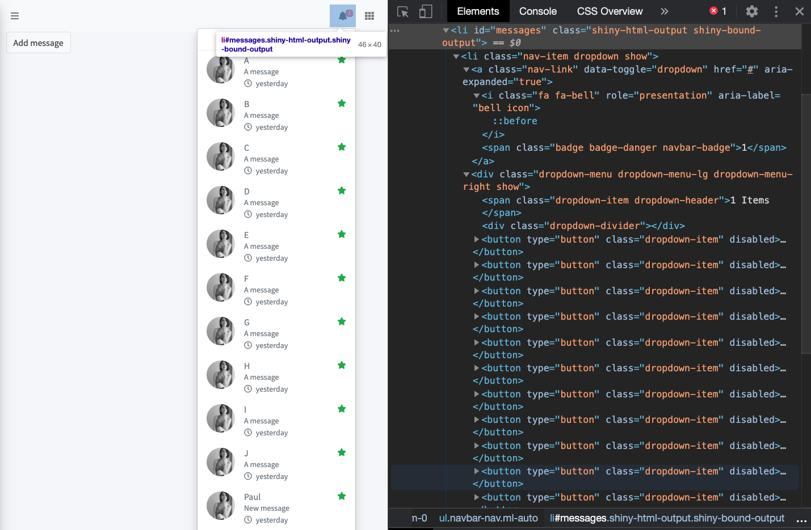
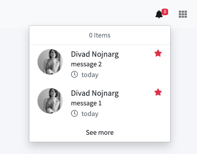

# Dynamically manage content with handlers {#shiny-custom-handler}

The three previous chapters are largely dedicated to Shiny input elements. Yet, not everything is input in Shiny. This chapter shows how one may leverage the internal Shiny JavaScript tools to build highly __interactive__ and __optimized__ interfaces. 

## Introduction

As shown in Hadley Wickham's Mastering Shiny [book](https://mastering-shiny.org/action-dynamic.html), there exists many functions to update UI components from the server. You can use all __update<INPUT_NAME>__ functions like `updateTextInput()` or `updateTabsetPanel()`. 
Other tools to manage your UI consist in __toggle__ functions like `hideTab()`, `showTab()`, the limit being the very few number of them, which often obliges to use packages like `shinyjs` [@R-shinyjs] or write custom JavaScript code. Finally, `insertUI()` and `removeUI()` allow to dynamically insert or remove any element, anywhere in the DOM. Let's start this chapter with the less optimized approach, that is `renderUI()`, to highlight its caveats and introduce better approaches to optimize your apps. 

## The renderUI case
The `renderUI()` and `uiOutput()` couple is the most famous way to render any HTML block from the server, without too much pain. While the `update<INPUT_NAME>` and `toggle` tools are component specific, meaning they only target the element to modify, `renderUI/uiOutput` re-renders the whole block each time an associated reactive dependency is invalidated, even though only a little part would deserve to be re-rendered. This approach is usually to avoid since it implies poor performances in complex apps. We consider a simple app in which a three seconds computation is required to get the slider input value, subsequently triggering the slider input rendering:

```{r, eval=FALSE}
library(shiny)
ui <- fluidPage(
  uiOutput("moreControls")
)

server <- function(input, output) {
  
  sliderValue <- reactive({
    # computationally intensive task
    Sys.sleep(3)
    1
  })
  
  output$moreControls <- renderUI({
    sliderInput("n", "N", sliderValue(), 1000, 500)
  })
}
shinyApp(ui, server)
```

The same example with the `updateSliderInput()` functions:

```{r, eval=FALSE}
ui <- fluidPage(
  sliderInput("n", "N", 100, 1000, 500)
)

server <- function(input, output, session) {
  
  sliderValue <- reactive({
    # computationally intensive task
    Sys.sleep(3)
    50
  })
  
  observeEvent(sliderValue(), {
    updateSliderInput(
      session,
      "n",
      value = sliderValue()
    )
  })
}
shinyApp(ui, server)
```

The first approach's biggest problem is the three seconds delay, during which nothing happens, which may discourage the end user. Although not ideal, the second approach is already much better, even though they may be tempted to play with the slider (and they will!), until it suddenly changes value, thereby creating a possibly weird situation. 

Below is an very naive and dirty example where `renderUI()` makes an entire dropdown menu re-render each time something changes in the `renderUI()` expression, being definitely not optimal. React users would probably leap off their chairs if they ever heard about this. Indeed, in React, we only re-render what needs to be [updated](https://en.reactjs.org/docs/rendering-elements.html#react-only-updates-whats-necessary)! 

Run the app below, open the HTML inspector and click to add one message. Notice that the entire block is updated, whereas only the corresponding HTML element should (Figure \@ref(fig:render-ui-1)). No doubt that any advanced user see a place for `insertUI()`.

::: {.importantblock data-latex=""}
This requires `{bs4Dash}` >= 2.0.0!
:::

```{r, eval=FALSE}
library(bs4Dash)
library(tibble)

new_message <- tibble(
  message = "New message",
  from = "Paul",
  time = "yesterday",
  color = "success"
)

shinyApp(
  ui = dashboardPage(
    dark = FALSE,
    header = dashboardHeader(
      rightUi = uiOutput("messages", container = tags$li)
    ),
    sidebar = dashboardSidebar(),
    controlbar = dashboardControlbar(),
    footer = dashboardFooter(),
    title = "test",
    body = dashboardBody(actionButton("add", "Add message"))
  ),
  server = function(input, output) {
    
    messages <- reactiveValues(
      items = tibble(
        message = rep("A message", 10),
        from = LETTERS[1:10],
        time = rep("yesterday", 10),
        color = rep("success", 10)
      )
    )
    
    observeEvent(input$add, {
      messages$items <- add_row(messages$items, new_message)
    })
    
    output$messages <- renderUI({
      dropdownMenu(
        badgeStatus = "danger",
        type = "messages",
        lapply(seq_len(nrow(messages$items)), function(r) {
          temp <- messages$items[r, ]
          messageItem(
            message = temp$message,
            from = temp$from, 
            time = temp$time,
            color = temp$color
          )
        })
      )
    })
  }
)
```
```{r render-ui-1, echo=FALSE, fig.cap='renderUI is not specific', out.width='100%'}

```

This lack of specificity justifies why you should avoid this method as much as possible, as it overloads the server. Later in this chapter, we leverage __custom handlers__ to solve this problem. Overall, it's more work, maybe more complex but ensures to be specific and more optimized.

## Other Shiny handlers {#insert-ui}
As mentioned in Chapter \@ref(update-input-lifecycle), all `update<INPUT_NAME>` functions are Shiny defined __messages handlers__. 

### The insertUI case
Under the hood, `insertUI()` sends a R [message](https://github.com/rstudio/shiny/blob/master/R/shiny.R#L1696) through `session$sendInsertUI`, via the __websocket__:

```{r, eval=FALSE}
session$sendInsertUI(
  selector = selector, 
  multiple = multiple, 
  where = where, 
  content = processDeps(ui, session)
)

sendInsertUI = function(selector, multiple, where, content) {
  private$sendMessage(
    `shiny-insert-ui` = list(
      selector = selector,
      multiple = multiple,
      where = where,
      content = content
    )
  )
}
```

The content is processed by `shiny:::processDeps` that:

  - __Finds__ and __resolve__ any HTML dependency, as shown in Chapter \@ref(htmltools-dependencies).
  - For each dependency, makes sure the corresponding files can be accessed on the server with `createWebDependency()` and `addResourcePath()`. 
  - Returns a list of the HTML element and dependencies. The HTML will be accessed by `message.content.html` and dependencies by `message.content.deps`.
  
On the UI side, Shiny has a predefined message [handler](https://github.com/rstudio/shiny/blob/60db1e02b03d8e6fb146c9bb1bbfbce269231add/srcjs/shinyapp.js#L671):

```js
addMessageHandler('shiny-insert-ui', function(message) {
  let targets = $(message.selector);
  if (targets.length === 0) {
    // render the HTML and deps to a null target, so
    // the side-effect of rendering the deps, singletons,
    // and <head> still occur
    console.warn(
      'The selector you chose ("' + 
      message.selector +
      '") could not be found in the DOM.'
    );
    exports.renderHtml(
      message.content.html, 
      $([]), 
      message.content.deps
    );
  } else {
    targets.each(function (i, target) {
      exports.renderContent(
        target, 
        message.content, 
        message.where
      );
      return message.multiple;
    });
  }
})
```

It checks whether the provided selector has multiple DOM elements. If at least one item is found, it calls __renderContent(html, el, dependencies)__ that triggers __renderHtml(html, el, dependencies)__:

  - __Processes__ the provided HTML (treat the head, body and singletons).
  - __Renders__ all given dependencies into the page's [head](https://github.com/rstudio/shiny/blob/master/srcjs/output_binding_html.js#L241).
  - __Insert__ the HTML into the page at the position provided in the `insertUI` __where__ parameter. Internally this calls the `insertAdjacentHTML` method. 
  - __Initialize__ any input, __bind__ them to the scope and __send__ the value to the server so that output/observers are invalidated. Outputs are also bound. If this step is skiped, the newly inserted input won't react, so are the related outputs and any observer.
  
::: {.noteblock data-latex=""}
Keep __renderContent__ and __renderHtml__ in mind, we'll use them in section \@ref(custom-ui-functions).
:::
  
### Example 
Going back to the previous example, why don't we just go for `insertUI()`?

```{r, eval=FALSE}
ui <- dashboardPage(
  dark = FALSE,
  header = dashboardHeader(
    rightUi = dropdownMenu(
      badgeStatus = "danger",
      type = "messages"
    )
  ),
  sidebar = dashboardSidebar(),
  controlbar = dashboardControlbar(),
  footer = dashboardFooter(),
  title = "test",
  body = dashboardBody(actionButton("add", "Add dropdown item"))
)

user <- "https://adminlte.io/themes/v3/dist/img/user2-160x160.jpg"

shinyApp(
  ui = ui,
  server = function(input, output, session) {
    
    observeEvent(input$add, {
      insertUI(
        selector = ".dropdown-menu > 
        .dropdown-item.dropdown-header",
        where = "afterEnd",
        ui = messageItem(
          message = paste("message", input$add),
          image = user,
          from = "Divad Nojnarg",
          time = "today",
          color = "success"
        )
      )
    })
  }
)
```

Well, if the item is inserted, the item counter as well as the dropdown text are not, as depicted Figure \@ref(fig:insertUI-1)! We can't blame `insertUI()` for this, since this is the fault of the `{bs4Dash}` component that actually has interconnected HTML pieces. Indeed, the `bs4Dash::dropdownMenu()` function generates HTML, detecting the number of `bs4Dash::messageItem`. This works well when the app fires but the component is not able to maintain an up to date state. 

```{r insertUI-1, echo=FALSE, fig.cap='insertUI is not enough specific', out.width='100%'}

```

We may fix that by adding extra `insertUI()` and `removeUI()` to replace those parts (`insertUI()` does not update the targeted item). Moreover, you we must set correct priority for each `observeEvent()` (try to remove them, it will fail) to ensure that __remove__ happens before __insert__: 

```{r, eval=FALSE}
user <- "https://adminlte.io/themes/v3/dist/img/user2-160x160.jpg"
shinyApp(
  ui = ui,
  server = function(input, output, session) {
    # remove old badge
    observeEvent(input$add, {
      removeUI(selector = ".badge-danger.navbar-badge")
    }, priority = 1)
    # insert new badge
    observeEvent(input$add, {
      insertUI(
        selector = "[data-toggle=\"dropdown\"]",
        where = "beforeEnd",
        ui = tags$span(
          class = "badge badge-danger navbar-badge", 
          input$add
        )
      )
    })
    
    # remove old text counter
    observeEvent(input$add, {
      removeUI(selector = ".dropdown-item.dropdown-header")
    }, priority = 1)
    
    # insert new text counter
    observeEvent(input$add, {
      insertUI(
        selector = ".dropdown-menu",
        where = "afterBegin",
        ui = tags$span(
          class = "dropdown-item dropdown-header", 
          sprintf("%s Items", input$add)
        )
      )
    })
    
    observeEvent(input$add, {
      insertUI(
        selector = ".dropdown-menu > 
        .dropdown-item.dropdown-header",
        where = "afterEnd",
        ui = messageItem(
          message = paste("message", input$add),
          image = user,
          from = "Divad Nojnarg",
          time = "today",
          color = "success"
        )
      )
    })
    
  }
)
```

So many `observeEvent()` for a simple action! Imagine if we had 10 similar tasks ... Isn't there a way to do all of this at once, thereby reducing the server code? Moreover, setting priorities in `observeEvent()` is a rather bad smell of poorly designed shiny app.

It seems that we have to create our own message handler! 

## Custom handlers

Custom __handlers__ are a specific category of message handlers, as they are user defined.

### Theory
Shiny provides tools to ease the communication between R and JavaScript, as illustrated in section \@ref(shiny-intro). We already discussed the usage of `session$sendInputMessage()` in the input binding section \@ref(shiny-input-system). The other important method is __session$sendCustomMessage(type, message)__. It works by pair with the JS method __Shiny.AddCustomMessageHandler__, tightly linked by the type parameter.

```{r, eval=FALSE}
say_hello_to_js <- function(
  text, 
  session = getDefaultReactiveDomain()
) {
  session$sendCustomMessage(type = 'say-hello', message = text)
}
```

The JavaScript part is defined below:

```js
$(function() {
  Shiny.AddCustomMessageHandler(
    'say-hello', function(message) {
      alert(`R says ${message} to you!`)
  });
});
```

The following shiny app example will simply print a welcome message every five seconds. We obviously set `options(shiny.trace = TRUE)` so as to capture all messages sent between R and JS. Figure \@ref(fig:shiny-custom-message) summarizes the main mechanisms involved in the R to JS communication. The corresponding code may be found [here](https://github.com/DivadNojnarg/outstanding-shiny-ui-code/blob/master/R/say_hello.R). Don't forget to load the `say_hello_to_js()` function before:

```{r, eval=FALSE}
shinyAppDir(system.file(
  "custom-handlers/say_hello", 
  package = "OSUICode"
))
```

```{r shiny-custom-message, echo=FALSE, fig.cap='From R to JavaScript', out.width='100%'}
knitr::include_graphics("images/survival-kit/shiny-custom-message.png")
```

Combining `Shiny.setInputValue` and `Shiny.addCustomMessageHandler`, here is a fun example
that sets the body background as a result of a simple button click.
We defined three JS pieces:

  - `getPokemon` whose script is adapted from Colin Fay et al. (see [here](https://engineering-shiny.org/optimjs.html)). This function fetch the [pokeapi](https://pokeapi.co/).
  data and if successful sets an input value, which will be available on the R side
  - An event listener is set to the only button of the page so that each time we click,
  we call `getPokemon` to select a random background image.
  - `input$pokeData` is actually a quite complex list and some manipulation is done from R in the `observeEvent()` block. Once done, we send the data back to JS through the websocket (the session object sends a message). 
  - On the JS side, the last block is a custom message handler that will add some inline
  CSS properties to the body element.

```js
$(function() {
  // Taken from Colin
  const getPokemon = () => {
    // FETCHING THE API DATA
    let randId = Math.floor(Math.random() * (+151 + 1 - +1)) + +1;
    fetch('https://pokeapi.co/api/v2/pokemon/' + randId)
    // DEFINE WHAT HAPPENS WHEN JAVASCRIPT RECEIVES THE DATA
    .then((data) =>{
      // TURN THE DATA TO JSON
      data.json().then((res) => {
        // SEND THE JSON TO R
        Shiny.setInputValue('pokeData', res, {priority: 'event'})
      })
    })
    // DEFINE WHAT HAPPENS WHEN THERE IS AN ERROR FETCHING THE API
    .catch((error) => {
      alert('Error catching result from API')
    })
  };
        
  // add event listener
  $('#button').on('click', function() {
    getPokemon();
  });
        
  // update background based on R data
  Shiny.addCustomMessageHandler(
    'update_background', function(message) {
      $('body').css({
        'background-image':'url(' + message +')', 
        'background-repeat':'no-repeat'
      });
  });
});
```

A demonstration may be run from the `{OSUICode}` side package:

```{r, eval=FALSE}
library(OSUICode)
runPokemonExample()
```

### Toward custom UI management functions {#custom-ui-functions}

#### An insertMessageItem function
In this example, we go back to the `bs4Dash::dropdownMenu()` issue, discussed earlier
in the chapter. We propose a method only involving custom message handlers.

```{r, eval=FALSE}
insertDropdownItem <- function(
  item, 
  session = shiny::getDefaultReactiveDomain()
) {
  session$sendCustomMessage(
    type = "add-dropdown-item", 
    message = as.character(item)
  )
}
```

We create the `insertMessageItem` function with two parameters:

  - item, the HTML element we want to insert in the DOM.
  - __session__, used to send a message to JavaScript with `session$sendCustomMessage`.
  
We don't use `processDeps` as it is very unlikely that our `messageItem` contains any extra dependency. item is converted to a character (important) and sent to JavaScript through the shiny session R6 object. We give it a __type__, that is `add-message-item`, to be able to identify it from JavaScript with `Shiny.addCustomMessageHandler`.

```js
$(function() {
  Shiny.addCustomMessageHandler(
    'add-message-item', function(message) {
      // since we do not re-render the dropdown, 
      // we must update its item counter
      let $items = $('.dropdown-menu')
        .find('.dropdown-item')
        .length;
      $('.dropdown-item.dropdown-header').html($items + ' Items');
      $('.nav-item.dropdown').find('.navbar-badge').html($items);
      // convert string to HTML
      let itemTag = $.parseHTML(message)[0];
      $(itemTag).insertAfter($('.dropdown-item.dropdown-header'));
  });
});
```

 We update dropdown menu item counter as well as the icon text since the dropdown menu is not re-rendered. The number of items is given by the dropdown children (without the `dropdown-divier` class). These two extra JS steps save us to create extra `observeEvent()` on the server, as shown before.
We then recover the sent message on the JS side with `Shiny.addCustomMessageHandler`, parse the string to HTML with `$.parseHTML` and insert it after the header (that is the next UI element of the dropdown body). The `bs4Dash::dropdownMenu()` is modified so that dependencies are [attached](https://github.com/DivadNojnarg/outstanding-shiny-ui-code/blob/master/R/insertMessageItem.R#L67). You may run the example yourself. Note we load `{OSUICode}` to overwrite the `{bs4Dash}` function:

```{r, eval=FALSE}
# shinyAppDir(system.file(
#   "custom-handlers/add-message-item", 
#   package = "OSUICode"
# ))
user <- "https://adminlte.io/themes/v3/dist/img/user2-160x160.jpg"
library(OSUICode)
shinyApp(
  ui = ui,
  server = function(input, output, session) {
    observeEvent(input$add, {
      insertMessageItem(
        messageItem(
          message = paste("message", input$add),
          image = user,
          from = "Divad Nojnarg",
          time = "today",
          color = "success"
        )
      )
    })
  }
)
```

This solution significantly lightens the server code since everything may be done on the JS side in one step. 

#### A chat system for shinydashboardPlus

`{shinydashboardPlus}` user messages provide an easy way to create a chat system within a shiny app. `userMessages()` hosts the main container while `userMessage()` is the message element. All of this is pure HTML:

```html
<div class="direct-chat-msg">
  <div class="direct-chat-info clearfix">
    <span class="direct-chat-name pull-left">
      Alexander Pierce
    </span>
    <span class="direct-chat-timestamp pull-right">
      23 Jan 2:00 pm
    </span>
  </div>
  <!-- /.direct-chat-info -->
  
  <!-- /.direct-chat-img -->
  <div class="direct-chat-text">
    Is this template really for free? That's unbelievable!
  </div>
  <!-- /.direct-chat-text -->
</div>
```

Figure \@ref(fig:shinydashboardPlus-chat) shows the overall appearance.  

```{r shinydashboardPlus-chat, echo=FALSE, fig.cap='Chat user interface for AdminLTE2', out.width='100%'}
knitr::include_graphics("images/survival-kit/shinydashboardPlus-chat.png")
```

Given that no JavaScript API is available to handle messages, that is send/receive/edit/remove action, we are going to design a dedicated R and JavaScript API step by step. 

##### HTML elements
The message container is a simple `div` element:

```html
<div class="direct-chat-messages">...</div>
```

where `...` receives all messages. From the AdminLTE demonstration [page](https://adminlte.io/themes/AdminLTE/index2.html), the class `direct-chat-warning` gives the yellow color to the sent messages, while received messages are always gray. In `{shinydashboardPlus}`, the container is defined as below:

```{r, eval=FALSE}
userMessages <- function(..., id = NULL, status, width = 4, 
                         height = NULL) {
  cl <- "direct-chat-messages direct-chat"
  if (!is.null(height)) shiny::validateCssUnit(height)
  if (!is.null(status)) {
    validateStatus(status)
    cl <- paste0(cl, " direct-chat-", status)
  }
  msgtag <- shiny::tags$div(
    class = cl, 
    ..., 
    style = if (!is.null(height)) {
      sprintf("height: %s; overflow-y: auto;", height)
    } else {
      "height: 100%;"
    }
  )
  
  shiny::tags$div(
    id = id,
    class = if (!is.null(width)) paste0("col-sm-", width),
    msgtag
  )
  
}
```

The most important element is the __id__ parameter that makes the link with the custom message handler on the JavaScript side. The message element is defined as:

```{r eval=FALSE}
userMessage <- function(..., author, date = NULL, image = NULL, 
                        type = c("sent", "received")) {
  
  type <- match.arg(type)
  messageCl <- "direct-chat-msg"
  if (type == "sent") messageCl <- paste0(messageCl, " right")
  
  # message info
  messageInfo <- shiny::tags$div(
    class = "direct-chat-info clearfix",
    shiny::tags$span(
      class = if (type == "right") {
        "direct-chat-name pull-right"
      } else {
        "direct-chat-name"
      }, 
      author
    ),
    if (!is.null(date)) {
      shiny::tags$span(
        class = if (type == "right") {
          "direct-chat-timestamp right"
        } else {
          "direct-chat-timestamp"
        }, 
        date
      )
    }
  )
  
  # message Text
  messageTxt <- shiny::tags$div(
    class = "direct-chat-text", 
    ...
  )
  
  # message author image
  messageImg <- shiny::tags$img(
    class = "direct-chat-img", 
    src = image
  )
  
  shiny::tags$div(
    class = messageCl,
    messageInfo,
    messageImg, 
    messageTxt
  )
}
```

There are three parts:

  - The __author__ tag, defined in the `messageInfo` variable.
  - The __message__ itself, defined in the `messageTxt` variable.
  - The author __image__, contained in the `messageImg` variable.

The message class varies depending whether it is __received__ or __sent__, which actually changes its position (left and right, respectively). Note the corresponding HTML classes like `direct-chat-text` since we will use them in the JS code.

##### Handle interactions
`userMessages()` and `userMessage()` alone only provide a static API. Let's design an `updateUserMessages()` function that offers way to update the message container. That function must allow to:

  - __Add__ any message to the list.
  - __Remove__ any existing message.
  - __Update__ a selected message.
  
For now, we assume to add only one message at a time. `updateUserMessages()` is linked to any `userMessages()` container by the __id__ parameter. In order to delete/update a message, we define an __index__ parameter

::: {.warningblock data-latex=""}
Don't forget that R starts from 1 while JS starts from 0.
:::

Consequently, we have to decrease the R index by 1 so that JS receives the correct number. We must also provide a content parameter so as to update any existing message content. The content has to be compatible we the `userMessage` structure. We expect the user to pass a list like:

```{r, eval=FALSE}
img <- "https://adminlte.io/themes/v3/dist/img/user2-160x160.jpg"
list(
  author = "David",
  date = "Now",
  image = img,
  type = "received",
  text = tagList(
    sliderInput(
      "obs", 
      "Number of observations:",
      min = 0, 
      max = 1000, 
      value = 500
    ),
    plotOutput("distPlot")
  )
```

Interestingly, we may offer the ability to add input/output element in the message content (as shown above) with __dependencies__ that are not yet made available to shiny. We therefore assume that if the content is a shiny tag or a list of shiny tags, it may contain elements with extra dependencies and leverage the `shiny:::processDeps()` function on the R side for all elements with `lapply()` function. Finally, the message is sent to JS with `session$sendCustomMessage`:

```{r, eval=FALSE}
updateUserMessages <- function(
  id, 
  action = c("add", "remove", "update"), 
  index = NULL, 
  content = NULL, 
  session = shiny::getDefaultReactiveDomain()
) {
  action <- match.arg(action)
  
  content <- lapply(content, function(c) {
    if (inherits(c, "shiny.tag") || 
        inherits(c, "shiny.tag.list")) {
      # necessary if the user pass input/output with deps
      # that are not yet available in the page before 
      # inserting the new tag
      c <- processDeps(c, session)
    }
    c
  })
  
  session$sendCustomMessage(
    "user-messages", 
    list(
      id = session$ns(id), 
      action = action, 
      index = index,
      body = content
    )
  )
}
```

We also share the container __id__ to be able to select the appropriate target on the JS side. As a reminder, the message handler name has to be the same on the JS side!

::: {.noteblock data-latex=""}
Note the __session$ns__ that actually makes sure this function can work within shiny [modules](https://shiny.rstudio.com/reference/shiny/1.6.0/moduleServer.html).
:::

We are now all done on the R side but still have to design the JS interface. The first step is to create a custom message handler skeleton:

```js
Shiny.addCustomMessageHandler(
  "user-messages", function(message) {
    // JS logic
});
```

where the __message__ parameter is actually the message sent through the R `updateUserMessages()` function. We recall that if we send a list, it is subsequently converted into a JS object. Therefore, to access the container __id__ element, we do:

```js
message.id
```

and similarly for other elements. There may be nested lists, like the message content, which is not very complex to handle: we simply use the `.` JS notation to access lower level elements, that is `message.content.text` for the message text. 

The second step is to store all message elements in multiple variables separated by commas. This step is not mandatory but improves the code readability:

```js
Shiny.addCustomMessageHandler(
  "user-messages", function(message) {
    let id = message.id, 
      action = message.action, 
      content = message.body, 
      index = message.index;
});
```

In the following we show how to process any message content. For sake of simplicity, we assume to be able to only edit the message text. As mentioned earlier, there are two possible cases:

  - The text is simple text or simple HTML without any extra dependency, we do nothing more than storing it into a meaningful variable.
  - The text is a list of shiny tags containing input/output with extra dependencies like `sliderInput()`. We have to leverage the `renderHtml` method to correctly process the missing dependencies passed from R via `shiny:::processDeps()` in `updateUserMessages()`.
  
This yields:

```js
Shiny.addCustomMessageHandler(
  "user-messages", function(message) {
  let id = message.id, 
    action = message.action, 
    content = message.body, 
    index = message.index;
  
  if (content.hasOwnProperty("text")) {
    let text;
    if (content.text.html === undefined) {
      text = content.text;
    } else {
      text = Shiny.renderHtml(
        content.text.html, 
        $([]), 
        content.text.deps
      ).html;
    } 
  }
  
});
```

::: {.noteblock data-latex=""}
`hasOwnProperty` checks whether content has a text property, which avoids running code
whenever not necessary.
:::

Then, the next step is to implement the multiple options provided by the user (update, add, remove). We consider the simplest case, that is `remove` a message. We remind the reader that the __action__ contains the user choice in `updateUserMessages()`. What do we need to remove a given message?

  - It's index contained in the __index__ variable.
  - The container __id__.
  - Remember that a message has the `direct-chat-msg` class.
  - Use the `remove` jQuery method.
  
We therefore target the main container with `$("#" + id)`, look for its messages with `find(".direct-chat-msg")`, specify the target using `eq(index - 1)` (index is the R value) and apply the remove method:

```js
if (action === "remove") {
  $("#" + id).find(".direct-chat-msg").eq(index - 1).remove();
}
```

We could add more security with `console.warn` whenever the user wants to delete a message that does not exist. We leave it to the reader as an exercise. 

The second case consists in adding a new message. We define new variables containing the
author, the date, the image and the message type. Below is a reminder of the message HTML structure:

```html
<div class="direct-chat-msg">
  <div class="direct-chat-info clearfix">
    <span class="direct-chat-name pull-left">
      AUTHOR (TO REPLACE)
    </span>
    <span class="direct-chat-timestamp pull-right">
      DATE (TO REPLACE)
    </span>
  </div>
  <!-- /.direct-chat-info -->
  
    <!-- /.direct-chat-img -->
  <div class="direct-chat-text">MAIN CONTENT (TO REPLACE)
  </div>
  <!-- /.direct-chat-text -->
</div>
```

In our JS logic, we use the same template and replace any relevant element (see capital letters) 
by the previously created variables. We might use the string [interpolation](https://developer.mozilla.org/en-US/docs/Web/JavaScript/Reference/Template_literals#browser_compatibility), keeping in mind this is not compatible with Internet Explorer. We wrap all of these elements in a `direct-chat-msg` div which class may vary depending on the message type. If sent, the class is `direct-chat-msg right` and `direct-chat-msg` otherwise. The final step is to target the main container with `$("#" + id)`, look for the messages slot `find(".direct-chat-messages")` (the message container is nested in the main wrapper) and `append` it 
to the DOM. We used `append` which adds the message at the end but could choose `prepend` to add it on top
of all other messages. This behavior may be defined by the programmer with no option for the end-user.
Alternatively, the developer could expose an external parameter to control the add position. 

```js
// other condition before ...
else if (action === "add") {
  let author = content.author, 
    date = content.date, 
    image = content.image, 
    type = content.type;
      
  // build the new message 
  let newMessage = `
    <div class="direct-chat-info clearfix">
      <span class="direct-chat-name"> 
        ${author}
      </span>
      <span class="direct-chat-timestamp" 
        style="margin-left: 4px">
        ${date}
      </span>
    </div>
     
    <div class="direct-chat-text">${text}</div>`;
    
  // build wrapper
  let newMessageWrapper;
  if (type === "sent") {
    newMessageWrapper = `
      <div class="direct-chat-msg right">
        ${newMessage} 
      </div>`;
  } else {
    newMessageWrapper = `
      <div class="direct-chat-msg">
        ${newMessage} 
      </div>`;
  }
  
  // append message
  $("#" + id)
    .find(".direct-chat-messages")
    .append(newMessageWrapper);
}
```

Finally, the last case is to update a given message. As stated above, we assume to only edit the
message text and the date. To update the message, we target the messages container with `$("#" + id)`,
look for all texts with `find(".direct-chat-text")`, refine our choice by targeting the good element with
`eq(index - 1)` and call `replaceWith` containing the new text element: 

```js
else if (action === "update") {
      
  // today's date
  let d = new Date();
  let month = d.getMonth() + 1;
  let day = d.getDate();
  let today = d.getFullYear() + '/' +
    ((''+month).length<2 ? '0' : '') + month + '/' +
    ((''+day).length<2 ? '0' : '') + day;
    
  // we assume only text may be updated. 
  // Does not make sense to modify author
  
  $("#" + id)
    .find(".direct-chat-text")
    .eq(index - 1)
    .replaceWith(`
      <div class="direct-chat-text">
        <small class="text-red">
          (modified: ${today})
        </small>
        <br>
      </div>
    `)
}
```

Don't forget to __unbind__, re-__initialize__ and __bind__ all inputs by successively calling `Shiny.unbindAll();`, `Shiny.initializeInputs();` and `Shiny.bindAll();`. If you ommit this part, the newly inserted input/output elements won't work! The whole JS code may be found below:

```js
// userMessages
  // ------------------------------------------------------------------
  // This code creates acustom handler for userMessages
  Shiny.addCustomMessageHandler(
    "user-messages", function(message) {
    let id = message.id, 
      action = message.action, 
      content = message.body, 
      index = message.index;
    
    // message text
    // We use Shiny.renderHtml to handle the case where 
    // the user pass input/outputs in the updated content 
    // that require a new dependency not available in the 
    // page at startup. 
    if (content.hasOwnProperty("text")) {
     let text;
      if (content.text.html === undefined) {
        text = content.text;
      } else {
        text = Shiny.renderHtml(
          content.text.html, $([]), 
          content.text.deps
        ).html;
      } 
    }
    
    // unbind all
    Shiny.unbindAll();
    
    if (action === "remove") {
      $("#" + id)
        .find(".direct-chat-msg")
        .eq(index - 1)
        .remove();
    } else if (action === "add") {
      let author = content.author, 
        date = content.date, 
        image = content.image, 
        type = content.type;
      
      // build the new message 
      let newMessage = `
        <div class="direct-chat-info clearfix">
          <span class="direct-chat-name"> 
            ${author}
          </span>
          <span class="direct-chat-timestamp" 
            style="margin-left: 4px">
            ${date}
          </span>
        </div>
         
        <div class="direct-chat-text">${text}</div>`;
        
      // build wrapper
      let newMessageWrapper;
      if (type === "sent") {
        newMessageWrapper = `
          <div class="direct-chat-msg right">
            ${newMessage} 
          </div>`;
      } else {
        newMessageWrapper = `
          <div class="direct-chat-msg">
            ${newMessage} 
          </div>`;
      }
      
      // append message
      $("#" + id)
        .find(".direct-chat-messages")
        .append(newMessageWrapper);
    } else if (action === "update") {
      
      // today's date
      let d = new Date();
      let month = d.getMonth() + 1;
      let day = d.getDate();
      let today = d.getFullYear() + '/' +
        ((''+month).length<2 ? '0' : '') + month + '/' +
        ((''+day).length<2 ? '0' : '') + day;
        
      // we assume only text may be updated. 
      // Does not make sense to modify author/date
      
      $("#" + id)
        .find(".direct-chat-text")
        .eq(index - 1)
        .replaceWith(`
          <div class="direct-chat-text">
            <small class="text-red">
              (modified: ${today})
            </small>
            <br>
          </div>
        `)
    }
    
    // Calls .initialize() for all of the input 
    // objects in all input bindings,
    // in the given scope (document)
    Shiny.initializeInputs();
    Shiny.bindAll(); // bind all inputs/outputs
  });
```

Output is shown on Figure \@ref(fig:shinydashboardPlus-chat-api). To reproduce that figure,
you may click on add message, then click on update message leaving the numeric input to 1.

```{r shinydashboardPlus-chat-api, echo=FALSE, fig.cap='Chat user interface for {shinydashboardPlus}', out.width='100%'}
knitr::include_graphics("images/survival-kit/shinydashboardPlus-chat-api.png")
```

as well as a demonstration:

```{r, eval=FALSE}
shinyAppDir(system.file(
  "vignettes-demos/userMessages", 
  package = "shinydashboardPlus"
))
```

Why can't we use the __renderContent__ JS function, thereby allowing use to remove the three extra steps (unbind, initialize and bind inputs)? This would lead to a __timing issue__. Indeed,
let's say we first click on add message which creates one slider input and one plot output. 
It works well the first time since those element don't exist for Shiny. If we remove the newly created message and click again on add, we obtain an error message `Uncaught Duplicate binding for ID distPlot`. The root cause is rather obvious and internal to `renderContent`. The later cannot be called before the target is in the DOM. It means that during some time, we actually added a second output (identical to the first one) without unbinding the first, thereby causing the __duplication__ error. 

Chapter \@ref(custom-templates-interactivity) provide another case study to practice __custom handler__ design.