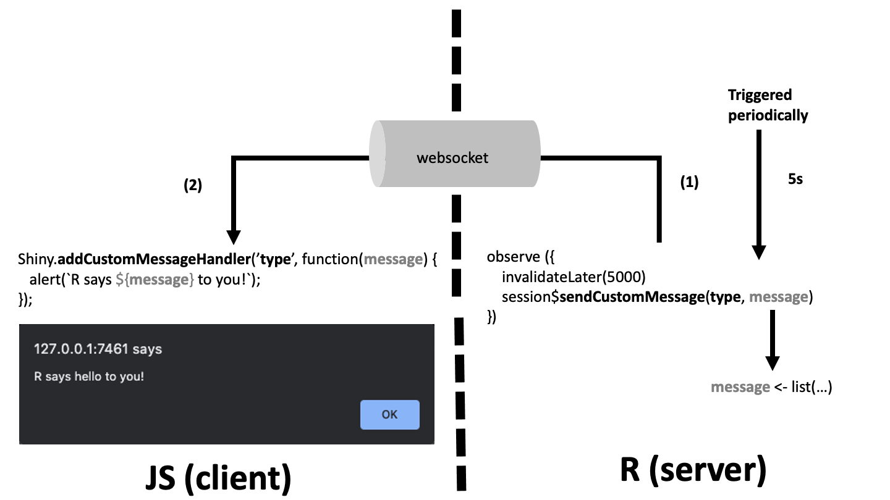

# Custom handlers: from R to JavaScript {#shiny-custom-handler}
Shiny provides tools to ease the communication between R and JavaScript. This is what happens in the last part. If you remember, we were playing with a `selectInput` and a `datatable`. How does R send messages to JavaScript?

We already discussed the usage of `sendInputMessage()` in the input binding section. The other important method is `sendCustomMessage(type, message)`. It works by pair with the JS method `Shiny.AddCustomMessageHandler`, linked with the type parameter.

```{r, eval=FALSE}
say_hello_to_js <- function(text, session = getDefaultReactiveDomain()) {
  session$sendCustomMessage(type = 'say-hello', message = text)
}
```

The JavaScript receptor is defined below:

```javascript
$(function() {
  Shiny.AddCustomMessageHandler('say-hello', function(message) {
    alert(`R says ${message} to you!`)
  });
});
```

The shiny app below will simply print a welcome message every 5 seconds. We obviously set `options(shiny.trace = TRUE)`. Figure \@ref(fig:shiny-custom-message) summarizes the main mechanisms involved in the R to JS communication. The corresponding code may be found [here](https://github.com/DivadNojnarg/outstanding-shiny-ui-code/blob/master/R/say_hello.R).

```{r, eval=FALSE}
shinyAppDir(system.file("chapter6/say_hello", package = "OSUICode"))
```

You will find a whole chapter dedicated to custom handlers here \@ref(custom-templates-interactivity).

```{r shiny-custom-message, echo=FALSE, fig.cap='From R to JavaScript'}

```