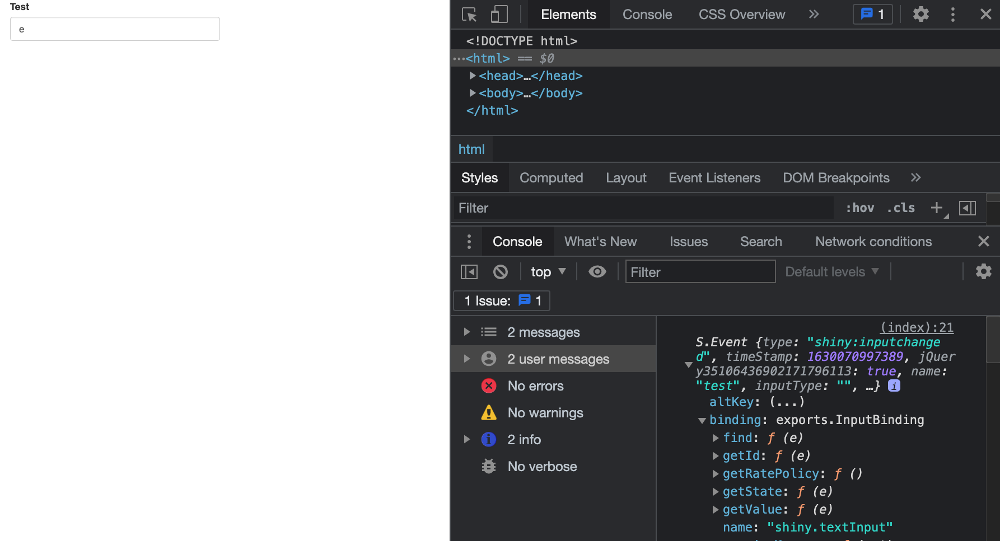
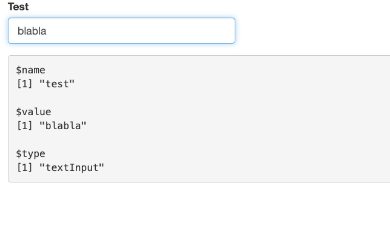
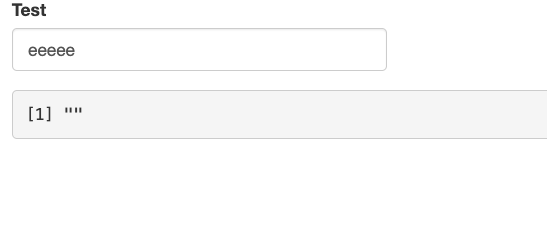
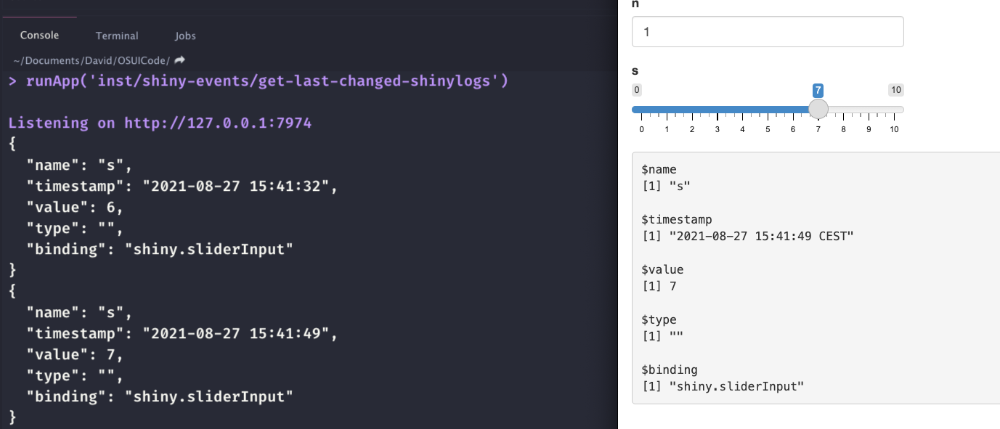

# Mastering Shiny's events {#shiny-input-gems}
We've already seen a couple of Shiny JS __events__ since the beginning of this book. You may know the `shiny:connected`, meaning that the client and server are properly initialized and all
internal methods/functions are available to the programmer. Below, we add more elements to the list, trying to
give practical examples. 

## Get the last changed input

### Motivations

We probably all had this question one day: How can I get the __last changed__ input in a Shiny app? There are already some methods like this [one](https://stackoverflow.com/questions/31250587/creating-shiny-reactive-variable-that-indicates-which-widget-was-last-modified): 

```{r, echo=FALSE, results='asis'}
code_chunk(OSUICode::get_example("shiny-events/get-last-changed"), "r")
```

Shouldn't this be easier? Could we do that from the client instead, thereby reducing the server load?

### Invoke JS events
`shiny:inputchanged` is the event we are looking for. It is fired each time an input gets a new value. The related events has five properties:

  - __name__, the event name.
  - __value__, the new value.
  - __inputType__, the input type.
  - __binding__, the related input binding.
  - __el__ the related input DOM element.

You may try below:

```{r, echo=FALSE, results='asis'}
code_chunk(OSUICode::get_example("shiny-events/get-input-changed"), "r")
```

Changing the `textInput()` value fires the event as shown Figure \@ref(fig:input-changed-event). 

```{r input-changed-event, echo=FALSE, fig.cap='Inspect the input-changed event in the JS console', out.width='100%'}

```

Contrary to what is mentioned in the online [documentation](https://shiny.rstudio.com/articles/js-events.html), __inputType__ does not always have a value. In this case, an alternative, is to access the related input binding and extract its name (Figure \@ref(fig: input-changed-event-zoom)), as shown below:

```js
$(document).on('shiny:inputchanged', function(event) {
  Shiny.setInputValue(
    'pleaseStayHome', 
    {
      name: event.name, 
      value: event.value, 
      type: event.binding.name.split('.')[1]
    }
  );
});
```

If you use this code in a custom shiny template, it is possible that input bindings doesn't have name, which would thereby make `event.binding.name.split('.')[1]` crash, `event.binding` being undefined.

```{r, echo=FALSE, results='asis'}
code_chunk(OSUICode::get_example("shiny-events/get-input-changed-info"), "r")
```

```{r input-changed-event-zoom, echo=FALSE, fig.cap='Extract input-changed event most relevant elements', out.width='100%'}

```

::: {.warningblock data-latex=""}
For the `textInput()`, the event is also fired when moving the mouse cursor with the keyboard arrows, which is a sort of false positive, since the value isn't changed. However, as `Shiny.setInputValue` only sets a new value when the input value really changed (unless the __priority__ is set to __event__), we avoid this edge case. As an exercice, you may try to add `{priority: 'event'}` to the above code. 
:::

`$(document).on('shiny:inputchanged')` is also cancellable, that is we may definitely prevent the input to change its value, calling `event.preventDefault();`, as depicted by Figure \@ref(fig:input-changed-freeze).

```{r, echo=FALSE, results='asis'}
code_chunk(OSUICode::get_example("shiny-events/freeze-input-change"), "r")
```

```{r input-changed-freeze, echo=FALSE, fig.cap='Cancel input update on the client.', out.width='100%'}

```

### Practical example

`{shinyMobile}` natively implements this feature that may be accessed with `input$lastInputChanged`.

```{r, echo=FALSE, results='asis'}
code_chunk(OSUICode::get_example("shiny-events/get-last-changed-shinyMobile"), "r")
```

This approach has the advantage not to overload the server part with complex logic.

### About `{shinylogs}`
The `{shinylogs}` [@R-shinylogs] package developed by [dreamRs](https://github.com/dreamRs/shinylogs) provide this feature with much more advanced options such as a history of past values, as demonstrated on Figure \@ref(fig:input-changed-shinylogs).

```{r, echo=FALSE, results='asis'}
code_chunk(OSUICode::get_example("shiny-events/get-last-changed-shinylogs"), "r")
```

```{r input-changed-shinylogs, echo=FALSE, fig.cap='{shinylogs} ', out.width='100%'}

```

## Custom overlay screens
If you ever designed corporate production apps, you probably faced this situation where clients wanted
a loading screen, whenever a computation occurs or at startup. 
To date, one of the most comprehensive alternative is the `{waiter}` [@R-waiter] package by John Coene. 
It provide myriad of options to significantly enhance the perceived performance of your app. 
In the following, we'll focus on the `waiter_preloader()` and `waiter_on_busy()` functions. How does this work?

### Preloader
Under the hood, this feature relies on the `shiny:idle` event. When the app starts, `shiny:idle` is triggered just after `shiny:connected` and `shiny:sessioninitialized`. `shiny:idle` is also called each time a computation cycle is finished, that is each time an input is changed and the related output are re-rendered.  

Whenever we call `waiter_preloader()`, an HTML overlay is added in the DOM. Moreover, this extra JS code ensures to
hide the waiter when shiny is ready:

```js
window.ran = false;
$(document).on('shiny:idle', function(event){
  if(!window.ran)
    hide_waiter(id = null);
  window.ran = true;
});
```

As a security, `window.ran` prevents us from running this code twice. As an example, consider this app with
a slider input and a plot output. We simulated a delay of three seconds to produce the plot.

```{r, echo=FALSE, results='asis'}
code_chunk(OSUICode::get_example("shiny-events/waiter-on-load"), "r")
```

Notice how the waiter correctly handles the plot processing time.

### Load on busy
Similarly, the `waiter_on_busy()` exploit the `shiny:idle` and `shiny:busy` events. Each time an output is invalidated, `shiny:busy` is fired, which triggers the recalculation until the next `shiny:idle` event. The loader is shown as soon as 
shiny is busy:

```js
$(document).on('shiny:busy', function(event) {
  show_waiter(
    id = null,
    html = ..., 
    color = ...
  );
});
```

and is hidden once shiny is done:

```js
$(document).on('shiny:idle', function(event) {
  hide_waiter(null);
});
```

```{r, echo=FALSE, results='asis'}
code_chunk(OSUICode::get_example("shiny-events/waiter-on-busy"), "r")
```
