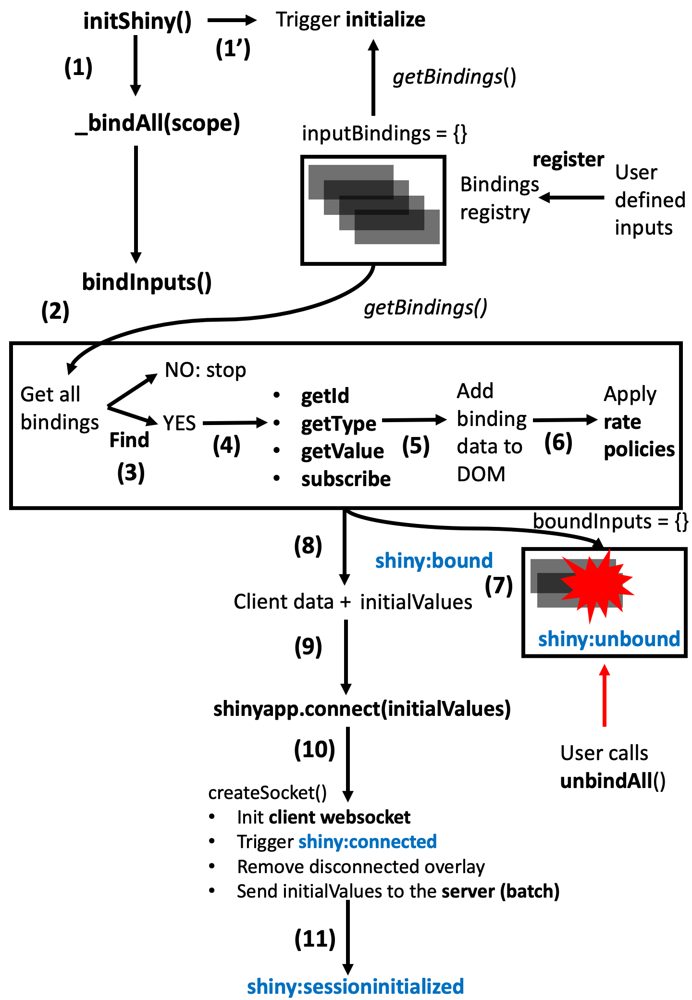

# Shiny inputs lifecycles {#shiny-input-lifecycle}
In the following, we recap everything we see from chapter \@ref(shiny-intro).

## App initialization
```{r init-shiny-recap, echo=FALSE, fig.cap='What Shiny does client side on initialization', out.width='100%'}

```

When a shiny apps starts, Shiny runs `initShiny` on the client. This [function](https://github.com/rstudio/shiny/blob/master/srcjs/init_shiny.js) has 3 main tasks:

  - Bind all inputs and outputs with `_bindAll()`.
  - Initialize all inputs (if necessary) with `initializeInputs`.
  - Initialize the client websocket connection mentioned in the previous chapter \@ref(shiny-intro) and send initial values to the server.

Most input bindings are in principle bundled in the `{shiny}` package. Some may be user-defined like in `{shinyMobile}` or even in a simple shiny app. In any case, 
they are all contained in a binding registry, namely `inputBindings` built on top the following class (the same apply for output bindings):

```js
var BindingRegistry = function() {
  this.bindings = [];
  this.bindingNames = {};
}
```

This class has method to `register` binding. This is the one we call when doing `Shiny.inputBindings.register(myBinding, 'reference');`, which appends the newly created binding to the bindings array. 

When shiny starts, it has to find all defined bindings with the `getBindings` method.
Once done, for each binding, `find` is triggered. If no corresponding element is found in the DOM, nothing is done. For each found input, the following methods are triggered:

  - `getId` (no described before) returns the input id. This ensures the uniqueness and is critical!
  - `getType` optionally handles any `registerInputHandler` defined by the user on the R side.
  - `getValue` gets the initial input value.
  - `subscribe` registers event listeners driving the input behavior.

The data attribute `shiny-input-binding` is then added. This allows shiny or any end-users to access the input binding methods from the client (in practice, very few end-users will do that). The `shiny-bound-input` class is added, the corresponding input is appended to the `boundInputs` object (listing all bound inputs) and `shiny:bound` triggered on the client.

Once done, shiny stores all initial values in a variable `initialInput`, also containing all [client data](https://shiny.rstudio.com/articles/client-data.html) and pass them to the `Shinyapp.connect` method. As shown in \@ref(shiny-intro), the latter opens the client websocket connection, raises the `shiny:connected` event and send all values to the server (R). Few time after, `shiny:sessioninitialized` is triggered.


In chapter \@ref(shiny-intro), we briefly described the `shiny` JavaScript object. As an exercise, let's explore what the `Shiny.shinyApp` object contains. The definition is located in the shinyapps.js [script](https://github.com/rstudio/shiny/blob/master/srcjs/shinyapp.js). 

```javascript
var ShinyApp = function() {
  this.$socket = null;
  
  // Cached input values
  this.$inputValues = {};
  
  // Input values at initialization (and reconnect)
  this.$initialInput = {};
  
  // Output bindings
  this.$bindings = {};
  
  // Cached values/errors
  this.$values = {};
  this.$errors = {};
  
  // Conditional bindings (show/hide element based on expression)
  this.$conditionals = {};
  
  this.$pendingMessages = [];
  this.$activeRequests = {};
  this.$nextRequestId = 0;
  
  this.$allowReconnect = false;
};
```

It creates several properties, some of them are easy to guess like `inputValues` or `initialInput`. Let's run the example below and open the HTML inspector. Notice that the `sliderInput` is set to 500 at `t0` (initialization).

```{r, eval=FALSE}
ui <- fluidPage(
  sliderInput("obs", "Number of observations:",
              min = 0, max = 1000, value = 500
  ),
  plotOutput("distPlot")
)

server <- function(input, output, session) {
  output$distPlot <- renderPlot({
    hist(rnorm(input$obs))
  })
}
shinyApp(ui, server)
```


Figure \@ref(fig:shiny-initial-inputs) shows how to access Shiny's initial input value with `Shiny.shinyapp.$initialInput.obs`. After changing the slider position, its value is given by `Shiny.shinyapp.$inputValues.obs`. `$initialInput` and `$inputValues` contains many more elements, however we are only interested in the slider function in this example.

```{r shiny-initial-inputs, echo=FALSE, fig.cap='Explore initial input values', out.width='100%'}
knitr::include_graphics("images/survival-kit/shiny-init-input.png")
```

## Update input
Below we try to explain what are the mechanisms to update an input from the server on the client. As stated above, it all starts with an `update<name>Input` function call, which actually sends a message through the current `session`. This message is received by the client websocket message manager:

```js
socket.onmessage = function(e) {
  self.dispatchMessage(e.data);
};
```

which sends the message to the appropriate [handler](https://github.com/rstudio/shiny/blob/master/srcjs/shinyapp.js#L552), that is `inputMessages`:

```js
addMessageHandler('inputMessages', function(message) {
  // inputMessages should be an array
  for (var i = 0; i < message.length; i++) {
    var $obj = $('.shiny-bound-input#' + $escape(message[i].id));
    var inputBinding = $obj.data('shiny-input-binding');

    // Dispatch the message to the appropriate input object
    if ($obj.length > 0) {
      var el = $obj[0];
      var evt = jQuery.Event('shiny:updateinput');
      evt.message = message[i].message;
      evt.binding = inputBinding;
      $(el).trigger(evt);
      if (!evt.isDefaultPrevented())
        inputBinding.receiveMessage(el, evt.message);
    }
  }
});
```
In short, this does get the inputId and access the corresponding input binding. Then it triggers the `shiny:updateinput` [event](https://shiny.rstudio.com/articles/js-events.html) and call the input binding `receiveMessage` method. This fires `setValue` and `subscribe`. 
The way `subscribe` works is not really well covered in the official [documentation](https://shiny.rstudio.com/articles/building-inputs.html). 
The `callback` function is actually defined during the initialization [process](https://github.com/rstudio/shiny/blob/master/srcjs/init_shiny.js#L174):

```js
function valueChangeCallback(binding, el, allowDeferred) {
  var id = binding.getId(el);
  if (id) {
    var value = binding.getValue(el);
    var type = binding.getType(el);
    if (type)
      id = id + ":" + type;

    let opts = {
      priority: allowDeferred ? "deferred" : "immediate",
      binding: binding,
      el: el
    };
    inputs.setInput(id, value, opts);
  }
}
```

`valueChangeCallback` ultimately calls `inputs.setInput(id, value, opts)`. The latters involves a rather complex chain of [reactions](https://github.com/rstudio/shiny/blob/master/srcjs/input_rate.js) (which is not described here). Overall, the result is stored in a queue, namely `pendingData` and sent to the server with `shinyapp.sendInput`:

```js
this.sendInput = function(values) {
  var msg = JSON.stringify({
    method: 'update',
    data: values
  });

  this.$sendMsg(msg);
    
  $.extend(this.$inputValues, values);
  // other things ...
}
```

The message has an `update` tag and is sent through the client websocket, only if the connection is opened. If not, it is added to the list of pending messages. 

```js
this.$sendMsg = function(msg) {
  if (!this.$socket.readyState) {
    this.$pendingMessages.push(msg);
  }
  else {
    this.$socket.send(msg);
  }
};
```

Finally, current `inputValues` are updated. On the server side, the new value is received
by the server websocket message handler, that is `ws$onMessage(message)`.


```{r update-input-recap, echo=FALSE, fig.cap='What Shiny does client side on initialization', out.width='100%'}
knitr::include_graphics("images/survival-kit/update-input-recap.png")
```