# Shiny's input system {#shiny-input-system}
Shiny __inputs__ are key elements of Shiny apps since they are a way for the end-user to __interact__ with the app. You may know `sliderInput()`, `numericInput()`, `checkboxInput()` but sometimes you may need fancier elements like `knobInput()` from [shinyWidgets](https://github.com/dreamRs/shinyWidgets/blob/master/R/input-knob.R), as depicted on Figure \@ref(fig:fancy-inputs) or even more sophisticated inputs like the [shinyMobile](https://github.com/RinteRface/shinyMobile/blob/master/R/f7-inputs.R) `smartSelect()` (Figure \@ref(fig:fancy-inputs), right panel). Have you ever wondered what are the mechanisms behind inputs? Have you ever dreamt to develop your own?

The goal of this section is to understand how Shiny inputs work and how to create new ones.

```{r fancy-inputs, echo=FALSE, fig.show = "hold", out.width = "50%", fig.align = "default", fig.cap='Custom shiny inputs. left: knobInput from shinyWidgets; right: smart select from shinyMobile'}
knitr::include_graphics("images/survival-kit/jquery-knobs.png")
knitr::include_graphics("images/survival-kit/smart-select.png")
```

## Input bindings {#input-binding}

When we run our app, most of the time it works just fine! The question is, what is the magic behind? Upon initialization, Shiny runs several JavaScript functions. Some are accessible to the programmer, thought the __Shiny__ JS object, already mentioned in section \@ref(shiny-js-object). To illustrate what they do, let's run the app below:

```{r, echo=FALSE, results='asis'}
code_chunk(OSUICode::get_example("input-system/dummy-app", view_code = FALSE), "r")
```

We then open the HTML inspector and run `Shiny.unbindAll(document)`, document being the scope, that is where to search. Try to change the slider input. You will notice that nothing happens. Now let's type `Shiny.bindAll(document)` and update the slider value. Moving the slider successfully update the plot. Magic isn't it? This simply shows that when inputs are not bound, nothing happens so __binding__ inputs is necessary!

We consider another example with multiple inputs and two buttons to bind/unbind inputs, respectively. Start it, change some input values, have a look at the corresponding text output. Click on unbind all and try to change some inputs. What happens? Click on bind and change another input value. What do you observe?

```{r, echo=FALSE, results='asis'}
code_chunk(OSUICode::get_example("input-system/bind-unbind"), "r")
```

Let's see below what is an input binding and how it works.

### Input structure
In HTML, an input element is given by the `<input>` tag as well as several attributes.

```html
<input id = "id" type = "text" class = "..." value = value>
```

  - __id__ guarantees the input uniqueness and a way for shiny to recover it in the `input$<id>` element. 
  - [type](https://www.w3schools.com/tags/att_input_type.asp) like `checkbox`, `button`,
  `text` ...__type__ may also be a good target for the input binding find method, as explained below. 
  - __class__ may be required to find the element in the DOM. It is more convenient for
  an input binding to target a class (and all associated elements) rather than an id which corresponds to one element by definition. It is also used by CSS to apply styles.
  - __value__ holds the input value.

### Binding Shiny inputs {#input-binding-steps}
An __input binding__ allows Shiny to identify each __instance__ of a given input and what you may do with this input. For instance, a slider input must update whenever the range is dragged or when the left and right arrows of the keyboard are pressed. It relies on a class defined in the `input_binding.js` [file](https://github.com/rstudio/shiny/blob/60db1e02b03d8e6fb146c9bb1bbfbce269231add/srcjs/input_binding.js). 

Let's describe each method chronologically. For better convenience, the book side package contains step by step demonstrations which may be found [here](https://github.com/DivadNojnarg/outstanding-shiny-ui-code/blob/master/R/inputs.R). Each example is called by the `customTextInputExample()`, which takes the input binding step as only parameter. For instance `customTextInputExample(1)` will invoke the first step, while `customTextInputExample(4)` will include all steps from 1 to 4.

#### Find the input
The first step, is critical which is to __locate__ the input in the __DOM__. On the R side, we define an input, with a specific attribute that will serve as a __receptor__ for the binding. For most of inputs, this may be handled by the __type__ attribute. In other cases, this may be the __class__, like for the `actionButton()`. On the JS side, we need a method able to identify this receptor. Moreover, two different types of inputs (for instance `radioButton()` and `selectInput()`) cannot have the same receptor for conflict reasons, whereas two instances of the same input type can. If your app contains 10 sliders, they all share the same input binding, and this is where the thing is powerful since they are all bound in one step. The receptor identifier is provided by the __find__ method of the `InputBinding` class. This method must be applied on a __scope__, that is the `document`. `find` accepts any valid jQuery selector: 

```js
find: function(scope) {
  return $(scope).find('.input-text');
}
```

::: {.importantblock data-latex=""}
Don't forget the `return` statement. Omitting it would cause the binding step to fail, as well as all other downstream
steps!
:::

Figure \@ref(fig:shiny-find-inputs) summarizes this important step.

```{r shiny-find-inputs, echo=FALSE, fig.cap='How to find inputs?', out.width='100%'}
knitr::include_graphics("images/survival-kit/shiny-find-inputs.png")
```

Below, we are going to re-create `textInput()` binding, step by step. As `{shiny}` already provides bindings for the `textInput()`, we don't want them to recognize our new input. Therefore, we add a new `input-text` class and make our own input binding pointing to that specific class:

```{r}
customTextInput <- function (
  inputId, 
  label, 
  value = "", 
  width = NULL, 
  placeholder = NULL,
  binding_step
) {
  
  # this external wrapper ensure to control the input width
  div(
    class = "form-group shiny-input-container", 
    style = if (!is.null(width)) {
      paste0("width: ", validateCssUnit(width), ";")
    },
    # input label
    shinyInputLabel(inputId, label), 
    
    # input element + JS dependencies
    tagList(
      customTextInputDeps(binding_step),
      tags$input(
        id = inputId,
        type = "text",
        class = "form-control input-text",
        value = value,
        placeholder = placeholder
      )
    )
  )
}
```

The last part of the code contains a `tagList()` with two elements:

  - The element input binding, `customTextInputDeps()`. `binding_step` allows us to review one step at a time, which is easier from a learning perspective. 
  - The input tag.
  
Below is an example of how we managed the dependency creation in the side package.
If we had multiple inputs, we would add more script to the dependency by passing a vector to the script parameter. 

```{r, eval=FALSE}
customTextInputDeps <- function(binding_step) {
  htmlDependency(
    name = "customTextBindings",
    version = "1.0.0",
    src = c(file = system.file(
      "input-system/input-bindings", 
      package = "OSUICode"
    )),
    script = paste0(
      "customTextInputBinding_", 
      binding_step, 
      ".js"
    )
  )
}
```

Figure \@ref(fig:text-input) shows the main elements of the `textInput()` widget. In the above code, `shinyInputLabel` is a Shiny internal function that creates the numeric input label, or in other word the text displayed next to it. The core input element is wrapped by `tags$input`.

```{r text-input, echo=FALSE, fig.cap='Shiny\'s textInput elements', out.width='100%'}
knitr::include_graphics("images/survival-kit/text-input.png")
```

We invite the reader to run the full working demonstration exposed below.

```{r, echo=FALSE, results='asis'}
code_chunk(OSUICode::get_example("input-system/binding-find"), "r")
```

In short, this example consists in a simple text input and an output showing the current text input value:

```{r, eval=FALSE}
customTextInputExample <- function(binding_step) {
  ui <- fluidPage(
    customTextInput(
      inputId = "caption",
      label = "Caption",
      value = "Data Summary",
      binding_step = binding_step
    ),
    textOutput("custom_text")
  )
  server <- function(input, output) {
    output$custom_text <- renderText(input$caption)
  }
  shinyApp(ui, server)
}
```

We open the developer tools to inspect the `customTextInputBinding.js` script, put a breakpoints in the `find` method and reload the page. Upon reload, the JavaScript debugger opens, as shown Figure \@ref(fig:binding-find). Type `$(scope).find('.input-text')` in the console and see what is displayed. This is the DOM element which you may highlight when you hover over the JavaScript output. 

Building input bindings like this significantly ease the debugging process and you'll get more chances to be successful!

```{r binding-find, echo=FALSE, fig.cap='Find is the first method triggered', out.width='100%'}
knitr::include_graphics("images/survival-kit/binding-find.png")
```

Now, let's see why it is better to target elements by type or class. We run the below example.

```{r, echo=FALSE, results='asis'}
code_chunk(OSUICode::get_example("input-system/binding-find-2"), "r")
```

This is a demonstration app containing two text inputs. Moreover, the binding is modified so that it looks for element having a specific id:

```js
find: function(scope) {
  return $(scope).find('#mytextInput');
}
```

If you repeat the above debugging steps, `$(scope).find('.input-text')` only targets the 
first text input, meaning that the second input will not be found and bound, as demonstrated in Figure \@ref(fig:binding-find-by-id).

```{r binding-find-by-id, echo=FALSE, fig.cap='Find by id is a rather bad idea', out.width='100%'}
knitr::include_graphics("images/survival-kit/binding-find-by-id.png")
```

As a side note, you'll also get an error in the binding (`Uncaught Not implemented`), indicating that the `getValue` method is not implemented yet. Fear not! We are going to add it very soon. 

#### Initialize inputs
Upon initialization, Shiny calls the `initializeInputs` function that takes all input bindings and call their __initialize__ method before binding all inputs. Note that once an input has been initialized, it has a `_shiny_initialized` tag to avoid initializing it twice. The `initialize` method is not always defined but some elements require to be explicitly initialized or activated. For instance the [Framework7](https://framework7.io) API, on top of which `{shinyMobile}` [@R-shinyMobile] is built, require to instantiate all elements. Below is an example for the [toggle](https://framework7.io/docs/toggle.html) input:

```js
// what is expected
let toggle = app.toggle.create({
  el: '.toggle',
  on: {
    change: function () {
      console.log('Toggle changed')
    }
  }
});
```

`el: '.toggle'` means that we are looking at the element(s) having the `toggle` class. `app.toggle.create` is internal to the Framework7 API. The corresponding `{shinyMobile}` input binding starts as follows: 

```js
var f7ToggleBinding = new Shiny.InputBinding();
  $.extend(f7ToggleBinding, {
    initialize: function(el) {
      app.toggle.create({el: el});
    },
    // other methods
});
```

Once initialized, we may use all specific methods provided by the API. [Framework7](https://framework7.io) is clearly a gold mine, as its API provides many possible options for many inputs/widgets. We provide more examples in Chapters \@ref(mobile-shinyMobile) and \@ref(mobile-widgets).

#### Get the value
The __getValue__ method returns the input value. The way to obtain the value is different for almost all inputs. For instance, the `textInput()` is pretty simple since the value is located in the `value` attribute. __el__ refers to the element holding the id attribute and recognized by the `find` method. Figure \@ref(fig:shiny-el) shows the result of a `console.log($(el));`.

```{r shiny-el, echo=FALSE, fig.cap='About el', out.width='100%'}
knitr::include_graphics("images/survival-kit/shiny-el.png")
```

```js
getValue: function(el) {
  console.log($(el));
  return $(el).val();
}
```

To get the value, we apply the jQuery method `val` on the `$(el)` element and return the result.

::: {.importantblock data-latex=""}
Don't forget the `return` statement!
:::

Similarly as in the find section, we run the below example and open the developer tools to inspect the `customTextInputBinding_2.js` script. 

```{r, echo=FALSE, results='asis'}
code_chunk(OSUICode::get_example("input-system/binding-get"), "r")
```

We put a breakpoints in the `getValue` method and reload the page. Upon reload, the JavaScript debugger opens starts in `find`. You may click on the next blue arrow to jump to the next breakpoints that is `getValue`, as shown Figure \@ref(fig:binding-getValue). Typing `$(el).val()` in the console shows the current 
text value.

```{r binding-getValue, echo=FALSE, fig.cap='getValue returns the current input value', out.width='100%'}
knitr::include_graphics("images/survival-kit/binding-getValue.png")
```

Clicking on next again exit the debugger. Interestingly, you'll notice that a text appears below the input, meaning that the `input$caption` element exists and is internally tracked by shiny. Notice that when you try to change the text content, the output value does not update as we would normally expect. We are actually omitting a couple of methods so preventing the binding from being fully functional. We will introduce them in the following sections!

#### Set and update 
__setValue__ is used to set the value of the current input. This method is necessary so that the input value may be __updated__. It has to be used in combination with __receiveMessage__, which is the JavaScript part of all the R __update<INPUT_NAME>Input__ functions, like `updateTextInput()`. We usually call the `setValue` method inside.

```js
// el is the DOM element.
// value represents the new value.
setValue: function(el, value) {
  $(el).val(value);
}
```

Let's create a function to update our custom text input. Call it `updateCustomTextInput`. It requires at least three parameters:

- __inputId__ tells which input to update.
- __value__ is the new value. This will be taken by the `setValue ` JS method in the input binding.
- __session__ is the Shiny session object mentioned earlier in section \@ref(shiny-session). We will use the __sendInputMessage__ to send values from R to JavaScript. The `receiveMessage` method will apply `setValue` with the data received from R. The current session is recovered with `getDefaultReactiveDomain()`.

```{r}
updateCustomTextInput <- function(
  inputId, 
  value = NULL, 
  session = getDefaultReactiveDomain()
) {
  session$sendInputMessage(inputId, message = value)
}
```

We add `setValue` and `receiveMessage` to custom input binding.

Figure \@ref(fig:shiny-update-inputs) illustrates the main mechanisms.

```{r shiny-update-inputs, echo=FALSE, fig.cap='Events following a click on the update button. This figure demonstrates how R and JS communicate, through the websocket.', out.width='100%'}
knitr::include_graphics("images/survival-kit/shiny-update-inputs.png")
```

If we have to pass multiple elements to update, we would have to change the `updateCustomTextInput` function such as:

```{r}
updateCustomTextInput <- function(
  inputId, 
  value = NULL, 
  placeholder = NULL, 
  session = getDefaultReactiveDomain()
) {
  message <- dropNulls(
    list(
      value = value,
      placeholder = placeholder
    )
  )
  session$sendInputMessage(inputId, message)
}
```

`shiny:::dropNulls` is an internal function ensuring that the list does not contain `NULL` elements. We send a list from R, which is then serialized to a JSON object. In the `receiveMessage` method, properties like `value` may be accessed using the `.` notation. It is good practice to add a `data.hasOwnProperty` check to avoid running code
if the specified property does not exist:

```js
// data are received from R. 
// It is a JS object. 
receiveMessage: function(el, data) {
  console.log(data);
  if (data.hasOwnProperty('value')) {
    this.setValue(el, data.value);
  }
  // other parameters to update...
}
```

::: {.noteblock data-latex=""}
__this__ refers to the custom text input binding class (which is an object), so that `this.setValue` allows to call
the `setValue` method ... 
:::


Similarly as in the previous sections, we run `updateCustomTextInputExample(3)` and open the developer tools to inspect the `customTextInputBinding_3.js` script. 

```{r, echo=FALSE, results='asis'}
code_chunk(OSUICode::get_example("input-system/binding-receive"), "r")
```

We put a breakpoints in the `receiveMessage` and `setValue` methods and reload the page. Upon reload, the JavaScript debugger opens starts in `find`. You may click on the next blue arrow until you reach `receiveMessage`, as shown Figure \@ref(fig:binding-receive). Inspecting the `data` object, it contains only one property namely the value. In practice, there may be more complex structure. As an exercise, you may change the `data.value` to whatever value you want.

```{r binding-receive, echo=FALSE, fig.cap='Receive a message from R', out.width='100%'}
knitr::include_graphics("images/survival-kit/binding-receive.png")
```

Click on the next arrow makes us jump in the next call that is `setValue`, where we can print the value to check whether it is correct. Running `$(el).val(value);` in the debugger console instantaneously update the DOM element with the new text, as shown on Figure \@ref(fig:binding-setValue).

```{r binding-setValue, echo=FALSE, fig.cap='Set the new value', out.width='100%'}
knitr::include_graphics("images/survival-kit/binding-setValue.png")
```

So far so good! We managed to update the text input value on the client. Yet, after clicking the button, the output value still does not change. We are going to fix this missing step in the next section.

#### Subscribe
__subscribe__ listens to __events__ defining Shiny to update the input value and make it available in the app. Some API like Bootstrap explicitly mention those events (like `hide.bs.tab`, `shown.bs.tab`, ...).
Going back to our custom text input, what event would make it change?

  - After a key is release on the keyboard. We may listen to `keyup`.
  - After copying and pasting any text in the input field or dictating text. The `input` event may be helpful.

We add those [events](https://javascript.info/events-change-input) to our binding using an __event listener__ seen in Chapter \@ref(survival-kit-javascript).

```js
$(el).on(
  'keyup.customTextBinding input.customTextBinding', 
  function(event) {
    callback(true);
});
```

::: {.noteblock data-latex=""}
Notice the event structure: `EVENT_NAME.BINDING_NAME`.  It is best practice to follow this
convention.
:::

The __callback__ parameter ensures that the new value is captured by Shiny. Chapter \@ref(shiny-input-lifecycle) provides more details, but this is quite technical. 


```{r, echo=FALSE, results='asis'}
code_chunk(OSUICode::get_example("input-system/binding-subscribe"), "r")
```

We run the above example, open the HTML inspector, select the `customTextInputBinding_4.js` script and put a break point in the `getValue` as well as `subscribe` method. We enter a new text inside the input field, which triggers the debugger inside the `subscribe` call. Inspecting the event object, the type indicate the action, which is an input action and the target is the text input element itself, depicted on Figure \@ref(fig:binding-subscribe-1).

```{r binding-subscribe-1, echo=FALSE, fig.cap='Subscribe method after a manual update of the text input', out.width='100%'}
knitr::include_graphics("images/survival-kit/binding-subscribe-1.png")
```

We click on next and notice that we go back in the `getValue` method to get the new value.
You may check typing `$(el).val()` in the debugger console, like on Figure \@ref(fig:binding-subscribe-2). Clicking next again shows the updated output value.

```{r binding-subscribe-2, echo=FALSE, fig.cap='Subscribe is followed by a new getValue', out.width='100%'}
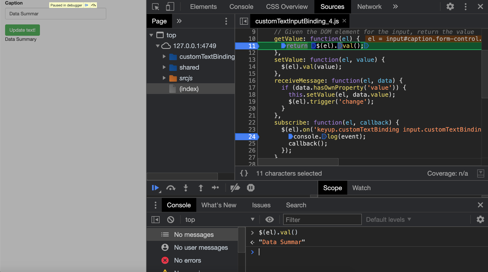
```

Hooray! The output result is successfully changed when the input value is manually updated. However, it is not modified when we click on the update button. What did we miss? Looking back at the `receiveMessage` method, we changed the input value but how does Shiny knows that this step was successful? To check that no event is raised, we put a `console.log(event);` in the `subscribe` method. Any action like removing the text content or adding new text triggers event but clicking on the action button does not. Therefore, we must trigger an event and add it to the `subscribe` method. We may choose the `change` event, that triggers when an element is updated. Notice the parameter passed to callback. We discuss it in the next part!

```js
$(el).on('change.customTextBinding', function(event) {
  callback(false);
});
```

Besides, in the `receiveMessage` we must trigger a `change` event to trigger the subscribe method:

```js
receiveMessage: function(el, data) {
  if (data.hasOwnProperty('value')) {
    this.setValue(el, data.value);
    $(el).trigger('change');
  }
}
```

Let's try again.

```{r, echo=FALSE, results='asis'}
code_chunk(OSUICode::get_example("input-system/binding-subscribe-2"), "r")
```

We put a new break point in the second event listener, that is the one for the change event. Clicking on the button only triggers the change event, as shown Figure \@ref(fig:binding-subscribe-3).

```{r binding-subscribe-3, echo=FALSE, fig.cap='We may add multiple event listeners inside the subscribe method', out.width='100%'}
knitr::include_graphics("images/survival-kit/binding-subscribe-3.png")
```

::: {.warningblock data-latex=""}
... In some situations, we have to be careful with the __this__ element. Indeed, called in an event listener, `this` refers to the element that triggered the event and not to the input binding object. For instance below is an example where we need to trigger the `getValue` method inside an event listener located in the `subscribe` method. If you call `this.getValue(el)`, you'll get an error. The trick consists in creating a variable namely __self__ that take `this` as value, outside the event listener. In that case `self` refers to the binding itself and it make sens to call `self.getValue(el)`:

```js
subscribe: function(el, callback) {
  self = this;
  $(el).on('click.button', function(e) {
    var currentVal = self.getValue(el);
    $(el).val(currentVal + 1);
    callback();
  });
}
``` 
:::

Perfect? Not exactly. 

#### Setting rate policies
It would be better to only change the input value once the keyboard is completely released for some time (and not each time a key is released). This is what we call __debouncing__, which allows a __delay__ before telling Shiny to read the new value, and is achieved using the __getRatePolicy__ method. Additionally, we must also pass `true` to the `callback` in the subscribe method, in order to apply our specific rate policy ([debounce](https://davidwalsh.name/javascript-debounce-function), throttle). This is useful for instance when we don't want to flood the server with useless update requests. For example when using a slider, we only want to send the value as soon as the range stops moving and not all intermediate values. Those elements are defined [here](https://github.com/rstudio/shiny/blob/60db1e02b03d8e6fb146c9bb1bbfbce269231add/srcjs/input_rate.js).

Run the below app and try to manually change the text input value by adding a couple of letters as fast as you can. What do you notice? We see the output value only updates when we release the keyboard.

```{r, echo=FALSE, results='asis'}
code_chunk(OSUICode::get_example("input-system/binding-rate-policies"), "r")
```

You may adjust the delay according to your needs, but we caution to not set the delay too long as this becomes problematic too (unnecessary lags).

If you want to get an overview of all binding steps, you may try the following [slide](https://rinterface.com/shiny/talks/RPharma2020/?panelset1=r-code2#45) from the 2020 R in Pharma workshop.

#### Register an input binding
At the end of the input binding definition, we register it for Shiny.

```js
let myBinding = new Shiny.inputBinding();
  $.extend(myBinding, {
  // methods go here
});

Shiny.inputBindings.register(
  myBinding, 
  'PACKAGE_NAME.BINDING_NAME'
);
```

Best practice is to name it following `PACKAGE_NAME.BINDING_NAME`, to avoid conflicts.
Although the Shiny [documentation](https://shiny.rstudio.com/articles/building-inputs.html) mentions a `Shiny.inputBindings.setPriority` method to handle conflicting bindings, if you respect the above convention, this case almost never happens.

As a side note, if you think that the binding name is useless, have a look at the `{shinytest}` internal structure. 
Under the hood, it has a [file](https://github.com/rstudio/shinytest/blob/dea2ecc9f9d87f98fa109a6959b07d3e6e3ff4f3/R/shiny-mapping.R#L56) which maps all input elements:

```{r, eval=FALSE}
widget_names <- c(
    "shiny.actionButtonInput"  = "actionButton",
    "shiny.checkboxInput"      = "checkboxInput",
    "shiny.checkboxGroupInput" = "checkboxGroupInput",
```

Guess what? Those names are the one given during the input binding registration! 

#### Other binding methods
There are a couple of methods not described above that are contained in the `InputBinding` class __prototype__. They were not described before since most of the time, we don't need to change them and can rely on the defaults:

  - __getId__ returns the object id (Figure \@ref(fig:binding-getId)). If you don't provide your own method, the binding falls back to the default one provided in the `InputBinding` class. This method is called after `find`. The next Chapter \@ref(shiny-input-lifecycle) provides more details. 
  - __getType__ required to handle custom data format. It is called after `getId`. An entire section \@ref(custom-data-format) is dedicated.
  
```{r binding-getId, echo=FALSE, fig.cap='The binding getId method', out.width='100%'}
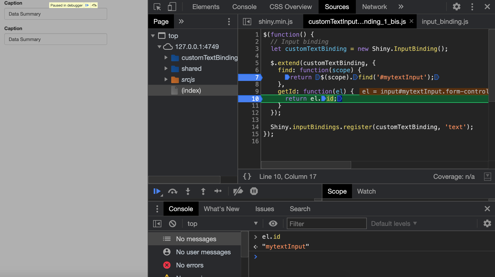
```

### Edit an input binding {#edit-input-binding}
In some cases, we would like to access the input binding and change its default behavior, even though not always recommended, since it will affect **all** related inputs. As bindings are contained in a registry, namely `Shiny.inputBindings`, one may seamlessly access and modify them. This is a five steps process:

1. Wait for the `shiny:connected` [event](https://shiny.rstudio.com/articles/js-events.html), so that the `Shiny` JS
object exists. 
2. Unbind all inputs with `Shiny.unbindAll()`.
3. Access the binding registry, `Shiny.inputBindings`.
4. Extend the binding and edit its content with `$.extend(... {...})`
5. Apply the new changes with `Shiny.bindAll()`.

```js
$(function() {
  $(document).on('shiny:connected', function(event) {
    Shiny.unbindAll();
    $.extend(Shiny
      .inputBindings
      .bindingNames['shiny.actionButtonInput']
      .binding, {
        // do whathever you want to edit existing methods
      });
    Shiny.bindAll();
  });
});
```

### Update a binding from the client {#update-binding-client}
The interest of `receiveMessage` and `setValue` is to be able to update the input
from the server side, that is R, through the `session$sendInputMessage`. Yet, 
this task might be done directly on the client, thereby lowering the load on the server.
We consider the following example: a shiny app contains two actions buttons, clicking on the first one
increases the value of the second by 10. This won't be possible with the classic approach since a button click
only increases its value by 1. How do we proceed? 

1. We first set an event listener on the first button.
2. We target the second button and get the input binding with `$obj.data('shiny-input-binding')`.
3. We recover the current value. 
4. We call the `setValue` method, adding 10 to the current value.
5. Importantly, to let Shiny update the value on the R side, we must trigger an event that will be detected in the `subscribe` method. The action button only has one event listener but other may be added. Don't forget that triggering a `click` event would also increment the button value by 1! In the following we have to customize the `subscribe` method to work around:

```js
$(function() {
  // each time we click on #test (a button)
  $('#button1').on('click', function() {
    let $obj = $('#button2');
    let inputBinding = $obj.data('shiny-input-binding');
    let val = $obj.data('val') || 0;
    inputBinding.setValue($obj, val + 10);
    $obj.trigger('event');
  });
});
```

If you click on the second button, the value increments only by 1 and the plot will be only visible after 10 clicks, while only 1 click is necessary on the first button. The reset button resets the second action button value to 0.

```js
$('#reset').on('click', function() {
  let $obj = $('#button2');
  let inputBinding = $obj.data('shiny-input-binding');
  inputBinding.reset($obj);
  $obj.trigger('change');
});
```

It implements the feature discussed in the previous part, where we extend the button binding to add a `reset` method and edit the `subscribe` method to add a `change` event listener, simply telling shiny to get the new value. Contrary to `click`, `change` does not increment the button value, which is exactly what we want. 

```js
$.extend(
  Shiny
    .inputBindings
    .bindingNames['shiny.actionButtonInput']
    .binding, {
  reset: function(el) {
   $(el).data('val', 0);
  },
  subscribe: function(el, callback) {
    $(el).on('click.actionButtonInputBinding', function(e) {
      let $el = $(this);
      let val = $el.data('val') || 0;
      $el.data('val', val + 1);

      callback();
    });
            
    // this does not trigger any click and won't change 
    // the button value            
    $(el).on('change.actionButtonInputBinding', function(e) {
      callback();
    });
  }
});
```

The whole JS code is found [here](https://github.com/DivadNojnarg/outstanding-shiny-ui-code/blob/b95f656bce9de7600c05b5045a4e005f70c4f83d/inst/input-system/input-bindings/editBinding.js#L1) and below is the related app. It is available as an HTML dependency with `OSUICode::editBindingDeps()`.

```{r, echo=FALSE, results='asis'}
code_chunk(OSUICode::get_example("input-system/edit-binding-client", view_code = FALSE), "r")
```

whose output is shown Figure \@ref(fig:edit-binding-demo).
```{r edit-binding-demo, echo=FALSE, fig.cap='Edit and trigger an input binding from the client', out.width='100%'}
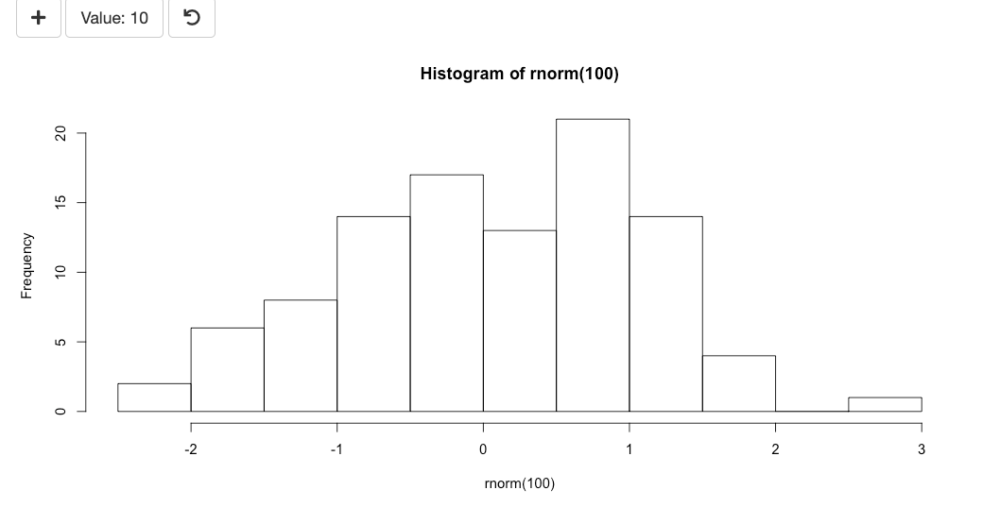
```

This trick has been extensively used in the [virtual physiology simulator](https://community.rstudio.com/t/shiny-contest-submission-a-virtual-lab-for-teaching-physiology/25348) to trigger [animations](https://dgranjon.shinyapps.io/entry_level/).

Another example of accessing a binding method from the client is found in the `{shinydashboard}` [package](https://github.com/rstudio/shinydashboard/blob/dc1e15b39b7198286373643e8e4417867548c467/srcjs/sidebar.js#L29). 

## Secondary inputs {#secondary-inputs}
The Shiny input binding system is too convenient to be only used for __primary__ input elements like `textInput()`, `numericInput()`. It is a super powerful tool to unleash apps's __interactivity__. In the following, we show how to add an input to an element that was not primarily designed to be a user input, also non officially denoted as __secondary__ inputs. 

::: {.warningblock data-latex=""}
By convention, we'll not use `inputId` but `id` for secondary inputs, which is the case in all the new versions of RinteRface packages like `{bs4Dash}`.
:::

### Boxes on steroids {#boxes-on-steroids}
You may know the `{shinydashboard}` `box` function. Boxes are containers with a title, body, footer, as well as optional elements. Those box may also be collapsed. It would be nice to capture the state of the box in an input, so as to trigger other actions as soon as this input changes. Since an input value is unique, we must add an `id` parameter to the box function. Below is what we had to modify compared to the `shinydashboard::box()` function. 


```{r, eval=FALSE}
box <- function(.., id = NULL, title = NULL, footer = NULL,
                 background = NULL, width = 6, height = NULL,
                 collapsible = FALSE, collapsed = FALSE) {
  
  # ....; Extra code removed
  
  tagList(
    boxDeps(), # required to attach the binding
    div(
      class = if (!is.null(width)) paste0("col-sm-", width),
      div(
        id = id, # required to target the unique box
        class = boxClass, # required to target all boxes
        # ....; Extra code removed (box header, body, footer)
      )
    )
  )
}
```

`boxDeps()` contains the JS dependencies to handle the box behavior. 

```{r, eval=FALSE}
boxDeps <- function() {
  htmlDependency(
    name = "boxBinding",
    version = "1.0.0",
    src = c(file = system.file(
      "input-system/input-bindings", 
      package = "OSUICode"
    )),
    script = "boxBinding.js"
  )
}
```
 
As we may collapse and uncollapse the box, we create the `updateBox()` function, which will toggle it. In this example, it does not send any specific message since we'll rely on internal AdminLTE JS methods to do the work.

```{r}
updateBox <- function(
  id, 
  session = getDefaultReactiveDomain()
) {
  session$sendInputMessage(id, message = NULL)
}
```

If you play with this [example](https://adminlte.io/themes/AdminLTE/index2.html) and inspect a box as shown on Figure \@ref(fig:inspect-adminlte-box), you'll notice that when collapsed, a box gets the `collapsed-box` class, which is useful to keep in mind for the input binding design.


```{r inspect-adminlte-box, echo=FALSE, fig.cap='Collapsed AdminLTE2 box', out.width='100%'}
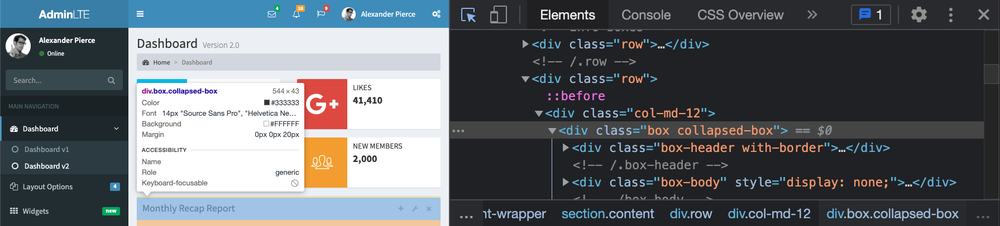
```

This is time to design the JS dependency, that is `boxBinding.js`. Like all input bindings, it start by instantiating a new object with `Shiny.InputBinding()`. At the end of the code, we register the binding so that Shiny knows it exists.

```js
let boxBinding = new Shiny.InputBinding();
$.extend(boxBinding, {
  // Methods go here
});

Shiny.inputBindings.register(boxBinding, 'box-input');
```

Below are the main steps taken to design the binding.

1. `find`: there is nothing special to say, we are looking for elements having the `box` class.

```js
find: function(scope) {
  return $(scope).find('.box');
}
```

2. `getValue`: we check if the element has the `collapsed-box` class and return an object which will give a list in R. This is in case we add other elements like the remove action available in AdminLTE. We therefore access each input element with `input$<box_id>$<property_name>`.

```js
getValue: function(el) {
  let isCollapsed = $(el).hasClass('collapsed-box')
  return {collapsed: isCollapsed}; // this will be a list in R
}
```

3. `setValue`: we call the plug and play AdminLTE `toggleBox` method.

```js
setValue: function(el, value) {
  $(el).toggleBox();
}
```

4. `receiveMessage`: we call the `setValue` method and trigger a change event so that Shiny knows when the value needs to be updated within `subscribe`.

```js
receiveMessage: function(el, data) {
  this.setValue(el, data);
  $(el).trigger('change');
}
```

5. `subscribe`: as previously mentioned, it is necessary to know when to tell Shiny to update the value with the `subscribe` method. Most of the time, the change event might be sufficient, but as `{shinydashboard}` is built on top of [AdminLTE2](https://adminlte.io/docs/2.4/js-box-widget), it has an API to control the box behavior. We identify two events corresponding to the collapsible action: 
  
  - expanded.boxwidget (Triggered after the box is expanded)
  - collapsed.boxwidget (Triggered after the box is collapsed)
  
Unfortunately, after further investigations, those events are not possible to use since the AdminLTE library does not trigger them in the main JS [code](https://github.com/rstudio/shinydashboard/blob/dc1e15b39b7198286373643e8e4417867548c467/srcjs/AdminLTE/app.js#L577) (see the collapse method). There are other solutions and we decided to listens to the `click` event on the `[data-widget="collapse"]` element and delays the `callback` call by a value which is slightly higher than the default AdminLTE2 animation to collapse the box (500ms). If you omit this part, the input will not have time to properly update! 

```js
subscribe: function(el, callback) {
  $(el).on(
    'click', 
    '[data-widget="collapse"]', 
    function(event) {
      setTimeout(function() {
        callback();
      }, 50);
  }); 
    
  $(el).on('change', function(event) {
    setTimeout(function() {
      callback();
    }, 50);
  });
}
```

6. Even though animations are nice, it might appears rather sub-optimal to wait 500 ms for a box to collapse. AdminLTE [options](https://adminlte.io/themes/AdminLTE/documentation/index.html#adminlte-options) allow to change this through the `$.AdminLTE.boxWidget` object. We specify the `animationSpeed` property to 10 milliseconds and update the input binding script to reduce the delay in the `subscribe` method (50 ms seems reasonable).


```js
$(function() {
  // overwrite box animation speed. 
  // Putting 500 ms add unnecessary delay for Shiny.
  $.AdminLTE.boxWidget.animationSpeed = 10;
});
```

We don't need an extra listener for the `updateBox()` function since it also triggers a click on the collapse button, thereby forwarding to the corresponding listener. The whole code may be found [here](https://github.com/DivadNojnarg/outstanding-shiny-ui-code/blob/b95f656bce9de7600c05b5045a4e005f70c4f83d/inst/input-system/input-bindings/boxBinding.js#L1). 

Let's try our new toy in a simple app. The output is depicted on Figure \@ref(fig:toggle-shinydashboard-box).

```{r toggle-shinydashboard-box, echo=FALSE, fig.cap='{shinydashboard} box with custom input binding listening to the box collapse state', out.width='100%'}
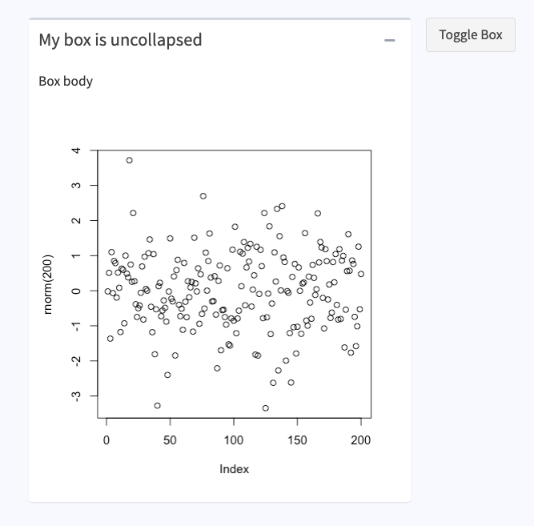
```

```{r, echo=FALSE, results='asis'}
code_chunk(OSUICode::get_example("input-system/boxes-on-steroids", view_code = FALSE), "r")
```

The `{bs4Dash}` box function follows the same principle, with extra features showed [here](https://github.com/RinteRface/bs4Dash/blob/6fb8f8175e3672bbb65236d76285c6310197f10c/srcjs/bs4Dash-2.0.0/cards.js#L2). We leave the reader to explore the code as an exercise. 

### Further optimize boxes {#boxes-on-steroids-more}
We may imagine leveraging the input binding system to update any box property and get rid of the classic `renderUI()` approach. Indeed, until now, there would be only one way to update a box from the server. In the below code, we intentionally added a dummy task causing a five seconds delay in the card rendering. You'll notice that nothing happens for some time, which is weird for the end user and might let it think about a possible app crash (Figure \@ref(fig:update-shinydashboard-box), left side).

```{r, echo=FALSE, results='asis'}
code_chunk(OSUICode::get_example("input-system/update-box-renderUI"), "r")
```

```{r update-shinydashboard-box, echo=FALSE, fig.show = "hold", out.width = "50%", fig.align = "default", fig.cap='Left: what the user sees when app starts. Right: what the users sees after five seconds.'}
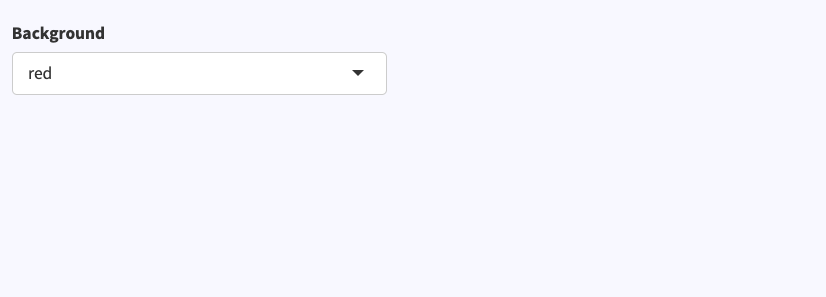
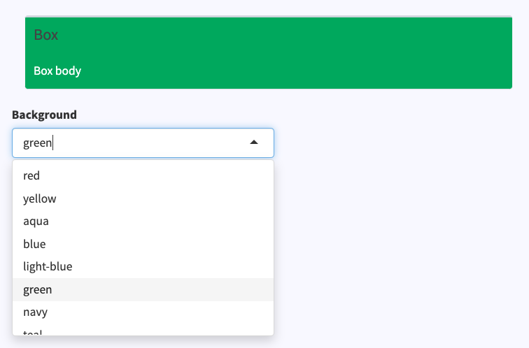
```

The whole piece of UI is re-rendered each time, while only the box class should be modified. As shown above, this does have substantial impact for a very complex app festooned with inputs/outputs, thereby altering the overall user experience.

Let's provide some optimization and get rid of the `renderUI()`. 
Figure \@ref(fig:box-on-steroids-summary) summarizes the main idea and you may use it as a mind map to follow the remaining of this section. 
We proceed in two steps. The first part consists in customizing the previously designed `box()` function from \@ref(boxes-on-steroids) to gather as many parameters as possible in a list of options. For instance, we choose to extract `width` and `title`. 

`width` is expected to be numeric, while `title` might be any HTML tag, a list of HTML tags, justifying the use of slightly more sophisticated code (we can't use `toJSON()` on a shiny tag ... not yet). So that we don't shoot ourselves in the foot, we create a specific object for the processed `title`, that is `processed_title`. Indeed, a common mistake would be to re-inject the processed title later in the HTML box tag, which would cause an error. It's purpose is solely to be part of the configuration script required by JS. 

```{r, eval=FALSE}
box2 <- function(..., id = NULL, title = NULL, footer = NULL,
                 background = NULL, width = 6, height = NULL,
                 collapsible = FALSE, collapsed = FALSE) {
  
  if (!is.null(title)) {
    processed_title <- if (
      inherits(title, "shiny.tag.list") ||
      inherits(title, "shiny.tag")
    ) {
      as.character(title)
    } else {
      title
    }
  }
  
  props <- dropNulls(
    list(
      title = processed_title,
      background = background,
      width = width
    )
  )
  
  # ....; Extra code removed
}
```

This properties list has to be treated on the JS side, the reason why we remove `NULL` elements with `dropNulls()`, since we don't want to send empty arrays. We choose the following approach, where we convert our properties to a JSON with `toJSON()` and embed them in a script tag. Note the `data-for` attribute pointing to the unique `id` parameter. This will guarantee the uniqueness of our configuration script.

```{r}
box2 <- function(..., id = NULL, title = NULL, footer = NULL,
                 background = NULL, width = 6, height = NULL,
                 collapsible = FALSE, collapsed = FALSE) {
  
  # ....; Extra code removed
  
  configTag <- tags$script(
    type = "application/json",
    `data-for` = id,
    jsonlite::toJSON(
      x = props,
      auto_unbox = TRUE,
      json_verbatim = TRUE
    )
  )
  
}
```

To create the box HTML tag, we leverage the `box()` function. The next step is to add it the configuration tag, which is achieved with the new `{htmltools}` `tagQuery()` API, extensively studied in \@ref(htmltools-modern). We finally attach the not yet designed JS dependencies with `tagList()`.

```{r, eval=FALSE}
box2 <- function(..., id = NULL, title = NULL, footer = NULL,
                 background = NULL, width = 6, height = NULL,
                 collapsible = FALSE, collapsed = FALSE) {
  
  # ....; Extra code removed
  
  boxTag <- tagQuery(
    box(
      ..., id = id, title = title, footer = footer,
      background = background, width = width, height = height,
      collapsible = collapsible, collapsed = collapsed
    )
  )$
    append(configTag)$
    allTags()

  tagList(box2Deps(), boxTag)
}
```

Like in \@ref(boxes-on-steroids), we define the new dependencies, namely `box2Deps()`, referencing the `boxBindingEnhance.js` script, which we are going to design in few minutes.

```{r, eval=FALSE}
box2Deps <- function() {
  htmlDependency(
    name = "boxBinding",
    version = "1.0.0",
    src = c(file = system.file(
      "input-system/input-bindings", 
      package = "OSUICode"
    )),
    script = "boxBindingEnhanced.js"
  )
}
```

Then, we have to modify the `updateBox()` function such that it handles both toggle and update possibilities. `options` contains all changeable properties like `title` and `width`.
We don't describe the toggle case since it is quite similar to the previous implementations. When the action is `update`, we enter the `if` statement and options must be processed. If the option element is a shiny tag or a list of shiny tags (`tagList()`), we convert it to character with `as.character()`. The returned message is a vector containing the action as well as the option list: 

```{r, eval = FALSE}
updateBox2 <- function(
  id, 
  action = c("toggle", "update"), 
  options = NULL,
  session = getDefaultReactiveDomain()
) {
  # for update, we take a list of options
  if (action == "update") {
    # handle case where options are shiny tag 
    # or a list of tags ...
    options <- lapply(options, function(o) {
      if (inherits(o, "shiny.tag") || 
          inherits(o, "shiny.tag.list")) {
        o <- as.character(o)
      }
      o
    })
    message <- dropNulls(
      c(
        action = action, 
        options = list(options)
      )
    )
    session$sendInputMessage(id, message)
  } else if (message == "toggle") {
    session$sendInputMessage(id, message = match.arg(action))
  }
}
```

Let's define the new JS binding required by `box2Deps()`. We start from the previously defined binding in `boxBindings.js` and modify the `setValue` method to import our newly defined properties. The `boxTag` has two children, the box and the configuration script. `$(el)` refers to the box, therefore we have to look one level up to be able to use the `find` method (find always goes deeper in the DOM), namely `$(el).parent()`. From there, we only have to target the script tag `$(el).parent().find("script[data-for='" + el.id + "']")`. In practice, you may reuse this piece of code in multiple places, for instance in the `getValue` method. To avoid duplication, we create an internal function, `_getConfig`. Note the `_` prefix, which makes the difference between the default input binding methods (available for all bindings) and the user defined methods, local to a specific binding. This function just returns the config script:

```js
_getConfigScript: function(el) {
  return(
    $(el)
      .parent()
      .find("script[data-for='" + el.id + "']")
  )
}
```

We also extract the `_processConfig` method that calls `_getConfigScript` and converts the script content to a JS object that we can manipulate. Notice the `this` keyword: it represents the input binding instance as explained above in \@ref(input-binding-steps).

```js
_processConfig: function(el) {
  return(
    JSON.parse(
      this
      ._getConfigScript(el)
      .html()
    )
  )
}
```

Then, we call `_processConfig` inside `setValue`:

```js
setValue: function(el, value) {
  let config = this._processConfig(el);
}
```

From the above code, `config.width` returns the initial width, while `value.options.width` contains the new width value provided in the `updateBox2` message output. As a security, we don't want to change `config` if the action provided in `updateBox2` is not `update` (see if statement). Assuming `value.action === "update"`, we can continue to develop our JS logic. Good practice is to check whether `value.options.width` exists with `value.options.hasOwnProperty("width")`. If yes, we ensure whether its value and `config.width` are different. We always choose `===` which compares the type and the value (`==` only compares the value such that `"1" == 1` is `true`):

```js
setValue: function(el, value) {
  let config = this._processConfig(el);
  
  if (value.action === "update") {
    if (value.options.hasOwnProperty("width")) {
      if (value.options.width !== config.width) {
        this._updateWidth(
          el, 
          config.width, 
          value.options.width
        )
        config.width = value.options.width;
      }
    }
    // other items to update
  }
}
```

`_updateWidth` is a internal method defined in the input binding. It has three parameters, `el`, `o` and `n` (o and n being the old and new values, respectively):

```js
_updateWidth: function(el, o, n) {
  // removes old class
  $(el).parent().toggleClass("col-sm-" + o);
  $(el).parent().addClass("col-sm-" + n); 
  // trigger resize so that output resize
  $(el).trigger('resize');
}
```

We must trigger a `resize` event so that output correctly scales. The internal method is identified by an underscore since it is not an inherited `Shiny.InputBinding` method. We finally update the config value by the newly set value and repeat the process for any other property. Don't forget to update the config script attached to the card tag at the end of the update condition, otherwise the input value won't be modified:

```js
// replace the old JSON config by the 
// new one to update the input value 
this
  ._getConfigScript(el)
  .replaceWith(
    '<script type="application/json" data-for="' + 
    el.id + 
    '">' + 
    JSON.stringify(config) + 
    '</script>'
  );
```

```{r box-on-steroids-summary, echo=FALSE, fig.cap='Box config tag concept and application', out.width='100%'}
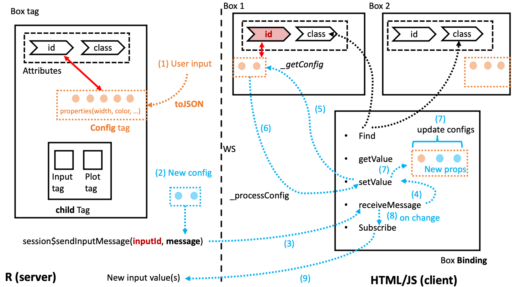
```

The whole JS code may be found [here](https://github.com/DivadNojnarg/outstanding-shiny-ui-code/blob/b95f656bce9de7600c05b5045a4e005f70c4f83d/inst/input-system/input-bindings/boxBindingEnhanced.js#L1). Below is the reworked version of the previously updated box without `renderUI()`. When app starts, the box is displayed as shown on Figure \@ref(fig:update-shinydashboard-box-optimized), which is better for the end user experience.

```{r, echo=FALSE, results='asis'}
code_chunk(OSUICode::get_example("input-system/boxes-on-steroids-2"), "r")
```

```{r update-shinydashboard-box-optimized, echo=FALSE, fig.show = "hold", out.width = "50%", fig.align = "default", fig.cap='Left: what the user sees when app starts. Right: what the users sees after five seconds.'}
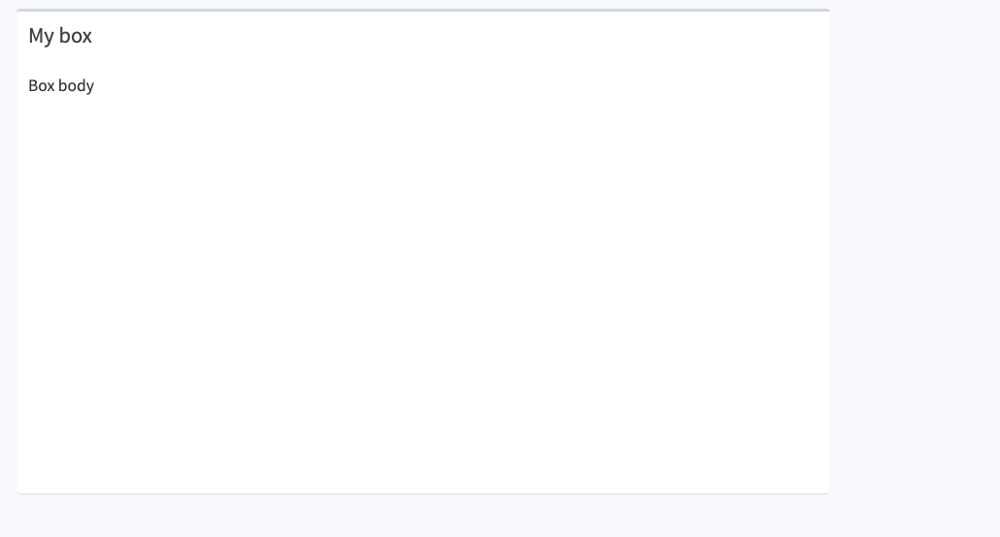
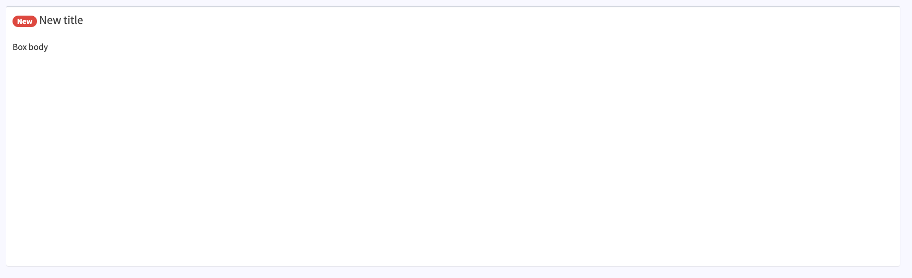
```

### Exercise
In the above example, the title is also updated. In order to reproduce this behavior, you'll have to update the `boxBindingEnhanced.js` to include the corresponding JS logic. 

1. Inside `boxBindingEnhanced.js`, right after the update `width` logic,
add an `if` statement to check if `title` belongs to the update properties, sent through `updateBox2()`.
Fill in the blank.

```js
if (value.options.hasOwnProperty(...)) {

}
```

2. Add a nested `if` statement to check whether the new title is different of the old one (needless to update if
both titles are the same).

```js
if (value.options.hasOwnProperty(...)) {
  if (... !== ...) {
  
  }
}
```

3. On the R side, the new title will be provided as below:

```{r, eval=FALSE}
updateBox2(
  "mybox",
  action = "update",
  options = list(
    title = tagList(
      shinydashboardPlus::dashboardBadge("New", color = "red"),
      "New title"
    )
  )
)
```

However, a valid AdminLTE box title has the following HTML structure:

```html
<h3 class="box-title">
  <!-- TITLE CONTENT -->
</h3>
```

Modify the below code to wrap the provided title in a `h3` tag with the `box-title` class.

```js
if (value.options.hasOwnProperty(...)) {
  if (... !== ...) {
    let newTitle;
    newTitle = `<h3 class="box-title">${...}</h3>`
    newTitle = $.parseHTML(...);
  }
}
```

4. Locate the old title in the DOM and use replace it by the new one.

```js
if (value.options.hasOwnProperty(...)) {
  if (... !== ...) {
    let newTitle;
    newTitle = `<h3 class="box-title">${...}</h3>`
    newTitle = $.parseHTML(...);
    
    $(el)
      .find(...)
      .replaceWith($(...));
  }
}
```

5. Update the current config `title` value with the new one. 

```js
if (value.options.hasOwnProperty(...)) {
  if (... !== ...) {
    let newTitle;
    newTitle = `<h3 class="box-title">${...}</h3>`
    newTitle = $.parseHTML(...);
    
    $(el)
      .find(...)
      .replaceWith($(...));

    config.title = ...;
  }
}
```

Answers are found in [here](https://github.com/DivadNojnarg/outstanding-shiny-ui-code/blob/a7a398c47a9f0ac5cd286da639514bbfcb4c0033/inst/input-system/input-bindings/boxBindingEnhanced.js#L53).

If it represents a significant amount of work, it is also guarantees to lower the load on the server side, thereby offering a faster end-user experience. A full working prototype has been implemented in `{shinydashboardPlus}` and `{bs4Dash}` (including all box parameters). 

## Utilities to quickly define new inputs {#quick-inputs}

### Introduction
If you ever wondered where the `Shiny.onInputChange` or `Shiny.setInputValue` comes from (see  [article](https://shiny.rstudio.com/articles/communicating-with-js.html)), they are actually defined in the `initShiny` function. 

```js
exports.setInputValue = function(name, value, opts) {
  opts = addDefaultInputOpts(opts);
  inputs.setInput(name, value, opts);
};
```

We recommend using `Shiny.setInputValue` over `Shiny.onInputChange`, the latter being slightly misleading.
Briefly, this function avoids the creation an input binding and is faster to code but there is a price to pay: losing the ability to easily update the new input through R. Indeed, without an input binding, there is no R side `updateInput` function! By default, `Shiny.setInputValue` is able to cache the last set value from that input, so that if is is identical, no value is being assigned. If this behavior does not meet your expectations and you need to set the input even when the value did not change, be aware that you may specifify a __priority__ option like:

```js
Shiny.setInputValue("myinput", value, {priority: "event"});
```

### Examples
`Shiny.setInputValue` becomes powerful when combined to the numerous Shiny JavaScript events listed [here](https://shiny.rstudio.com/articles/js-events.html). To get access to the `Shiny` JS object, we have to wait for the `shiny:connected` event. In the following we create a custom input that stores whether the user has MacOS. On the R side, we'll access it with `input$isMac`.

```js
$(document).on('shiny:connected', function(event) {
  Shiny.setInputValue(
    'isMac', 
    (navigator.appVersion.indexOf('Mac') != -1)
  );
});
```

This allows to conditionally display elements and deeply customize the interface.
In the following example, the card will show a different title if the user is browsing with MacOS. 

```{r, echo=FALSE, results='asis'}
code_chunk(OSUICode::get_example("input-system/set-input-value"), "r")
```

This is what we leverage in the [shinyMobile](https://rinterface.github.io/shinyMobile/articles/shinyMobile_tools.html) package to store the current device information in a shiny input. Briefly, Framework7 (on top of which is built shinyMobile) has a method `Framework7.device`, which gives many [details](https://framework7.io/docs/device.html) related to the user device.

## Custom data format {#custom-data-format}
In some cases, the automatic Shiny R to JS data management may not meet our needs. 
We introduce __input handlers__, a tool to fine tune the deserialization of data from JS. 

### The dirty way
For instance, assume we create a date in JS with `new Date()` and store it in a shiny input with `Shiny.setInputValue`. On the R side, we will not obtain a date but a character, which is not convenient. This is where __input handlers__ are useful since they allow to manipulate data generated on the JS side before injecting them in R. Such handlers are created with __registerInputHandler__ that takes two parameters:

  - __type__ allows to connect the handler to `Shiny.setInputValue`. Note that the id is followed by the __handler type__, for instance `Shiny.setInputValue('test:handler', ...)` is connected to `shiny::registerInputHandler('handler', ...)`. As recommended by the Shiny documentation, if the input handler is part of a package, it is best practice to name it like `packageName.handlerName`.
  - a __function__ to transform data, having data as main parameter.
  
Below we directly include JS code in the shiny app snippet, which is not best practice but convenient for the demonstration. Only the second input will give the correct result thanks to the defined handler:

```{r, echo=FALSE, results='asis'}
code_chunk(OSUICode::get_example("input-system/dummy-input-handler"), "r")
```

### The clean way: leverage `getType`
The cleanest way is to leverage the __getType__ method from the `InputBinding` class. 
Let's refine our text input so that it handles dates. On the R side, in the `customTextInput()` function, we check the current value's type:

```{r, eval=FALSE}
type <- if (inherits(value, "Date")) {
  "date"
} else {
  NULL
}
```

We add a custom data attribute to the input tag, which won't be displayed if the value is not a date:

```{r, eval=FALSE}
tags$input(
  id = inputId,
  type = "text",
  class = "form-control input-text",
  value = value,
  placeholder = placeholder,
  `data-data-type` = type
)
```

We then define our custom handler. This code is run when the package is loaded and usually located in a `zzz.R` script:

```{r, eval=FALSE}
.onLoad <- function(...) {
  registerInputHandler(
    "OSUICode.textDate", function(data, ...) {
      if (is.null(data)) {
        NULL
      } else {
        res <- try(as.Date(unlist(data)), silent = TRUE)
        if ("try-error" %in% class(res)) {
          warning("Failed to parse dates!")
          data
        } else {
          res
        }
      }
  }, force = TRUE)
}
```

::: {.noteblock data-latex=""}
`{shiny}` already handles dates and we could use the built-in input handler. 
The current handler was only designed to explain the underlying processes!
:::

On the JavaScript side, we refer to the `OSUICode.textDate` defined input handler. We recover the `data-type` value passed from R and call the handler if the type is a date. We return `false` otherwise, which is the default behavior:

```js
getType: function getType(el) {
  var dataType = $(el).data("data-type");
  if (dataType === "date") return "OSUICode.textDate";
  else return false;
}
```

To use the shiny built-in handler we could return `"shiny.date"` instead. We then run:

```{r, echo=FALSE, results='asis'}
code_chunk(OSUICode::get_example("input-system/input-handler-1"), "r")
```

which sets the value as text by default. After opening the HTML inspector and setting a break point in the `getType` method (Figure \@ref(fig:binding-getType-1)), we check that the data type is not defined. Therefore the input handler will not apply. 

```{r binding-getType-1, echo=FALSE, fig.cap='Example where getType does not call the input handler', out.width='100%'}
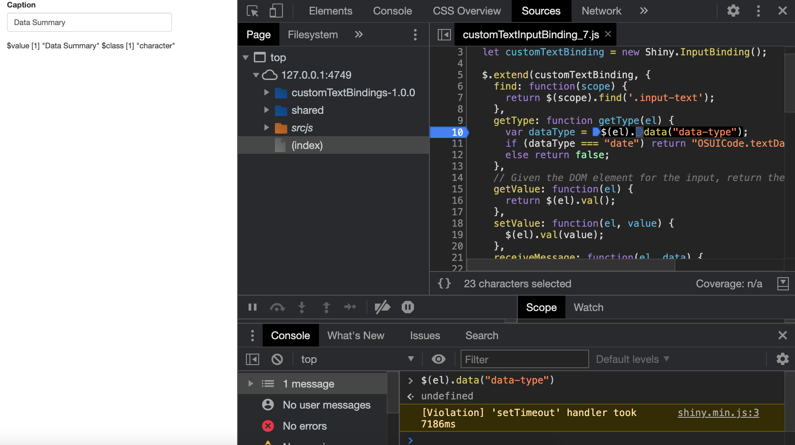
```

For the second example, we give a date value to the function:

```{r, echo=FALSE, results='asis'}
code_chunk(OSUICode::get_example("input-system/input-handler-2"), "r")
```

As illustrated Figure \@ref(fig:binding-getType-2), the date is properly processed. Moreover, if you type any other valid date in the text field like `2020-11-12`, it will be recognized as a date, while entering a text will return a character element. This is a way to obtain a slightly more clever text input widget.

```{r binding-getType-2, echo=FALSE, fig.cap='Passing a date to a text input correctly processes it', out.width='100%'}
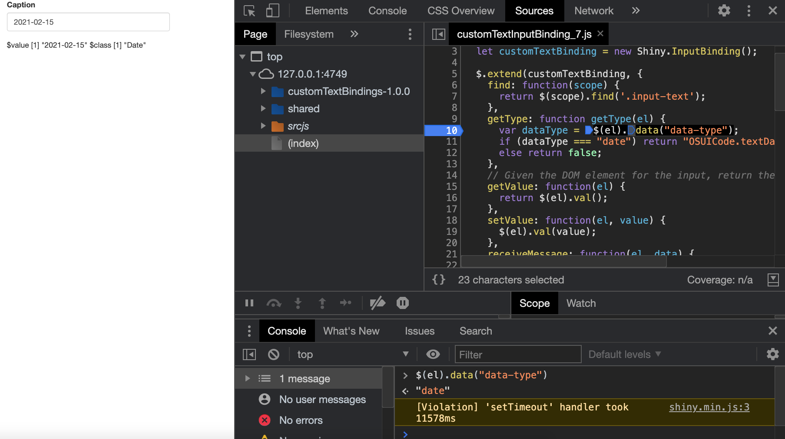
```

Importantly, since the `data-type` is set at app startup by checking the class of the value, it will never change later. For instance, if you start the app with the text input value to be a simple text, setting it to a date through the app does not convert it into a date since `$(el).data("data-type")` always return `undefined`! Therefore, if you want to be able to use both text and dates, be sure to wisely set the initial value. 

To finish, we could seamlessly make our text input even more clever, by handling numbers. Even though shiny has a `shiny.number` input [handler](https://github.com/rstudio/shiny/blob/60db1e02b03d8e6fb146c9bb1bbfbce269231add/R/server-input-handlers.R#L144), it simply makes sure that whenever the input is missing a value, NA is returned instead of "".
(Figure \@ref(fig:shiny-getType-number)).

```{r shiny-getType-number, echo=FALSE, fig.cap='shiny.number input handler ensures that an empty numericInput returns NA instead of ""', out.width='100%'}
knitr::include_graphics("images/survival-kit/shiny-getType-number.png")
```

What we want is an handler that recognizes the string `"1"` and convert it to a number. In R, converting a string to a number gives `NA`:

```{r}
as.numeric("test")
```

Therefore, if we obtain `NA`, we return original data so that the input gives the correct type. In the `zzz.R` script, right after our previous handler, we can write:

```{r, eval=FALSE}
registerInputHandler(
  "OSUICode.textNumber", function(data, ...) {
    if (is.null(data)) {
      NULL
    } else {
      res <- as.numeric(unlist(data))
      if (is.na(res)) {
        data
      } else {
        res
      }
    }
  }, force = TRUE)
```


We also update the JavaScript `getType` method as follows:

```js
getType: function getType(el) {
  var dataType = $(el).data("data-type");
  if (dataType === "date") return "OSUICode.textDate";
  else if (dataType === "number") return "OSUICode.textNumber";
  else return false;
}
```

On the R side, don't forget to add an extra `else if` statement to the `customTextInput()` [function](https://github.com/DivadNojnarg/outstanding-shiny-ui-code/blob/1b626e97738fd627097b57e21359b603e03d33eb/R/inputs.R#L35):

```{r, eval=FALSE}
type <- if (inherits(value, "Date")) {
  "date"
} else if (inherits(value, "numeric")) {
  "number"
} else {
  NULL
}
```

If we run:

```{r, echo=FALSE, results='asis'}
code_chunk(OSUICode::get_example("input-system/input-handler-3"), "r")
```

we obtain the desired behavior shown Figure \@ref(fig:binding-getType-3).

```{r binding-getType-3, echo=FALSE, fig.cap='Passing a number to a text input correctly processes it', out.width='100%'}
knitr::include_graphics("images/survival-kit/binding-getType-3.png")
```
