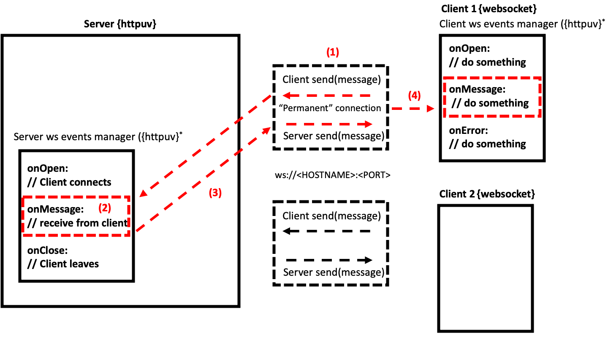
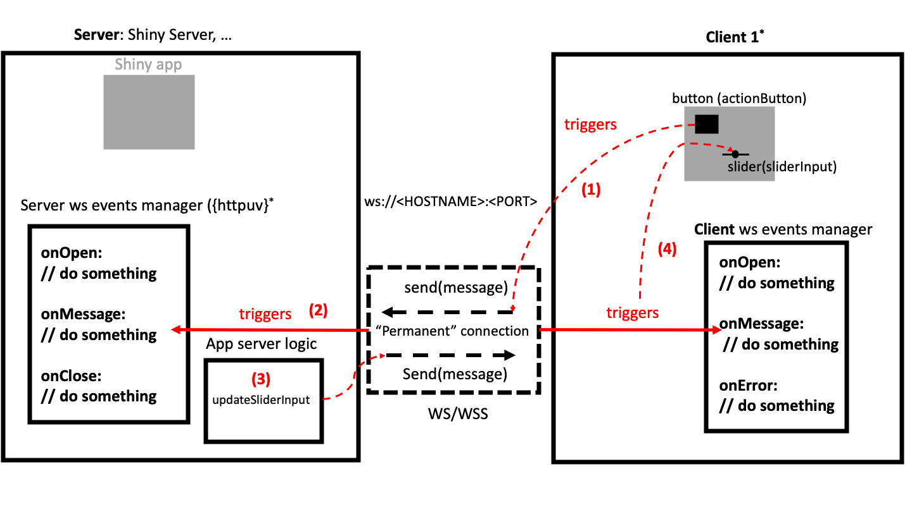

# Shiny's internals {#shiny-intro}

This rather technical chapter aims at untangling what are the main mechanisms behind a Shiny app.  
We particularly highlight some internal processes necessary to the R/JavaScript communication, 
which is quite frankly mind blowing. 

## The client-server model
A Shiny app is a __web application__ and like all web applications, 
it follows the __server-client__ model which consists in:

  - A client which sends requests to the server through the network.
  - A server composed of hardware and software elements that treats the client request.
  - A network inside which flow requests between the server and the client. It is done
  with the HyperText Transfer protocol (HTTP).
  
Each time a client sends a request, it is processed by the server, which provides an answer and closes the connection,
before treating any other request. In practice, to get a webpage, the client emits many requests, one to get the page and then one request per JS/CSS/image assets. As an example, try to run the following in the R console and open the developer tools:

```{r, eval=FALSE}
library(shiny)
ui <- fluidPage()
server <- function(input, output, session) {}
shinyApp(ui, server)
```

Under the network tab, we notice many files (if nothing is shown, reload the web browser tab), which actually correspond to all requests made by the client to the server, Figure \@ref(fig:shinyapp-requests). we also get the current answer status, 200 being the OK HTTP [status](https://developer.mozilla.org/en-US/docs/Web/HTTP/Status), the size and the time needed to treat the request. Nowaday, there exists mechanisms like cache to speed up the request treatment. Don't believe that each time you visit a shiny app, all requests are answered by the server. Actually, most assests are recovered from the web browser cache, that takes significantly less time, although sometimes misleading. I am sure you already found this situation when, after updating your shiny app style, you still get the old design. Most of the time this is a caching issue and resetting Chrome's cache solves the problem.

```{r shinyapp-requests, echo=FALSE, fig.cap='Request flow between client and server at shiny app start.', out.width='100%'}
knitr::include_graphics("images/survival-kit/shinyapp-requests.png")
```

## About HTTP requests
If we inspect the first request from Figure \@ref(fig:shinyapp-requests), we obtain Figure \@ref(fig:http-request-details). An HTTP request is composed of:

  - A [method](https://developer.mozilla.org/en-US/docs/Web/HTTP/Methods) that indicates the intentions. 
  We mostly use `GET` to ask for something or `POST`, to submit something. 
  - An url, corresponding to the path to the targeted element. Here, if nothing is specified in the path, the server will try to get the main HTML page, also called `index.html`. 

```{r http-request-details, echo=FALSE, fig.cap='Details about an HTTP request', out.width='100%'}
knitr::include_graphics("images/survival-kit/http-request-details.png")
```

Wait! How does a Shiny app serves files? This is what we are going to see in the next section.

## Shiny app lifecycle
Like all web apps, a shiny app must be hosted on a server to be accessible by end users, even though during development, we can run it locally. Shiny Apps are usually hosted on different environments:

  - Shiny server [open source](https://rstudio.com/products/shiny/download-server/).
  - Shiny server [pro](https://rstudio.com/products/shiny-server-pro/).
  - [RStudio Connect](https://rstudio.com/products/connect/evaluation/).
  - [shinyapps.io](https://www.shinyapps.io/).
  
Whenever a user (client) accesses a shiny app with his web browser, a series of events occurs (Figure \@ref(fig:shinyapp-lifecycle)):

  1. The client sends a HTTP `CONNECT` request to the server (Shiny server) containing the path 
  to the targeted app. 
  2. The server starts the targeted app with `runApp()`. 
  
Under the hood, `runApp()`:

  - Calls `shinyApp()` that returns a shiny app object composed of a server function and the UI.
    The UI has to be formatted to be a function returning an HTTP response, as requested by `{httpuv}`. 
  - Calls `startApp` that creates HTTP and websocket (WS) handlers. WS handlers are responsible for controlling the WS behavior when the app starts, when a message is received from a client and when the app closes. It also creates static path containing all CSS, JS files that may be accessed by the browser.
  - Calls `startServer` from `{httpuv}`, that starts the HTTP server and opens the server websocket connection. 
    
    
  3. If the R code does not contain errors, the server returns the Shiny UI HTML code to the client, which is displayed in the web browser.
  4. The returned HTML contains all the necessary JavaScript to subsequently open the client websocket connection. 
  5. From there, client and server are free to exchange information
  
```{r shinyapp-lifecycle, echo=FALSE, fig.cap='Shiny App lifecycle', out.width='100%'}
knitr::include_graphics("images/survival-kit/shinyapp-lifecycle.png")
```

The following parts detail the most important mechanisms.

### Building the UI
What definitely makes Shiny wonderful is the ability to only write R code to produce HTML. Although convenient for R users, there is a moment where all this R code has to become HTML, since web browsers are just not able to process R files. Shiny must provide a string containing the HTML code that will be later given to the `{httpuv}` server and displayed to the end user. These steps heavily relies on `{htmltools}`, particularly the `renderDocument()` function. If it has not been documented until here, it's mainly because you don't have to do it on your own, unless you try to develop another web framework for R, built on top of `{httpuv}`, like `{ambriorix}` or `{fiery}`. Another use case is `{argonR}` which allows to design Bootstrap 4 HTML templates, on top of the [argon](https://www.creative-tim.com/product/argon-design-system) design system. 

Under the hood, `shinyApp()` does many things, particularly creating a valid HTTP response template for `{httpuv}`, through the internal `shiny:::uiHttpHandler` function. The conversion from R to HTML is achieved by `shiny:::renderPage`. First, the provided UI R code is wrapped in a `tags$body()`, if not yet done. As a reminder `fluidPage` does not create a `body` tag, which is required to produce a valid HTML template. The result is given to `htmlTemplate()` to fill the following boilerplate, part of the Shiny package:

```html
<!DOCTYPE html>
<html{{ if (isTRUE(nzchar(lang))) paste0(" lang=\"", lang, "\"") }}>
  <head>
  {{ headContent() }}
  </head>
  {{ body }}
</html>
```

If we assume that our UI is built as follows, applying `htmlTemplate()` on it yields:

```{r}
ui <- fluidPage(
  textInput("caption", "Caption", "Data Summary"),
  verbatimTextOutput("value")
)

ui <- htmlTemplate(
  system.file("template", "default.html", package = "shiny"), 
  lang = "en", 
  body = tags$body(ui), 
  document_ = TRUE
)
```

```html
<!DOCTYPE html>
<html lang="en">
  <head>
    <!-- HEAD_CONTENT -->
  </head>
  <body>
    <div class="container-fluid">
      <div class="form-group shiny-input-container">
        <label class="control-label" id="caption-label" for="caption">Caption</label>
        <input id="caption" type="text" class="form-control" value="Data Summary"/>
      </div>
      <pre class="shiny-text-output noplaceholder" id="value"></pre>
    </div>
  </body>
</html>
```

You may wonder what `headContent()` does. It inserts the string `<!-- HEAD_CONTENT -->` inside the head so that
shiny knows where to insert the dependencies. Then, all necessary dependencies like jQuery, Bootstrap and shiny css/javascript files (`shiny:::shinyDependencies`) are added in the UI head by `renderDocument()`. For instance:

```{r}
library(htmltools)
html <- renderDocument(
  ui,
  deps = c(
    list(htmlDependency("jquery", "3.5.1", c(href = "shared"), script = "jquery.min.js")), 
    shiny:::shinyDependencies() # JS + CSS
  ),
  processDep = createWebDependency
)
```

The final result is shown below:

```html
<!DOCTYPE html>
<html lang="en">
  <head>
    <meta http-equiv="Content-Type" content="text/html; charset=utf-8"/>
    <script type="application/shiny-singletons"></script>
    <script type="application/html-dependencies">jquery[3.5.1];
    shiny-css[1.6.0];shiny-javascript[1.6.0];bootstrap[3.4.1]</script>
    <script src="shared/jquery.min.js"></script>
    <link href="shared/shiny.min.css" rel="stylesheet" />
    <script src="shared/shiny.min.js"></script>
    <meta name="viewport" content="width=device-width, initial-scale=1" />
    <link href="shared/bootstrap/css/bootstrap.min.css" rel="stylesheet" />
    <link href="shared/bootstrap/accessibility/css/bootstrap-accessibility.min.css" rel="stylesheet" />
    <script src="shared/bootstrap/js/bootstrap.min.js"></script>
    <script src="shared/bootstrap/accessibility/js/bootstrap-accessibility.min.js"></script>
  </head>
  <body>
    <div class="container-fluid">
      <div class="form-group shiny-input-container">
        <label class="control-label" id="caption-label" for="caption">Caption</label>
        <input id="caption" type="text" class="form-control" value="Data Summary"/>
      </div>
      <pre class="shiny-text-output noplaceholder" id="value"></pre>
    </div>
  </body>
</html>
```

The final step is to return an HTTP response containing the HTML string. As of `{shiny}` `1.6.0`, the `httpResponse` function is exported by default:

```{r}
httpResponse(
  status = 200,
  content = html
)
```


### Serving HTML with `{httpuv}`
Once the UI is processed, Shiny make it available to end users by leveraging `{httpuv}`, which provides tools to set up an HTTP server. The main function is `startServer` that requires a __host__, __port__ and an __app__. If you run a shiny app locally, the default host is `localhost` or `127.0.0.1` and the port is randomly chosen by `shinyApp` or `runApp`, even though you may fix it. The most important element is the app and `{httpuv}` expects a list of functions like:

  - `call`, to handle the client HTTP request and return the server HTTP response. Depending on the context,
  Shiny may return different responses like 403 (unauthorized), 404 (not found) or 200 (OK).
  - `onHeaders` if the request contains headers. For instance, this may be required for authentication.
  - `staticPaths` to serve assets, especially CSS or JS files. 
  
A valid `call` function template containing the previously processed HTML UI is defined below:

```{r, eval=FALSE}
app <- list()
app$call <- function(req) {
  list(
    status = 200L,
    headers = list(
      'Content-Type' = 'text/html'
    ),
    body = html
  )
}
```

We then invoke `startServer`:

```{r, eval=FALSE}
library(httpuv)
s <- startServer(
  "127.0.0.1",
  8080,
  app
)
```

Now, if we browse to `127.0.0.1:8080`, we see the text input. However, opening the HTML inspector shows many errors, most of them due to the fact that we forgot to serve static assets, all located in the `inst/www/shared` folder of the `{shiny}` package. Let's do it below by adding a `staticPaths` component to our app:

```{r, eval=FALSE}
s$stop() # stop the server before running it again!
app$staticPaths <- list(shared = system.file(package = "shiny", "www", "shared"))
s <- startServer(
  "127.0.0.1",
  8080,
  app
)
```

Keep in mind that Shiny does many more things to setup the server and we just highlighted the most important steps.
The above code crashes since the HTML page returned to the client tries to connect to a server websocket, that does not yet exist. 

So far so good! You hopefully now better understand how shiny processes the app UI and how it is served. However, this still does not tell how the communication between R and JS is possible.

### Handle R/JS communication
This is a built-in Shiny feature leveraging the [httpuv](https://github.com/rstudio/httpuv) package. 

#### What is a websocket?
Before going further let's define what is a __websocket__. It is an advanced technology allowing __bidirectional communication__ between a (or multiple) client(s) and a server. For instance, a [chat](https://dev.to/spukas/learn-websockets-by-building-simple-chat-app-dee) system may be built on top of a websocket [^chat-system]. The server is generally created using Node.js libraries like `ws` and the client with JavaScript. In the R Shiny context, the server part is created from `{httpuv}` [@R-httpuv] and the client either with `{websocket}` [@R-websocket] (see below) or directly from JavaScript, as described later:

```{r, eval=FALSE}
library(httpuv)
# set the server
s <- startServer("127.0.0.1", 8080,
  list(
    onWSOpen = function(ws) {
      # The ws object is a WebSocket object
      cat("Server connection opened.\n")
      
      ws$onMessage(function(binary, message) {
        cat("Server received message:", message, "\n")
        ws$send("Hello client!")
      })
      ws$onClose(function() {
        cat("Server connection closed.\n")
      })
    }
  )
)
```

[^chat-system]: By default, each time a client connects to the server, a new connection is opened, thereby preventing this client from capturing others connections messages, also called single cast. For a chat, we use a [multi cast](https://medium.com/the-quarter-espresso/multicast-websocket-nodejs-ff1f400ba2f7) strategy, that is forwarding one client's message to (all) other connected clients. `{httpuv}` does not provide such a feature since this would not make sense and would be harmful in the context of shiny!

On the server side, `startServer()` also handles websockets. To proceed, the app list must contain an extra element, that is the `onWSOpen` function, defining all actions to perform after the connection is established. Those actions are listed in the `{httpuv}` `WebSocket` R6 class:

  - __onMessage__ is invoked whenever a message is received on this connection.
  - __onClose__ is invoked when the connection is closed.
  - __send__ sends a message from the server (to the client).

On the client, we may use the `{websocket}` `WebSocket` class provided by the [websocket](https://github.com/rstudio/websocket) package:
  
```{r, eval=FALSE}
library(websocket)
# set the client
ws <- websocket::WebSocket$new("ws://127.0.0.1:8080/")
ws$onMessage(function(event) {
  cat("Client received message:", event$data, "\n")
})

# Wait for a moment before running next line
ws$send("Hello server!")

# Close client
ws$close()
```

We briefly describe the above code:

  - We create a new client socket instance, which triggers the server `onWSOpen` function, displaying the welcome message.
  - We set the client `ws$onMessage` event manager that will print the message sent by the server. 
  - Then a message is sent from the client with `ws$send`, received on the server and sent back to the client, and so on.
  Figure \@ref(fig:websocket-basics) shows the main mechanisms.
  - The client connection is closed, which also closes the server connection. 
  
```{r websocket-basics, echo=FALSE, fig.cap='Typical websocket flow between client and server.', out.width='100%'}

```
  
Interestingly, multiple clients can connect to the same server. 
You may give it a try with the `{OSUICode}` side package:

```{r, eval=FALSE}
library(OSUICode)
server <- websocket_server()
client_1 <- websocket_client()
client_2 <- websocket_client()
client_1$send("Hello from client 1")
client_2$send("Hello from client 2")
client_1$close()
client_2$send("Only client 2 is here")
client_2$close()
Sys.sleep(1)
server$stop()
```

whose output is shown below.

```
Server connection opened.
Server connection opened.
Server received message: Hello from client 1 
Client received message: Hello client! 
Server received message: Hello from client 2 
Client received message: Hello client! 
Server connection closed.
Server received message: Only client 2 is here 
Client received message: Hello client! 
Server connection closed.
```


#### Example {#from-R-to-JS}
In practice, Shiny does not use `{websocket}`. As mentioned earlier, the client is directly built from JS. To better 
understand the whole process, we are going to design a simple web page containing an HTML range slider, pass its value from JS to R through the websocket, so that R can do a simple histogram. Moreover, R will also send a message to JS, thereby updating a gauge meter widget located in the page. 

To proceed, we need few elements:
  - The HTML page containing the slider, gauge and the JS logic to create the client websocket connection, process
  the slider value and update the gauge value. 
  - An app composed of an `{httpuv}` powered HTTP server serving this HTML page as well as a websocket server to connect R and JS.
  
##### Create the app
As shown above, we use the `startServer` function, giving it a default port and host such that the url is `127.0.0.1:8080`. The most important elements
is the app that consists in an HTTP response and a server websocket. The websocket call back may be defined
as below:

```{r, eval=FALSE}
ws_handler <- function(ws) {
  # The ws object is a WebSocket object
  cat("New connection opened.\n")
  # Capture client messages
  ws$onMessage(function(binary, message) {
    # create plot
    input_message <- jsonlite::fromJSON(message)
    print(input_message)
    cat("Number of bins:", input_message$value, "\n")
    hist(rnorm(input_message$value))
    
    # update gauge widget
    output_message <- jsonlite::toJSON(
      list(
        val = sample(0:100, 1),
        message = "Thanks client! I updated the plot..."
      ),
      pretty = TRUE,
      auto_unbox = TRUE
    )
    ws$send(output_message)
    cat(output_message)
  })
  ws$onClose(function() {
    cat("Server connection closed.\n")
  })
}
```

The critical part is the `onMessage` call back which has to process the client message. As we'll send a JSON (from the client), we leverage `jsonlite::fromJSON()` to properly treat the message. It is printed for debugging purposes and the value is injected inside a `hist(rnorm())` function. The second task is to send a message to JS in order to update the gauge value. See it like an `updateSlider()` function for instance. We utilize `jsonlite::toJSON()` to send a random value to JS as well as a polite message. 

The HTTP response is returned by the `call` function and is typically defined as follows:

```{r, eval=FALSE}
http_response <- function(req) {
  list(
    status = 200L,
    headers = list(
      'Content-Type' = 'text/html'
    ),
    body = "Hello world!"
  )
}
```

It is a list composed of a status code, 200 being the OK HTTP [status](https://developer.mozilla.org/en-US/docs/Web/HTTP/Status), some headers here indicating
the content nature and the body which is what well be display when the client visits `127.0.0.1:8080`. 
The app code is:

```{r, eval=FALSE}
startServer(
  "127.0.0.1",
  8080,
  list(call = http_reponse, onWSOpen = ws_handler)
)
```

The next step is to replace the `http_reponse$body` by a real HTML page containing the client websocket handler,
as well as the slider and gauge widgets.

##### Design the page content
The first task is to create the websocket client connection:

  - We initialize the socket connection with the `WebSocket` [API](https://developer.mozilla.org/en-US/docs/Web/API/WebSocket). It is crucial
  that the __host__ and __port__ match the parameters provided during the websocket server initialization.
  - We create the event registry that is `socket.onopen`, `socket.onmessage`. Inside `socket.onmessage`, we have to process the message sent from R with `JSON.parse` that creates an object. Remember that we sent a list from R and are only interested in the `val` element. 
  
::: {.importantblock data-latex=""}
Importantly, we must wait for all elements to be available in the DOM before starting any action. Therefore, we wrap the whole thing inside a `document.addEventListener("DOMContentLoaded", ...)`.
:::


```js
document.addEventListener("DOMContentLoaded", function(event) {
  // Capture gauge widget
  var gauge = document.getElementById("mygauge");
  // Initialize client socket connection
  var mySocket = new WebSocket("ws://<HOST>:<PORT>");
  mySocket.onopen = function (event) {
    // do things
  };
  // Handle server message
  mySocket.onmessage = function (event) {
    var data = JSON.parse(event.data);
    gauge.value = data.val;
  };
});
```

We eventually insert it inside the `script` tag of our basic HTML boilerplate, which also contains the gauge
skeleton. `min`, `max` and `value` set the range, while `low`, `high` and `optimum` are responsible for the color (red, yellow and green, respectively):

```html
<!DOCTYPE HTML>
<html lang="en">
  <head>
    <script language="javascript">
      document.addEventListener("DOMContentLoaded", function(event) {
        // Capture gauge widget
        var gauge = document.getElementById("mygauge");
        // Initialize client socket connection
        var mySocket = new WebSocket("ws://<HOST>:<PORT>");
        mySocket.onopen = function (event) {
          // do things
        };
        // Handle server message
        mySocket.onmessage = function (event) {
          var data = JSON.parse(event.data);
          gauge.value = data.val;
        };
      });
    </script>
    <title>Websocket Example</title>
  </head>
  <body>
    <label for="mygauge">Gauge:</label>
    <meter id="mygauge" min="0" max="100" low="33" high="66" optimum="80" value="50"></meter>
  </body>
</html>
```

Once done, we have to take care of the range slider whose code is taken from the MDN [resources](https://developer.mozilla.org/en-US/docs/Web/HTML/Element/Input/range):

```html
<div>
  <input type="range" id="slider" name="volume" min="0" max="100">
  <label for="slider" id ="sliderLabel">Value:</label>
</div>
```

It is a simple div containing an input tag as well as a label. The input tag has some attributes, notably the
minimum and maximum value. The slider has to be inserted in the HTML boilerplate shown below:

```html
<!DOCTYPE HTML>
<html lang="en">
  <head>
    <script language="javascript">
      document.addEventListener("DOMContentLoaded", function(event) {
        // Capture gauge widget
        var gauge = document.getElementById("mygauge");
        // Initialize client socket connection
        var mySocket = new WebSocket("ws://<HOST>:<PORT>");
        mySocket.onopen = function (event) {
          // do things
        };
        // Handle server message
        mySocket.onmessage = function (event) {
          var data = JSON.parse(event.data);
          gauge.value = data.val;
        };
      });
    </script>
    <title>Websocket Example</title>
  </head>
  <body>
    <div>
      <input type="range" id="slider" name="volume" min="0" max="100">
      <label for="slider" id ="sliderLabel"></label>
    </div>
    <br/>
    <label for="mygauge">Gauge:</label>
    <meter id="mygauge" min="0" max="100" low="33" high="66" optimum="80" value="50"></meter>
  </body>
</html>
```

The slider behavior is entirely controlled with JS. We recover its value with `document.getElementById` and
add it to the label inner HTML so as to know the current value. We also add an event listener to update the slider value each time the range is updated, either by drag or by keyboard action with `oninput`. It is best practice to 
convert the slider value to a number with `parseInt`, as the returned value defaults to a string. Finally, we send the value through the websocket, converting it to JSON so that we may process it from R with `{jsonlite}` (or any other relevant package):

```js
var sliderWidget = document.getElementById("slider");
var label = document.getElementById("sliderLabel");
label.innerHTML = "Value:" + slider.value; // init
// on change
sliderWidget.oninput = function() {
  var val = parseInt(this.value);
  mySocket.send(
    JSON.stringify({
      value: val,
      message: "New value for you server!"
    })
  );
  label.innerHTML = "Value:" + val;
};
```

#### Test it!
For convenience, the whole code is provided by `OSUICode::httpuv_app()`. Run that function in the R console
and browse to `127.0.0.1:8080` with Chrome. You should see the range slider as well as its current value. We suggest
the reader to have R and Chrome side by side, to properly see the messages send between R and JS. In Chrome,
open the developer tools and navigate to the Network tab and select the `websocket` entry, as show Figure \@ref(fig:httpuv-websocket-demo). From now, you may change the slider value. Notice the green arrow message appearing 
in the developer tools. This indicates a message sent by the client: here a JSON containing the slider value as well as a tiny message, to be polite with the server. In the R console, you may inspect the received message (it should be the same as the client!). R is instructed to create a new plot and, once done, sends a message back to the client (red arrow) to indicate that the plot is updated and a new value has been generated for the gauge. 

```{r httpuv-websocket-demo, echo=FALSE, fig.cap='Server client communication through websocket', out.width='100%'}
knitr::include_graphics("images/survival-kit/httpuv-websocket-demo.png")
```

#### Clients concurrency 
Not shown in the above sections, `httpuv_app()` exposes a delay parameter that simulates a computationally intense task on the server:

```{r, eval=FALSE}
ws$onMessage(function(binary, message) {
  message <- jsonlite::fromJSON(message)
  print(message)
  cat("Number of bins:", message$value, "\n")
  hist(rnorm(message$value))
  if (!is.null(delay)) Sys.sleep(delay)
  ws$send("Thanks client! I updated the plot.")
})
```

This is to simulate concurrency that could occur between multiple client. To test it, you may try to call `my_app <- httpuv_app(5)`, open two browser tabs pointing to `127.0.0.1:8080`, update the slider on the first client and update it on the second client. What happens? Why? This illustrates one fundamental limitation about Shiny: as R is single threaded, clients have to queue to get an answer from the server. 

::: {.importantblock data-latex=""}
Once done, don't forget to close the server connection with `my_app$stop()`!
:::

In practice, Shiny's core is much more complex but hopefully, you should get a better understanding of the general idea! 
The reader must understand that when Shiny inputs/outputs are modified on the client by an end user, there are a lot of exchanges between R and JS, through the websocket. In the following, we briefly describe how Shiny leverages this technology, on both server and client side.

#### Shiny and websockets

In the previous section, we showed how R and JS can communicate through a `{httpuv}` powered websocket. Now let's see what happens in the context of Shiny. 

##### The Shiny session object {#shiny-session}
We won't be able to go anywhere without giving some reminders about the Shiny [session](https://shiny.rstudio.com/reference/shiny/1.4.0/session.html) object. Why do we say object? `session` is actually an instance of the [`ShinySession`](https://github.com/rstudio/shiny/blob/master/R/shiny.R) R6 class. 
Importantly, the session is unique to a given user. It means that 2 different clients cannot share the same session. This is important since it contains all information about input, output and client data.

Upon calling `ShinySession$new()`, the initialization method takes one parameter, namely the websocket. As shown in the last section, the websocket allows bidirectional exchanges between R and JS. The session object exposes two methods to communicate with JavaScript:

  - `sendCustomMessage` sends messages from R to JS. It calls the private `sendMessage` method which itself calls `write`. The message is sent only when the session is opened, through the websocket `private$websocket$send(json)`. If the `shiny.trace` [option](https://shiny.rstudio.com/reference/shiny/0.14/shiny-options.html) is TRUE, a message showing the sent JSON is displayed, which is useful for debugging.
  - `sendInputMessage` is used to update inputs from the server. The message is stored in a message queue and ultimately sent through the websocket `private$websocket$send(json)`. 
  
The below code is extracted from the `shiny.R` [file](https://github.com/rstudio/shiny/blob/master/R/shiny.R).

```{r}
sendCustomMessage = function(type, message) {
  data <- list()
  data[[type]] <- message
  private$sendMessage(custom = data)
}

sendInputMessage = function(inputId, message) {
  data <- list(id = inputId, message = message)
  
  # Add to input message queue
  private$inputMessageQueue[[length(private$inputMessageQueue) + 1]] <- data
  # Needed so that Shiny knows to actually flush the input message queue
  self$requestFlush()
}


sendMessage = function(...) {
  # This function is a wrapper for $write
  msg <- list(...)
  if (anyUnnamed(msg)) {
    stop("All arguments to sendMessage must be named.")
  }
  private$write(toJSON(msg))
}


write = function(json) {
  if (self$closed){
    return()
  }
  traceOption <- getOption('shiny.trace', FALSE)
  if (isTRUE(traceOption) || traceOption == "send")
    message('SEND ',
            gsub('(?m)base64,[a-zA-Z0-9+/=]+','[base64 data]',json,perl=TRUE))
  private$websocket$send(json)
}
# ...
```

No worry if it is not clear at the moment. We will discuss `sendInputMessage` and `sendCustomMessage` in the following chapters, respectivelly \@ref(shiny-input-system) and \@ref(shiny-custom-handler).

##### Server side 
On the server, that is R, a websocket is initiated in the [startApp](https://github.com/rstudio/shiny/blob/master/R/server.R#L440) function, leveraging the `{httpuv}` package. Websocket handlers are [defined](https://github.com/rstudio/shiny/blob/master/R/server.R#L133) by `createAppHandlers`:

```{r, eval=FALSE}
ws = function(ws) {
  # many things
  
  shinysession <- ShinySession$new(ws)
  
  ws$onMessage(function(binary, msg) {
    # If unhandled errors occur, make sure they get properly logged
    withLogErrors(messageHandler(binary, msg))
  })
  
  ws$onClose(function() {
    shinysession$wsClosed()
    appsByToken$remove(shinysession$token)
    appsNeedingFlush$remove(shinysession$token)
  })
  return(TRUE)
}
```

Overall, they drive the server websocket behavior. When the Shiny session is initialized, a message is sent through the WS, providing the sessionId, workerId and user to the client (see `Shiny.shinyapp.config` and section \@ref(shiny-js-object)):

```{r, eval=FALSE}
private$sendMessage(
  config = list(
    workerId = workerId(),
    sessionId = self$token,
    user = self$user
  )
)
```

`ws$onMessage` describes what should happen when the server receives an message from the client.
It applies the `messageHandler` function that, in short:

  - Decodes the received message.
  - Processes the message. At initialization, the client send a message with an `init` method tag,
  which tells Shiny to manage input (`manageInputs(msg$data, now = TRUE)`) before running any observer (since input don't have value yet). After initialization, client messages have the `update` tag, meaning that we wait for observers to run before. 

Finally, when the server connection is closed, all client connections are also closed. 

All those handlers are [applied](https://github.com/rstudio/shiny/blob/master/R/server.R#L367) by `handlerManager$addWSHandler(appHandlers$ws, "/", tail = TRUE)`:
```{r, eval=FALSE}
# see middleware.R
httpuvApp <- handlerManager$createHttpuvApp()

onWSOpen = function(ws) {
  return(wsHandlers$invoke(ws))
}

addWSHandler = function(wsHandler, key, tail = FALSE) {
  wsHandlers$add(wsHandler, key, tail)
}
```

Note that the R option `options(shiny.trace = TRUE)` allows the websocket messages to be displayed directly in the R console.

##### Client side
On the JS side, the socket creation occurs in the `shinyapps.js` [file](https://github.com/rstudio/shiny/blob/60db1e02b03d8e6fb146c9bb1bbfbce269231add/srcjs/shinyapp.js#L58):

```js
var ws = new WebSocket(protocol + '//' + window.location.host + defaultPath);
```

through the `WebSocket` object. `protocol` is the chosen protocol, either `ws` or `wss` (if using `https`). `window.location.host` contains the host name and its [port](https://developer.mozilla.org/fr/docs/Web/API/window/location).
Once the connection is opened, events are handled with the `onopen` event registry:

```js
socket.onopen = function() {
  hasOpened = true;

  $(document).trigger({
    type: 'shiny:connected',
    socket: socket
  });

  self.onConnected(); // remove overlay

  socket.send(JSON.stringify({
    method: 'init',
    data: self.$initialInput
  }));

  while (self.$pendingMessages.length) {
    var msg = self.$pendingMessages.shift();
    socket.send(msg);
  }
}
```

The `shiny:connected` event is triggered, any disconnected overlay (the famous grayed out screen) is then removed from the DOM. Initial input values are sent to the server via the `send` method. The `onmessage` registry aims at handling messages received from the server:


```js
socket.onmessage = function(e) {
  self.dispatchMessage(e.data);
};
```

It subsequently invokes the `dispatchMessage` method that sends message to all handlers (through `_sendMessagesToHandlers`), triggering the `shiny:message` event. Shiny has internal and custom provided handlers (understand user-defined) stored in separate arrays. Each time, a message type matches a given handler, it is treated. For instance, there is a dedicated internal handler for input messages, that bridges the gap between a given input and the corresponding input binding. This handler eventually triggers the `inputBinding.receiveMessage` method so that the input value is updated on the client. We discuss this in detail in the following section \@ref(update-input-lifecycle).

Finally the `onclose` method is called when the websocket connection is closed. 

```js
socket.onclose = function() {
  // These things are needed only if we've successfully opened the
  // websocket.
  if (hasOpened) {
    $(document).trigger({
      type: 'shiny:disconnected',
      socket: socket
    });

    self.$notifyDisconnected();
  }

  self.onDisconnected(); // Must be run before self.$removeSocket()
  self.$removeSocket();
}
```

If the connection was opened, the `shiny:disconnected` event is triggered. Then, the disconnect overlay is added to the DOM (grayed out screen) and the socket is removed.


Should any error occurs in the R code, the server sends the error through the websocket, which is captured by the client and displayed.

##### Debug websocket with Shiny
Let's run the following app (see  \@ref(fig:shiny-websocket), left panel):

```{r, eval=FALSE}
library(shiny)
shinyApp(
  ui = fluidPage(
    selectInput("variable", "Variable:",
                c("Cylinders" = "cyl",
                  "Transmission" = "am",
                  "Gears" = "gear")),
    tableOutput("data")
  ),
  server = function(input, output) {
    output$data <- renderTable({
      mtcars[, c("mpg", input$variable), drop = FALSE]
    }, rownames = TRUE)
  }
)
```

After opening the HTML inspector, we select the network tab and search for websocket in the list. By choosing the message tab, you may inspect what R and JavaScript say to each others. As stated above, the first message sent contains initial input values. Then Shiny recalculates the table, notify when the recalculation is done and becomes idle. The second message received from R is after updating the select input, which triggers the same event cycle.

Although complex, it is extremely useful to check whether the input / output communication is working properly. If not, we would see the error field identifying the issue. 

`Shiny.shinyapp.$socket.readyState` returns the state of the socket connection. It should be 1 if your app is running. In some instances when the socket is closed, an error would be raised. 


```{r shiny-websocket, echo=FALSE, fig.cap='Shiny websocket', out.width='100%'}
knitr::include_graphics("images/survival-kit/shiny-websocket.png")
```
We see below that we can even bypass the UI element and update the input value directly via the websocket using `Shiny.shinyapp.$sendMsg` with the `update` method. This is captured on the server side which triggers the output recalculation. We'll discuss more about this in the next section \@ref(shiny-input-system).

```{r, eval=FALSE}
updateObsVal <- function(value) {
  sprintf(
    "Shiny.shinyapp.$sendMsg(JSON.stringify({
      method: 'update',
      data: {obs: %s}
    }));",
    value
  )
}

# below we shunt the slider input by sending message
# directly through the websocket

ui <- fluidPage(
  tags$button(
    "Update obs value",
    onclick = updateObsVal(4)
  ),
  sliderInput("obs", "Number of observations:",
              min = 0, max = 1000, value = 500
  ),
  plotOutput("distPlot")
)

server <- function(input, output, session) {
  output$distPlot <- renderPlot({
    hist(rnorm(input$obs))
  })
}

shinyApp(ui, server)
```


##### Summary
Below is a summary of the server and client websocket parts. The Shiny app shown in Figure \@ref(fig:websocket-intro) consists in an `actionButton` and a `sliderInput`. Clicking on the action button triggers an `observeEvent` that fires `updateSlideInput`. Under the hood, clicking on the action button sends a message from the client to the server. This message is processed and the corresponding input value is updated on the server, thereby invalidating any observer, reactive element. `updateSlideInput` sends a message back to the client containing the id of the input to update. This message is received and processed by the `onMessage` event manager, which redirects the message to the related message handler, thereby updating the corresponding input element on the client. The underlying mechanisms are going to be detailed in the next part \@ref(shiny-input-system). You may imagine that when the slider is updated, it also sends a message to the server, triggering a cascade of reactions.

It let you imagine how many messages are exchanged for more complex apps!

```{r websocket-intro, echo=FALSE, fig.cap='Websocket allows communication between server and client.', out.width='100%'}

```