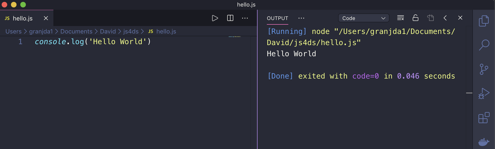
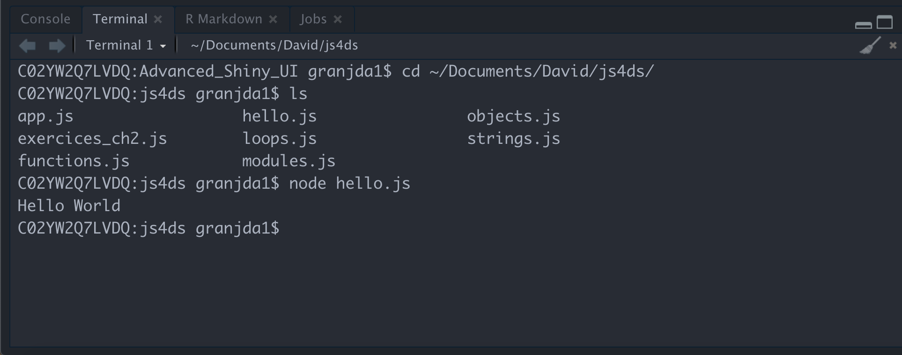
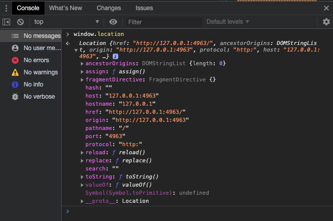
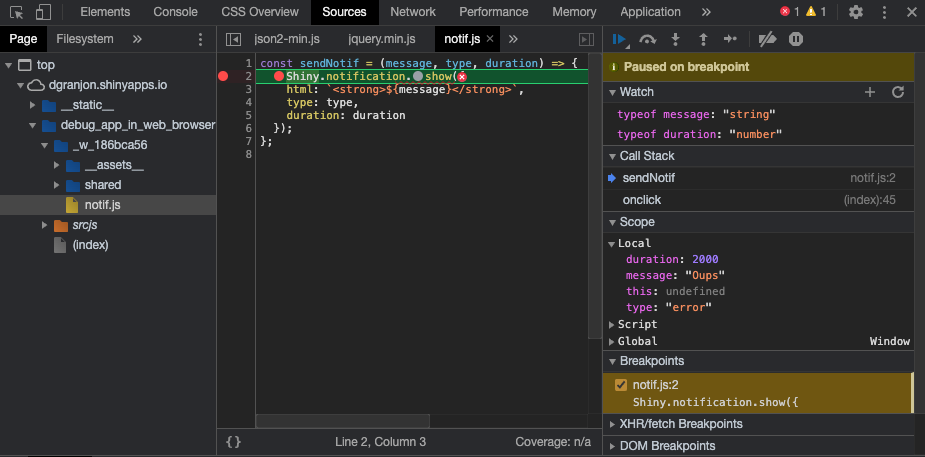

# JavaScript for Shiny {#survival-kit-javascript}
Designing an outstanding interface is not just about making it look nice with HTML and CSS.
How do we handle __interactivity__, widget creation and data flow between R and JS? This is where __JavaScript__ (JS) is our biggest ally. To understand how Shiny works from inside, especially how inputs are handled, we gradually dive into its core, which contains a substantial amount of JS. Therefore, this chapter proposes a rather brief introduction to JS and __jQuery__, but this is still necessary as this book is supposed to be standalone. Advanced JS users may likely skip this part. If you wish to know more about this language, MDN web docs by Mozilla is an excellent [resource](https://developer.mozilla.org/en-US/docs/Web/JavaScript).

## Shiny JavaScript sources
::: {.importantblock data-latex=""}
Since commit __1b8635d__ (https://github.com/rstudio/shiny/commit/1b8635db327a753007b1d7d052b138353745d251),
the whole JS core has been converted to TypeScript. As this book was written before these changes, we'll point the user to the code prior to __1b8635d__, that is this state (https://github.com/rstudio/shiny/tree/60db1e02b03d8e6fb146c9bb1bbfbce269231add). Practically, the underlying mechanisms remain __exactly__ the same.
:::

Let's have a look at the `{shiny}` [@R-shiny] github [project](https://github.com/rstudio/shiny/tree/60db1e02b03d8e6fb146c9bb1bbfbce269231add). As a R package, it is composed of standard folders like `R`, `man`, `tests` and other elements. The `inst` folder contains resources for external dependencies like [Bootstrap 3](https://getbootstrap.com/docs/3.3/), [jQuery](https://jquery.com/), [datatables](https://datatables.net/), [Font Awesome](https://fontawesome.com/), ... mentioned in Chapter \@ref(web-dependencies) sorted in the `www/shared` sub-folder, as well as the whole CSS and JS Shiny codes. Notice the presence of minified files like `shiny.min.js` and non-minified elements such as `shiny.css`. Overall, the minification process reduces the loading time of a web page by removing comments and extra spaces, thereby decreasing the file size. For instance `shiny.js` has more than 6500 lines of code (240kb), while `shiny.min.js` is only 91.4kb.

Notice the `srcjs/` folder shown in Figure \@ref(fig:shiny-js-sources). It actually contains all pieces to reconstruct the whole `shiny.js` file.

```{r shiny-js-sources, echo=FALSE, fig.cap='Shiny JavaScript sources.', out.width='100%'}
knitr::include_graphics("images/survival-kit/shiny-js-sources.png")
```

Since in Chapter \@ref(shiny-input-system) we'll use some of those scripts, a little understanding of the basic underlying JavaScript concepts is necessary.

## Introduction to JavaScript
JavaScript was created in 1995 by Brendan Eich and is also known as ECMAScript (ES). Interestingly, you might have heard about ActionScript, which is no more than an implementation of ES by Adobe Systems. Nowadays, JavaScript is the centerpiece of web development across all websites.

Here is a quick example. If you have a personal blog, you probably know [Hugo](https://gohugo.io/) or [Jekyll](https://jekyllrb.com/), especially the R interfaces like [blogdown](https://bookdown.org/yihui/blogdown/) [@R-blogdown]. These tools allow one to rapidly develop a nice-looking blog in just a few minutes, focusing on the content rather than technical aspects, which is really the point! Now, if you open the HTML inspector introduced in Chapter \@ref(web-intro-html), click on the elements tab, which may open by default, and uncollapse the `<head>` tag, you see that a lot of scripts are included, as shown in Figure \@ref(fig:scripts-list). This is similar for the `<body>` tag.

```{r scripts-list, echo=FALSE, fig.cap='Many websites require a lot JavaScript code.', out.width='100%'}
knitr::include_graphics("images/survival-kit/scripts-list.png")
```

There are three ways to include scripts in an HTML document:

  - Use the `<script>` tag with the JS code inside.
  - Add the `onclick` attribute to an HTML tag (preferably a button) to trigger JS as soon as it is clicked.
  - Import an external file containing the JS code only.

```{r, echo=FALSE, results='asis'}
html_code <- '<script type="text/javascript">
// JS code here
</script>'
code_chunk_custom(html_code, "html")
```

```{r, echo=FALSE, results='asis'}
html_code <- '<button id="hello" onclick="jsFunction()">Hello World</button>'
code_chunk_custom(html_code, "html")
```

```{r, echo=FALSE, results='asis'}
html_code <- '<!-- We use the src attribute to link the external file -->
<script type="text/javascript" src="file.js">'
code_chunk_custom(html_code, "html")
```

Whether to choose the first, second or third method depends on the content of your script. If we consider the JS library jQuery, it unfortunately contains so much code making it a challenge to understand. This makes user choose the third method most of the time.

## Setup
Like [R](https://www.r-project.org/) or [Python](https://www.python.org/), JavaScript (JS) is an __interpreted__ language. It is executed __client-side__, in other words in the browser. This also means that JS code may not be run without a suitable tool. In the following, we'll list some tools to test JS code, even though JS may also be run through the web browser developer tools, as demonstrated in section \@ref(shiny-js-inspector).

### Node {#install-node}
[Node](https://nodejs.org/en/) contains an interpreter for JS as well as a dependencies manager, npm (Node Package Manager). To install __Node__ on your computer, browse to the website and follow the installation instructions. Afterwards, open a terminal and check if:

```{r, echo=FALSE, results='asis'}
tmp_code <- 'which node
node --version'
code_chunk_custom(tmp_code)
```

returns something. If not, Node may not be properly [installed](https://www.taniarascia.com/how-to-install-and-use-node-js-and-npm-mac-and-windows/).

::: {.noteblock data-latex=""}
If you prefer not installing Node, there exists alternatives like  __repl.it__ (https://repl.it/languages/nodejs), offering a Node.js online compiler environment. This will be more than enough to follow this part.
:::

### Choose a good IDE
Personally, I really like [VSCode](https://code.visualstudio.com) for coding with JS, as it is chipped with a plug and play Node interpreter, allowing you to seamlessly execute any JS code. Moreover, VSCode supports R very well, a comprehensive installation guide being shown [here](https://github.com/REditorSupport/vscode-R). In the remainder of the book, most screenshots are taken from RStudio since, at the time of writing, this is still the best IDE choice for R users. However, keep in mind that VSCode is even more powerful for web development, particularly to handle JSX code, as studied in Chapters \@ref(going-further-reactR) and \@ref(going-further-webdev). As a side note, I encourage you to try the [dracula](https://draculatheme.com/visual-studio-code/) color theme, which is my favorite. [RStudio IDE](https://rstudio.com/products/rstudio/) can also handle JS code, but running it is less straightforward. Below, we will explain how to run a JS code in both IDE's. In section \@ref(shiny-js-inspector), we will show how to manipulate JS code directly in the web browser, through the HTML inspector. This is the method we will mostly rely on in the remainder of the book since we will also work with HTML and CSS at the same time.

### First script
Let's write our first script:

```{r, echo=FALSE, results='asis'}
js_code <- "console.log('Hello World');"
code_chunk_custom(js_code, "js")
```

You notice that all instructions end with a `;`. You can run this script either in RStudio IDE or VSCode.

```{r script-vscode, echo=FALSE, fig.cap='Run JS in VSCode.', out.width='100%'}

```

In VSCode, clicking on the run arrow (top center) of Figure \@ref(fig:script-vscode) triggers the `node hello.js` command, which tells Node to run the script. We see the result in the right panel (code=0 means the execution is fine, and we even have the compute time). To run this script in the RStudio IDE, you need to click on the terminal tab (you could also open a basic terminal) and type `node hello.js` (or `node mycustompath/hello.js` if you are not already in the script folder). You should see the `Hello World` message in the console (see Figure \@ref(fig:script-rstudio)).

```{r script-rstudio, echo=FALSE, fig.cap='Run JS within an RStudio shell terminal.', out.width='100%'}

```

## Programming with JS: basis
We are now all set to introduce the basis of JS. As in many languages, JS is made of __variables__ and __instructions__. All instructions end with a `;` symbol.

### JS types
JS defines several __types__:

  - __Number__: JS does not distinguish between integers and others. In R for instance, numeric contains integers and double.
  - __String__: characters ('blabla').
  - __Boolean__: true/false.

To check the type of an element, we may use the `typeof` operator:

```{r, echo=FALSE, results='asis'}
js_code <- "typeof 1; // number
typeof 'pouic'; // string"
code_chunk_custom(js_code, "js")
```

::: {.importantblock data-latex=""}
In JS, `typeof` is not a function like in R! Therefore, don't write `typeof('string');`.
:::

### Variables

Variables are key elements to programming languages. They allow you to store intermediate results and do other manipulations. In JS, a variable is defined by:

  - A type.
  - A name.
  - A value.

::: {.importantblock data-latex=""}
A valid variable name:

  - Doesn't use a reserved JS name like `typeof`!
  - Doesn't start with a number (123soleil)!
  - Doesn't include any space (total price)!
:::

Besides, code style is a critical element in programming, increasing readability and general consistency. There are several styles, the main ones being __snake_case__ and __camelCase__. As shown in the following, there are two ways to create variables in JavaScript.

#### Const
We may use __const__:

```{r, echo=FALSE, results='asis'}
js_code <- "const n = 1;
n = 2; // error
const n = 3; // error
const a;
a = 1; // errors"
code_chunk_custom(js_code, "js")
```

As shown above, such variables:

  - Cannot be modified.
  - Cannot share the same name.
  - Must be assigned a value.


#### let
Another way to define a variable:

```{r, echo=FALSE, results='asis'}
js_code <- "let myVariable = 'welcome';
myVariable = 1;
console.log(myVariable);"
code_chunk_custom(js_code, "js")
```

All mathematical operators apply, for example:

```{r, echo=FALSE, results='asis'}
js_code <- "let myNumber = 1; // initialize
myNumber--; // decrement
console.log(myNumber); // print 0"
code_chunk_custom(js_code, "js")
```

::: {.noteblock data-latex=""}
List of numerical operators in JS:

  - `+` (also allows you to concatenate strings together)
  - `-`
  - `*`
  - `/`
  - `% (modulo)`
  - `++` (incrementation)
  - `--` (decrementation)
:::

You may also know `var` to declare variables. What is the difference with `let`? It is mainly a __scope__ [reason](https://www.w3schools.com/js/js_let.asp):

```{r, echo=FALSE, results='asis'}
js_code <- "var i = 1;
{
  var i = 2; // this will modify i globally, not locally
}
console.log(`i is ${i}`); // i is 2.

let j = 1;
{
  let j = 2; // j is only declared locally and not globally!
}
console.log(`j is ${j}`); // j is 1"
code_chunk_custom(js_code, "js")
```

You will see later that we still use `var` in the Shiny core.

### Conditions
Below are the operators to check conditions:

::: {.noteblock data-latex=""}
  - `===` (A equal value, equal type B)
  - `==` (A equal to B)
  - `!==` (A not equal value or not equal type B)
  - `!=` (A not equal to B)
  - `>`, `>=`
  - `<`, `<=`
  - `AND` (A AND B) or `&&`
  - `OR` (A OR B) or `||`
:::

::: {.importantblock data-latex=""}
Importantly, prefer `===` and `!==` to compare elements since `5 == "5"` would return `true`, which is generally not what you want!
:::


There are several ways to test conditions:

  - `if (condition) { console.log('Test passed'); }`
  - `if (condition) { instruction A } else { instruction B }`

The __ternary__ operator is a shortcut `condition ? instruction if true : instruction if false` that may be chained. For complex instructions, we recommend not using it, as it may affect code readability.

Whenever a lot of possible conditions have to be evaluated, it is better to choose the `switch`:

```{r, echo=FALSE, results='asis'}
js_code <- "switch (variable) {
  case val1: // instruction 1
  break; // don't forget the break!
  case val2:  // instruction 2
  break;
  default: // when none of val1 and val2 are satisfied
}"
code_chunk_custom(js_code, "js")
```

### Objects
JavaScript is an __object-oriented__ programming language (like Python). An object is defined by:

  - A __type__.
  - Some __properties__.
  - Some __methods__ (to manipulate properties).

Let's construct our first object:

```{r, echo=FALSE, results='asis'}
js_code <- "const me = {
  name : 'Divad',
  age : 29,
  music : '',
  printName: function() {
    console.log(`I am ${this.name}`);
  }
}

me.geek = true; // works (see const variables above)
// print a human readable object.
console.log(JSON.stringify(me));

console.log(me.name);
console.log(me.age);
console.log(me.music);
// don't repeat yourself!!!
for (let key in me) { // here is it ok to use `in`
 console.log(`me[${key}] is ${me[key]}`);
}

me.printName();

me = {
  name: 'Paul',
  age: 40
} // error (see const variables above)"
code_chunk_custom(js_code, "js")
```

Some comments on the above code:

  - To access an object property, we use `object.<property>`.
  - To print a human readable version of the object, `JSON.stringify` will do the job.
  - We introduced string __interpolation__ with `${*}`. `*` may be any valid expression.
  - Methods are called with ``object.<method>``. We use `this` to refer to the object itself. Take note, we will see it a lot!

In JavaScript, there are already predefined objects to interact with arrays, dates, ...

#### Arrays
An __array__ is a structure allowing you to store information; for instance:

```{r, echo=FALSE, results='asis'}
js_code <- "const table = [1, 'plop'];
table = [2]; // error
console.log(table);"
code_chunk_custom(js_code, "js")
```

Array may be __nested__:

```{r, echo=FALSE, results='asis'}
js_code <- "const nested = [1, ['a', [1, 2, 3]], 'plop'];
console.log(nested);"
code_chunk_custom(js_code, "js")
```

In arrays, elements may be accessed by their __index__, but as mentioned before, the first index is 0 (not 1 like in R).
For instance, if we want to get the first element of the `nested` array, we do:

```{r, echo=FALSE, results='asis'}
js_code <- "console.log(nested[0]);
// To get deeply nested element
// we may chain index
nested[1][1] // Access [1, 2, 3]"
code_chunk_custom(js_code, "js")
```

Note that the `length` method returns the size of an array and is very convenient in for loops, as we'll see later:

```{r, echo=FALSE, results='asis'}
js_code <- "nested.length // 3
nested[1].length // 2
nested[1][1].length // 3"
code_chunk_custom(js_code, "js")
```


Below is a table referencing the principal methods for arrays.

| Method/Property   |      Description     |
|:----------:|:-------------:|
| length |  Return the number of elements in an array  |
| join(separator) | Transform an array into a single string |
| concat(array1, array2) |    Assemble 2 arrays   |
| pop() | Remove the last element of an array |
| shift() | Remove the first element of an array |
| unshift(el1, el2, ...) | Insert elements at the beginning of an array |
| push(el1, el2, ...) | Add extra elements at the end of an array |
| sort() | Sort array elements by increasing value of alphabetical order |
| reverse() | Symetric of sort() |

Among those methods, we mainly use `push` and `length` in the next chapters:

```{r, echo=FALSE, results='asis'}
js_code <- "table.push('hello'); // [1, 'plop', 'hello'];"
code_chunk_custom(js_code, "js")
```

#### Strings
Below are the main methods related to the String object (character in R).

| Method/Property/Operator   |     Description     |
|:----------:|:-------------:|
| + (operator) |  String concatenation  |
| length |  String length  |
| indexOf() | Position of the character following the input string |
| toLowerCase() | Put the string in small letters |
| toUpperCase() | Put the string in capital letters |


#### Math
Below we mention some useful methods to handle mathematical objects.

| Method   |     Description     |
|:----------:|:-------------:|
| parseInt(string, radix) |  Convert a string to integer  |
| parseFloat() |  Conversion to floating number  |

All classic functions such as trigonometric functions are, of course, available. We call them with the `Math.*` prefix.


### Iterations
Iterations allow you to repeat an instruction or a set of instructions multiple times. Let's assume we have an array containing 100,000 random numbers. How would you automatically print them? This is what we are going to see below!

#### For loops
The __for loop__ has multiple uses. A convenient way to print all an array's elements is to use an iteration:

```{r, echo=FALSE, results='asis'}
js_code <- "// ES6 syntax
const nested = [1, ['a', [1, 2, 3]], 'plop'];
for (let i of nested) {
  console.log(i);
}

// or with the classic approach
for (let i = 0; i < nested.length; i++) {
  console.log(nested[i]);
}"
code_chunk_custom(js_code, "js")
```

The modern approach (ES6) consists in the `for`, `let` and `of` keywords. We define the variable
`i` that will take all values among the `nested` array and print them. Importantly, `i` does not refer
to the element index, but the element itself! The classic approach shown below uses the `index`, being slightly more
verbose.

::: {.importantblock data-latex=""}
Contrary to R, the JavaScript index starts from 0 (not from 1)! This is good to keep in mind when we mix both R and JS.
:::

JS has other methods to do iterations. Let's have a look at the `forEach` method for arrays (introduced in ES5):

```{r, echo=FALSE, results='asis'}
js_code <- "const letters = ['a', 'b', 'c', 'd'];
letters.forEach((letter) => {
  console.log(letter);
});"
code_chunk_custom(js_code, "js")
```

Since arrays are objects, it is not surprising to see `array.forEach(element, ...)`.

Which `for` loop should we use? The answer is: it depends on the situation! Actually, there even exists other ways (replace `of` by `in` and you get the indexes of the array, like with the first code, but this is [not recommended](https://hacks.mozilla.org/2015/04/es6-in-depth-iterators-and-the-for-of-loop/)).

#### Other iterations: while
While loops are another way to iterate, the incrementation step taking place at the end of the instruction:

```{r, echo=FALSE, results='asis'}
js_code <- "const h = 3;
let i = 0;
while (i <= h) {
  console.log(i);
  i++; // we need to increment to avoid infinite loop
}"
code_chunk_custom(js_code, "js")
```

### Functions
Functions are useful to wrap a succession of instructions to accomplish a given task. Defining functions allows programmers to save time (less copy and paste, less search and replace), make less errors and easily share code. In modern JavaScript (ES6), functions are defined as follows:

```{r, echo=FALSE, results='asis'}
js_code <- "const a = 1;
const fun = (parm1, parm2) => {
  console.log(a);
  let p = 3;
  // The Math object contains the max method
  return Math.max(parm1, parm2);
}
let res = fun(1, 2);
console.log(res); // prints a and 2
console.log(p); // fails as p was defined inside the function"
code_chunk_custom(js_code, "js")
```

The above function computes the maximum of two provided numbers. Some comments about scoping rules: variables defined inside the function, like `p`, are only available within the function scope, but not outside. It should be noted that functions may use global variables, defined outside like `a`. In the Shiny JS core, you'll still find the classic way of defining function:

```{r, echo=FALSE, results='asis'}
js_code <- "function initShiny() {
  // do things
}"
code_chunk_custom(js_code, "js")
```

The main difference being that the ES6 syntax may not be understood by all environments.

#### Export functions: about modules {#about-js-modules}
What happens if you write 100 functions that you want to reuse in different scripts? To prevent copying and pasting, we will now introduce the concept of modules. Let's save the below function in a script `utils.js`:

```{r, echo=FALSE, results='asis'}
js_code <- "const findMax = (parm1, parm2) => {
  return Math.max(parm1, parm2);
}

module.exports = {
  findMax : findMax
}"
code_chunk_custom(js_code, "js")
```

We create a `test.js` script in the same folder that calls the `findMax` function. To do this, we import the corresponding module:

```{r, echo=FALSE, results='asis'}
js_code <- "const { findMax } = require('./utils.js');
findMax(1, 2); // prints 2"
code_chunk_custom(js_code, "js")
```

__ES6__ introduced another way to import and export elements across multiple scripts, which will be leveraged starting from Chapter \@ref(mobile-shinyMobile).

```{r, echo=FALSE, results='asis'}
js_code <- "export { findMax, ... }; // in utils.js
import { findMax, ...} from './utils.js'; // in test.js"
code_chunk_custom(js_code, "js")
```

### JS code compatibility
As ES6 is not fully supported by all web browsers, you might wonder how to make your JS code standard. A tool called __transpiler__ can convert any modern JS code into a universal JS code. This is the case of [Babel](https://babeljs.io/), one of the most commonly used. In Chapter \@ref(workflow-charpente), we'll see how to do it with a JS __bundler__, namely `esbuild`, as well as __webpack__ in Chapters \@ref(going-further-reactR) and 
\@ref(going-further-webdev).

### Event listeners
When you explore a web application, clicking on a button usually triggers something like a computation, a modal or an alert. How does this work? In JavaScript, interactivity plays a critical role. Indeed, you want the web application to react to user inputs like mouse clicks or keyboard events. Below we introduce DOM __events__.

Let's consider a basic HTML button:

```{r, echo=FALSE, results='asis'}
html_code <- '<button id="mybutton">Go!</button>'
code_chunk_custom(html_code, "html")
```

On the JavaScript side, we first capture the button element using its `id` selector with `getElementById`:

```{r, echo=FALSE, results='asis'}
js_code <- "const btn = document.getElementById('mybutton');"
code_chunk_custom(js_code, "js")
```

We then apply the `addEventListener` method. In short, an event __listener__ is a program that triggers when a given event occurs (we can add multiple event listeners per HTML element). It takes two main parameters:

  - The event: click, change, mouseover, ...
  - The function to call, also known as __callback__.

```{r, echo=FALSE, results='asis'}
js_code <- "btn.addEventListener('click', function() {
  alert('Thanks!');
});"
code_chunk_custom(js_code, "js")
```

## jQuery {#intro-jquery}

### Introduction
[jQuery](https://jquery.com) is a famous JavaScript library providing a user-friendly interface to manipulate the DOM and is present in almost all actual websites. It is slightly easier (more convenient to use) than vanilla JS. To use jQuery in a web page, we must import its code in the `head` of our HTML page:


```{r, echo=FALSE, results='asis'}
html_code <- '<!doctype html>
<html lang="en">
  <head>
    <meta charset="utf-8">
    <title>Including jQuery</title>
    <!-- How to include jQuery -->
    <script src="https://code.jquery.com/jquery-3.5.1.js">
    </script>
  </head>
  <body>

    <p>Hello World</p>

  <script>
    $(\'p\').css(\'color\', \'red\');
  </script>

  </body>
</html>'
code_chunk_custom(html_code, "html")
```

### Syntax
The following is a minimal jQuery code representing its philosophy ("write less, do more."):

```{r, echo=FALSE, results='asis'}
js_code <- "$(selector).action();"
code_chunk_custom(js_code, "js")
```

The __selector__ slot stands for any jQuery selector like `class`, `id`, `element`, `[attribute]`, `:input` (will select all `<input>` elements) and many [more](https://www.w3schools.com/jquery/jquery_ref_selectors.asp). As a reminder, let's consider the following example:

```{r, echo=FALSE, results='asis'}
html_code <- '<p class="text">Hello World</p>'
code_chunk_custom(html_code, "html")
```

To select and interact with this element, we use JavaScript and jQuery:

```{r, echo=FALSE, results='asis'}
js_code <- "// vanilla JS
let inner = document.getElementsByClassName('text').innerHTML;
// jQuery
let inner = $('.text').html();"
code_chunk_custom(js_code, "js")
```

This is, of course, possible to chain selectors:

```{r, echo=FALSE, results='asis'}
html_code <- '<ul class="list">
  <li class="item">1</li>
  <li class="item">2</li>
  <li class="item">3</li>
  <li class="item" id="precious-item">4</li>
</ul>

<ul class="list" id="list2">
  <li class="item">1</li>
  <li class="item">2</li>
  <li class="item">3</li>
  <li class="item">4</li>
</ul>'
code_chunk_custom(html_code, "html")
```

```{r, echo=FALSE, results='asis'}
js_code <- "// Returns an array containing 8 li tags
let items = $('.list .item');
// Selects only li tags from the second ul element
let otherItems = $('#list2 .item');
// Returns an array with 2 ul elements
let lists = $('ul');
// Returns the first li element of the second ul.
let firstItem = $('#list2:first-child');"
code_chunk_custom(js_code, "js")
```

The good news is that you should already be at ease with CSS selectors from section \@ref(css-selectors).

### Good practice
It is recommended to wrap any jQuery code as follows:

```{r, echo=FALSE, results='asis'}
js_code <- "$(document).ready(function(){
  // your code
});

// or a shortcut

$(function() {
  // your code
});"
code_chunk_custom(js_code, "js")
```

This is to avoid interacting with the DOM before it is actually ready. Most of the time,
if you forget this, you'll end up with many issues involving `undefined` elements.

### Useful functions
There are filtering functions dedicated to simplifying item [selection](https://api.jquery.com/category/traversing/). Below is a list containing those mostly used in Shiny.

#### Travel in the DOM

| Method   |     Description     |
|:----------:|:-------------:|
| children() | Get the children of each element passed in the selector (important: only travels a single level down the DOM tree) |
| first() | Given a list of elements, select the first item |
| last() | Given a list of elements, select the last item |
| find() | Look for a descendant of the selected element(s) that could be multiple levels down in the DOM |
| closest() | Returns the first ancestor (including itself) matching the condition (travels up in the DOM) |
| filter() | Fine-tune element selection by applying a filter. Only return elements for which the condition is true |
| siblings() | Get all siblings of the selected element(s) |
| next() | Get the immediately following sibling |
| prev() | Get the immediately preceding sibling |
| not() | Given an existing set of selected elements, exclude element(s) that match the given condition |


#### Manipulate tags
Below is a list of the main jQuery [methods](https://api.jquery.com/category/manipulation/) to manipulate tags (adding class, CSS property...)

| Method   |     Description     |
|:----------:|:-------------:|
| addClass() | Add class or multiple classes to the set of matched elements |
| hasClass() | Check if the matched element(s) have a given class |
| removeClass() | Remove class or multiple classes to the set of matched elements |
| attr() | Get or set the value of a specific attribute |
| after() | Insert content after |
| before() | Insert content before |
| css() | Get or set a CSS property |
| remove() | Remove element(s) from the DOM |
| val() | Get the current value of the matched element(s) |


### Chaining jQuery methods
A lot of jQuery methods may be chained from one method to the next using a `.`.

```{r, echo=FALSE, results='asis'}
html_code <- '<ul>
  <li>Item 1</li>
  <li>Item 2</li>
  <li>Item 3</li>
  <li>Item 4</li>
  <li>Item 5</li>
</ul>'
code_chunk_custom(html_code, "html")
```

We end the chain by `;` and each step is indented by two spaces in the right direction:

```{r, echo=FALSE, results='asis'}
js_code <- "$('ul')
  .first()
  .css('color', 'green') // add some style with css
  .attr('id', 'myAwesomeItem') // add an id attribute
  .addClass('amazing-ul');"
code_chunk_custom(js_code, "js")
```

### Iterations
Like in JavaScript, it is possible to do iterations with jQuery. Let's consider the following HTML elements:

```{r, echo=FALSE, results='asis'}
html_code <- '<ul>
  <li>Item 1</li>
  <li>Item 2</li>
</ul>'
code_chunk_custom(html_code, "html")
```

Many jQuery methods have an implicit iteration. For instance, to change the style of each matched element, we don't need to do as below:

```{r, echo=FALSE, results='asis'}
js_code <- "$('li').each(function() {
  $(this).css('visibility', 'hidden'); // Hides all li items
});"
code_chunk_custom(js_code, "js")
```

Instead, we just have to write:

```{r, echo=FALSE, results='asis'}
js_code <- "$('li').css('visibility', 'hidden');"
code_chunk_custom(js_code, "js")
```

which is much better. The `map` method has a different purpose. It creates a new object based on the provided one:

```{r, echo=FALSE, results='asis'}
js_code <- "const items = [0, 1, 2, 3, 4, 5];
const threshold = 3;

let filteredItems = $.map(items, function(i) {
  // removes all items > threshold
  if (i > threshold)
    return null;
  return i;
});"
code_chunk_custom(js_code, "js")
```

### Events
In jQuery there are a significant number of methods related to events. Below are the most popular:

```{r, echo=FALSE, results='asis'}
js_code <- "$(element).click(); // click event
$(element).change(); // trigger change on an element

// attach an event handler function.
// Here we add click
$(element).on('click', function() {
  // handle event
});


// one triggers only once
$(element).one('click', function() {
  // handle event
});

// useful to trigger plot resize in Shiny so that
// they correctly fit their container
$(element).resize();

// similar to $(element).change();
$(element).trigger('change');"
code_chunk_custom(js_code, "js")
```

The `.on` event is frequently used in Shiny since it allows you to pass custom events that are not part of the JS predefined events. For instance, `{shinydashboard}` [@R-shinydashboard] relies on a specific HTML/JavaScript/CSS template including a homemade API for handling the dashboard events.


### Extending objects
A last feature we need to mention about jQuery is the ability to extend objects with additional properties and/or methods.

```{r, echo=FALSE, results='asis'}
js_code <- "// jQuery way
$(function() {
  let object1 = { apple: 0 };
  $.extend(object1, {
    print: function() {
      console.log(this);
    }
  });
  object1.print();
});"
code_chunk_custom(js_code, "js")
```

With pure JS we would use `Object.defineProperty`:

```{r, echo=FALSE, results='asis'}
js_code <- "// pure JavaScript
Object.defineProperty(object1, 'print', {
  value: function() {
    console.log(this);
  },
  writable: false
});"
code_chunk_custom(js_code, "js")
```

## Shiny, JavaScript and the HTML inspector {#shiny-js-inspector}
In the part above, we provided some elementary JS knowledge. This section comes back to the main point of this book, which is Shiny. We describe how to leverage the developer tools so as to test, run and debug JavaScript code related to a Shiny app.

### The console panel
While developing JS code, we often put some `console.log(var)` calls to track the content of a given variable and check that our code is doing what it is supposed to do. The resulting messages, errors or warnings are printing in the console, also called a Read-eval-print loop (__REPL__), suitable to experiment and practice your new JS/jQuery skills.

#### A real REPL
As a warm-up, run the Shiny app below and open the Chrome DevTools. Notice the two `Console` tabs (next to `Elements` and at the bottom; the latter may not be visible all the time and can be activated in the parameters), as depicted in Figure \@ref(fig:dom-console). We recommend using the bottom one to still see the `Elements` tab and preview DOM modifications in real time.

```{r, eval=FALSE}
ui <- fluidPage()

server <- function(input, output, session) {}

shinyApp(ui, server)
```

```{r dom-console, echo=FALSE, fig.cap='The console panel in the Chrome developer tools.', out.width='100%'}

```

Interestingly, you may access any element contained in the window. Copy and paste `$("body").addClass("plop");` in the prompt. Notice what happens in the `Elements` tab.

#### Track errors and warnings
A lot of Shiny app issues on [Stack Overflow](https://stackoverflow.com/) or in the [RStudio community](https://community.rstudio.com/) could be more easily solved by quickly inspecting the console.

### Debug Shiny/JS code with the inspector {#broken-shiny-app-debug}
To debug Shiny apps from the inspector, all your scripts have to be in a folder accessible by the app like the `www/` folder or by using `addResourcePath()`. Moreover,
if you have minified files, there should be [source maps](https://www.html5rocks.com/en/tutorials/developertools/sourcemaps/), which will allow reconstructing the original scripts, that is as they were before the minification process. For instance, Shiny has the `shiny.min.js.map`. In practice, most R packages bundling HTML templates do not ship these files since they could be quite large (> 1.5MB), and CRAN restricts the package size to 5MB. For instance, the [framework7](https://framework7.io/) HTML template, which `{shinyMobile}` is built on [@R-shinyMobile], has source maps but the size would exceed 5MB, which is obviously too big to include in the R package.

In the following, we consider a very simple Shiny app deployed on [shinyapps.io](https://www.shinyapps.io/), where a notification is displayed with JavaScript as soon as a user clicks the action button. We deliberately made some typos, the goal being to find and fix them.

  1. Browse to the [app](https://dgranjon.shinyapps.io/debug_app_in_web_browser/).
  2. Open the Chrome DevTools.
  3. Click on the action button (I am pretty sure you clicked before step 2 ;)).
  4. As expected and shown in Figure \@ref(fig:dom-debug-shiny-error), the console displays an
  error message: `Uncaught TypeError: Cannot read property 'show' of undefined`. Sounds good, doesn't it?

```{r dom-debug-shiny-error, echo=FALSE, fig.cap='Error in the console panel. Errors are displayed in red, warnings in yellow and messages in grey. ', out.width='100%'}
knitr::include_graphics("images/survival-kit/dom-debug-shiny-error.png")
```

  5. Expand the error message to show the stack trace. We see that the error occurred during an `onclick` event calling the `sendNotif` function. Interestingly, we can open this file by clicking on the provided link (notif.js:2). You should get a layout similar to Figure \@ref(fig:dom-debug-shiny-sources), depending on your screen width.


```{r dom-debug-shiny-sources, echo=FALSE, fig.cap='Inspect the source causing the error.', out.width='100%'}
knitr::include_graphics("images/survival-kit/dom-debug-shiny-sources.png")
```

  6. Let's briefly describe Figure \@ref(fig:dom-debug-shiny-sources). On the left side, you can navigate through all files accessible by the web server, that is Shiny internal resources, Shiny external dependencies (like Bootstrap 3), as well as your own scripts. If the app is deployed on shinyapps.io, all scripts are located in a folder starting by `_w_`, which corresponds to the shinyapps.io workerId (This is a detail and not important to understand. See more [here](https://github.com/rstudio/shiny/blob/60db1e02b03d8e6fb146c9bb1bbfbce269231add/R/shiny.R#L69).) The central part contains any opened script like a classic IDE. The right side displays debugging tools; you can trigger them by clicking on the corresponding accordion. The scope shows all variables/object values at a break point. Watch allows you to track specific elements, and Event Listener Breakpoints allow you to stop at a given listener type. We could create a new "watcher" by entering `typeof message` and clicking the add icon to check the message type within the `sendNotif` function. Watched expressions are saved when you close the browser.

  7. Put a break point at line two by clicking on the left side of the center panel and click again on the action button to trigger the break point. I also additionally set two Watch Expressions (for message and duration) whose type are string and number, respectively, as depicted in Figure \@ref(fig:dom-debug-shiny-breakpoint). According to the results, nothing seems wrong for the function arguments.

```{r dom-debug-shiny-breakpoint, echo=FALSE, fig.cap='Inspection of the scope at the breakpoint.', out.width='100%'}

```

  8. The error message `Uncaught TypeError: Cannot read property 'show' of undefined` actually means that `notification` does not exist. Try yourself by typing `Shiny.notification` in the console. You'll get `undefined`. Instead, the console suggests `Shiny.notifications`. Let's replace the wrong code in the `notif.js` script and then save it.
Click on the "Resume script execution" blue button (top left of the right panel). Notice that a notification is displayed and no more error is thrown.

Congrats! You've just debugged your first Shiny app from the web inspector. In practice, your code is probably much more complex than this example, but the workflow remains the same.

### The Shiny JavaScript object {#shiny-js-object}
The `Shiny` object is exported at the top of the `shiny.js` file. In other words, we may use this object and any of its properties within the HTML inspector console tab, in any JavaScript file or Shiny app as follows:

```{r, eval=FALSE}
ui <- fluidPage(
  tags$script(
    "$(function() {
      console.log(Shiny);
    });
    "
  )
)
server <- function(input, output, session) {}
shinyApp(ui, server)
```

This object contains many properties and methods as shown in Figure \@ref(fig:shiny-object). Some of particular interest, such as like `Shiny.setInputValue`, `Shiny.addCustomMessageHandler`, `Shiny.shinyapps`, `Shiny.bindAll`, will be detailed later in Chapters \@ref(shiny-input-system) and \@ref(shiny-custom-handler).

```{r shiny-object, echo=FALSE, fig.cap='The Shiny JavaScript object.', out.width='75%', fig.align='center'}
knitr::include_graphics("images/survival-kit/shiny-object.png")
```

::: {.warningblock data-latex=""}
At this point, users may find `options(shiny.minified = FALSE)` convenient to debug the Shiny.js core.
:::

## Exercises

Because the JavaScript console is a REPL, all JavaScript exercises may be done inside, except exercise 3, which also involves HTML. In that case, the reader may browse to [jsfiddle](https://jsfiddle.net/).

### Exercise 1: define variables

1. Play with the example below

```{r, echo=FALSE, results='asis'}
js_code <- "let myNumber = 1; // initialize
myNumber--; // decrement
console.log(myNumber); // print 0"
code_chunk_custom(js_code, "js")
```

### Exercise 2: define objects

Below is an object skeleton.

```{r, echo=FALSE, results='asis'}
js_code <- "const me = {
  name : ,
  age : ,
  music : ,
  printName: function() {
    console.log(`I am ${}`);
  }
}"
code_chunk_custom(js_code, "js")
```

1. Fill in the objection with some random values.
2. Access the `name` property.
3. Create the `printAge` method, which returns the `age`. Hint: `this` refers to the object itself. For instance `this.name` gives the name property.

### Exercise 3: jQuery
[JSFiddle](https://jsfiddle.net/) allows you to insert HTML, CSS and JavaScript to test
code, share and more. It also does not require you to have any specific configuration on your machine so that you focus on testing!

1. Go to JSFiddle.
2. Insert the following HTML code chunk in the HTML sub-window.

```{r, echo=FALSE, results='asis'}
html_code <- '<!DOCTYPE HTML>
<html>
  <head>
  <!-- head content here -->
  </head>
  <body>
    <ul>
      <li>Item 1</li>
      <li>Item 2</li>
      <li>Item 3</li>
      <li>Item 4</li>
      <li>Item 5</li>
    </ul>
  </body>
</html>'
code_chunk_custom(html_code, "html")
```

This is a very basic HTML skeleton.

3. In the JavaScript windows, select jQuery 3.5.1 in the dropdown menu. (Why 3.5.1? The latest Shiny release (v1.6.0) relies on that version. It is therefore best practice to ensure dependencies are similar, at least the major version.)
4. Since it is best practice to run jQuery code only when the document is ready (avoiding targeting non existing elements), we wrap our JS code in the following:

```{r, echo=FALSE, results='asis'}
js_code <- "$(function() {
  // your code
});

// or a more explicit syntax
$(document).ready(function() {
  // code
});"
code_chunk_custom(js_code, "js")
```

5. Create an event listener to change the third item color as soon as you click on it.
Hint 1: To select a specific item you may use `$(selector:eq(i))`, where `i` is the index of the element. Keep in mind that JavaScript starts from 0 and not 1 like R!
Hint 2: as a reminder, to create an event listener in jQuery, we use the following pattern.

```{r, echo=FALSE, results='asis'}
js_code <- "$('selector').on('event_name', function(e) {
  // your logic
});"
code_chunk_custom(js_code, "js")
```

### Exercise 4: a pure JS action button

Below is another example of a button element with an attached event listener. Clicking on the button will increment its value by 1. Fill in the blanks.

```{r, echo=FALSE, results='asis'}
html_code <- '<!DOCTYPE HTML>
<html>
  <head>
  <!-- head content here -->
  </head>
  <body>
    <button>click</button>
  </body>
</html>'
code_chunk_custom(html_code, "html")
```

```{r, echo=FALSE, results='asis'}
js_code <- "$(function() {

  // recover the button inner html
  const btnText = ...;

	// event listener for button element
	$(...).click(function() {
  	var val = ...;
    // (1) increment button
    // (2) add the button value to the inner text
    ...

    // show alert given condition
    if (val > 3) {
      ...
    }
  });

});"
code_chunk_custom(js_code, "js")
```
