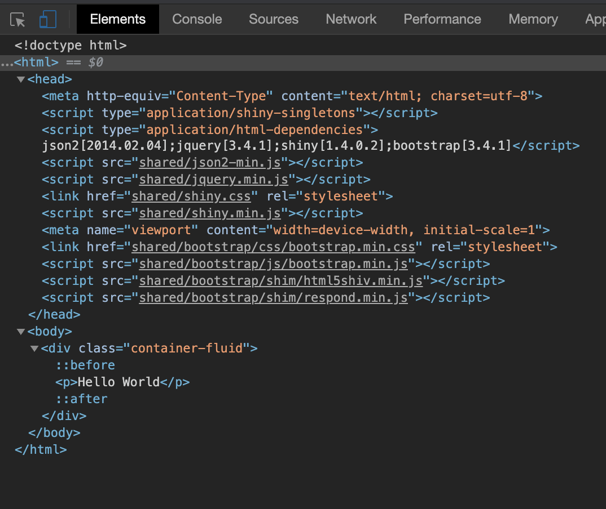

# Shiny: What's under the Hood? {#survival-kit-shiny}
In the 2 previous chapters, we quickly introduced HTML and JavaScript. In this chapter, we are going to see what Shiny has under the hood. Therefore, as mentionned in the book prerequisites, you should be quite familiar with Shiny if you want to get the most out of this chapter.

We will answer to the following questions:

  - What web dependencies is Shiny based on?
  - How does Shiny deal with inputs? 
  - How is R/JavaScript communication achieved?
  
## Shiny, HTML, CSS and JavaScript
Shiny allows to develop web applications with R in minutes. Let's face it: this is quite mind blowing! Well, this won't probably be a production app but still a working prototype. Believe me, doing a web application with pure HTML/CSS and JavaScript is more difficult, especially for a non web developer background. 

Is Shiny less customizable than a classic web app? Not at all! Indeed, Shiny has its own engine to build HTML tags, through R, meaning that all HTML elements are available. You may also include any custom [JavaScript](https://shiny.rstudio.com/articles/packaging-javascript.html) or [CSS](https://mastering-shiny.org/advanced-ui.html) code. 

Do you remember about the first experiment of Chapter \@ref(survival-kit-html)? We only did 

```{r, eval=FALSE}
library(shiny)
p("Hello World")
```

and noticed that the `p` function generates HTML. We will study in chapter \@ref(htmltools-overview) the tools to build/modify/delete these tags. The main difference between HTML tags and Shiny tags is the absence of closing tag for Shiny. For instance, in raw HTML, we expect `<p>` to be closed by `</p>`. In Shiny, we only call `p(...)`, where `...` may be attributes like class/id or children tags.

## Discover Shiny dependencies
The simplest Shiny layout is the `fluidPage`. The `shinyapp` predefined Rstudio snippet will create a basic app skeleton (type shinyapp in RStudio IDE):

```{r, eval=FALSE}
ui <- fluidPage(
  p("Hello World")
)

server <- function(input, output, session) {}
shinyApp(ui, server)
```

At first glance, the page only contains text. Waiiit ... are you sure about this? Let's run the above example and open the HTML inspector introduced in \@ref(survival-kit-html). Results are displayed on Figure \@ref(fig:shiny-deps).

```{r shiny-deps, echo=FALSE, fig.cap='Shiny dependencies'}

```

We see in the head section that Shiny has 4 dependencies:

  - json2
  - jQuery 3.4.1
  - shiny (custom JavaScript and CSS)
  - Bootstrap 3.4.1 (JavaScript and CSS) + other files (html5shiv, respond)
  
[Bootstrap](https://getbootstrap.com) is here to provide plug and play design and interactions (tabs, navs). For instance the `fluidRow` and `column` functions of Shiny leverage the Bootstrap grid to control how elements are displayed in a page. This is convenient because it avoids to write a crazy amount of CSS/JavaScript and always reinvent the wheel. 

jQuery drives the DOM manipulations. Shiny has its own JS and CSS files. Finally, json2 is a library to handle the [JSON](https://www.json.org/json-en.html) data format (JavaScript Object Notation). In the following chapters we will use it a lot, through the [jsonlite](https://cran.r-project.org/web/packages/jsonlite/index.html) package that allows to transform JSON objects in R objects and inversely. 

In summary, all those libraries are necessary to make Shiny what it is! Customizing Shiny may imply to alter those existing libraries (except the Shiny core JavaScript and json2). In Chapter \@ref(htmltools-dependencies) we will discover better tools to extract HTML dependencies.

## Shiny's input system
The goal of this part is to better understand how Shiny inputs work.

### Shiny JavaScript sources
The Shiny input system relies on the Shiny JavaScript sources. They are located in the srcjs folder shown in Figure \@ref(fig:shiny-js-sources).

```{r shiny-js-sources, echo=FALSE, fig.cap='Shiny JavaScript sources'}
knitr::include_graphics("images/survival-kit/shiny-js-sources.png")
```


Notice the `_start.js` and `_end.js`. These will be used by the `Gruntfile.js`, that is a [grunt-based](https://gruntjs.com) tool to run different tasks such as concatenate multiple JavaScript files, lint the code, minify it ... See [here](https://github.com/rstudio/shiny/tree/master/tools) for a summary.

```javascript
grunt.registerTask('default', [
    'concat',
    'string-replace',
    'validateStringReplace',
    'eslint',
    'configureBabel',
    'babel',
    'uglify'
  ]);
```

These results in a large big [file](https://github.com/rstudio/shiny/blob/master/inst/www/shared/shiny.js) and its minified [version](https://github.com/rstudio/shiny/blob/master/inst/www/shared/shiny.min.js) in the `shiny/inst/www/shared` folder.


### The Shiny JavaScript object
The `Shiny` object is exported at the top of the `shiny.js` file [^export-js]. In other words, this means that we may use this object and any of its properties within the HTML inspector console tab, in any JavaScript file or shiny app as below.

```{r, eval=FALSE}
ui <- fluidPage(
  tags$script(
    "$(function() {
      console.log(Shiny);
    });
    "
  )
)
server <- function(input, output, session) {}
shinyApp(ui, server)
```

This object contains many properties and methods as shown in Figure \@ref(fig:shiny-object). We will discuss some of them later, like `Shiny.setInputValue`, `Shiny.addCustomMessageHandler`, `Shiny.shinyapps`, `Shiny.bindAll`, ...

```{r shiny-object, echo=FALSE, fig.cap='The Shiny JavaScript object'}
knitr::include_graphics("images/survival-kit/shiny-object.png")
```

[^export-js]: Refer to Chapter \@ref(survival-kit-javascript) if you don't remember how to export an object and make it available to all JS files.

### Initialization
When we run our app, most of the time it works and it is just fine! But what happens so that inputs and outputs are correctly handled? Upon initialization, Shiny runs several JavaScript functions. Not surprisingly, there is one called [`init_shiny`](https://github.com/rstudio/shiny/blob/master/srcjs/init_shiny.js) containing a subtantial amount of elements. We find utils functions like `bindOutputs`, `unbindOutputs` to respectively bind/unbind outputs, `bindInputs` and `unbindInputs` for inputs. Only `bindAll` and `unbindAll` are available to the user (see a usecase [here](https://stackoverflow.com/questions/51633326/dateinput-not-working-on-dt-in-shiny)). To illustrate what they do, let's run the app below.

```{r, eval=FALSE}
ui <- fluidPage(
  sliderInput("obs", "Number of observations:",
    min = 0, max = 1000, value = 500
  ),
  plotOutput("distPlot")
)

server <- function(input, output, session) {
  output$distPlot <- renderPlot({
    hist(rnorm(input$obs))
  })
}
shinyApp(ui, server)
```

We then open the HTML inspector and run `Shiny.unbindAll(document)` (document is the scope, that is where to search). Try to change the slider input. What do you observe? Now let's type `Shiny.bindAll(document)` and update the slider value. What happens? Magic isn't it? This simply shows that when inputs are not bound, nothing happens so binding inputs is necessary. 

Let's see below what is an input binding and how it works.

### Input bindings
The input binding is defined by a class living in the `input_binding.js` [file](https://github.com/rstudio/shiny/blob/master/srcjs/input_binding.js). 
An input binding allows Shiny to identify each instance of a given input and what you can do with this input. The interesting thing is that if your app contains 10 different sliders, they all share the same input binding! An input binding is an object having the following methods (but not only):

   - find(scope): this method specifies how to find the current input element (el) in the DOM. scope refers to the `document` element. In general, we use jQuery selector to search for a class.
   - initialize(el): This is called before the input is bound but not all input need to be initalized. Some API like [Framework7](https://framework7.io) require to almost always have an initialize method (We will see later).
   - getValue(el): returns the input value. The way to obtain the value tighly depends on the object and is different for almost all inputs.
   - setValue(el, value): This method is used to set the value of the current input.
   - receiveMessage(el, data): This method is the JavaScript part of all the `updateInput` functions. We usually call the setValue method inside.
   - subscribe(el, callback): We listen to events telling under which circumstances to change the input value. Some API like Bootstrap explicitly mention those events (like `hide.bs.tab`, `shown.bs.tab`, ...). 
   - getRatePolicy: when callback is true in the subscribe method, we apply a specific rate policy ([debounce](https://davidwalsh.name/javascript-debounce-function), throttle). This is useful for instance when we don't want to flood the server with useless update requests. For a slider, we only want to send the value as soon as the range stops moving and not all intermediate values. Those elements are defined [here](https://github.com/rstudio/shiny/blob/master/srcjs/input_rate.js).
   
At the end of the input binding definition, we register it for Shiny.

```javascript
let myBinding = new Shiny.inputBinding();
$.extend(myBinding, {
  // methods go here
});

Shiny.inputBindings.register(myBinding, 'reference');
```

Although the Shiny [documentation](https://shiny.rstudio.com/articles/building-inputs.html) mentions a `Shiny.inputBindings.setPriority` method to handle conflicting bindings, it is better not to use it.
   
Upon initialization, Shiny calls the ` initializeInputs` function that takes all input bindings and call their initialize method before binding all inputs. Note that once an input has been initialized it has a `_shiny_initialized` tag to avoid initializing it twice. As shown above, the initialize method is not always defined.

TO DO: picture to add visual representation of an input binding


### websocket
How does R (server) and JavaScript (client) communicate? This is a builtin Shiny feature highlighted [here](Fast bidirectional communication between the web browser and R using the httpuv package.), leveraging the [httpuv](https://github.com/rstudio/httpuv) and [websocket](https://github.com/rstudio/websocket) packages. We will not detail how they work but rather how to inspect the websocket in a web browser. Let's run the following app.

```{r, eval=FALSE}
shinyApp(
  ui = fluidPage(
    selectInput("variable", "Variable:",
                c("Cylinders" = "cyl",
                  "Transmission" = "am",
                  "Gears" = "gear")),
    tableOutput("data")
  ),
  server = function(input, output) {
    output$data <- renderTable({
      mtcars[, c("mpg", input$variable), drop = FALSE]
    }, rownames = TRUE)
  }
)
```

After opening the HTML inspector, we select the network tab and search for websocket in the list. We also choose the message tab to inspect what R and JavaScript say to each others. On the JavaScript side, the websocket is created in the shinyapp.js [file](https://github.com/rstudio/shiny/blob/master/srcjs/shinyapp.js). The first element received from R is the first message in the list shown in Figure \@ref(fig:shiny-websocket). It is a JSON containing the method used as well as passed data. In the meantime, you may change the select input value.

```javascript
socket.send(JSON.stringify({
  method: 'init',
  data: self.$initialInput
}));
```

The second message received from R is after updating the select input.

```javascript
this.sendInput = function(values) {
  var msg = JSON.stringify({
    method: 'update',
    data: values
  });

  // other things
};
```

All of this is quite complex but extremely useful to check wether input/output work properly. In case of error, we would see the field `error` containing some elements. In the last part of this book, we will be designing custom inputs and knowing how to debug them outside R is priceless.

Finally, `Shiny.shinyapp.$socket.readyState` returns the state of the socket connection. It should be 1 if your app is running but I've seen some cases where the socket was actually closed (and nothing could happen).


```{r shiny-websocket, echo=FALSE, fig.cap='Shiny websocket'}
knitr::include_graphics("images/survival-kit/shiny-websocket.png")
```

### Custom handlers: from R to JavaScript
Shiny contains tools to ease the communication between R and JavaScript. This is what happens in the last part. If you remember, we were playing with a `selectInput` and a `datatable`. How does R send messages to JavaScript?

Shiny is made of input and output. Yet there is a third parameter you can pass to the server function called session. The [session](https://shiny.rstudio.com/reference/shiny/1.4.0/session.html) object contains informations on the current session like clientData, the namespace ns (if working inside modules), as well as methods (yes methods since session is an R6 class). Among those methods, we are interested by 2 of them:

  - `sendCustomMessage(type, message)`: > Custom messages have no meaning to Shiny itself; they are used soley to convey information to custom JavaScript logic in the browser
  - `sendInputMessage()`: > if the input is present and bound on the page at the time the message is received, then the input binding object's receiveMessage(el, message) method will be called
  

While `sendInputMessage` is the R side of the input features, `sendCustomMessage` simply allows to communicate between R and JavaScript. 
Basically a R function :

```{r, eval=FALSE}
sayHelloToJS <- function(text, session) {
  session$sendCustomMessage(type = 'say-hello', message = text)
}
```

We need a JavaScript receptor, handle by the `addCustomMessageHandler` method:

```javascript
Shiny.AddCustomMessageHandler('say-hello', function(message) {
  alert(`R says ${message} to you!`)
})
```

Of course, the type parameter is critical to make the connection between R and JavaScript and 2 different message handlers must have different types to avoid conflicts.

TO DO: picture showing the communication

### Utilities to quickly define new inputs
If you ever wondered where the `Shiny.onInputChange` or `Shiny.setInputValue` comes from (see  [article](https://shiny.rstudio.com/articles/communicating-with-js.html)), it is actually defined in the `initShiny` function. 

```javascript
exports.setInputValue = exports.onInputChange = function(name, value, opts) {
  opts = addDefaultInputOpts(opts);
  inputs.setInput(name, value, opts);
};
```

Briefly, this function avoids to create an input binding. It is faster to code but there is a price to pay: you lose the possibility to easily update the new input. Indeed, all input functions like `sliderInput` have their own update function like `updateSliderInput`, because of the custom input binding system (We will see it very soon)!

### Get access to initial values 
Something we may notice when exploring the `initShiny` function is the existence of a `Shiny.shinyapp` object, defined as follows:

```javascript
var shinyapp = exports.shinyapp = new ShinyApp();
```


Let's explore what `shinyApp` contains. The definition is located in the shinyapps.js [script](https://github.com/rstudio/shiny/blob/master/srcjs/shinyapp.js). 

```javascript
var ShinyApp = function() {
  this.$socket = null;

  // Cached input values
  this.$inputValues = {};

  // Input values at initialization (and reconnect)
  this.$initialInput = {};

  // Output bindings
  this.$bindings = {};

  // Cached values/errors
  this.$values = {};
  this.$errors = {};

  // Conditional bindings (show/hide element based on expression)
  this.$conditionals = {};

  this.$pendingMessages = [];
  this.$activeRequests = {};
  this.$nextRequestId = 0;

  this.$allowReconnect = false;
};
```

It creates several properties, some of them are easy to guess like `inputValues` or `initialInput`. Let's run the example below and open the HTML inspector. Notice that the `sliderInput` is set to 500 at `t0` (initialization).

```{r, eval=FALSE}
ui <- fluidPage(
  sliderInput("obs", "Number of observations:",
    min = 0, max = 1000, value = 500
  ),
  plotOutput("distPlot")
)

server <- function(input, output, session) {
  output$distPlot <- renderPlot({
    hist(rnorm(input$obs))
  })
}
shinyApp(ui, server)
```


Figure \@ref(fig:shiny-initial-inputs) shows how to access Shiny's initial input value with `Shiny.shinyapp.$initialInput.obs`. After changing the slider position, its value is given by `Shiny.shinyapp.$inputValues.obs`. `$initialInput` and `$inputValues` contains way more elements but we are only interested by the slider in this example.

```{r shiny-initial-inputs, echo=FALSE, fig.cap='Explore initial input values'}
knitr::include_graphics("images/survival-kit/shiny-init-input.png")
```

I acknowledge, the practical interest might be limited but still good to know for debugging purposes. 


