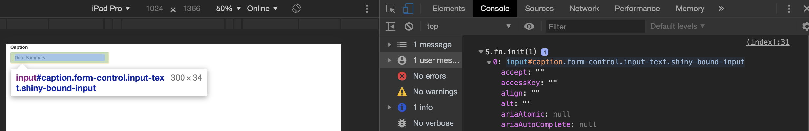

# Shiny: What's under the Hood? {#survival-kit-shiny}
In the 2 previous chapters, we quickly introduced HTML and JavaScript. In this chapter, we are going to see what Shiny has under the hood. Therefore, as mentionned in the book prerequisites, you should be quite familiar with Shiny if you want to get the most out of this chapter.

We will answer to the following questions:

- What web dependencies is Shiny based on?
- How is R/JavaScript communication achieved?
- How does Shiny deal with inputs? 

## Shiny, HTML, CSS and JavaScript
Shiny allows to develop web applications with R in minutes. Let's face it: this is quite mind blowing! Well, this won't probably be a production app but still a working prototype. Believe me, doing a web application with pure HTML/CSS and JavaScript is more difficult, especially for a non web developer background. 

Is Shiny less customizable than a classic web app? Not at all! Indeed, Shiny has its own engine to build HTML tags, through R, meaning that all HTML elements are available. You may also include any custom [JavaScript](https://shiny.rstudio.com/articles/packaging-javascript.html) or [CSS](https://mastering-shiny.org/advanced-ui.html) code. 

Do you remember about the first experiment of Chapter \@ref(survival-kit-html)? We only did 

```{r, eval=FALSE}
library(shiny)
p("Hello World")
```

and noticed that the `p` function generates HTML. We will study in chapter \@ref(htmltools-overview) the tools to build/modify/delete these tags. The main difference between HTML tags and Shiny tags is the absence of closing tag for Shiny. For instance, in raw HTML, we expect `<p>` to be closed by `</p>`. In Shiny, we only call `p(...)`, where `...` may be attributes like class/id or children tags.

## Discover Shiny dependencies
The simplest Shiny layout is the `fluidPage`. The `shinyapp` predefined Rstudio snippet will create a basic app skeleton (type shinyapp in RStudio IDE):

```{r, eval=FALSE}
ui <- fluidPage(
  p("Hello World")
)

server <- function(input, output, session) {}
shinyApp(ui, server)
```

At first glance, the page only contains text. Waiiit ... are you sure about this? Let's run the above example and open the HTML inspector introduced in \@ref(survival-kit-html). Results are displayed on Figure \@ref(fig:shiny-deps).

```{r shiny-deps, echo=FALSE, fig.cap='Shiny dependencies'}
knitr::include_graphics("images/survival-kit/shiny-deps.png")
```

We see in the head section that Shiny has 4 dependencies:

- json2
- jQuery 3.4.1
- shiny (custom JavaScript and CSS)
- Bootstrap 3.4.1 (JavaScript and CSS) + other files (html5shiv, respond)

[Bootstrap](https://getbootstrap.com) is here to provide plug and play design and interactions (tabs, navs). For instance the `fluidRow` and `column` functions of Shiny leverage the Bootstrap grid to control how elements are displayed in a page. This is convenient because it avoids to write a crazy amount of CSS/JavaScript and always reinvent the wheel. 

jQuery drives the DOM manipulations. Shiny has its own JS and CSS files. Finally, json2 is a library to handle the [JSON](https://www.json.org/json-en.html) data format (JavaScript Object Notation). In the following chapters we will use it a lot, through the [jsonlite](https://cran.r-project.org/web/packages/jsonlite/index.html) package that allows to transform JSON objects in R objects and inversely. 

In summary, all those libraries are necessary to make Shiny what it is! Customizing Shiny may imply to alter those existing libraries (except the Shiny core JavaScript and json2). In Chapter \@ref(htmltools-dependencies) we will discover better tools to extract HTML dependencies. Finally, in Chapter \@ref(insert-tabs), we will see a special case to insert dependencies during the app runtime.


## Websocket: R/JS bidirectional communication
How does R (server) and JavaScript (client) communicate? This is a builtin Shiny feature highlighted [here](Fast bidirectional communication between the web browser and R using the httpuv package.), leveraging the [httpuv](https://github.com/rstudio/httpuv) and [websocket](https://github.com/rstudio/websocket) packages. We will not detail how they work but rather how to inspect the websocket in a web browser. Let's run the following app.

```{r, eval=FALSE}
shinyApp(
  ui = fluidPage(
    selectInput("variable", "Variable:",
                c("Cylinders" = "cyl",
                  "Transmission" = "am",
                  "Gears" = "gear")),
    tableOutput("data")
  ),
  server = function(input, output) {
    output$data <- renderTable({
      mtcars[, c("mpg", input$variable), drop = FALSE]
    }, rownames = TRUE)
  }
)
```

After opening the HTML inspector, we select the network tab and search for websocket in the list. We also choose the message tab to inspect what R and JavaScript say to each others. On the JavaScript side, the websocket is created in the shinyapp.js [file](https://github.com/rstudio/shiny/blob/master/srcjs/shinyapp.js). The first element received from R is the first message in the list shown in Figure \@ref(fig:shiny-websocket). It is a JSON containing the method used as well as passed data. In the meantime, you may change the select input value.

```javascript
socket.send(JSON.stringify({
  method: 'init',
  data: self.$initialInput
}));
```

The second message received from R is after updating the select input.

```javascript
this.sendInput = function(values) {
  var msg = JSON.stringify({
    method: 'update',
    data: values
  });
// other things
};
```

All of this is quite complex but extremely useful to check wether input/output work properly. In case of error, we would see the field `error` containing some elements. In the last part of this book, we will be designing custom inputs and knowing how to debug them outside R is priceless.

Finally, `Shiny.shinyapp.$socket.readyState` returns the state of the socket connection. It should be 1 if your app is running but I've seen some cases where the socket was actually closed (and nothing could happen).


```{r shiny-websocket, echo=FALSE, fig.cap='Shiny websocket'}
knitr::include_graphics("images/survival-kit/shiny-websocket.png")
```

Understanding how R and JS may communicate will help in the next section about the Shiny input system. Note that the R option `options(shiny.trace = TRUE)` allows to display the websocket messages.


## The Shiny session object
We won't be able to go anywhere without giving some reminders about the Shiny [session](https://shiny.rstudio.com/reference/shiny/1.4.0/session.html) object. 
Why do we say object? `session` is actually an instance of the [`ShinySession`](https://github.com/rstudio/shiny/blob/master/R/shiny.R) R6 class. 
The initialization takes one parameter, namely the websocket. As shown in the last section, the websocket allows bidirectional exchanges between R and JS:

  - `sendCustomMessage` sends messages from R to JS. It calls the private `sendMessage` method, which itself calls `write`. The message is sent only when the session is opened, throught the websocket `private$websocket$send(json)`. If the `shiny.trace` [option](https://shiny.rstudio.com/reference/shiny/0.14/shiny-options.html) is TRUE, a message showing the sent JSON is displayed, useful for debugging.
  - `sendInputMessage` is used to update inputs from the server
  

```{r}
sendCustomMessage = function(type, message) {
  data <- list()
  data[[type]] <- message
  private$sendMessage(custom = data)
}

sendInputMessage = function(inputId, message) {
  data <- list(id = inputId, message = message)
  
  # Add to input message queue
  private$inputMessageQueue[[length(private$inputMessageQueue) + 1]] <- data
  # Needed so that Shiny knows to actually flush the input message queue
  self$requestFlush()
}


sendMessage = function(...) {
  # This function is a wrapper for $write
  msg <- list(...)
  if (anyUnnamed(msg)) {
    stop("All arguments to sendMessage must be named.")
  }
  private$write(toJSON(msg))
}


write = function(json) {
  if (self$closed){
    return()
  }
  traceOption <- getOption('shiny.trace', FALSE)
  if (isTRUE(traceOption) || traceOption == "send")
    message('SEND ',
            gsub('(?m)base64,[a-zA-Z0-9+/=]+','[base64 data]',json,perl=TRUE))
  private$websocket$send(json)
}
# ...


```

No worry if it is not clear at the moment. We will discuss those elements in the following sections.

## Shiny's input system
The goal of this part is to better understand how Shiny inputs work.

### Shiny JavaScript sources
The Shiny input system relies on the Shiny JavaScript sources. They are located in the srcjs folder shown in Figure \@ref(fig:shiny-js-sources).

```{r shiny-js-sources, echo=FALSE, fig.cap='Shiny JavaScript sources'}
knitr::include_graphics("images/survival-kit/shiny-js-sources.png")
```


Notice the `_start.js` and `_end.js`. These will be used by the `Gruntfile.js`, that is a [grunt-based](https://gruntjs.com) tool to run different tasks such as concatenate multiple JavaScript files, lint the code, minify it ... See [here](https://github.com/rstudio/shiny/tree/master/tools) for a summary.

```javascript
grunt.registerTask('default', [
'concat',
'string-replace',
'validateStringReplace',
'eslint',
'configureBabel',
'babel',
'uglify'
]);
```

These results in a large big [file](https://github.com/rstudio/shiny/blob/master/inst/www/shared/shiny.js) and its minified [version](https://github.com/rstudio/shiny/blob/master/inst/www/shared/shiny.min.js) in the `shiny/inst/www/shared` folder.


### The Shiny JavaScript object
The `Shiny` object is exported at the top of the `shiny.js` file [^export-js]. In other words, this means that we may use this object and any of its properties within the HTML inspector console tab, in any JavaScript file or shiny app as below.

```{r, eval=FALSE}
ui <- fluidPage(
  tags$script(
    "$(function() {
      console.log(Shiny);
    });
    "
  )
)
server <- function(input, output, session) {}
shinyApp(ui, server)
```

This object contains many properties and methods as shown in Figure \@ref(fig:shiny-object). We will discuss some of them later, like `Shiny.setInputValue`, `Shiny.addCustomMessageHandler`, `Shiny.shinyapps`, `Shiny.bindAll`, ...

```{r shiny-object, echo=FALSE, fig.cap='The Shiny JavaScript object'}
knitr::include_graphics("images/survival-kit/shiny-object.png")
```

[^export-js]: Refer to Chapter \@ref(survival-kit-javascript) if you don't remember how to export an object and make it available to all JS files.

### Initialization
When we run our app, most of the time it works and it is just fine! But what happens so that inputs and outputs are correctly handled? Upon initialization, Shiny runs several JavaScript functions. Not surprisingly, there is one called [`init_shiny`](https://github.com/rstudio/shiny/blob/master/srcjs/init_shiny.js) containing a subtantial amount of elements. We find utils functions like `bindOutputs`, `unbindOutputs` to respectively bind/unbind outputs, `bindInputs` and `unbindInputs` for inputs. Only `bindAll` and `unbindAll` are available to the user (see a usecase [here](https://stackoverflow.com/questions/51633326/dateinput-not-working-on-dt-in-shiny)). To illustrate what they do, let's run the app below.

```{r, eval=FALSE}
ui <- fluidPage(
  sliderInput("obs", "Number of observations:",
              min = 0, max = 1000, value = 500
  ),
  plotOutput("distPlot")
)

server <- function(input, output, session) {
  output$distPlot <- renderPlot({
    hist(rnorm(input$obs))
  })
}
shinyApp(ui, server)
```

We then open the HTML inspector and run `Shiny.unbindAll(document)` (document is the scope, that is where to search). Try to change the slider input. What do you observe? Now let's type `Shiny.bindAll(document)` and update the slider value. What happens? Magic isn't it? This simply shows that when inputs are not bound, nothing happens so binding inputs is necessary. 

Let's see below what is an input binding and how it works.

### Input bindings

#### Reminders about Shiny inputs
Shiny contains a lot of inputs like `sliderInput`, `checkboxInput`, `radioButtons`, `numericInput`, ...Their role is to provide a way for the user to change parameters and update the app state. 

```{r, eval=FALSE}
numericInput("obs", "Observations:", 10, min = 1, max = 100)
```

All input functions have the same common `inputId` parameter, to guarantee the uniqueness of the given input. 

```{r, eval=FALSE}
ui <- fluidPage(
  textInput("text", "My Text 1"),
  hr(),
  uiOutput("mytext")
)

server <- function(input, output, session) {
  output$mytext <- renderText(input$text)
}

shinyApp(ui, server)
```

Now the questions is: how does Shiny recognizes inputs and drives their behavior?

#### Binding Shiny inputs
An input binding allows Shiny to identify each instance of a given input and what you may do with this input. For instance, a slider input must update whenever the range is dragged or when the left and right arrows of the keyboard are pressed. It relies on a class defined in the `input_binding.js` [file](https://github.com/rstudio/shiny/blob/master/srcjs/input_binding.js). 

Let's describe each method chronologically.

##### Find the input
The first step, is critical and consists in locating the input in the DOM. We could compare this to the receptor/ligand reaction. 
On the R side, we define an input, with a specific attribute that will serve as a receptor for the binding. For most of inputs, the `type` attribute will suit. Sometimes it may also be the class, like for the `actionButton`. On the JS side, we need a method that will indentify this receptor. Moreover, two different types of inputs (for instance `radioButton` and `selectInput`) cannot have the same receptor for conflict reasons, whereas two instances of the same input type can (if your app contains 10 sliders, they all share the same input binding!). The receptor identifier is provided by the `find` method of the `InputBinding` class. This method must be applied on a scope, that is the `document`.  `find` accepts any valid jQuery selector. Figure \@ref(fig:shiny-find-inputs) summarizes this important step.


```{r shiny-find-inputs, echo=FALSE, fig.cap='How to find inputs?'}
knitr::include_graphics("images/survival-kit/shiny-find-inputs.png")
```

Below, we are going to create a new binding for the `textInput`, with only 2 methods mentionned in the previous section, that is `find` and `getValue`. For that, we need to create a customized textInput, `customTextInput` so that it is not recognized by the classic Shiny text input binding. We add the input-text class and make our own input binding pointing to that specific class.

```{r}
customTextInput <- function (inputId, label, value = "", width = NULL, placeholder = NULL) {
  value <- restoreInput(id = inputId, default = value)
  div(
    class = "form-group shiny-input-container", 
    style = if (!is.null(width)) {
      paste0("width: ", validateCssUnit(width), ";")
    },
    shiny:::shinyInputLabel(inputId, label), 
    tags$input(
      id = inputId, 
      type = "text", 
      class = "form-control input-text", 
      value = value,
      placeholder = placeholder
    )
  )
}
```

We put everything in a Shiny app and invit the reader to open the HTML inspector and look at the `console.log` result.

```{r, eval=FALSE}
ui <- fluidPage(
  tags$script(
    "$(function() {
      // Input binding
      let customTextBinding = new Shiny.InputBinding();

      $.extend(customTextBinding, {
        find: function(scope) {
          console.log($(scope).find('.input-text'));
          return $(scope).find('.input-text');
        }
      });
      
      Shiny.inputBindings.register(customTextBinding, 'text');
    });
    "
  ),
  customTextInput("caption", "Caption", "Data Summary"),
  uiOutput("customText")
)

server <- function(input, output, session) {
  output$customText <- renderText(input$caption)
}
shinyApp(ui, server)
```

##### Initialize inputs
Upon initialization, Shiny calls the `initializeInputs` function that takes all input bindings and call their `initialize` method before binding all inputs. Note that once an input has been initialized it has a `_shiny_initialized` tag to avoid initializing it twice. The initialize method is not always defined but some API like [Framework7](https://framework7.io), on top of which [shinyMobile](https://github.com/RinteRface/shinyMobile) is built, require to have it. Below is an example for the toggle input:

```javascript
// what is expected
let toggle = app.toggle.create({
  el: '.toggle',
  on: {
    change: function () {
      console.log('Toggle changed')
    }
  }
});
```

`app.toggle.create` is internal to the API. The corresponding shinyMobile input binding starts as follows. 

```javascript
var f7ToggleBinding = new Shiny.InputBinding();
  $.extend(f7ToggleBinding, {
    initialize: function(el) {
      app.toggle.create({el: el});
    },
    // other methods
});
```

Once initialized, we may use all specific methods provided by the API. [Framework7](https://framework7.io) is clearly a gold mine, as its API provides a lot of possible options for many inputs/widgets.

##### Get the value
`getValue(el)` returns the input value. The way to obtain the value is different for almost all inputs. For instance, the `textInput` is pretty simple since the value is located in the `value` attribute. `el` refers to the element holding the id attribute and recognized by the `find` method. Figure \@ref(fig:shiny-el) shows the result of a `console.log($(el));`.

```{r shiny-el, echo=FALSE, fig.cap='About el'}

```

To get the value, we apply the jQuery method `val` on the `$(el)` element and return the result.

```{r, eval=FALSE}
ui <- fluidPage(
  tags$script(
    "$(function() {
      // Input binding
      let customTextBinding = new Shiny.InputBinding();

      $.extend(customTextBinding, {
        find: function(scope) {
          return $(scope).find('.input-text');
        },
        // Given the DOM element for the input, return the value
        getValue: function(el) {
          console.log($(el));
          return $(el).val();
        }
      });
      
      Shiny.inputBindings.register(customTextBinding, 'text');
    });
    "
  ),
  customTextInput("caption", "Caption", "Data Summary"),
  uiOutput("customText")
)

server <- function(input, output, session) {
  output$customText <- renderText(input$caption)
}
shinyApp(ui, server)
```

This time, the input value is returned. Notice that when you try to change the text content, the output value does not update as we would normally expect. We are actually missing a couple of methods so that the binding is fully working. 

##### Set and update 
`setValue(el, value)` is used to set the value of the current input. This method is necessary so that the input value can be updated. It has to be used in combination with `receiveMessage(el, data)`, which is the JavaScript part of all the R `updateInput` functions. We usually call the `setValue` method inside.

Let's create a function to update our custom text input. Call it `updateCustomTextInput`. It requires at least 3 parameters:

- inputId tells which input to update.
- value is the new value. This will be taken by the `setValue ` JS method in the input binding
- session is the Shiny session object mentionned earlier. We will use the `sendInputMessage` to send values from R to JavaScript. The `receiveMessage` method will apply `setValue` with the data received from R

```{r}
updateCustomTextInput <- function(inputId, value = NULL, session = getDefaultReactiveDomain()) {
  session$sendInputMessage(inputId, message = value)
}
```

We add `setValue` and `receiveMessage` to custom input binding:

```{r, eval=FALSE}
ui <- fluidPage(
  tags$script(
    "$(function() {
      // Input binding
      let customTextBinding = new Shiny.InputBinding();

      $.extend(customTextBinding, {
        find: function(scope) {
          return $(scope).find('.input-text');
        },
        // Given the DOM element for the input, return the value
        getValue: function(el) {
          return $(el).val();
        },
        setValue: function(el, value) {
          $(el).val(value);
        },
        receiveMessage: function(el, data) {
          console.log(data);
          this.setValue(el, data);
        }
      });
      
      Shiny.inputBindings.register(customTextBinding, 'text');
    });
    "
  ),
  customTextInput("caption", "Caption", "Data Summary"),
  actionButton("update", "Update text!", class = "btn-success"),
  uiOutput("customText")
)

server <- function(input, output, session) {
  output$customText <- renderText(input$caption)
  observeEvent(input$update, {
    updateCustomTextInput("caption", value = "new text")
  })
}
shinyApp(ui, server)
```

Figure \@ref(fig:shiny-update-inputs) illustrates the main mechanisms.

```{r shiny-update-inputs, echo=FALSE, fig.cap='What happens after clickin on the update button?'}
knitr::include_graphics("images/survival-kit/shiny-update-inputs.png")
```


If we have to pass multiple elements to update, we would have to change the `updateCustomTextInput` function such as:

```{r}
updateCustomTextInput <- function(inputId, value = NULL, placeholder = NULL, session = getDefaultReactiveDomain()) {
  message <- shiny:::dropNulls(
    list(
      value = value,
      placeholder = placeholder
    )
  )
  session$sendInputMessage(inputId, message)
}
```

`dropNulls` is an internal function ensuring that the list does not contain NULL elements. On the JS side, we would have to update the `receiveMessage` method. We send a list from R, which is then serialized to a JSON object. Properties like `value` may be accessed using the . notation:

```javascript
receiveMessage: function(el, data) {
console.log(data);
if (data.hasOwnProperty('value')) {
this.setValue(el, data.value);
}

// other parameters to update...
}
```

So far so good! We managed to update the text input value. Yet, the output value does not change. We are going to fix this missing step in the next section.

##### Subscribe
`subscribe(el, callback)` listens to events telling under which circumstances to tell Shiny to update the input value and make it available in the app. Some API like Bootstrap explicitly mention those events (like `hide.bs.tab`, `shown.bs.tab`, ...).
Going back to our custom text input, what event would make it change?

- After a key is release on the keyboard. We may listen to `keyup`
- After copying and pasting any text in the input field or dictating text. The `input` event may be helpful

We may add those [events](https://javascript.info/events-change-input) to our binding using an event listener seen at the end of Chapter \@ref(survival-kit-javascript).

```javascript
$(el).on('keyup.customTextBinding input.customTextBinding', function(event) {
callback(true);
});
```

`callback` ensures that the new value is captured by Shiny. We will come back later on the callback parameter.


```{r, eval=FALSE}
ui <- fluidPage(
  tags$script(
    "$(function() {
      // Input binding
      let customTextBinding = new Shiny.InputBinding();

      $.extend(customTextBinding, {
        find: function(scope) {
          return $(scope).find('.input-text');
        },
        // Given the DOM element for the input, return the value
        getValue: function(el) {
          return $(el).val();
        },
        setValue: function(el, value) {
          $(el).val(value);
        },
        receiveMessage: function(el, data) {
          if (data.hasOwnProperty('value')) {
            this.setValue(el, data.value);
            $(el).trigger('change');
          }
        },
        subscribe: function(el, callback) {
          $(el).on('keyup.customTextBinding input.customTextBinding', function(event) {
            console.log(event);
            callback();
          });
        }
      });
      
      Shiny.inputBindings.register(customTextBinding, 'text');
    });
    "
  ),
  customTextInput("caption", "Caption", "Data Summary"),
  actionButton("update", "Update text!", class = "btn-success"),
  uiOutput("customText")
)

server <- function(input, output, session) {
  output$customText <- renderText(input$caption)
  observeEvent(input$update, {
    updateCustomTextInput("caption", value = "new text")
  })
}
shinyApp(ui, server)
```

Hurray! The output result is successfuly changed when the input value is manually changed. But nothing happens when we click on the update button. What did we miss? Looking back at the `receiveMessage` method, we change the input value but how does Shiny knows that this step was successful? To check that no event is raised, we put a `console.log(event);` in the `subscribe` method. Any action like removing the text content or adding new text triggers event but clicking on the action button does not. Therefore, we must trigger an event and add it to the `subscribe` method. We may choose the `change` event, that triggers when an element has finished changing.

```javascript
$(el).on('change.customTextBinding', function(event) {
callback(false);
});
```

Let's try again.

```{r, eval=FALSE}
ui <- fluidPage(
  tags$script(
    "$(function() {
      // Input binding
      let customTextBinding = new Shiny.InputBinding();

      $.extend(customTextBinding, {
        find: function(scope) {
          return $(scope).find('.input-text');
        },
        // Given the DOM element for the input, return the value
        getValue: function(el) {
          return $(el).val();
        },
        setValue: function(el, value) {
          $(el).val(value);
        },
        receiveMessage: function(el, data) {
          if (data.hasOwnProperty('value')) {
            this.setValue(el, data.value);
            $(el).trigger('change');
          }
        },
        subscribe: function(el, callback) {
          $(el).on('keyup.customTextBinding input.textInputBinding', function(event) {
            callback();
          });

          $(el).on('change.customTextBinding', function(event) {
            callback(false);
          });
        }
      });
      
      Shiny.inputBindings.register(customTextBinding, 'text');
    });
    "
  ),
  customTextInput("caption", "Caption", "Data Summary"),
  actionButton("update", "Update text!", class = "btn-success"),
  uiOutput("customText")
)

server <- function(input, output, session) {
  output$customText <- renderText(input$caption)
  observeEvent(input$update, {
    updateCustomTextInput("caption", value = "new text")
  })
}
shinyApp(ui, server)
```

Perfect? Not exactly. Wouldn't is be better to only change the input value once the keyboard is completly released for some time (and not each time a key is released). This is what we call debouncing. This implies to set a delay before telling Shiny to get the new value and the `getRatePolicy` method is exactly what we need. Additionally, we must also pass true to the `callback` in the subscribe method, in order to apply our specific rate policy ([debounce](https://davidwalsh.name/javascript-debounce-function), throttle). This is useful for instance when we don't want to flood the server with useless update requests. For a slider, we only want to send the value as soon as the range stops moving and not all intermediate values. Those elements are defined [here](https://github.com/rstudio/shiny/blob/master/srcjs/input_rate.js).


Run the app below and try to manually change the text input value by adding a couple of letters as fast as you can. What do you notice? We see that output value only updates when we release the keyboard.

```{r, eval=FALSE}
ui <- fluidPage(
  tags$script(
    "$(function() {
      // Input binding
      let customTextBinding = new Shiny.InputBinding();

      $.extend(customTextBinding, {
        find: function(scope) {
          return $(scope).find('.input-text');
        },
        // Given the DOM element for the input, return the value
        getValue: function(el) {
          return $(el).val();
        },
        setValue: function(el, value) {
          $(el).val(value);
        },
        receiveMessage: function(el, data) {
          if (data.hasOwnProperty('value')) {
            this.setValue(el, data.value);
            $(el).trigger('change');
          }
        },
        subscribe: function(el, callback) {
          $(el).on('keyup.customTextBinding input.textInputBinding', function(event) {
            callback(true);
          });

          $(el).on('change.customTextBinding', function(event) {
            callback();
          });
        },
        getRatePolicy: function() {
          return {
            policy: 'debounce',
            delay: 250
          };
        },
        unsubscribe: function(el) {
          $(el).off('.customTextBinding');
        }
      });
      
      Shiny.inputBindings.register(customTextBinding, 'text');
    });
    "
  ),
  customTextInput("caption", "Caption", "Data Summary"),
  actionButton("update", "Update text!", class = "btn-success"),
  uiOutput("customText")
)

server <- function(input, output, session) {
  output$customText <- renderText(input$caption)
  observeEvent(input$update, {
    updateCustomTextInput("caption", value = "new text")
  })
}
shinyApp(ui, server)
```

You may adjust the delay according to your needs, but a too high delay would not feel very natural.

##### Register an input binding
At the end of the input binding definition, we register it for Shiny.

```javascript
let myBinding = new Shiny.inputBinding();
$.extend(myBinding, {
// methods go here
});

Shiny.inputBindings.register(myBinding, 'reference');
```

Although the Shiny [documentation](https://shiny.rstudio.com/articles/building-inputs.html) mentions a `Shiny.inputBindings.setPriority` method to handle conflicting bindings, it is better not to have to use it.

#### Binding other elements
The Shiny input binding system is too convenient to only use it for input elements. In shinydashboard, you may know the `box` function. Boxes are containers with a title, body and footer as well as optional elements. Interestingly we may collapse/uncollapse the box. It would be nice to capture the state of the box in an input, so as to trigger other actions as soon as this input changes. Since an input value is unique, we must add an inputId parameter to the box function:

```{r}
"%OR%" <- function(a, b) if (!is.null(a)) a else b

box2 <- function (..., inputId = NULL, title = NULL, footer = NULL, status = NULL, solidHeader = FALSE, 
                 background = NULL, width = 6, height = NULL, collapsible = FALSE, 
                 collapsed = FALSE) 
{
  boxClass <- "box"
  if (solidHeader || !is.null(background)) {
    boxClass <- paste(boxClass, "box-solid")
  }
  if (!is.null(status)) {
    boxClass <- paste0(boxClass, " box-", status)
  }
  if (collapsible && collapsed) {
    boxClass <- paste(boxClass, "collapsed-box")
  }
  if (!is.null(background)) {
    boxClass <- paste0(boxClass, " bg-", background)
  }
  style <- NULL
  if (!is.null(height)) {
    style <- paste0("height: ", validateCssUnit(height))
  }
  titleTag <- NULL
  if (!is.null(title)) {
    titleTag <- h3(class = "box-title", title)
  }
  collapseTag <- NULL
  if (collapsible) {
    buttonStatus <- status %OR% "default"
    collapseIcon <- if (collapsed) 
      "plus"
    else "minus"
    collapseTag <- div(class = "box-tools pull-right", tags$button(class = paste0("btn btn-box-tool"), 
                                                                   `data-widget` = "collapse", shiny::icon(collapseIcon)))
  }
  headerTag <- NULL
  if (!is.null(titleTag) || !is.null(collapseTag)) {
    headerTag <- div(class = "box-header", titleTag, collapseTag)
  }
  
  div(
    class = if (!is.null(width)) paste0("col-sm-", width), 
    div(
      id = inputId, 
      class = boxClass, 
      style = if (!is.null(style)) 
        style, 
      headerTag, 
      div(class = "box-body", ...),
      if (!is.null(footer)) div(class = "box-footer", footer)
    )
  )
}
```

Besides, we create the `updateBox` function, which will collapse the box:

```{r}
updateBox <- function(inputId, session = getDefaultReactiveDomain()) {
  session$sendInputMessage(inputId, message = NULL)
}
```

When collapsed, a box gets the `collapsed-box` class. This will be useful for the input binding. As mentionned above, it is also necessary to know when to tell Shiny to update the value with the `subscribe` method. Most of the time, the change event might suit but as shinydashboard is built on top of [AdminLTE2](https://adminlte.io/docs/2.4/js-box-widget), it has an API to control box behaviour. We identify 2 events corresponding to the collapsible action: 
  
  - expanded.boxwidget (Triggered after the box is expanded)
  - collapsed.boxwidget (Triggered after the box is collapsed)
  
Those events are unfortunately not possible to use since the AdminLTE code forget to trigger them in the main JS [code](https://github.com/rstudio/shinydashboard/blob/master/srcjs/AdminLTE/app.js) (see the collapse method line 577-612). There are other solutions, as shown below with the `click` event. 
  
There is also a plug and play `toggleBox` method. To unleash the power of our box, we need to activate it with `$('#<box_id>').activateBox();` before the binding step. If you remember, the `initialize` method is exactly doing this:

```javascript
let boxBinding = new Shiny.InputBinding();
$.extend(boxBinding, {
  initialize: function(el) {
    $(el).activateBox(); // box activation
  },
  find: function(scope) {
    return $(scope).find('.box');
  },
  getValue: function(el) {
    let isCollapsed = $(el).hasClass('collapsed-box')
    return {collapsed: isCollapsed}; // this will be a list in R
  },
  setValue: function(el, value) {
    $(el).toggleBox();
  }, 
  receiveMessage: function(el, data) {
    this.setValue(el, data);
    $(el).trigger('change');
  },
  subscribe: function(el, callback) {
    $(el).on('click', '[data-widget="collapse"]', function(event) {
      setTimeout(function() {
        callback();
      }, 550);
    }); 
    
    $(el).on('change', function(event) {
      setTimeout(function() {
        callback();
      }, 550);
    });
  },
  unsubscribe: function(el) {
    $(el).off('.boxBinding');
  }
});

Shiny.inputBindings.register(boxBinding, 'box-input');
```

Some comments about the binding:

  - `getValue` returns an object which will give a list in R. This is in case we add other elements like the remove action available in AdminLTE
  - `setValue` calls the plug and play `toggleBox` method
  - `receiveMessage` must trigger a change event so that Shiny knows when the value needs to be updated
  - `subscribe` listens to the `click` event on the `[data-widget="collapse"]` element and delays the `callback` call by a value which is slightly higher than the default AdminLTE2 animation to collapse the box (500mx). If you omit this part, the input will not have time to properly update!!!
  - We don't need extra listener for the `updateBox` function since it also triggers a click on the collapse button, thereby forwarding to the corresponding listener

Let's try our new toy in a simple dashboard:

```{r, eval=FALSE}
shinyApp(
  ui = dashboardPage(
    dashboardHeader(),
    dashboardSidebar(),
    dashboardBody(
      tags$script(
        "$(function() {
          let boxBinding = new Shiny.InputBinding();
          $.extend(boxBinding, {
            initialize: function(el) {
              $(el).activateBox();
            },
            find: function(scope) {
              return $(scope).find('.box');
            },
            getValue: function(el) {
              let isCollapsed = $(el).hasClass('collapsed-box');
              return {collapsed: isCollapsed}; // this will be a list in R
            },
            setValue: function(el, value) {
              $(el).toggleBox();
            }, 
            receiveMessage: function(el, data) {
              this.setValue(el, data);
              $(el).trigger('change');
            },
            subscribe: function(el, callback) {
              $(el).on('click', '[data-widget=\"collapse\"]', function(event) {
                setTimeout(function() {
                  callback();
                }, 550);
              }); 
              $(el).on('change', function(event) {
                setTimeout(function() {
                  callback();
                }, 550);
              });
            },
            unsubscribe: function(el) {
              $(el).off('.boxBinding');
            }
          });
          
          Shiny.inputBindings.register(boxBinding, 'box-input');
        });
        "
      ),
      
      box2(
        title = textOutput("box_state"),
        "Box body",
        inputId = "mybox",
        collapsible = TRUE,
        plotOutput("plot")
      ),
      actionButton("toggle_box", "Toggle Box")
    ),
    title = "Dashboard example"
  ),
  server = function(input, output) {
    
    output$plot <- renderPlot({
      req(!input$mybox$collapsed)
      plot(rnorm(200))
    })
    
    output$box_state <- renderText({
      state <- if (input$mybox$collapsed) "collapsed" else "uncollapsed"
      paste("My box is", state)
    })
    
    observeEvent(input$toggle_box, {
      updateBox("mybox")
    })
    
  }
)
```

### Utilities to quickly define new inputs
If you ever wondered where the `Shiny.onInputChange` or `Shiny.setInputValue` comes from (see  [article](https://shiny.rstudio.com/articles/communicating-with-js.html)), it is actually defined in the `initShiny` function. 

```javascript
exports.setInputValue = exports.onInputChange = function(name, value, opts) {
opts = addDefaultInputOpts(opts);
inputs.setInput(name, value, opts);
};
```

Briefly, this function avoids to create an input binding. It is faster to code but there is a price to pay: you lose the possibility to easily update the new input. Indeed, all input functions like `sliderInput` have their own update function like `updateSliderInput`, because of the custom input binding system (We will see it very soon)!


### Miscellaneous
We present here some tools that may be useful...TO FINISH

#### Get access to initial values 
Something we may notice when exploring the `initShiny` function is the existence of a `Shiny.shinyapp` object, defined as follows:

```javascript
var shinyapp = exports.shinyapp = new ShinyApp();
```


Let's explore what `shinyApp` contains. The definition is located in the shinyapps.js [script](https://github.com/rstudio/shiny/blob/master/srcjs/shinyapp.js). 

```javascript
var ShinyApp = function() {
this.$socket = null;

// Cached input values
this.$inputValues = {};

// Input values at initialization (and reconnect)
this.$initialInput = {};

// Output bindings
this.$bindings = {};

// Cached values/errors
this.$values = {};
this.$errors = {};

// Conditional bindings (show/hide element based on expression)
this.$conditionals = {};

this.$pendingMessages = [];
this.$activeRequests = {};
this.$nextRequestId = 0;

this.$allowReconnect = false;
};
```

It creates several properties, some of them are easy to guess like `inputValues` or `initialInput`. Let's run the example below and open the HTML inspector. Notice that the `sliderInput` is set to 500 at `t0` (initialization).

```{r, eval=FALSE}
ui <- fluidPage(
  sliderInput("obs", "Number of observations:",
              min = 0, max = 1000, value = 500
  ),
  plotOutput("distPlot")
)

server <- function(input, output, session) {
  output$distPlot <- renderPlot({
    hist(rnorm(input$obs))
  })
}
shinyApp(ui, server)
```


Figure \@ref(fig:shiny-initial-inputs) shows how to access Shiny's initial input value with `Shiny.shinyapp.$initialInput.obs`. After changing the slider position, its value is given by `Shiny.shinyapp.$inputValues.obs`. `$initialInput` and `$inputValues` contains way more elements but we are only interested by the slider in this example.

```{r shiny-initial-inputs, echo=FALSE, fig.cap='Explore initial input values'}
knitr::include_graphics("images/survival-kit/shiny-init-input.png")
```

I acknowledge, the practical interest might be limited but still good to know for debugging purposes. 


## Custom handlers: from R to JavaScript
Shiny contains tools to ease the communication between R and JavaScript. This is what happens in the last part. If you remember, we were playing with a `selectInput` and a `datatable`. How does R send messages to JavaScript?

We already discussed the usage of `sendInputMessage()` in the input binding section. The other important method is `sendCustomMessage(type, message)`. It works by pair with the JS method `Shiny.AddCustomMessageHandler`, linked with the type parameter.

```{r, eval=FALSE}
sayHelloToJS <- function(text, session = getDefaultReactiveDomain()) {
  session$sendCustomMessage(type = 'say-hello', message = text)
}
```

The JavaScript receptor is defined below:

```javascript
$(function() {
  Shiny.AddCustomMessageHandler('say-hello', function(message) {
    alert(`R says ${message} to you!`)
  });
});
```

The shiny app below will simply print a welcome message. We obviously set `options(shiny.trace = TRUE)`.

```{r, eval=FALSE}
options(shiny.trace = TRUE)
ui <- fluidPage(
  tags$head(
    tags$script(
      "$(function() {
        Shiny.addCustomMessageHandler('say-hello', function(message) {
          alert(`R says ${message} to you!`);
        });
      });
      "
    )
  )
)

server <- function(input, output, session) {
  observe({
    invalidateLater(5000)
    sayHelloToJS("hello")
  })
}

shinyApp(ui, server)
```

You will find a whole chapter dedicated to custom handlers here \@ref(custom-templates-interactivity).

TO DO: picture showing the communication