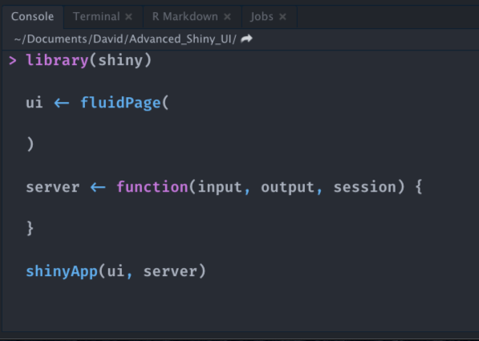

# Discover Shiny dependencies {#web-dependencies}

## Introduction
If Shiny creates HTML code for us, it is not enough to design a beautiful working app with user interactions. As shown earlier, all modern websites and apps have a lot of __CSS__ and __JavaScript__ under the hood. Let's explore these elements in the following exercise.

The simplest Shiny layout is the `fluidPage()`. The `shinyapp` predefined RStudio snippet creates a basic app skeleton (type `shinyapp` in a new script or the console in your RStudio IDE, Figure \@ref(fig:shinyapp-snippet)).

```{r shinyapp-snippet, echo=FALSE, fig.cap='shinyapp code snippet.', out.width='50%', fig.align='center'}

```
We add some text inside and remove the `session` parameter from the server function, as
we don't need it:

```{r, eval=FALSE}
library(shiny)
ui <- fluidPage(
  p("Hello World")
)

server <- function(input, output) {}
shinyApp(ui, server)
```

At first glance, the page only contains text. Wait ... are you sure about this? Let's run the above example and open the HTML inspector introduced in section \@ref(web-intro-html). Results are displayed in Figure \@ref(fig:shiny-deps).

```{r shiny-deps, echo=FALSE, fig.cap='Shiny dependencies (with {Shiny} 1.6.0).', out.width='100%'}
knitr::include_graphics("images/survival-kit/shiny-deps.png")
```

  1. Click on "Open in Browser".
  2. Open the HTML inspector.
  3. Locate the `<head>` tag.
  4. Uncollapse it and search for the script containing   `application/html-dependencies`.
  5. List all dependencies.

According to the head section (delimited by `<head></head>`), Shiny has three main dependencies:

  - __jQuery__.
  - shiny (custom JavaScript and CSS).
  - __Bootstrap__ (JavaScript and CSS).

::: {.warningblock data-latex=""}
As of `{shiny}` 1.6.0, `json2` is not needed anymore and does not appear in the above list.
:::

## Bootstrap
According to the [gitstar](https://gitstar-ranking.com/) ranking, which is an unofficial GitHub star ranking website, [Bootstrap](https://getbootstrap.com) comes in at seventh place (144563 stars) and twenty-second place for repositories and organization, respectively. First released in 2011, it welcomed the current and fifth [version](https://v5.getbootstrap.com/) in May 2021, at the time of writing. It provides plug and play layout and interactive elements, such as tabs, navigation bars, tooltips, popovers and many input (forms), which is rather convenient since it avoids writing a large amount of CSS/JavaScript that would bring more complexity. The first release of Shiny was shipped with [Bootstrap 2](https://github.com/rstudio/shinybootstrap2). Shiny relied a long time on __Bootstrap 3__ (since v0.11), while many efforts are being made to provide a __Bootstrap 4__ compatibility and further, essentially through the [bslib](https://github.com/rstudio/bootstraplib) R package.

One of the great advantage of using Bootstrap is the __responsiveness__ of the design that can work either on desktop or mobile, even though advanced users likely prefer other specialized libraries like [Framework7](https://framework7.io/) or [onsenUI](https://onsen.io/) to develop native-looking apps, as shown in Chapter \@ref(mobile-shiny-intro).

Bootstrap 3 relies on the grid layout [system](https://getbootstrap.com/docs/3.4/examples/grid/), which allows to efficiently organize the content in rows and columns. For instance the `fluidRow()` and `column()` Shiny functions leverage the Bootstrap grid to control how elements are displayed on a page.

How does Shiny attach the Bootstrap dependencies? The well-known `fluidPage()` layout is actually hiding a lower-level function, that is, `bootstrapPage()`. The latter is also called in many other high-level layout functions, for instance `fixedPage()`, `fillPage()` and `navbarPage()`. It simply attaches `bootstraplib`, as well as any Bootstrap-compatible theme css files that one can pass with the `{shinythemes}` [package](https://github.com/rstudio/shinythemes).

::: {.warningblock data-latex=""}
As of `{shiny}` `1.6.0`, end user should use the new theming tools, that is `{bslib}`, described in Chapter \@ref(beautify-with-bootstraplib).
:::

The interested reader should have a look at the following [code](https://github.com/rstudio/shiny/blob/60db1e02b03d8e6fb146c9bb1bbfbce269231add/R/bootstrap-layout.R), inside which are defined all the Shiny Bootstrap-based layout elements, such as the well-known `fluidPage()` wrapper.

## jQuery, DOM manipulation
[jQuery](https://jquery.com/) allows JavaScript developers to perform __DOM__ manipulation, that is, interacting with HMTL elements, in a more user-friendly manner than with pure JavaScript. At that step, you might not be familiar with __JavaScript__ nor __jQuery__. Don't worry! Chapter \@ref(survival-kit-javascript) exposes the basics. Below is a comparison on how you would select a button HTML element with both technologies. We are sure you'll notice how jQuery[^jQuery] is more intuitive than JavaScript.

Javascript:

```{r, echo=FALSE, results='asis'}
js_code <- "// select the button
var btn = document.getElementById('mybutton');
// event
btn.addEventListener('click', function() {
  alert('You clicked me!'); // action
});"
code_chunk_custom(js_code, "js")
```

jQuery:

```{r, echo=FALSE, results='asis'}
js_code <- "$('#mybutton').on('click', function() {
  alert('You clicked me!');
});"
code_chunk_custom(js_code, "js")
```

[^jQuery]: The next iteration of Bootstrap, namely [Bootstrap 5](https://blog.getbootstrap.com/2020/06/16/bootstrap-5-alpha/) completely abandons jQuery for vanilla JavaScript. The main reason is to lighten the Bootstrap code.

Interestingly, `{jquerylib}` provides [support](https://github.com/rstudio/jquerylib) for `{shiny}` by shipping the necessary content. Nowadays, many websites and frameworks (like Bootstrap 5) tend to avoid jQuery so as to gain in performance. Yet, most of Shiny's JS code still uses it and won't be removed any-time soon.

## Custom dependencies
The last dependency contains custom JS and CSS code necessary for Shiny to work, that is:

  - Fine-tune the layout.
  - Register input/output and handle every single input/output action. Detailed mechanisms are
  studied in Chapters \@ref(shiny-input-system) and \@ref(shiny-input-lifecycle).
  - Initialize and control the R/JS communication, as shown in Chapter \@ref(from-R-to-JS).
  - Handle alerts/modals/notifications.
  - ...

Chapters \@ref(shiny-js-object), \@ref(shiny-input-system), \@ref(shiny-custom-handler) and \@ref(custom-templates-interactivity) showcase the most important elements of those custom files.

## Exercise
In the following exercise, we consider a slightly more complex app with a slider as well as a plot output.

  1. Run the app `runExample("01_hello")`.
  2. Open the HTML inspector.
  3. Delete the `bootstrap.min.css` and `ion.rangeSlider.css` dependencies by removing the corresponding DOM element.
  4. What happened to the application's UI?


To sum up, all of these libraries are necessary to make Shiny what it is! Importantly, Shiny only loads what is necessary to have. For instance, as shown above, it is only necessary to include the slider dependencies when there is at least one slider in the app, which eventually improves app performances.

In Chapter \@ref(htmltools-dependencies), we explore tools to manage HTML dependencies. In Chapters \@ref(insert-tabs) and \@ref(shiny-custom-handler), we study a special case to insert dependencies at runtime.
