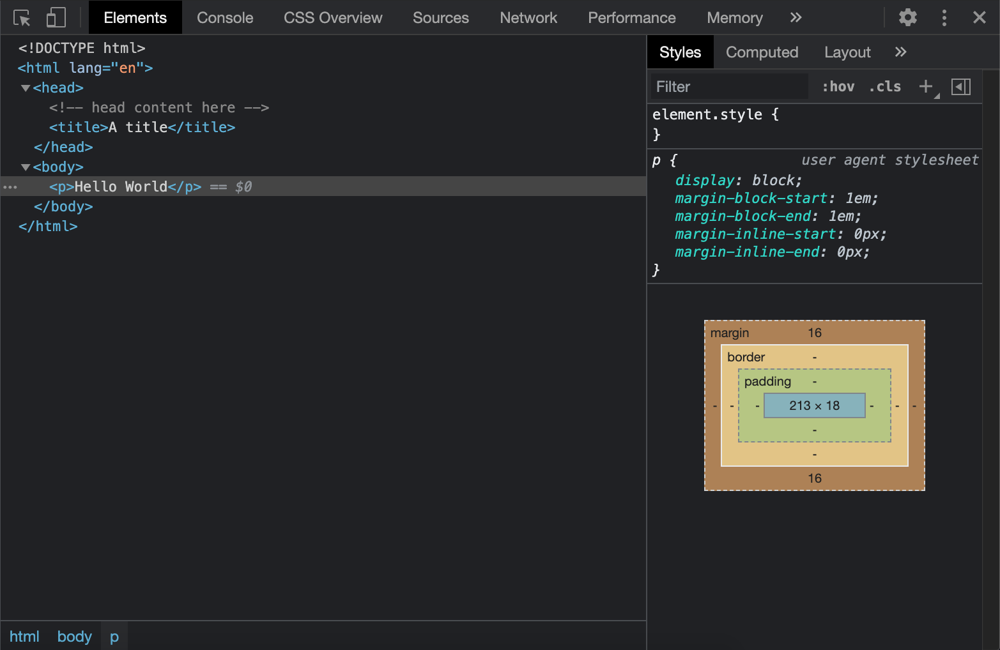
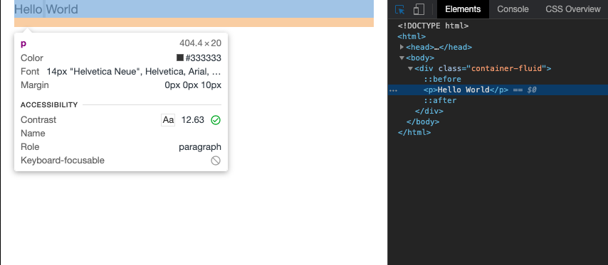
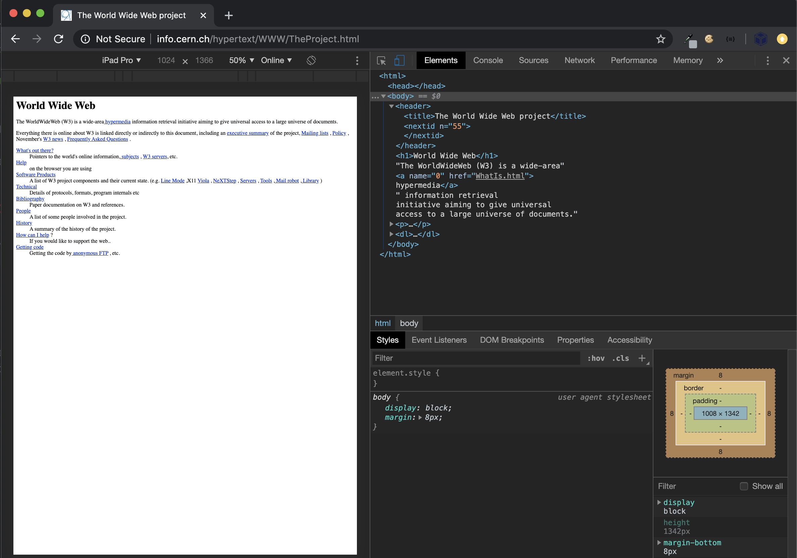

\mainmatter

# Shiny and the Web {#web-intro}

> Shiny is designed so that, as an R user, you don’t need to learn about the details of HTML ...
`r tufte::quote_footer('--- Hadley Wickham')`

`{shiny}` [@R-shiny] allows the development of __web applications__ with R in minutes. Let's face it: this is quite mind blowing! While this may not be a production ready app, it will still be a fully functional, working prototype. Believe me, doing a web application with pure __HTML__, __CSS__ and __JavaScript__ is more difficult, especially for someone with a non-web developer background.

We first load `{shiny}`:

```{r}
library(shiny)
```

## Shiny generates HTML code from R
Let's start with a little exercise:

1. Copy and paste this code to the R console and click enter. 

```{r, eval=FALSE}
p("Hello World")
```

2. What do you observe?

Notice the output format is an example of an HTML tag, generated by the `p` function. The main difference between HTML __tags__ and Shiny tags is the absence of closing tag for Shiny. For instance, in raw HTML, we expect `<p>` to be closed by `</p>`. In Shiny, we only call `p(...)`, where `...` may be __attributes__ like class and id or children tags. For a R developer, being able to generate HTML code from R allows to remain focused on the main task instead of the web development burdens.
As stated in the general introduction \@ref(why-this-book), a production app sometimes requires custom elements that are not contained or hidden in Shiny's core.

Is a Shiny app less customizable than a classic web app? Not at all! Under the hood, Shiny has its own engine to build HTML tags, through R, meaning that all HTML elements are available. You may also include any custom [JavaScript](https://shiny.rstudio.com/articles/packaging-javascript.html) code and styles with CSS. In Chapter \@ref(htmltools-overview), we will shed the light on the underlying mechanisms that allow to create HTML from R code. 

## HTML 101 {#web-intro-html}
This chapter provides a short introduction to the three main web languages, namely HTML, CSS and JavaScript. The following content is crucial to understand chapter \@ref(htmltools-overview) about HTML generation from R.

### HTML Basics
HTML (Hypertext Markup Language) is derived from SGML (Standard Generalized markup Language). An HTML file contains __tags__ that may be divided into two categories:

  - __Paired__ tags, where the text is inserted between the opening and the closing tag.
  - __Self-closing__ tags.

```html
<!-- paired-tags -->
<p></p>
<div></div>

<!-- self-closing tags -->
<iframe/>

<input/>
<br/>
```

Tags may be divided into three categories, based on their role:

  - __Structure__ tags: they constitute the skeleton of the HTML page (`<title></title>`, `<head></head>`, `<body></body>`).
  - __Control__ tags: script, inputs and buttons (and more). Their role is to include external resources, provide interactivity with the user.
  - __Formatting__ tags: to control the size, font of the wrapped text.
  
Finally, we distinguish block and inline elements:

  - __Block__ elements may contain other tags and take the full width (block or inline). `<div></div>` is the most commonly used block element. All elements of a block are printed on top of each others.
  - __Inline__ elements (for instance `<span></span>`, `<a></a>`) are printed on the same line. They can not contain block tags but may contain other nested inline tags. In practice, we often see `<a><span></span></a>`. 
  - _Inline-block_ elements allow to insert block element in an inline.
  
Consider the following example. This is clearly a bad use of HTML conventions since an inline tag can not host block elements.

```html
<span>
  <div><p>Hello World</p></div>
  <div></div>
</span>
```

Importantly, `<div>` and `<span>` don't have any semantic meaning, contrary to `<header>` and `<footer>`, which allow to structure the HTML page.

### Tag attributes
__Attributes__ are text elements allowing to specify some tag properties. For instance for a link tag (`<a></a>`), we actually expect more than just the tag itself, such as a target url and how to open the new page. In all previous examples, tags don't have any attributes. Yet, there exists a large range of attributes and we will only see two of them for now (the reason is that these are the most commonly used in CSS and JavaScript):

  - __class__ that may be shared between multiple tags.
  - __id__ that must be __unique__.
  
```html
<div class="awesome-item" id="myitem"></div>
<!-- the class awesome-item may be applied to multiple tags -->
<span class="awesome-item"></span>
```

Both attributes are widely used by CSS and JavaScript (see Chapter \@ref(survival-kit-javascript) with the jQuery selectors) to apply a custom style to a web page. Class attributes apply to multiple elements, however the id attribute is restricted to only one item.

Interestingly, there is another attribute category, know as __non-standard attributes__ like `data-toggle`. We see them later in the book in Chapter \@ref(custom-templates-skeleton).


### The simplest HTML skeleton {#simplest-html-template}
An HTML page is a collection of tags which are be __interpreted__ by the web browser step by step. The simplest HTML skeleton may be defined as follows:

```html
<!DOCTYPE HTML>
<html lang="en">
  <head>
  <!-- head content here -->
    <title>A title</title>
  </head>
  <body>
  <!-- body content here -->
  </body>
</html>
```

  - `<html>` is the main wrapper.
  - `<head>` and `<body>` are the two main children.
    * `<head>` contains dependencies like styles and JavaScript files (but not only), 
    * `<body>` contains the page content and it is displayed on the screen. JavaScript files are often added just before the end of the `<body>`.


::: {.warningblock data-latex=""}
Only the **body** content is **displayed** on the screen! W3C [validation](https://validator.w3.org/#validate_by_input) imposes at list a `title` tag in the `head` section and a `lang` attribute to the `html` tag!
:::
  
Let's write the famous `Hello World` in HTML:
  
```html
<!DOCTYPE HTML>
<html lang="en">
  <head>
    <!-- head content here -->
    <title>A title</title>
  </head>
  <body>
    <p>Hello World</p>
  </body>
</html>
```

In order to preview this page in a web browser, you need to save the above snippet to a script `hello-world.html` and double-click on it. It will open with your default web browser.

Below is how we would do with a Shiny app, only for demonstration purpose (static HTML would be enough if no user interaction is required). 

```{r, eval=FALSE}
ui <- fluidPage(p("Hello World"))

server <- function(input, output, session) {}

shinyApp(ui, server)
```

From outside, it looks identical! Are you sure about this? Let's meet Chapter \@ref(web-dependencies) to have a deeper look.

### About the Document Object Model (DOM)
The __DOM__ stands for "Document Object Model" and is a convenient representation of the HTML document. There actually exists multiple DOM types, namely DOM-XML and DOM-HTML but we only focus on the latter. If we consider the last `Hello World` example, the associated DOM __tree__ may be inspected in Figure \@ref(fig:html-dom).

#### Visualizing the DOM with the HTML inspector
Below, we introduce a tool that will quickly become your best friend or worst enemy. 
In this section, we restrict the description to the first panel of the __HTML inspector__ [^inspector]. This feature is available in all web browsers, however for demonstration purposes, we will only focus on the [Chrome DevTools](https://developers.google.com/web/tools/chrome-devtools). It may be opened:

  - After a right click and selecting inspect.
  - After clicking on __F12__ (windows), __fn + F12__ on Mac (or Command+Option+C).
  
In the following:

   - Open the hello-world.html example with Chrome.
   - Right-click to open the HTML inspector (developer tools must be enabled if it is not the case).
   
The HTML inspector is a convenient tool to explore the structure of the current HTML page. On the left-hand side, the DOM tree is displayed where we clearly see that `<html>` is the parent of `<head>` and `<body>`. `<body>` has also 1 child, that is `<p>`. We may preview any style (CSS) associated with the selected element on the right panel as well as Event Listeners (JavaScript), which will be discussed later in the book. 

```{r html-dom, echo=FALSE, fig.cap='Inspection of the DOM in the Hello World example', out.width='100%'}

```

[^inspector]: As shown in Figure \@ref(fig:html-dom), the inspector also has tools to debug JavaScript code as demonstrated in \@ref(shiny-js-inspector), inspect files, run performances audit, inspect websocket activity (section \@ref(shiny-websocket)).

#### HTML Inspector 101
In the following, we enumerate key features of the inspector `Elements` tab. In addition to explore the HTML [structure](https://developers.google.com/web/tools/chrome-devtools/dom), the inspector allows to: 

  - Dynamically change CSS at run time.
  - Debug JavaScript code (put break points, ...).
  - Run JavaScript code from the console.
  - Monitor any error or warning that may prevent your app or website from properly working.

Another important feature is the ability to switch between different devices, especially mobile platforms and do a global performance audit with [Google LightHouse](https://developers.google.com/web/tools/lighthouse). The [book](https://engineering-shiny.org/when-optimize.html#tools-for-profiling) from Colin Fay et al. details the most relevant elements for Shiny app development.

We propose at set of quick exercises to review the most important HTML inspector capabilities that are commonly needed during Shiny app customization. We consider the app already defined above:

```{r, eval=FALSE}
ui <- fluidPage(p("Hello World"))

server <- function(input, output, session) {}

shinyApp(ui, server)
```

##### Exercise: Altering the DOM structure
  1. Run the `Hello World` app, right click on the only text element and select inspect.
  2. Notice we could have done similarly by clicking on the very top left corner `Inspect` icon (Command + maj + C for Mac) and hovering over the `Hello World` text.

You should see a result similar to Figure \@ref(fig:html-dom-inspect), the `Inspect` icon being in blue. The selected element is highlighted and a white box displays the main CSS properties like `text-color`, `font-size`, margins, as well as accessibility parameters.

```{r html-dom-inspect, echo=FALSE, fig.cap='Inspection of the p element in the Hello World example', fig.align = 'center', out.width='100%'}

``` 

  3. In the `Elements` panel, double click between the `<p>` and `</p>` tags to edit the current text. Press enter when finished.
  4. Let's add some children to our `p` tag. Right click and select the `Edit as HTML` option. You may enter any valid HTML code inside. Don't forget about some rules relative to inline and block tags (inline tags cannot contain block tags!!!).
  
As depicted in Figure \@ref(fig:html-dom-edit), we could have done a right click on the `p` tag to display more options like:

  - __Add/edit__ an attribute. You may try to add it a class `class="awesome-text"` and an id `id="only-text"`.
  - __Delete__ the current tag (the `return` key would do it as well).
  - __Copy__ the element with all nested elements.
  - Only copy the outside HTML (ignore nested elements).
  - __Extract__ the CSS selector or JavaScript path (code to select the element): `body > div > p` and `document.querySelector("body > div > p")`, respectively. These 2 features are extremely handy as they save you time. Try to copy and paste `document.querySelector("body > div > p")` in the JavaScript console at the bottom of the inspector window. It returns the selected HTML element, as shown in Figure \@ref(fig:html-dom-js-path)! Amazing isn' it?
  - __Hide__ the element.
  - __Force__ a specific state. For instance buttons may be `active`, `inactive`. We talk more about this in Chapter \@ref(css-pseudo-classes).
  
```{r html-dom-edit, echo=FALSE, fig.cap='Modifications of the p element in the Hello World example', fig.align = 'center', out.width='100%'}
knitr::include_graphics("images/survival-kit/dom-edit.png")
``` 

```{r html-dom-js-path, echo=FALSE, fig.cap='Extract the JavaScript path to select the p element', fig.align = 'center', out.width='100%'}
knitr::include_graphics("images/survival-kit/dom-js-path.png")
``` 

Whenever you are looking for a specific tag in a more complex page, the `search tag` option is a game changer (Ctrl + F on Windows, command + F within the Elements tab on a Mac). See Figure \@ref(fig:html-dom-search).

```{r html-dom-search, echo=FALSE, fig.cap='Search for element having the "awesome-text" class', fig.align = 'center', out.width='100%'}
knitr::include_graphics("images/survival-kit/dom-search.png")
``` 
  
Finally, the inspector toolkit allows to reorder DOM elements with a rather intuitive drag and drop feature. I invite the reader to take some time to experiment those features as they will be crucial in the next chapters, particularly \@ref(beautify-css).

### Preliminary introduction to CSS and JavaScript
To introduce this section, I propose to look at the very first website, early in the 90's (August 1991 exactly). From an aesthetic point of view (see Figure \@ref(fig:www-first)), this is far from what we can observe today as shown in Figure \@ref(fig:www-rinterface).

```{r www-first, echo=FALSE, fig.cap='World wide web website', out.width='100%'}

```

```{r www-rinterface, echo=FALSE, fig.cap='RinteRface website: https://rinterface.com', out.width='100%'}

```

How can we explain that difference? One of the main reason is the absence of CSS (Cascading Style Sheet) since the first CSS release only appeared in December 1996, that is five years later than the first web site publication. CSS allows to deeply customize the appearance of any web page by changing colors, fonts, margins and much more. We acknowledge, the role of JavaScript cannot be demonstrated through the previous example. Yet its impact is as important as CSS, so that it is now impossible to dissociate HTML, CSS and JavaScript.

#### HTML and CSS {#html-and-css}
CSS (Cascading Style Sheets) changes the style of HTML tags by targeting specific classes or ids. For instance, if we want all `p` tags to have red color we use:

```css
p {
  color: red;
}
```

To include CSS in an HTML page, we use the `<style>` tag as follows:

```html
<!DOCTYPE HTML>
<html lang="en">
  <head>
    <style type="text/css">
      p {
        color: red;
      }
    </style>
    <title>A title</title>
  </head>
  <body>
    <p>Hello World</p>
  </body>
</html>
```

You may update the hello-world.html script and run it in your web-browser to see the difference. The example may be slight, but shows how we may control the look and feel of the display. In a development context, css files may so big that it is better to include them in external files.

Let's build a shiny app that does similar things. As a reminder, you may use `tags$style` to include small pieces of CSS in your app:

```{r, eval=FALSE}
ui <- fluidPage(
  tags$style("p { color: red;}"),
  p("Hello World")
)

server <- function(input, output, session) {}

shinyApp(ui, server)
```

Be prepared! In chapter \@ref(beautify-css), we'll dive into CSS and expose best practices. 

#### HTML and JavaScript
JavaScript is a game changer to give life to your web apps. In the following example, we defined the `changeColor` function that targets the element having `hello` id and change its color property to green. The HTML element has an `onClick` attribute that triggers the `changeColor` function each time the button is clicked. 

```html
<!DOCTYPE HTML>
<html lang="en">
  <head>
    <style type="text/css">
      p {
        color: red;
      }
    </style>
    <script language="javascript">
      // displays an alert 
      alert('Click on the Hello World text!');
      // change text color
      function changeColor(color){
        document.getElementById('hello').style.color = "green";
      }
    </script>
    <title>A title</title>
  </head>
  <body>
    <!-- onclick attributes applies the JavaScript 
    function changeColor define above -->
    <p id="hello" onclick="changeColor('green')">Hello World</p>
  </body>
</html>
```
In few lines of code, you can change the color of the text and this is only the beginning!

We see below that the process is not dramatically different in a Shiny app. We wrap our custom JavaScript in the `tags$script` function, as below:

```{r, eval=FALSE}
ui <- fluidPage(
  tags$script(
    "alert('Click on the Hello World text!');
     // change text color
     function changeColor(color){
       document.getElementById('hello').style.color = 'green';
     }
    "
  ),
  p(id = "hello", onclick="changeColor('green')", "Hello World")
)

server <- function(input, output, session) {}

shinyApp(ui, server)
```

If you are not already familiar with JS, Chapter \@ref(survival-kit-javascript) provide the few basic knowledge you should know to start customizing your shiny apps.

## Summary
As demonstrated above, developing a shiny app is basically building a website from R and is completely compatible with the web languages, that is HTML, CSS and JavaScript. The remaining of this book present more robust tools and concepts to extend Shiny.
