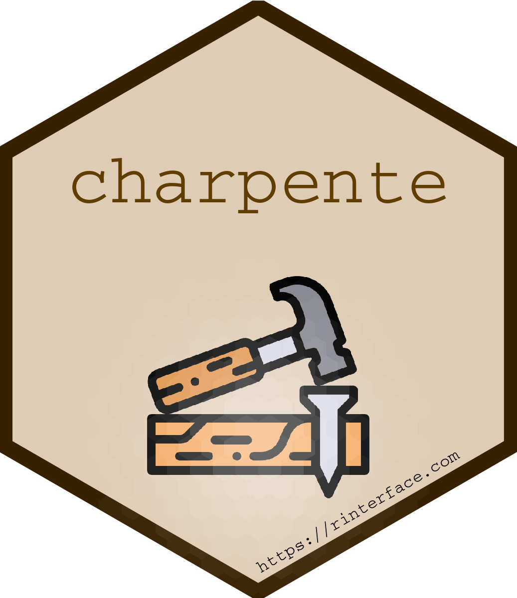
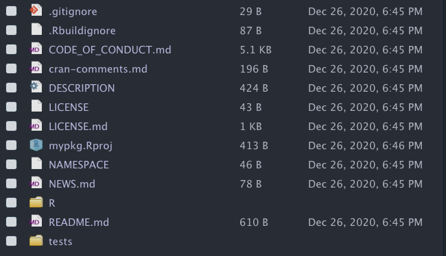
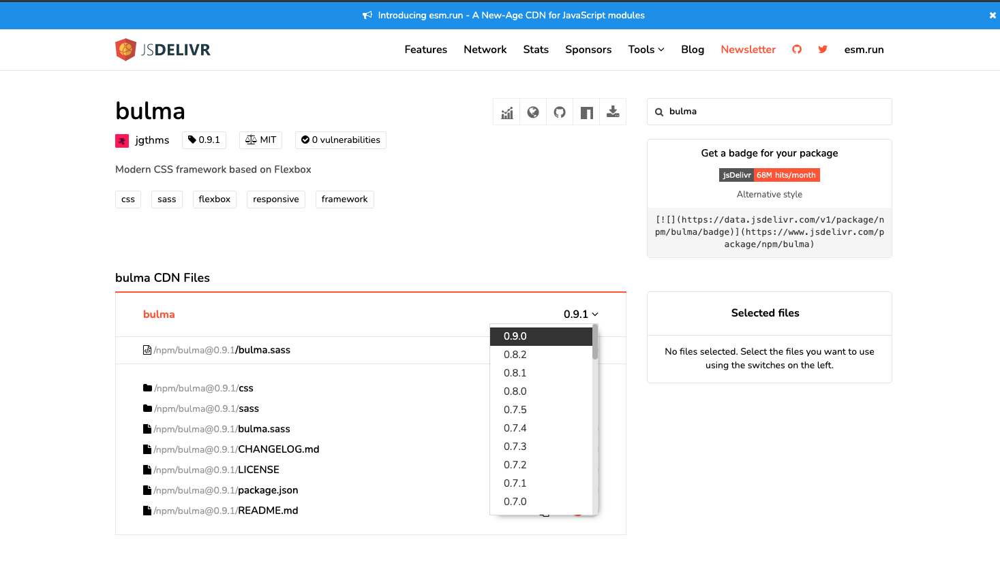

# Introduction to {charpente} {#workflow-charpente} 

```{r workflow-charpente-hex, echo=FALSE, fig.cap='The {charpente} package', fig.align = 'center', out.width='25%'}

```

## Motivations
Translating an HTML template into an R API requires the creation of a package. As stated in Chapter \@ref(welcome-code-structure), this is not a good practice to proceed as follows:

```{r, eval=FALSE}
ui <- fluidPage(
  useShinydashboard(),
  tags$script(
    "$(function() {
      let boxBinding = new Shiny.InputBinding();
      $.extend(boxBinding, {
        initialize: function(el) {
          $(el).activateBox();
        },
        find: function(scope) {
          return $(scope).find('.box');
        },
        getValue: function(el) {
          let isCollapsed = $(el).hasClass('collapsed-box');
          return {collapsed: isCollapsed}; // this will be a list in R
        },
        setValue: function(el, value) {
          $(el).toggleBox();
        }, 
        receiveMessage: function(el, data) {
          this.setValue(el, data);
          $(el).trigger('change');
        },
        subscribe: function(el, callback) {
          $(el).on('click', '[data-widget=\"collapse\"]', function(event) {
            setTimeout(function() {
              callback();
            }, 550);
          }); 
          $(el).on('change', function(event) {
            setTimeout(function() {
              callback();
            }, 550);
          });
        },
        unsubscribe: function(el) {
          $(el).off('.boxBinding');
        }
      });
      Shiny.inputBindings.register(boxBinding, 'box-input');
    });
    "
  ),
  
  box2(
    title = textOutput("box_state"),
    "Box body",
    inputId = "mybox",
    collapsible = TRUE,
    plotOutput("plot")
  ),
  actionButton("toggle_box", "Toggle Box")
)

server <- function(input, output, session) {
  output$plot <- renderPlot({
      req(!input$mybox$collapsed)
      plot(rnorm(200))
    })
    
    output$box_state <- renderText({
      state <- if (input$mybox$collapsed) "collapsed" else "uncollapsed"
      paste("My box is", state)
    })
    
    observeEvent(input$toggle_box, {
      updateBox2("mybox")
    })
}

shinyApp(ui, server)
```

Imagine if we had to repeat the process for more than twenty components. The package structure provides many advantages like:

  - Develop a comprehensive documentation of the underlying API
  - Design unit tests to guaranty code robustness and improve long term plan
  - Relevant file organization
  

## General idea
[{charpente}](https://github.com/RinteRface/charpente) is a game changer for custom template creation. 
It is not yet on CRAN but has been widely used to help developing RinteRface packages.
`{charpente}`, it drastically:

  - Eases the import of external dependencies.
  - Speeds up the HTML to R conversion, which is quite frankly a rather boring process,
  allowing to focus on the features rather than the syntax. This feature builds on top of the
  `{html2R}` shiny app by Alan Dipert, already mentioned in Chapter \@ref(htmltools-overview).
  
Let's try below with `html_2_R`:

```{r}
library(charpente)
html_2_R('<div class="divclass" id = "someid"></div>')
```

`html_2_R` has a __prefix__ parameter which adds a `tags$` prefix if TRUE. It is 
TRUE by default which prevents errors with unexported Shiny tags like `nav`.


The second main benefice of `{charpente}` is the dependency management system.

## A case study: `{shinybulma}`
In the following, we'll illustrate `{charpente}`'s workflow, through the R in Pharma workshop [exercises](https://github.com/RinteRface/Unleash-Shiny-Exercise-1) focused on `{shinybulma}`.

[bulma](https://bulma.io/) is a more and more popular open source CSS framework for the web. 
Importantly, there **isn't** any JavaScript helper in the bulma core. 
We'll see later that the recent [bulma JS](https://bulmajs.tomerbe.co.uk/) provides such feature. 
For now, we only focus on HTML and CSS.

To initialize a `{charpente}` package, we do:

```{r, eval = FALSE}
path <- file.path(tempdir(), "mypkg")
create_charpente(path, license = "mit")
# TO FINISH
```

This sets up a minimal viable package with git and optionally github remote setup, 
Figure \@ref(fig:workflow-charpente-pkg). 

```{r workflow-charpente-pkg, echo=FALSE, fig.cap='Package structure for {charpente}', fig.align = 'center', out.width='100%'}

```

### Build the HTML dependency
The interested reader will have a look at the **Getting started [guide](https://bulma.io/documentation/overview/start/)**,
so as to know more how to get bulma. To install bulma dependencies, there are 3 ways. 
For convenience, we'll choose the CDN method (content delivery network) which consists in getting dependencies from a dedicated server.

We could build the bulma dependency as follows:

```{r, eval=FALSE}
library(htmltools)
bulma_deps <- htmlDependency(
  name = ...,
  version = ...,
  src = c(href = ...),
  stylesheet = ...
)

add_bulma_deps <- function(tag) {
  tagList(..., ...)
}
```

but this already takes too much time. This is where `{charpente}` comes into play. 
Specifically, the `create_dependency` function:

  - Automatically download/points to the specified dependency by just providing its
  name. It means you have to know what you are looking for. Best practice is
  to have a look at the [jsdelivr](https://www.jsdelivr.com/) website 
  (`{charpente}` is built on top of jsdelivr) and find the good repository, as shown Figure 
  \@ref(fig:workflow-jsdelivr-bulma).
  - `charpente_options(local = FALSE)` allows to fine tune the behavior. If local is FALSE,
  `{charpente}` points to the CDN without downloading any file. It is substantially faster than
  the local option but requires an internet connection. Package developers will prefer the
  `local = TRUE` to ensure dependencies are always accessible.
  - Extra parameters like __tag__ control the downloaded version since HTML templates
  may have several flavors. It is always good to be able to test multiple versions and select
  the best option. 
  - Creates the `add_<DEP_NAME>_deps` function in a `<DEP_NAME>--dependencies.R` script and opens it.
  
```{r workflow-jsdelivr-bulma, echo=FALSE, fig.cap='jsdelivr result for bulma', fig.align = 'center', out.width='100%'}

```
Once satisfied, we simply run to get the latest version:

```{r, eval=FALSE}
create_dependency("bulma", options = charpente_options(local = FALSE))
create_dependency("bulma", tag = "0.7.0", options = charpente_options(local = FALSE))
```

At the moment, `create_dependency` is not able to filter all files and you'll have 
to remove either `bulma-rtl.min.css` or `bulma.min.css`, rtl standing for right to left.

We can test our new dependency:

```{r, eval=FALSE}
devtools::load_all()
findDependencies(add_bulma_deps(div()))
```

which works like a charm. If you chose the local option, you would also get an `inst` folder
with all relevant bulma files sorted by type, that is css, javascript, ...:

```{r, eval=FALSE}
# local dependency script output
add_bulma_deps <- function(tag) {
 bulma_deps <- htmltools::htmlDependency(
  name = "bulma",
  version = "0.9.1",
  src = c(file = "bulma-0.9.1"),
  stylesheet = "css/bulma.min.css",
  package = "mypkg",
 )
 htmltools::tagList(tag, bulma_deps)
}

# CDN dependencies
add_bulma_deps <- function(tag) {
 bulma_deps <- htmltools::htmlDependency(
  name = "bulma",
  version = "0.9.1",
  src = c(href = "https://cdn.jsdelivr.net/npm/bulma@0.9.1/"),
  stylesheet = "css/bulma.min.css"
 )
 htmltools::tagList(tag, bulma_deps)
}
```


### Set up the minimal page template
According to the [documentation](https://bulma.io/documentation/overview/start/#starter-template), the starter page template is:
```html
<!DOCTYPE html>
<html>
  <head>
    <meta charset="utf-8">
    <meta name="viewport" content="width=device-width, initial-scale=1">
    <title>Hello Bulma!</title>
    <link rel="stylesheet" href="https://cdn.jsdelivr.net/npm/bulma@0.9.0/css/bulma.min.css">
  </head>
  <body>
    <section class="section">
      <div class="container">
        <h1 class="title">
          Hello World
        </h1>
        <p class="subtitle">
          My first website with <strong>Bulma</strong>!
        </p>
      </div>
    </section>
  </body>
</html>
```

Adding some `{charpente}` magic with `html_2_R`, we set the path parameter to `/html` to get the entire template. We, replace `...` by the appropriate content (see above). Since the copied HTML contains double quotations marks like `<p class="subtitle"></p>`, we put the string in single quotation marks.

```{r}
html_2_R(
  '<html>
  <head>
    <meta charset="utf-8">
    <meta name="viewport" content="width=device-width, initial-scale=1">
    <title>Hello Bulma!</title>
    <link rel="stylesheet" href="https://cdn.jsdelivr.net/npm/bulma@0.9.0/css/bulma.min.css">
  </head>
  <body>
    <section class="section">
      <div class="container">
        <h1 class="title">
          Hello World
        </h1>
        <p class="subtitle">
          My first website with <strong>Bulma</strong>!
        </p>
      </div>
    </section>
  </body>
</html>
  ',
  path = "/html",
  prefix = TRUE
)
```

**Note**: at run time, shiny adds `html` around the UI, thereby making it not necessary to include. 
We'll also don't need the `link(rel = "stylesheet", href = "https://cdn.jsdelivr.net/npm/bulma@0.9.0/css/bulma.min.css")` 
since `add_bulma_deps` does already attach the dependencies to the page.

The `bulma_page` function is, that you may save in the `R` package folder:

```{r}
bulma_page <- function(..., title = NULL) {
  tagList(
    tags$head(
      tags$meta(charset = "utf-8"),
      tags$meta(
        name = "viewport",
        content = "width=device-width, initial-scale=1"
      ),
      tags$title(title)
    ),
    add_bulma_deps(tags$body(...)) 
  )
}
```

With some practice, going from step 1 to the bulma page templates literally takes 3 minutes,
while it would have taken more than 30 minutes by hand. At any time, you may replace
the dependency with another version. Be careful, since `{charpente}` does not make snapshots
of old versions. 


### Exercise: add bulmaJS
As stated in the above, bulma only contains CSS things! It means we need
either to develop custom JS code to add interactivity or rely on any third party existing API. 
[bulma JS](https://bulmajs.tomerbe.co.uk/) is one of these!

1. Using `{charpente}`, create a bulma js dependency. We'll point to [vizuaalog/bulmajs](https://bulmajs.tomerbe.co.uk/) since some bulmajs already exist and are not what we want. Run the following code in the R console.

```{r bulmajs-deps, eval=FALSE}
create_dependency(..., options = charpente_options(local = FALSE))
```

Notice how many files are added to the dependency. In the following, we'll only work with **notifications**:

  - Only keep `notification.js` and remove all the unnecessary files
  - Only keep `bulma.js` that gather all plugins in 1 script. 
  
The best practice is usually to **keep only what we need** since some scripts may be **heavy to load**!

2. Run `devtools::load_all()`. Modify the below code to test the newly created dependency. Hint: toggle the HTML inspector to check all appropriate dependencies are there!
```{r bulmajs-deps-test, eval=FALSE}
ui <- bulma_page()
server <- function(input, output, session) {}
shinyApp(ui, server)
```

### Add custom JS
Notifications are always useful to send user feedback. Shiny has a notification system through `shiny::showNotification`. Like Shiny, Bulma [notifications](https://bulmajs.tomerbe.co.uk/docs/0.11/2-core-components/notification/) are entirely built from JS (no need for any HTML code).

The API works as follows:

  - `Bulma(target).notification(config)` creates the notification based on a JSON option list (config). 
  `target` expects a jQuery selector.
  - `show` toggles the newly instantiated notification
  
In other words the below code attaches the notification to the `body`:

```javascript
Bulma('body').notification({
  body: 'Example notification',
  color: 'info'
}).show();
```
  
In the following we design the R interface and JavaScript handler (which is no more than an event listener). 
`{charpente}` has a function that creates both pieces, namely `create_custom_handler`:

```{r, eval=FALSE}
create_custom_handler("notification")
```

We obtain the `notification-handler.R` script:

```{r, eval=FALSE}
send_notification_message <- function(id = NULL, options = NULL, session = shiny::getDefaultReactiveDomain()) {
 message <- list(
  # your logic
 )
 
 session$sendCustomMessage(type = "notification", message)
}
```

and the corresponding JavaScript piece in `notification.js`, 
derived from the `{golem}` `add_js_handler` function:

```javascript
$(function() {
  Shiny.addCustomMessageHandler('notification', function(message) {
 
  });
});
```

By default, the JS file is created in the `srcjs` directory. This is a special directory
where we store all JavaScript files that depend on the package author. For instance, 
bulmaJS is an external dependency and is very unlikely to be edited by the package author. For that reason, 
it remains in the `inst` folder like all other external dependencies.

### Add custom input/output bindings
In part \@ref(secondary-inputs), we created better shinydashboard boxes that one
may programmatically collapse, close and restore. Until know, there was no way to 
setup an input binding skeleton and one had to copy and paste each time the same
code. `{charpente}` has a `create_input_binding` and `create_output_binding` (functions that
you can also find in the development version of `{golem}`). Contrary to the custom handler case,
`create_input_binding` only generate the JavaScript piece since the R part is highly variable from
one input to another. To get a plug and play box input binding we call:

```{r, eval=FALSE}
create_input_binding("boxBinding")
```

which gives the `input-boxBinding.js` script in the `srcjs` folder:

```javascript
var boxBinding = new Shiny.InputBinding();
$.extend(boxBinding, {
  find: function(scope) {
    // JS logic $(scope).find('whatever')
  },
  getValue: function(el) {
    // JS code to get value
  },
  setValue: function(el, value) {
    // JS code to set value
  },
  receiveMessage: function(el, data) {
    // this.setValue(el, data);
  },
  subscribe: function(el, callback) {
    $(el).on('click.boxBinding', function(e) {
      callback();
    });

  },
  unsubscribe: function(el) {
    $(el).off('.boxBinding');
  }
});
Shiny.inputBindings.register(boxBinding, 'shiny.whatever');
```

This function has multiple options:

  - __initialized__ is FALSE by default. If TRUE, it adds an `initialized` method
  to the binding. 
  - __dev__ adds some `console.log` elements whenever relevant to help in the debugging 
  process.
  - __event__ is a list containing events related to the binding. By default, it generates
  a `click` event without any rate policy. To add extra events we do 
  `list(name = c("click", "whatever"), rate_policy = c(FALSE, TRUE))`. 
  
Similarly, the `create_output_binding` function creates a ready to use output binding JS script, 
in the `srcjs` folder (`create_output_binding("menuOutput")`):

```javascript
var menuOutput = new Shiny.OutputBinding();
$.extend(menuOutput, {
  find: function(scope) {
    // JS logic $(scope).find('whatever')
  },
  renderValue: function(el, data) {
    // JS logic
  }
});
Shiny.outputBindings.register(menuOutput, 'shiny.whatever');
```

### Organize your JS code
This naturally leads us to this part which is about JS code organization. Shiny developers
may have a lot of custom scripts, and it is generally a bad idea to put them all
under `inst`. Instead, we put them in `srcjs`, concatenate and minify them to create one big
`file.min.js` in the `inst` folder. This is better for performance since file size matter in JS.

The dreamRs team developed a tool to seamlessly format, organize, validate CSS and JS code, that is
[{jstools}](https://github.com/dreamRs/jstools). Interestingly, it has 2 addins allowing to quickly
format and validate a given JS file. 

```{r, eval=FALSE}
remotes::install_github("dreamRs/jstools")
```

We are going to create a second custom handler with `{charpente}` and reorganize
the whole JS code:

```{r, eval=FALSE}
create_custom_handler("modal")
```

Now there should be 2 JS scripts in the `srcjs` folder. Below, we use a compressor, namely
[terser](https://terser.org/), that optimizes and compresses our code for the web browser, at a price to be less
human readable.  It also provides source maps that are crucial to the debugging process, thereby making it possible to reconstruct the original JS code starting from a minified script:

```{r, eval=FALSE}
library(jstools)
mypkgJS <- list.files(
  path = "srcjs",
  recursive = TRUE,
  full.names = TRUE
)

dir.create("inst")
outputDir <- "inst/mypkg-0.0.0.9000"
dir.create(outputDir)

# Concat + Compress + source maps ----------------------------------------------------------------

terser_file(
  input = mypkgJS,
  output = sprintf("%s/mypkg.min.js", outputDir),
  options = terser_options(
    sourceMap = list(
      root = "../../mypkg-build",
      filename = "mypkg.min.js",
      url = "mypkg.min.js.map",
      includeSources = TRUE
    )
  )
)
```

`terser_file` takes all raw JS files as input, generate a minified/optimized script as well
as source maps available at `mypkg.min.js.map`. The __root__ parameter indicates their location
on the server once the shiny app running:

```javascript
$((function(){Shiny.addCustomMessageHandler("modal",(function(n){}))})),
$((function(){Shiny.addCustomMessageHandler("notification",(function(n){}))}));
//# sourceMappingURL=mypkg.min.js.map
```

The good new is that `{charpente}` can automate this task in only one line of code:

```{r, eval=FALSE}
compress_js()
```

Additionally, this creates a plug and play dependency pointing to the newly generated JS file:

```{r, eval=FALSE}
add_mypkg_deps <- function(tag) {
 mypkg_deps <- htmltools::htmlDependency(
  name = "mypkg",
  version = utils::packageVersion("mypkg"),
  src = c(file = "mypkg-0.0.0.9000"),
  script = "js/mypkg.min.js",
  package = "mypkg",
 )
 htmltools::tagList(tag, mypkg_deps)
}
```

__Disclaimer__: there is not yet similar process for CSS. This is still work in progress.

Other tools exist like [`{packer}`](https://github.com/JohnCoene/packer) by John Coene, which leverages [webpack](https://webpack.js.org/) to handle JS code.

### Combine multiple dependencies
`add_dependencies` allow to select any dependency available in the `./R` folder, provided that they follow the convention `<depName>_dependencies.R` (which is always the case if you use `{charpente}`). For instance `add_dependencies(div(), deps = c("bulma", "bulmajs"))` will add bulma (first) and bulmajs dependencies to a `div` tag. You may change the order as you want since most of the time, the order matters. `bulma_page` could also benefit from that shortcut:

```{r, eval=FALSE}
bulma_page <- function(..., title = NULL) {
  tagList(
    tags$head(
      tags$meta(charset = "utf-8"),
      tags$meta(
        name = "viewport",
        content = "width=device-width, initial-scale=1"
      ),
      tags$title(title)
    ),
    add_dependencies(
      tags$body(...),
      deps = c("bulma", "mypkg")
    ) 
  )
}
```

### Other `{charpente}` helpers
Let's finish this section by listing some tools. We know `create_dependency` to install
an external dependency. For instance this code installs framework7 dependencies:

```{r, eval=FALSE}
create_dependency("framework7")
```

The problem is that we don't necessarily know all package versions and yOu may need
`framework7 4.5.0` or `framework7 5.3.1`. `get_dependency_versions` allows to look for
all versions:

```{r}
get_dependency_versions("framework7")
get_dependency_versions("framework7", latest = TRUE)
```

Specifying `latest = TRUE` ensures to recover the very last __stable__ version 
(it excludes alpha/beta versions).

You may explore also the dependency files with `get_dependency_assets`, even for 
a specific version with __tag__:

```{r}
get_dependency_assets("bootstrap")
```

This is helpful to further fine tune `charpente_options`. It is indeed possible
that you don't want bundles (`bootstrap.bundle.min.js`), minified, lite versions of scripts. 

`get_installed_dependency` allows to inspect which dependencies are installed. It only works
if the dependencies were created locally, that is `charpente_options(local = TRUE)`.

Finally, one may ask how to update a given dependency. `update_dependency` does this, provided that
the dependency is installed locally. By default, it installs the latest version of the targeted dependency. 
It gives a diagnosis comparing the current installed version
with the latest available version. The are 3 possible cases: dependencies are up to date
and `update_dependency("bulma")` yields:

```
ℹ Trying with https://data.jsdelivr.com/v1/package/npm/bulma
✓ Success!
──────────────────────────────────────────────────────────────────────────────
Error in update_dependency("bulma") : Versions are identical
```

The installed dependencies are outdated (we have 0.7.0 with `create_dependency("bulma", tag = "0.7.0", options = charpente_options(local = TRUE))`), the function shows the targeted version as well as
the last one:

```
ℹ Trying with https://data.jsdelivr.com/v1/package/npm/bulma
✓ Success!
──────────────────────────────────────────────────────────────────────────────
ℹ current version: 0.7.0 ||
target version: 0.9.1 ||
latest version: 0.9.1
! Upgrading bulma to 0.9.1
✓ Directory inst/bulma-0.9.1/css successfully created
! Remove existing file R/bulma-dependencies.R
```

The last use case is a downgrade, which may be possible if the package maintainer realizes
that the dependency version is too unstable. In the following, we have `bulma-0.9.1` installed 
and downgrade to 0.7.0 with `update_dependency("bulma", version_target = "0.7.0")`:


```
ℹ Trying with https://data.jsdelivr.com/v1/package/npm/bulma
✓ Success!
──────────────────────────────────────────────────────────────────────────────
ℹ current version: 0.9.1 ||
target version: 0.7.0 ||
latest version: 0.9.1
! Downgrading bulma to 0.7.0
✓ Directory inst/bulma-0.7.0/css successfully created
! Remove existing file R/bulma-dependencies.R
```


## Other tips
### Validate JavaScript
We could not finish this chapter without mentioning tools to validate JavaScript code. We will particularly focus on [JSHint](https://jshint.com), which has a R [wrapper](https://github.com/dreamRs/jstools), nicely provided by the dreamRs team. Below is an example of how to check all the [shinyMobile](https://github.com/RinteRface/shinyMobile) JavaScript input bindings at once:

```{r, eval = FALSE}
bindings <- list.files(
  path = system.file("framework7-5.5.0/input-bindings", package = "shinyMobile"),
  recursive = TRUE,
  full.names = TRUE
)
jshint_file(input = bindings, options = jshint_options(jquery = TRUE, globals = list("Shiny", "app")))
```

You may fine tune the `jshint_file` behavior with the [`jshint_options`](https://jshint.com/docs/options/). One is often tempted to call `eval` in JS code, which will result in a JSHint error. An option called `evil` exists to disable the corresponding test. However, we recommend to play the game, accept those error and try to fix them instead of cheating with options!