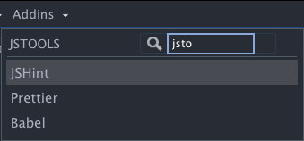

# Introduction to {charpente} {#workflow-charpente} 

```{r workflow-charpente-hex, echo=FALSE, fig.cap='The {charpente} package', fig.align = 'center', out.width='25%'}
knitr::include_graphics("images/workflow/charpente-hex.png")
```

## Motivations
Translating an HTML template into an R API requires the creation of a package. This is not a good practice to proceed as follows:

```{r, eval=FALSE}
ui <- fluidPage(
  useShinydashboard(),
  tags$script(
    "$(function() {
      // JS logic
    });
    "
  ),
  # R UI elements
)

server <- function(input, output, session) {
    
  # R server logic
}

shinyApp(ui, server)
```

Imagine if we had to repeat the process for more than twenty components. The R package structure provides many advantages like:

  - Develop a comprehensive __documentation__ of the underlying API.
  - Design __unit tests__ to guaranty code robustness and improve long term plan.
  - Relevant file organization, easing collaboration. 
  

## General idea
[{charpente}](https://github.com/RinteRface/charpente) is a game changer for custom template creation and has been widely used to help developing RinteRface packages.
`{charpente}` [@R-charpente] drastically:

  - Eases the __import__ of external dependencies.
  - Speeds up the HTML to R __conversion__, which is quite frankly a rather boring process,
  allowing to focus on the features rather than the syntax. This feature builds on top of the `{html2R}` shiny app by Alan Dipert, already mentioned in Chapter \@ref(htmltools-overview).
  - Eases __JS code management__, leveraging [esbuild](https://esbuild.github.io/).
  
Let's try below with `html_2_R()`:

```{r}
library(charpente)
html_2_R('<div class="divclass" id = "someid"></div>')
```

`html_2_R` has a __prefix__ parameter which adds a `tags$` prefix if TRUE. It is 
TRUE by default which prevents errors with non exported Shiny tags like `nav`.


The second main benefit of `{charpente}` is the dependency management system.

## A case study: `{shinybulma}`
In the following, we'll illustrate `{charpente}`'s workflow, through a case [study](https://github.com/RinteRface/Unleash-Shiny-Exercise-1) involving [bulma](https://bulma.io/), a more and more popular open source CSS framework for the web. Importantly, there **isn't** any JavaScript in the bulma core code. 
We'll see later that the recent [bulma JS](https://bulmajs.tomerbe.co.uk/) provides such an implementation. For now, we only focus on HTML and CSS.

To initialize a `{charpente}` package, we run:

```{r, eval = FALSE}
path <- file.path(tempdir(), "mypkg")
create_charpente(path, license = "mit")
```

This sets up a minimal viable package under version control (__git__) and optionally GitHub remote setup, Figure \@ref(fig:workflow-charpente-pkg). 

```{r workflow-charpente-pkg, echo=FALSE, fig.cap='Package structure for {charpente}', fig.align = 'center', out.width='100%'}
knitr::include_graphics("images/workflow/charpente-pkg.png")
```

By default, the package `DESCRIPTION` `Imports` field has `shiny`, `htmltools` and
`utils`. `{charpente}` is never required to be a dependency of your package since it might
be invasive. 

In the `./R` folder, `{charpente}` creates a `mypkg-utils.R` script containing:

  - Tools to facilitate __HTML dependency__ management like `add_dependencies` (see corresponding section below).
  - Some __validation__ functions mentioned in Chapter \@ref(custom-templates-testing).
  
Finally, you may see some exotic folders and files like `srcjs`, `package.json`, `package-lock.json` and `node_modules`. Fear not, we describe them later in \@ref(organize-your-js). Overall, they are here to support to JS code management.

### Build the HTML dependency
The interested reader may have a look at the **Getting started [guide](https://bulma.io/documentation/overview/start/)**,
so as to know more how to get bulma. To install bulma dependencies, there are several ways: 

  - The __content delivery network__ method (CDN) which consists in getting dependencies from a dedicated server. 
  Files are not stored locally which may be a problem if one does not have internet.
  - The local method consists in downloading the production files (minified CSS).
  - Using [npm](https://www.npmjs.com/) (JS package repository but far less controlled than CRAN) that installs bulma sources as well as production files. It means one can modify
  sources at anytime, which is not recommended since it would be hard to 
  maintain. 
  
In our case, we show the two first methods, the third being out of the scope of this book. 

As shown in previous Chapter \@ref(custom-templates-dependencies), 
we could build the bulma dependency as follows:

```{r, eval=FALSE}
library(htmltools)
bulma_deps <- htmlDependency(
  name = ...,
  version = ...,
  src = c(href = ...),
  stylesheet = ...
)

add_bulma_deps <- function(tag) {
  tagList(..., bulma_deps)
}
```

but this already takes too much time. This is where `{charpente}` comes into play. 
Specifically, the `create_dependency()` function automatically points to the specified dependency by just providing its name. This means you have to know what you are looking for. Best practice is to look at the [jsdelivr](https://www.jsdelivr.com/) website (`{charpente}` is built on top of jsdelivr) and find the correct repository, as shown Figure \@ref(fig:workflow-jsdelivr-bulma). `create_dependency()` will also create the `add_<DEP_NAME>_deps` function in a `<DEP_NAME>--dependencies.R` script and open it.

`charpente_options(local = FALSE)` allows you to fine tune the behavior. If local is FALSE,
`{charpente}` points to the CDN without downloading any files. However, your end users will require 
an internet connection to be able to access static assets required by the Shiny app. 
Therefore, package developers should prefer the option `local = TRUE` to ensure dependencies are always accessible.
Extra parameters like __tag__ control the downloaded version since HTML templates
may have several flavors. It is always good to be able to test multiple versions and select
the best option. 
  
```{r workflow-jsdelivr-bulma, echo=FALSE, fig.cap='jsdelivr result for bulma', fig.align = 'center', out.width='100%'}
knitr::include_graphics("images/workflow/jsdelivr-bulma.png")
```
Once satisfied, we simply run the below code to get the latest version, or a specific 
version if __tag__ is used:

```{r, eval=FALSE}
# CDN method 
create_dependency(
  "bulma", 
  options = charpente_options(local = FALSE)
)
create_dependency(
  "bulma", 
  tag = "0.7.0", 
  options = charpente_options(local = FALSE)
)

# local method (default)
create_dependency("bulma")
```

Moreover, `create_dependency()` is able to filter all files, through the `charpente_options()`:

  - __minified__ targets all files with `.min`, if TRUE.
  - __bundle__ targets all files containing `.bundle`, if TRUE.
  - __lite__ targets files with `lite` keyword, if TRUE.
  - __rtl__ target all files with `.rtl`, if TRUE. rtl design stands for right to left
  and is common in some countries for instance. 
  
You may imagine that `charpente_options()` targets `.min` files by default. If you don't find
any script, you probably have to change options. For instance, some templates
like Bootstrap and Framework7 have `bundle.min` files (`charpente_options(bunlde = TRUE)`), whereas bulma doesn't.


We can test our new dependency:

```{r, eval=FALSE}
devtools::load_all()
findDependencies(add_bulma_deps(div()))
```

which works like a charm. If you chose the local option, you also get an `inst/bulma-<BULMA-VERSION>` folder
with all relevant files sorted by type. The `bulma-dependencies.R` script contains the 
newly created `add_bulma_deps` function, either pointing to the CDN or the local 
files, depending on the chosen strategy:

```{r, eval=FALSE}
# local dependency script output

#' bulma dependencies utils
#'
#' @description This function attaches bulma. dependencies to the given tag
#'
#' @param tag Element to attach the dependencies.
#'
#' @importFrom htmltools tagList htmlDependency
#' @export
add_bulma_deps <- function(tag) {
 bulma_deps <- htmlDependency(
  name = "bulma",
  version = "0.9.3",
  src = c(file = "bulma-0.9.3"),
  stylesheet = "css/bulma.min.css",
  package = "mypkg",
 )
 tagList(tag, bulma_deps)
}
```

```{r, eval=FALSE}
# CDN dependencies

#' bulma dependencies utils
#'
#' @description This function attaches bulma. dependencies to the given tag
#'
#' @param tag Element to attach the dependencies.
#'
#' @importFrom htmltools tagList htmlDependency
#' @export
add_bulma_deps <- function(tag) {
 bulma_deps <- htmlDependency(
  name = "bulma",
  version = "0.9.3",
  src = c(href = "https://cdn.jsdelivr.net/npm/bulma@0.9.3/"),
  stylesheet = "css/bulma.min.css"
 )
 tagList(tag, bulma_deps)
}
```

`{charpente}` sets the roxygen skeleton so that you don't have to worry about function imports. 


### Set up the minimal page template
According to the bulma [documentation](https://bulma.io/documentation/overview/start/#starter-template), the starter page template is:
```html
<!DOCTYPE html>
<html>
  <head>
    <meta charset="utf-8">
    <meta name="viewport" content="width=device-width, initial-scale=1">
    <title>Hello Bulma!</title>
    <link rel="stylesheet" href="https://cdn.jsdelivr.net/
    /bulma.min.css">
  </head>
  <body>
    <section class="section">
      <div class="container">
        <h1 class="title">
          Hello World
        </h1>
        <p class="subtitle">
          My first website with <strong>Bulma</strong>!
        </p>
      </div>
    </section>
  </body>
</html>
```

Adding some `{charpente}` magic with `html_2_R()`, we set the path parameter to `/html` to get the entire template. We, replace `...` with the appropriate content (see above). Since the copied HTML contains double quotations marks like `<p class="subtitle"></p>`, we put the string in single quotation marks.

```{r, echo=FALSE}
bulma_html_skeleton <- '
<html>
  <head>
    <meta charset="utf-8">
    <meta name="viewport" content="width=device-width, initial-scale=1">
    <title>Hello Bulma!</title>
  </head>
  <body>
    <section class="section">
      <div class="container">
        <h1 class="title">
          Hello World
        </h1>
        <p class="subtitle">
          My first website with <strong>Bulma</strong>!
        </p>
      </div>
    </section>
  </body>
</html>'
```

```{r}
# bulma_html_skeleton is the above HTML code
html_2_R(bulma_html_skeleton, path = "/html")
```

::: {.noteblock data-latex=""}
At run time, shiny adds `html` around the UI, thereby making it not necessary to include. 
We also don't need the `link(rel = "stylesheet", href = "https://cdn.jsdelivr.net/npm/bulma@0.9.3/css/bulma.min.css")` 
since `add_bulma_deps` does already attach the dependencies to the page. We removed `tags$section` content as it may correspond to another bulma component, like `bulma_section()`. 
:::

The `prefix` parameter defaults to TRUE, so that we don't have to worry about whether tags functions are exported
by shiny (see Chapter \@ref(htmltools-overview)).

The `bulma_page()` function is defined below, considering a simplified version of the above HTML to R translation, that we save in the `./R` package folder:

```{r}
bulma_page <- function(..., title = NULL) {
  tagList(
    tags$head(
      tags$meta(charset = "utf-8"),
      tags$meta(
        name = "viewport",
        content = "width=device-width, initial-scale=1"
      ),
      tags$title(title)
    ),
    add_bulma_deps(tags$body(...)) 
  )
}
```

With some practice, going from step one to the bulma page templates literally takes three minutes,
while it would have taken much more time by hand. At any time, you may replace
the dependency with another version. Be careful, since `{charpente}` does not make snapshots of old versions. 


### Exercise: add bulmaJS
As stated in the above, bulma only contains CSS code. It means we need
to either develop custom JS code to add interactivity or rely on any third party existing API. [bulma JS](https://bulmajs.tomerbe.co.uk/) is one of these.

::: {.importantblock data-latex=""}
This example has been written and tested with [bulmaJS](https://www.jsdelivr.com/package/npm/@vizuaalog/bulmajs?version=0.12.1) `0.12.1`.
Some features may change in future releases.
:::

1. Using `{charpente}`, create a bulma js dependency. We point to [vizuaalog/bulmajs](https://bulmajs.tomerbe.co.uk/) since some bulmajs already exist and is not what we want. Run the following code in the R console. 

```{r bulmajs-structure}
get_dependency_assets("@vizuaalog/bulmajs")
```

As shown in the code output, bulmajs does not have minified JS and CSS files. Therefore, to install the dependency, we have to specify the `charpente_options(minified = FALSE)`:

```{r bulmajs-deps, eval=FALSE}
create_dependency(..., options = charpente_options(minified = FALSE))
```

Notice how many files are added to the dependency. Below, we only work with **notifications**:

  - Only keep `notification.js` and remove all the unnecessary files
  - Only keep `bulma.js` that gather all plugins in 1 script. 
  
The best practice is usually to **keep only what we need** since some scripts may be **heavy to load**.

2. Run `devtools::load_all()`. Modify the below code to test the newly created dependency. Hint: toggle the HTML inspector to check all appropriate dependencies are there.
```{r bulmajs-deps-test, eval=FALSE}
# Where should the html dependency be added?
ui <- bulma_page()
server <- function(input, output, session) {}
shinyApp(ui, server)
```

### Add custom JS
Notifications are always useful to send user feedback. Shiny has a notification system through `shiny::showNotification`. Like Shiny, Bulma [notifications](https://bulmajs.tomerbe.co.uk/docs/0.11/2-core-components/notification/) are entirely built from JS (no need for any HTML code).

The API works as follows:

  - `Bulma(target).notification(config)` creates the notification based on a JSON option list (config). 
  `target` expects a jQuery selector.
  - `show` toggles the newly instantiated notification
  
In other words the below code attaches the notification to the `body`:

```js
Bulma('body').notification({
  body: 'Example notification',
  color: 'info'
}).show();
```
  
In the following we design the R interface and JavaScript handler (which is no more than an event listener). 
`{charpente}` has a function that creates both pieces, namely `create_custom_handler()`:

```{r, eval=FALSE}
create_custom_handler("notification")
```

We obtain the `notification-handler.R` script:

```{r, eval=FALSE}
send_notification_message <- function(
  id = NULL, 
  options = NULL, 
  session = shiny::getDefaultReactiveDomain()
) {
 message <- list(
  # your logic
 )
 
 session$sendCustomMessage(type = "notification", message)
}
```

and the corresponding JavaScript piece in `notification.js`, 
derived from the `golem::add_js_handler` function:

```js
$(function() {
  Shiny.addCustomMessageHandler('notification', function(message) {
 
  });
});
```

By default, the JS file is created in the `./srcjs` directory. This is a special directory where we store all JavaScript files that depend on the package author. For instance, bulmaJS is an external dependency and is very unlikely to be edited by the package author. For that reason, it remains in the `./inst` folder like all other external dependencies.

### Add custom input/output bindings
In part \@ref(secondary-inputs), we created better `{shinydashboard}` boxes that one
may programmatically collapse, close, and restore. Until now, there was no way to 
setup an input binding skeleton and one had to copy and paste each time the same
code. `{charpente}` has a `create_input_binding()` and `create_output_binding()` (functions that
you can also find in the development version of `{golem}`). Contrary to the custom handler case,
`create_input_binding()` only generates the JavaScript piece since the R part is highly variable from
one input to another. To get a plug-and-play box input binding, we call:

```{r, eval=FALSE}
create_input_binding("boxBinding")
```

which gives the `input-boxBinding.js` script in the `./srcjs` folder:

```js
var boxBinding = new Shiny.InputBinding();
$.extend(boxBinding, {
  find: function(scope) {
    // JS logic $(scope).find('whatever')
  },
  getValue: function(el) {
    // JS code to get value
  },
  setValue: function(el, value) {
    // JS code to set value
  },
  receiveMessage: function(el, data) {
    // this.setValue(el, data);
  },
  subscribe: function(el, callback) {
    $(el).on('click.boxBinding', function(e) {
      callback();
    });

  },
  unsubscribe: function(el) {
    $(el).off('.boxBinding');
  }
});
Shiny.inputBindings.register(boxBinding, 'shiny.whatever');
```

This function has multiple options:

  - __initialized__ is FALSE by default. If TRUE, it adds an `initialized` method
  to the binding. 
  - __dev__ adds some `console.log` elements whenever relevant to help in the debugging 
  process.
  - __event__ is a list containing events related to the binding. By default, it generates
  a `click` event without any rate policy. To add extra events we do 
  `list(name = c("click", "whatever"), rate_policy = c(FALSE, TRUE))`. 
  
Similarly, the `create_output_binding()` function creates a ready to use output binding JS script, 
in the `./srcjs` folder (`create_output_binding("menuOutput")`):

```js
var menuOutput = new Shiny.OutputBinding();
$.extend(menuOutput, {
  find: function(scope) {
    // JS logic $(scope).find('whatever')
  },
  renderValue: function(el, data) {
    // JS logic
  }
});
Shiny.outputBindings.register(menuOutput, 'shiny.whatever');
```

### Organize your JS code {#organize-your-js}
This naturally leads us to this part which is about JS code organization. Shiny developers
may have a lot of custom JS scripts, and it is generally a bad idea to put them all
under `./inst`. Instead, we store them in `./srcjs`, as already stated above. `{charpente}` has a function providing
a tool to bundle the JS code for production or development, that is `build_js()`: 

  - It compresses, mangles all JS files and concatenate them in one minified file called `mypkg.min.js`. If __mode__ is `dev`, the files are not minified.
  - In production mode (__mode__ is `prod`, by default), it additionally generates source maps.
  
::: {.noteblock data-latex=""}
esbuild concatenates files by the order provided in the `./srcjs/main.js` entry point, automatically generated by `create_charpente()`. The configuration is provided by `{charpente}` in the `package.json` file. 
:::
  
The script `mypkg.min.js` is not human readable but the generated source map
allows to reconstruct the original code, which location is under the web browser `./srcjs` folder, like all Shiny JS files. From there, we can access any mapped script and start the debugging process like setting break points.

::: {.noteblock data-latex=""}
In production, the variable names, functions, are mangled. For instance, a variable
`config` could be called `t` in the minified file. 
:::

Additionally, `build_js()` creates the `mypkg-dependencies.R` file containing the HTML 
dependency pointing to the newly generated JS file (below for production):

```{r, eval=FALSE}
#' mypkg dependencies utils
#'
#' @description This function attaches mypkg dependencies to the given tag
#'
#' @param tag Element to attach the dependencies.
#'
#' @importFrom utils packageVersion
#' @importFrom htmltools tagList htmlDependency
#' @export
add_mypkg_deps <- function(tag) {
 mypkg_deps <- htmlDependency(
  name = "mypkg",
  version = packageVersion("mypkg"),
  src = c(file = "mypkg-0.0.0.9000"),
  script = "js/mypkg.min.js",
  package = "mypkg",
 )
 tagList(tag, mypkg_deps)
}
```

Switching between `prod` and `dev` automatically updates the `mypkg-dependencies.R` JS files.

Finally, under the hood, `create_js()`, `create_input_binding()`, `create_output_binding()`  and `create_custom_handler()` add a reference to the newly created script in the `main.js` entry point, which may look like:

```js
// Gather all files to import here
import './init.js'
import './widgets.js'
import './test.js'
```

A real life example will be shown in the next part \@ref(mobile-modularizeJ) and the result showcased [here](https://github.com/DivadNojnarg/outstanding-shiny-ui-code/tree/fd0ba28881869c5c605dd0e5b9f7a8f420bbedb4/srcjs).

__export__ and __import__ must be called from the top level of a script. For instance,
they cannot live inside the `$( document ).ready(function(...)});`, as this would trigger a build error. 

`{charpente}` currently does not provide a similar process for CSS, as this is still work in progress. Other tools exist like [`{packer}`](https://github.com/JohnCoene/packer) by [John Coene](https://john-coene.com/), which leverages [webpack](https://webpack.js.org/) to handle JS code.

### Combine multiple dependencies
`add_dependencies()` allows to select any dependency available in the `./R` folder, 
provided that they follow the convention `<depName>_dependencies.R` 
(which is always the case if you use `{charpente}`).

For instance `add_dependencies(div(), deps = c("bulma", "bulmajs"))` adds bulma (first) and 
bulmajs dependencies to a `div` tag. You may change the order as you see fit, as most 
of the time, the order matters. We update `bulma_page()` to benefit from the new dependencies:

```{r, eval=FALSE}
bulma_page <- function(..., title = NULL) {
  tagList(
    tags$head(
      tags$meta(charset = "utf-8"),
      tags$meta(
        name = "viewport",
        content = "width=device-width, initial-scale=1"
      ),
      tags$title(title)
    ),
    add_dependencies(
      tags$body(...),
      deps = c("bulma", "mypkg")
    ) 
  )
}
```

As mentioned above, `add_dependencies()` belongs to the `mypkg-utils.R` script
so that you don't have to import `{charpente}` in the `DESCRIPTION` `Imports` field.

### Other `{charpente}` helpers
Let's finish this section by listing other useful `{charpente}` tools. 
We know `create_dependency()` to install an external dependency. 
As shown earlier, this code installs bulma dependencies:

```{r, eval=FALSE}
create_dependency("bulma")
```

However, we don't necessarily know all package versions and may need
`bulma 0.9.3` or `bulma 0.7.0`. `get_dependency_versions()` allows to look for
all existing versions:

```{r}
get_dependency_versions("bulma")
get_dependency_versions("bulma", latest = TRUE)
```

Specifying `latest = TRUE` ensures to recover the very last __stable__ version 
(it excludes alpha/beta versions).

You may explore also the dependency files with `get_dependency_assets()`, even for 
a specific version with __tag__:

```{r}
get_dependency_assets("bulma")
```

This is helpful to further fine tune `charpente_options()`, as stated previously. It is indeed possible
that you don't want bundles, minified, lite or rtl versions of scripts. Internally, `create_dependency()`
relies on `get_dependency_assets()`. 

`get_installed_dependency()` allows to __inspect__ which dependencies are installed. It only works
if the dependencies were created locally, that is `charpente_options(local = TRUE)`.

Finally, one may ask how to __update__ a given dependency. `update_dependency()` does this, provided that
the dependency is installed locally. By default, it installs the latest version of the targeted dependency. 
It gives a diagnosis comparing the current installed version
with the latest available version, yielding three possible cases. Dependencies are __up to date__
and `update_dependency("bulma")` yields:

```
ℹ Trying with https://data.jsdelivr.com/v1/package/npm/bulma
✓ Success!
──────────────────────────────────────────────────────────────────────────────
Error in update_dependency("bulma") : Versions are identical
```

The installed dependencies are __outdated__ (we have 0.7.0 with `create_dependency("bulma", tag = "0.7.0", options = charpente_options(local = TRUE))`), the function shows the targeted version as well as
the last one:

```
ℹ Trying with https://data.jsdelivr.com/v1/package/npm/bulma
✓ Success!
──────────────────────────────────────────────────────────────────────────────
ℹ current version: 0.7.0 ||
target version: 0.9.3 ||
latest version: 0.9.3
! Upgrading bulma to 0.9.3
✓ Directory inst/bulma-0.9.3/css successfully created
! Remove existing file R/bulma-dependencies.R
```

The last use case is a __downgrade__, which may be possible if the package maintainer realizes
that the dependency version is too unstable. In the following, we have `bulma-0.9.3` installed 
and downgrade to 0.7.0 with `update_dependency("bulma", version_target = "0.7.0")`:


```
ℹ Trying with https://data.jsdelivr.com/v1/package/npm/bulma
✓ Success!
──────────────────────────────────────────────────────────────────────────────
ℹ current version: 0.9.3 ||
target version: 0.7.0 ||
latest version: 0.9.3
! Downgrading bulma to 0.7.0
✓ Directory inst/bulma-0.7.0/css successfully created
! Remove existing file R/bulma-dependencies.R
```


## Other tips
### Validate JavaScript
We could not finish this chapter without mentioning tools to __validate__ JavaScript code. [JSHint](https://jshint.com), which comes with [{jstools}](https://github.com/dreamRs/jstools). Below is an example of how to check all the [shinyMobile](https://github.com/RinteRface/shinyMobile) JavaScript input bindings at once:

```{r, eval=FALSE}
shinyMobileJS <- system.file(
  sprintf(
    "shinyMobile-%s/js/shinyMobile.js", 
    packageVersion("shinyMobile")
  ), 
  package = "shinyMobile"
)
# jstools print messages to the console
# We don't want to see them all in the book ...
invisible(capture.output(
  temp <- jshint_file(
    input = shinyMobileJS, 
    options = jshint_options(
      jquery = TRUE, 
      globals = list("Shiny", "app")
    )
  )
))

head(tibble::as_tibble(temp$errors[, c("line", "reason")]))
#> A tibble: 51 x 2
#>    line reason                                                                              
#>   <int> <chr>
#>  1    33 'template literal syntax' is only available in ES6. 
#>  2    37 'template literal syntax' is only available in ES6.
#>  3    41 'template literal syntax' is only available in ES6. 
#>  4    42 'template literal syntax' is only available in ES6. 
#>  5    52 'arrow function syntax (=>)' is only available in ES6. 
#>  6    64 'arrow function syntax (=>)' is only available in ES6.
```

You may fine tune the `jshint_file` behavior with the [`jshint_options`](https://jshint.com/docs/options/). One is often tempted to call `eval` in JS code, which will result in a JSHint error. An option called `evil` exists to disable the corresponding test. However, we recommend to play the game, accept those error and try to fix them instead of cheating with options! An important remark about validation is that it does not check whether your code
does what it should do. It just focus on checking whether the code could probably execute. To test
the JavaScript logic, please refer to Chapter \@ref(custom-templates-testing-js). 
Be extremely careful: if we consider the example mentioned in section \@ref(broken-shiny-app-debug), the
following code is valid JavaScript:

```js
const sendNotif = (message, type, duration) => {
  Shiny.notification.show({
    html: `<strong>${message}</strong>`,
    type: type,
    duration: duration
  });
};

sendNotif('Hello')
```

and will pass the validation step without any error:

```{r}
jshint(
  "const sendNotif = (message, type, duration) => {
  Shiny.notification.show({
    html: `<strong>${message}</strong>`,
    type: type,
    duration: duration
  });
  };
  sendNotif('Hello');
  ",
  options = jshint_options(
    esversion = 6,
    jquery = TRUE, 
    globals = list("Shiny", "app")
  )
)$errors
```

Yet the code won't work since `Shiny.notification` does not exist.

### Test JS code
`{charpente}` provides a starting point to __test__ the JS code with `test_js()`, by leveraging the [mocha](https://mochajs.org/) library. All tests are assumed to be contained within the `srcjs/test` folder. Inside, we find `test_basic.js`, which was created upon package initialization, as a boilerplate:

```js
describe('Basic test', () => {
  it('should not fail', (done) => {
    done();
  });
});
```

This test starts with a `describe` function, similar to the `{testthat}` `context()` function, where you provide the general idea behind the test. `it` is equivalent to `test_that()`, where we describe what specific feature is being tested. Inside, we write a series of instructions, some of them failing, others passing. Naturally, `mocha` works better with other assertions libraries like [expect.js](https://github.com/Automattic/expect.js) or [should.js](http://shouldjs.github.io/), whose details are out of the scope of this book. 


### Beautify JS code
If you work with the RStudio IDE, your JS code maybe sometimes messy with bad indentation.
`{jstools}` also provides a function and addin to fix the problem. `prettier_js(code)` and 
`prettier_file(input = "path/to/file.js", output = "path/to/reformated.js")` does this. 
I often use the `Prettier` addin which is way faster than typing the function call (Figure \@ref(fig:workflow-pretty-js)). 

```{r workflow-pretty-js, echo=FALSE, fig.cap='Better JS formatting', fig.align = 'center', out.width='50%'}

```
